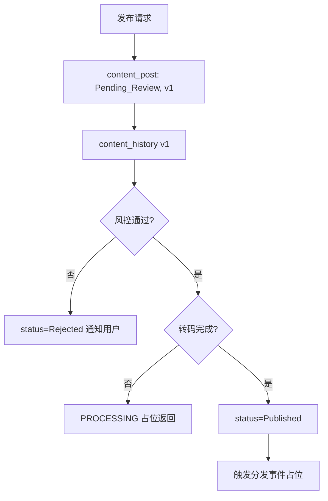
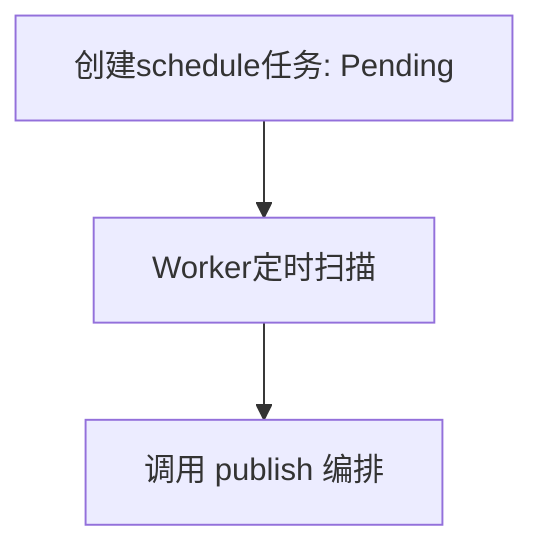

# 内容发布与媒体接口实现链路说明（执行者：Codex / 日期：2024-XX-XX）

## 1. 接口与领域映射（保持现有契约）
- 获取上传凭证：POST `/api/v1/media/upload/session` → `ContentController.createUploadSession` → `IContentService.createUploadSession` → 生成上传 URL/token/sessionId（占位）。
- 保存草稿：PUT `/api/v1/content/draft` → `ContentController.saveDraft` → `IContentService.saveDraft` → `content_draft` upsert，返回 `draft_id`。
- 发布内容：POST `/api/v1/content/publish` → `ContentController.publish` → `IContentService.publish` → `content_post` 插入 Status=Pending_Review, version=1 + `content_history` v1 → 风控占位校验 → 媒体占位转码检查 → 通过后更新为 Published，并触发分发事件占位。
- 删除内容：DELETE `/api/v1/content/{postId}` → `IContentService.delete` → 校验 userId 归属后软删（status=Deleted）。
- 定时发布：POST `/api/v1/content/schedule` → `IContentService.schedule` → 写入 `content_schedule` task，status=Pending（后续 Worker 扫描触发发布）。
- 草稿同步：POST `/api/v1/content/draft/{draftId}/sync` → `IContentService.syncDraft` → 基于 clientVersion 做并发版本保护（旧版本拒绝覆盖），upsert 草稿。
- 历史列表：GET `/api/v1/content/{postId}/history` → `IContentService.history` → 查 `content_history` 按版本降序。
- 回滚版本：POST `/api/v1/content/{postId}/rollback` → `IContentService.rollback` → 校验目标版本存在 → 更新主表内容并追加新版本号+历史。

## 2. 状态机与数据流
- 状态：Draft(0) → Pending_Review(1) → Published(2) / Rejected(3) → Deleted(6)；定时发布 Pending_Schedule(4) → 到点进入 Pending_Review。
- 数据流：上传会话 → 客户端上传 → 发布请求 → `content_post`/`content_history` 写入 → 风控占位 → 媒体占位转码 → Published → 分发事件占位。

## 3. 数据表映射
- `content_post`：post_id(userId分片)、user_id、content_text、media_type、media_info JSON、location_info JSON、status、visibility、version_num、is_edited、create_time。
- `content_history`：history_id、post_id、version_num、snapshot_content、snapshot_media JSON、create_time。
- `content_draft`：draft_id、user_id、draft_content、device_id、client_version、update_time。
- `content_schedule`：task_id、user_id、content_data、schedule_time、status、retry_count。

## 4. 流程图（内容发布主线）

## 5. 流程图（定时发布）

## 6. 有效性判断
- 契约匹配：接口路径/字段未变，Controller 复用。
- 数据一致性：发布/回滚写 `content_history`，版本自增；删除软删并校验 owner。
- 状态机：覆盖草稿/审核/发布/拒绝/删除/定时，含占位风控与转码。
- 并发控制：草稿同步基于 clientVersion 防止旧版本覆盖。

## 7. 剩余不足
- 风控/转码/分发为占位实现（已落地端口，未接真实外部服务）。
- 定时任务 Worker 仅在领域层提供 `processSchedules`，未挂接调度器。
- 回滚未做 userId 透传校验（契约缺失，需上层补充）。

## 8. 后续改进方向
- 接入真实风控/转码/分发服务，替换占位端口。
- 上层契约补充 userId 透传与幂等 token，覆盖删除/回滚。
- 在应用层挂接调度器调用 `processSchedules`，并实现失败重试。
