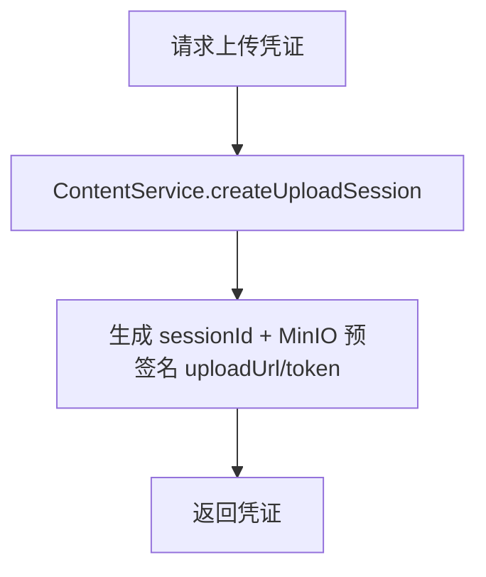
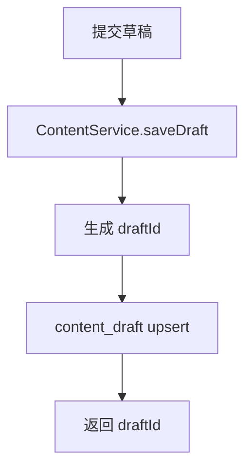
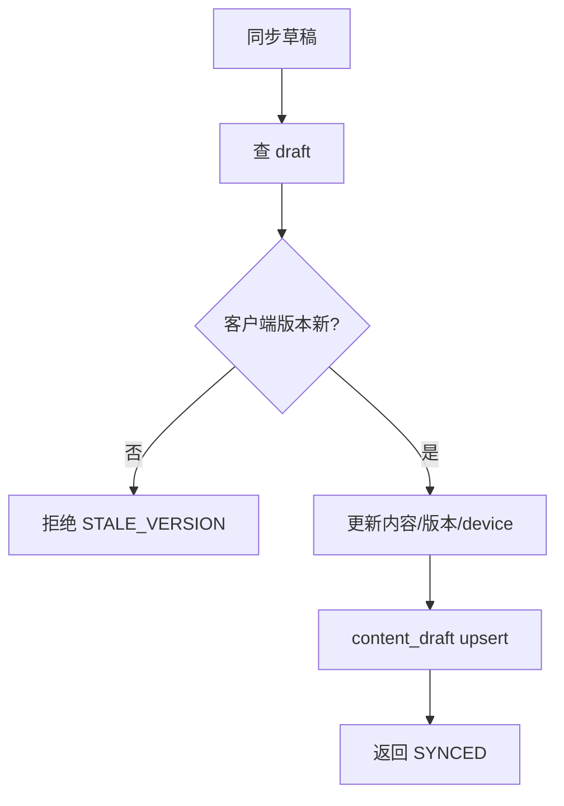
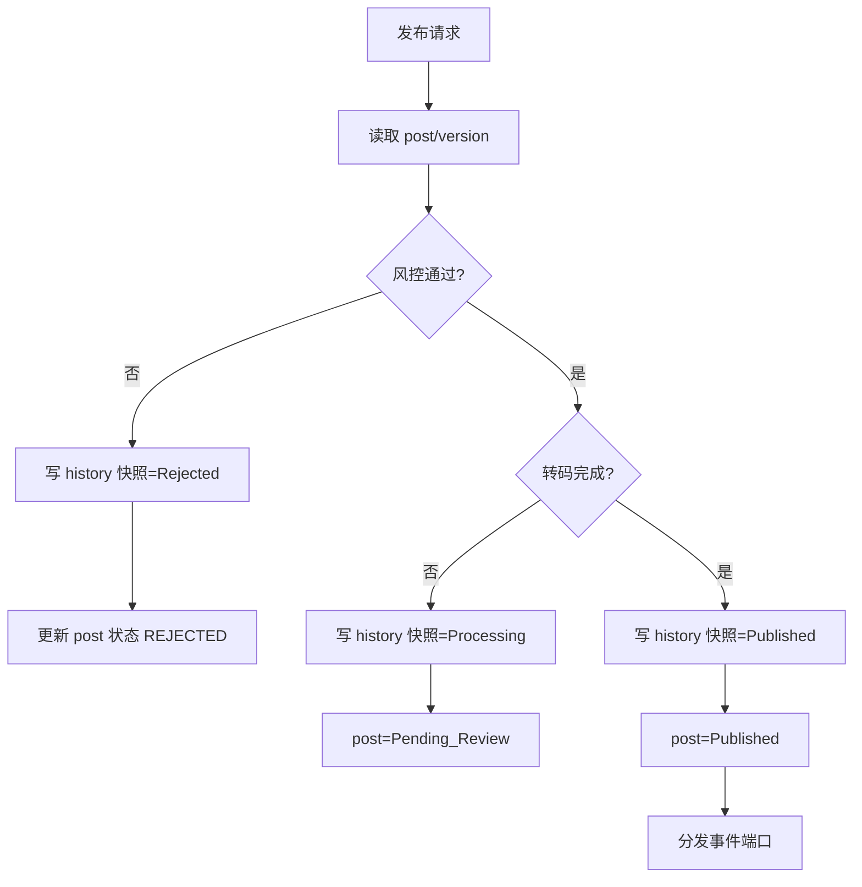
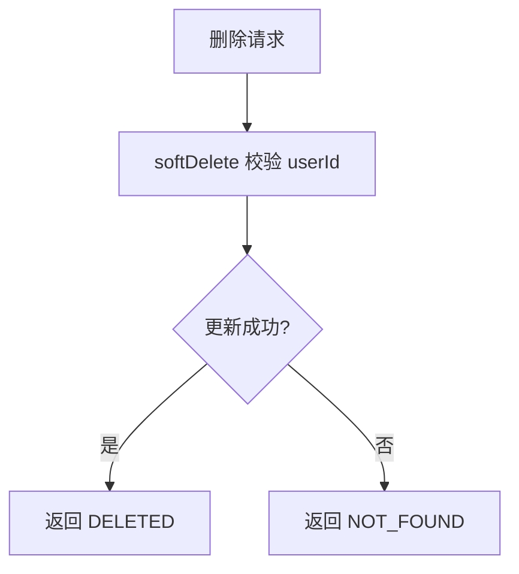
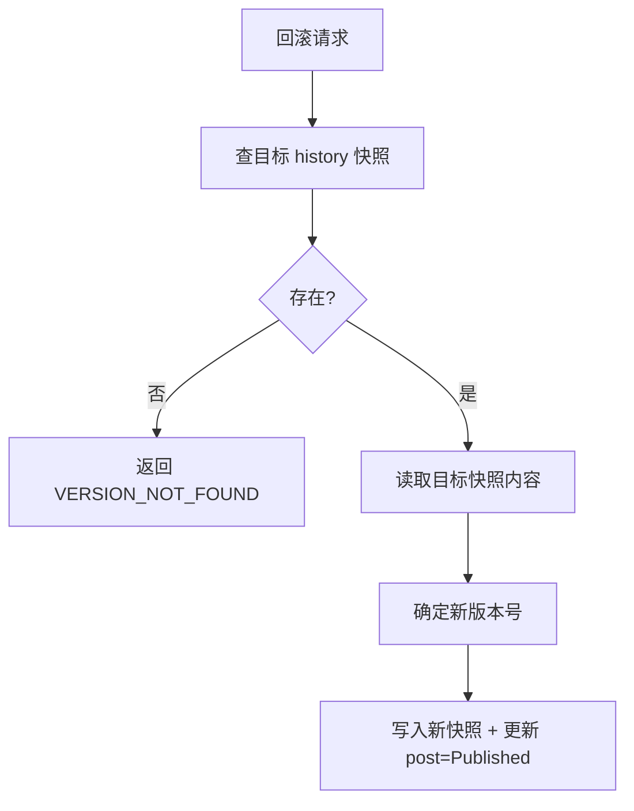

# 内容发布与媒体接口实现链路说明（全量快照，执行者：Codex / 日期：2026-01-09）

## 0. 本次完善（已落地）
- 版本存储：统一写 `content_history` 全量快照，移除 diff/patch/revision 链路。
- 历史查询：直接分页读取 `content_history`，offset/nextCursor 作为游标。
- 回滚流程：读取目标版本快照并写入新版本快照，更新 `content_post` 当前版本号。
- 并发控制：`content_post` 使用 version_num 乐观锁保证更新顺序。
- 定时发布稳态：幂等 token 入库校验，取消/变更入库可审计并强制 userId ACL；消费侧分布式锁/单活校验 + 指数退避+抖动重试（超限告警标记 alarmSent）；DLQ 消费增加值班路由日志；新增审计回查接口 GET `/api/v1/content/schedule/{taskId}?userId=`。
- 分布式互斥：`publish/rollback` 读取 post 使用 `FOR UPDATE`，结合分布式锁阻断并发漂移。
- 事务契约：`ContentRepository` 类级 REQUIRED 事务，读方法标注 readOnly；`ContentService.publish/rollback` 进入时校验必须处于事务内，防止非事务环境的半写。
- 媒体上传：`createUploadSession` 接入 MinIO 预签名 PUT URL（50MB 上限，fileType 白名单自动回退 `application/octet-stream`），配置项 `minio.media.*` 控制 endpoint/凭证/bucket/basePath/expirySeconds。

## 1. 接口与领域映射（保持现有契约）
- 分层约束（对齐 `.codex/DDD-ARCHITECTURE-SPECIFICATION.md`）：`api` 仅定义 DTO/Response 契约，`trigger` 只负责组装入参→调用 `domain` 服务；`domain` 仅依赖 `types` 并暴露 `ContentService` 领域服务；`infrastructure` 实现仓储/端口（内容/历史仓储、MQ、定时任务/对象存储），不可上行穿透。
- 获取上传凭证：POST `/api/v1/media/upload/session` → `ContentService.createUploadSession` → 调用存储端口生成 MinIO 预签名上传 URL/token/sessionId。
- 保存草稿：PUT `/api/v1/content/draft` → `ContentService.saveDraft/syncDraft` → `content_draft` upsert（clientVersion 防旧覆盖）。
- 发布内容：POST `/api/v1/content/publish` → `ContentService.publish` → 生成版本快照，写 `content_history`，更新 `content_post` 状态=Published，触发分发端口。
- 删除内容：DELETE `/api/v1/content/{postId}` → 校验 userId 软删 `content_post`。
- 定时发布：POST `/api/v1/content/schedule`（必填 userId）→ 生成 idempotent_token + 写 `content_schedule`（可取消/可变更/可审计）+ 发送 MQ 延时消息，延时到期由 Consumer 幂等执行 `executeSchedule` 直接走 publish 流程，DLQ 告警+补偿，消费前分布式锁/单活校验。
- 取消定时：POST `/api/v1/content/schedule/cancel` → 校验 userId/状态/所有权 → 写 is_canceled=1、审计日志。
- 变更定时：PATCH `/api/v1/content/schedule` → 校验 userId/状态/防重 token → 更新 schedule_time/内容摘要，写审计日志。
- 定时审计：GET `/api/v1/content/schedule/{taskId}?userId=` → 回查任务状态/重试次数/告警标记/最后错误。
- 历史列表：GET `/api/v1/content/{postId}/history?limit=&offset=` → 读取 `content_history` 快照，返回内容与版本+nextCursor。
- 回滚：POST `/api/v1/content/{postId}/rollback` → 读取目标快照 → 写入新版本快照并更新 `content_post`。

## 2. 状态机与数据流
- 状态：Draft(0) → Pending_Review(1) → Published(2) / Rejected(3) → Deleted(6)；定时：Scheduled(0) → 到点进入发布流 → Published(2)/Canceled(3)。
- 数据流：上传→发布请求→写 content_history 快照→风控→转码→Published→分发事件端口。

## 3. 版本存储策略（全量快照）
- 表：`content_history` 保存每个版本完整文本/媒体快照，`content_post` 维护当前版本号。
- 版本生成：发布/回滚都会写入新快照，`version_num` 递增。
- 并发控制：`content_post` 通过 version_num 乐观锁保证更新顺序。

## 4. 接口流程图（按方法链路）

**上传凭证 `/media/upload/session`**

- 使用方式：1) 客户端调用接口获取 `uploadUrl/token/sessionId`；2) 直接对 `uploadUrl` 发起 `PUT` 二进制（`Content-Type=fileType`），token 即 URL；3) 成功后将生成的对象键/sessionId 写入 `mediaInfo` 随发布/草稿保存。

**保存草稿 `/content/draft`**


**草稿同步 `/content/draft/{draftId}/sync`**


**发布内容 `/content/publish`**


**删除内容 `/content/{postId}`**


**定时发布 `/content/schedule` + MQ 延时队列（含幂等/分布式锁/告警/补偿/退避抖动）**
```mermaid
graph TD
    S[创建定时] --> S0[生成 idempotent_token=hash(userId+content+time)]
    S0 --> S1[content_schedule upsert(Pending, token)]
    S1 --> S2[发送 MQ 延时消息(taskId, delay)]
    C[MQ延时到期] --> L0[获取分布式锁/单活校验]
    L0 --> C0[Consumer 幂等校验 token/状态]
    C0 --> C1{已取消/已完成?}
    C1 -- 是 --> C1e[跳过/记录]
    C1 -- 否 --> C2[executeSchedule -> publish]
    C2 --> C3{publish成功?}
    C3 -- 是 --> C4[任务=完成, 写完成时间, 触发发布事件]
    C3 -- 否 --> C5[retry+1 写 last_error + 重试次数]
    C5 --> C6{重试超限?}
    C6 -- 否 --> C7[计算指数退避+抖动 -> 更新 schedule_time=nextRetry]
    C6 -- 是 --> DLQ[DLQ 触发告警通知→自动补偿工单（含人工审核），推送运维平台/值班群]
    Cancel[取消/变更请求] --> CA[contentService.cancelSchedule/updateSchedule -> 状态=取消/更新时间]
    CA --> CA1[写 is_canceled/新schedule_time，写变更日志/审计]
```

**历史查询 `/content/{postId}/history`（分页+限流+耗时告警）**
```mermaid
graph TD
    H[查询历史] --> H0[分页/限流校验(页大小上限，QPS限流)]
    H0 --> H1[读取 content_history 列表(按页，limit+offset，返回 nextCursor)]
    H1 --> H2[按版本升序组装 ContentHistoryVO]
    H2 --> H3[返回内容+版本]
```

**回滚 `/content/{postId}/rollback`**


## 5. 数据表映射（补充）
- `content_history`：history_id, post_id, version_num, snapshot_content, snapshot_media（全量版本快照）。
- `content_schedule`（见 docs/social_content_tables.sql）：task_id, user_id, content_data, schedule_time, status, retry_count, idempotent_token, is_canceled, last_error, alarm_sent（支撑取消/幂等/告警/补偿）。
- 兼容旧表：`content_post/content_draft/content_schedule` 保持。

## 6. 有效性
- 版本：发布/回滚均写入 `content_history` 全量快照。
- 历史/回滚：直接读取快照，接口契约不变。
- 状态机：发布/删除/定时/草稿同步均落库。
- 定时：idempotent_token、取消/变更、重试、DLQ 告警与补偿均入库可追溯；延迟消费幂等校验；分布式锁/单活保障消费。
- 并发与幂等：`content_post` 使用 version_num 乐观锁；定时发布消费前获取分布式锁/单活保障。

## 7. 剩余不足
- 风控/转码/分发为占位实现（已落地端口，未接真实外部服务）。
- 告警/工单通道仅通过日志占位，需接入统一监控/值班平台并落库告警时间。
- 观测性与测试缺口：缺少端到端发布/回滚/定时链路的指标与自动化冒烟。
- 定时重试/退避未持久化 next_retry_at 字段，依赖 schedule_time 复用，仍需上线后校验扫描窗口；自动补偿工单仍为占位。

## 8. 后续改进方向
- 观测性/测试：补充链路级指标（成功率/耗时/重试次数/缓存命中），落地发布/回滚/定时的自动化冒烟与回归用例。
- 定时发布：接入统一监控/告警平台，完善自动补偿流转到运维工单。 

## 9. MinIO 上传配置与调用
- 配置示例（application.yml）：
```
minio:
  media:
    endpoint: http://127.0.0.1:9000
    accessKey: yourAccessKey
    secretKey: yourSecretKey
    bucket: social-media
    basePath: content
    expirySeconds: 900
```
- 接口：POST `/api/v1/media/upload/session`，body `{fileType,fileSize,crc32}`，返回 `uploadUrl/token/sessionId`；`fileSize` 超过 50MB 拒绝；非白名单 `fileType` 自动降级为 `application/octet-stream`。
- 上传方式：前端直接对 `uploadUrl` 发起 `PUT` 二进制（可附带 `Content-Type=fileType`），无需额外鉴权；上传完成后将媒体摘要写入 `mediaInfo` 字段参与发布。

