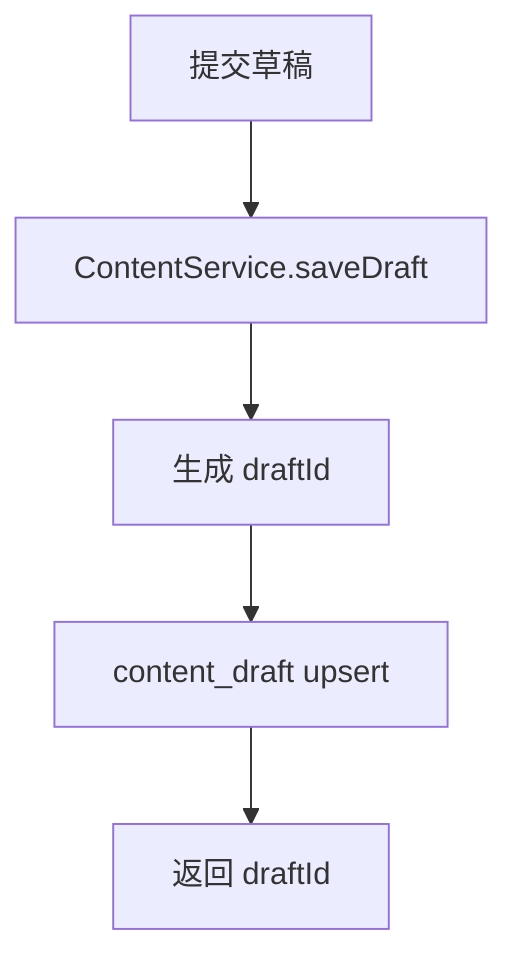
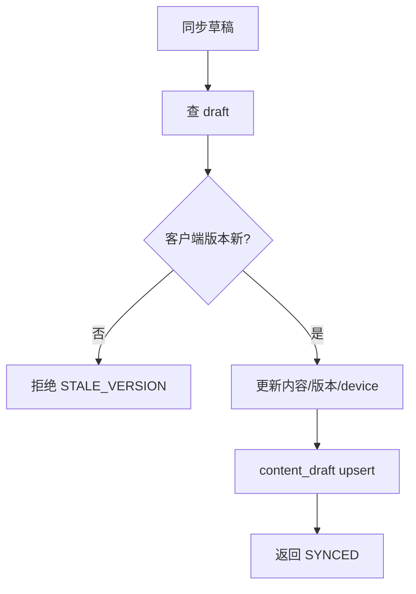
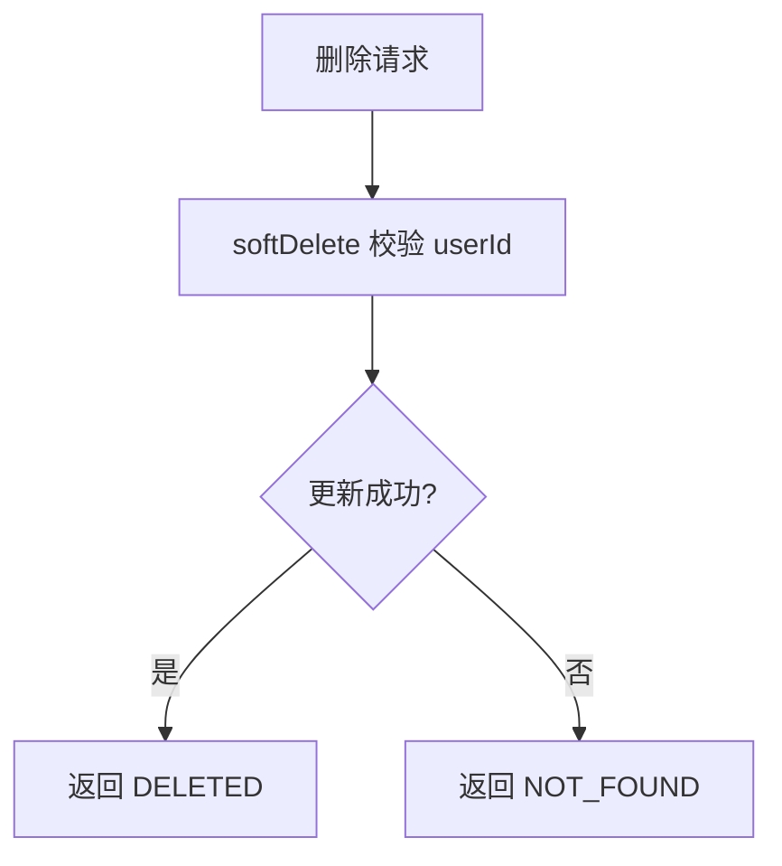
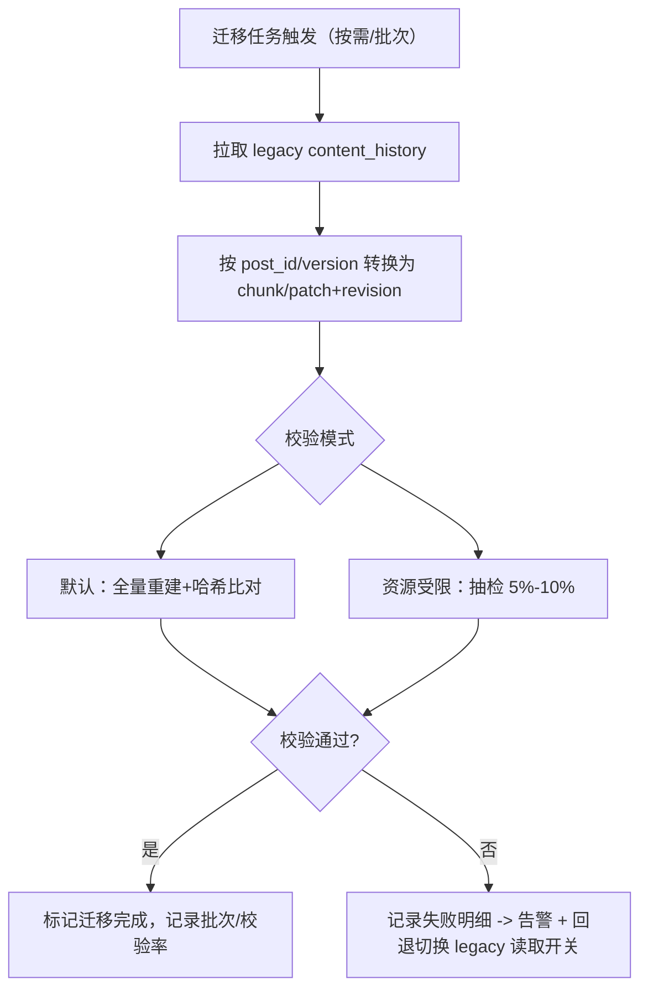

# 内容发布与媒体接口实现链路说明（基于基准+diff，执行者：Codex / 日期：2025-XX-XX）

## 0. 本次完善（已落地）
- diff 精度/性能：行级 unified diff + 大文本（>512 KB 或 diff>60%）直接存基准，重建缓存 LRU（最近 50 篇或 128 MB，按篇驱逐），新增监控指标（命中/驱逐/重建耗时）。
- 写入冲突防护：revision 持久化增加 version_num 乐观锁 + request_id 幂等键，防止并行版本。
- 历史迁移/查询稳态：按需/批次迁移 legacy `content_history`，默认全量哈希校验；历史重建接口增加分页/限流与耗时告警，定义重建 SLO（P95<500ms，P99<1500ms，错误率<0.1% 报警）；新增历史分页游标 offset/nextCursor，重建链长超过阈值自动截断并强制包含基准。
- 定时发布稳态：幂等 token 入库校验，取消/变更入库可审计并强制 userId ACL；消费侧分布式锁/单活校验 + 指数退避+抖动重试（超限告警标记 alarmSent）；DLQ 消费增加值班路由日志；新增审计回查接口 GET `/api/v1/content/schedule/{taskId}?userId=`。
- 存储治理：新增重平衡入口 `ContentService.rebalanceStorage(postId)`（链路过长时生成新的基准版本，降低补丁链长度），重建链路超限时自动截断保护。

## 1. 接口与领域映射（保持现有契约）
- 分层约束（对齐 `.codex/DDD-ARCHITECTURE-SPECIFICATION.md`）：`api` 仅定义 DTO/Response 契约，`trigger` 只负责组装入参→调用 `domain` 服务；`domain` 仅依赖 `types` 并暴露 `ContentService` 领域服务；`infrastructure` 实现仓储/端口（chunk/patch 存储、MQ、定时任务/对象存储），不可上行穿透。
- 获取上传凭证：POST `/api/v1/media/upload/session` → `ContentService.createUploadSession` → 占位返回 URL/token/sessionId。
- 保存草稿：PUT `/api/v1/content/draft` → `ContentService.saveDraft/syncDraft` → `content_draft` upsert（clientVersion 防旧覆盖）。
- 发布内容：POST `/api/v1/content/publish` → `ContentService.publish` → 生成版本（基准或补丁），写 `content_revision` + `content_chunk/patch`，更新 `content_post` 状态=Published，触发分发端口。
- 删除内容：DELETE `/api/v1/content/{postId}` → 校验 userId 软删 `content_post`。
- 定时发布：POST `/api/v1/content/schedule`（必填 userId）→ 生成 idempotent_token + 写 `content_schedule`（可取消/可变更/可审计）+ 发送 MQ 延时消息，延时到期由 Consumer 幂等执行 `executeSchedule` 直接走 publish 流程，DLQ 告警+补偿，消费前分布式锁/单活校验。
- 取消定时：POST `/api/v1/content/schedule/cancel` → 校验 userId/状态/所有权 → 写 is_canceled=1、审计日志。
- 变更定时：PATCH `/api/v1/content/schedule` → 校验 userId/状态/防重 token → 更新 schedule_time/内容摘要，写审计日志。
- 定时审计：GET `/api/v1/content/schedule/{taskId}?userId=` → 回查任务状态/重试次数/告警标记/最后错误。
- 历史列表：GET `/api/v1/content/{postId}/history?limit=&offset=` → 从 `content_revision` 还原文本，返回内容与版本+nextCursor。
- 回滚：POST `/api/v1/content/{postId}/rollback` → 重建目标版本文本 → 按策略写入新版本（基准或补丁）并更新 `content_post`。

## 2. 状态机与数据流
- 状态：Draft(0) → Pending_Review(1) → Published(2) / Rejected(3) → Deleted(6)；定时：Scheduled(0) → 到点进入发布流 → Published(2)/Canceled(3)。
- 数据流：上传→发布请求→写 revision（基准/patch）→风控→转码→Published→分发事件端口。

## 3. 版本存储策略（类似 Git）
- 表：`content_chunk`(基准全文 gzip+hash 去重)，`content_patch`(gzip 行级 unified diff)，`content_revision`(post_id, version_num, base_version, is_base, patch_hash, chunk_hash)。
- 基准间隔：每 20 版或 patch 体积 > 50% 切换为基准；大文本（>512 KB 或 diff 超 60%）直接落基准，避免补丁过大。
- 幂等/并发：chunk/patch 以 SHA-256 哈希唯一；revision 以 (post_id, version_num) 唯一并使用 version_num 乐观锁；写入带 request_id 幂等键防重复提交。
- 重建：找到 base → 解压 chunk → 顺序应用 patch 至目标版本；重建缓存使用 LRU（容量=最近 50 篇或 128 MB，按篇驱逐），命中则跳过重新解压/打补丁；监控指标：命中率、驱逐次数、重建耗时。

## 4. 接口流程图（按方法链路）

**上传凭证 `/media/upload/session`**
```mermaid
graph TD
    U[请求上传凭证] --> U1[ContentService.createUploadSession]
    U1 --> U2[生成 sessionId/token/uploadUrl(占位)]
    U2 --> U3[返回凭证]
```

**保存草稿 `/content/draft`**


**草稿同步 `/content/draft/{draftId}/sync`**


**发布内容 `/content/publish`**
```mermaid
graph TD
    P[发布请求] --> P0[查最新 revision]
    P0 --> P1[重建 prevContent]
    P1 --> P2{风控通过?}
    P2 -- 否 --> P3[写基准 revision=Rejected]
    P3 --> P4[更新 post 状态 REJECTED]
    P2 -- 是 --> P5{转码完成?}
    P5 -- 否 --> P6[写基准 revision=Processing]
    P6 --> P7[post=Pending_Review]
    P5 -- 是 --> P8{基准 or 补丁}
    P8 -- 基准 --> PB[chunk gzip+hash -> saveChunk + saveRevision(is_base=1)]
    P8 -- 补丁 --> PP[diff prev->curr gzip -> savePatch + saveRevision(base_version)]
    PB --> P9[post=Published]
    PP --> P9
    P9 --> P10[分发事件端口]
```

**删除内容 `/content/{postId}`**


**定时发布 `/content/schedule` + MQ 延时队列（含幂等/分布式锁/告警/补偿/退避抖动）**
```mermaid
graph TD
    S[创建定时] --> S0[生成 idempotent_token=hash(userId+content+time)]
    S0 --> S1[content_schedule upsert(Pending, token)]
    S1 --> S2[发送 MQ 延时消息(taskId, delay)]
    C[MQ延时到期] --> L0[获取分布式锁/单活校验]
    L0 --> C0[Consumer 幂等校验 token/状态]
    C0 --> C1{已取消/已完成?}
    C1 -- 是 --> C1e[跳过/记录]
    C1 -- 否 --> C2[executeSchedule -> publish]
    C2 --> C3{publish成功?}
    C3 -- 是 --> C4[任务=完成, 写完成时间, 触发发布事件]
    C3 -- 否 --> C5[retry+1 写 last_error + 重试次数]
    C5 --> C6{重试超限?}
    C6 -- 否 --> C7[计算指数退避+抖动 -> 更新 schedule_time=nextRetry]
    C6 -- 是 --> DLQ[DLQ 触发告警通知→自动补偿工单（含人工审核），推送运维平台/值班群]
    Cancel[取消/变更请求] --> CA[contentService.cancelSchedule/updateSchedule -> 状态=取消/更新时间]
    CA --> CA1[写 is_canceled/新schedule_time，写变更日志/审计]
```

**历史查询 `/content/{postId}/history`（分页+限流+耗时告警+链长截断）**
```mermaid
graph TD
    H[查询历史] --> H0[分页/限流校验(页大小上限，QPS限流)]
    H0 --> H1[读取 revisions 列表(按页，limit+offset，返回 nextCursor)]
    H1 --> H2[按版本升序重建: 基准chunk -> 依次apply patch]
    H2 --> H2b{链长>阈值?}
    H2b -- 是 --> H2c[截断链路并强制包含最近基准]
    H2 --> H3{重建耗时>SLO? (P95<500ms, P99<1500ms)}
    H3 -- 否 --> H4[组装 ContentHistoryVO 返回内容+版本]
    H3 -- 是 --> H5[返回结果+记录告警指标(P99耗时/失败率)]
```

**回滚 `/content/{postId}/rollback`**
```mermaid
graph TD
    R[回滚请求] --> R1[查目标 revision]
    R1 --> R2{存在?}
    R2 -- 否 --> R3[返回 VERSION_NOT_FOUND]
    R2 -- 是 --> R4[重建目标文本]
    R4 --> R5[确定新版本号]
    R5 --> R6{基准或补丁?}
    R6 -- 基准 --> RB[saveChunk + saveRevision(is_base=1)]
    R6 -- 补丁 --> RP[diff prev->target gzip + savePatch + saveRevision(base_version)]
    RB --> R7[更新 post=Published 新版本]
    RP --> R7
```

**历史迁移 + 校验（默认全量哈希）**


## 5. 数据表映射（补充）
- `content_chunk`：chunk_hash, chunk_data(gzip), size, compress_algo。
- `content_patch`：patch_hash, patch_data(gzip unified diff), size, compress_algo。
- `content_revision`：post_id, version_num, base_version, is_base, patch_hash, chunk_hash。
- `content_schedule`（见 docs/social_content_tables.sql）：task_id, user_id, content_data, schedule_time, status, retry_count, idempotent_token, is_canceled, last_error, alarm_sent（支撑取消/幂等/告警/补偿）。
- 兼容旧表：`content_post/content_draft/content_schedule` 保持。

## 6. 有效性
- 去重：相同文本基准/补丁按哈希唯一存储。
- 历史/回滚：通过基准+补丁重建，接口契约不变。
- 状态机：发布/删除/定时/草稿同步均落库。
- 定时：idempotent_token、取消/变更、重试、DLQ 告警与补偿均入库可追溯；延迟消费幂等校验；分布式锁/单活保障消费。
- 并发与幂等：revision 写入使用 version_num 乐观锁 + request_id 幂等键；历史重建分页/限流并按 SLO 告警；定时发布消费前获取分布式锁/单活保障。

## 7. 剩余不足
- 风控/转码/分发为占位实现（已落地端口，未接真实外部服务）。
- 删除/回滚 userId 鉴权仍依赖上层透传，领域层未显式校验。
- 告警/工单通道仅通过日志占位，需接入统一监控/值班平台并落库告警时间。
- 基准/补丁重平衡仅提供入口（rebuild 基准版）未接调度器；补丁/基准清理、冷数据归档策略待补全。
- 观测性与测试缺口：缺少端到端发布/回滚/定时链路的指标与自动化冒烟。
- 重建缓存/LRU 未暴露命中率、驱逐、容量水位监控，也未做持久化或预热策略，遇到冷启动重建仍可能慢。
- 定时重试/退避未持久化 next_retry_at 字段，依赖 schedule_time 复用，仍需上线后校验扫描窗口；自动补偿工单仍为占位。

## 8. 后续改进方向
- diff：引入分块/语义 diff 与 Bloom 预筛，进一步降低大文本补丁体积。
- 迁移：在资源受限抽检模式下，增加自动补偿与审计报表。
- 安全：在领域层补充 userId 校验契约描述，上层/trigger 强制传递；接入真实风控/转码/分发。
- 存储治理：定义基准重平衡/冷数据清理任务（按版本跨度/时间），结合监控阈值自动触发，补丁/基准孤儿清理。
- 观测性/测试：补充链路级指标（成功率/耗时/重试次数/缓存命中），落地发布/回滚/定时的自动化冒烟与回归用例。
- 定时发布：接入统一监控/告警平台，完善自动补偿流转到运维工单。 
.codex\DDD-ARCHITECTURE-SPECIFICATION.md

## 9. 代码审查（2025-XX-XX，依据 `.codex/DDD-ARCHITECTURE-SPECIFICATION.md`）
- 🟥 版本链路不可用：`ContentService.publish` 总是使用 `socialIdPort.nextId()` 生成全新 `postId` 再去查最新版本（project/nexus/nexus-domain/src/main/java/cn/nexus/domain/social/service/ContentService.java:105），导致永远找不到历史版本、无法追加新版本，也就无法支撑 `history`/`rollback` 的多版本业务。应改为接收已有 `postId`（或创建后复用），保证版本链按同一聚合累加。
- 🟥 版本写入缺少并发防护：`ContentRepository.saveRevision` 直接 insert（project/nexus/nexus-infrastructure/src/main/java/cn/nexus/infrastructure/adapter/social/repository/ContentRepository.java:90），`ContentService.saveRevision` 也未做 `version_num` 乐观锁或 `request_id` 幂等校验，`updatePostStatusAndContent` 仅按版本号-1 预期更新但不检查并发写。并发发布/回滚会产生重复版本或部分更新，违反文档第3节“仓储实现负责事务边界+幂等”。需在仓储层加唯一约束与乐观锁，领域层传递 requestId 幂等键并处理冲突。
- 🟧 事务一致性缺失：发布/回滚链路涉及 revision、chunk/patch、post、history 多表写入，但领域层未使用事务（ContentService 无 @Transactional），仓储层只有 `savePost` 标注事务，其余方法裸写。任一写失败会造成链路残缺（例如写了 revision 未写 post），违背 DDD “聚合内操作为一个一致性单元”。应在应用服务或仓储实现对跨表写入加事务。
- 🟧 鉴权缺口：删除/回滚/历史查询未在领域层校验 `userId` 所有权，仅依赖上层透传（如 delete 直接软删，rollback/history 不校验用户），与文档“接口契约/ACL 由 domain 保证”不符。需在领域层显式校验请求用户与 post 所属一致，否则返回 NO_PERMISSION。
- 🟨 可观测性与重建健壮性：`rebuildContent` 缺失链路上报和缺块/补丁失败处理，出现空 chunk/patch 时直接返回空串（ContentService.java:272），易导致静默返回空内容。应记录告警并短路失败，符合文档对“重建耗时/失败率”监控要求。

### 9.1 二次CR（2025-XX-XX）
- 🟥 编译错误：`rollback` 方法内重复声明 `ContentPostEntity post`（project/nexus/nexus-domain/src/main/java/cn/nexus/domain/social/service/ContentService.java:289, 295），Java 不允许同作用域重定义变量，当前代码不可编译，需移除第二次声明并复用已查询的 `post`。
- 🟧 并发/幂等仍不足：`saveRevision` 只在内存中 `findRevision` 判断，缺少数据库唯一约束与事务内加锁，两个并发发布仍可能同时插入同一 `(post_id,version_num)`。应在存储层加唯一键并捕获冲突或使用版本号乐观锁更新。
- 🟨 ACL 体验：`history` 权限不符时返回空列表而非显式 `NO_PERMISSION`，调用方难以区分“无权限”与“无数据”，与“Never break userspace”不冲突但可读性差，建议返回明确状态码。
- 🟨 重建降级：缺块/补丁时只打印错误并返回空/原文，无上报或熔断，仍有静默风险（ContentService.rebuildContent）。需按 SLO 记录监控并对上层返回错误状态。

### 9.2 三次CR（2025-XX-XX）
- 🟧 数据并发保护仍不充分：`publish/rollback` 仅使用 JVM 级 `ConcurrentHashMap` 对 `postId` 加锁（同文件：69-85），在多实例或分布式部署下无效，仍可能出现并发写同一版本。仓储层 `saveRevision` 捕获 `DuplicateKeyException` 但基础设施未见数据库唯一约束校验（ContentRepository 仍直接 insert）。需在 DB 层添加 `(post_id,version_num)` 唯一键并在仓储层处理冲突，或者使用版本号乐观锁更新。 
- 🟨 ACL 体验：`history` 无权限时仍返回空列表（265-270）仅打印 warn，调用方无法分辨无权限 vs 无数据，建议返回显式状态或错误码，避免业务误判。
- 🟨 可观测性占位但未落监控：`recordRebuildFailure` 仅日志 warn，未计数/未上报；缺块/补丁时仍返回空或部分内容（651-667），上层无法感知重建失败。需补监控指标或错误码，满足文档 SLO 约束。
- 🟨 业务契约：发布/回滚锁粒度为单实例内存锁；多实例下“Never break userspace”风险未消除，定时任务并发消费仍可能双写版本。需结合分布式锁或 DB 约束完善。

#### 数据并发保护不足的具体位置
- 内存锁局限：`publish` 与 `rollback` 仅依赖 `postLocks`（project/nexus/nexus-domain/src/main/java/cn/nexus/domain/social/service/ContentService.java:70-85），无法跨实例互斥，同一内容在多实例同时写仍会竞争。
- 缺少 DB 唯一/乐观锁：`ContentRepository.saveRevision` 直接 insert（project/nexus/nexus-infrastructure/src/main/java/cn/nexus/infrastructure/adapter/social/repository/ContentRepository.java:193-203），`saveRevision` 只是内存查找+捕获 DuplicateKey，但数据库层未声明 `(post_id,version_num)` 唯一键，也没有版本号条件更新。
- 定时/发布并发：`processSchedules/executeSchedule` 调用 `publish(null, ...)`（ContentService.java:333, 404）未加分布式锁，延时消息在多消费者/多实例下仍可能重复落版本。
- 新建/保存帖子无唯一约束：`upsertPost` 先查再 insert（ContentService.java:707-728）依赖应用逻辑，`content_post` 未声明唯一校验 userId+postId 并无幂等键，多实例并发创建相同 postId 可能重复。
- 定时任务幂等依赖应用级 token：`schedule` 使用哈希 token 查重（ContentService.java:176-214），`content_schedule` 未声明 token 唯一索引，多个实例同时提交仍可能重复写任务。
- 历史/回滚版本获取无分布式保护：`findLatestRevision`/`findRevision` + 本地锁组合，缺少数据库层乐观锁/唯一约束，多个实例同时回滚/发布可能产生空洞或重复版本。
- 草稿写入无版本保护：`saveDraft/syncDraft` 仅做客户端版本比较（ContentService.java:117-174），`content_draft` 未有版本号或乐观锁，多个设备并发同步仍可能互踩。
- 定时状态更新缺 CAS：`updateScheduleStatus/updateSchedule/cancelSchedule`（ContentRepository.java:142-161, 155-158）直接按 taskId 更新，无当前状态判断；多实例/多消费者可能互相覆盖状态或重试计数。
- 迁移任务无并发防护：`migrateLegacyHistory`（ContentService.java:580-607）可被多线程/多实例同时触发，可能重复写 revision/历史。
