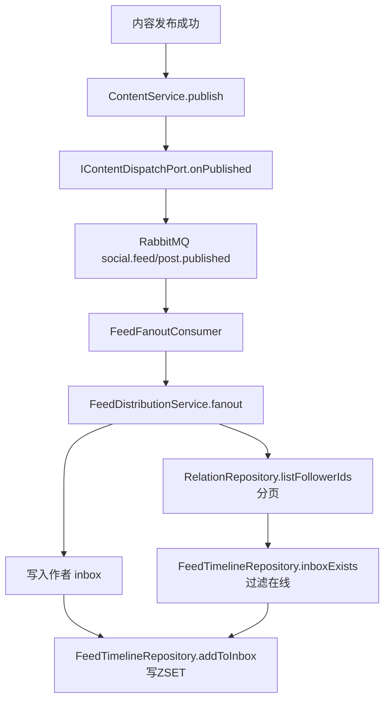
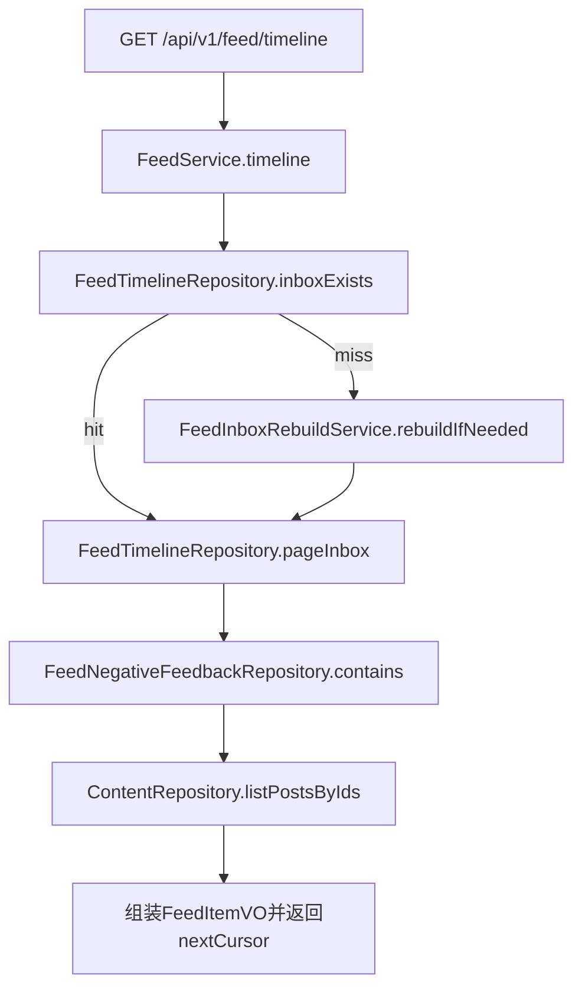
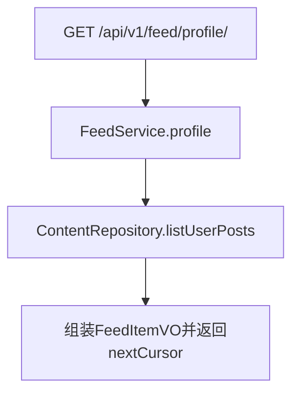
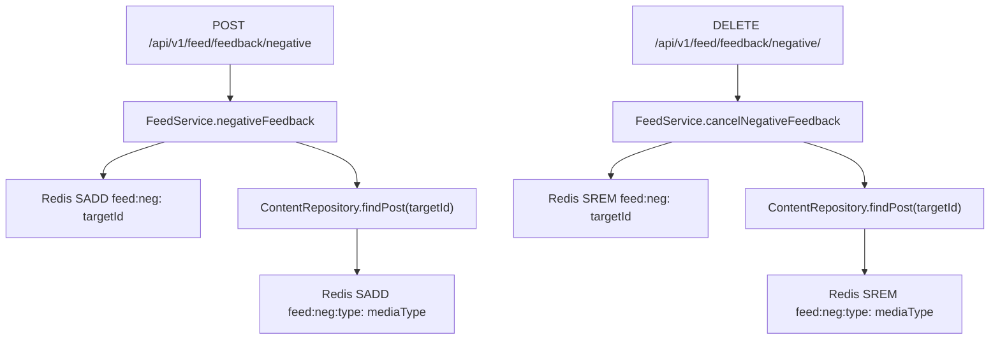

# 分发与 Feed 服务实现链路说明（Phase 1 + Phase 2，执行者：Codex / 日期：2026-01-13）

> 本文档是 **“当前代码实现的快照说明”**，用于 Code Review/交接/验收。  
> 详细设计与 Phase 2/3 方案请看：`.codex/distribution-feed-implementation.md`（方案文档）。

## 0. 本次完善（已落地）
- 写扩散链路：`ContentService.publish` 成功分支 → `IContentDispatchPort.onPublished` → RabbitMQ → `FeedFanoutConsumer` → `FeedDistributionService.fanout` → Redis InboxTimeline 写入。
- 消息模型：新增 `PostPublishedEvent`（`nexus-types`），承载 `postId/authorId/publishTimeMs`。
- MQ 拓扑：新增 `FeedFanoutConfig` 声明 `social.feed`（DirectExchange）+ `feed.post.published.queue` + `post.published` 绑定。
- 粉丝分页：补齐 `IFollowerDao.selectFollowerIds` + `IRelationRepository.listFollowerIds`，fanout 分页拉粉丝避免一次性全量。
- InboxTimeline：新增 `IFeedTimelineRepository` + Redis 实现（ZSET：member=postId，score=publishTimeMs），支持 cursor 分页、NoMore 哨兵、读侧刷新 TTL 与原子化重建。
- 负反馈：扩展 `IFeedNegativeFeedbackRepository`，同时支持 **postId** 维度与 **内容类型（content_post.media_type）** 维度过滤（Redis SET）。
- 读侧回表：扩展 `IContentPostDao`/`ContentPostMapper.xml` 支持 `selectByIds`（timeline 批量回表）与 `selectByUserPage`（个人页 cursor 分页）。
- FeedService：替换占位实现为真实实现（timeline/profile/负反馈），保持 `/api/v1/feed/*` 契约与 DTO 不变。
- Phase 2：在线推 / 离线拉（方案 A）：以 inbox key 是否存在定义在线；fanout 仅写入在线用户；timeline 首页 inbox miss 自动重建（原子 replaceInbox + NoMore）。
- 修复：离线重建关注列表回源 —— `RelationAdjacencyCachePort.listFollowing` 在缓存 key miss 或 relation 表缺失时，从 `user_follower` 回源“我关注了谁”，避免重建空 inbox。

## 1. 接口与领域映射（保持现有契约）
- 分层约束（对齐 `.codex/DDD-ARCHITECTURE-SPECIFICATION.md`）：`api` 定义 DTO/Response；`trigger` 只做入参组装与调用；`domain` 只依赖端口/仓储接口并编排业务；`infrastructure` 实现 MyBatis/Redis/RabbitMQ 细节，不允许反向依赖。

### 1.1 Feed HTTP 契约 → Domain 服务
- 关注页：GET `/api/v1/feed/timeline` → `IFeedService.timeline(userId, cursor, limit, feedType)`
- 个人页：GET `/api/v1/feed/profile/{targetId}` → `IFeedService.profile(targetId, visitorId, cursor, limit)`
- 负反馈：POST `/api/v1/feed/feedback/negative` → `IFeedService.negativeFeedback(userId, targetId, type, reasonCode, extraTags)`
- 撤销负反馈：DELETE `/api/v1/feed/feedback/negative/{targetId}` → `IFeedService.cancelNegativeFeedback(userId, targetId)`

补充（已拍板）：`userId/visitorId` 从登录态/网关上下文注入（Header：`X-User-Id`），不要信客户端自己报的 userId。为了不改既有 DTO 字段，Controller 应忽略 DTO 里的 userId/visitorId，统一从 `UserContext.requireUserId()` 获取后再调用 domain。

### 1.2 内容发布 → Feed 写扩散（系统内触发）
- 发布成功分支：`ContentService.publish` → `IContentDispatchPort.onPublished(postId, userId)`
- 基础设施实现：`ContentDispatchPort.onPublished` 构造 `PostPublishedEvent` 并 `convertAndSend("social.feed","post.published", event)`
- 消费入口：`FeedFanoutConsumer`（`@RabbitListener(queues = FeedFanoutConfig.QUEUE)`）→ `IFeedDistributionService.fanout(event)`

## 2. 数据流与幂等性
### 2.1 写链路（fanout）
- 输入：`PostPublishedEvent(postId, authorId, publishTimeMs)`
- fanout 规则（Phase 2）：
  - 作者无条件写入 inbox；粉丝仅写入 inbox key 存在的用户（在线推）
  - 分页拉取粉丝列表（来自 `user_follower` 反向表）并对在线粉丝写入 inbox
- 幂等性：
  - MQ 至少一次投递可能重复消费
  - Redis ZSET 的 `ZADD` 对同一 member（postId）天然幂等（重复写不会产生重复条目）
- TTL 语义（Phase 2）：
  - 写入不刷新 TTL（避免“关注的人越爱发，我越离线却永远在线”的资源泄露）
  - TTL 由读侧 `pageInbox` 刷新，离线用户 inbox key 过期后不再接收 pushes，回归再重建

### 2.2 读链路（timeline/profile）
- timeline：
  - 首页（cursor 为空）且 inbox key miss：触发 `FeedInboxRebuildService.rebuildIfNeeded(userId)` 离线重建
  - Redis inbox 分页得到 `postIds`（cursor=上一页最后一个 postId）
  - 负反馈过滤（两层）：
    - postId 维度：对每个 postId 执行 `SISMEMBER feed:neg:{userId} postId`
    - 内容类型维度：读取 `feed:neg:type:{userId}`，回表后按 `content_post.media_type` 过滤
  - MySQL 批量回表：`content_post` 按 `postIds` 顺序组装，映射为 `FeedItemVO`
  - `nextCursor` 取 Redis page 的 lastPostId（不因过滤而改变）
- profile：
  - MySQL cursor 分页：`selectByUserPage(userId, cursorTime, cursorPostId, limit)`（`ORDER BY create_time DESC, post_id DESC`）
  - `nextCursor` 生成规则：`{lastCreateTimeMs}:{lastPostId}`

### 2.3 Cursor 协议（Phase 1）
- timeline：`cursor` / `nextCursor` = **postId 字符串**
  - 优点：实现简单，配合 `ZREVRANK` 可稳定翻页
  - 限制：当 cursor 被裁剪导致找不到时，本实现返回空页（可作为后续优化点：断流修复）
- profile：`cursor` / `nextCursor` = **"{createTimeMs}:{postId}"**
  - 目的：解决同一时间戳多条内容导致的重复/漏页

## 3. 存储策略（InboxTimeline + 真值回表）
### 3.1 真值源
- MySQL `content_post`：内容真值（读侧回表只取 `status=2` 的已发布内容）
- Redis：只存 timeline 索引与负反馈集合，不存内容正文真值

### 3.2 Redis Key 规范（统一）
- InboxTimeline：`feed:inbox:{userId}`（ZSET）
  - member：`postId`（字符串）
  - score：`publishTimeMs`（毫秒时间戳）
- 负反馈：`feed:neg:{userId}`（SET）
  - member：`targetId`（Phase 1 约定通常为 postId）
- 负反馈内容类型：`feed:neg:type:{userId}`（SET）
  - member：`mediaType`（来自 `content_post.media_type`）

### 3.3 Inbox 保留策略（配置）
- `feed.inbox.maxSize`：默认 1000（超出裁剪最旧数据）
- `feed.inbox.ttlDays`：默认 30（EXPIRE，读侧刷新；离线后自然过期）

## 4. 接口流程图（按方法链路）

**发布内容 → fanout 写扩散**


**关注页 timeline（Redis 索引 + MySQL 回表 + 负反馈过滤）**


**个人页 profile（MySQL cursor 分页）**


**负反馈 submit/cancel**


## 5. 表/队列/缓存映射（补充）
### 5.1 MySQL
- `content_post`：读侧回表（timeline/profile 只取 `status=2`）
- `user_follower`：fanout 粉丝列表来源（反向表：谁关注了我）

### 5.2 RabbitMQ
- Exchange：`social.feed`（Direct）
- Queue：`feed.post.published.queue`
- RoutingKey：`post.published`

### 5.3 Redis
- `feed:inbox:{userId}`：关注页 InboxTimeline（ZSET）
- `feed:neg:{userId}`：负反馈集合（SET）
- `feed:neg:type:{userId}`：负反馈内容类型集合（SET，`content_post.media_type`）

## 6. 有效性（当前已满足/可验证）
- 契约：`/api/v1/feed/*` 路由与 DTO 字段保持不变，只替换占位实现为真实实现。
- 幂等：fanout 重复消费不会产生重复 timeline 条目（ZSET member 幂等）。
- 顺序：timeline 回表按 `postIds` 入参顺序重排，避免 IN 查询导致顺序漂移。
- 编译/测试：未执行（按用户要求跳过本地验证）。

建议本地验收（需要 MySQL+Redis+RabbitMQ）：
1) A 关注 B（写入 `user_follower`）
2) B 发布内容（触发 MQ fanout）
3) A 调用 timeline 连续翻页 3 次（验证不重复/不漏）
4) A 对某 postId 提交负反馈后再次拉取（验证过滤生效）再撤销验证恢复

## 7. 剩余不足（Phase 1 之外 / 非阻塞）
- 对标关注流“生产级演进”的改进方案已写成可落地实现说明：详见 `.codex/distribution-feed-implementation.md` 的 `10.5.1` ~ `10.5.7`；性能/可运维改进详见 `10.6`。
- Phase 3 未实现：推荐与排序（关注 + 推荐召回、排序演进），但实现级方案已补齐，详见 `.codex/distribution-feed-implementation.md` 的 `11`。
- follow 的即时回填未做：`RelationEventListener.handleFollow` 目前仍是占位触达，最小补偿方案详见 `.codex/distribution-feed-implementation.md` 的 `10.5.2`。
- cursor 断流修复未做：当 cursor 对应 member 被裁剪导致 `ZREVRANK` 找不到时，目前返回空页（可选：升级为 Max_ID + `ZREVRANGEBYSCORE`，详见 `.codex/distribution-feed-implementation.md` 的 `10.5.6`）。
- fanout 大任务切片未做：在线粉丝超大时可拆 `FeedFanoutTask` 并行消费，失败重试只重试这一片（详见 `.codex/distribution-feed-implementation.md` 的 `10.5.1`）。
- MQ 序列化未显式统一为 JSON（详见 `.codex/distribution-feed-implementation.md` 的 `10.6.1`）。
- timeline 负反馈过滤是逐条 `SISMEMBER`（N 次 Redis 调用），高 QPS 场景可考虑批量化策略（详见 `.codex/distribution-feed-implementation.md` 的 `10.6.2`）。
- 大 V 隔离/聚合池/读时修复异步清理等仍未落地（详见 `.codex/distribution-feed-implementation.md` 的 `10.5.3` ~ `10.5.7`）。
- 内容负反馈已升级为“内容类型（media_type）”维度；若要更细粒度“业务类目/标签”，详见 `.codex/distribution-feed-implementation.md` 的 `10.6.6`。

## 8. 配置示例（application-dev.yml）
```yml
feed:
  inbox:
    maxSize: 1000
    ttlDays: 30
  fanout:
    batchSize: 200
  rebuild:
    perFollowingLimit: 20
    inboxSize: 200
    maxFollowings: 2000
    lockSeconds: 30
```

## 9. 关键文件清单（便于 CR）
- 发布→分发入口：`project/nexus/nexus-domain/src/main/java/cn/nexus/domain/social/service/ContentService.java`
- 分发端口实现：`project/nexus/nexus-infrastructure/src/main/java/cn/nexus/infrastructure/adapter/social/port/ContentDispatchPort.java`
- MQ 拓扑：`project/nexus/nexus-trigger/src/main/java/cn/nexus/trigger/mq/config/FeedFanoutConfig.java`
- MQ 消费者：`project/nexus/nexus-trigger/src/main/java/cn/nexus/trigger/mq/consumer/FeedFanoutConsumer.java`
- fanout 服务：`project/nexus/nexus-domain/src/main/java/cn/nexus/domain/social/service/FeedDistributionService.java`
- inbox 重建服务：`project/nexus/nexus-domain/src/main/java/cn/nexus/domain/social/service/FeedInboxRebuildService.java`
- inbox 重建接口：`project/nexus/nexus-domain/src/main/java/cn/nexus/domain/social/service/IFeedInboxRebuildService.java`
- inbox 条目 VO：`project/nexus/nexus-domain/src/main/java/cn/nexus/domain/social/model/valobj/FeedInboxEntryVO.java`
- 粉丝分页：`project/nexus/nexus-infrastructure/src/main/java/cn/nexus/infrastructure/dao/social/IFollowerDao.java` + `project/nexus/nexus-infrastructure/src/main/resources/mapper/social/FollowerMapper.xml`
- 关注邻接缓存/回源兜底：`project/nexus/nexus-infrastructure/src/main/java/cn/nexus/infrastructure/adapter/social/port/RelationAdjacencyCachePort.java`
- Redis inbox：`project/nexus/nexus-infrastructure/src/main/java/cn/nexus/infrastructure/adapter/social/repository/FeedTimelineRepository.java`
- Redis 负反馈：`project/nexus/nexus-infrastructure/src/main/java/cn/nexus/infrastructure/adapter/social/repository/FeedNegativeFeedbackRepository.java`
- FeedService：`project/nexus/nexus-domain/src/main/java/cn/nexus/domain/social/service/FeedService.java`
- Content 回表 SQL：`project/nexus/nexus-infrastructure/src/main/resources/mapper/social/ContentPostMapper.xml`
