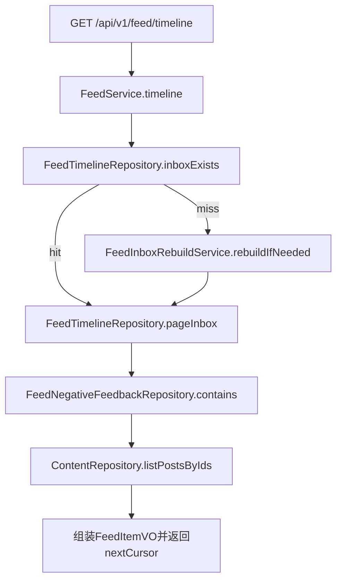
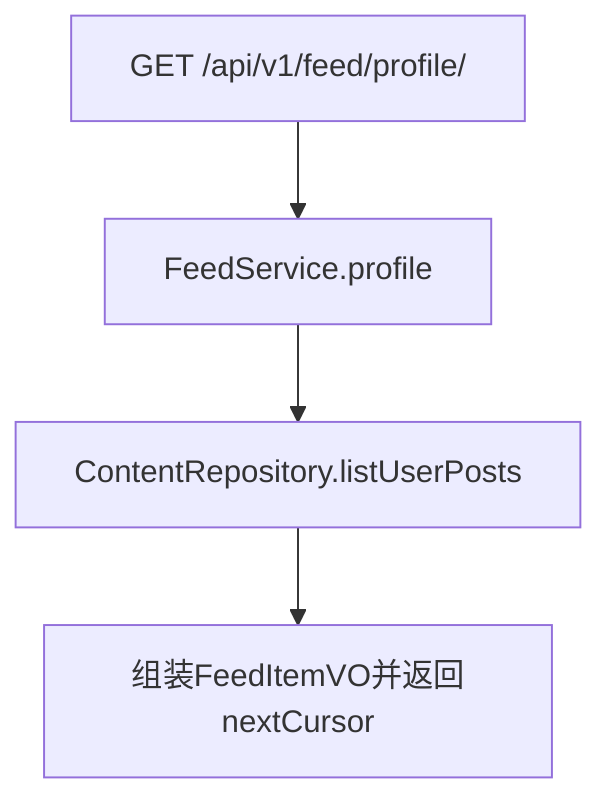
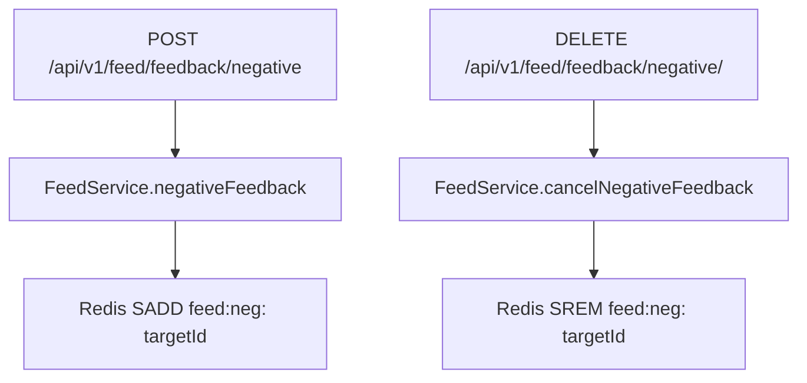

# 分发与 Feed 服务实现链路说明（Phase 1 + Phase 2，执行者：Codex / 日期：2026-01-14）

> 本文档是 **“当前代码实现的快照说明”**，用于 Code Review/交接/验收。  
> 详细设计与 Phase 2/3 方案请看：`.codex/distribution-feed-implementation.md`（方案文档）。

## 0. 本次完善（已落地）
- 写扩散链路：`ContentService.publish` 成功分支 → `IContentDispatchPort.onPublished` → RabbitMQ → `FeedFanoutDispatcherConsumer`（拆片）→ `FeedFanoutTaskConsumer`（执行片）→ `FeedDistributionService.fanoutSlice` → Redis InboxTimeline 写入（作者 inbox 由 dispatcher 保底写入）。
- 10.5.2 follow 补偿：`relation.follow.queue` → `RelationEventListener.handleFollow(status=ACTIVE)` → `FeedFollowCompensationService.onFollow` → 在线用户回填“新关注的人”的最近 K 条到 inbox。
- 10.5.3 Outbox + 大 V：dispatcher 永远写 `feed:outbox:{authorId}`；大 V（粉丝数≥阈值）不投递全量 fanout task，读侧合并读取 Outbox。
- 10.5.4 铁粉推：大 V 发布只推送 `feed:corefans:{authorId}`（SET）中的铁粉，数量受 `feed.bigv.coreFanMaxPush` 限制。
- 10.5.5 大 V 聚合池（可选）：开启 `feed.bigv.pool.enabled` 后，大 V 发布写入 `feed:bigv:pool:{bucket}`；读侧在关注数较大时用聚合池替代逐个 outbox 拉取。
- 10.5.6 Max_ID（内部）：timeline 读侧基于 `WITHSCORES` 做稳定分页与多源合并；对外 `nextCursor` 仍返回 `postId`（兼容）。
- 10.5.7 读时懒清理：回表发现 `status!=2` 导致的缺失 postId 时，清理 inbox/outbox/pool 索引，避免反复 miss。
- 消息模型：新增 `PostPublishedEvent`（`nexus-types`），承载 `postId/authorId/publishTimeMs`。
- MQ 拓扑：`FeedFanoutConfig` 声明 `social.feed`（DirectExchange）+ `feed.post.published.queue`（`post.published`）+ `feed.fanout.task.queue`（`feed.fanout.task`）。
- fanout 切片：新增 `FeedFanoutTask`（`nexus-types`）承载 `offset/limit`，将“大 fanout”拆成多个可并行消费的小任务，失败只重试切片。
- 粉丝分页：补齐 `IFollowerDao.selectFollowerIds` + `IRelationRepository.listFollowerIds`，fanout 分页拉粉丝避免一次性全量。
- InboxTimeline：新增 `IFeedTimelineRepository` + Redis 实现（ZSET：member=postId，score=publishTimeMs），支持 cursor 分页（兼容）+ Max_ID 条目分页（WITHSCORES）+ NoMore 哨兵 + 读侧刷新 TTL + 原子化重建 + `removeFromInbox` 懒清理入口。
- 负反馈：扩展 `IFeedNegativeFeedbackRepository`，同时支持 **postId** 维度与 **postTypes（业务类目/主题）** 维度过滤（Redis SET + 撤销反查 HASH）。
- 读侧回表：扩展 `IContentPostDao`/`ContentPostMapper.xml` 支持 `selectByIds`（timeline 批量回表）与 `selectByUserPage`（个人页 cursor 分页）。
- FeedService：替换占位实现为真实实现（timeline/profile/负反馈），timeline 已升级为“合并 Inbox + Outbox/Pool + 内部 Max_ID + 懒清理”，保持 `/api/v1/feed/*` 契约与 DTO 不变。
- Phase 2：在线推 / 离线拉（方案 A）：以 inbox key 是否存在定义在线；fanout 仅写入在线用户；timeline 首页 inbox miss 自动重建（原子 replaceInbox + NoMore）。
- 修复：离线重建关注列表回源 —— `RelationAdjacencyCachePort.listFollowing` 在缓存 key miss 或 relation 表缺失时，从 `user_follower` 回源“我关注了谁”，避免重建空 inbox。

## 1. 接口与领域映射（保持现有契约）
- 分层约束（对齐 `.codex/DDD-ARCHITECTURE-SPECIFICATION.md`）：`api` 定义 DTO/Response；`trigger` 只做入参组装与调用；`domain` 只依赖端口/仓储接口并编排业务；`infrastructure` 实现 MyBatis/Redis/RabbitMQ 细节，不允许反向依赖。

### 1.1 Feed HTTP 契约 → Domain 服务
- 关注页：GET `/api/v1/feed/timeline` → `IFeedService.timeline(userId, cursor, limit, feedType)`
- 个人页：GET `/api/v1/feed/profile/{targetId}` → `IFeedService.profile(targetId, visitorId, cursor, limit)`
- 负反馈：POST `/api/v1/feed/feedback/negative` → `IFeedService.negativeFeedback(userId, targetId, type, reasonCode, extraTags)`
- 撤销负反馈：DELETE `/api/v1/feed/feedback/negative/{targetId}` → `IFeedService.cancelNegativeFeedback(userId, targetId)`

补充（已拍板）：`userId/visitorId` 从登录态/网关上下文注入（Header：`X-User-Id`），不要信客户端自己报的 userId。为了不改既有 DTO 字段，Controller 应忽略 DTO 里的 userId/visitorId，统一从 `UserContext.requireUserId()` 获取后再调用 domain。

### 1.2 内容发布 → Feed 写扩散（系统内触发）
- 发布成功分支：`ContentService.publish` → `IContentDispatchPort.onPublished(postId, userId)`
- 基础设施实现：`ContentDispatchPort.onPublished` 构造 `PostPublishedEvent` 并 `convertAndSend("social.feed","post.published", event)`
- 消费入口：
  - `FeedFanoutDispatcherConsumer`（`@RabbitListener(queues = FeedFanoutConfig.QUEUE)`）消费 `PostPublishedEvent`，写作者 inbox 并拆分为多个 `FeedFanoutTask(offset,limit)` 投递到 `feed.fanout.task.queue`
  - `FeedFanoutTaskConsumer`（`@RabbitListener(queues = FeedFanoutConfig.TASK_QUEUE)`）消费 `FeedFanoutTask`，调用 `IFeedDistributionService.fanoutSlice(...)` 执行单片 fanout

## 2. 数据流与幂等性
### 2.1 写链路（fanout）
- 输入：`PostPublishedEvent(postId, authorId, publishTimeMs)`
- fanout 规则（Phase 2 + 10.5.3+）：
  - 永远写 Outbox：`feed:outbox:{authorId}`（ZSET）
  - 作者无条件写入 inbox（发布者体验保底）
  - 普通作者：分页拉取粉丝列表（`user_follower` 反向表）并仅对在线粉丝写入 inbox（在线推）
  - 大 V（粉丝数≥阈值）：默认不投递全量 fanout task，仅推送铁粉集合；其余粉丝通过读侧拉 Outbox（可选启用聚合池）
- 幂等性：
  - MQ 至少一次投递可能重复消费
  - Redis ZSET 的 `ZADD` 对同一 member（postId）天然幂等（重复写不会产生重复条目）
- TTL 语义（Phase 2）：
  - 写入不刷新 TTL（避免“关注的人越爱发，我越离线却永远在线”的资源泄露）
  - TTL 由读侧 `pageInbox` 刷新，离线用户 inbox key 过期后不再接收 pushes，回归再重建

### 2.2 读链路（timeline/profile）
- timeline：
  - 首页（cursor 为空）且 inbox key miss：触发 `FeedInboxRebuildService.rebuildIfNeeded(userId)` 离线重建
  - cursor（兼容）：对外仍返回 `postId`；服务端用 `ContentRepository.findPost(postId)` 取 `createTime`，内部按 Max_ID（`publishTimeMs+postId`）分页与合并
  - Redis inbox 分页得到索引条目（`WITHSCORES`，拿到 `publishTimeMs`）
  - 大 V 候选来源：
    - 默认：对关注列表做大 V 判定，合并读取对应作者 Outbox
    - 可选：开启聚合池且关注数超过阈值时，改为读聚合池（再按“我关注的作者”过滤）
  - 合并：Inbox + Outbox/Pool → 去重 → 排序截断（按 `publishTimeMs DESC, postId DESC`）
  - 负反馈过滤（两层）：
    - postId 维度：对每个 postId 执行 `SISMEMBER feed:neg:{userId} postId`
    - 帖子类型维度：读取 `feed:neg:postType:{userId}`，回表后按 `ContentPostEntity.postTypes` 与负反馈类型集合求交集过滤（类型来源 `content_post_type`，不是 `media_type`）
  - MySQL 批量回表：`content_post` 按候选 `postIds` 顺序组装，映射为 `FeedItemVO`（并在回表后对“缺失 postId”做索引懒清理）
  - `nextCursor` 取“本次扫描候选列表”的 lastPostId（不因负反馈过滤而改变，避免卡住）
- profile：
  - MySQL cursor 分页：`selectByUserPage(userId, cursorTime, cursorPostId, limit)`（`ORDER BY create_time DESC, post_id DESC`）
  - `nextCursor` 生成规则：`{lastCreateTimeMs}:{lastPostId}`

### 2.3 Cursor 协议（Phase 1）
- timeline：`cursor` / `nextCursor` = **postId 字符串**
  - 优点：实现简单，配合 `ZREVRANK` 可稳定翻页
  - 限制：当 cursor 被裁剪导致找不到时，本实现返回空页（可作为后续优化点：断流修复）
- profile：`cursor` / `nextCursor` = **"{createTimeMs}:{postId}"**
  - 目的：解决同一时间戳多条内容导致的重复/漏页

## 3. 存储策略（InboxTimeline + 真值回表）
### 3.1 真值源
- MySQL `content_post`：内容真值（读侧回表只取 `status=2` 的已发布内容）
- Redis：只存 timeline 索引与负反馈集合，不存内容正文真值

### 3.2 Redis Key 规范（统一）
- InboxTimeline：`feed:inbox:{userId}`（ZSET）
  - member：`postId`（字符串）
  - score：`publishTimeMs`（毫秒时间戳）
- 负反馈：`feed:neg:{userId}`（SET）
  - member：`targetId`（Phase 1 约定通常为 postId）
- 负反馈帖子类型：`feed:neg:postType:{userId}`（SET）
  - member：`postType`（业务类目/主题，来自 `content_post_type`）
- 点选类型反查：`feed:neg:postTypeByPost:{userId}`（HASH）
  - field：`postId`
  - value：`postType`（用于撤销负反馈时反查当时点选的类型）

### 3.3 Inbox 保留策略（配置）
- `feed.inbox.maxSize`：默认 1000（超出裁剪最旧数据）
- `feed.inbox.ttlDays`：默认 30（EXPIRE，读侧刷新；离线后自然过期）

## 4. 接口流程图（按方法链路）

**发布内容 → fanout 写扩散**
```mermaid
graph TD
  P[内容发布成功] --> D[ContentService.publish]
  D --> DP[IContentDispatchPort.onPublished]
  DP --> MQ[RabbitMQ social.feed/post.published]
  MQ --> DSP[FeedFanoutDispatcherConsumer]
  DSP --> ZA[写入作者 inbox]
  ZA --> Z[FeedTimelineRepository.addToInbox写ZSET]
  DSP --> TQ[投递 FeedFanoutTask(offset,limit)]
  TQ --> W[FeedFanoutTaskConsumer]
  W --> F[FeedDistributionService.fanoutSlice]
  F --> R[RelationRepository.listFollowerIds分页]
  R --> E[FeedTimelineRepository.inboxExists过滤在线]
  E --> Z
```

**关注页 timeline（Redis 索引 + MySQL 回表 + 负反馈过滤）**


**个人页 profile（MySQL cursor 分页）**


**负反馈 submit/cancel**


## 5. 表/队列/缓存映射（补充）
### 5.1 MySQL
- `content_post`：读侧回表（timeline/profile 只取 `status=2`）
- `user_follower`：fanout 粉丝列表来源（反向表：谁关注了我）

### 5.2 RabbitMQ
- Exchange：`social.feed`（Direct）
- Queue：`feed.post.published.queue`
- RoutingKey：`post.published`

### 5.3 Redis
- `feed:inbox:{userId}`：关注页 InboxTimeline（ZSET）
- `feed:neg:{userId}`：负反馈集合（SET）
- `feed:neg:postType:{userId}`：负反馈帖子类型集合（SET，业务类目/主题）
- `feed:neg:postTypeByPost:{userId}`：负反馈点选类型反查（HASH，postId->type，用于撤销）

## 6. 有效性（当前已满足/可验证）
- 契约：`/api/v1/feed/*` 路由与 DTO 字段保持不变，只替换占位实现为真实实现。
- 幂等：fanout 重复消费不会产生重复 timeline 条目（ZSET member 幂等）。
- 顺序：timeline 回表按 `postIds` 入参顺序重排，避免 IN 查询导致顺序漂移。
- 编译/测试：未执行（按用户要求不做 Maven 验证）。

建议本地验收（需要 MySQL+Redis+RabbitMQ）：
1) A 关注 B（写入 `user_follower`）
2) B 发布内容（触发 MQ fanout）
3) A 调用 timeline 连续翻页 3 次（验证不重复/不漏）
4) A 对某 postId 提交负反馈后再次拉取（验证过滤生效）再撤销验证恢复

## 7. 剩余不足（Phase 1 之外 / 非阻塞）
- 对标关注流“生产级演进”的关键方案（`10.5.1` ~ `10.5.7`）已按实现文档落地；性能/可运维改进仍建议按 `10.6` 逐步补齐。
- Phase 3 未实现：推荐与排序（关注 + 推荐召回、排序演进），但实现级方案已补齐，详见 `.codex/distribution-feed-implementation.md` 的 `11`。
- unfollow 仍无接口/事件：`.codex/distribution-feed-implementation.md` 的 `10.5.2.2` 仅保留实现级说明（当前不做回收历史或 evict inbox）。
- 铁粉集合生成未实现：当前只提供 `IFeedCoreFansRepository` 查询契约与写侧推送入口；铁粉集合建议复用互动计数/亲密度产出（见 `.codex/interaction-like-pipeline-implementation.md`）。
- 聚合池默认关闭：开启 `feed.bigv.pool.enabled` 前，建议确认确实存在“关注很多大 V 导致 N 次 outbox 读”的规模问题。
- MQ 序列化未显式统一为 JSON（详见 `.codex/distribution-feed-implementation.md` 的 `10.6.1`）。
- timeline 负反馈过滤是逐条 `SISMEMBER`（N 次 Redis 调用），高 QPS 场景可考虑批量化策略（详见 `.codex/distribution-feed-implementation.md` 的 `10.6.2`）。
- 异步清理未落地：当前为读时懒清理；若不想在读接口里做写操作，可按 `10.5.7.3` 补齐 `feed.index.cleanup` MQ 异步清理。
- 内容负反馈类型已升级为 postTypes（业务类目/主题）维度；若要更细粒度（例如标签、多选、权重），详见 `.codex/distribution-feed-implementation.md` 的 `10.6.6`。

## 8. 配置示例（application-dev.yml）
```yml
feed:
  inbox:
    maxSize: 1000
    ttlDays: 30
  outbox:
    maxSize: 1000
    ttlDays: 30
  fanout:
    batchSize: 200
  rebuild:
    perFollowingLimit: 20
    inboxSize: 200
    maxFollowings: 2000
    lockSeconds: 30
  follow:
    compensate:
      recentPosts: 20
  bigv:
    followerThreshold: 500000
    coreFanMaxPush: 2000
    pull:
      maxBigvFollowings: 200
      perBigvLimit: 50
    pool:
      enabled: false
      buckets: 4
      maxSizePerBucket: 500000
      ttlDays: 7
      fetchFactor: 30
      triggerFollowings: 200
```

## 9. 关键文件清单（便于 CR）
- 发布→分发入口：`project/nexus/nexus-domain/src/main/java/cn/nexus/domain/social/service/ContentService.java`
- 分发端口实现：`project/nexus/nexus-infrastructure/src/main/java/cn/nexus/infrastructure/adapter/social/port/ContentDispatchPort.java`
- MQ 拓扑：`project/nexus/nexus-trigger/src/main/java/cn/nexus/trigger/mq/config/FeedFanoutConfig.java`
- MQ 消费者：`project/nexus/nexus-trigger/src/main/java/cn/nexus/trigger/mq/consumer/FeedFanoutDispatcherConsumer.java` + `project/nexus/nexus-trigger/src/main/java/cn/nexus/trigger/mq/consumer/FeedFanoutTaskConsumer.java`
- 切片消息体：`project/nexus/nexus-types/src/main/java/cn/nexus/types/event/FeedFanoutTask.java`
- fanout 服务：`project/nexus/nexus-domain/src/main/java/cn/nexus/domain/social/service/FeedDistributionService.java`
- inbox 重建服务：`project/nexus/nexus-domain/src/main/java/cn/nexus/domain/social/service/FeedInboxRebuildService.java`
- inbox 重建接口：`project/nexus/nexus-domain/src/main/java/cn/nexus/domain/social/service/IFeedInboxRebuildService.java`
- inbox 条目 VO：`project/nexus/nexus-domain/src/main/java/cn/nexus/domain/social/model/valobj/FeedInboxEntryVO.java`
- 粉丝分页：`project/nexus/nexus-infrastructure/src/main/java/cn/nexus/infrastructure/dao/social/IFollowerDao.java` + `project/nexus/nexus-infrastructure/src/main/resources/mapper/social/FollowerMapper.xml`
- 关注邻接缓存/回源兜底：`project/nexus/nexus-infrastructure/src/main/java/cn/nexus/infrastructure/adapter/social/port/RelationAdjacencyCachePort.java`
- Redis inbox：`project/nexus/nexus-infrastructure/src/main/java/cn/nexus/infrastructure/adapter/social/repository/FeedTimelineRepository.java`
- Redis 负反馈：`project/nexus/nexus-infrastructure/src/main/java/cn/nexus/infrastructure/adapter/social/repository/FeedNegativeFeedbackRepository.java`
- FeedService：`project/nexus/nexus-domain/src/main/java/cn/nexus/domain/social/service/FeedService.java`
- Content 回表 SQL：`project/nexus/nexus-infrastructure/src/main/resources/mapper/social/ContentPostMapper.xml`
- follow 补偿：`project/nexus/nexus-domain/src/main/java/cn/nexus/domain/social/service/IFeedFollowCompensationService.java` + `project/nexus/nexus-domain/src/main/java/cn/nexus/domain/social/service/FeedFollowCompensationService.java` + `project/nexus/nexus-trigger/src/main/java/cn/nexus/trigger/listener/social/RelationEventListener.java`
- Outbox：`project/nexus/nexus-domain/src/main/java/cn/nexus/domain/social/adapter/repository/IFeedOutboxRepository.java` + `project/nexus/nexus-infrastructure/src/main/java/cn/nexus/infrastructure/adapter/social/repository/FeedOutboxRepository.java` + `project/nexus/nexus-infrastructure/src/main/java/cn/nexus/infrastructure/config/FeedOutboxProperties.java`
- 铁粉集合：`project/nexus/nexus-domain/src/main/java/cn/nexus/domain/social/adapter/repository/IFeedCoreFansRepository.java` + `project/nexus/nexus-infrastructure/src/main/java/cn/nexus/infrastructure/adapter/social/repository/FeedCoreFansRepository.java`
- 大 V 聚合池：`project/nexus/nexus-domain/src/main/java/cn/nexus/domain/social/adapter/repository/IFeedBigVPoolRepository.java` + `project/nexus/nexus-infrastructure/src/main/java/cn/nexus/infrastructure/adapter/social/repository/FeedBigVPoolRepository.java` + `project/nexus/nexus-infrastructure/src/main/java/cn/nexus/infrastructure/config/FeedBigVPoolProperties.java`
