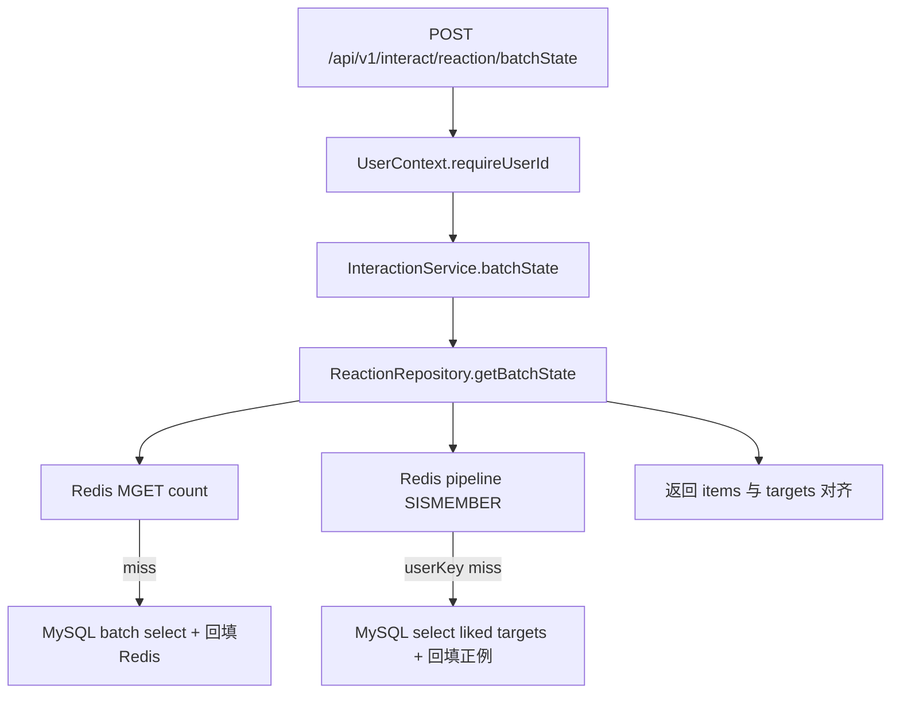

# 点赞链路实现说明（Step 1~3，执行者：Codex / 日期：2026-01-15）

> 本文档是 **“当前代码实现的快照说明”**，用于 Code Review/交接/验收。  
> 详细设计与后续 Step 4/5（通知）及实时/离线分析方案请看：`.codex/interaction-like-pipeline-implementation.md`（方案文档）。

## 0. 本次完善（已落地）
- 点赞写链路（秒回）：`POST /api/v1/interact/reaction` → Redis Lua 原子完成 **幂等 + 计数 + touch 记录 + win 状态机**；仅当窗口首次创建时投递一次延迟 flush（避免每次都写 DB）。
- 点赞读链路（单条/批量）：新增 `GET /api/v1/interact/reaction/state` 与 `POST /api/v1/interact/reaction/batchState`，一次返回 `likeCount + likedByMe`；优先 Redis，miss 批量回源 MySQL 并回填。
- 延迟 flush 落库：RabbitMQ `x-delayed-message` 延迟队列触发 flush；flush 写 `like_counts`（绝对值）+ `likes(status)`（最终态），并用 Lua finalize 推进 win 状态机确保“不丢最后一次写入”，必要时自动重排队。
- userId 约束：`userId` 不允许由客户端传；统一从 Header `X-User-Id` 注入到 `UserContext`（ThreadLocal），Controller 直接 `UserContext.requireUserId()` 获取。
- 支持范围收敛（先跑通，不做半吊子兼容）：
  - `type`：仅 LIKE
  - `targetType`：仅 POST/COMMENT
  - `action`：仅 ADD/REMOVE
- 新增表 SQL：`project/nexus/docs/interaction_like_tables.sql`（按你的要求仅放 docs，不做自动迁移）。
- 配置项：`project/nexus/nexus-app/src/main/resources/application-dev.yml` 增加 `interaction.like.*`（window/delayBuffer/syncTtl/flushLock）。

## 1. 接口与领域映射（保持现有分层约束）
- 分层约束（对齐 `.codex/DDD-ARCHITECTURE-SPECIFICATION.md`）：`api` 定义 DTO/Response；`trigger` 只做入参组装与调用；`domain` 编排业务；`infrastructure` 实现 Redis/MyBatis/RabbitMQ 细节。

### 1.1 HTTP 契约 → Domain 服务
- 点赞/取消点赞：POST `/api/v1/interact/reaction` → `IInteractionService.react(userId, targetId, targetType, type, action)`
- 获取点赞状态（单条）：GET `/api/v1/interact/reaction/state` → `IInteractionService.reactionState(userId, targetId, targetType)`
- 获取点赞状态（批量）：POST `/api/v1/interact/reaction/batchState` → `IInteractionService.batchState(userId, targets)`

补充（已执行）：`userId` 从网关/登录态注入（Header：`X-User-Id`），不要信客户端 Body/Query 里的 userId（本实现直接不提供该字段）。

## 2. 数据流与幂等性

### 2.1 写链路（秒回 + 调度延迟 flush）
- 输入：`(userId, targetType, targetId, action)`（`userId` 来自 `UserContext`）
- 核心：`ReactionRepository.toggle(...)` 执行 Lua，一次往返原子完成：
  - 幂等集合：`SADD/SREM like:user:{userId}`
  - 计数：`SET like:count:{targetType}:{targetId} = newCount`（count clamp >= 0）
  - touch：`HSET like:touch:{targetType}:{targetId}[userId] = 1/0`（窗口内最终态）
  - win：`like:win:{targetType}:{targetId}` 状态机（首次创建=0 并返回 needSchedule=1；窗口内再次变化置 1，但不重复发消息）
- 输出：`delta/currentCount/needSchedule`；Controller 在 `needSchedule=true` 时投递 `LikeFlushTaskEvent` 延迟消息。

### 2.2 延迟 flush（最终一致 + 不丢最后一次）
- 输入：延迟消息 `LikeFlushTaskEvent(targetType,targetId)`（窗口到期后触发）
- flush 最小流程（关键点）：
  1) 分布式锁：`like:flush:lock:*`（Lua compare-and-delete 解锁，避免误删他人锁）
  2) 计数落库：把 Redis `like:count:*` 写入 `like_counts`（绝对值 upsert，重复 flush 幂等）
  3) touch 快照：`RENAMENX like:touch:* -> like:touch:flush:*`（固定快照 key，flush 失败可重试，不产生“孤儿快照”）
  4) 明细落库：把快照里的 `(userId,status)` 批量 upsert 到 `likes(status)`，并删除快照 key
  5) finalize：Lua 原子推进 `like:win:*`（win=1 → 复位为 0 并 reschedule；win=0 → DEL 并结束）
- 输出：`reschedule=true/false`；reschedule=true 时会再次投递延迟消息（用于 flush 期间发生的新写入）。

### 2.3 读链路（单条/批量，避免 N 次 DB）
- likeCount：优先 Redis `MGET like:count:*`；miss 时对本批次 targets 回源 `like_counts` 并回填（countKey 不设 TTL，避免用户可见“清零”）。
- likedByMe：优先 Redis `SISMEMBER like:user:{userId}`；当 userKey 不存在时，对本批次 targets 回源 `likes(status=1)` 并只回填正例（避免把“没点过赞”的全量塞进 Redis）。

## 3. 核心数据结构（Redis / MySQL / MQ）

### 3.1 Redis Key
- 幂等根（用户侧）：`like:user:{userId}`（SET，member=`{targetType}:{targetId}`，默认不设 TTL）
- 计数（目标侧）：`like:count:{targetType}:{targetId}`（STRING/INT，默认不设 TTL）
- 窗口 touch（最终态）：`like:touch:{targetType}:{targetId}`（HASH，field=userId，value=1/0，TTL=`interaction.like.syncTtlSeconds`）
- 窗口 win（调度状态机）：`like:win:{targetType}:{targetId}`（STRING 0/1，TTL 同上）
- flush 锁：`like:flush:lock:{targetType}:{targetId}`（STRING NX，TTL=`interaction.like.flushLockSeconds`）
- flush 快照：`like:touch:flush:{targetType}:{targetId}`（HASH，固定 key，用于失败可重试）

### 3.2 MySQL
- `likes`：明细最终态（PK：`user_id,target_type,target_id`；字段 `status=1/0`；覆盖式 upsert）
- `like_counts`：聚合绝对值（PK：`target_type,target_id`；字段 `like_count`）

### 3.3 RabbitMQ
- 延迟交换机：`interaction.like.exchange`（`x-delayed-message`，`x-delayed-type=direct`）
- 延迟队列：`interaction.like.delay.queue`（绑定 routingKey=`interaction.like.delay`，并配置 DLX/DLQ）
- 死信交换机/队列：`interaction.like.dlx.exchange` → `interaction.like.dlx.queue`
- 消息体：`LikeFlushTaskEvent`

## 4. 接口流程图（按方法链路）

**点赞/取消点赞（写 Redis + 调度 flush）**
```mermaid
graph TD
  R[POST /api/v1/interact/reaction] --> U[UserContext.requireUserId]
  U --> S[InteractionService.react]
  S --> LUA[ReactionRepository.toggle(Lua)]
  LUA --> RET[返回 currentCount/success]
  LUA -->|needSchedule=true| MQ[LikeSyncProducer.sendDelay]
```

**延迟 flush（Redis -> MySQL + win finalize）**
```mermaid
graph TD
  MQ[interaction.like.delay.queue] --> C[LikeSyncConsumer]
  C --> F[LikeSyncService.flush]
  F --> L[ReactionRepository.flush]
  L --> DB1[upsert like_counts(绝对值)]
  L --> SNAP[RENAMENX touch -> touch:flush]
  SNAP --> DB2[batchUpsert likes(status最终态)]
  L --> FIN[LUA finalize win]
  FIN -->|reschedule=true| MQ2[sendDelay 下一轮]
```

**批量查询（批量拿 likeCount + likedByMe）**


## 5. 有效性（当前已满足/可验证）
- 幂等：同一用户重复 ADD/REMOVE 不重复计数（Lua 内做 SISMEMBER 判定）。
- 计数安全：Lua 内对 newCount 做 clamp，避免负数。
- flush 幂等：`like_counts` 写绝对值 + `likes` 覆盖式 upsert，重复 flush 不漂移。
- flush 竞态收敛：touch 快照 `RENAMENX` + win finalize Lua，flush 期间的新写入不会被误删/丢失（会触发下一轮）。
- 编译/测试：未执行（按用户要求不做 Maven 验证）。

建议本地验收（需要 MySQL+Redis+RabbitMQ）：
1) userId=1 对 POST:100 连续 ADD 两次，count 只 +1；再 REMOVE 两次，count 只 -1 且不为负  
2) 等待一个窗口后检查 `like_counts` 追上 Redis count  
3) flush 过程中再触发一次 ADD，验证后续会 reschedule 再 flush 一轮  
4) batchState 一次传 20~50 个 targets，观察是否一次性返回（不出现 N 次 DB 往返）

## 6. 剩余不足（Step 1~3 之外 / 非阻塞）
- Step 4 通知 MVP 未实现：`delta=+1` 时的 LikeCreatedEvent、通知入库与 `/notification/list` 真数据返回仍未做。
- Step 5 通知聚合未实现：同 target 的多次点赞合并通知未做。
- Kafka/Flink 实时监控、Hive/Spark 离线分析：仅保留方案契约，未落地代码与作业。
- 热点探测 + L1 本地缓存：未实现（如果未来要上，先明确“热点探测”来源，否则就是盲目缓存）。
- 运维前提需明确：如果 Redis 发生逐出/清空，`like:count:*` 的真值假设会导致用户可见错数，需要明确“noeviction/重建/对账”策略。

## 7. 配置示例（application-dev.yml）
```yml
interaction:
  like:
    windowSeconds: 60
    delayBufferSeconds: 10
    syncTtlSeconds: 180
    flushLockSeconds: 30
```

## 8. 关键文件清单（便于 CR）
- HTTP 入口：`project/nexus/nexus-trigger/src/main/java/cn/nexus/trigger/http/social/InteractionController.java`
- userId 注入：`project/nexus/nexus-trigger/src/main/java/cn/nexus/trigger/http/support/UserContext.java` + `project/nexus/nexus-trigger/src/main/java/cn/nexus/trigger/http/support/UserContextInterceptor.java` + `project/nexus/nexus-trigger/src/main/java/cn/nexus/trigger/http/config/WebMvcConfig.java`
- API/DTO：`project/nexus/nexus-api/src/main/java/cn/nexus/api/social/IInteractionApi.java` + `project/nexus/nexus-api/src/main/java/cn/nexus/api/social/interaction/dto/*`
- Domain：`project/nexus/nexus-domain/src/main/java/cn/nexus/domain/social/service/InteractionService.java` + `project/nexus/nexus-domain/src/main/java/cn/nexus/domain/social/service/LikeSyncService.java`
- Domain 仓储接口：`project/nexus/nexus-domain/src/main/java/cn/nexus/domain/social/adapter/repository/IReactionRepository.java`
- Redis/MyBatis 仓储实现：`project/nexus/nexus-infrastructure/src/main/java/cn/nexus/infrastructure/adapter/social/repository/ReactionRepository.java`
- DAO + Mapper：`project/nexus/nexus-infrastructure/src/main/java/cn/nexus/infrastructure/dao/social/ILikeDao.java` + `project/nexus/nexus-infrastructure/src/main/java/cn/nexus/infrastructure/dao/social/ILikeCountDao.java` + `project/nexus/nexus-infrastructure/src/main/resources/mapper/social/LikeMapper.xml` + `project/nexus/nexus-infrastructure/src/main/resources/mapper/social/LikeCountMapper.xml`
- MQ 拓扑/生产/消费：`project/nexus/nexus-trigger/src/main/java/cn/nexus/trigger/mq/config/LikeSyncDelayConfig.java` + `project/nexus/nexus-trigger/src/main/java/cn/nexus/trigger/mq/producer/LikeSyncProducer.java` + `project/nexus/nexus-trigger/src/main/java/cn/nexus/trigger/mq/consumer/LikeSyncConsumer.java` + `project/nexus/nexus-trigger/src/main/java/cn/nexus/trigger/mq/consumer/LikeSyncDLQConsumer.java`
- 消息体：`project/nexus/nexus-types/src/main/java/cn/nexus/types/event/interaction/LikeFlushTaskEvent.java`
- 建表 SQL：`project/nexus/docs/interaction_like_tables.sql`
