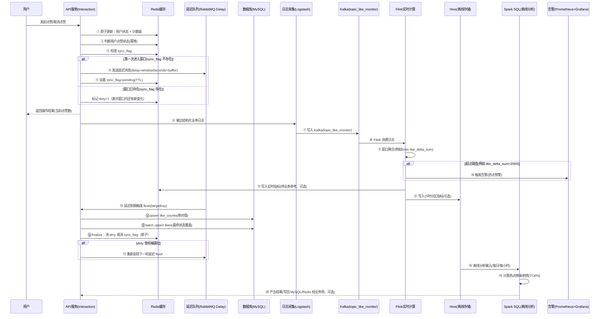

# 点赞/取消点赞：计数同步 + 实时监控 + 离线分析（实现级方案）

执行者：Codex（Linus mode）  
日期：2026-01-13

> 你给的图展示的是一个完整“点赞数”链路：**API 先写 Redis 快速返回**，再用 **延迟队列批量落库**，同时把 **结构化日志**送进 **Kafka/Flink** 做实时聚合与告警，最后把数据沉到 **Hive/Spark** 做离线榜单与趋势分析。
>
> 本文档目标：详细到 **另一个 Codex agent** 可以直接照着把这条链路实现出来（至少实现到“线上写 + 延迟落库”），并且和本仓库的 DDD 分层风格对齐。

---

## 0. 需求与边界（先把话说死）

### 0.1 我理解你的需求是

把“用户点赞/取消点赞”做成一条 **高并发可承受** 的链路：用户立刻拿到最新点赞数（Redis），数据库最终一致（延迟批量同步），并且具备实时热点监控（Flink 告警）与离线热点分析（Spark SQL）。

### 0.2 不在本次讨论范围（别发散）

- 鉴权/风控/加密/反作弊：不讨论（你明确说安全不重要，我也不想在这上面浪费时间）。
- 推荐排序本身：这里只产出“可供推荐使用的指标/榜单”，不实现推荐引擎。

---

## 1. 一句话版本（给 12 岁也能懂的）

用户点一次“赞”，我们先把数字写进 Redis（秒回），然后把“这段时间累计的变化”打包，过几分钟再一次性写进数据库；同时把每次点赞都写到日志里，实时算出谁突然爆火，必要时报警；每天再离线算榜单。

---

## 2. 核心数据结构（先管数据，别先写代码）

> Linus 观点：烂程序员盯代码，好程序员盯数据结构。

### 2.1 你必须固定的 3 类数据

1) **用户“有没有点过赞”的状态**（幂等的根）  
2) **目标对象（帖子/评论）的点赞总数**（用户可见的数）  
3) **延迟落库窗口的调度状态**（避免每次都写 DB）

### 2.2 Redis Key 设计（建议直接照抄）

为了避免“热门帖子下，按 target 存 user 集合爆炸”，这里采用 **按 user 存集合** 做幂等（更可控）。

#### 2.2.1 用户侧幂等集合（去重）

- Key：`like:user:{userId}`（SET）
- member：`{targetType}:{targetId}`（例如 `POST:123`、`COMMENT:9`）
- 语义：用户点过赞就存在；取消赞就移除
- TTL：可选（如果你要省内存，给 30~90 天，过期后允许“回源 DB 重建”）

#### 2.2.2 目标侧计数器（用户可见）

- Key：`like:count:{targetType}:{targetId}`（STRING/INT）
- value：当前点赞总数
- TTL：一般不设 TTL（否则热点内容会“清零”造成用户可见错误）

#### 2.2.3 延迟落库窗口控制（避免每次都落 DB）

我们要保证：**同一个 target 在一个窗口内，只会被安排一次 flush 任务**。

- Key：`like:sync:{targetType}:{targetId}`（STRING）
  - value：`pending`
  - TTL：`interaction.like.syncTtlSeconds`（必须 ≥ delaySeconds * 2，避免 flush 期间过期）
- Key：`like:dirty:{targetType}:{targetId}`（STRING）
  - value：`1`
  - TTL：同上
  - 语义：窗口内已经安排过 flush 之后，仍然发生了新变化（需要再 flush 一轮）
- Key：`like:touched:{targetType}:{targetId}`（SET）
  - member：本窗口内发生过状态变化的 `userId`
  - TTL：同上
  - 语义：flush 时只处理“动过的用户”，把窗口内多次切换压缩成一次 DB upsert
- Key：`like:flush:lock:{targetType}:{targetId}`（STRING，NX lock）
  - TTL：`interaction.like.flushLockSeconds`（避免并发 flush）

### 2.3 MySQL 表结构（最终一致的真值）

#### 2.3.1 `likes`（明细：谁给谁点过赞）

最小字段：

- `user_id` BIGINT
- `target_type` VARCHAR
- `target_id` BIGINT
- `status` TINYINT（1=liked，0=unliked）
- `create_time` / `update_time`
- UNIQUE(`user_id`,`target_type`,`target_id`)

> 说明：我们不是每次都写 DB，而是窗口 flush 时写“最终状态”。因此 `status` 必须存在（覆盖式 upsert）。

#### 2.3.2 `like_counts`（聚合：每个目标的点赞总数）

- `target_type` VARCHAR
- `target_id` BIGINT
- `like_count` BIGINT
- `update_time`
- PRIMARY(`target_type`,`target_id`)

> 说明：flush 写 **绝对值**（Redis 当前值），这样天然幂等，重复 flush 不会漂移。

---

## 3. 组件职责（谁该背锅先写清楚）

| 组件 | 责任 | 关键点 |
| --- | --- | --- |
| API 服务（Interaction） | 接收点赞/取消点赞；Redis 原子更新；调度延迟 flush；写业务日志 | 必须做到“重复请求不重复计数” |
| Redis | 幂等状态 + 计数器 + 窗口控制 | 最好用 Lua 把竞态从 Java 里消掉 |
| 延迟队列（RabbitMQ） | 每个 target 窗口触发一次 flush | 本仓库已有 x-delayed-message 模式可复用 |
| MySQL | 最终真值（likes、like_counts） | upsert + 批量写入 |
| Logstash/Kafka/Flink | 实时监控聚合与热点告警 | 应用侧只保证日志字段固定 |
| Hive/Spark | 离线榜单/趋势 | 只定义表与口径，作业可独立仓库实现 |

---

## 4. 端到端流程（对应你图里的链路）

### 4.1 时序图（Mermaid）



> 说明：你的图里把“延迟队列触发后写 DB”画在“延迟队列→数据库”。在本仓库的实现里，通常会是“Consumer 收到消息 → 调用 domain service flush → DAO 写 DB”。本质一样。

---

## 5. API 契约（和本仓库现状对齐）

### 5.1 当前已有接口（代码事实）

入口：`project/nexus/nexus-trigger/src/main/java/cn/nexus/trigger/http/social/InteractionController.java`  
请求 DTO：`project/nexus/nexus-api/src/main/java/cn/nexus/api/social/interaction/dto/ReactionRequestDTO.java`

当前请求字段只有：

- `targetId`
- `targetType`
- `type`
- `action`（ADD/REMOVE）

### 5.2 致命缺口：没有 userId 就做不了幂等

你的图里明确要求“判断用户点赞状态(1/0)”。这件事没有 `userId` 根本做不了。

在本仓库里，很多接口是直接在 DTO 里带 `userId`（例如 `FeedTimelineRequestDTO`），所以最小改动是：

- 给 `ReactionRequestDTO` 增加 `userId`
- Controller 把 `userId` 传进 domain

如果你未来要引入鉴权从 token 里取 userId，那是另一回事；但不管怎么取，**实现层必须能拿到 userId**。

---

## 6. 写链路（API：Redis 写 + 快速返回）

### 6.1 “好品味”的实现方式：Lua 一把梭（消灭特殊情况）

不要在 Java 里写一堆 if/else 再去做多次 Redis 调用。正确做法是：

- 用 Lua 在 Redis 内部一次性完成：
  - 幂等判断（是否已 liked）
  - SADD/SREM 更新 `like:user:{userId}`
  - INCRBY 更新 `like:count:*`
  - 把 userId 加入 `like:touched:*`
  - 决定是否要调度延迟 flush（基于 sync_flag miss/hit）

输出必须包含：

- `delta`：本次是否真的改变了计数（-1/0/+1）
- `currentCount`：最新点赞数
- `needSchedule`：是否需要发送延迟消息

### 6.2 窗口调度规则（只有一条，不要发明第二条）

- 如果 `like:sync:*` 不存在：设置它 + 发送一次延迟消息
- 如果 `like:sync:*` 已存在：只设置 `like:dirty:* = 1`（不再重复发消息）

### 6.3 delaySeconds 怎么定（别拍脑袋）

建议配置化：

- `interaction.like.windowSeconds`：窗口长度（例如 300 秒 = 5 分钟）
- `interaction.like.delayBufferSeconds`：buffer（例如 30 秒，防止边界抖动）
- `delayMs = (windowSeconds + bufferSeconds) * 1000`

---

## 7. 延迟落库链路（Flush：批量 upsert + 幂等 + 不丢最后一次）

### 7.1 你必须保证的 2 个性质

1) **重复消息不怕**：同一个 target 的延迟消息可能重复投递，flush 必须幂等  
2) **flush 期间的新点赞不丢**：不能出现“刚好在 flush 的时候点了赞，结果这次窗口没人再 flush 了”

### 7.2 Flush 的最小流程（照着写就不会跑偏）

pseudocode（关键步骤，别写成 200 行巨石函数）：

```
flush(targetType, targetId):
  if !tryLock(lockKey, ttl): return

  count = GET like:count:{targetType}:{targetId} (default 0)
  upsert like_counts set like_count = count

  users = SMEMBERS/SSCAN like:touched:{targetType}:{targetId}
  rows = []
  for userId in users:
    liked = SISMEMBER like:user:{userId} "{targetType}:{targetId}"
    rows.add(userId, targetType, targetId, status=liked)
  batchUpsert likes(rows)
  DEL touchedKey

  // 原子 finalize：要么清 dirty 并要求重排队，要么清 sync_flag
  reschedule = luaFinalize(targetKey)
  if reschedule:
    sendDelay(targetKey, delayMs)
```

### 7.3 “不丢最后一次”的关键：finalize 必须原子

如果你用“先查 dirty 再删 sync_flag”的两步 Redis 操作，竞态一定会出现。

正确做法是：把下面逻辑写成 Lua 脚本在 Redis 里原子执行：

- 如果 `dirty=1`：清掉 dirty，**保留 sync_flag**，返回 `reschedule=true`
- 如果 `dirty` 不存在：删除 sync_flag，返回 `reschedule=false`

这样保证：

- flush 结束时删掉 sync_flag 后，新的点赞会发现 sync_flag miss，自行调度新窗口
- flush 结束时如果 dirty 曾经被置位，会自动再跑一轮 flush

---

## 8. 实时监控链路（Logstash/Kafka/Flink）

> 重点：应用侧只要保证“日志字段固定”，Flink 作业才能独立演进。

### 8.1 结构化日志字段（建议固定 JSON）

最小字段（能支持你图里的窗口聚合与告警）：

- `ts`（毫秒时间戳）
- `userId`
- `targetType`
- `targetId`
- `action`（ADD/REMOVE）
- `delta`（-1/0/+1）
- `currentCount`（Redis 更新后的数）
- `traceId`（可选，用于排障）

### 8.2 Kafka Topic

- Topic：`topic_like_monitor`（你图里写的名字）
- key：建议用 `targetId`（保证同 target 的事件落到同分区，便于聚合）

### 8.3 Flink 聚合口径（你图里的“5min”）

窗口：`5 min`（滚动或滑动都行，先用滚动最简单）  
指标：

- `like_delta_sum`：窗口内 delta 求和（涨了多少）
- `like_rate`：`like_delta_sum / 300s`

告警规则（示例）：

- `like_delta_sum > 2000` -> 热点预警

### 8.4 实时指标回写（可选）

你的图里有“写入实时点赞指标（供业务系统参考）”。建议落在 Redis：

- `like:rt:{targetType}:{targetId}` = 最近 5min 的 `like_delta_sum`
- TTL：10~30 分钟（只做实时参考）

---

## 9. 离线分析链路（Hive/Spark）

### 9.1 Hive 表（按小时分区）

如果你走“Flink 写 Hive 小时分区”，建议形态：

- 表：`dwd_like_metrics_hour`
- 分区：`dt`（yyyy-MM-dd）、`hh`（00-23）
- 字段：`target_type`,`target_id`,`like_delta_sum`,`like_rate`,`max_current_count`

### 9.2 Spark SQL 产出（榜单/趋势）

最小 2 张结果表：

- `hot_content_rank_daily(dt, target_type, target_id, score, rank)`
- `hot_content_trend_weekly(week, target_type, target_id, score, trend)`

score 你可以先用最土的：

- `score = like_delta_sum`（先跑起来，再谈高级模型）

---

## 10. 在本仓库如何落地（文件清单/复用点）

> 这是给“另一个 Codex agent”用的：照着建文件就能开工。

### 10.1 现有入口（已存在）

- HTTP 入口：`project/nexus/nexus-trigger/src/main/java/cn/nexus/trigger/http/social/InteractionController.java`
- DTO：`project/nexus/nexus-api/src/main/java/cn/nexus/api/social/interaction/dto/ReactionRequestDTO.java`
- Domain 服务（当前是占位）：`project/nexus/nexus-domain/src/main/java/cn/nexus/domain/social/service/InteractionService.java`

### 10.2 可直接复用的延迟队列模式（已存在）

项目已用 RabbitMQ `x-delayed-message` 插件实现延迟队列：

- `project/nexus/nexus-trigger/src/main/java/cn/nexus/trigger/mq/config/ContentScheduleDelayConfig.java`
- `project/nexus/nexus-trigger/src/main/java/cn/nexus/trigger/mq/producer/ContentScheduleProducer.java`

点赞 flush 直接复制这套模式，改 exchange/queue/routingKey 即可（不要自研定时器）。

### 10.3 建议新增的模块接口（按 DDD 分层）

domain（接口）：

- `IReactionRepository`：toggle + finalize + getCount + touchedUsers
- `ILikeSyncService`：flush(targetType,targetId)

infrastructure（实现）：

- Redis 实现：基于 `StringRedisTemplate` + Lua
- MyBatis DAO + Mapper XML：`likes` / `like_counts`

trigger（MQ）：

- LikeSyncDelayConfig / Producer / Consumer（延迟消息驱动 flush）

---

## 11. 验收点（你只需要看结果，不需要懂实现）

1. 点赞/取消点赞：重复点不会让数字乱跳（幂等）  
2. 点赞后立刻返回的数字来自 Redis（秒回）  
3. 过一个窗口后，数据库 `like_counts` 会追上 Redis（最终一致）  
4. 热点内容在 5 分钟内暴涨会触发告警（阈值可配）  
5. 每日能产出 TOPN 热点榜单（离线）

---

## 12. 开放问题（不回答会卡实现）

1. `userId` 从哪里来？（最小可行：直接加到 `ReactionRequestDTO`）  
2. 点赞对象范围：只做 `POST/COMMENT` 还是还包括 `MEDIA/REPLY`？（影响 key 设计）  
3. 窗口长度要多长？5 分钟是图里的示例，是否符合产品预期？  
