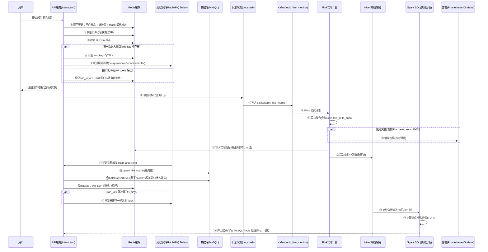

# 点赞/取消点赞：计数同步 + 实时监控 + 离线分析（实现级方案）

执行者：Codex（Linus mode）  
日期：2026-01-14（基于现有方案迭代）

> 你给的图展示的是一个完整“点赞数”链路：**API 先写 Redis 快速返回**，再用 **延迟队列批量落库**，同时把 **结构化日志**送进 **Kafka/Flink** 做实时聚合与告警，最后把数据沉到 **Hive/Spark** 做离线榜单与趋势分析。
>
> 本文档目标：详细到 **另一个 Codex agent** 可以直接照着把这条链路实现出来（至少实现到“线上写 + 延迟落库”），并且和本仓库的 DDD 分层风格对齐。
>
> 备注：已用 Playwright 抓取并阅读原文要点。原文“解法 3”是**三级存储（热点探测 + Caffeine 本地缓存 + Redis Cluster + TaiShan KV）**；本仓库不具备 TaiShan/TiCDC 这类基础设施，因此本文档只吸收其中“热点探测 + L1 本地缓存抗热点”的思路，底座仍以 MySQL 做最终真值。

---

## 0. 需求与边界（先把话说死）

### 0.1 我理解你的需求是

把“用户点赞/取消点赞”做成一条 **高并发可承受** 的链路：用户立刻拿到最新点赞数（Redis），数据库最终一致（延迟批量同步），并且具备实时热点监控（Flink 告警）与离线热点分析（Spark SQL）。

### 0.2 不在本次讨论范围（别发散）

- 鉴权/风控/加密/反作弊：不讨论（你明确说安全不重要，我也不想在这上面浪费时间）。
- 推荐排序本身：这里只产出“可供推荐使用的指标/榜单”，不实现推荐引擎。

---

## 1. 一句话版本（给 12 岁也能懂的）

用户点一次“赞”，我们先把数字写进 Redis（秒回），然后把“这段时间累计的变化”打包，过几分钟再一次性写进数据库；同时把每次点赞都写到日志里，实时算出谁突然爆火，必要时报警；每天再离线算榜单。

---

## 2. 核心数据结构（先管数据，别先写代码）

> Linus 观点：烂程序员盯代码，好程序员盯数据结构。

### 2.1 你必须固定的 3 类数据

1) **用户“有没有点过赞”的状态**（幂等的根）  
2) **目标对象（帖子/评论）的点赞总数**（用户可见的数）  
3) **延迟落库窗口的调度状态**（避免每次都写 DB）

### 2.2 Redis Key 设计（建议直接照抄）

为了避免“热门帖子下，按 target 存 user 集合爆炸”，这里采用 **按 user 存集合** 做幂等（更可控）。

#### 2.2.1 用户侧幂等集合（去重）

- Key：`like:user:{userId}`（SET）
- member：`{targetType}:{targetId}`（例如 `POST:123`、`COMMENT:9`）
- 语义：用户点过赞就存在；取消赞就移除
- TTL：默认不设（别引入“过期回源重建”这种特殊情况）；真要省内存，先把“miss 回源/批量重建”方案写清楚再开 TTL

#### 2.2.2 目标侧计数器（用户可见）

- Key：`like:count:{targetType}:{targetId}`（STRING/INT）
- value：当前点赞总数
- TTL：一般不设 TTL（否则热点内容会“清零”造成用户可见错误）

#### 2.2.3 延迟落库窗口控制（避免每次都落 DB）

我们要保证：**同一个 target 在一个窗口内，只会被安排一次 flush 任务**。

- Key：`like:win:{targetType}:{targetId}`（STRING）
  - value：`0` 或 `1`
  - TTL：`interaction.like.syncTtlSeconds`（必须 ≥ delaySeconds * 2，避免 flush 期间过期）
  - 语义：窗口调度状态（用一个 key 消灭 sync_flag + dirty 两个特殊情况）
    - `0`：窗口已调度，且“自上次 flush 触发以来”没有新变化
    - `1`：窗口已调度，但期间又发生了新变化（flush 结束必须再跑一轮）
- Key：`like:touch:{targetType}:{targetId}`（HASH）
  - field：`userId`
  - value：`1`(liked) / `0`(unliked)
  - TTL：同上
  - 语义：窗口内“每个用户对该 target 的最终状态”（最后一次写赢），flush 时直接批量落库，不再逐个 `SISMEMBER`
  - 关键点：flush 时必须先把它 **原子改名成快照 key**（`RENAMENX`），避免删除时误删 flush 期间的新写入
- Key：`like:flush:lock:{targetType}:{targetId}`（STRING，NX lock）
  - TTL：`interaction.like.flushLockSeconds`（避免并发 flush）

#### 2.2.4 可选：原文“解法 3”的三级存储（热点隔离，不是玄学）

原文解法 3（王者段位）核心是三层（外加一个前提：**热点探测**）：

0) **热点探测（HotKey Detector）**：先识别哪些 key 是“周杰伦级别”的超级热点，否则你根本不知道该把哪些 key 放进本地缓存  
1) **L1 本地缓存（Caffeine）**：热点 key 直接在应用节点本机命中，连 Redis 都不查；允许短暂不一致  
2) **L2 分布式缓存（Redis Cluster）**：承载常规读写流量  
3) **L3 海量 KV（TaiShan KV + TiCDC）**：解决“千亿级数据量 + 降本”，并做存储/缓存一致性

这套很强，但你要看清现实：TaiShan KV 是 B 站自研基础设施，你这个仓库里没有，也不值得为了一个点赞系统硬上新中间件。

本仓库可落地的“三级存储”长这样（不自研，只复用生态）：

- 热点探测：**必选（只要你启用 L1）**。没有探测就开 L1，本质是“盲目把内存当垃圾桶”，最后不是 OOM 就是命中率很差。  
  - 推荐实现（生态复用，别自研）：用 `JD HotKey` 组件做热点探测（服务端聚合热点 + 客户端本地热 key 列表/判断），业务侧只需要一个 `isHot(key)` 这样的接口即可。  
  - 最小可行（不引入额外组件）：每个应用节点做“本地滑动窗口计数”，超过阈值就把 key 标成 hot，hot 标记 TTL 例如 30s。  
  - 可选增强：如果你未来已经有全链路日志/指标平台，可以做“全局热点探测 + 预热”，但不要把 MVP 搞复杂。  
- L1：只对 **hot key 的 `likeCount`** 做 Caffeine（**短 TTL**，比如 0.5~1s；`maximumSize` 配置化）。写请求的返回值仍以 Redis Lua 输出的 `currentCount` 为准，同时更新本机 L1，避免“刚点赞自己就读到旧值”。  
- L2：Redis 仍是“实时聚合态”，所有写入与读侧回源前的第一跳。  
- L3：MySQL 仍是最终真值（`likes`/`like_counts`）。将来真到“千亿级”，再评估标准化 KV 底座（这不是点赞模块自己能决定的事）。

#### 2.2.5 可选：TaiShan KV（或同类 KV 底座）怎么接入（写在这里，别写在主链路里）

只有当你真的遇到下面这种量级，才值得引入 L3 KV（否则纯属装逼）：

- `likes` 明细逼近百亿/千亿行，MySQL 分库分表成本爆炸  
- “是否点赞”的 exists 查询占据主要读负载，且 Redis 无法承载全量状态

接入方式（概念契约，不在本仓库实现）：  

- KV 存“用户对目标的状态”：`key = {targetType}:{targetId}:{userId} -> value = 1/0`  
- KV 也可存计数绝对值：`key = {targetType}:{targetId} -> likeCount`（是否需要看一致性/成本）  
- 一致性策略优先 CDC（原文是 TiCDC）：避免业务层双写；如果你只能双写，就接受点赞这种业务的短暂不一致，别试图把它写成银行系统

#### 2.2.6 你要用 `JD HotKey`？先把落地清单写死（否则都是嘴炮）

先说人话：`JD HotKey` 不是一个 jar，它是一套“热点探测系统”。你要用它，就要接受它的现实前提：**需要独立部署 worker + etcd**。

你需要的组件（最小闭环）：

- `etcd`：配置中心/协调（worker 和 client 都要连）
- `hotkey-worker`：统计访问次数、判定 hot key、把 hot key 列表推给客户端
- `hotkey-dashboard`（可选）：可视化与配置
- `hotkey-client`：集成在你的应用里，提供 `isHotKey(key)` 判断

本仓库的使用姿势必须收敛成一个接口：业务只依赖 `isHot(key)`，其余全藏起来（否则你会在业务里写一堆 if/else，最后没人敢改）。

**依赖坐标（建议）**  
官方仓库的 Maven 坐标长期是 `SNAPSHOT`，企业项目一般不好直接用。这里给一个可直接从 Maven Central 引入的发布版（包名与 API 保持 `com.jd.platform.hotkey.*`）：  

- `io.github.ck-jesse:jd-hotkey-client:2.0.0`

**最小配置（你只需要填 4 个参数）**

- `appName`：比如 `nexus`（worker/client 必须一致）
- `etcdServer`：比如 `http://127.0.0.1:2379`（通常支持逗号分隔多个地址）
- `pushPeriodMs`：比如 `500~1000`（多久拉一次 hot key 列表）
- `caffeineSize`：比如 `10000~50000`（`JD HotKey` 自己的本地存储大小）

**启动顺序（只讲动作，不讲概念）**

1. 先部署 `etcd`
2. 再启动 `hotkey-worker`（指向同一个 `etcd`）
3. 最后启动你的应用（client 连接 `etcd`），并在应用启动时调用 `ClientStarter.startPipeline()`

**业务侧怎么用（和你点赞链路对齐）**

- 统一 key 形态：点赞 count 的 key 就用 `like:count:{targetType}:{targetId}`（别再发明新名字）
- 读路径：  
  - `if isHot(key) -> 允许走 L1(Caffeine)`  
  - `else -> 直接走 Redis`
- `JD HotKey` 探测挂了怎么办：当作“都不 hot”，L1 不生效，但主链路照跑（别让一个“优化组件”把业务打死）

### 2.3 MySQL 表结构（最终一致的真值）

#### 2.3.1 `likes`（明细：谁给谁点过赞）

最小字段：

- `user_id` BIGINT
- `target_type` VARCHAR
- `target_id` BIGINT
- `status` TINYINT（1=liked，0=unliked）
- `create_time` / `update_time`
- UNIQUE(`user_id`,`target_type`,`target_id`)

> 说明：我们不是每次都写 DB，而是窗口 flush 时写“最终状态”。因此 `status` 必须存在（覆盖式 upsert）。

可复制 DDL（最小可用）：

```sql
CREATE TABLE `likes` (
  `user_id` BIGINT NOT NULL,
  `target_type` VARCHAR(32) NOT NULL,
  `target_id` BIGINT NOT NULL,
  `status` TINYINT NOT NULL,
  `create_time` DATETIME NOT NULL,
  `update_time` DATETIME NOT NULL,
  PRIMARY KEY (`user_id`, `target_type`, `target_id`)
) ENGINE=InnoDB DEFAULT CHARSET=utf8mb4;
```

#### 2.3.2 `like_counts`（聚合：每个目标的点赞总数）

- `target_type` VARCHAR
- `target_id` BIGINT
- `like_count` BIGINT
- `update_time`
- PRIMARY(`target_type`,`target_id`)

> 说明：flush 写 **绝对值**（Redis 当前值），这样天然幂等，重复 flush 不会漂移。

可复制 DDL（最小可用）：

```sql
CREATE TABLE `like_counts` (
  `target_type` VARCHAR(32) NOT NULL,
  `target_id` BIGINT NOT NULL,
  `like_count` BIGINT NOT NULL DEFAULT 0,
  `update_time` DATETIME NOT NULL,
  PRIMARY KEY (`target_type`, `target_id`)
) ENGINE=InnoDB DEFAULT CHARSET=utf8mb4;
```

---

## 3. 组件职责（谁该背锅先写清楚）

| 组件 | 责任 | 关键点 |
| --- | --- | --- |
| API 服务（Interaction） | 接收点赞/取消点赞；Redis 原子更新；调度延迟 flush；写业务日志 | 必须做到“重复请求不重复计数” |
| Redis | 幂等状态 + 计数器 + 窗口控制 | 最好用 Lua 把竞态从 Java 里消掉 |
| 延迟队列（RabbitMQ） | 每个 target 窗口触发一次 flush | 本仓库已有 x-delayed-message 模式可复用 |
| MySQL | 最终真值（likes、like_counts） | upsert + 批量写入 |
| Logstash/Kafka/Flink | 实时监控聚合与热点告警 | 应用侧只保证日志字段固定 |
| Hive/Spark | 离线榜单/趋势 | 只定义表与口径，作业可独立仓库实现 |

---

## 4. 端到端流程（对应你图里的链路）

### 4.1 时序图（Mermaid）



> 说明：你的图里把“延迟队列触发后写 DB”画在“延迟队列→数据库”。在本仓库的实现里，通常会是“Consumer 收到消息 → 调用 domain service flush → DAO 写 DB”。本质一样。

---

## 5. API 契约（和本仓库现状对齐）

### 5.1 当前已有接口（代码事实）

入口：`project/nexus/nexus-trigger/src/main/java/cn/nexus/trigger/http/social/InteractionController.java`  
请求 DTO：`project/nexus/nexus-api/src/main/java/cn/nexus/api/social/interaction/dto/ReactionRequestDTO.java`

当前请求字段只有：

- `targetId`
- `targetType`
- `type`
- `action`（ADD/REMOVE）

### 5.2 致命缺口：没有 userId 就做不了幂等

你的图里明确要求“判断用户点赞状态(1/0)”。这件事没有 `userId` 根本做不了。

已拍板：**`userId` 从登录态/网关上下文注入**，不允许让客户端通过 DTO/Query 传入（否则你根本无法保证“我是谁”）。

- 网关约定：每个请求携带 Header `X-User-Id: <Long>`（把它当真值，不做任何安全校验/签名校验）。
- trigger 层提供 `UserContext`：从请求上下文取 `X-User-Id`，Controller 调用 `UserContext.requireUserId()` 再把 `userId` 传入 domain 服务。
- 建议位置：`project/nexus/nexus-trigger/src/main/java/cn/nexus/trigger/http/support/UserContext.java`（给所有“需要当前用户”的接口复用）
- 结果：`ReactionRequestDTO` **不需要、也不允许**新增 `userId` 字段；实现者只改 controller→domain 的入参传递链路即可。

---

### 5.3 读接口（别把 Timeline 做成 N 次 DB 查询）

最小读需求只有两个：

1) `likeCount`：这个 target 当前有多少赞  
2) `likedByMe`：我（userId）有没有点过这个 target

建议新增 2 个读接口（也可以先不对外暴露，只给 Feed/Content 聚合接口内部调用）：

#### 5.3.1 单条查询（详情页）

- `GET /api/v1/interact/reaction/state?targetType=...&targetId=...`（`userId` 从 `X-User-Id` 注入）
- 返回：`likeCount` + `likedByMe`

#### 5.3.2 批量查询（Timeline/列表页）

- `POST /api/v1/interact/reaction/batchState`
- 请求体：`{ targets: [{targetType,targetId}, ...] }`（`userId` 从 `X-User-Id` 注入）
- 返回：`items: [{targetType,targetId, likeCount, likedByMe}, ...]`

> 说明：如果你把“点赞数/是否已赞”直接塞进 `FeedTimeline` 的返回里，也行；关键是读链路必须支持“批量”，否则你会被 RTT 打死。

### 5.4 读侧缓存策略（先 Redis，miss 才 DB，一次补齐）

#### 5.4.1 likeCount（目标侧计数）

- （可选 L1）如果启用 Caffeine：先用 HotKeyDetector 判断该 target 是否 hot；hot 才查 L1，命中直接返回；未命中再走 Redis，并把结果写回 L1（短 TTL）
- Redis：`MGET like:count:{type}:{id} ...`（miss 的记下来）
- DB：对 miss 的 target 批量查 `like_counts`（一次 IN 查询）
- 回填：把 miss 的结果 `SET` 回 Redis（不设 TTL，避免用户可见“清零”）

#### 5.4.2 likedByMe（用户侧状态）

优先走 Redis（最快）：

- Redis ≥ 6.2：`SMISMEMBER like:user:{userId} [type:id...]`  
- Redis < 6.2：pipeline 多次 `SISMEMBER`

Redis key miss 怎么办（别硬扛 DB N 次查询）：

- 批量场景：对本次 targets 做一次 DB 查询：`SELECT target_type,target_id FROM likes WHERE user_id=? AND status=1 AND (target_type,target_id) IN (...)`  
- 回填：把查到的正例 `SADD like:user:{userId} type:id ...`（只回填“点过赞”的即可）

> 结论：我们不做“启动就全量把某用户所有点赞加载进 Redis”这种蠢事；只在需要的时候、按批次补齐。

---

## 6. 写链路（API：Redis 写 + 快速返回）

### 6.1 “好品味”的实现方式：Lua 一把梭（消灭特殊情况）

不要在 Java 里写一堆 if/else 再去做多次 Redis 调用。正确做法是：

- 用 Lua 在 Redis 内部一次性完成：
  - 幂等判断（是否已 liked）
  - SADD/SREM 更新 `like:user:{userId}`
  - INCRBY 更新 `like:count:*`
  - 写入 `like:touch:*`（field=userId，value=最终状态 1/0）
  - 决定是否要调度延迟 flush（基于 win_key miss/hit）

输出必须包含：

- `delta`：本次是否真的改变了计数（-1/0/+1）
- `currentCount`：最新点赞数
- `needSchedule`：是否需要发送延迟消息

### 6.2 窗口调度规则（只有一条，不要发明第二条）

- 如果 `like:win:*` 不存在：`SET like:win:* = 0` + 发送一次延迟消息
- 如果 `like:win:*` 已存在：`SET like:win:* = 1`（标记 dirty，不再重复发消息）

### 6.3 delaySeconds 怎么定（别拍脑袋）

建议配置化：

- `interaction.like.windowSeconds`：窗口长度（例如 300 秒 = 5 分钟）
- `interaction.like.delayBufferSeconds`：buffer（例如 30 秒，防止边界抖动）
- `delayMs = (windowSeconds + bufferSeconds) * 1000`

---

## 7. 延迟落库链路（Flush：批量 upsert + 幂等 + 不丢最后一次）

### 7.1 你必须保证的 2 个性质

1) **重复消息不怕**：同一个 target 的延迟消息可能重复投递，flush 必须幂等  
2) **flush 期间的新点赞不丢**：不能出现“刚好在 flush 的时候点了赞，结果这次窗口没人再 flush 了”

### 7.2 Flush 的最小流程（照着写就不会跑偏）

pseudocode（关键步骤，别写成 200 行巨石函数）：

```
flush(targetType, targetId):
  if !tryLock(lockKey, ttl): return

  count = GET like:count:{targetType}:{targetId} (default 0)
  upsert like_counts set like_count = count

  // touch 快照：避免 flush 期间的新写入被 DEL 误删
  touchKey = like:touch:{targetType}:{targetId}
  snapKey = like:touch:flush:{targetType}:{targetId}:{token}
  if RENAMENX(touchKey, snapKey):
    rows = []
    for (userId, status) in HSCAN snapKey:
      rows.add(userId, targetType, targetId, status=status)
    batchUpsert likes(rows)
    DEL snapKey

  // 原子 finalize：要么把 win_key 从 dirty(1) 复位为 0 并要求重排队，要么删除 win_key
  reschedule = luaFinalize(targetKey)
  if reschedule:
    sendDelay(targetKey, delayMs)
```

### 7.3 “不丢最后一次”的关键：finalize 必须原子

如果你用“先查再改”的两步 Redis 操作，竞态一定会出现。

正确做法是：把下面逻辑写成 Lua 脚本在 Redis 里原子执行：

- 如果 `like:win:* == 1`：把它改回 `0`（表示“已经看见 dirty”），返回 `reschedule=true`
- 如果 `like:win:* == 0`：删除 `like:win:*`，返回 `reschedule=false`

这样保证：

- flush 结束时删掉 `like:win:*` 后，新的点赞会发现 key miss，自行调度新窗口
- flush 结束时如果窗口期间发生过新变化（`win=1`），会自动再跑一轮 flush

---

## 8. 实时监控链路（Logstash/Kafka/Flink）

> 重点：应用侧只要保证“日志字段固定”，Flink 作业才能独立演进。

### 8.1 结构化日志字段（建议固定 JSON）

最小字段（能支持你图里的窗口聚合与告警）：

- `ts`（毫秒时间戳）
- `userId`
- `targetType`
- `targetId`
- `action`（ADD/REMOVE）
- `delta`（-1/0/+1）
- `currentCount`（Redis 更新后的数）
- `traceId`（可选，用于排障）

### 8.2 Kafka Topic

- Topic：`topic_like_monitor`（你图里写的名字）
- key：建议用 `targetId`（保证同 target 的事件落到同分区，便于聚合）

### 8.3 Flink 聚合口径（你图里的“5min”）

窗口：`5 min`（滚动或滑动都行，先用滚动最简单）  
指标：

- `like_delta_sum`：窗口内 delta 求和（涨了多少）
- `like_rate`：`like_delta_sum / 300s`

告警规则（示例）：

- `like_delta_sum > 2000` -> 热点预警

### 8.4 实时指标回写（可选）

你的图里有“写入实时点赞指标（供业务系统参考）”。建议落在 Redis：

- `like:rt:{targetType}:{targetId}` = 最近 5min 的 `like_delta_sum`
- TTL：10~30 分钟（只做实时参考）

---

## 9. 离线分析链路（Hive/Spark）

### 9.1 Hive 表（按小时分区）

如果你走“Flink 写 Hive 小时分区”，建议形态：

- 表：`dwd_like_metrics_hour`
- 分区：`dt`（yyyy-MM-dd）、`hh`（00-23）
- 字段：`target_type`,`target_id`,`like_delta_sum`,`like_rate`,`max_current_count`

### 9.2 Spark SQL 产出（榜单/趋势）

最小 2 张结果表：

- `hot_content_rank_daily(dt, target_type, target_id, score, rank)`
- `hot_content_trend_weekly(week, target_type, target_id, score, trend)`

score 你可以先用最土的：

- `score = like_delta_sum`（先跑起来，再谈高级模型）

---

## 10. 在本仓库如何落地（文件清单/复用点）

> 这是给“另一个 Codex agent”用的：照着建文件就能开工。

### 10.1 现有入口（已存在）

- HTTP 入口：`project/nexus/nexus-trigger/src/main/java/cn/nexus/trigger/http/social/InteractionController.java`
- DTO：`project/nexus/nexus-api/src/main/java/cn/nexus/api/social/interaction/dto/ReactionRequestDTO.java`
- Domain 服务（当前是占位）：`project/nexus/nexus-domain/src/main/java/cn/nexus/domain/social/service/InteractionService.java`

### 10.2 可直接复用的延迟队列模式（已存在）

项目已用 RabbitMQ `x-delayed-message` 插件实现延迟队列：

- `project/nexus/nexus-trigger/src/main/java/cn/nexus/trigger/mq/config/ContentScheduleDelayConfig.java`
- `project/nexus/nexus-trigger/src/main/java/cn/nexus/trigger/mq/producer/ContentScheduleProducer.java`

点赞 flush 直接复制这套模式，改 exchange/queue/routingKey 即可（不要自研定时器）。

推荐命名（照抄即可）：

- Config：`project/nexus/nexus-trigger/src/main/java/cn/nexus/trigger/mq/config/LikeSyncDelayConfig.java`
  - `EXCHANGE = "interaction.like.exchange"`（`x-delayed-message`）
  - `QUEUE = "interaction.like.delay.queue"`
  - `ROUTING_KEY = "interaction.like.delay"`
  - `DLX_EXCHANGE = "interaction.like.dlx.exchange"`
  - `DLX_QUEUE = "interaction.like.dlx.queue"`
  - `DLX_ROUTING_KEY = "interaction.like.dlx"`
- Message：建议用 `nexus-types` 事件类（继承 `BaseEvent`），例如 `LikeFlushTaskEvent { targetType, targetId }`，避免在 Consumer 里做字符串解析。

### 10.3 建议新增的模块接口（按 DDD 分层）

domain（接口）：

- `IReactionRepository`：toggle + finalizeWindow + getCount + snapshotTouch
- `ILikeSyncService`：flush(targetType,targetId)

infrastructure（实现）：

- Redis 实现：基于 `StringRedisTemplate` + Lua
- MyBatis DAO + Mapper XML：`likes` / `like_counts`

trigger（MQ）：

- LikeSyncDelayConfig / Producer / Consumer（延迟消息驱动 flush）

---

## 11. 验收点（你只需要看结果，不需要懂实现）

1. 点赞/取消点赞：重复点不会让数字乱跳（幂等）  
2. 点赞后立刻返回的数字来自 Redis（秒回）  
3. 过一个窗口后，数据库 `like_counts` 会追上 Redis（最终一致）  
4. 热点内容在 5 分钟内暴涨会触发告警（阈值可配）  
5. 每日能产出 TOPN 热点榜单（离线）
6. 列表页能一次性批量拿到 `likeCount + likedByMe`（不出现 N 次 DB 查询）

---

## 12. 开放问题（不回答会卡实现）

1. `userId` 从哪里来？✅ 已拍板：从登录态/网关上下文注入（Header：`X-User-Id`）。  
2. 点赞对象范围：只做 `POST/COMMENT` 还是还包括 `MEDIA/REPLY`？（影响 key 设计）  
3. 窗口长度要多长？5 分钟是图里的示例，是否符合产品预期？  
4. Redis 版本是否 >= 6.2？（决定读侧能否用 `SMISMEMBER` 做批量 likedByMe）  
5. 读接口怎么挂：新增 `state/batchState`，还是由 Feed/Content 聚合接口内联返回？  
