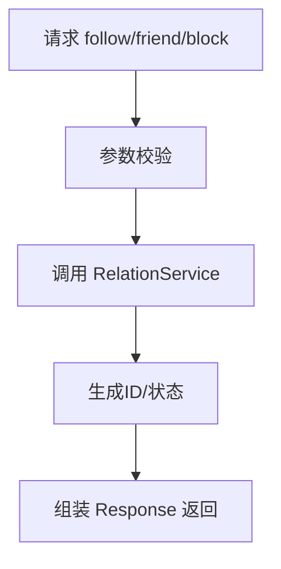
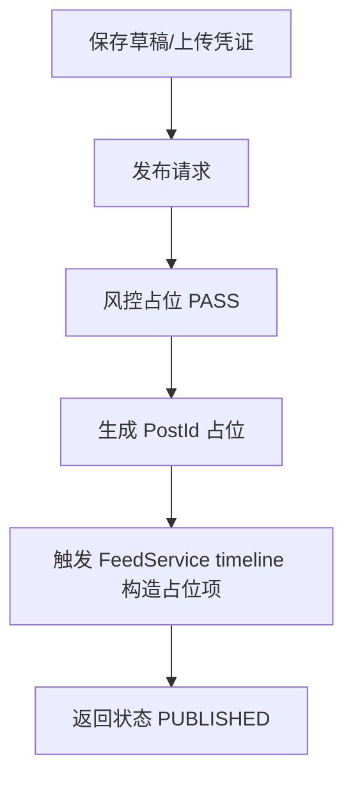
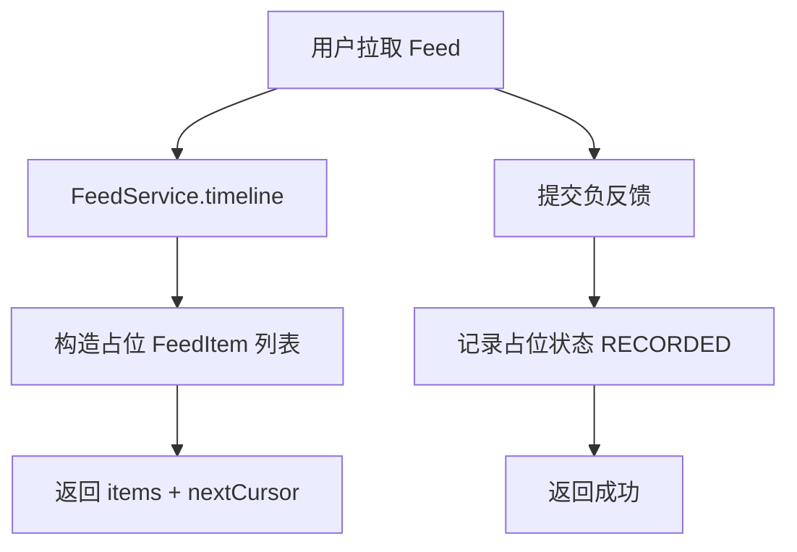

# 社交领域实现说明（2024-XX-XX）

## 总览
- 按 `.codex/DDD-ARCHITECTURE-SPECIFICATION.md` 分层落地社交接口：`api` 定义契约，`domain` 封装业务，`infrastructure` 提供 ID 端口存根，`trigger` 暴露 HTTP。
- 所有接口返回统一 `Response<T>`，领域服务使用 `ISocialIdPort` 生成占位 ID/时间；逻辑为无状态存根，便于后续替换为真实持久化与事件流。

## 模块与核心类
- API：`cn.nexus.api.social.*`（Relation/Content/Feed/Interaction/Risk/Community/Search），DTO 覆盖接口文档字段。
- Domain：`cn.nexus.domain.social.service.*` + `model.valobj.*`，以 VO 承载领域结果；端口 `ISocialIdPort`。
- Infrastructure：`cn.nexus.infrastructure.adapter.social.port.SocialIdPort`（后续可替换为雪花/Redis 计数）。
- Trigger：`cn.nexus.trigger.http.social.*Controller`，路径与接口文档一致，最小参数校验，直接组装 DTO。

## 主要流程（Mermaid）
### 关注/好友/屏蔽

### 发布内容与分发

### Feed 请求与负反馈

## 各域实现摘要
- **关系**：`RelationController`/`RelationService` 支持 follow、friend request/decision、block、分组管理；状态占位 PENDING/ACTIVE/BLOCKED。
- **内容**：`ContentController`/`ContentService` 支持上传会话、草稿保存/同步、发布、删除、定时、版本查询、回滚；版本列表返回示例两版。
- **分发**：`FeedController`/`FeedService` 支持主页、个人页 Feed；负反馈记录与撤销返回占位状态。
- **互动**：`InteractionController`/`InteractionService` 覆盖 reaction、comment、pin、通知列表、打赏、投票、余额查询；数据为伪造 ID/文案。
- **风控**：`RiskController`/`RiskService` 返回 PASS/clean、taskId、NORMAL 能力列表。
- **社群**：`CommunityController`/`CommunityService` 处理加群、踢人/封禁、改角色、频道配置，返回状态 JOINED/BANNED/ROLE_CHANGED。
- **搜索**：`SearchController`/`SearchService` 提供综合搜索、联想、热搜、清空历史，占位结果便于前端联调。

## 当前不足
- 全量为内存占位：未落库（表/Redis/ES），无幂等、无事务、无一致性保护。
- 无鉴权与风控真实校验；未接入事件总线（Post_Published、Relationship_Created 等）。
- HTTP 校验最小化，未覆盖参数合法性/黑名单/限流。
- 负反馈、通知、投票等均未做聚合与持久化，计数器与并发安全缺失。

## 改进方向
- **性能/可用性**：接入 Redis 计数器与缓存邻接表；Feed 收件箱使用 Redis List/ZSet；搜索走 ES，同步 CDC；ID 改为雪花或 Leaf。
- **业务正确性**：落地数据库模型（参考《社交领域数据库》），实现隐私校验、黑名单、审批状态机、风控扫描；补齐幂等键与重复提交保护。
- **一致性**：采用事件驱动（MQ）串联分发、通知、风控；关键写操作加事务边界或补偿表。
- **可观测性**：为关键接口添加埋点/日志/指标，区分用户可见错误与系统错误。
