# 9 个业务子领域：技术实现文档（基于项目代码）

面向：非技术同学（尽量用短句、少术语）。
范围：你列的 9 个子领域 + 它们在代码里的 HTTP 接口与关键异步链路（MQ）。
约定：如果代码里“看起来应该有，但实际没做/只是占位”，我会直接写明“未实现/占位”。

---

## 0. 先看懂一件事：一次请求怎么走

### 0.1 统一入口：Bearer token 怎么变成 `userId`

代码：`project/nexus/nexus-trigger/src/main/java/cn/nexus/trigger/http/support/UserContextInterceptor.java`
做法很简单：

1. 客户端带 `Authorization: Bearer <token>`
2. 后端拦截器从 token 里解析 `userId`
3. 放进 `ThreadLocal`（相当于“这一次请求的临时口袋”）
4. Controller 里用 `UserContext.requireUserId()` 直接拿到

极端情况（代码里明确处理）：
- 如果是 `OPTIONS` 预检请求：直接放行（不要求 token）
- 如果没有 token 或 token 解析不出用户：直接返回 `code=0002`（非法参数）
- 请求结束一定清理 ThreadLocal：防止线程复用导致“串号”

流程图：
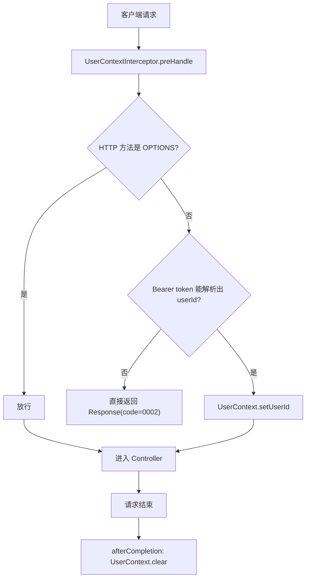
```mermaid
flowchart TD
  A["客户端请求"] --> B["UserContextInterceptor.preHandle"]
  B --> C{HTTP 方法是 OPTIONS?}
  C -- 是 --> D["放行"] --> E["进入 Controller"]
  C -- 否 --> F{Bearer token 能解析出 userId?}
  F -- 否 --> G["直接返回 Response(code=0002)"]
  F -- 是 --> H["UserContext.setUserId"]
  H --> E
  E --> I["请求结束"]
  I --> J["afterCompletion: UserContext.clear"]
```

### 0.2 统一响应格式：所有接口都返回同一种壳

代码：`project/nexus/nexus-api/src/main/java/cn/nexus/api/response/Response.java`
格式是：
```text
{ code: "0000", info: "成功", data: ... }
```

常见 `code/info`（代码：`project/nexus/nexus-types/src/main/java/cn/nexus/types/enums/ResponseCode.java`）：
- `0000` 成功
- `0001` 未知失败
- `0002` 非法参数
- `0404` 资源不存在
- `0409` 冲突
- `0410` 用户已停用

### 0.3 业务错误怎么返回：`AppException`

代码：`project/nexus/nexus-types/src/main/java/cn/nexus/types/exception/AppException.java`
很多 Controller 会 `catch (AppException e)`，把 `e.code/e.info` 透传回去。

注意：不是所有 Controller 都 catch。
- `UserProfileController / CommentController / InteractionController / RiskController / RiskAdminController / SearchController`：有 try-catch（更“稳”）
- `ContentController / FeedController / RelationController`：也已补上 try-catch（遇到业务异常会返回统一的 `code/info`，不会直接变成 Spring 500）

这不是对错问题，但你写接口文档/排障时要知道“哪里会直接爆栈”。

---

## 1. 接口覆盖清单（你可以用它做验收）

说明：下面每一个 HTTP 接口，我都会在对应子领域里写：
1) 这接口干嘛
2) 代码按什么顺序处理
3) 极端情况怎么兜住
4) 一张流程图（Mermaid）

### 1.1 用户
- `GET  /api/v1/user/me/profile`
- `GET  /api/v1/user/profile`
- `POST /api/v1/user/me/profile`

### 1.2 内容（发布/草稿/定时/媒体）
- `POST  /api/v1/media/upload/session`
- `PUT   /api/v1/content/draft`
- `PATCH /api/v1/content/draft/{draftId}`
- `POST  /api/v1/content/publish`
- `GET   /api/v1/content/publish/attempt/{attemptId}`
- `DELETE /api/v1/content/{postId}`
- `POST  /api/v1/content/schedule`
- `POST  /api/v1/content/schedule/cancel`
- `PATCH /api/v1/content/schedule`
- `GET   /api/v1/content/schedule/{taskId}`
- `GET   /api/v1/content/{postId}/history`
- `POST  /api/v1/content/{postId}/rollback`

### 1.3 Feed（时间线/分发/重建/推荐流）
- `GET    /api/v1/feed/timeline`
- `GET    /api/v1/feed/profile/{targetId}`
- `POST   /api/v1/feed/feedback/negative`
- `DELETE /api/v1/feed/feedback/negative/{targetId}`

### 1.4 评论（列表/回复/热榜/置顶）
- `GET    /api/v1/comment/list`
- `GET    /api/v1/comment/reply/list`
- `GET    /api/v1/comment/hot`
- `POST   /api/v1/interact/comment`（写评论）
- `POST   /api/v1/interact/comment/pin`（置顶）
- `DELETE /api/v1/comment/{commentId}`（删除）

### 1.5 点赞/反应（Reaction Like）
- `POST /api/v1/interact/reaction`
- `GET  /api/v1/interact/reaction/state`

### 1.6 通知（站内通知收件箱/已读）
- `GET  /api/v1/notification/list`
- `POST /api/v1/notification/read`
- `POST /api/v1/notification/read/all`
- MQ：`interaction.notify` 消费（写入通知收件箱）

### 1.7 社交关系（关注/好友/屏蔽）
- `POST /api/v1/relation/follow`
- `POST /api/v1/relation/unfollow`
- `POST /api/v1/relation/friend/request`
- `POST /api/v1/relation/friend/decision`
- `POST /api/v1/relation/block`

### 1.8 风控与信任（扫描/决策/申诉）
- `POST /api/v1/risk/decision`
- `POST /api/v1/risk/scan/text`
- `POST /api/v1/risk/scan/image`
- `GET  /api/v1/risk/user/status`
- `POST /api/v1/risk/appeals`

### 1.9 搜索与索引（搜索/热搜/历史/建索引）
- `GET    /api/v1/search/general`
- `GET    /api/v1/search/suggest`
- `GET    /api/v1/search/trending`
- `DELETE /api/v1/search/history`
- MQ：`post.published / post.updated / post.deleted / user.nickname_changed`（更新索引）

---

## 2. 子领域 1：用户（User）

入口代码：
- HTTP：`project/nexus/nexus-trigger/src/main/java/cn/nexus/trigger/http/user/UserProfileController.java`
- 领域服务：`project/nexus/nexus-domain/src/main/java/cn/nexus/domain/user/service/UserService.java`

关键依赖（你可以理解为“它要去问谁/改谁”）：
- `IUserProfileRepository`：读写用户资料（实际落在 `user_base`）
- `IUserStatusRepository`：读写用户状态（`user_status`，不存在默认 ACTIVE）
- `IRelationPolicyPort`：隐私/拉黑策略（用黑名单判断）
- `IUserEventOutboxPort`：昵称变更事件 outbox（最终驱动搜索索引更新）

### 2.1 `GET /api/v1/user/me/profile`（我自己的资料）

入口：`UserProfileController.myProfile()`

处理步骤（按代码）：
1. `UserContext.requireUserId()` 拿到 userId
2. `userProfileRepository.get(userId)` 查 profile
3. 查不到就返回 `0404`
4. `userStatusRepository.getStatus(userId)` 查状态（没记录默认 ACTIVE）
5. 拼成 DTO 返回

极端情况：
- 没有 Bearer token：在拦截器阶段就返回 `0002`
- profile 不存在：返回 `0404`（不是 0000+null）
- 其他异常：返回 `0001`（未知失败）

流程图：
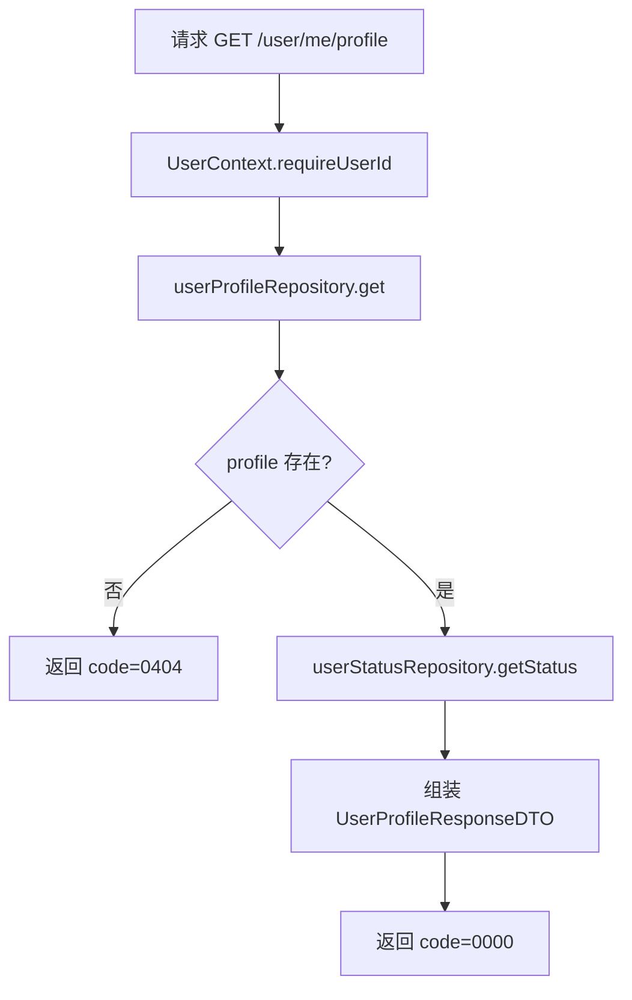
```mermaid
flowchart TD
  A["请求 GET /user/me/profile"] --> B["UserContext.requireUserId"]
  B --> C["userProfileRepository.get"]
  C --> D{profile 存在?}
  D -- 否 --> E["返回 code=0404"]
  D -- 是 --> F["userStatusRepository.getStatus"]
  F --> G["组装 UserProfileResponseDTO"]
  G --> H["返回 code=0000"]
```

### 2.2 `GET /api/v1/user/profile`（看别人的资料）

入口：`UserProfileController.profile(UserProfileQueryRequestDTO)`

处理步骤：
1. 取 viewerId（当前登录用户）
2. 校验 `targetUserId` 不能为空
3. 双向拉黑判断：任意一方拉黑另一方 => 返回 `0404`（隐藏“用户是否存在”）
4. 读 target 的 profile + status
5. 返回

极端情况（很关键）：
- `targetUserId` 为空：`0002` + 明确提示
- 拉黑：返回 `0404`（故意不暴露）

流程图：
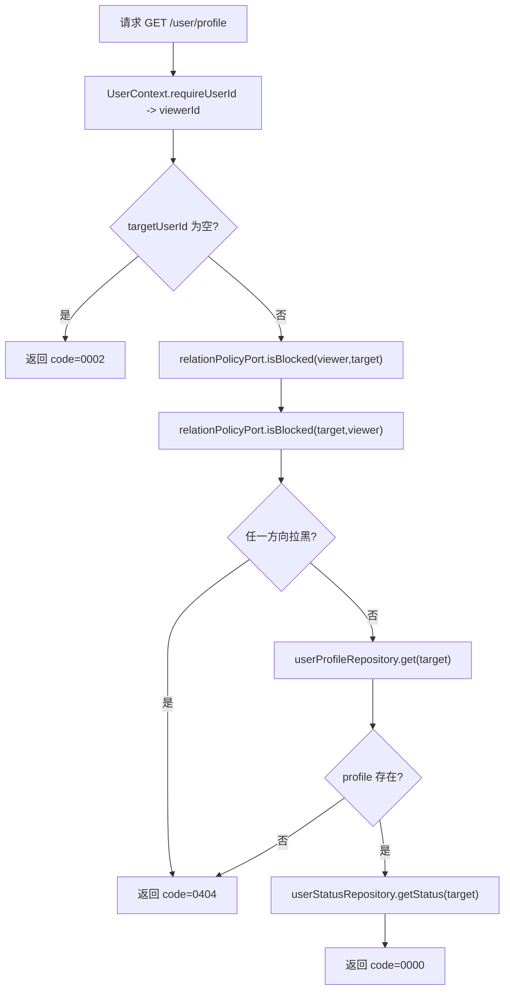
```mermaid
flowchart TD
  A["请求 GET /user/profile"] --> B["UserContext.requireUserId -> viewerId"]
  B --> C{targetUserId 为空?}
  C -- 是 --> D["返回 code=0002"]
  C -- 否 --> E["relationPolicyPort.isBlocked(viewer,target)"]
  E --> F["relationPolicyPort.isBlocked(target,viewer)"]
  F --> G{任一方向拉黑?}
  G -- 是 --> H["返回 code=0404"]
  G -- 否 --> I["userProfileRepository.get(target)"]
  I --> J{profile 存在?}
  J -- 否 --> H
  J -- 是 --> K["userStatusRepository.getStatus(target)"]
  K --> L["返回 code=0000"]
```

### 2.3 `POST /api/v1/user/me/profile`（改我自己的昵称/头像）

入口：`UserProfileController.updateMyProfile()` → `UserService.updateMyProfile()`

处理步骤（按代码）：
1. 校验 `userId/patch` 不为空
2. `ensureActiveForUserWrite`：如果用户是 `DEACTIVATED`，直接拒绝（`0410`）
3. 读取当前 profile（不存在就 `0404`）
4. 校验 nickname：允许 null（表示不改），但不允许空字符串
5. 有变更就 `userProfileRepository.updatePatch(...)`
6. 如果 nickname 真变了：写 outbox（`saveNicknameChanged`），并在事务提交后触发 `tryPublishPending`

极端情况：
- 用户停用：返回 `0410`
- nickname 传空串：返回 `0002`
- 只传 null（不改任何东西）：代码允许（会当成“没必要 update”，但仍返回 success）
- outbox 发布不会阻塞主流程：先落库，提交后再发 MQ（失败可重试）

流程图：
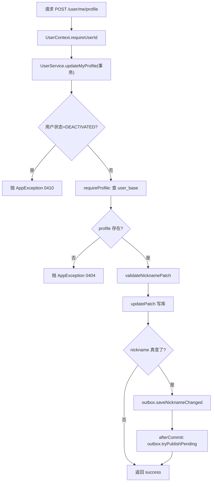
```mermaid
flowchart TD
  A["请求 POST /user/me/profile"] --> B["UserContext.requireUserId"]
  B --> C["UserService.updateMyProfile(事务)"]
  C --> D{用户状态=DEACTIVATED?}
  D -- 是 --> E["抛 AppException 0410"]
  D -- 否 --> F["requireProfile: 查 user_base"]
  F --> G{profile 存在?}
  G -- 否 --> H["抛 AppException 0404"]
  G -- 是 --> I["validateNicknamePatch"]
  I --> J["updatePatch 写库"]
  J --> K{nickname 真变了?}
  K -- 否 --> L["返回 success"]
  K -- 是 --> M["outbox.saveNicknameChanged"]
  M --> N["afterCommit: outbox.tryPublishPending"]
  N --> L
```

#### 2.4（异步）昵称变更如何影响“搜索索引”

链路是：`UserService` 写 outbox → 定时任务重试发布 → `SearchIndexConsumer` 消费 `user.nickname_changed` → ES 批量更新作者昵称。

流程图：
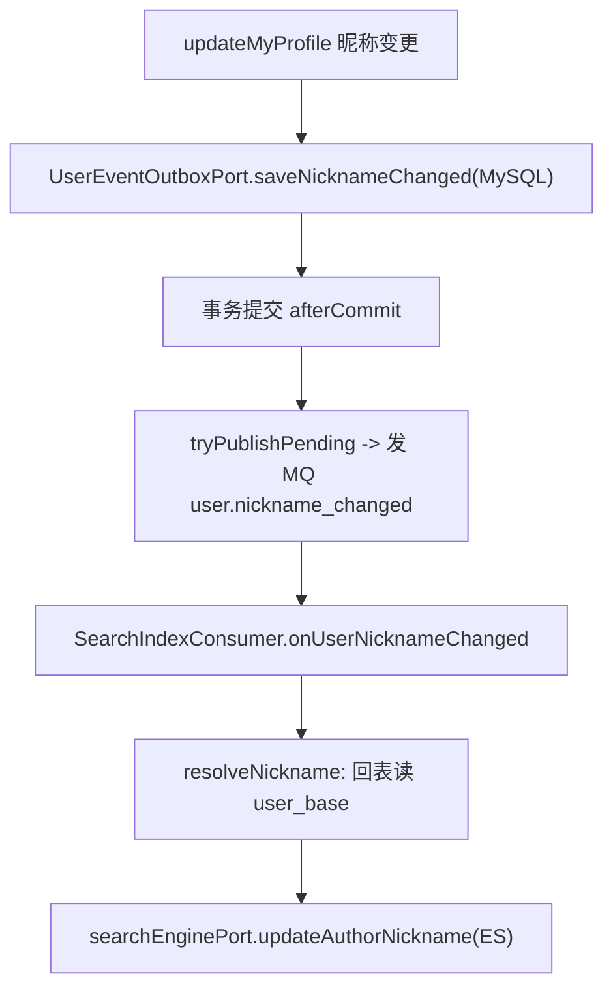
```mermaid
flowchart TD
  A["updateMyProfile 昵称变更"] --> B["UserEventOutboxPort.saveNicknameChanged(MySQL)"]
  B --> C["事务提交 afterCommit"]
  C --> D["tryPublishPending -> 发 MQ user.nickname_changed"]
  D --> E["SearchIndexConsumer.onUserNicknameChanged"]
  E --> F["resolveNickname: 回表读 user_base"]
  F --> G["searchEnginePort.updateAuthorNickname(ES)"]
```

---

## 3. 子领域 2：内容（发布/草稿/定时/媒体）

入口代码：
- HTTP：`project/nexus/nexus-trigger/src/main/java/cn/nexus/trigger/http/social/ContentController.java`
- 领域服务：`project/nexus/nexus-domain/src/main/java/cn/nexus/domain/social/service/ContentService.java`

这块的“核心数据”（你可以当成它的底座）：
- `content_post`：帖子当前可见版本（状态/版本号/正文/媒体等）
- `content_history`：每次成功写入的“版本快照”（全量文本快照）
- `content_publish_attempt`：一次发布请求的“过程记录”（幂等/风控/转码/错误原因）
- `content_draft`：云草稿
- `content_schedule`：定时发布任务

关键设计（先讲清楚，后面每个接口都会用到）：
- 幂等（防止重复点发布）：用 `idempotent_token` 做唯一键。重复请求会复用同一条 Attempt，直接返回相同结果。
- 并发（防止两个人/两台机器同时改同一条帖子）：先拿 Redis 分布式锁（`lock:content:post:<postId>`），再拿数据库行锁（`SELECT ... FOR UPDATE`），最后用“版本号乐观锁”兜底（`version_num` 必须等于期望值）。
- 事务后发 MQ（防止“消费者读到未提交数据”）：发布/更新/删除事件都在 `afterCommit` 里发。

---

### 3.1 `POST /api/v1/media/upload/session`（获取直传上传凭证）

入口：`ContentController.createUploadSession()` → `ContentService.createUploadSession()`

处理步骤（按代码）：
1. 校验 `fileSize`：大于 50MB 直接报错
2. 规范化 `fileType`：空/不在白名单 → 退回 `application/octet-stream`
3. 生成 `sessionId = "session-" + nextId`
4. 调用 `mediaStoragePort.generateUploadSession(...)`（MinIO 预签名 PUT URL）
5. 返回 `uploadUrl/token/sessionId`

极端情况：
- 文件太大：抛 `IllegalArgumentException`。注意 `ContentController` **没有 try-catch**，这种异常一般会变成 HTTP 500（不是 `{code:0002}`）。
- `fileType` 不合法：不会失败，只会回退到 `application/octet-stream`。
- MinIO 不可用/桶创建失败：抛 `RuntimeException`，同样可能 500。
- `crc32`：目前只是透传参数，存储端没有做二次校验（属于“占位”）。

流程图：
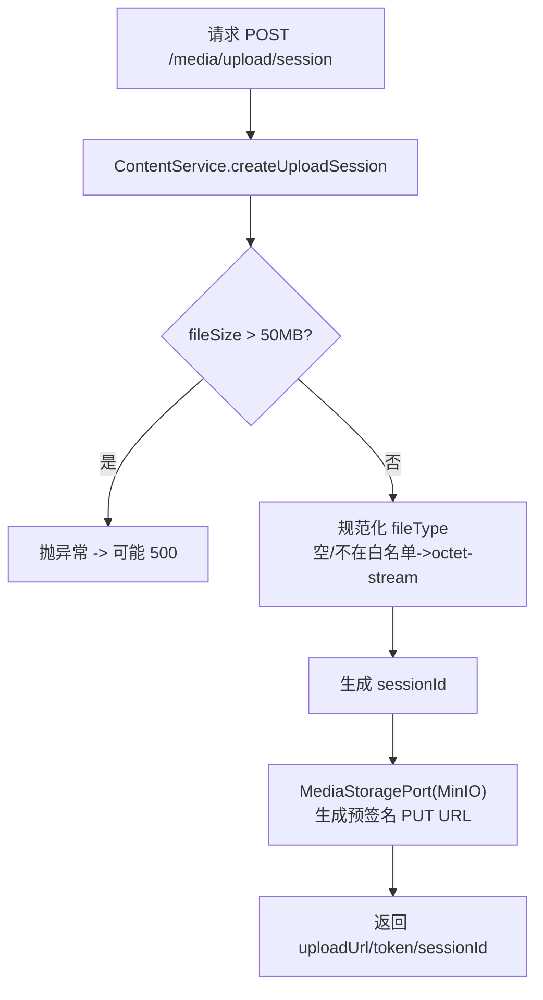
```mermaid
flowchart TD
  A["请求 POST /media/upload/session"] --> B["ContentService.createUploadSession"]
  B --> C{fileSize > 50MB?}
  C -- 是 --> D["抛异常 -> 可能 500"]
  C -- 否 --> E["规范化 fileType<br/>空/不在白名单->octet-stream"]
  E --> F["生成 sessionId"]
  F --> G["MediaStoragePort(MinIO)<br/>生成预签名 PUT URL"]
  G --> H["返回 uploadUrl/token/sessionId"]
```

---

### 3.2 `PUT /api/v1/content/draft`（新建草稿）

入口：`ContentController.saveDraft()` → `ContentService.saveDraft()`

处理步骤：
1. 从 `UserContext` 取 `userId`
2. 生成 `draftId`
3. 组装草稿实体（`deviceId` 固定写 `"unknown"`，`clientVersion` 固定写 `"1"`）
4. `contentRepository.saveDraft`（MySQL insertOrUpdate）
5. 返回 `draftId`

极端情况：
- 草稿正文/媒体可以为空：当前没做内容校验（保持简单）。
- 没有“版本冲突保护”：这个接口只负责“创建草稿”，不负责多端同步。
- DB 异常：Controller 无 try-catch，可能 500。

流程图：
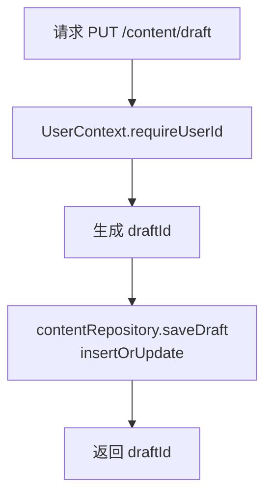
```mermaid
flowchart TD
  A["请求 PUT /content/draft"] --> B["UserContext.requireUserId"]
  B --> C["生成 draftId"]
  C --> D["contentRepository.saveDraft<br/>insertOrUpdate"]
  D --> E["返回 draftId"]
```

---

### 3.3 `PATCH /api/v1/content/draft/{draftId}`（同步草稿：用客户端版本号防旧覆盖）

入口：`ContentController.syncDraft()` → `ContentService.syncDraft()`

处理步骤：
1. **注意**：Controller 这里没有取 `userId`（不要求登录），直接同步
2. 查 `draftId` 对应草稿
3. 不存在：按入参创建新草稿并保存
4. 存在：比较 `clientVersion`（数字越大越新）
   - 如果入参版本 **更旧**：返回 `STALE_VERSION`（拒绝覆盖）
   - 否则覆盖内容/设备/版本号并保存
5. 返回 `SYNCED`，并把 `message` 写成 `serverVersion-<clientVersion>`

极端情况（很关键）：
- **未实现：登录/归属校验**。谁拿到 `draftId`，谁就能同步（通常不安全）。
- `diffContent` 这个名字像“增量 diff”，但当前实现是“直接覆盖成新内容”（属于命名误导，不影响功能）。
- `clientVersion` 不是数字：代码会当成“更新”，允许覆盖（可能引入误覆盖）。
- 返回字段里 `syncTime` 实际被填成了 `draftId`（字段命名与含义不一致）。

流程图：
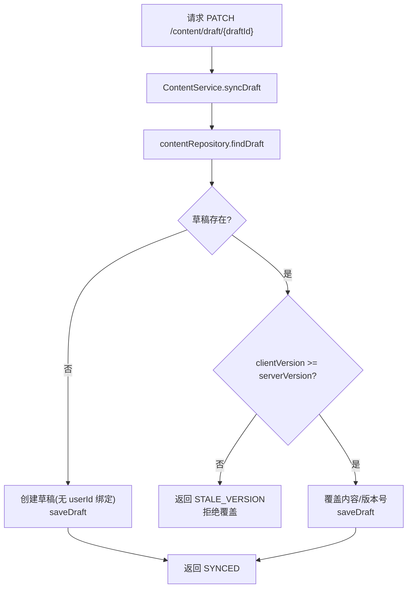
```mermaid
flowchart TD
  A["请求 PATCH /content/draft/{draftId}"] --> B["ContentService.syncDraft"]
  B --> C["contentRepository.findDraft"]
  C --> D{草稿存在?}
  D -- 否 --> E["创建草稿(无 userId 绑定)<br/>saveDraft"]
  D -- 是 --> F{clientVersion >= serverVersion?}
  F -- 否 --> G["返回 STALE_VERSION<br/>拒绝覆盖"]
  F -- 是 --> H["覆盖内容/版本号<br/>saveDraft"]
  E --> I["返回 SYNCED"]
  H --> I
```

---

### 3.4 `POST /api/v1/content/publish`（发布/更新内容：Attempt 化 + 风控 + 版本快照）

入口：`ContentController.publish()` → `ContentService.publish()`（事务）

你只要记住一句话：**一次 publish 请求，一定会先写一条 Attempt；只有“真正发布成功”才会写 `content_history` 新版本并更新 `content_post`。**

处理步骤（按代码主线）：
1. `postId` **必填**：
   - 新发帖：先 `PUT /api/v1/content/draft` 拿 `draftId`
   - 再 `POST /api/v1/content/publish` 传 `postId=draftId`
2. 获取分布式锁 `lock:content:post:<postId>`
3. `findPostForUpdate` 行锁查现有 post，并校验“只能改自己的”
4. 生成 `idempotent_token`（把 userId/postId/文本/媒体/位置/可见性/postTypes 拼起来做 SHA-256）
5. 创建 Attempt（`content_publish_attempt`）
   - 如果 `idempotent_token` 已存在（重复点发布）：直接读回旧 Attempt 并返回（幂等）
6. 调用 `riskService.decision(...)` 得到风控结论 `PASS/REVIEW/BLOCK/LIMIT/CHALLENGE`
7. 分支处理：
   - `BLOCK/LIMIT/CHALLENGE`：只把 Attempt 推进到 `RISK_REJECTED`，返回 `REJECTED`
   - `REVIEW`：**会写 `content_post` 为 `PENDING_REVIEW`，也会写 `content_history` 新版本**，Attempt 变 `PENDING_REVIEW`
   - `PASS`：进入“转码检查”（当前转码实现是占位：永远 ready）
     - 若转码未就绪：Attempt 变 `TRANSCODING`，返回 `PROCESSING`
     - 转码就绪：写 `content_post=PUBLISHED` + 写 `content_history` 新版本 + Attempt 变 `PUBLISHED`
8. 事务提交后发 MQ：
   - 新帖子：发 `post.published`
   - 旧帖子更新：发 `post.updated`

极端情况：
- 幂等：同样的输入重复请求，会命中 `DuplicateKeyException`，回读旧 Attempt，直接返回旧结果。
- 并发：即使拿到了 Redis 锁，DB 更新仍用 `version_num` 做乐观锁兜底；版本对不上会抛异常并回滚（Controller 无 try-catch，可能 500）。
- **注意**：风控 `REVIEW` 分支会更新 `content_post` 状态（可能影响“当前可见版本”）。这和注释里“失败不影响可见版本”的目标不完全一致，但这是当前代码真实行为。
- 转码：`MediaTranscodePort` 目前是占位实现（永远 ready），所以 `PROCESSING` 分支在现状下基本不会出现。
- `postTypes`：只有当客户端传了 `postTypes` 才覆盖写入；传 null 表示老客户端，不破坏旧数据。

流程图：
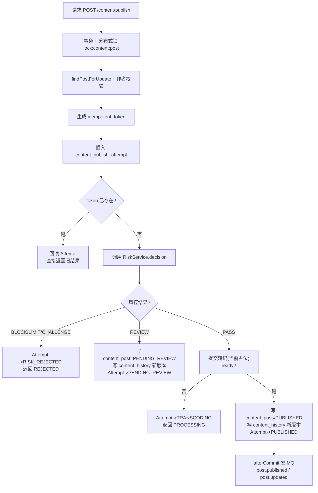
```mermaid
flowchart TD
  A["请求 POST /content/publish"] --> B["事务 + 分布式锁 lock:content:post"]
  B --> C["findPostForUpdate + 作者校验"]
  C --> D["生成 idempotent_token"]
  D --> E["插入 content_publish_attempt"]
  E --> F{token 已存在?}
  F -- 是 --> G["回读 Attempt<br/>直接返回旧结果"]
  F -- 否 --> H["调用 RiskService.decision"]
  H --> I{风控结果?}
  I -- BLOCK/LIMIT/CHALLENGE --> J["Attempt->RISK_REJECTED<br/>返回 REJECTED"]
  I -- REVIEW --> K["写 content_post=PENDING_REVIEW<br/>写 content_history 新版本<br/>Attempt->PENDING_REVIEW"]
  I -- PASS --> L["提交转码(当前占位)<br/>ready?"]
  L -- 否 --> M["Attempt->TRANSCODING<br/>返回 PROCESSING"]
  L -- 是 --> N["写 content_post=PUBLISHED<br/>写 content_history 新版本<br/>Attempt->PUBLISHED"]
  N --> O["afterCommit 发 MQ<br/>post.published / post.updated"]
```

---

### 3.5 `GET /api/v1/content/publish/attempt/{attemptId}`（查询发布尝试：只给本人看）

入口：`ContentController.publishAttempt()` → `ContentService.getPublishAttemptAudit()`

处理步骤：
1. 从 `UserContext` 取 `userId`
2. 按 `attemptId` 查 Attempt
3. 如果 Attempt 的 `userId != 当前 userId`：返回 `null`（隐藏存在性）
4. 返回 Attempt 的审计字段（状态、错误原因、转码 jobId 等）

极端情况：
- 这个接口签名里要求 `?userId=...`，但参数被 **忽略**（实际权限只看 Header 注入的 userId）。
- 查不到/无权限：返回 `code=0000, data=null`（不是 0404）。

流程图：
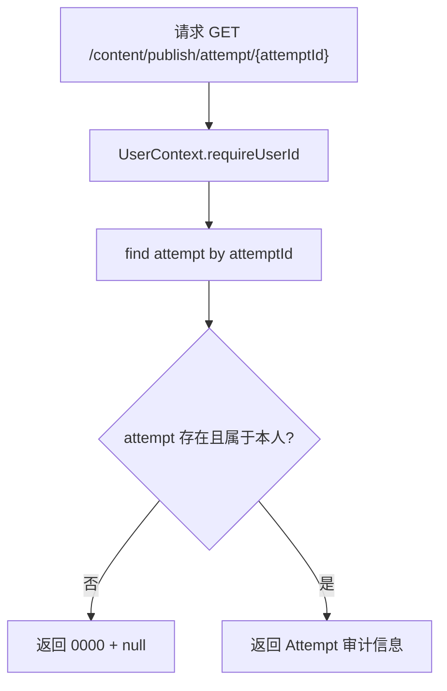
```mermaid
flowchart TD
  A["请求 GET /content/publish/attempt/{attemptId}"] --> B["UserContext.requireUserId"]
  B --> C["find attempt by attemptId"]
  C --> D{attempt 存在且属于本人?}
  D -- 否 --> E["返回 0000 + null"]
  D -- 是 --> F["返回 Attempt 审计信息"]
```

---

### 3.6 `DELETE /api/v1/content/{postId}`（删除：只能删自己的）

入口：`ContentController.delete()` → `ContentService.delete()`（事务）

处理步骤：
1. 取 `userId`
2. `softDelete(postId, userId)`：更新 `content_post.status=6`
3. 删除成功：事务提交后发 `post.deleted`
4. 返回 `DELETED / NOT_FOUND`

极端情况：
- “不存在 or 不是你的”：统一返回 `NOT_FOUND`（不解释具体原因）。
- MQ 在 `afterCommit` 失败：只记日志，不回滚删除（旁路不阻塞主流程）。

流程图：
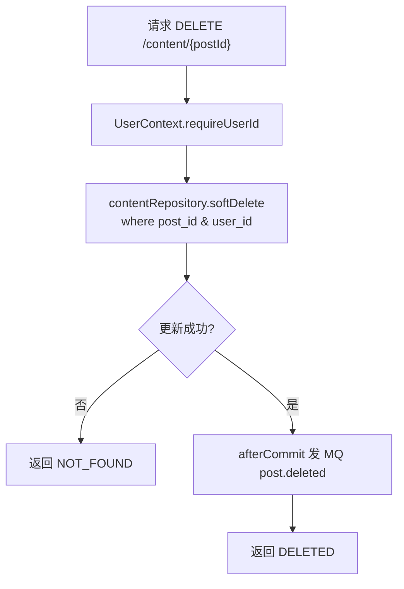
```mermaid
flowchart TD
  A["请求 DELETE /content/{postId}"] --> B["UserContext.requireUserId"]
  B --> C["contentRepository.softDelete<br/>where post_id & user_id"]
  C --> D{更新成功?}
  D -- 否 --> E["返回 NOT_FOUND"]
  D -- 是 --> F["afterCommit 发 MQ post.deleted"]
  F --> G["返回 DELETED"]
```

---

### 3.7 `POST /api/v1/content/schedule`（创建定时发布：幂等 token + 延时 MQ）

入口：`ContentController.schedule()` → `ContentService.schedule()`

处理步骤：
1. 取 `userId`
2. 生成 `idempotent_token = hash(userId + contentData + publishTime)`
3. 如果已存在同 token 且状态仍是“待执行”：直接返回旧 `taskId`（幂等）
4. 否则创建 `content_schedule` 任务（`status=0`）
5. Controller 计算 `delayMs = publishTime - now`，发送 RabbitMQ 延时消息（`x-delay`）

极端情况：
- **未实现：timezone**。接口收了 `timezone`，但服务端当前不使用。
- `publishTime` 为空：代码未显式校验，落库时可能因为 `schedule_time NOT NULL` 失败（会变成 500）。
- 即使是“重复任务”（幂等命中），Controller 仍会再发一次延时消息：所以消费侧必须幂等（它确实做了 Redis 锁 + 状态校验）。

流程图：
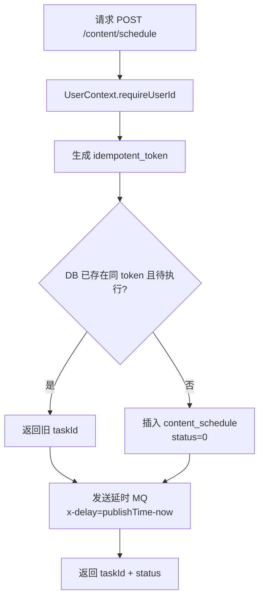
```mermaid
flowchart TD
  A["请求 POST /content/schedule"] --> B["UserContext.requireUserId"]
  B --> C["生成 idempotent_token"]
  C --> D{DB 已存在同 token 且待执行?}
  D -- 是 --> E["返回旧 taskId"]
  D -- 否 --> F["插入 content_schedule<br/>status=0"]
  E --> G["发送延时 MQ<br/>x-delay=publishTime-now"]
  F --> G
  G --> H["返回 taskId + status"]
```

---

### 3.8 `POST /api/v1/content/schedule/cancel`（取消定时：只能取消未执行的）

入口：`ContentController.cancelSchedule()` → `ContentService.cancelSchedule()`

处理步骤：
1. 查任务是否存在
2. 校验归属：必须是任务创建者
3. 只有 `status=0` 才能取消：更新 `status=3, is_canceled=1, last_error=reason`
4. 返回 `CANCELED / CANCEL_FAIL`

极端情况：
- 任务已经执行/完成：取消会失败（返回 `CANCEL_FAIL`）。
- 取消原因被写到 `last_error` 字段（字段名不太贴切，但这是当前实现）。

流程图：
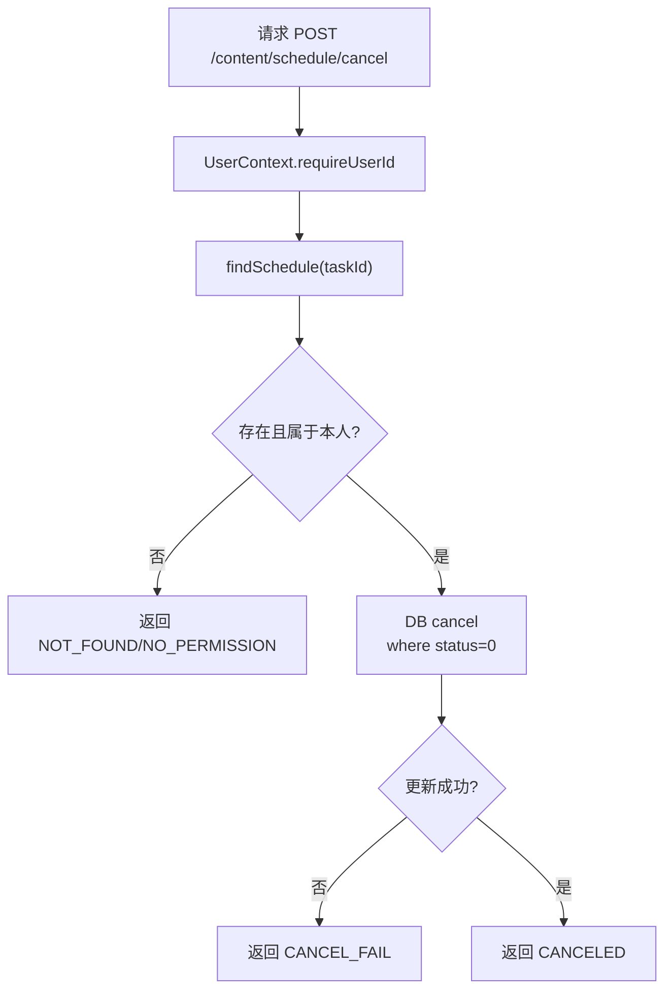
```mermaid
flowchart TD
  A["请求 POST /content/schedule/cancel"] --> B["UserContext.requireUserId"]
  B --> C["findSchedule(taskId)"]
  C --> D{存在且属于本人?}
  D -- 否 --> E["返回 NOT_FOUND/NO_PERMISSION"]
  D -- 是 --> F["DB cancel<br/>where status=0"]
  F --> G{更新成功?}
  G -- 否 --> H["返回 CANCEL_FAIL"]
  G -- 是 --> I["返回 CANCELED"]
```

---

### 3.9 `PATCH /api/v1/content/schedule`（变更定时：只能改未执行的）

入口：`ContentController.updateSchedule()` → `ContentService.updateSchedule()`

处理步骤：
1. 查任务 + 校验归属
2. 校验未取消、状态必须是待执行（`status=0`）
3. 重新生成 `idempotent_token = hash(contentData + publishTime)` 并更新任务

极端情况：
- **潜在冲突风险**：更新时生成 token 没带 `userId`，而表上 `idempotent_token` 是全局唯一键，理论上可能和别人的任务撞 token（会触发 DB 唯一键异常 → 可能 500）。
- `publishTime` 为空同样可能触发 DB NOT NULL 问题（未显式校验）。

流程图：
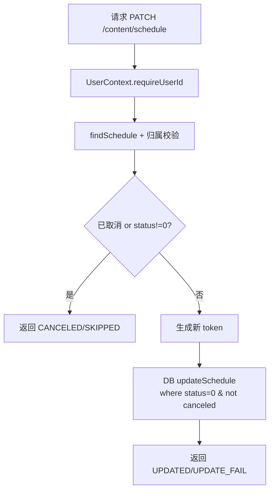
```mermaid
flowchart TD
  A["请求 PATCH /content/schedule"] --> B["UserContext.requireUserId"]
  B --> C["findSchedule + 归属校验"]
  C --> D{已取消 or status!=0?}
  D -- 是 --> E["返回 CANCELED/SKIPPED"]
  D -- 否 --> F["生成新 token"]
  F --> G["DB updateSchedule<br/>where status=0 & not canceled"]
  G --> H["返回 UPDATED/UPDATE_FAIL"]
```

---

### 3.10 `GET /api/v1/content/schedule/{taskId}`（查询定时任务审计：只给本人看）

入口：`ContentController.scheduleAudit()` → `ContentService.getScheduleAudit()`

处理步骤：
1. 取 `userId`
2. 查任务
3. 不是本人任务：返回 `null`
4. 返回任务字段（时间/状态/重试次数/最后错误/是否告警等）

极端情况：
- 这个接口签名里要求 `?userId=...`，但参数被忽略（权限只看 Header 注入的 userId）。
- 查不到/无权限：返回 `0000 + null`（不是 0404）。

流程图：
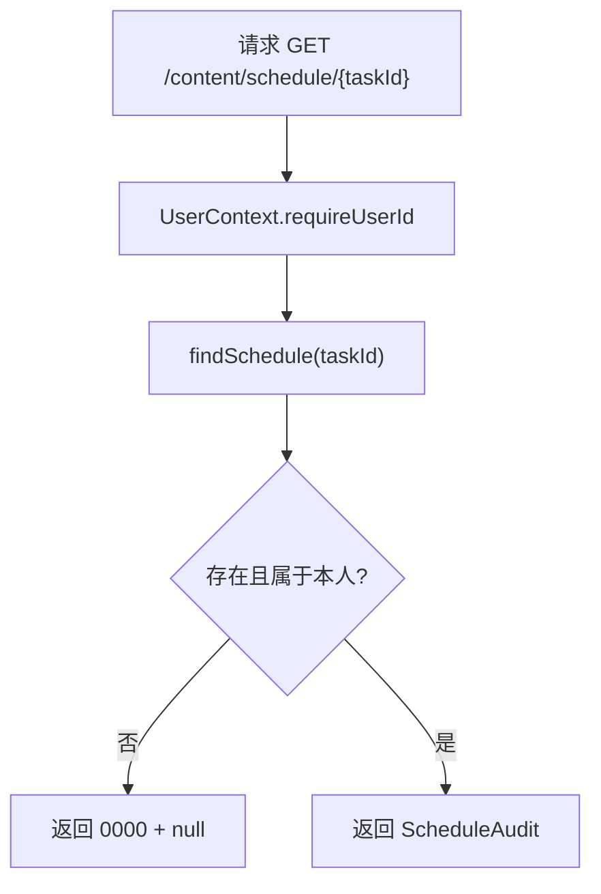
```mermaid
flowchart TD
  A["请求 GET /content/schedule/{taskId}"] --> B["UserContext.requireUserId"]
  B --> C["findSchedule(taskId)"]
  C --> D{存在且属于本人?}
  D -- 否 --> E["返回 0000 + null"]
  D -- 是 --> F["返回 ScheduleAudit"]
```

---

### 3.11 `GET /api/v1/content/{postId}/history`（版本历史：只给作者看）

入口：`ContentController.history()` → `ContentService.history()`

处理步骤：
1. 取 `userId`
2. 查 `content_post`，如果帖子存在且作者不是本人：返回空列表 + `status=NO_PERMISSION`
3. `limit` 默认 20，最大 100；`offset` 默认 0
4. `listHistory(postId, limit+1, offset)` 拉一页
5. 组装 `versions`，并算 `nextCursor = offset + limit`

极端情况：
- “无权限”不是 0404：直接返回空列表（这对排障不太友好，但这是现状）。
- 游标是 offset：如果中途又新增版本，可能出现“翻页重复/跳过”（属于 offset 分页的固有问题）。

流程图：
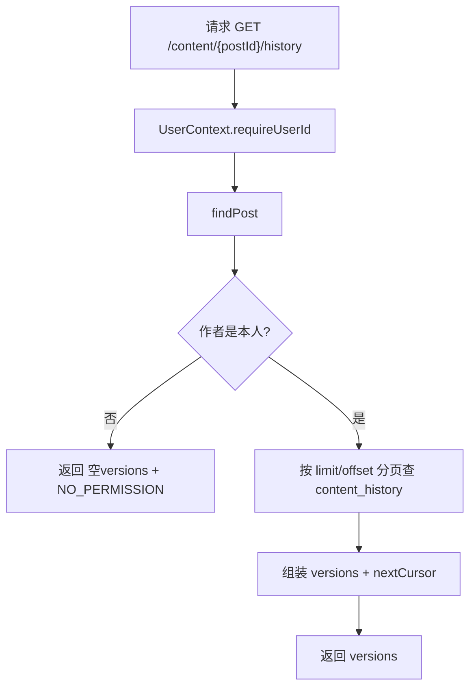
```mermaid
flowchart TD
  A["请求 GET /content/{postId}/history"] --> B["UserContext.requireUserId"]
  B --> C["findPost"]
  C --> D{作者是本人?}
  D -- 否 --> E["返回 空versions + NO_PERMISSION"]
  D -- 是 --> F["按 limit/offset 分页查 content_history"]
  F --> G["组装 versions + nextCursor"]
  G --> H["返回 versions"]
```

---

### 3.12 `POST /api/v1/content/{postId}/rollback`（回滚到某个历史版本）

入口：`ContentController.rollback()` → `ContentService.rollback()`（事务）

处理步骤：
1. 取 `userId`，获取 `lock:content:post:<postId>` 分布式锁
2. `findPostForUpdate` 行锁查 post，并校验作者
3. 查目标版本 `content_history(postId, versionNum)`
4. 新建一个“更高版本号”的快照，并把 `content_post` 更新到这个新版本

极端情况（按代码真实行为）：
- 目标版本不存在：返回 `VERSION_NOT_FOUND`。
- **如果 post 不存在**：代码仍可能写入一条新的 `content_history` 记录，但 `content_post` 更新会失败（这会留下“只有历史、没有主表”的脏数据风险）。
- 回滚后没有发 `post.updated` 事件：Feed/搜索索引可能不会立刻更新（未实现：回滚后的分发通知）。

流程图：
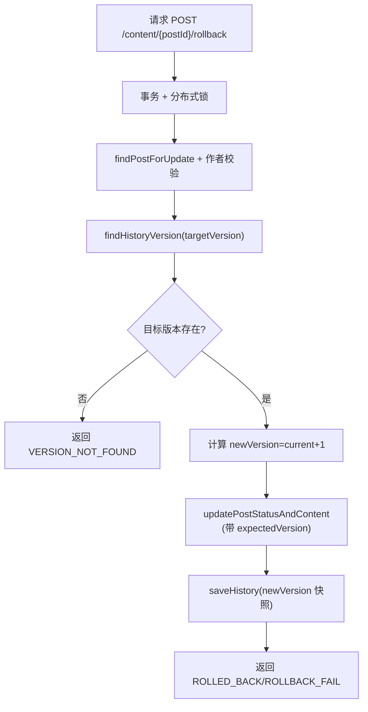
```mermaid
flowchart TD
  A["请求 POST /content/{postId}/rollback"] --> B["事务 + 分布式锁"]
  B --> C["findPostForUpdate + 作者校验"]
  C --> D["findHistoryVersion(targetVersion)"]
  D --> E{目标版本存在?}
  E -- 否 --> F["返回 VERSION_NOT_FOUND"]
  E -- 是 --> G["计算 newVersion=current+1"]
  G --> H["updatePostStatusAndContent<br/>(带 expectedVersion)"]
  H --> I["saveHistory(newVersion 快照)"]
  I --> J["返回 ROLLED_BACK/ROLLBACK_FAIL"]
```

---

#### 3.13（异步）定时发布延时消息：`content.schedule.delay.queue`

入口代码：
- Producer：`project/nexus/nexus-trigger/src/main/java/cn/nexus/trigger/mq/producer/ContentScheduleProducer.java`
- Consumer：`project/nexus/nexus-trigger/src/main/java/cn/nexus/trigger/mq/consumer/ContentScheduleConsumer.java`

处理步骤：
1. 到点后消费到 `taskId`
2. 先拿 Redis 锁 `content:schedule:lock:<taskId>`（60 秒），防重复消费
3. 调 `ContentService.executeSchedule(taskId)`：内部会再次校验状态/取消标记，然后走 publish
4. 发生异常：投递到死信队列（DLQ）
5. 最后释放锁

极端情况：
- 同一个任务如果被投递多次：Redis 锁会让后续消息直接跳过（不会二次执行）。
- executeSchedule 内部会做重试计数与退避（最多 5 次），超限会把任务标成取消并打告警标记。

流程图：
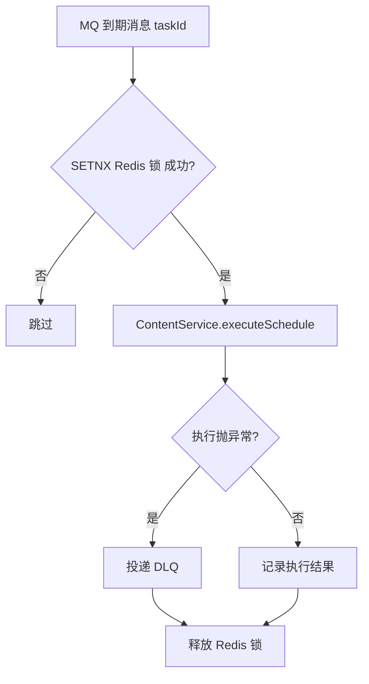
```mermaid
flowchart TD
  A["MQ 到期消息 taskId"] --> B{SETNX Redis 锁 成功?}
  B -- 否 --> C["跳过"]
  B -- 是 --> D["ContentService.executeSchedule"]
  D --> E{执行抛异常?}
  E -- 是 --> F["投递 DLQ"]
  E -- 否 --> G["记录执行结果"]
  F --> H["释放 Redis 锁"]
  G --> H
```

---

#### 3.14（异步）定时发布死信告警：`content.schedule.dlx.queue`（占位）

入口：`ContentScheduleDLQConsumer.onDLQ()`

当前实现：只打日志，并尝试回查任务详情用于排障；没有接入真正的告警系统（占位）。

流程图：
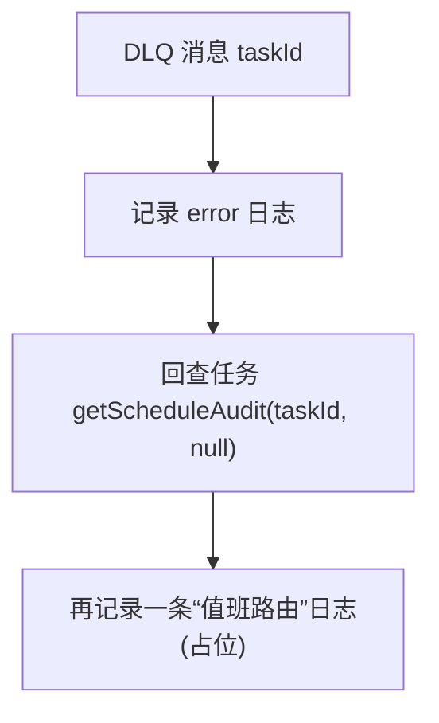
```mermaid
flowchart TD
  A["DLQ 消息 taskId"] --> B["记录 error 日志"]
  B --> C["回查任务 getScheduleAudit(taskId, null)"]
  C --> D["再记录一条“值班路由”日志<br/>(占位)"]
```

---

## 4. 子领域 3：Feed（时间线/分发/重建/推荐流）

入口代码：
- HTTP：`project/nexus/nexus-trigger/src/main/java/cn/nexus/trigger/http/social/FeedController.java`
- 领域服务：`project/nexus/nexus-domain/src/main/java/cn/nexus/domain/social/service/FeedService.java`

关键依赖（你可以理解为“它要去问谁/改谁”）：
- `IFeedTimelineRepository`：用户 inbox（时间线索引，主要在 Redis）
- `IFeedOutboxRepository`：作者 outbox（作者发布索引）
- `IFeedBigVPoolRepository`：大 V 聚合池（可选，用于读侧补“大 V 候选”）
- `IFeedGlobalLatestRepository`：全站 latest（RECOMMEND 降级兜底候选源）
- `IFeedRecommendSessionRepository`：推荐 session 候选缓存（RECOMMEND 的 scanIndex 用它推进）
- `IRelationAdjacencyCachePort`：关注列表缓存（读关注列表）
- `IRelationRepository`：查粉丝数（判定大 V / 读侧拉 Outbox）
- `IContentRepository`：回表拿帖子正文/作者/时间
- `IFeedNegativeFeedbackRepository`：负反馈（不想看/屏蔽类型）
- `IFeedInboxRebuildService`：inbox miss 时重建
- `IRecommendationPort`：推荐系统（Gorse）：提供 recommend/popular/neighbors 候选；未启用时这些接口返回空，但 RECOMMEND 会继续用全站 latest 尝试补齐。

关键设计（这几条会在每个接口里反复出现）：
- `limit` 归一化：默认 20，最大 100（防止一次拉太多）
- `cursor` 协议（不同 feedType 不一样）：
  - FOLLOW：cursor 只传 `postId`；服务端会回表把它变成 `(createTimeMs, postId)` 用来翻页
  - PROFILE：cursor 是 `{lastCreateTimeMs}:{lastPostId}`
  - RECOMMEND：cursor 是 `{sessionId}:{scanIndex}`（扫描指针，不是“已返回条数”）
  - POPULAR：cursor 是 `offset`（扫描指针）
  - NEIGHBORS：cursor 是 `{seedPostId}:{offset}`

---

### 4.1 `GET /api/v1/feed/timeline`（首页/推荐/热门/相似：同一个入口）

入口：`FeedController.timeline()` → `FeedService.timeline()`

处理步骤（按代码主线）：
1. `UserContext.requireUserId()` 拿到 userId
2. 规范化 `limit`（默认 20，最大 100）
3. 读取 `feedType`（空/未知都当 FOLLOW）
4. 分支：
   - `feedType=RECOMMEND`：走推荐流（`recommendTimeline`，带 sessionId+scanIndex）
   - `feedType=POPULAR`：走热门流（`popularTimeline`，用 offset 扫描）
   - `feedType=NEIGHBORS`：走相似流（`neighborsTimeline`，必须带 seedPostId+offset）
   - 其他：走 FOLLOW（读 inbox + 可能重建 + 大 V 候选合并）

FOLLOW 分支（你可以理解为“正常首页时间线”）：
1. 如果 `cursor` 为空（首页第一页）：`feedInboxRebuildService.rebuildIfNeeded(userId)`（**只有 inbox key miss 才会真的重建**）
2. 如果 `cursor` 非空：`resolveMaxIdCursor(cursorPostId)` 回表查这条 post 的 `createTime`  
   - 查不到 / cursor 不是数字：直接返回空列表（认为游标非法）
3. `feedTimelineRepository.pageInboxEntries(...)` 拉一批 inbox 候选（scanLimit=limit*3）
4. 从关注缓存拿 followings，再补“大 V 候选”（Outbox / BigVPool）并合并去重
5. `contentRepository.listPostsByIds(postIds)` 批量回表拿帖子正文
6. 负反馈过滤：按 `postId` + `postTypes` 两层过滤
7. 返回 items + nextCursor（最后一条的 postId）

极端情况：
- `feedType` 乱填：不会报错，只会当 FOLLOW（兼容老客户端）
- FOLLOW 翻页 cursor 非法：**直接返回空列表**（不兜底重建）
- 批量回表时发现“索引里有，但内容表没有”：会做清理（从 inbox/outbox/bigVPool 移除脏索引）
- RECOMMEND：优先 gorse；gorse 不可用/为空会降级用全站 latest 补齐，所以 baseUrl 为空**不一定**空
- POPULAR/NEIGHBORS：当前没有降级，baseUrl 为空会返回空列表（不是报错）

流程图：
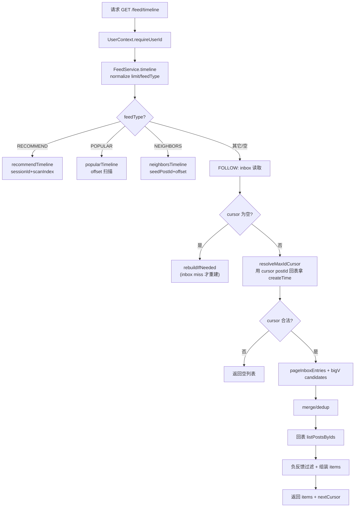
```mermaid
flowchart TD
  A["请求 GET /feed/timeline"] --> B["UserContext.requireUserId"]
  B --> C["FeedService.timeline<br/>normalize limit/feedType"]
  C --> D{feedType?}
  D -- RECOMMEND --> E["recommendTimeline<br/>sessionId+scanIndex"]
  D -- POPULAR --> F["popularTimeline<br/>offset 扫描"]
  D -- NEIGHBORS --> G["neighborsTimeline<br/>seedPostId+offset"]
  D -- 其它/空 --> H["FOLLOW: inbox 读取"]
  H --> I{cursor 为空?}
  I -- 是 --> J["rebuildIfNeeded<br/>(inbox miss 才重建)"]
  I -- 否 --> K["resolveMaxIdCursor<br/>用 cursor postId 回表拿 createTime"]
  K --> L{cursor 合法?}
  L -- 否 --> M["返回空列表"]
  L -- 是 --> N["pageInboxEntries + bigV candidates"]
  N --> O["merge/dedup"]
  O --> P["回表 listPostsByIds"]
  P --> Q["负反馈过滤 + 组装 items"]
  Q --> R["返回 items + nextCursor"]
```

---

### 4.2 `GET /api/v1/feed/profile/{targetId}`（个人页：只看某人的已发布内容）

入口：`FeedController.profile()` → `FeedService.profile()`

处理步骤：
1. `UserContext.requireUserId()` 拿 visitorId（**当前实现里 visitorId 没参与权限判断**）
2. `contentRepository.listUserPosts(targetId, cursor, limit)`（cursor 协议：`{lastCreateTimeMs}:{lastPostId}`）
3. 把 `ContentPostEntity` 映射为 `FeedItemVO(source=PROFILE)` 返回

极端情况：
- `targetId` 为空：返回空列表
- `cursor` 格式不对：由 `contentRepository` 自己决定怎么处理（通常返回第一页或空）

流程图：
```mermaid
flowchart TD
  A["请求 GET /feed/profile/{targetId}"] --> B["UserContext.requireUserId"]
  B --> C["FeedService.profile<br/>normalize limit"]
  C --> D["contentRepository.listUserPosts<br/>按 createTime/postId 倒序分页"]
  D --> E["映射为 FeedItem(source=PROFILE)"]
  E --> F["返回 items + nextCursor"]
```

---

### 4.3 `POST /api/v1/feed/feedback/negative`（负反馈：不想看/不感兴趣）

入口：`FeedController.submitNegativeFeedback()` → `FeedService.negativeFeedback()`

处理步骤：
1. `UserContext.requireUserId()` 拿 userId
2. 参数校验：`userId/targetId` 任意为空 → 返回 `success=false, status=INVALID`
3. `feedNegativeFeedbackRepository.add(...)` 记录负反馈（用于读侧过滤）
4. 如果传了 `type`：服务端会回表查该帖 `postTypes`，只有 **type 真属于这条帖** 才会保存为“屏蔽类型”
5. 返回 `RECORDED`

极端情况：
- 这个接口**不会抛 AppException**，参数错也会返回 code=0000，只是 `data.success=false`
- `extraTags` 当前不参与任何判断（占位）
- `type` 不在帖子的 `postTypes` 里：会被忽略（不报错）

流程图：
```mermaid
flowchart TD
  A["请求 POST /feed/feedback/negative"] --> B["UserContext.requireUserId"]
  B --> C{userId 或 targetId 为空?}
  C -- 是 --> D["返回 success=false<br/>status=INVALID"]
  C -- 否 --> E["negativeFeedbackRepository.add"]
  E --> F{传了 type?}
  F -- 否 --> G["返回 RECORDED"]
  F -- 是 --> H["回表 findPost<br/>校验 type ∈ postTypes"]
  H --> I{校验通过?}
  I -- 否 --> G
  I -- 是 --> J["saveSelectedPostType"]
  J --> G
```

---

### 4.4 `DELETE /api/v1/feed/feedback/negative/{targetId}`（撤销负反馈）

入口：`FeedController.cancelNegativeFeedback()` → `FeedService.cancelNegativeFeedback()`

处理步骤：
1. `UserContext.requireUserId()` 拿 userId
2. 参数校验：`userId/targetId` 任意为空 → 返回 `INVALID`
3. `feedNegativeFeedbackRepository.remove(...)`
4. 同时清掉“屏蔽类型选择”（`removeSelectedPostType`）
5. 返回 `CANCELLED`

极端情况：
- Controller 虽然收了 body（`CancelNegativeFeedbackRequestDTO`），但当前实现 **完全不使用**（占位）

流程图：
```mermaid
flowchart TD
  A["请求 DELETE /feed/feedback/negative/{targetId}"] --> B["UserContext.requireUserId"]
  B --> C{参数齐全?}
  C -- 否 --> D["返回 INVALID"]
  C -- 是 --> E["negativeFeedbackRepository.remove"]
  E --> F["removeSelectedPostType"]
  F --> G["返回 CANCELLED"]
```

---

#### 4.5（异步）一条新帖子怎么写进粉丝的时间线（写扩散 fanout）

入口（两段链路）：
- 发布后发事件：`ContentService.publish()` 在 `afterCommit` 发 `post.published`
- 消费与拆片：`FeedFanoutDispatcherConsumer.onMessage(PostPublishedEvent)`
- 执行切片：`FeedFanoutTaskConsumer.onMessage(FeedFanoutTask)` → `FeedDistributionService.fanoutSlice(...)`

处理步骤（按代码）：
1. Dispatcher 收到 `post.published`
2. 永远写 `Outbox`（作者维度，幂等）
3. 永远把帖子写入作者自己的 inbox（体验保底）
4. 写入全站 latest（推荐系统不可用时的兜底候选源，旁路）
5. 计算作者粉丝数：
   - 大 V（粉丝数 >= 阈值）：不做全量写扩散，改为写 `BigVPool` + “只推铁粉”
   - 普通作者：按 `batchSize` 拆成多个 `FeedFanoutTask(offset+limit)` 投递
6. TaskConsumer 消费某一片粉丝，分页拉粉丝 ID
7. 只对“在线用户”（inbox key 存在）写入 inbox，离线的跳过（省成本）

极端情况：
- 超大粉丝量：拆片后失败只重试某一片，不用从 0 全量重跑
- 离线用户收不到写扩散：后续靠 `rebuildIfNeeded` 补（最终一致）
- Consumer 里抛 `AmqpRejectAndDontRequeueException`：不会 requeue（依赖 MQ 的 DLQ 配置兜底）

流程图：
```mermaid
flowchart TD
  A["post.published 事件"] --> B["FeedFanoutDispatcherConsumer"]
  B --> C["写 Outbox"]
  C --> D["写 作者自己 inbox"]
  D --> E["写 GlobalLatest(旁路)"]
  E --> F["统计粉丝数"]
  F --> G{大V?}
  G -- 是 --> H["写 BigVPool + 推铁粉(在线)"]
  G -- 否 --> I["按 batchSize 拆片投递 FeedFanoutTask"]
  I --> J["FeedFanoutTaskConsumer"]
  J --> K["FeedDistributionService.fanoutSlice<br/>拉粉丝ID"]
  K --> L["filterOnlineUsers<br/>只写在线 inbox"]
```

---

#### 4.6（被动重建）为什么首页 cursor 为空时会“重建 inbox”

入口：`FeedService.timeline()`（首页第一页）→ `FeedInboxRebuildService.rebuildIfNeeded()`

处理步骤：
1. 如果 `feedTimelineRepository.inboxExists(userId)`：直接跳过（说明已经有 inbox 索引）
2. 否则：
   - 取关注列表（最多 2000 个）+ 自己
   - 每个关注对象拉最近 N 条帖子（默认 20）
   - 把所有候选按时间倒序合并
   - 过滤负反馈（postId/postType）
   - 截断到 inboxSize（默认 200）
   - `replaceInbox(userId, entries)` 一次性写回

极端情况：
- 关注太多：只取前 `maxFollowings`（防止重建太慢）
- 没关注任何人：最终 inbox 会变成空列表（不是报错）

流程图：
```mermaid
flowchart TD
  A["首页 GET /feed/timeline<br/>cursor 为空"] --> B["rebuildIfNeeded(userId)"]
  B --> C{inboxExists?}
  C -- 是 --> D["跳过重建"]
  C -- 否 --> E["取 followings(<=maxFollowings)+自己"]
  E --> F["每人拉最近 perFollowingLimit 条"]
  F --> G["合并排序(时间倒序)"]
  G --> H["过滤负反馈"]
  H --> I["截断到 inboxSize"]
  I --> J["replaceInbox 写回"]
```

---

## 5. 子领域 4：评论（列表/回复/热榜/置顶）

入口代码：
- HTTP（读/删）：`project/nexus/nexus-trigger/src/main/java/cn/nexus/trigger/http/social/CommentController.java`
- 领域服务（读）：`project/nexus/nexus-domain/src/main/java/cn/nexus/domain/social/service/CommentQueryService.java`
- HTTP（写/置顶）：`project/nexus/nexus-trigger/src/main/java/cn/nexus/trigger/http/social/InteractionController.java`
- 领域服务（写/置顶/删）：`project/nexus/nexus-domain/src/main/java/cn/nexus/domain/social/service/InteractionService.java`

关键依赖（你可以理解为“它要去问谁/改谁”）：
- `ICommentRepository`：评论主数据（MySQL）
- `ICommentPinRepository`：置顶评论（按 postId 存 pinnedCommentId）
- `ICommentHotRankRepository`：评论热榜（派生缓存，通常是 Redis ZSET）
- `IUserBaseRepository`：补齐昵称/头像（展示用）
- `IRiskService`：写评论前先做风控决策（可能进入待审核）
- `ICommentEventPort`：发布评论相关事件（驱动热榜/计数）
- `IInteractionNotifyEventPort`：发布“评论/提及”通知事件

关键设计（先讲清楚，后面每个接口都会用到）：
- **两层结构**：一级评论 `rootId=null`；楼内回复 `rootId!=null`（指向根评论）
- **状态**：
  - `status=1`：正常可见
  - `status=0`：待审核（只对作者本人可见）
  - 其他状态：读侧当作不可见（例如已删除）
- **读接口先拿 ID 再回表**：先分页拿 commentId 列表，再 `listByIds(ids)` 一次回表（并按 ids 顺序还原）
- **热榜是派生缓存**：失败不影响主流程，靠后续事件再修（最终一致）

---

### 5.1 `GET /api/v1/comment/list`（一级评论列表：含 pinned + 回复预览）

入口：`CommentController.list()` → `CommentQueryService.listRootComments()`

处理步骤（按代码）：
1. `viewerId = UserContext.getUserId()`（**可为空：不要求登录**）
2. 校验 `postId`：为空直接抛 `AppException(0002)`
3. 规范化分页参数：`limit` 默认 20，最大 50；`preloadReplyLimit` 默认 3，最大 10
4. 读 pinned：`commentPinRepository.getPinnedCommentId(postId)` → `loadPinned(...)`
   - pinned 脏了（不存在/不是该 post 的根评/不是正常状态）会自动 `clear(postId)`
5. 拉 rootId 列表：`commentRepository.pageRootCommentIds(postId, pinnedId, cursor, limit, viewerId)`
6. 回表 + 回复预览：`loadRootsWithPreview(rootIds, preload, viewerId)`
   - 只保留根评（`rootId==null`）
   - `status=1` 可见；`status=0` 仅作者本人可见
7. 补齐昵称头像：收集所有 userId → `userBaseRepository.listByUserIds(...)` → 回填到 CommentViewVO
8. 计算 nextCursor：`{lastCreateTimeMs}:{lastCommentId}`

极端情况：
- `viewerId` 为空：你看不到任何“待审核”评论（因为你不是作者本人）
- pinned 记录脏了：服务会自动清理（避免一直返回一个不存在的置顶）
- 用户资料缺失：Controller 会把 `nickname/avatarUrl` 回退为空字符串（前端不至于 NPE）

流程图：
```mermaid
flowchart TD
  A["请求 GET /comment/list"] --> B["viewerId = UserContext.getUserId<br/>可为空"]
  B --> C{postId 为空?}
  C -- 是 --> D["抛 AppException 0002"]
  C -- 否 --> E["读 pinnedCommentId"]
  E --> F["loadPinned<br/>脏数据则 clear"]
  F --> G["分页拉 root commentIds<br/>排除 pinned"]
  G --> H["回表 listByIds + 预载 replies"]
  H --> I["补齐昵称/头像"]
  I --> J["计算 nextCursor"]
  J --> K["返回 pinned + items + nextCursor"]
```

---

### 5.2 `GET /api/v1/comment/reply/list`（楼内回复列表：按时间正序）

入口：`CommentController.replyList()` → `CommentQueryService.listReplies()`

处理步骤：
1. `viewerId = UserContext.getUserId()`（可为空）
2. 校验 `rootId` 不能为空
3. `limit` 默认 50，最大 100
4. `commentRepository.pageReplyCommentIds(rootId, cursor, limit, viewerId)` 拉 reply ids
5. `commentRepository.listByIds(ids)` 回表并按 ids 顺序还原
6. `userBaseRepository.listByUserIds(...)` 补齐昵称头像
7. nextCursor：`{lastCreateTimeMs}:{lastCommentId}`

极端情况：
- `rootId` 不存在：仓储层通常会返回空列表（读接口不报错）
- `cursor` 格式错误：由仓储层决定（常见做法是当作第一页/空）

流程图：
```mermaid
flowchart TD
  A["请求 GET /comment/reply/list"] --> B["viewerId = UserContext.getUserId"]
  B --> C{rootId 为空?}
  C -- 是 --> D["抛 AppException 0002"]
  C -- 否 --> E["分页拉 reply ids"]
  E --> F["回表 listByIds"]
  F --> G["补齐昵称/头像"]
  G --> H["计算 nextCursor"]
  H --> I["返回 items + nextCursor"]
```

---

### 5.3 `GET /api/v1/comment/hot`（评论热榜：只排一级评论）

入口：`CommentController.hot()` → `CommentQueryService.hotComments()`

处理步骤：
1. 校验 `postId` 不能为空
2. `limit` 默认 20，最大 50；`preloadReplyLimit` 默认 3，最大 10
3. 读 pinned（同 5.1）
4. `commentHotRankRepository.topIds(postId, limit+1)` 取热榜 id 列表
5. 过滤 pinned + null
6. 回表 + 回复预览（同 5.1，但 viewerId=null，所以待审核不展示）
7. 补齐昵称头像并返回

极端情况：
- 热榜里可能有“脏 ID”（比如回复 id / 已删除 id）：服务端会过滤掉（只返回根评 + 可见的）

流程图：
```mermaid
flowchart TD
  A["请求 GET /comment/hot"] --> B["校验 postId"]
  B --> C["读 pinned + loadPinned"]
  C --> D["hotRank.topIds(postId, limit+1)"]
  D --> E["过滤 pinned/null"]
  E --> F["回表 listByIds + 预载 replies"]
  F --> G["过滤: 只根评 + 只 status=1"]
  G --> H["补齐昵称/头像"]
  H --> I["返回 pinned + hot items"]
```

---

### 5.4 `POST /api/v1/interact/comment`（写评论：风控决策后落库）

入口：`InteractionController.comment()` → `InteractionService.comment()`（事务）

处理步骤（按代码）：  
1. `UserContext.requireUserId()` 拿 userId；校验 `postId` 不能为空
2. 生成 `commentId`：客户端没传就用 `socialIdPort.nextId()`
3. 如果是回复（带 `parentId`）：回表查 parent brief，并校验
   - 必须同一个 post
   - parent 必须 `status=1`
   - 计算 `rootId/parentIdToSave/replyToId`
4. 组装 `RiskEventVO(actionType=COMMENT_CREATE, scenario=comment.create, eventId=commentId)`
5. 调 `riskService.decision(...)`：
   - `BLOCK/LIMIT/CHALLENGE`：直接抛 `AppException(0002, 风控拦截)`
   - `REVIEW`：评论落库但 `status=0(待审核)`，直接返回 `PENDING_REVIEW`
   - `PASS`：落库 `status=1(正常)` 并继续后续事件
6. PASS 分支会发布旁路事件（都不会阻塞主流程，失败只打日志）：
   - `CommentCreatedEvent`（驱动热榜初始化）
   - 通知：`COMMENT_CREATED`
   - 通知：解析 content 里的 `@username` → 发布 `COMMENT_MENTIONED`
   - 如果是回复：发布 `RootReplyCountChangedEvent(+1)`

极端情况：
- `parentId` 不合法：直接 `0002`（非法参数）
- 风控 `REVIEW`：评论会“先存在数据库里”，但读侧默认不展示（只有作者本人能看到）
- `@提及` 是后端解析：最多抓 64 字符的用户名片段；会去掉结尾标点（例如 `@abc,` → `abc`）

流程图：
```mermaid
flowchart TD
  A["请求 POST /interact/comment"] --> B["UserContext.requireUserId"]
  B --> C["生成/使用 commentId"]
  C --> D{parentId 为空?}
  D -- 否 --> E["回表 parent brief<br/>校验同 post 且 status=1"]
  D -- 是 --> F["组装 RiskEventVO"]
  E --> F
  F --> G["riskService.decision"]
  G --> H{风控结果?}
  H -- BLOCK/LIMIT/CHALLENGE --> I["抛 AppException 0002<br/>风控拦截"]
  H -- REVIEW --> J["insert comment<br/>status=0 待审核"]
  J --> K["返回 PENDING_REVIEW"]
  H -- PASS --> L["insert comment<br/>status=1 正常"]
  L --> M["发布 CommentCreatedEvent(旁路)"]
  M --> N["发布 COMMENT_CREATED 通知(旁路)"]
  N --> O["解析 @username<br/>发布 COMMENT_MENTIONED(旁路)"]
  O --> P{是回复?}
  P -- 是 --> Q["发布 ReplyCountChanged +1(旁路)"]
  P -- 否 --> R["结束"]
  Q --> R["返回 OK"]
```

---

### 5.5 `POST /api/v1/interact/comment/pin`（置顶：只有帖主能置顶根评）

入口：`InteractionController.pinComment()` → `InteractionService.pinComment()`（事务）

处理步骤：
1. `UserContext.requireUserId()` 拿 userId；校验 `commentId/postId`
2. 回表查 post：必须存在且 `post.userId == userId`（帖主）
3. 回表查 comment brief：
   - 必须属于该 post
   - 必须是根评（`rootId==null`）
   - 必须 `status=1`
4. `commentPinRepository.pin(postId, commentId, nowMs)`
5. 返回 `PINNED`

极端情况：
- 不是帖主：返回 `success=false, status=NO_PERMISSION`
- 传了回复 commentId：返回 `ILLEGAL_PARAMETER`

流程图：
```mermaid
flowchart TD
  A["请求 POST /interact/comment/pin"] --> B["UserContext.requireUserId"]
  B --> C["回表 findPost"]
  C --> D{帖子存在且我是作者?}
  D -- 否 --> E["返回 NO_PERMISSION/NOT_FOUND"]
  D -- 是 --> F["回表 getBrief(commentId)"]
  F --> G{根评且 status=1 且同 post?}
  G -- 否 --> H["返回 ILLEGAL_PARAMETER"]
  G -- 是 --> I["pinRepository.pin"]
  I --> J["返回 PINNED"]
```

---

### 5.6 `DELETE /api/v1/comment/{commentId}`（删除：评论作者或帖主可删）

入口：`CommentController.delete()` → `InteractionService.deleteComment()`（事务）

处理步骤（按代码真实行为）：
1. `UserContext.requireUserId()` 拿 userId
2. 查 comment brief：
   - 不存在：直接返回 `DELETED`（幂等）
3. 权限判断：评论作者 **或** 帖主（回表查 post）
4. 如果是回复（`rootId!=null`）：
   - `softDelete(commentId)` 成功才发布 `RootReplyCountChanged(-1)`
5. 如果是根评：
   - `softDelete(root)` + `softDeleteByRootId(root)`（级联删楼内回复）
   - best-effort：从热榜移除
   - 如果刚好是 pinned：清掉 pinned
6. 返回 `DELETED`

极端情况：
- 无权限：返回 `success=false, status=NO_PERMISSION`（HTTP code 仍是 0000）
- 根评删除会同步级联删楼内回复（这条是“强语义”，不是最终一致）

流程图：
```mermaid
flowchart TD
  A["请求 DELETE /comment/{commentId}"] --> B["UserContext.requireUserId"]
  B --> C["getBrief(commentId)"]
  C --> D{comment 存在?}
  D -- 否 --> E["返回 DELETED(幂等)"]
  D -- 是 --> F{有删除权限?}
  F -- 否 --> G["返回 NO_PERMISSION"]
  F -- 是 --> H{rootId!=null?}
  H -- 是 --> I["softDelete 回复"]
  I --> J{删除成功?}
  J -- 是 --> K["发布 ReplyCountChanged -1(旁路)"]
  J -- 否 --> L["跳过事件"]
  K --> M["返回 DELETED"]
  L --> M
  H -- 否 --> N["softDelete 根评 + 楼内回复"]
  N --> O["best-effort 移除热榜 + 清 pinned"]
  O --> M
```

---

#### 5.7（异步）根评创建如何进入热榜（初始化）

入口：`InteractionService.publishCreated()` → MQ → `CommentCreatedConsumer.onMessage(CommentCreatedEvent)`

处理步骤：
1. 写评论 PASS 后发布 `CommentCreatedEvent`
2. Consumer 收到事件：
   - 只处理根评（`rootId==null`）
   - `hotRankRepository.upsert(postId, commentId, 0D)`（初始分数）

流程图：
```mermaid
flowchart TD
  A["写评论 PASS"] --> B["发布 CommentCreatedEvent"]
  B --> C["CommentCreatedConsumer"]
  C --> D{rootId==null?}
  D -- 否 --> E["忽略"]
  D -- 是 --> F["hotRank.upsert<br/>score=0"]
```

---

#### 5.8（异步）评论点赞数变更：更新 like_count + 刷新热榜

入口：`InteractionService.react()`（评论点赞 delta!=0）→ MQ → `CommentLikeChangedConsumer.onMessage(...)`

处理步骤（按代码）：
1. 互动点赞成功后，若目标是根评：发布 `CommentLikeChangedEvent(delta=+1/-1)`
2. Consumer 先做幂等去重：`inboxPort.save(eventId, EVENT_TYPE)`，重复就丢弃
3. `commentRepository.addLikeCount(rootCommentId, delta)`
4. 回表读根评 brief，事务提交后再 best-effort 刷热榜分数：  
   `score = likeCount*10 + replyCount*20`

极端情况：
- 热榜刷新失败：只打 warn，不影响 MQ ack（热榜是派生缓存）

流程图：
```mermaid
flowchart TD
  A["react: 评论点赞"] --> B["发布 CommentLikeChangedEvent"]
  B --> C["CommentLikeChangedConsumer"]
  C --> D{inboxPort.save 成功?}
  D -- 否 --> E["重复消息<br/>直接丢弃"]
  D -- 是 --> F["addLikeCount(delta)"]
  F --> G["afterCommit 刷热榜<br/>score=like*10+reply*20"]
```

---

#### 5.9（异步）楼内回复数变更：更新 reply_count + 刷新热榜

入口：写回复/删回复 → MQ → `RootReplyCountChangedConsumer.onMessage(...)`

处理步骤：
1. 写回复成功：发布 `RootReplyCountChangedEvent(delta=+1)`
2. 删回复成功：发布 `RootReplyCountChangedEvent(delta=-1)`
3. Consumer 幂等去重后：
   - `commentRepository.addReplyCount(rootCommentId, delta)`
   - afterCommit 刷热榜分数（同 5.8）

流程图：
```mermaid
flowchart TD
  A["写/删回复"] --> B["发布 RootReplyCountChangedEvent"]
  B --> C["RootReplyCountChangedConsumer"]
  C --> D{inboxPort.save 成功?}
  D -- 否 --> E["重复消息丢弃"]
  D -- 是 --> F["addReplyCount(delta)"]
  F --> G["afterCommit 刷热榜分数"]
```

---

#### 5.10（异步）待审核评论如何被推进到最终状态（通过/拒绝）

入口链路：
- 写评论时风控给 `REVIEW` → 评论入库 `status=0`
- 异步风控结果回写：`RiskAsyncService.applyLlmResult(...)` → `InteractionService.applyCommentRiskReviewResult(...)`

处理步骤（按代码）：
1. `applyCommentRiskReviewResult(commentId, finalResult)` 只处理 `status=0` 的评论
2. `finalResult=PASS`：
   - 把评论从待审核推进到正常（approve）
   - **补发** CommentCreatedEvent / 通知 / 提及通知 / 回复计数（保证最终一致）
3. `finalResult=BLOCK`：
   - 把评论推进到拒绝（reject），不补发任何事件

极端情况：
- 多次回写：方法做了幂等（非待审核状态直接 SKIP）

流程图：
```mermaid
flowchart TD
  A["写评论 风控=REVIEW"] --> B["评论入库 status=0"]
  B --> C["LLM/图片扫描结果回写"]
  C --> D["RiskAsyncService.applyLlmResult"]
  D --> E["applyCommentRiskReviewResult"]
  E --> F{finalResult?}
  F -- PASS --> G["approvePending<br/>补发事件/通知/计数"]
  F -- BLOCK --> H["rejectPending"]
```

---

## 6. 子领域 5：点赞 / 反应（Reaction Like）

当前实现已经切到 Redis 真相源模型。

入口代码：
- HTTP：`project/nexus/nexus-trigger/src/main/java/cn/nexus/trigger/http/social/InteractionController.java`
- 领域服务：`project/nexus/nexus-domain/src/main/java/cn/nexus/domain/social/service/InteractionService.java`
- 点赞服务：`project/nexus/nexus-domain/src/main/java/cn/nexus/domain/social/service/ReactionLikeService.java`
- 事件日志消费者：`project/nexus/nexus-trigger/src/main/java/cn/nexus/trigger/mq/consumer/ReactionEventLogConsumer.java`
- Redis 恢复启动器：`project/nexus/nexus-trigger/src/main/java/cn/nexus/trigger/job/social/ReactionRedisRecoveryRunner.java`

关键依赖：
- `IReactionCachePort`：Redis 原子更新当前 state 与 count
- `ReactionEventLogMqPort`：异步投递 reaction event log 消息
- `ICommentRepository`：评论目标校验与派生信息读取
- `CommentLikeChangedConsumer`：评论点赞后的派生侧效应

当前固定语义：
- Redis 是唯一在线真相源。
- MySQL 不保存最终点赞事实表和最终计数表。
- MySQL 只保存追加式 `interaction_reaction_event_log`。
- RabbitMQ 只负责异步交接 event log 与其它旁路事件。
- `delta in {-1, 1}` 表示发生了有效状态变化；`delta = 0` 表示幂等空操作。

---

### 6.1 `POST /api/v1/interact/reaction`

入口：
`InteractionController.react()` -> `InteractionService.react()` -> `ReactionLikeService.applyReaction()`

处理步骤：
1. 校验 `userId`、`targetType`、`targetId`、`action`。
2. 如果目标是评论，校验评论存在且符合业务约束。
3. 调用 `reactionCachePort.applyAtomic(...)` 先改 Redis。
4. 如果 `delta != 0`，best-effort 发出：
   - reaction event log 消息
   - post like/unlike 旁路消息
   - comment like changed 消息
   - 通知或推荐反馈消息
5. 返回 `success=true` 与 Redis 中的新计数。

语义：
- API 成功判定点是 Redis 更新成功。
- MySQL event log 追加失败不会回滚本次在线结果。
- 幂等重复点赞/取消点赞返回成功，但 `delta = 0`，不会追加 event log。

---

### 6.2 `GET /api/v1/interact/reaction/state`

入口：
`InteractionController.reactionState()` -> `InteractionService.reactionState()` -> `ReactionLikeService.queryState()`

处理步骤：
1. 校验用户与目标。
2. 从 Redis 读取当前 liked state。
3. 从 Redis 读取当前 count。
4. 直接返回 `state/currentCount`。

语义：
- 在线读不再回查 MySQL 当前事实表或计数表。
- Redis 不可用时，本接口直接失败，而不是降级到 DB 真相。

---

### 6.3 异步 event log 与恢复

异步落库：
1. `ReactionLikeService` 在 Redis 生效后，best-effort 投递 `ReactionEventLogMessage`。
2. `ReactionEventLogConsumer` 消费并追加到 `interaction_reaction_event_log`。
3. 以 `event_id` 幂等，重复消息视为成功。

恢复：
1. `ReactionRedisRecoveryRunner` 启动时按 `seq` 升序扫描 event log。
2. Redis 维护每个 stream family 的 checkpoint。
3. 宕机或冷启动后，从 checkpoint 之后继续回放。

语义：
- MySQL event log 用于审计和 Redis 重建。
- 它不是在线读写的真相源。
- 旧的 `ReactionSyncConsumer`、`IReactionDelayPort`、`syncTarget()` 延迟同步链路已经下线。

---## 7. 子领域 6：通知（站内通知收件箱/已读）

入口代码：
- HTTP：`project/nexus/nexus-trigger/src/main/java/cn/nexus/trigger/http/social/InteractionController.java`（`/notification/*`）
- 领域服务：`project/nexus/nexus-domain/src/main/java/cn/nexus/domain/social/service/InteractionService.java`
- MQ 消费者：`project/nexus/nexus-trigger/src/main/java/cn/nexus/trigger/mq/consumer/InteractionNotifyConsumer.java`

关键依赖（你可以理解为“它要去问谁/改谁”）：
- `IInteractionNotificationRepository`：通知收件箱（聚合行 + unreadCount）
- `IInteractionNotifyInboxPort`：幂等 inbox（去重 + done/fail 标记）
- `IContentRepository` / `ICommentRepository`：解析“目标归属”（发给谁）

关键设计（先讲清楚）：
- **聚合通知**：不是“一条事件 = 一条通知”。相同 bizType/目标会做 UPSERT 累加 unreadCount（例如同一条帖子被连赞 10 次，只增加 unreadCount）
- **坏数据要爆炸**：Consumer 遇到必填字段缺失会直接 reject（不悄悄丢），避免“假成功”
- **列表渲染标题/文案**：数据库里主要存 bizType + unreadCount；展示文案在 `InteractionService.notifications()` 里按 bizType 现算
- `cursor` 协议：`{createTimeMs}:{notificationId}`

---

### 7.1 `GET /api/v1/notification/list`（通知列表）

入口：`InteractionController.notifications()` → `InteractionService.notifications()`

处理步骤（按代码）：  
1. `UserContext.requireUserId()` 拿 userId
2. `interactionNotificationRepository.pageByUser(userId, cursor, limit=20)`
3. 对每条通知：根据 `bizType + unreadCount` 渲染 `title/content`
4. nextCursor：`{lastCreateTimeMs}:{lastNotificationId}`
5. 返回 `notifications + nextCursor`

极端情况：
- `cursor` 格式错误：由仓储层决定（常见做法是返回第一页/空）
- `unreadCount` 为空：当成 0（避免前端展示异常）

流程图：
```mermaid
flowchart TD
  A["请求 GET /notification/list"] --> B["UserContext.requireUserId"]
  B --> C["pageByUser(cursor, 20)"]
  C --> D["按 bizType 渲染 title/content"]
  D --> E["计算 nextCursor"]
  E --> F["返回 notifications + nextCursor"]
```

---

### 7.2 `POST /api/v1/notification/read`（标记单条已读）

入口：`InteractionController.readNotification()` → `InteractionService.readNotification()`

处理步骤：
1. `UserContext.requireUserId()` 拿 userId
2. 校验 `notificationId` 不能为空
3. `interactionNotificationRepository.markRead(userId, notificationId)`
4. 返回 `READ`

极端情况：
- notificationId 不存在：仓储层通常是 no-op，但接口仍返回成功（幂等）

流程图：
```mermaid
flowchart TD
  A["请求 POST /notification/read"] --> B["UserContext.requireUserId"]
  B --> C{notificationId 为空?}
  C -- 是 --> D["抛 AppException 0002"]
  C -- 否 --> E["markRead(userId, notificationId)"]
  E --> F["返回 READ"]
```

---

### 7.3 `POST /api/v1/notification/read/all`（全部已读）

入口：`InteractionController.readAllNotifications()` → `InteractionService.readAllNotifications()`

处理步骤：
1. `UserContext.requireUserId()` 拿 userId
2. `interactionNotificationRepository.markReadAll(userId)`
3. 返回 `READ_ALL`

流程图：
```mermaid
flowchart TD
  A["请求 POST /notification/read/all"] --> B["UserContext.requireUserId"]
  B --> C["markReadAll(userId)"]
  C --> D["返回 READ_ALL"]
```

---

#### 7.4（异步）互动通知事件如何写入“通知收件箱”（幂等 + 归属解析 + 聚合 UPSERT）

入口：`InteractionNotifyConsumer.onMessage(InteractionNotifyEvent)`

处理步骤（按代码）：  
1. 幂等入 inbox：`inboxPort.save(eventId, eventType, payloadJson)`  
   - 已处理过就直接 return（去重）
2. 严格校验字段（缺了就抛异常）：`eventType/targetType/targetId/fromUserId` 必填  
   - `COMMENT_MENTIONED` 还要求 `toUserId` 必填
3. 解析“发给谁”：
   - targetType=POST：回表查 post.ownerUserId
   - targetType=COMMENT：回表查 comment.ownerUserId
   - `toUserId = event.toUserId ?? ownerUserId`
4. 过滤自互动：`toUserId == fromUserId` 直接丢弃
5. 提及去重：提及对象如果就是主收件人，丢弃（避免双通知）
6. 派生 bizType（示例）：  
   - LIKE_ADDED + POST → `POST_LIKED`
   - LIKE_ADDED + COMMENT → `COMMENT_LIKED`
   - COMMENT_CREATED + POST → `POST_COMMENTED`
   - COMMENT_CREATED + COMMENT → `COMMENT_REPLIED`
7. 组装 `InteractionNotificationUpsertCmd(delta=1)` 并 `upsertIncrement(...)`
8. 成功：`inboxPort.markDone(eventId)`；失败：`markFail` 并 reject（不 requeue）

极端情况：
- payload JSON 序列化失败：会写一个兜底 JSON（不让空 payload 破坏可回放性）
- 目标找不到 owner（post/comment 不存在）：直接 return（无法确定收件人）

流程图：
```mermaid
flowchart TD
  A["MQ InteractionNotifyEvent"] --> B["inboxPort.save<br/>幂等去重"]
  B --> C{save 成功?}
  C -- 否 --> D["重复消息<br/>直接丢弃"]
  C -- 是 --> E["validateOrThrow<br/>坏数据就抛异常"]
  E --> F["解析 ownerUserId<br/>(回表 post/comment)"]
  F --> G["计算 toUserId"]
  G --> H{toUserId==fromUserId?}
  H -- 是 --> I["丢弃自互动"]
  H -- 否 --> J["derive bizType"]
  J --> K["notificationRepository.upsertIncrement<br/>delta=1"]
  K --> L["markDone"]
```

---

## 8. 子领域 7：社交关系（关注/好友/屏蔽）

入口代码：
- HTTP：`project/nexus/nexus-trigger/src/main/java/cn/nexus/trigger/http/social/RelationController.java`
- 领域服务：`project/nexus/nexus-domain/src/main/java/cn/nexus/domain/social/service/RelationService.java`

关键依赖（你可以理解为“它要去问谁/改谁”）：
- `IRelationRepository`：关系边/粉丝反向表/好友申请（MySQL）
- `IRelationPolicyPort`：策略（是否拉黑/是否需要审批）
- `IRelationAdjacencyCachePort`：关注邻接缓存（读关注列表/写 follow 边）
- `IRelationCachePort`：关注数量缓存（用于关注上限判断）
- `IFriendRequestIdempotentPort`：好友申请幂等锁（防重复写）
- `IRelationEventPort`：关系事件发布（follow/unfollow/friend/block）

关键设计（先讲清楚）：
- **幂等**：重复 follow/unfollow/friendRequest 不会一直写新数据，会尽量复用旧结果
- **屏蔽优先级最高**：一旦 block，会清理双方的关注/好友/待处理申请（防止“既拉黑又是好友”这种脏状态）
- **上限保护**：关注数 >= 5000 直接拒绝（用缓存快速判断）
- 注意：`RelationController` 没有 try-catch，抛异常时可能变成 HTTP 500（见 0.3）

---

### 8.1 `POST /api/v1/relation/follow`（关注）

入口：`RelationController.follow()` → `RelationService.follow()`（事务）

处理步骤（按代码）：
1. `UserContext.requireUserId()` 拿 sourceId
2. 参数校验：source/target 为空、<=0、或相同 → `status=INVALID`
3. 屏蔽检查：策略端 `relationPolicyPort.isBlocked` 或关系表已有 block 边 → `status=BLOCKED`
4. 关注上限：`relationCachePort.getFollowCount(sourceId) >= 5000` → `LIMIT_REACHED`
5. 已有关联：
   - 已有 follow 边：直接返回已有状态
   - 已是好友：直接当作 `ACTIVE`
6. 新建 follow 边：
   - `needApprove = relationPolicyPort.needApproval(targetId)` → `PENDING/ACTIVE`
   - 写关系边 + 写粉丝反向表 + 写邻接缓存
7. 发布关注事件 `onFollow(...)`
8. 返回状态

极端情况：
- “需要审批”只影响状态：不会阻塞接口返回（直接回 `PENDING`）

流程图：
```mermaid
flowchart TD
  A["请求 POST /relation/follow"] --> B["UserContext.requireUserId"]
  B --> C{参数合法?}
  C -- 否 --> D["返回 INVALID"]
  C -- 是 --> E{任一方向 block?}
  E -- 是 --> F["返回 BLOCKED"]
  E -- 否 --> G{关注数>=5000?}
  G -- 是 --> H["返回 LIMIT_REACHED"]
  G -- 否 --> I{已有 follow 或 已是好友?}
  I -- 是 --> J["返回已有状态/ACTIVE"]
  I -- 否 --> K["needApproval?"]
  K --> L["写关系边 + 粉丝表 + 缓存"]
  L --> M["发布 onFollow 事件"]
  M --> N["返回 PENDING/ACTIVE"]
```

---

### 8.2 `POST /api/v1/relation/unfollow`（取消关注：幂等）

入口：`RelationController.unfollow()` → `RelationService.unfollow()`（事务）

处理步骤：
1. 校验参数（同 8.1）
2. 查 follow 边：
   - 不存在：best-effort 清理缓存/粉丝表 → 返回 `NOT_FOLLOWING`
   - 存在：删除关系边 + 删除粉丝表 + 清缓存 + 发 `UNFOLLOW` 事件 → `UNFOLLOWED`

流程图：
```mermaid
flowchart TD
  A["请求 POST /relation/unfollow"] --> B["UserContext.requireUserId"]
  B --> C["findRelation(FOLLOW)"]
  C --> D{存在?}
  D -- 否 --> E["清缓存/粉丝表(尽力)"]
  E --> F["返回 NOT_FOLLOWING"]
  D -- 是 --> G["删关系边+粉丝表+缓存"]
  G --> H["发 UNFOLLOW 事件"]
  H --> I["返回 UNFOLLOWED"]
```

---

### 8.3 `POST /api/v1/relation/friend/request`（好友申请：确定性 requestId + 幂等锁）

入口：`RelationController.friendRequest()` → `RelationService.friendRequest()`

处理步骤（按代码）：
1. 参数校验 + 屏蔽检查（有 block 直接 `BLOCKED`）
2. 生成确定性 `requestId`：`deterministicEdgeId(sourceId, targetId)`（同一对人不会变）
3. 已是好友：直接返回 `ACCEPTED`
4. 已有 pending 申请：直接返回已有 `requestId/status`
5. 用 `friendRequestIdempotentPort.acquire(key, 60s)` 抢幂等锁：
   - 抢不到：回表找申请记录；找不到也返回 `PENDING`（不重复写）
   - 抢到：写 `FriendRequestEntity(status=PENDING)` 并返回

极端情况：
- `verifyMsg/sourceChannel` 当前不影响任何逻辑（占位）

流程图：
```mermaid
flowchart TD
  A["请求 POST /relation/friend/request"] --> B["UserContext.requireUserId"]
  B --> C{blocked?}
  C -- 是 --> D["返回 BLOCKED"]
  C -- 否 --> E{已是好友?}
  E -- 是 --> F["返回 ACCEPTED"]
  E -- 否 --> G{已有 pending 申请?}
  G -- 是 --> H["返回已有 requestId/status"]
  G -- 否 --> I["抢幂等锁 acquire(60s)"]
  I --> J{抢到?}
  J -- 否 --> K["回表找已有申请<br/>找不到也返回 PENDING"]
  J -- 是 --> L["写 FriendRequest(status=PENDING)"]
  L --> M["返回 requestId=PENDING"]
```

---

### 8.4 `POST /api/v1/relation/friend/decision`（好友审批：批量通过/拒绝）

入口：`RelationController.friendDecision()` → `RelationService.friendDecision()`（事务）

处理步骤（按代码）：
1. requestIds 去重
2. 批量回表 `listFriendRequests(requestIds)`，必须“数量一致”
3. 必须全部是 `PENDING`，否则失败
4. 批量更新申请状态：
   - `ACCEPT`：更新为 ACTIVE，并为每条申请写双向好友边 + 双向粉丝表 + 缓存 follow + 发好友建立事件
   - 其他：更新为 REJECTED，直接返回 success=true

极端情况：
- 任何一步不满足条件都会 `success=false`（不会部分成功）
- 注意：这个接口当前没有校验“操作者是否是申请的接收方”。Controller 没从 Header 取 userId，Service 也没按 userId 过滤 requestIds。只要知道 requestId，就可能代别人审批（越权风险）。

流程图：
```mermaid
flowchart TD
  A["请求 POST /relation/friend/decision"] --> B["去重 requestIds"]
  B --> C["回表 listFriendRequests"]
  C --> D{数量一致且全是 PENDING?}
  D -- 否 --> E["返回 success=false"]
  D -- 是 --> F["批量更新状态"]
  F --> G{action=ACCEPT?}
  G -- 否 --> H["返回 success=true"]
  G -- 是 --> I["为每条申请写双向好友边"]
  I --> J["写双向粉丝表 + 缓存"]
  J --> K["发好友建立事件"]
  K --> L["返回 success=true"]
```

---

### 8.5 `POST /api/v1/relation/block`（屏蔽：强清理关注/好友/申请）

入口：`RelationController.block()` → `RelationService.block()`（事务）

处理步骤（按代码）：
1. 参数校验：不合法直接返回 `success=false, status=INVALID`
2. 写 block 边（RELATION_BLOCK）
3. 清理双方：
   - follow 边（双向）
   - friend 边（双向）
   - friend request（双向 between）
   - follower 反向表（双向）
   - 邻接缓存 follow（双向）
4. 发布 `onBlock` 事件
5. 返回 `success=true, status=BLOCKED`

流程图：
```mermaid
flowchart TD
  A["请求 POST /relation/block"] --> B["UserContext.requireUserId"]
  B --> C{参数合法?}
  C -- 否 --> D["返回 INVALID"]
  C -- 是 --> E["写 block 边"]
  E --> F["清理关注/好友/申请/粉丝表/缓存"]
  F --> G["发 onBlock 事件"]
  G --> H["返回 BLOCKED"]
```

---

## 9. 子领域 8：风控与信任（决策/扫描/申诉）

入口代码：
- HTTP：`project/nexus/nexus-trigger/src/main/java/cn/nexus/trigger/http/social/RiskController.java`
- 领域服务：`project/nexus/nexus-domain/src/main/java/cn/nexus/domain/social/service/RiskService.java`
- 申诉服务：`project/nexus/nexus-domain/src/main/java/cn/nexus/domain/social/service/RiskAppealService.java`
- 异步回写：`project/nexus/nexus-domain/src/main/java/cn/nexus/domain/social/service/risk/RiskAsyncService.java`

关键依赖（你可以理解为“它要去问谁/改谁”）：
- `IRiskDecisionLogRepository`：决策审计日志（也是幂等依据）
- `IRiskRuleVersionRepository`：当前生效的规则 JSON（可热更新）
- `IRiskPunishmentRepository`：处罚记录（决定用户能力/冻结状态）
- `IRiskCaseRepository`：审核工单（REVIEW/抽检会创建）
- `IRiskTaskPort`：投递异步任务（工单/图片扫描/LLM 扫描）
- `RedissonClient`：规则里的 rate_limit 计数器（窗口限流）
- `ObjectMapper`：解析 rules_json / extJson 等

关键设计（先讲清楚）：
- **强幂等**：同一个 `userId + eventId`：
  - 请求体一致 → 直接复用旧决策（replay）
  - 请求体不一致 → 直接拒绝（避免“撞 eventId 把结果改掉”）
- **统一审计**：哪怕是 textScan 这种“老接口”，也会走 `decision()` 落库审计（方便追溯误杀/漏放）
- **规则引擎可灰度**：rules_json 支持 `shadow`（只打信号不生效）+ `canaryPercent`（按 userId 灰度开闸）
- **异步不阻塞在线**：需要 REVIEW 的内容/评论，会在事务提交后投递 LLM/图片扫描任务；投递失败只打日志

---

### 9.1 `POST /api/v1/risk/decision`（统一风控决策入口）

入口：`RiskController.decision()` → `RiskService.decision()`（事务）

处理步骤（按代码主线）：
1. `UserContext.requireUserId()` 拿 userId
2. 组装 `RiskEventVO`（把 requestDTO 填进去，再补 `userId/occurTime`）
3. `RiskService.decision(event)`：
   - 规范化 event（补默认值）
   - 计算 `requestHash`（用于“eventId 并发一致性校验”）
   - 查 `decisionLogRepository.findByUserEvent(userId, eventId)`：
     - 存在：校验 hash 一致 → replay 返回旧结果
     - 不存在：走新决策 `decideNew`
   - `decideNew`：先看处罚（punishment）→ 再跑规则（rules）
   - `persist`：写 decision_log；必要时创建审核工单；事务提交后投递异步任务
4. 返回 `decisionId/result/reasonCode/actions/signals`

极端情况：
- `eventId` 重复但请求体不同：直接 `0002`（明确拒绝）
- rules_json 解析失败：会抛异常，Controller 会返回 `0001`（未知失败）
- shadow/canary：可能命中规则但不生效（只留下 signals），最终仍返回 PASS

流程图：
```mermaid
flowchart TD
  A["请求 POST /risk/decision"] --> B["UserContext.requireUserId"]
  B --> C["组装 RiskEventVO"]
  C --> D["RiskService.decision"]
  D --> E["计算 requestHash"]
  E --> F{decision_log 已存在?}
  F -- 是 --> G{hash 一致?}
  G -- 否 --> H["抛 AppException 0002<br/>拒绝"]
  G -- 是 --> I["replay 复用旧结果"]
  F -- 否 --> J["decideNew<br/>punishment -> rules"]
  J --> K["persist 写审计"]
  K --> L["afterCommit 投递异步任务(旁路)"]
  L --> M["返回决策结果"]
```

---

### 9.2 `POST /api/v1/risk/scan/text`（文本扫描：走统一决策 + 输出 tags）

入口：`RiskController.textScan()` → `RiskService.textScan()`

处理步骤：
1. `UserContext.requireUserId()` 拿 userId
2. 组装一个 `RiskEventVO(actionType=TEXT_SCAN, scenario=text.scan, contentText=content)`
3. 复用 `decision(event)` 做审计落库
4. 把决策映射为 `PASS/REVIEW/BLOCK`
5. tags：从 signals 里扁平化 tags；如果为空就回 `clean`

极端情况：
- content 为空：大概率返回 PASS + clean（因为规则不命中）

流程图：
```mermaid
flowchart TD
  A["请求 POST /risk/scan/text"] --> B["UserContext.requireUserId"]
  B --> C["构造 RiskEvent(TEXT_SCAN)"]
  C --> D["decision() 落库审计"]
  D --> E["映射结果 PASS/REVIEW/BLOCK"]
  E --> F["扁平化 tags<br/>空则 clean"]
  F --> G["返回 result + tags"]
```

---

### 9.3 `POST /api/v1/risk/scan/image`（图片扫描：只返回 taskId，实际扫描异步）

入口：`RiskController.imageScan()` → `RiskService.imageScan()`（事务）

处理步骤（按代码真实行为）：
1. 校验 `imageUrl` 不能为空，否则 `0002`
2. 生成 `taskId = \"task-\" + nextId`（同时作为 eventId）
3. 构造 `RiskEventVO(actionType=IMAGE_SCAN, mediaUrls=[imageUrl])`
4. 构造一个固定的决策：`result=REVIEW, reasonCode=IMAGE_ASYNC`
5. `persist(event, hash, decision)` 写入审计
6. 返回 `taskId`
7. 事务提交后：`dispatchImageScan(taskId, decisionId, imageUrl)`（旁路投递，不阻塞在线）

极端情况：
- 这个接口不会直接给你“PASS/BLOCK”，只能告诉你 taskId（因为扫描要走异步）

流程图：
```mermaid
flowchart TD
  A["请求 POST /risk/scan/image"] --> B["校验 imageUrl"]
  B --> C["生成 taskId"]
  C --> D["写 decision_log<br/>result=REVIEW(IMAGE_ASYNC)"]
  D --> E["afterCommit 投递 ImageScanRequestedEvent"]
  E --> F["返回 taskId"]
```

---

### 9.4 `GET /api/v1/risk/user/status`（查询用户风控状态：能不能发帖/评论）

入口：`RiskController.userStatus()` → `RiskService.userStatus()`

处理步骤：
1. `UserContext.requireUserId()` 拿 userId
2. `punishmentRepository.listActiveByUser(userId, now)` 查活跃处罚
3. capabilities 初始是 `[POST, COMMENT]`，命中 ban 就移除
4. 只要有 `LOGIN_BAN` 或 capabilities 为空 → status=FROZEN，否则 NORMAL
5. 返回 `status + capabilities`

流程图：
```mermaid
flowchart TD
  A["请求 GET /risk/user/status"] --> B["UserContext.requireUserId"]
  B --> C["listActive punishments"]
  C --> D["计算 capabilities<br/>POST/COMMENT"]
  D --> E["计算 status<br/>NORMAL/FROZEN"]
  E --> F["返回 status + capabilities"]
```

---

### 9.5 `POST /api/v1/risk/appeals`（提交申诉：写一条 OPEN 工单）

入口：`RiskController.appeal()` → `RiskAppealService.submitAppeal()`

处理步骤：
1. `UserContext.requireUserId()` 拿 userId
2. 校验：`decisionId/punishId` 至少一个；`content` 不能为空
3. 生成 `appealId = nextId`，插入 `risk_feedback(type=APPEAL, status=OPEN)`
4. 返回 `appealId + status=OPEN`

极端情况：
- 插入失败：抛 `AppException(0001, 申诉提交失败)`
- “谁来处理申诉”：后台接口在 `RiskAdminController` 里（本章只展开用户侧接口）

流程图：
```mermaid
flowchart TD
  A["请求 POST /risk/appeals"] --> B["UserContext.requireUserId"]
  B --> C{decisionId/punishId 至少一个?}
  C -- 否 --> D["抛 AppException 0002"]
  C -- 是 --> E{content 非空?}
  E -- 否 --> F["抛 AppException 0002"]
  E -- 是 --> G["插入 risk_feedback<br/>status=OPEN"]
  G --> H["返回 appealId + OPEN"]
```

---

#### 9.6（异步）什么时候会创建“审核工单”（REVIEW/抽检）

入口：`RiskService.persist()` → `tryCreateCase()` → `dispatchTasksAfterCommit()`

处理步骤（按代码）：
1. 如果决策是 `REVIEW` 且 actionType 属于写动作（发帖/改帖/评论/私信）：创建 case
2. 如果决策是 `PASS` 且命中 `passSamplePercent` 抽检：也会创建 case（**不改变 PASS 结果**）
3. 工单创建后，在事务提交后投递 `ReviewCaseCreatedEvent`（旁路）

流程图：
```mermaid
flowchart TD
  A["persist 决策日志"] --> B{result=REVIEW?}
  B -- 是 --> C["tryCreateCase<br/>queue=review/*"]
  B -- 否 --> D{result=PASS 且抽检命中?}
  D -- 是 --> E["tryCreateCase<br/>queue=sample"]
  D -- 否 --> F["不建工单"]
  C --> G["afterCommit dispatchReviewCase"]
  E --> G
```

---

#### 9.7（异步）LLM/图片扫描结果回写后，如何推进“内容/评论”的最终状态

入口：`RiskAsyncService.applyLlmResult(decisionId, llmResult)`

处理步骤（按代码）：
1. 回表拿 decision_log，并把 LLM 信号合并进 signals
2. 更新 decision_log 的最终结果（PASS/REVIEW/BLOCK）
3. 推进业务侧状态：
   - `PUBLISH_POST/EDIT_POST`：调用 `contentService.applyRiskReviewResult(attemptId, result, reasonCode)`
   - `COMMENT_CREATE`：调用 `interactionService.applyCommentRiskReviewResult(commentId, result, reasonCode)`
4. （可选）自动处罚：默认关闭，且要求 `confidence >= 配置阈值`

流程图：
```mermaid
flowchart TD
  A["LLM 结果"] --> B["RiskAsyncService.applyLlmResult"]
  B --> C["更新 decision_log<br/>合并 signals"]
  C --> D{actionType?}
  D -- 发帖/改帖 --> E["contentService.applyRiskReviewResult"]
  D -- 写评论 --> F["interactionService.applyCommentRiskReviewResult"]
  D -- 其他 --> G["跳过推进"]
  E --> H["可选: autoPunish"]
  F --> H
```

---

## 10. 子领域 9：搜索与索引（搜索/热搜/历史/建索引）

入口代码：
- HTTP：`project/nexus/nexus-trigger/src/main/java/cn/nexus/trigger/http/social/SearchController.java`
- 领域服务：`project/nexus/nexus-domain/src/main/java/cn/nexus/domain/social/service/SearchService.java`
- MQ 消费者（索引更新）：`project/nexus/nexus-trigger/src/main/java/cn/nexus/trigger/mq/consumer/SearchIndexConsumer.java`

关键依赖（你可以理解为“它要去问谁/改谁”）：
- `ISearchEnginePort`：搜索引擎（ES 端口）
- `ISearchHistoryRepository`：搜索历史（Redis）
- `ISearchTrendingRepository`：热搜（Redis）
- `IContentRepository`：索引更新时回表拿帖子
- `IUserBaseRepository`：索引里作者昵称（nickname change 时批量更新）

关键设计（先讲清楚）：
- **类型支持很克制**：当前只支持 POST。`type=ALL/POST` 都会归一成 POST；其他 type 直接返回空结果（reason=UNSUPPORTED_TYPE）
- **keyword 归一化**：trim → 多空格压缩成 1 个空格 → 全部转小写 → 最大 64 字
- **filters 是 JSON 字符串**：服务端会严格校验 offset/limit/mediaType/postTypes/timeRange/includeFacets，不合法直接 `0002`
- **历史/热搜是 best-effort**：只有 ES 查询成功才写；写 Redis 失败不会影响搜索结果
- **索引只收“已发布 + 公开”**：消费事件时会回表检查，不满足条件就 delete doc（保证搜索干净）

---

### 10.1 `GET /api/v1/search/general`（综合搜索）

入口：`SearchController.search()` → `SearchService.search()`

处理步骤（按代码主线）：
1. `userId = UserContext.getUserId()`（可为空：不要求登录）
2. 解析/校验 filters（JSON）：
   - `offset` 0~2000
   - `limit` 1~maxLimit（默认 50）
   - `postTypes` 最多 5 个去重
   - `mediaType` 必须是 TEXT/IMAGE/VIDEO 对应 code
   - `timeRange.fromMs/toMs` 合法且 from<=to
3. 归一化 `type/sort/keyword`
4. 调 `searchEnginePort.search(query)`
5. 把 hits 映射成 items（title=第一行，summary=高亮或截断正文）
6. facets：会生成一个 JSON 字符串（包含 meta + aggs）
7. ES 成功后：best-effort 写入 `history` + `trending`（失败只打日志）
8. 返回 items + facets

极端情况：
- keyword 为空：直接返回空列表（reason=EMPTY_KEYWORD），不会打 ES
- type 不支持：直接返回空列表（reason=UNSUPPORTED_TYPE）
- facets JSON 序列化失败：会回退到“手工拼的最小 JSON 字符串”（不让 facets 变成 null）

流程图：
```mermaid
flowchart TD
  A["请求 GET /search/general"] --> B["userId = UserContext.getUserId<br/>可为空"]
  B --> C["parse filters(JSON)<br/>不合法 -> 0002"]
  C --> D["normalize keyword/type/sort"]
  D --> E{keyword 为空?}
  E -- 是 --> F["返回空 items<br/>reason=EMPTY_KEYWORD"]
  E -- 否 --> G{type 支持?}
  G -- 否 --> H["返回空 items<br/>reason=UNSUPPORTED_TYPE"]
  G -- 是 --> I["searchEnginePort.search"]
  I --> J["映射 hits -> items"]
  J --> K["构造 facets JSON 字符串"]
  K --> L{userId 有值?}
  L -- 是 --> M["best-effort 写 history+trending"]
  L -- 否 --> N["跳过写历史"]
  M --> O["返回 items + facets"]
  N --> O
```

---

### 10.2 `GET /api/v1/search/suggest`（联想词：从热搜里做前缀过滤）

入口：`SearchController.suggest()` → `SearchService.suggest()`

处理步骤：
1. `userId = UserContext.getUserId()`（可为空）
2. 归一化 keyword
3. keyword 为空：直接取 top10 热搜
4. keyword 非空：扫描 topK 热搜（默认 200）并做 prefix 匹配，取前 10 个
5. Redis 失败：返回空 suggestions（不报错）

流程图：
```mermaid
flowchart TD
  A["请求 GET /search/suggest"] --> B["normalize keyword"]
  B --> C{keyword 为空?}
  C -- 是 --> D["trending.top(POST,10)"]
  C -- 否 --> E["topAndFilterPrefix<br/>scanTopK+取10"]
  D --> F["返回 suggestions"]
  E --> F
```

---

### 10.3 `GET /api/v1/search/trending`（热搜榜）

入口：`SearchController.trending()` → `SearchService.trending()`

处理步骤：
1. category 归一化（当前基本都会归到 POST）
2. `searchTrendingRepository.top(category, 10)`
3. Redis 失败：返回空列表（不报错）

流程图：
```mermaid
flowchart TD
  A["请求 GET /search/trending"] --> B["normalize category"]
  B --> C["trending.top(category,10)"]
  C --> D["返回 keywords"]
```

---

### 10.4 `DELETE /api/v1/search/history`（清空搜索历史：best-effort）

入口：`SearchController.clearHistory()` → `SearchService.clearHistory()`

处理步骤：
1. `UserContext.requireUserId()` 拿 userId
2. `searchHistoryRepository.clear(userId)`（失败只打 warn）
3. 返回 `CLEARED/FAILED`

流程图：
```mermaid
flowchart TD
  A["请求 DELETE /search/history"] --> B["UserContext.requireUserId"]
  B --> C["historyRepository.clear"]
  C --> D{成功?}
  D -- 是 --> E["返回 CLEARED"]
  D -- 否 --> F["返回 FAILED"]
```

---

#### 10.5（异步）帖子/用户变更如何更新搜索索引（回表校验 + upsert/delete）

入口：`SearchIndexConsumer`（监听 4 个队列）
- `post.published` → `onPostPublished` → `handleUpsert`
- `post.updated` → `onPostUpdated` → `handleUpsert`
- `post.deleted` → `onPostDeleted` → `handleDelete`
- `user.nickname_changed` → `onUserNicknameChanged` → `updateAuthorNickname`

handleUpsert 的关键步骤（按代码）：
1. 回表查 post：不存在就 delete doc（保证搜索不残留）
2. 状态不是 PUBLISHED → delete doc
3. 可见性不是 PUBLIC → delete doc
4. 组装 `SearchDocumentVO`：
   - docId 固定 `POST:<postId>`（幂等）
   - authorNickname 回表查 user_base（拿不到就空串）
   - postTypes 去重最多 5 个
5. `searchEnginePort.upsert(doc)`

极端情况：
- 事件缺必填字段：直接 reject 且不 requeue（坏数据要爆炸）
- “未发布/非公开”会主动 delete：这能防止“隐私内容被搜出来”

流程图：
```mermaid
flowchart TD
  A["MQ post.published/updated"] --> B["handleUpsert(postId)"]
  B --> C["contentRepository.findPost"]
  C --> D{post 存在?}
  D -- 否 --> E["delete docId<br/>reason=POST_NOT_FOUND"]
  D -- 是 --> F{status=PUBLISHED?}
  F -- 否 --> G["delete docId<br/>reason=NOT_PUBLISHED"]
  F -- 是 --> H{visibility=PUBLIC?}
  H -- 否 --> I["delete docId<br/>reason=NOT_PUBLIC"]
  H -- 是 --> J["resolveNickname 回表"]
  J --> K["upsert SearchDocumentVO"]
```

---
