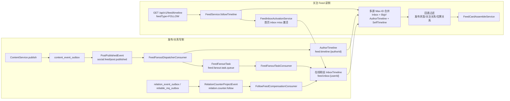
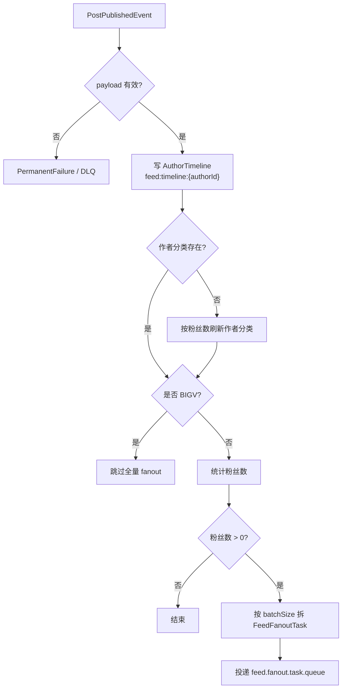
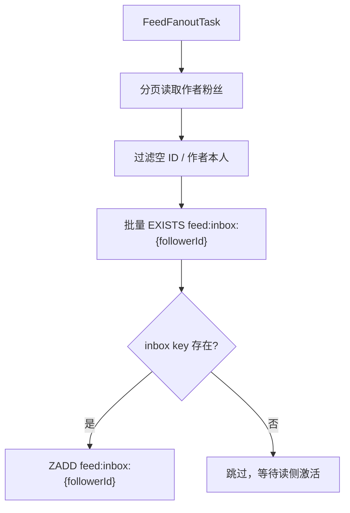
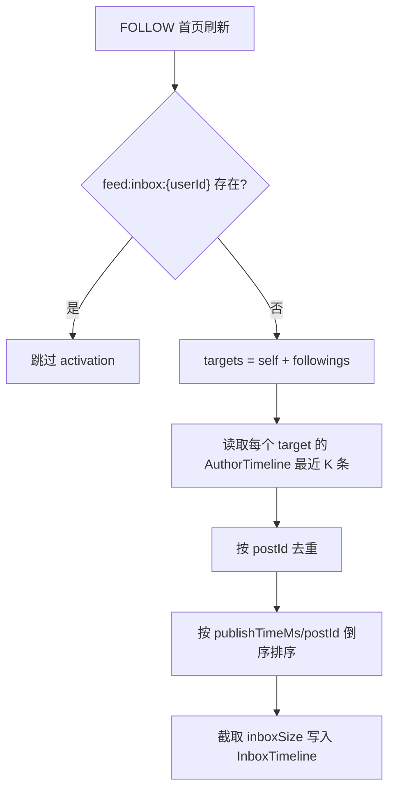
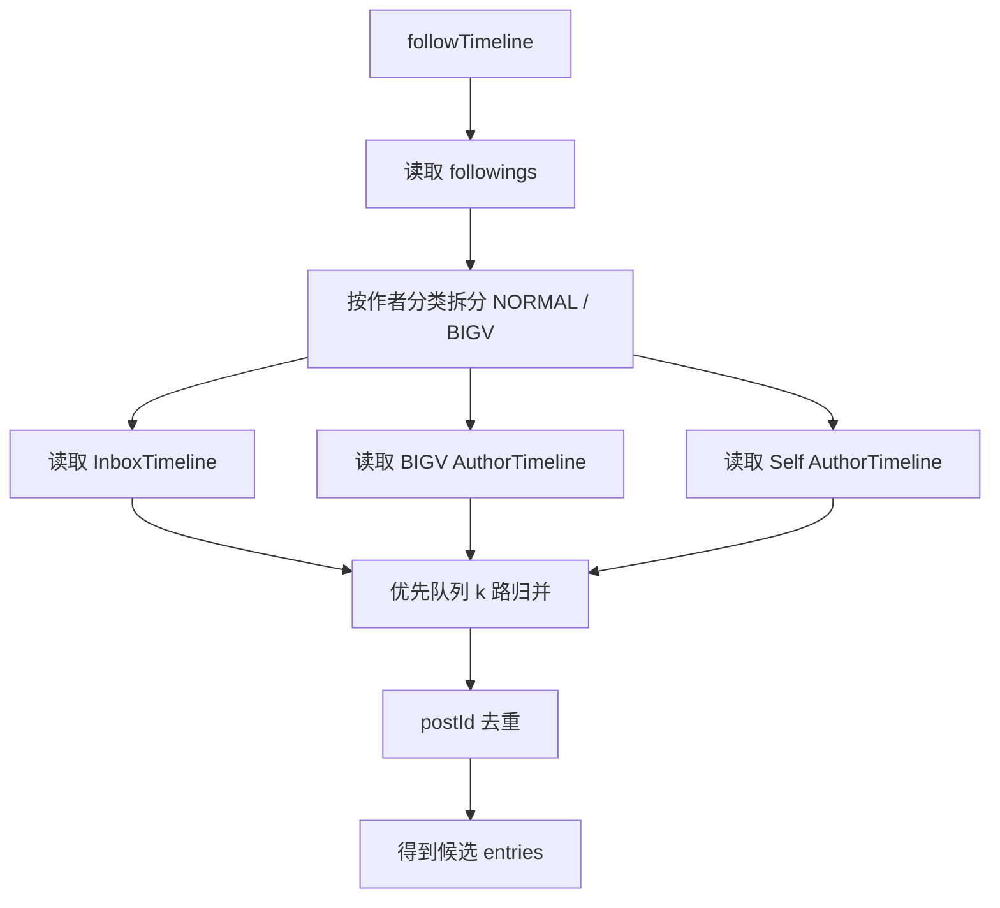
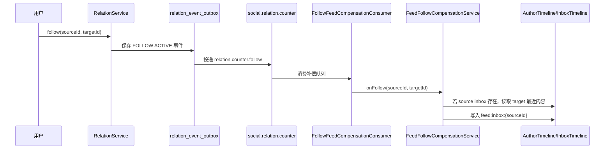
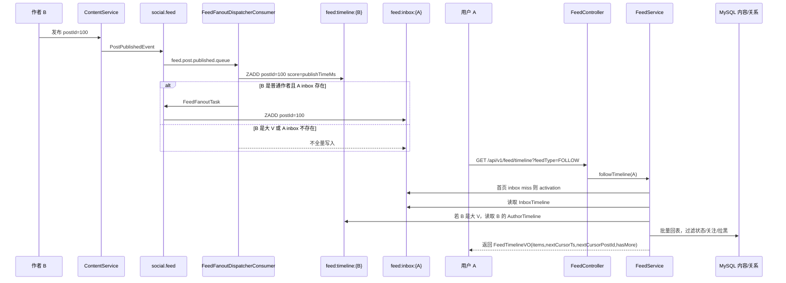

# Nexus 关注 Feed 流简化实现详解

本文说明 `feature/nexus-feed-simplify` 分支中关注 Feed 流的具体实现。这里的“关注 Feed”指 `GET /api/v1/feed/timeline?feedType=FOLLOW`，不包含 `RECOMMEND`、`POPULAR`、`NEIGHBORS` 的推荐链路。

## 1. 核心目标

旧模型更接近“发布时写扩散到大量粉丝 inbox，再用 rebuild/outbox 修复缓存”。当前分支将关注 Feed 简化为：

1. 发布内容时永远写作者维度的 AuthorTimeline。
2. 普通作者仍可向在线粉丝的 InboxTimeline 做轻量写扩散。
3. 大 V 作者默认不全量写粉丝 inbox，读侧从 AuthorTimeline 拉取。
4. 关注流读取时合并用户自己的 inbox、大 V 作者 timeline、用户自己的 timeline。
5. 用户 inbox 不存在时，用 activation 从关注作者 timeline 合并一批最近内容激活 inbox。
6. 关注新作者时，仅对已有 inbox 的在线用户回填被关注者最近内容。
7. 取消关注不强制删除 inbox 老索引，由读侧关注关系过滤保证立即不可见。

最终效果是减少发布链路写入放大和 rebuild 耦合，同时保留在线用户的低延迟体验。

## 2. 关键组件与数据结构

| 类型 | 代码位置 | 职责 |
| --- | --- | --- |
| HTTP 入口 | `nexus-trigger/.../FeedController` | 接收 `/api/v1/feed/timeline`，从登录态取 `userId`，调用 `IFeedService.timeline` |
| 读侧编排 | `nexus-domain/.../FeedService` | 根据 `feedType` 分流；FOLLOW 走 `followTimeline` |
| 发布分发调度 | `nexus-trigger/.../FeedFanoutDispatcherConsumer` | 消费 `PostPublishedEvent`，写 AuthorTimeline，并为普通作者拆 fanout task |
| fanout worker | `nexus-trigger/.../FeedFanoutTaskConsumer` | 消费 `FeedFanoutTask`，调用 `FeedDistributionService.fanoutSlice` |
| 在线 fanout | `nexus-domain/.../FeedDistributionService` | 只向 inbox key 存在的粉丝写入 InboxTimeline |
| inbox 激活 | `nexus-domain/.../FeedInboxActivationService` | 首页刷新且 inbox miss 时，从作者 timeline 合并最近索引写入 inbox |
| 关注补偿 | `nexus-domain/.../FeedFollowCompensationService` | 用户刚关注后，把新关注作者最近内容补进在线用户 inbox |
| 关注补偿消费 | `nexus-trigger/.../FollowFeedCompensationConsumer` | 消费关系计数投影 follow 事件，区分 ACTIVE/UNFOLLOW |
| 索引清理 | `nexus-trigger/.../FeedIndexCleanupConsumer` | 内容更新/删除后，内容不可见则从 AuthorTimeline 移除 |
| InboxTimeline | `nexus-infrastructure/.../FeedTimelineRepository` | Redis ZSET：`feed:inbox:{userId}`，member=postId，score=publishTimeMs |
| AuthorTimeline | `nexus-infrastructure/.../FeedAuthorTimelineRepository` | Redis ZSET：`feed:timeline:{authorId}`，member=postId，score=publishTimeMs |

## 3. 总体架构图



## 4. 发布写入链路

### 4.1 事件来源

内容发布主事务在 `ContentService.publish` 中完成。发布成功后，内容域通过 `ContentEventOutboxPort.savePostPublished` 写入 `content_event_outbox`，事件类型是 `post.published`，事件体是 `PostPublishedEvent`，核心字段包括：

- `eventId`：格式类似 `post.published:{postId}:{version}`，用于可靠消费幂等。
- `postId`：内容 ID。
- `authorId`：作者 ID。
- `publishTimeMs`：发布时间毫秒，用作 Redis ZSET score。

Outbox 发布任务把事件投递到 RabbitMQ：

- exchange：`social.feed`
- routing key：`post.published`
- queue：`feed.post.published.queue`
- DLQ：`feed.post.published.dlx.queue`

### 4.2 Dispatcher 处理

`FeedFanoutDispatcherConsumer.onMessage(PostPublishedEvent event)` 是发布事件进入 Feed 系统后的第一站。

处理步骤：

1. 校验 `eventId/postId/authorId/publishTimeMs`，缺失则抛 `ReliableMqPermanentFailureException`，进入可靠 MQ 的永久失败/DLQ 语义。
2. 永远调用 `feedAuthorTimelineRepository.addToTimeline(authorId, postId, publishTimeMs)` 写 AuthorTimeline。
3. 查询作者分类 `IFeedAuthorCategoryRepository.getCategory(authorId)`。
4. 如果分类缺失，调用 `FeedAuthorCategoryStateMachine.onFollowerCountChanged(authorId)` 根据粉丝数补分类。
5. 如果作者是 `BIGV`，直接结束，不再投递粉丝 fanout task。
6. 如果作者是普通作者，调用 `IRelationRepository.countFollowerIds(authorId)` 得到粉丝数。
7. 按 `feed.fanout.batchSize` 拆分切片，生成 `FeedFanoutTask` 并通过 `FeedFanoutTaskProducer.publish` 投递。



### 4.3 AuthorTimeline 写入

`FeedAuthorTimelineRepository` 用 Redis ZSET 存作者发布索引：

- key：`feed:timeline:{authorId}`
- member：`postId`
- score：`publishTimeMs`
- TTL：`feed.timeline.ttlDays`，默认 30 天
- 最大长度：`feed.timeline.maxSize`，默认 1000

写入时使用 `ZADD`，然后：

1. key 没有 TTL 时补 TTL。
2. 超过 `maxSize` 时用 `removeRange(key, 0, removeCount - 1)` 删除最老索引。

分页读取使用 Max-ID 语义：`publishTimeMs DESC + postId DESC`。由于 Redis ZSET 只能天然按 score 做范围查询，同毫秒的 postId 次序通过应用层二次排序和游标裁剪保证稳定。

### 4.4 普通作者在线 fanout

`FeedFanoutTaskConsumer` 消费 `feed.fanout.task.queue`，将任务传给 `FeedDistributionService.fanoutSlice(postId, authorId, publishTimeMs, offset, limit)`。

`fanoutSlice` 的行为：

1. 通过 `relationRepository.pageFollowerIdsForFanout(authorId, offset, limit)` 读取这一片粉丝。
2. 过滤空 ID 和作者本人。
3. 调用 `feedTimelineRepository.filterOnlineUsers(candidates)`，只保留 Redis 中已存在 `feed:inbox:{userId}` 的用户。
4. 对在线粉丝调用 `addToInbox(followerId, postId, publishTimeMs)`。
5. 离线用户不写 inbox，后续靠 activation 或读侧大 V timeline 合并补齐体验。

这里“在线”不是 WebSocket 在线态，而是“用户 inbox key 存在”。这个定义让系统不需要额外在线状态服务，同时避免给长时间不访问的用户持续写 Redis。



## 5. 关注 Feed 读取链路

### 5.1 HTTP 入口

前端调用：

```http
GET /api/v1/feed/timeline?feedType=FOLLOW&direction=REFRESH&limit=20
GET /api/v1/feed/timeline?feedType=FOLLOW&direction=HISTORY&limit=20&cursorTs=...&cursorPostId=...
```

`FeedController.timeline` 不信任前端传入的用户 ID，而是通过 `UserContext.requireUserId()` 获取当前登录用户，然后调用：

```java
feedService.timeline(userId, cursor, limit, feedType, direction, cursorTs, cursorPostId)
```

`FeedService.timeline` 根据 `feedType` 分流。`FOLLOW` 进入 `followTimeline`；`RECOMMEND/POPULAR/NEIGHBORS` 走独立推荐链路，不复用关注流 inbox/outbox 读取。

### 5.2 首页刷新与历史翻页

`followTimeline` 先规整分页参数：

- `limit` 默认 20，最大 100。
- `direction` 为空或 `REFRESH` 时视为首页刷新。
- `direction` 不是刷新时，必须提供 `cursorTs` 和 `cursorPostId`，否则直接返回空页。
- FOLLOW 新游标使用 `nextCursorTs + nextCursorPostId`，旧 `nextCursor` 保持为 `null`。

首页刷新时会先调用 `feedInboxActivationService.activateIfNeeded(userId)`。历史翻页不会触发 activation，避免翻页过程中写入新索引扰动游标。

### 5.3 inbox 激活链路

`FeedInboxActivationService.activateIfNeeded` 的目标是：当用户首页刷新且 `feed:inbox:{userId}` 不存在时，快速构造一个小 inbox。

步骤：

1. 如果 `userId` 为空，返回 `false`。
2. 如果 `feedTimelineRepository.inboxExists(userId)` 为 true，说明 inbox 已存在，返回 `false`。
3. 构造 activation targets：用户自己 + 最多 `feed.activation.maxFollowings` 个关注对象。
4. 对每个 target 调用 `feedAuthorTimelineRepository.pageTimeline(targetId, null, null, perFollowingLimit)`。
5. 按 postId 去重，同一 post 保留更新的 entry。
6. 按 `publishTimeMs DESC, postId DESC` 排序。
7. 截取 `feed.activation.inboxSize` 条写入 `feed:inbox:{userId}`。

相关配置：

| 配置 | 默认值 | 含义 |
| --- | --- | --- |
| `feed.activation.perFollowingLimit` | 20 | 每个关注对象拉取多少条最近内容 |
| `feed.activation.inboxSize` | 200 | 激活后最多写入 inbox 的索引数 |
| `feed.activation.maxFollowings` | 2000 | 激活时最多扫描多少个关注对象 |



### 5.4 多源合并

activation 后，`followTimeline` 会读取当前用户关注列表：

1. `relationAdjacencyCachePort.listFollowing(userId, feed.follow.maxFollowings)`。
2. 过滤空 ID 和自己。
3. 调用 `splitAuthorsByCategory` 将关注对象分成普通作者和大 V 作者。

分类来源：

- 优先批量读 `IFeedAuthorCategoryRepository.batchGetCategory(followings)`。
- 分类缺失时，用 `relationRepository.countFollowerIds(authorId)` 现场判断。
- 粉丝数大于等于 `feed.bigv.followerThreshold` 则设置为 `BIGV`，否则设置为 `NORMAL`。

当前合并源包括：

1. 当前用户 InboxTimeline：里面主要是在线 fanout、关注补偿、activation 产生的索引。
2. 所关注大 V 的 AuthorTimeline：大 V 发布时不全量 fanout，所以读侧直接拉。
3. 当前用户自己的 AuthorTimeline：保证自己的发布也出现在关注页。

普通作者的 AuthorTimeline 不直接参与读侧合并。普通作者内容主要通过在线 fanout、activation、关注补偿进入 inbox。

合并逻辑 `pageAndMergeFollowCandidates`：

1. 对每个源按同一个 Max-ID 游标读取 `limit + 1` 条。
2. 每个源包装成 `SourceCursor`。
3. 用优先队列按 `publishTimeMs DESC, postId DESC` 做 k 路归并。
4. 按 postId 去重。
5. 产出最多 `limit` 条候选，并根据源是否还有剩余判断 `hasMore`。



### 5.5 回表过滤与组装

候选只是 Redis 索引，不能直接返回。`filterTimelineCandidates` 会做一致性过滤：

1. 批量调用 `contentRepository.listPostsByIds(candidateIds)` 回表。
2. 如果内容不存在，调用 `feedTimelineRepository.removeFromInbox(userId, postId)` 做 inbox 懒清理。
3. FOLLOW 流只保留已发布内容，非发布状态也从 inbox 懒清理。
4. 如果启用关注作者校验，只允许作者是当前用户自己或当前关注列表内的人。
5. 检查双向拉黑关系：作者拉黑用户或用户拉黑作者，均过滤。
6. 过滤后调用 `FeedCardAssembleService.assemble(userId, "FOLLOW", entries, limit)` 组装作者、内容、计数、互动态等卡片字段。

如果一轮候选因为状态、取消关注、拉黑、缺失内容等原因被过滤得太多，`followTimeline` 最多继续扫描 `FOLLOW_SCAN_MAX_ROUNDS = 3` 轮。达到轮数上限且还有扫描位置时，会保守返回 `hasMore=true`。

### 5.6 游标与 hasMore

FOLLOW 采用 Max-ID 游标：

- 排序：`publishTimeMs DESC, postId DESC`
- 下一页参数：上一页最后一条已接受内容的 `nextCursorTs` 和 `nextCursorPostId`
- 历史页会排除上一页最后一条：只有 `(time < cursorTs) OR (time == cursorTs AND postId < cursorPostId)` 才通过

`hasMore` 由三类情况置 true：

1. k 路归并时某个源还有未消费候选。
2. 当前页填满后，过滤后的候选列表后面还有未接受候选。
3. 扫描轮数达到上限但最后扫描位置不为空。

## 6. 关注/取关补偿链路

关系写服务 `RelationService.follow/unfollow/block` 会把关系事件写入 `relation_event_outbox`，后续发布为 `RelationCounterProjectEvent`：

- exchange：`social.relation.counter`
- routing key：`relation.counter.follow`
- 原计数投影队列：`relation.counter.follow.queue`
- Feed 补偿队列：`relation.counter.follow.feed.compensate.queue`
- Feed 补偿 DLQ：`relation.counter.follow.feed.compensate.dlq.queue`

`FeedFollowCompensationMqConfig` 将 Feed 补偿队列绑定到同一个 follow routing key，因此关注事件会同时被计数投影和 Feed 补偿消费。

`FollowFeedCompensationConsumer` 处理逻辑：

1. 忽略空事件或缺失 `sourceId/targetId` 的事件。
2. 将 `status` 转为大写。
3. `ACTIVE` 调用 `FeedFollowCompensationService.onFollow(sourceId, targetId)`。
4. `UNFOLLOW` 调用 `FeedFollowCompensationService.onUnfollow(sourceId, targetId)`。

`onFollow` 的补偿语义：

1. 参数为空或自己关注自己则忽略。
2. 如果关注者 inbox 不存在，直接返回，说明用户不在在线 inbox 模型内。
3. 从被关注者 AuthorTimeline 读取最近 `feed.follow.compensate.recentPosts` 条。
4. 将这些索引写入关注者 InboxTimeline。

`onUnfollow` 不删除 inbox 索引。原因是 inbox 索引里只有 postId 和 score，没有 authorId，精确删除某个作者的历史内容成本较高。取关后的立即生效由读侧过滤完成：候选回表后作者不在当前关注集合内，就不会返回。



## 7. 内容更新/删除索引清理链路

内容更新和删除事件也通过 `social.feed` 交换机投递：

- `post.updated`
- `post.deleted`

`FeedFanoutConfig` 将两个 routing key 都绑定到统一队列 `feed.index.cleanup.queue`。`FeedIndexCleanupConsumer` 使用 `@RabbitHandler` 分别处理 `PostUpdatedEvent` 和 `PostDeletedEvent`。

处理步骤：

1. 校验 `eventId/postId`，缺失则永久失败。
2. 使用 `contentRepository.findPostBypassCache(postId)` 读内容真相。
3. 如果内容不存在，只记录日志并跳过。
4. 如果内容仍是 `PUBLISHED`，不清理。
5. 如果内容不可见，从 `feed:timeline:{authorId}` 移除 postId。

这里只清理 AuthorTimeline，不再做全局 inbox rebuild。旧 inbox 中残留的不可见索引由读侧回表过滤和懒清理处理。

## 8. 可靠性与幂等

1. MQ 发布使用可靠 MQ/Outbox 模式：内容事件先落库，后台投递；fanout task 通过 `@ReliableMqPublish` 进入可靠发布链路。
2. MQ 消费使用 `@ReliableMqConsume`，以 `eventId` 做幂等消费标识。
3. Redis 写入使用 ZSET `ZADD`，member 是 postId，重复写入同一 postId 是幂等覆盖。
4. Dispatcher 对无效事件使用永久失败，避免无限重试脏消息。
5. fanout task 的 `eventId` 包含原事件 ID、offset、pageSize，保证切片级别重试互不影响。
6. 读侧以 MySQL 内容表和关系表为最终真相，Redis 索引只作为候选源。

## 9. 主要配置

| 配置 | 默认值 | 说明 |
| --- | --- | --- |
| `feed.inbox.maxSize` | 1000 | 每个 InboxTimeline 最大保留条数 |
| `feed.inbox.ttlDays` | 30 | InboxTimeline TTL；开发配置中是 14 |
| `feed.timeline.maxSize` | 1000 | 每个 AuthorTimeline 最大保留条数 |
| `feed.timeline.ttlDays` | 30 | AuthorTimeline TTL |
| `feed.fanout.batchSize` | 200 | 普通作者粉丝 fanout 切片大小 |
| `feed.activation.perFollowingLimit` | 20 | inbox 激活时每个作者拉取的最近内容数 |
| `feed.activation.inboxSize` | 200 | inbox 激活后写入条数上限 |
| `feed.activation.maxFollowings` | 2000 | activation 最多扫描关注对象数 |
| `feed.follow.maxFollowings` | 2000 | FOLLOW 读侧最多扫描关注对象数 |
| `feed.follow.compensate.recentPosts` | 20 | 新关注补偿回填条数 |
| `feed.bigv.followerThreshold` | 500000 | 大 V 分类阈值，粉丝数达到阈值即 BIGV |

## 10. 测试覆盖

当前分支新增或调整了以下关键测试：

- `FeedServiceTest`
  - 首页刷新触发 inbox activation。
  - FOLLOW 合并 InboxTimeline、大 V AuthorTimeline、SelfTimeline。
  - 历史页使用 `cursorTs/cursorPostId` 并排除上一页最后一条。
  - 候选去重、过滤未发布内容、过滤取消关注作者、过滤拉黑关系。
  - 过滤导致页未满时，做有界继续扫描。
  - `hasMore` 在源还有候选或过滤后仍有后续候选时保持正确。
- `FeedInboxActivationServiceTest`
  - inbox 不存在时从 AuthorTimeline 合并写入。
  - inbox 已存在时不重复激活。
- `FeedFollowCompensationServiceTest`
  - 关注后仅对已有 inbox 用户补偿。
  - 取关不强制重建/清理 inbox。
- `FeedDistributionServiceTest`
  - fanout 只写在线粉丝 inbox，跳过离线用户。
- `FeedFanoutDispatcherConsumerTest`
  - 发布事件永远写 AuthorTimeline。
  - 大 V 跳过 fanout。
  - 普通作者按粉丝数拆分 fanout task。
- `FeedIndexCleanupConsumerTest`
  - 更新/删除统一进清理队列。
  - 不可见内容从 AuthorTimeline 移除。
- `FeedFollowCompensationMqConfigTest`
  - 关注补偿队列绑定到 `relation.counter.follow`。

## 11. 一次完整链路示例

以“用户 A 关注用户 B，用户 B 发布内容，用户 A 刷新关注页”为例：



这条链路中，Redis 只保存轻量索引，最终可见性始终由 MySQL 内容状态、关注关系和拉黑关系兜底。
