# 用户关系服务实现说明（关系域）

## 接口与链路概览
- follow：校验参数/屏蔽/上限 -> 写 `user_relation`(follow) + `user_follower` -> 邻接缓存 add -> 事件发布 MQ + 收件箱 -> 返回 ACTIVE/PENDING。
- friend/request：校验屏蔽/已好友 -> 幂等键查 `friend_request` -> 插入 PENDING -> 返回 request_id/status。
- friend/decision：校验 PENDING -> 条件更新 ACCEPT/REJECT；通过则写双向好友边+双向 follower+邻接缓存 -> 事件发布 MQ + 收件箱 -> 返回 success。
- block：校验 -> 写 block 边 -> 删除双向关注/好友/待审批 -> 删除 follower 与邻接缓存 -> 事件发布 MQ + 收件箱 -> 返回 BLOCKED。
- 分组 manageGroup：action=CREATE/UPDATE/DELETE/LIST/MOVE/MERGE；加锁(user+action)并查幂等；按动作落库 group/成员表；MOVE 跨组迁移，MERGE 按差异应用；解锁并缓存幂等结果。
- 邻接缓存：关注/粉丝集合存 Redis Set，热门用户按分桶写；读到缺口时触发回源重建，支持 rebuild/evict。
- MQ 收件箱：RelationEventPort 发布时写 `relation_event_inbox`；Listener 消费幂等写收件箱，成功 markDone，异常入死信；定时任务重放 FAIL 并清理 DONE 过期。

## 流程图

```mermaid
flowchart TD
  subgraph Follow
    FReq[follow] --> FChk{参数合法?}
    FChk -- 否 --> FErr[INVALID]
    FChk -- 是 --> FBlock{屏蔽?}
    FBlock -- 是 --> FBlk[BLOCKED]
    FBlock -- 否 --> FLimit{达上限?}
    FLimit -- 是 --> FLim[LIMIT_REACHED]
    FLimit -- 否 --> FPriv{需审批?}
    FPriv -- 是 --> FPend[写 follow PENDING]
    FPriv -- 否 --> FAct[写 follow ACTIVE]
    FPend --> FFol[写 user_follower]
    FAct --> FFol
    FFol --> FCache[邻接缓存 add]
    FCache --> FEvt[事件 MQ+收件箱]
    FEvt --> FResp[返回状态]
  end

  subgraph Friend
    RReq[friend/request] --> RChk{参数/屏蔽/已好友?}
    RChk -- 无效 --> RErr[INVALID/BLOCKED/ACCEPTED]
    RChk -- OK --> RIdem{已有PENDING?}
    RIdem -- 是 --> RKeep[返回原PENDING]
    RIdem -- 否 --> RSave[插入PENDING]
    RSave --> RResp[返回request_id]

    DReq[friend/decision] --> DChk{存在且PENDING?}
    DChk -- 否 --> DErr[success=false]
    DChk -- 是 --> DAct{ACCEPT?}
    DAct -- REJECT --> DRej[状态=REJECTED]
    DAct -- ACCEPT --> DWrite[写双向好友边+follower+缓存]
    DWrite --> DEvt[事件 MQ+收件箱]
    DRej --> DResp[success=true]
    DEvt --> DResp
  end

  subgraph Block
    BReq[block] --> BChk{参数合法?}
    BChk -- 否 --> BErr[INVALID]
    BChk -- 是 --> BSave[写 block 边]
    BSave --> BDel[删关注/好友/待审批]
    BDel --> BFolDel[删 follower + 缓存]
    BFolDel --> BEvt[事件 MQ+收件箱]
    BEvt --> BResp[BLOCKED]
  end

  subgraph Group
    GReq[manageGroup] --> GAct{CREATE/UPDATE/DELETE/LIST/MOVE/MERGE}
    GAct --> GLck[获取锁/幂等检查]
    GLck --> GDo{具体动作}
    GDo --> GDB[落库 group/member]
    GDB --> GIdem[缓存幂等结果]
    GIdem --> GResp[返回分组结果]
  end

  subgraph EventInbox
    PubEvt[RelationEventPort] --> PubMQ[MQ 投递]
    PubEvt --> PubInbox[写 relation_event_inbox NEW]
    MQMsg[MQ消息] --> Lsr[RelationEventListener]
    Lsr --> Idem{收件箱保存成功?}
    Idem -- 否 --> Skip[跳过重复]
    Idem -- 是 --> Downstream[调用 Feed/通知/风控]
    Downstream --> MarkDone[收件箱 DONE]
    Lsr --> Err?{异常}
    Err? -- 是 --> DLX[死信]
    RetryJob[Retry Job] --> Fetch[拉取 FAIL]
    Fetch --> Replay[重放事件->MQ+Inbox]
    CleanJob[Clean Job] --> Clean[清理 DONE 过期]
  end
```

## 接口端到端链路（逐条）
- follow `/api/v1/relation/follow`
  1) Trigger 层 RelationController 校验参数 -> 调用 RelationService.follow。
  2) Domain 校验屏蔽/上限/好友 -> relationRepository.saveRelation + saveFollower -> adjacencyCachePort.addFollow。
  3) EventPort.onFollow 发布 Spring 事件 + MQ，写收件箱 relation_event_inbox。
  4) Listener 消费 MQ 幂等检查 -> 调用 Feed/通知/风控 -> 收件箱标记 DONE/异常入死信。
  5) Controller 返回 FollowResponseDTO（status）。

- friend request `/api/v1/relation/friend/request`
  1) Controller -> RelationService.friendRequest。
  2) Domain 校验屏蔽/已好友/幂等查 friend_request -> insert PENDING。
  3) 返回 request_id/status（未触发事件）。

- friend decision `/api/v1/relation/friend/decision`
  1) Controller -> RelationService.friendDecision。
  2) Domain 查 PENDING + CAS 更新 ACCEPT/REJECT。
  3) ACCEPT：写双向好友边 + 双向 follower + 邻接缓存；EventPort.onFriendEstablished -> MQ + 收件箱。
  4) MQ Listener 幂等检查 -> 下游调用/标记 DONE。
  5) 返回 success。

- block `/api/v1/relation/block`
  1) Controller -> RelationService.block。
  2) Domain 写 block 边 -> 删除关注/好友/待审批 -> 删除 follower/邻接缓存。
  3) EventPort.onBlock -> MQ + 收件箱。
  4) MQ Listener 幂等检查 -> 下游调用/标记 DONE。
  5) 返回 BLOCKED。

- manageGroup `/api/v1/relation/list`
  1) Controller -> RelationService.manageGroup（action=CREATE/UPDATE/DELETE/LIST/MOVE/MERGE）。
  2) Domain：锁(user+action)+幂等检查 -> 根据 action 落库 group/member，MOVE 跨组迁移，MERGE 应用 add/remove 差异，校验容量。
  3) 解锁并缓存幂等结果，返回 RelationGroupVO。

## 备注
- 邻接缓存：读时缺口自动回源重建；热门用户按桶分布；提供 rebuild/evict 接口。
- MQ 收件箱：relation_event_inbox 持久化指纹+payload；Listener 成功 markDone，异常入死信；RetryJob 重放 FAIL，CleanJob 清理 DONE 过期。
