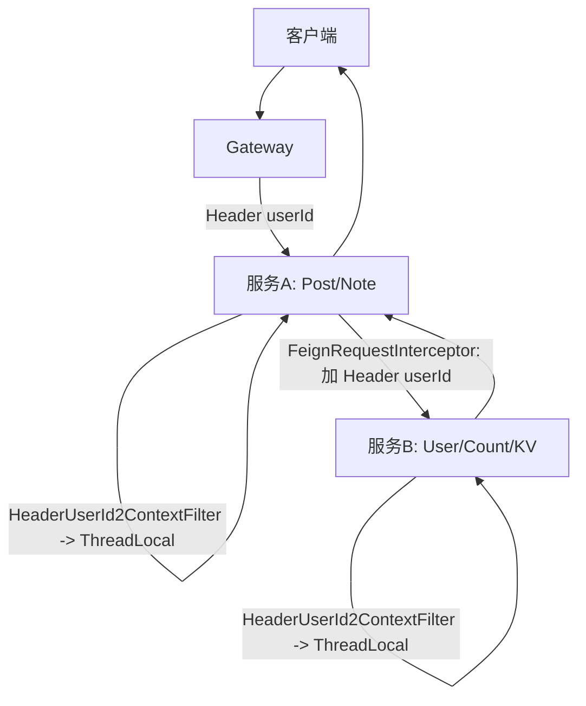
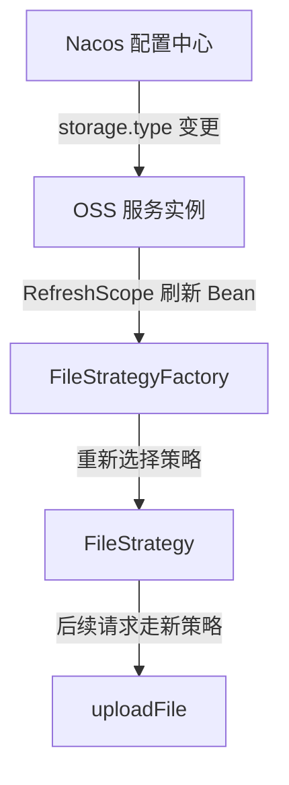
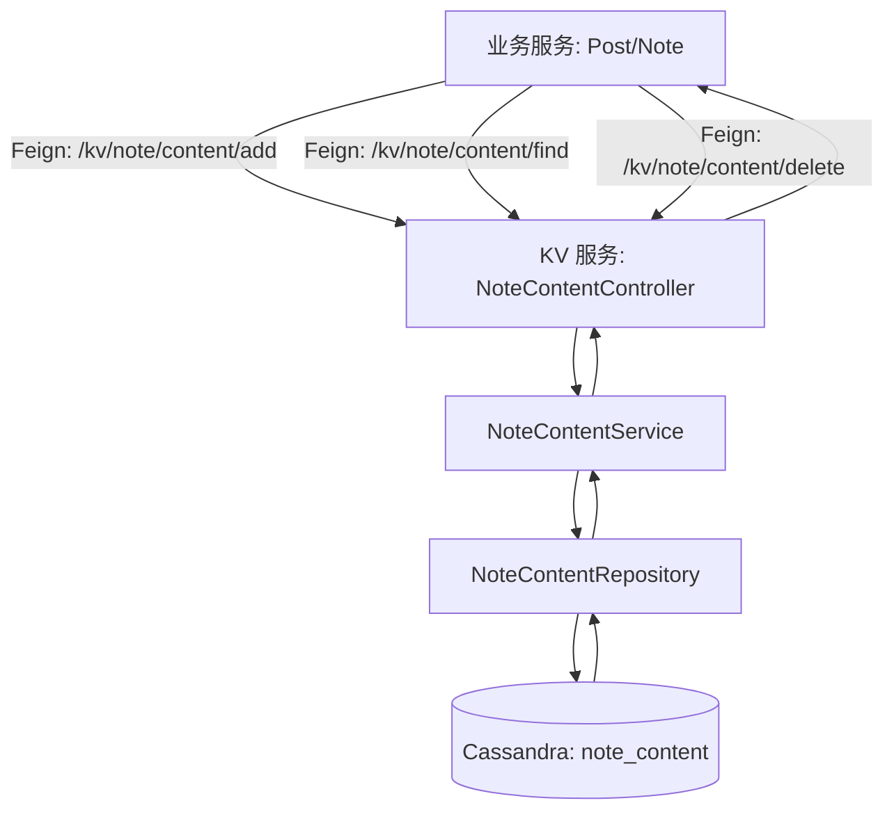
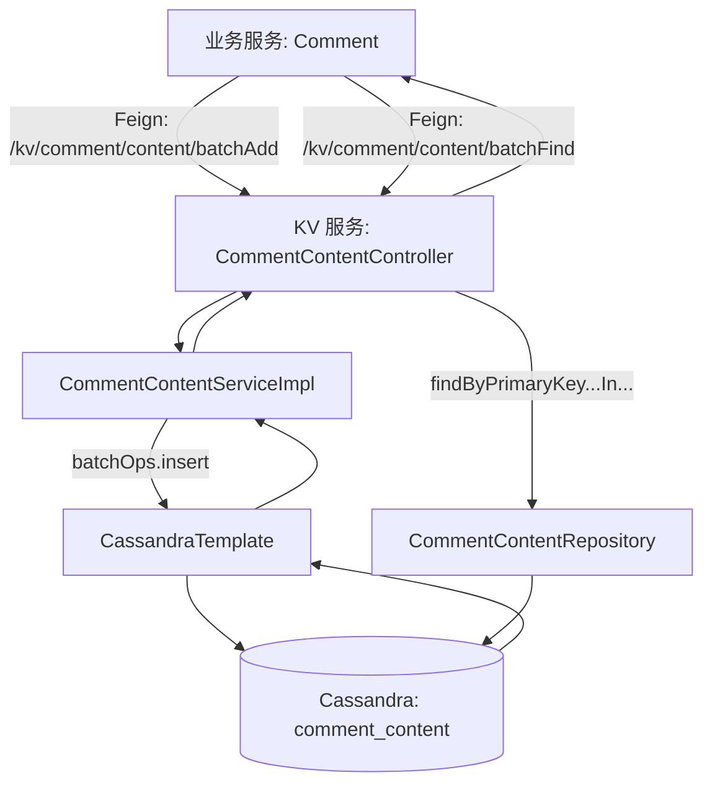
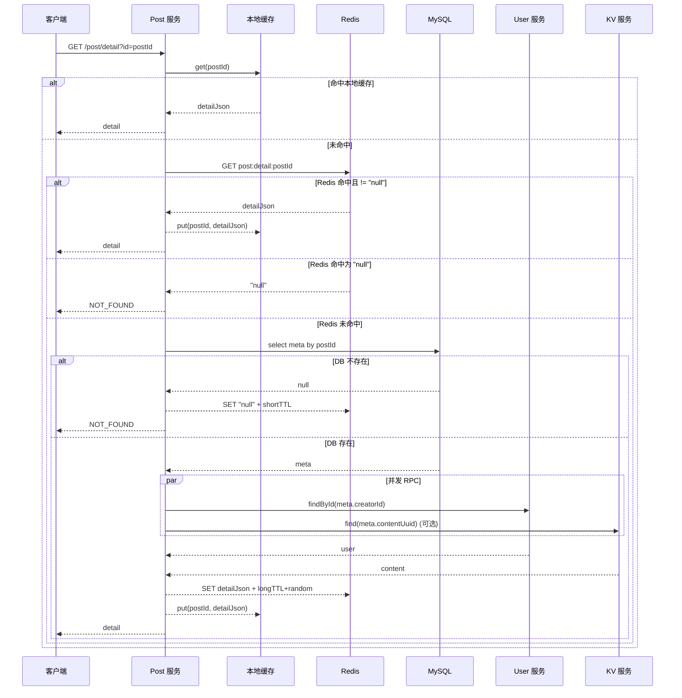
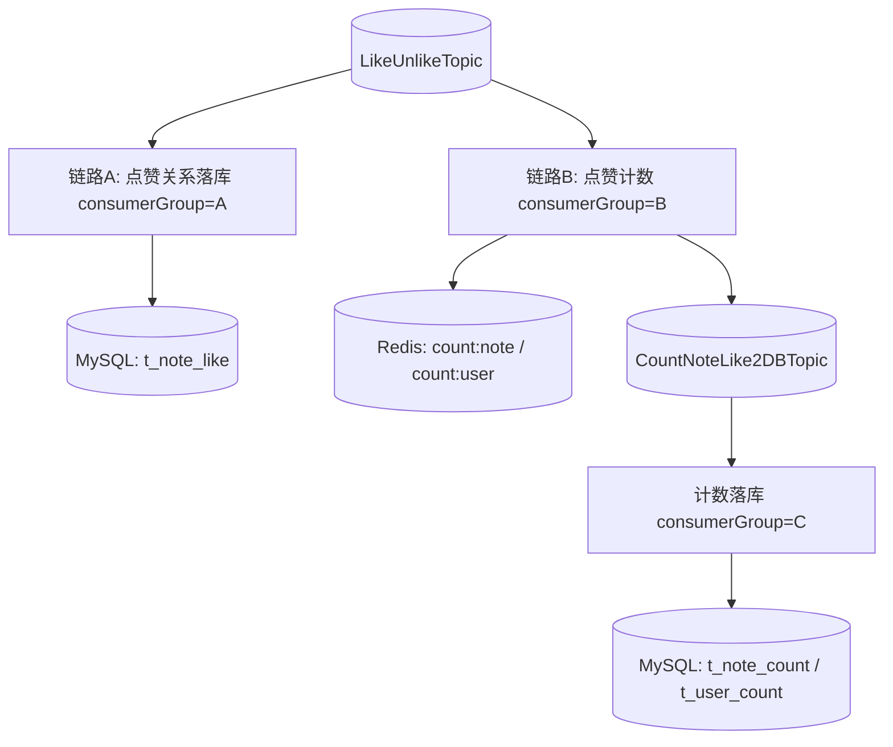

# 小红书项目复现手册（从简历“项目细节”到代码落点）

目标：你可以拿着这份文档，在**另一个“Post/帖子类”后端项目**里，让 Codex agent 按步骤把这些能力复现出来（不要求一字不差，但“思路/数据/流程/边界”要一致）。

对应来源：`resume_xiaohongshu_project_desc.md` 里的 **“项目细节（并集，仅保留一份）”**。

说明（很重要）：
- 我下面每一条都尽量做到：**简历一句话 → 本仓库对应代码在哪里 → 这套方案怎么实现 → 在新项目里怎么复现**。
- 这份仓库是微服务形态（Gateway / Note / KV / OSS / Count / ID Generator）。如果你的新项目是单体，也没关系：把“模块”当成“包/子工程”来做就行。
- 我会写清楚用到的 **Redis Key、MQ Topic、配置项、表结构**。这些是复现成功的关键。

---

## 0. 建议复现顺序（别一上来就写业务）

1) 先做“谁在请求我”：网关鉴权 + userId 透传 + 服务端上下文（否则后面所有权限/计数都没法对齐）  
2) 再做“全局唯一 ID”：分布式 ID 生成（Leaf）  
3) 再做“正文存储”：Cassandra KV（笔记正文/评论正文）  
4) 再做“笔记主流程”：发布/详情/更新/删除 + 二级缓存 + 缓存一致性  
5) 再做“高并发互动”：点赞/取消点赞（Bloom + ZSet + MQ + 限流）  
6) 最后做“计数服务”：BufferTrigger 聚合 + Redis 计数 + 异步落库  
7) OSS 上传属于“媒体能力”，可以最后补

每一步都要能跑通一个小验收（文档每节末尾都有“怎么验证”）。

## 0.1 名词对照（把 Note 当成 Post，避免你抄错）

如果你的新项目叫 “Post/帖子”，建议用下面这个对照表来“翻译”本仓库的概念：

- Note（本仓库）= Post（你新项目）
- noteId = postId
- creatorId = authorId（或仍叫 userId，二选一，但要统一）
- visible = visibility（可见性）
- contentUuid = contentId（UUID，用来去 KV 找正文）
- `t_note` = `t_post`（元数据表）
- `t_note_like` = `t_post_like`（点赞关系表）
- `t_note_count` = `t_post_count`（帖子计数表）
- Redis：`note:detail:<id>` 你可以改成 `post:detail:<id>`（但要全项目一致）

约定：下面文档每一节都会同时写清楚：
- “本仓库实际叫什么”
- “你在新项目里建议叫什么”

---

## 1) 网关鉴权：SaToken + 全局过滤器解析 Token，并把 userId 透传给下游

### 1.1 本项目代码落点（抄路径就能找到）

- 网关鉴权规则（放行/拦截）：`xiaohashu-gateway/src/main/java/com/quanxiaoha/xiaohashu/gateway/auth/SaTokenConfigure.java`
- 网关透传 userId 到下游 Header：`xiaohashu-gateway/src/main/java/com/quanxiaoha/xiaohashu/gateway/filter/AddUserId2HeaderFilter.java`
- Token 约定（Header 名称/前缀）：`xiaohashu-gateway/src/main/resources/application.yml`
- 角色/权限从 Redis 读取（可选）：`xiaohashu-gateway/src/main/java/com/quanxiaoha/xiaohashu/gateway/auth/StpInterfaceImpl.java`
- 网关全局异常输出（401 等）：`xiaohashu-gateway/src/main/java/com/quanxiaoha/xiaohashu/gateway/exception/GlobalExceptionHandler.java`

下游服务（接到 Header 后怎么变成“我是谁”）：
- 把 Header 里的 `userId` 放进 ThreadLocal：`xiaoha-framework/xiaoha-spring-boot-starter-biz-context/src/main/java/com/quanxiaoha/framework/biz/context/filter/HeaderUserId2ContextFilter.java`
- Feign 调用自动把 `userId` 往下游透传：`xiaoha-framework/xiaoha-spring-boot-starter-biz-context/src/main/java/com/quanxiaoha/framework/biz/context/interceptor/FeignRequestInterceptor.java`
- ThreadLocal 容器（用了 TransmittableThreadLocal，线程池也能传）：`xiaoha-framework/xiaoha-spring-boot-starter-biz-context/src/main/java/com/quanxiaoha/framework/biz/context/holder/LoginUserContextHolder.java`

### 1.2 这套方案的“最小思路”

把一次请求想成一张“通行证”：
1) 客户端先去登录，拿到 Token  
2) 客户端每次请求都带上 Token（Header：`Authorization: Bearer <token>`）  
3) Gateway 用 SaToken 校验 Token 是否有效  
4) 校验通过后，Gateway 能拿到当前登录用户的 `loginId`（也就是 userId）  
5) Gateway 把 `userId` 写进 Header（本项目用的是 Header 名：`userId`）  
6) 下游服务收到后，把 Header 里的 `userId` 放进 ThreadLocal（后面业务随时取）

### 1.2.1 链路总览（流程图）

```mermaid
flowchart TD
  C[客户端] -->|1. 登录| A[Auth 服务: /auth/login]
  A -->|2. 返回 token| C
  C -->|3. 带 token 请求: Authorization: Bearer token| G[Gateway]
  G -->|4. SaToken 校验 token| G
  G -->|5. 取出登录态 userId| G
  G -->|6. 转发请求 + Header: userId| S[下游业务服务(如 Post/Note)]
  S -->|7. Filter 读取 Header userId -> ThreadLocal| S
  S -->|8. Controller/Service 取 userId 做权限/计数| S
  S -->|9. 返回响应| C
```

### 1.2.2 额外链路：服务 A 调用服务 B（Feign 也要透传 userId）

这个链路很容易漏：用户进来先到“帖子服务”，然后帖子服务再调用“用户服务/计数服务”。  
如果不透传 `userId`，下游会拿不到当前用户，权限/幂等/计数都会乱。



### 1.3 复现步骤（在新项目里怎么做）

#### 1.3.0 前置准备（你先把这些准备好）

- 你至少要有：一个网关（Gateway）+ 一个登录服务（Auth）+ 一个业务服务（Post/Note）
- 你需要一个 Redis（SaToken 通常会把 token/会话放进 Redis，便于多实例共享）
- 如果你希望“配置热更新”（比如放行路径/限流阈值动态改），再加 Nacos（可选）

#### Step A：统一“Token 约定”

本项目用的约定（建议照抄）：
- Token Header 名：`Authorization`
- 前缀：`Bearer`

参考配置位置：
- `xiaohashu-gateway/src/main/resources/application.yml` 的 `sa-token.token-name / token-prefix`
- `xiaohashu-auth/src/main/resources/config/application.yml` 同样配置

在新项目里建议你把“约定”写成常量（别散落在各处）：

```pseudocode
TOKEN_HEADER_NAME = "Authorization"
TOKEN_PREFIX = "Bearer"
USER_ID_HEADER_NAME = "userId"
```

#### Step B：登录服务发 Token

本项目做法：
- `xiaohashu-auth/src/main/java/com/quanxiaoha/xiaohashu/auth/service/impl/AuthServiceImpl.java`
  - `StpUtil.login(userId)`
  - `StpUtil.getTokenInfo().tokenValue` 返回给客户端

你在新项目里复现时，保证：
- 登录成功后**必须**调用 `login(userId)`
- 返回给前端的 token，前端要放进 `Authorization: Bearer <token>`

伪代码（新项目里可以照着写一个 login 接口）：

```pseudocode
function login(req):
  user = userRepo.findByPhone(req.phone)
  assert user exists
  assert passwordOrCodeOk(req, user)

  StpUtil.login(user.id)
  token = StpUtil.getTokenInfo().tokenValue
  return { token: token }
```

#### Step C：Gateway 做“统一鉴权”

本项目做法：
- `SaReactorFilter` 拦截所有路径 `/**`
- 放行：
  - `/auth/login`
  - `/auth/verification/code/send`
- 其它都 `StpUtil.checkLogin()`

你在新项目里复现时，最关键是：
- **只在 Gateway 做一次鉴权**（下游不要再各自发明一套）
- 放行列表必须写清楚（不然登录接口也会被拦）

建议你在 Gateway 写一段“放行白名单”清单（越清晰越不容易出错）：

```pseudocode
PUBLIC_PATHS = [
  "/auth/login",
  "/auth/verification/code/send"
]

function gatewayAuthFilter(request):
  if request.path in PUBLIC_PATHS:
    pass
  else:
    StpUtil.checkLogin()   // token 不合法就直接 401
```

#### Step D：Gateway 透传 userId

本项目做法：
- `AddUserId2HeaderFilter` 里调用 `StpUtil.getLoginIdAsLong()` 拿到 userId
- 把它写进 Header：`userId`

注意：该文件当前实现里创建了 `newExchange`，但最后 `return chain.filter(exchange)`（没有把 newExchange 传下去）。  
复现时请按“正确写法”做：

```pseudocode
userId = StpUtil.getLoginIdAsLong()
newExchange = exchange.mutate().request(addHeader("userId", userId)).build()
return chain.filter(newExchange)
```

再补一条“强约束”（复现时请照做）：
- 只有 **鉴权通过** 的请求，才允许注入 `userId`（避免伪造）
- Header 名必须统一（本项目统一是 `userId`，见 `xiaoha-framework/.../GlobalConstants.USER_ID`）

#### Step E：下游服务把 Header userId 固定成“上下文”

本项目做法：
- `HeaderUserId2ContextFilter` 读取 Header `userId`
- 写入 `LoginUserContextHolder`（ThreadLocal）
- finally 必须 remove，防止线程复用串号

你在新项目里复现时，核心原则只有一句：
- **客户端禁止自己传 userId**；userId 只能来自网关注入（否则谁都能冒充）

伪代码（Filter + ThreadLocal 容器）：

```pseudocode
ThreadLocal<Map> CTX

function headerUserId2ContextFilter(request, next):
  userId = request.header["userId"]
  if userId is blank:
    return next()

  CTX["userId"] = toLong(userId)
  try:
    return next()
  finally:
    CTX.clear()   // 必须清理，防止串号
```

如果你有“线程池 + 异步任务”，建议用 TransmittableThreadLocal（TTL），否则异步线程拿不到 userId：
- 本项目实现：`xiaoha-framework/.../LoginUserContextHolder.java`

### 1.4 怎么验证（跑通才算完）

1) 调登录接口拿 token  
2) 带 `Authorization: Bearer <token>` 调任意业务接口（例如笔记发布）  
3) 在业务服务里打印 `LoginUserContextHolder.getUserId()`：必须有值且正确  

---

## 2) 分布式 ID 生成：整合美团 Leaf（号段 + 雪花）

### 2.1 本项目代码落点

- HTTP 接口：
  - `xiaohashu-distributed-id-generator/xiaohashu-distributed-id-generator-biz/src/main/java/com/quanxiaoha/xiaohashu/distributed/id/generator/biz/controller/LeafController.java`
  - `/id/segment/get/{key}`
  - `/id/snowflake/get/{key}`
- 号段模式（Segment）初始化与 getId：
  - `.../service/SegmentService.java`
  - 配置读取：`.../core/common/PropertyFactory.java`（读 `leaf.properties`）
- 雪花模式（Snowflake）初始化与 getId：
  - `.../service/SnowflakeService.java`
- 配置文件（非常关键）：
  - `xiaohashu-distributed-id-generator/xiaohashu-distributed-id-generator-biz/src/main/resources/leaf.properties`
- Leaf 号段表结构与 biz_tag 初始化：
  - `sql/xiaohashu_init.sql`（`leaf`库 + `leaf_alloc`表）

各业务如何使用 ID（你会在其它服务里看到 Feign 调用）：
- 用户服务拿 segment：
  - `xiaohashu-user/xiaohashu-user-biz/src/main/java/com/quanxiaoha/xiaohashu/user/biz/rpc/DistributedIdGeneratorRpcService.java`
- 评论服务拿 segment：
  - `xiaohashu-comment/xiaohashu-comment-biz/src/main/java/com/quanxiaoha/xiaohashu/comment/biz/rpc/DistributedIdGeneratorRpcService.java`
- 笔记服务拿 snowflake：
  - `xiaohashu-note/xiaohashu-note-biz/src/main/java/com/quanxiaoha/xiaohashu/note/biz/rpc/DistributedIdGeneratorRpcService.java`

### 2.2 方案解释（用人话讲清楚）

你要解决的问题是：**多台机器同时发帖/注册/评论时，ID 不能撞车**。

Leaf 给你两种选择：
- 号段（Segment）：从 MySQL 里一次领一段数字（比如 10000~12000），本机用完再领下一段。优点：性能好、实现直观。缺点：依赖 MySQL。
- 雪花（Snowflake）：每台机器根据时间戳 + 机器号生成。优点：不依赖 MySQL；缺点：需要做“机器号分配”（本项目用 Zookeeper）。

### 2.2.1 链路总览（号段 Segment）

```mermaid
flowchart TD
  Biz[业务服务: Post/User/Comment] -->|Feign: GET /id/segment/get/{bizTag}| C[ID 服务: LeafController]
  C --> S[SegmentService.getId(bizTag)]
  S --> G[SegmentIDGenImpl.get(bizTag)]
  G --> D[IDAllocDaoImpl: updateMaxId...]
  D --> DB[(MySQL: leaf.leaf_alloc)]
  DB --> D --> G --> S --> C --> Biz
  C -->|返回 id(Long)| Biz
```

你要记住一个关键点：  
**Segment 不是“凭空生成”**，它每次都要去 MySQL 的 `leaf_alloc` 里“领号段”。

### 2.2.2 链路总览（雪花 Snowflake）

```mermaid
flowchart TD
  Biz[业务服务: Post/Note] -->|Feign: GET /id/snowflake/get/{key}| C[ID 服务: LeafController]
  C --> S[SnowflakeService.getId(key)]
  S --> G[SnowflakeIDGenImpl.get(key)]
  G --> ZK[(Zookeeper: 分配 workerId)]
  ZK --> G --> S --> C --> Biz
  C -->|返回 id(Long)| Biz
```

### 2.3 复现步骤（超详细，可直接复刻）

#### Step A：新建一个“ID 生成服务”

保持它是独立服务（微服务更合适），原因：
- 其它服务都要用它
- 它的配置（DB、ZK）和业务服务不同

建议你在新项目里把它当成一个独立模块/工程，例如：
- `id-generator-service`（Spring Boot）
- 对外提供两个接口：`/id/segment/get/{bizTag}`、`/id/snowflake/get/{key}`

#### Step B：号段模式（Segment）

1) 建 MySQL 库 `leaf`，建表 `leaf_alloc`（直接照抄本仓库）：`sql/xiaohashu_init.sql`  
2) 插入你的业务 biz_tag（你未来会在业务服务里用它）  
   - 参考本仓库已用过的 biz_tag：
     - `leaf-segment-xiaohashu-id`（小红书号）
     - `leaf-segment-user-id`（用户ID）
     - `leaf-segment-comment-id`（评论ID）
3) 在 `id-generator-service` 的 `resources/leaf.properties` 写配置（本仓库就是这么读的）：
   - `leaf.segment.enable=true`
   - `leaf.jdbc.url=jdbc:mysql://.../leaf?...`
   - `leaf.jdbc.username=...`
   - `leaf.jdbc.password=...`
4) 启动时初始化 Segment（照抄本仓库结构即可）：
   - 配置连接池（本仓库用 `DruidDataSource`）
   - DAO：`IDAllocDaoImpl(dataSource)`
   - ID 生成器：`SegmentIDGenImpl` + `setDao(...)` + `init()`
5) 写接口（Controller）：
   - `GET /id/segment/get/{bizTag}`
   - 校验 bizTag 非空
   - 调 `segmentService.getId(bizTag)`
   - 返回 `result.id`

伪代码（Segment 初始化 + 取号）：

```pseudocode
// 只在服务启动时做一次
function initSegment():
  props = loadProperties("leaf.properties")
  if props["leaf.segment.enable"] != "true":
    idGen = ZeroIDGen()
    return

  ds = new DataSource(
    url=props["leaf.jdbc.url"],
    username=props["leaf.jdbc.username"],
    password=props["leaf.jdbc.password"]
  )

  dao = new IDAllocDaoImpl(ds)
  idGen = new SegmentIDGenImpl()
  idGen.setDao(dao)
  assert idGen.init() == true

function getSegmentId(bizTag):
  assert bizTag not blank
  result = idGen.get(bizTag)
  if result.status == EXCEPTION:
    throw LeafServerException(result.toString())
  return result.id
```

#### Step C：雪花模式（Snowflake）

1) 准备 Zookeeper（单机/集群都行，保证网络能通）  
2) 在 `leaf.properties` 配置：
   - `leaf.snowflake.enable=true`
   - `leaf.snowflake.zk.address=<你的zk地址>`
   - `leaf.snowflake.port=<本服务对外端口>`（Leaf 用它做注册/分配）
3) 启动时初始化 Snowflake（本仓库做法：`new SnowflakeIDGenImpl(zkAddress, port)` + `init()`）  
4) 写接口（Controller）：
   - `GET /id/snowflake/get/{key}`
   - key 在本仓库里不强语义（随便传一个字符串即可）

伪代码（Snowflake 初始化 + 取号）：

```pseudocode
function initSnowflake():
  props = loadProperties("leaf.properties")
  if props["leaf.snowflake.enable"] != "true":
    idGen = ZeroIDGen()
    return

  zk = props["leaf.snowflake.zk.address"]
  port = toInt(props["leaf.snowflake.port"])
  idGen = new SnowflakeIDGenImpl(zk, port)
  assert idGen.init() == true

function getSnowflakeId(key):
  assert key not blank
  result = idGen.get(key)
  if result.status == EXCEPTION:
    throw LeafServerException(result.toString())
  return result.id
```

#### Step D：业务服务怎么用（Feign 调用）

本仓库做法是：每个业务服务都写一个 Feign 接口 + 一个 RPC 包装类。

1) Feign 接口（参考）：`xiaohashu-distributed-id-generator-*/DistributedIdGeneratorFeignApi.java`  
2) 业务侧包装类（参考）：
   - 用户：`xiaohashu-user/.../DistributedIdGeneratorRpcService.java`
   - 笔记：`xiaohashu-note/.../DistributedIdGeneratorRpcService.java`

伪代码（业务服务侧）：

```pseudocode
function createPost(req):
  postId = idGeneratorFeign.getSnowflakeId("post")
  // 或：postId = idGeneratorFeign.getSegmentId("leaf-segment-post-id")
  ...
```

### 2.4 怎么验证

- 连续请求 1 万次，ID 不重复、都能转 Long  
- 多开两个实例同时请求，也不重复  

---

## 3) 对象存储：工厂 + 策略模式（阿里云 OSS / Minio），并支持 Nacos 动态切换

### 3.1 本项目代码落点

- 策略接口：`xiaohashu-oss/xiaohashu-oss-biz/src/main/java/com/quanxiaoha/xiaohashu/oss/biz/strategy/FileStrategy.java`
- 两个策略实现：
  - 阿里云：`.../strategy/impl/AliyunOSSFileStrategy.java`
  - Minio：`.../strategy/impl/MinioFileStrategy.java`
- 工厂（按配置选择策略 + 支持刷新）：`.../factory/FileStrategyFactory.java`
  - 关键配置：`storage.type`（`minio` / `aliyun`）
  - 关键注解：`@RefreshScope`
- 客户端配置：
  - 阿里云 OSS client：`.../config/AliyunOSSConfig.java` + `AliyunOSSProperties.java`（`storage.aliyun-oss.*`）
  - Minio client：`.../config/MinioConfig.java` + `MinioProperties.java`（`storage.minio.*`）
- 上传接口：
  - `.../controller/FileController.java`（`POST /file/upload`）
  - `.../service/impl/FileServiceImpl.java`（调用 `fileStrategy.uploadFile(...)`）

### 3.2 方案解释

你要解决的问题是：未来可能换存储（从 Minio 换 OSS，或反过来），但业务代码不想改一堆 if/else。

所以：
- 业务只依赖 `FileStrategy` 接口
- 具体用哪家存储，由 `storage.type` 决定
- 配置变了，`@RefreshScope` 让策略 bean 自动刷新（配合 Nacos 配置热更新）

### 3.2.1 链路总览（上传文件）

```mermaid
flowchart TD
  U[客户端/前端] -->|multipart/form-data: file| C[OSS 服务: FileController]
  C --> S[FileService.uploadFile]
  S --> F[FileStrategy (由工厂选择)]
  F -->|minio| M[MinioClient.putObject]
  F -->|aliyun| O[OSSClient.putObject]
  M --> R[返回 URL]
  O --> R
  R --> U
```

### 3.2.2 链路总览（动态切换：Minio <-> Aliyun OSS）



### 3.3 复现步骤（超详细，可直接复刻）

#### 3.3.0 前置准备（先选你要支持哪些存储）

- 你至少要支持 1 种（Minio 或 OSS），否则接口没意义
- 如果要做到“随时切换不改代码”，就支持 2 种（Minio + OSS）

#### 3.3.1 建议你在新项目里新增的配置项

（本仓库已有等价配置，直接照抄键名也行）

- `storage.type`: `minio` 或 `aliyun`
- `storage.bucket`: 桶名（本仓库写死在 `FileServiceImpl` 里，不建议你照抄写死）
- `storage.minio.endpoint / accessKey / secretKey`
- `storage.aliyun-oss.endpoint / accessKey / secretKey`

#### 3.3.2 定义策略接口（只暴露“业务真正需要的能力”）

本仓库只实现了上传：
- `FileStrategy.uploadFile(file, bucket)`

你在新项目里可以先只做上传，后面再扩展（比如：删除、生成临时下载链接）。

#### 3.3.3 写两套策略实现（Minio / Aliyun）

最小要求：
- 生成一个“对象名 objectName”（避免重名覆盖）
- 调 SDK 上传
- 返回一个 URL（前端能用它访问到文件）

伪代码（通用上传骨架）：

```pseudocode
function uploadFile(file, bucket):
  assert file != null and file.size > 0
  objectName = randomUUID() + suffix(file.originalFilename)

  putObject(bucket, objectName, file.bytes, contentType=file.contentType)

  return buildPublicUrl(bucket, objectName)
```

#### 3.3.4 写“工厂 + 策略选择”（核心：不写一堆 if/else 在业务里）

本仓库代码落点：
- 工厂：`xiaohashu-oss/.../factory/FileStrategyFactory.java`

你在新项目里照这个思路写即可：

```pseudocode
read storage.type
if minio -> return MinioFileStrategy bean
if aliyun -> return AliyunOSSFileStrategy bean
else -> throw
```

#### 3.3.5 如果你要“动态切换”，必须做的 2 件事

1) 把 `storage.type` 放进配置中心（例如 Nacos）  
2) 让策略 Bean 可刷新（Spring Cloud 的 `@RefreshScope`）

提示：
- 你要么用 Nacos 自动刷新配置
- 要么走手动刷新（比如触发 `/actuator/refresh`）  
二选一即可。

#### 3.3.6 暴露上传接口（HTTP）

本仓库接口：
- `POST /file/upload`（`multipart/form-data`）

伪代码（Controller）：

```pseudocode
POST /file/upload
  input: MultipartFile file
  output: { url }

controller.upload(file):
  url = fileService.uploadFile(file)
  return { url: url }
```

### 3.4 怎么验证

- `storage.type=minio` 上传成功  
- 改成 `aliyun`（走配置刷新）后，不重启也能上传到 OSS  

---

## 4) Cassandra KV：短文本存储（笔记正文/评论内容）

### 4.1 本项目代码落点

KV 服务模块：
- Cassandra 连接配置：`xiaohashu-kv/xiaohashu-kv-biz/src/main/java/com/quanxiaoha/xiaohashu/kv/biz/config/CassandraConfig.java`
- Cassandra 配置项示例：`xiaohashu-kv/xiaohashu-kv-biz/src/main/resources/config/application-dev.yml`
  - `spring.cassandra.keyspace-name / contact-points / port`

笔记正文：
- 表映射：`.../domain/dataobject/NoteContentDO.java`（表 `note_content`）
- repository：`.../domain/repository/NoteContentRepository.java`
- service：`.../service/impl/NoteContentServiceImpl.java`
- HTTP：`.../controller/NoteContentController.java`
  - `POST /kv/note/content/add`
  - `POST /kv/note/content/find`
  - `POST /kv/note/content/delete`

评论正文（支持批量）：
- 表映射：`.../domain/dataobject/CommentContentDO.java`
- 复合主键：`.../domain/dataobject/CommentContentPrimaryKey.java`
  - 分区键：`note_id + year_month`
  - 聚簇键：`content_id (UUID)`
- repository：`.../domain/repository/CommentContentRepository.java`（含批量 find）
- service：`.../service/impl/CommentContentServiceImpl.java`（用 `CassandraTemplate.batchOps()` 批量写）
- HTTP：`.../controller/CommentContentController.java`
  - `POST /kv/comment/content/batchAdd`
  - `POST /kv/comment/content/batchFind`
  - `POST /kv/comment/content/delete`

表结构示例：
- `cassandra/cassandra.txt`（目前只有 `comment_content` 的建表语句）

上游怎么调用 KV：
- `xiaohashu-kv/xiaohashu-kv-api/src/main/java/com/quanxiaoha/xiaohashu/kv/api/KeyValueFeignApi.java`
- 例如笔记服务封装调用：`xiaohashu-note/.../rpc/KeyValueRpcService.java`

### 4.2 方案解释

核心想法：**大字段（正文）不要塞进 MySQL 主表**，否则：
- 主表会变胖，查询慢
- 更新正文会导致行很大，影响锁与索引

所以本项目拆成两份：
- MySQL：只放“笔记元数据”（标题、作者、可见性、图片/视频链接等）
- Cassandra：放“正文/评论内容”这种短文本

### 4.2.1 链路总览（笔记正文：单条 add/find/delete）



### 4.2.2 链路总览（评论正文：批量 batchAdd/batchFind）



### 4.3 复现步骤

1) 新建 KV 服务（单独服务更清晰）  
2) 接入 Cassandra（Spring Data Cassandra）  
3) 建 Keyspace / 表：
   - `note_content(id UUID PRIMARY KEY, content TEXT)`
   - `comment_content((note_id, year_month), content_id, content)`（见 `cassandra/cassandra.txt`）
4) 对外暴露 KV API（新增/查询/删除；评论再加批量接口）  
5) 上游服务（Post 服务）只保存 UUID 到 MySQL，正文真实内容写 KV

#### 4.3.1 复现步骤（超详细版：照着做就能复刻）

##### A. 先把 Cassandra 跑起来（最容易卡在这里）

1) 准备 Cassandra（本地 Docker / 服务器都行）  
2) 创建 keyspace（名字随你，但要和配置一致）  
3) 建表（见下方 DDL）  

你可以先只建 1 张表（`note_content`）把“帖子正文”跑通，再补评论批量表。

##### B. KV 服务工程结构（建议你按这套分层）

建议在新项目里这样放代码（名字你可改，但分层不要乱）：
- `kv-service`
  - `controller/`：只收参、只返回
  - `service/`：写业务（add/find/delete）
  - `domain/dataobject/`：Cassandra 表映射
  - `domain/repository/`：Spring Data Cassandra Repository
  - `config/`：CassandraConfig

##### C. 配置（照抄键名，少走弯路）

本仓库示例：`xiaohashu-kv/xiaohashu-kv-biz/src/main/resources/config/application-dev.yml`

你在新项目里至少要有：

```pseudocode
spring.cassandra.keyspace-name = "<你的keyspace>"
spring.cassandra.contact-points = "<你的cassandra host>"
spring.cassandra.port = 9042
```

##### D. 表结构（DDL，建议直接复制）

（1）帖子/笔记正文：

```pseudocode
CREATE TABLE note_content (
  id uuid PRIMARY KEY,
  content text
);
```

（2）评论正文（复合主键，支持批量查）：

```pseudocode
CREATE TABLE comment_content (
  note_id bigint,
  year_month text,
  content_id uuid,
  content text,
  PRIMARY KEY ((note_id, year_month), content_id)
);
```

##### E. 代码实现（关键伪代码）

（1）NoteContent：单条 add/find/delete

```pseudocode
// controller
POST /kv/note/content/add { uuid, content }
POST /kv/note/content/find { uuid }
POST /kv/note/content/delete { uuid }

// service
function add(uuid, content):
  repo.save({ id: UUID(uuid), content: content })

function find(uuid):
  row = repo.findById(UUID(uuid))
  if row not exists:
    throw NOT_FOUND
  return row.content

function delete(uuid):
  repo.deleteById(UUID(uuid))
```

（2）CommentContent：批量存/批量查

你要多一个“分区字段”：`yearMonth`。  
建议规则：评论创建时间 `2026-02-28` -> `yearMonth = "2026-02"`。

```pseudocode
POST /kv/comment/content/batchAdd { comments: [ {noteId, yearMonth, contentId, content}, ... ] }
POST /kv/comment/content/batchFind { noteId, commentContentKeys: [ {yearMonth, contentId}, ... ] }

function batchAdd(list):
  rows = []
  for item in list:
    pk = (noteId=item.noteId, yearMonth=item.yearMonth, contentId=UUID(item.contentId))
    rows.add({ primaryKey: pk, content: item.content })
  cassandraTemplate.batchOps().insert(rows).execute()

function batchFind(noteId, keys):
  yearMonths = distinct(keys.yearMonth)
  contentIds = distinct(UUID(keys.contentId))
  rows = repo.findByPrimaryKeyNoteIdAndPrimaryKeyYearMonthInAndPrimaryKeyContentIdIn(noteId, yearMonths, contentIds)
  return map rows -> { contentId, content }
```

##### F. 上游 Post 服务如何用（真正的复现关键）

规则很简单：
- MySQL 主表只存 `contentUuid`（小字段）
- Cassandra KV 存正文（大字段）

发布时建议顺序（和本仓库一致）：

```pseudocode
function publishPost(req):
  contentUuid = UUID.random()
  ok = kv.add(contentUuid, req.content)
  if not ok: throw PUBLISH_FAIL

  try:
    mysql.insertPostMeta(postId, ..., contentUuid)
  catch:
    kv.delete(contentUuid)   // 补偿删除，尽量别留垃圾
    throw PUBLISH_FAIL
```

### 4.4 怎么验证

- 发帖时，MySQL 主表里只看到 `content_uuid`  
- KV 能按 uuid 查到正文  
- 删除帖子时，KV 也能删掉正文（避免垃圾数据）  

---

## 5) 笔记服务：发布/编辑/查询/置顶/权限修改；详情用 CompletableFuture 并发聚合；二级缓存

> 简历原句：笔记服务：负责设计和实现笔记服务，支持用户进行笔记发布、编辑、查询、置顶、权限修改等功能。通过 CompletableFuture 并发调用下游服务，以降低接口响应耗时；并通过二级缓存，支持笔记详情查询的高并发读；笔记更新、删除时，使用延时双删策略实现数据一致性。

### 5.1 本项目代码落点

- HTTP 入口：`xiaohashu-note/xiaohashu-note-biz/src/main/java/com/quanxiaoha/xiaohashu/note/biz/controller/NoteController.java`
  - `/note/publish` `/note/detail` `/note/update` `/note/delete`
  - `/note/top` `/note/visible/onlyme`
  - `/note/like` `/note/unlike` `/note/collect` `/note/uncollect`
- 核心实现（几乎都在这里）：`xiaohashu-note/xiaohashu-note-biz/src/main/java/com/quanxiaoha/xiaohashu/note/biz/service/impl/NoteServiceImpl.java`

依赖的 RPC：
- 用户信息：`.../rpc/UserRpcService.java`（在 `findNoteDetail` 里并发调用）
- 正文：`.../rpc/KeyValueRpcService.java`（在 `findNoteDetail` 里并发调用）
- ID：`.../rpc/DistributedIdGeneratorRpcService.java`（发布时生成 noteId）

二级缓存（非常关键）：
- 本地缓存（一级）：`Caffeine`（`NoteServiceImpl` 里的 `LOCAL_CACHE`）
- Redis（第二级）：`note:detail:<noteId>`（`NoteServiceImpl.findNoteDetail` + `RedisKeyConstants.buildNoteDetailKey`）

### 5.2 方案解释（把流程讲透）

#### 发布（publish）

本项目的“数据一致性小技巧”：
- 因为 MySQL（元数据）+ Cassandra（正文）跨库，没法用一个数据库事务包住
- 所以用“先写正文、再写元数据”的顺序：
  1) 先把正文写 KV（成功才继续）
  2) 再写 MySQL 主表
  3) 如果主表写失败，回头删 KV 正文（尽量别留垃圾）

对应代码：`NoteServiceImpl.publishNote()`。

#### 详情（detail）：并发聚合 + 二级缓存 + 防穿透

对应代码：`NoteServiceImpl.findNoteDetail()`，关键点：
- 先查本地缓存（快）
- 再查 Redis（共享缓存）
- Redis 没有才查 MySQL，然后并发 RPC：
  - 并发拉用户信息 `userRpcService.findById`
  - 并发拉正文 `keyValueRpcService.findNoteContent`（当 `isContentEmpty=false`）
- 防缓存穿透：数据库查不到时，Redis 写入 `"null"` 并设置短 TTL（60~120s）
- 防缓存雪崩：Redis 正常数据 TTL = 1 天 + 随机秒数（打散过期时间）

#### 更新/删除/置顶/可见性修改

这些操作都会影响“详情缓存”，所以本项目统一做了：
- 先删 Redis 详情缓存
- 再发 MQ 删除本地缓存（广播到所有实例）

对应代码：`NoteServiceImpl.updateNote()/deleteNote()/topNote()/visibleOnlyMe()`。

### 5.3 复现步骤（新项目里怎么做）

你在新项目里实现“Post 服务”，建议照这个骨架走：

1) MySQL 只存元数据（post_id, user_id, title, topic_id, visible, content_uuid, ...）  
2) 正文进 KV（Cassandra）  
3) 详情查询聚合：

```pseudocode
try localCache.get(postId)
else try redis.get(post:detail:postId)
else:
  post = mysql.select(postId)
  if null: redis.set("null", shortTTL); throw notFound
  parallel:
    user = userService.findById(post.userId)
    content = kvService.find(post.contentUuid) (if needed)
  detail = assemble(post, user, content)
  async redis.set(detail, longTTL+random)
  return detail
```

4) 更新类操作：
   - delete redis key
   - delete local cache（广播/或直接清理）
   - 数据库更新 + KV 更新

#### 5.3.1 超详细复现步骤（含伪代码 + 全链路流程图）

下面我用“Post/帖子”来讲（你把 Post 当成 Note 即可，见第 0.1 节对照表）。

##### A. 先把“最小能力”准备好
- 先跑通第 1 节：网关鉴权 + userId 透传（否则权限判断做不了）
- 先跑通第 2 节：分布式 ID（否则多实例会撞 ID）
- 先跑通第 4 节：KV 正文（否则正文没地方放）

Post 服务里至少要有这些依赖（名字随你）：
- `postMapper`：MySQL CRUD（元数据）
- `kvRpc`：KV 服务（正文）
- `userRpc`：用户服务（昵称/头像）
- `redis`：详情缓存
- `localCache`：本地缓存（可选）
- `executor`：线程池（CompletableFuture 并发）
- `mq`：RocketMQ（可选，但第 6/8 节会用到）

##### B. 数据结构（照着建就能跑通）
（1）MySQL：帖子元数据表（本仓库：`t_note`；DDL 见 `sql/xiaohashu_init.sql`）

你新项目可以叫 `t_post`，但字段含义建议一致：

```pseudocode
CREATE TABLE t_post (
  id BIGINT PRIMARY KEY,
  creator_id BIGINT NOT NULL,
  title VARCHAR(64) NOT NULL,
  type TINYINT NOT NULL,        // 0 图文 1 视频
  img_uris VARCHAR(...) NULL,   // 逗号分隔
  video_uri VARCHAR(...) NULL,
  visible TINYINT NOT NULL,     // 0 公开 1 仅自己可见
  is_content_empty BIT NOT NULL,
  content_uuid VARCHAR(36) NULL,
  status TINYINT NOT NULL,
  create_time DATETIME,
  update_time DATETIME
);
```

（2）Cassandra：正文表（本仓库：`note_content`，第 4 节给了 DDL）

```pseudocode
post_content(id UUID PRIMARY KEY, content TEXT)
```

##### C. 三条“写对就不会乱”的规则
1) 跨库写入顺序固定：先 KV，后 MySQL（失败就补偿删 KV）
2) 详情读取：先缓存，缓存 miss 才查 DB（并发 RPC 拼装）
3) 改详情的数据：必须清缓存（并按第 6 节做“延时双删 + 广播删本地缓存”）

##### D. 发布（publish）全链路（流程图 + 伪代码）
```mermaid
flowchart TD
  C[客户端] -->|POST /post/publish| S[Post 服务]
  S -->|拿 userId(上下文)| S
  S -->|生成 postId| ID[ID 服务]
  S -->|content 不为空 -> contentUuid| S
  S -->|KV.save(contentUuid, content)| KV[KV 服务]
  KV -->|ok| S
  S -->|insert t_post(含 contentUuid)| DB[(MySQL)]
  DB -->|ok| S
  S -->|可选: asyncSend PostOperateTopic:publish| MQ[(RocketMQ)]
  S -->|返回成功| C
  DB -->|fail| S
  S -->|补偿: KV.delete(contentUuid)| KV
  S -->|返回失败| C
```

```pseudocode
function publishPost(req):
  currUserId = ctx.userId

  validate(req.type)
  if req.type == IMAGE_TEXT:
    assert req.imgUris not empty
    assert len(req.imgUris) <= 8
  if req.type == VIDEO:
    assert req.videoUri not blank

  postId = idService.getSnowflakeId("post")

  contentUuid = ""
  isContentEmpty = true
  if req.content not blank:
    isContentEmpty = false
    contentUuid = UUID.random()
    ok = kv.save(contentUuid, req.content)
    if not ok:
      throw PUBLISH_FAIL

  try:
    db.insertPostMeta(..., contentUuid, isContentEmpty)
  catch:
    if contentUuid not blank:
      kv.delete(contentUuid)
    throw PUBLISH_FAIL

  mq.asyncSend("PostOperateTopic:publish", { creatorId: currUserId, postId: postId })  // 可选
  return { id: postId }
```

##### E. 详情（detail）全链路（流程图 + 伪代码）
关键点：
- 本地缓存命中最快
- Redis 命中其次
- 只有都 miss 才查 DB，然后并发 RPC 拼装
- Redis 里的 `"null"` 必须当 NOT_FOUND（防穿透）



```pseudocode
function getPostDetail(postId):
  currUserId = ctx.userId

  localVal = localCache.getIfPresent(postId)
  if localVal == "null": throw NOT_FOUND
  if localVal not blank:
    detail = json.parse(localVal)
    checkVisibility(currUserId, detail.visible, detail.creatorId)
    return detail

  key = "post:detail:" + postId
  redisVal = redis.get(key)
  if redisVal == "null": throw NOT_FOUND
  if redisVal not blank:
    localCache.put(postId, redisVal)
    detail = json.parse(redisVal)
    checkVisibility(currUserId, detail.visible, detail.creatorId)
    return detail

  meta = db.selectPostMeta(postId)
  if meta is null:
    redis.set(key, "null", ttl=60~120s)
    throw NOT_FOUND

  checkVisibility(currUserId, meta.visible, meta.creatorId)

  userF = async userRpc.findById(meta.creatorId)
  contentF = async (meta.isContentEmpty ? null : kv.find(meta.contentUuid))
  detail = assemble(meta, userF.join(), contentF.join())

  redis.set(key, json.stringify(detail), ttl=1day+random)
  localCache.put(postId, json.stringify(detail))
  return detail
```

##### F. 更新/删除（一定要配合第 6 节的缓存一致性）
更新（update）里最容易漏 2 件事：
- 只允许作者更新
- contentUuid 可能需要新生成，并且要写回 MySQL

```pseudocode
function updatePost(req):
  currUserId = ctx.userId

  old = db.selectPostMeta(req.id)
  assert old exists
  assert old.creatorId == currUserId

  redis.del("post:detail:" + req.id)

  db.updatePostMeta(req.id, ...)

  if req.content blank:
    if old.contentUuid not blank:
      kv.delete(old.contentUuid)
    db.updateContentUuid(req.id, "")  // 可选
  else:
    newUuid = old.contentUuid
    if newUuid blank:
      newUuid = UUID.random()
      db.updateContentUuid(req.id, newUuid)
    kv.save(newUuid, req.content)

  invalidateCachesWithMQ(req.id)  // 第 6 节
```


### 5.4 怎么验证

- 第一次查详情会走 DB + RPC；第二次命中 Redis；第三次命中本地缓存  
- 更新后再查详情，拿到的是新数据（不会“缓存老内容”）  

---

## 6) 缓存一致性：延时双删（Redis）+ 广播删本地缓存（Caffeine）

> 简历原句：笔记更新、删除时，使用 RocketMQ 广播消息删除缓存，达到数据一致性

### 6.1 本项目代码落点

- 延时删 Redis（发 MQ 延时消息）：`xiaohashu-note/.../service/impl/NoteServiceImpl.java`（更新时 asyncSend，delayLevel=1）
- 延时删 Redis（消费者真正 delete）：`xiaohashu-note/.../consumer/DelayDeleteNoteRedisCacheConsumer.java`
  - Topic：`DelayDeleteNoteRedisCacheTopic`
- 广播删本地缓存（发 MQ）：`xiaohashu-note/.../service/impl/NoteServiceImpl.java`（syncSend）
- 广播删本地缓存（消费者）：`xiaohashu-note/.../consumer/DeleteNoteLocalCacheConsumer.java`
  - Topic：`DeleteNoteLocalCacheTopic`
  - 广播模式：`messageModel = BROADCASTING`

### 6.2 方案解释（为什么要“删两次”）

典型脏读场景：
- 你更新了数据库，同时有人在读详情
- 如果只删一次缓存，可能出现“读线程把老数据又写回缓存”

所以本项目做了两件事：
1) **先删 Redis**（尽快让读请求 miss）  
2) **延迟 1 秒再删一次**（把并发窗口里可能写回的老缓存再清掉）  

同时，本地缓存每台机器一份，所以要用 **广播 MQ** 把所有实例都清掉。

### 6.3 复现步骤

在新项目里，你至少要实现其中一种：
- 方案 A（推荐）：延时双删（Redis）+ 广播删本地缓存  
- 方案 B：只用 Redis，不做本地缓存（就不用广播，但性能差点）

如果做方案 A：
1) Redis 删 key（更新前/后均可，但要固定一套）  
2) 发“延时删除 Redis key”的 MQ（延时 1s 左右）  
3) 发“广播删除本地缓存”的 MQ（每台实例都执行 invalidate）  

#### 6.3.1 超详细复现步骤（含流程图 + 伪代码）

##### 6.3.1.1 你先决定：要不要“本地缓存”

- 要：速度更快，但**必须**做“广播删缓存”（否则某台机器会一直吐旧数据）
- 不要：实现简单，但所有读都打到 Redis（压力更大）

本仓库选择：要（Caffeine）+ Redis + RocketMQ 广播删本地缓存。

##### 6.3.1.2 两个 Topic（照抄即可）

本仓库 Topic（你新项目也可以照抄名字）：
- `DeleteNoteLocalCacheTopic`：广播删本地缓存（**广播模式**）
- `DelayDeleteNoteRedisCacheTopic`：延迟再删一次 Redis（**集群模式即可**，只要有 1 个实例删就行）

##### 6.3.1.3 更新/删除接口里固定调用 1 个函数：invalidateDetailCache(postId)

```mermaid
flowchart TD
  Req[更新/删除请求] --> S[Post/Note 服务]
  S -->|1) 立刻删 Redis key| R[(Redis)]
  S -->|2) 广播: DeleteNoteLocalCacheTopic| MQ1[(RocketMQ)]
  MQ1 -->|每个实例都消费| LC[本地缓存 invalidate(noteId)]
  S -->|3) 延迟 1s: DelayDeleteNoteRedisCacheTopic| MQ2[(RocketMQ)]
  MQ2 --> D[DelayDeleteNoteRedisCacheConsumer]
  D -->|再删一次 Redis key| R
```

伪代码（强烈建议你在新项目里就按这套封装）：

```pseudocode
function invalidateDetailCache(postId):
  // 1) 先删 Redis（让读请求立刻 miss）
  redis.del("post:detail:" + postId)

  // 2) 广播删本地缓存（每台实例都有一份本地缓存）
  mq.syncSend("DeleteNoteLocalCacheTopic", postId)  // 广播

  // 3) 延迟再删一次 Redis（防并发窗口里“老数据回写”）
  mq.asyncSendDelay("DelayDeleteNoteRedisCacheTopic", postId, delay=1s)

// 广播消费者：每台实例都会执行
onMessage DeleteNoteLocalCacheTopic(postId):
  localCache.invalidate(postId)

// 延迟消费者：集群里任意一台执行即可
onMessage DelayDeleteNoteRedisCacheTopic(postId):
  redis.del("post:detail:" + postId)
```

##### 6.3.1.4 一个关键坑：RocketMQ 的“广播”只对本地缓存用

- 本地缓存：每台机器都要删，所以用广播
- Redis：大家共用一份，所以延迟删 Redis 用集群消费即可（别广播浪费）

### 6.4 怎么验证

- 压测：一边高频读详情，一边高频更新同一条 Post  
- 观察：更新后读到旧数据的比例明显下降（最好接近 0）  

---

## 7) 点赞高并发：Bloom + ZSet + MQ 异步落库 + RateLimiter 限流

> 简历原句：点赞接口支持高并发：使用 Redis Bloom 布隆过滤器，防止缓存穿透并判断用户是否点赞；通过 Redis ZSET + MQ 异步落库；消费端使用 RateLimiter 令牌桶限流，防止打垮数据库

### 7.1 本项目代码落点

点赞/取消点赞入口：
- `xiaohashu-note/.../controller/NoteController.java`：`/note/like`、`/note/unlike`
- 核心逻辑：`xiaohashu-note/.../service/impl/NoteServiceImpl.java`

Redis Key 设计：
- `bloom:note:likes:<userId>`（Bloom）
- `user:note:likes:<userId>`（ZSet）
对应常量：`xiaohashu-note/.../constant/RedisKeyConstants.java`

Bloom/ZSet 原子操作（Lua）：
- `xiaohashu-note/xiaohashu-note-biz/src/main/resources/lua/`
  - `bloom_note_like_check.lua`（用 `BF.EXISTS/BF.ADD`）
  - `note_like_check_and_update_zset.lua`（用 `ZADD/ZPOPMIN`，最多保留 100 条）
  - 以及批量初始化脚本（batch_add/bloom_batch_add...）

MQ 异步落库：
- 发送：`NoteServiceImpl.likeNote()/unlikeNote()`（`asyncSendOrderly`）
  - Topic：`LikeUnlikeTopic`
  - Tag：`Like` / `Unlike`
  - hashKey：`userId`（保证同一用户的消息有序）
- 消费者（写 DB）：`xiaohashu-note/.../consumer/LikeUnlikeNoteConsumer.java`
  - `RateLimiter` 限流
  - 先做内存级“合并去抖”（同一 userId+noteId 偶数次操作抵消）
  - 批量 `batchInsertOrUpdate`
- RateLimiter 配置：`xiaohashu-note/.../config/LikeUnlikeMqConsumerRateLimitConfig.java`
  - 配置键：`mq-consumer.like-unlike.rate-limit`

DB 幂等（联合唯一索引）：
- `t_note_like`：`UNIQUE KEY uk_user_id_note_id (user_id, note_id)`（见 `sql/xiaohashu_init.sql`）
- upsert SQL：`xiaohashu-note/.../resources/mapper/NoteLikeDOMapper.xml`（`ON DUPLICATE KEY UPDATE`）

### 7.2 方案解释（为什么这么绕）

你要同时解决 3 个问题：
1) **高并发下判断“是否点过赞”要快** → 用 Bloom 先挡一层（非常快）  
2) Bloom 有误判，且需要“最近点赞列表” → 用 ZSet 存最近 100 条点赞（能查、能删）  
3) 数据库扛不住每次点赞都写 → 先写 Redis，DB 通过 MQ 异步慢慢补  

同时，MQ 消费者要限流：
- 不然高峰期把 DB 打爆

### 7.3 复现步骤（新项目里怎么做）

1) 设计 Redis Key（按 userId 拆分，避免热 key）  
2) Bloom：用 RedisBloom 模块（本项目 Lua 用的是 `BF.*` 命令）  
3) ZSet：存“最近点赞过的 postId”，score 用时间戳；最多保留 100 条  
4) 点赞接口：
   - 先 Bloom 判断（不存在就建/初始化；存在且已赞就拒绝）
   - 再更新 ZSet（Lua 保证原子）
   - 发 MQ（Like/Unlike）
5) MQ 消费者：
   - `RateLimiter.acquire()` 做令牌桶限流
   - 合并同一 userId+postId 的连续操作（防抖）
   - upsert 写 DB（联合唯一索引保证幂等）

#### 7.3.1 超详细复现步骤（伪代码 + 全链路流程图）

##### 7.3.1.1 先把“数据结构”定死（别边写边改）

（1）MySQL：点赞关系表（本仓库：`t_note_like`，DDL 见 `sql/xiaohashu_init.sql`）

- 字段：`user_id` `note_id` `status(0/1)` `create_time`
- 关键：`UNIQUE(user_id, note_id)`（保证幂等 + upsert）

（2）Redis：两把“挡刀的盾牌”（都是按 userId 拆分，避免热 key）

- Bloom：`bloom:note:likes:<userId>`（快速判断“可能点过赞”）
- ZSet：`user:note:likes:<userId>`（存最近 100 条点赞，能查、能删）
  - value：noteId
  - score：点赞时间戳

##### 7.3.1.2 点赞接口链路（先写 Redis，再发 MQ，接口立刻返回）

```mermaid
flowchart TD
  C[客户端] -->|POST /note/like| S[Note/Post 服务]
  S -->|Lua: Bloom check/add| R[(RedisBloom)]
  S -->|Lua: ZSet 更新(最多 100 条)| R
  S -->|asyncSendOrderly LikeUnlikeTopic:Like| MQ[(RocketMQ)]
  S -->|返回 success| C
```

伪代码（点赞）：

```pseudocode
function like(postId):
  userId = ctx.userId

  assert post exists

  // 1) Bloom：快，但可能误判
  r = luaBloomLikeCheck(key="bloom:note:likes:"+userId, noteId=postId)
  if r == NOTE_LIKED:
    // 2) 进一步确认：ZSet 或 DB（避免 Bloom 误判）
    if zsetContains("user:note:likes:"+userId, postId) or dbHasLike(userId, postId):
      throw ALREADY_LIKED

  // 3) ZSet：加入最近点赞列表（Lua 保证原子 + 最多 100 条）
  luaZsetAddRecentLike(key="user:note:likes:"+userId, noteId=postId, score=nowTs)

  // 4) 发 MQ：异步落库（不要阻塞接口）
  mq.asyncSendOrderly("LikeUnlikeTopic:Like", payload={userId, postId, type=1, createTime=now}, hashKey=userId)
  return success
```

##### 7.3.1.3 取消点赞接口链路（从 ZSet 删，再发 MQ）

```pseudocode
function unlike(postId):
  userId = ctx.userId

  assert post exists

  // Bloom 在很多实现里“只增不删”，所以这里不能只信 Bloom
  if not zsetContains("user:note:likes:"+userId, postId) and not dbHasLike(userId, postId):
    throw NOT_LIKED

  zsetRemove("user:note:likes:"+userId, postId)
  mq.asyncSendOrderly("LikeUnlikeTopic:Unlike", payload={userId, postId, type=0, createTime=now}, hashKey=userId)
  return success
```

##### 7.3.1.4 MQ 消费端落库链路（RateLimiter + 合并去抖 + Upsert）

```mermaid
flowchart TD
  MQ[(LikeUnlikeTopic)] --> C1[LikeUnlikeNoteConsumer]
  C1 -->|RateLimiter.acquire()| C1
  C1 -->|合并去抖: 同 userId+noteId 偶数次抵消| C1
  C1 -->|batchInsertOrUpdate| DB[(MySQL: t_note_like)]
```

核心伪代码（消费者）：

```pseudocode
onMessages(msgs):
  rateLimiter.acquire()

  ops = parse(msgs)  // [{userId, postId, type, createTime}]

  // 合并去抖：同一个 userId+postId 的连续操作，如果是偶数次就抵消，只留最后一次
  finalOps = mergeByUserAndPost(ops)

  db.batchUpsertLikeRelations(finalOps)  // UNIQUE(user_id, post_id) + ON DUPLICATE KEY UPDATE
  ack
```

##### 7.3.1.5 关键坑：同一个 Topic 往往会被“多条链路”同时消费

点赞事件通常至少有两条下游：
- A) 点赞关系落库（t_note_like）
- B) 点赞计数（第 8 节：BufferTrigger 聚合 → Redis → 落库）

要想 A 和 B 都收到同一条消息：
- RocketMQ **必须用不同 consumerGroup**（或者用广播）
- 如果 consumerGroup 写成一样，消息会被“分摊”，导致某条链路收不到



### 7.4 怎么验证

- 同一用户重复点“点赞”应返回“已点赞”  
- 点赞后立刻查“是否点赞”，Redis 侧能马上反映  
- 高并发压测时，DB 写入 QPS 被 RateLimiter 控制住，不会飙到不可控  

---

## 8) 计数聚合/削峰写入：BufferTrigger（1000 条/1s）→ Redis → 异步落库

> 简历原句：统计用户的关注数、粉丝数、点赞数等各种计数，消费用户行为操作的 MQ，再使用 BufferTrigger 进行流量聚合，合 1000 条一批，1s 写一次关注计数数据与 Redis 中，再异步流量削峰落库，支持高并发写

### 8.1 本项目代码落点

以“笔记点赞数”为例（其它计数同套路）：

聚合计数（消费 LikeUnlikeTopic，批量聚合）：
- `xiaohashu-count/xiaohashu-count-biz/src/main/java/com/quanxiaoha/xiaohashu/count/biz/consumer/CountNoteLikeConsumer.java`
  - `BufferTrigger.batchBlocking()`
  - `batchSize(1000)`
  - `linger(Duration.ofSeconds(1))`
  - 先聚合，再更新 Redis，再发 MQ 到落库 topic

落库（消费 CountNoteLike2DBTopic）：
- `xiaohashu-count/.../consumer/CountNoteLike2DBConsumer.java`
  - `RateLimiter.acquire()` 再削峰一次
  - `TransactionTemplate` 保证更新 note_count 和 user_count 原子性

Redis Key（计数）：
- `count:note:<noteId>`（Hash：likeTotal/collectTotal/commentTotal）
- `count:user:<userId>`（Hash：fansTotal/followingTotal/noteTotal/likeTotal/collectTotal）
常量：`xiaohashu-count/.../constant/RedisKeyConstants.java`

DB 更新方式（upsert 增量累加）：
- `xiaohashu-count/.../resources/mapper/NoteCountDOMapper.xml`
  - `INSERT ... ON DUPLICATE KEY UPDATE like_total = like_total + count`

### 8.2 方案解释

你要解决的问题是：点赞/关注/评论这些操作峰值很高，但“计数”本质上允许**最终一致**。

所以这套链路是：
1) 先把每个行为事件写到 MQ（Like/Unlike/Follow/Unfollow/Comment 等）  
2) 计数服务消费事件，不立刻写 DB，而是：
   - 先聚合（1000 条或 1 秒）
   - 更新 Redis（让“在线读”能实时看到）
   - 再发“聚合后的计数”到另一个 MQ topic
3) 落库消费者再慢慢写 DB（可限流）

### 8.3 复现步骤

1) 把“行为事件”统一做成 MQ：payload 里至少要有 postId / creatorId / type(+1/-1)  
2) 写一个“计数服务”：
   - 用 BufferTrigger（或你熟悉的批处理队列）聚合
   - 聚合后按 postId 或 userId 分组求和
3) 更新 Redis（Hash increment）
4) 发 MQ 到 `CountXXX2DBTopic`
5) 落库消费者：
   - RateLimiter 限流
   - upsert 增量累加（`ON DUPLICATE KEY UPDATE field = field + delta`）
   - 需要时用事务保证多表一致（本项目用 TransactionTemplate）

#### 8.3.1 超详细复现步骤（按“事件 → 聚合 → Redis → 落库”四段走）

##### 8.3.1.1 全链路流程图（你照这个链路画出来，就不会漏环节）

```mermaid
flowchart TD
  Action[用户行为: 点赞/关注/评论...] --> MQ1[(RocketMQ: 行为事件 Topic)]
  MQ1 --> Agg[计数服务: 聚合消费者(BufferTrigger)]
  Agg -->|按 noteId/userId 分组求和| Agg
  Agg -->|HINCRBY| Redis[(Redis: count:note / count:user)]
  Agg --> MQ2[(RocketMQ: CountXXX2DBTopic)]
  MQ2 --> DBConsumer[计数落库消费者]
  DBConsumer -->|RateLimiter.acquire()| DBConsumer
  DBConsumer -->|upsert 增量累加| DB[(MySQL: t_note_count / t_user_count)]
```

##### 8.3.1.2 Redis Key 设计（本仓库实际就是这么存的）

- `count:note:<noteId>`（Hash）
  - `likeTotal` / `collectTotal` / `commentTotal`
- `count:user:<userId>`（Hash）
  - `fansTotal` / `followingTotal` / `noteTotal` / `likeTotal` / `collectTotal`

关键点（很重要）：
本仓库的计数消费者在更新 Redis 前，会先 `hasKey()` 判断 Key 是否存在。
所以 **Redis Key 的初始化** 不是在消费者里做，而是在“查询计数”或“对齐任务”里做（下面会给伪代码）。

##### 8.3.1.3 事件 payload 最小字段（不需要很复杂，但字段要够）

以“点赞/取消点赞”事件为例（本仓库 DTO：`LikeUnlikeNoteMqDTO`）：

```pseudocode
{
  userId: 123,
  noteId: 999,
  noteCreatorId: 888,
  type: 1 or 0,        // 1=点赞 0=取消
  createTime: ...
}
```

##### 8.3.1.4 BufferTrigger 聚合伪代码（本仓库写法）

```pseudocode
buffer = BufferTrigger.batchBlocking()
  .bufferSize(50000)
  .batchSize(1000)
  .linger(1s)
  .setConsumerEx(consume)

onMessage(body):
  buffer.enqueue(body)

consume(bodies):
  events = parse(bodies)
  grouped = groupBy(events, key=noteId)

  deltas = []
  for each noteId group:
    creatorId = last(group).noteCreatorId
    delta = sum(type==LIKE ? +1 : -1)
    deltas.add({ noteId, creatorId, count: delta })

  for each d in deltas:
    if redis.exists("count:note:"+d.noteId):
      redis.hincrby("count:note:"+d.noteId, "likeTotal", d.count)
    if redis.exists("count:user:"+d.creatorId):
      redis.hincrby("count:user:"+d.creatorId, "likeTotal", d.count)

  mq.asyncSend("CountNoteLike2DBTopic", deltas)
```

##### 8.3.1.5 落库消费者伪代码（RateLimiter + 事务）

```pseudocode
onMessage(deltas):
  rateLimiter.acquire()

  for each d in deltas:
    tx:
      upsert t_note_count set like_total = like_total + d.count where note_id=d.noteId
      upsert t_user_count set like_total = like_total + d.count where user_id=d.creatorId
```

##### 8.3.1.6 初始化 Redis key（否则增量会被跳过）

如果你也想用本仓库这种“更新前先判断 key 是否存在”的策略，你必须补上初始化逻辑。
最简单的做法：**在查询计数的接口里初始化 Redis**。

```pseudocode
function getNoteCount(noteId):
  key = "count:note:" + noteId
  if redis.exists(key):
    return redis.hgetall(key)

  row = db.selectNoteCountByNoteId(noteId)
  if row not exists:
    db.insertNoteCount(noteId, zeros)
    row = zeros

  redis.hmset(key, row, ttl=1day+random)
  return row
```

##### 8.3.1.7 上游是谁在发这些计数 MQ（本仓库示例，方便你串起来）

- 点赞：Note 服务发 `LikeUnlikeTopic`（第 7 节）→ Count 服务消费并聚合
- 关注/取关：User-Relation 服务消费 `FollowUnfollowTopic` 成功后，再发 `CountFollowingTopic` / `CountFansTopic` → Count 服务消费
- 发布/删除：Note 服务发 `NoteOperateTopic:publishNote/deleteNote` → Count 服务消费（笔记发布数）

### 8.4 怎么验证

- 连续点赞/取消点赞，Redis 计数能即时变化  
- 压测下 DB 写入是“批量/平滑”的，不会跟着峰值抖  

---

## 9) 你交给 Codex agent 的“复现指令模板”（可直接复制粘贴）

如果你要在另一个 post 类后端项目里复现，请给 agent 这样的任务描述（示例）：

```text
请按 xiaohashu_project_implementation_playbook.md 的 0~8 节，按顺序在本项目中复现：
1) gateway 鉴权（Authorization: Bearer token）+ userId 透传（header=userId）+ 服务端 UserContext(ThreadLocal)；
2) Leaf 分布式ID服务（segment+snowflake），并提供 /id/segment/get/{bizTag} 和 /id/snowflake/get/{key}；
3) OSS 策略（minio/aliyun）+ storage.type 可热切换；
4) Cassandra KV（post_content/comment_content），并提供 add/find/delete（评论额外提供 batchAdd/batchFind）；
5) post 服务发布/详情/更新/删除：正文写KV，元数据写MySQL；详情二级缓存（Caffeine+Redis）+ CompletableFuture 并发聚合；
6) 缓存一致性：延时双删Redis + 广播删本地缓存；
7) 点赞：Bloom+ZSet+MQ异步落库 + consumer RateLimiter；
8) 计数：BufferTrigger(1000条/1s) 聚合后写Redis，再发MQ落库，落库consumer再RateLimiter。
每一步都要提供：关键类/配置/Redis key/MQ topic/表结构 + 最小可运行验收方法。
```

---

## 工具备注（本仓库实现依赖）

- Redis Bloom：Lua 用了 `BF.EXISTS / BF.ADD`，需要 RedisBloom 模块支持
- RocketMQ：用于异步落库、延时删缓存、广播删本地缓存
- Cassandra：KV 正文存储
- Zookeeper：Leaf Snowflake 模式
- Nacos：服务发现 + 配置热更新（用于 storage.type / RateLimiter 配置等）
