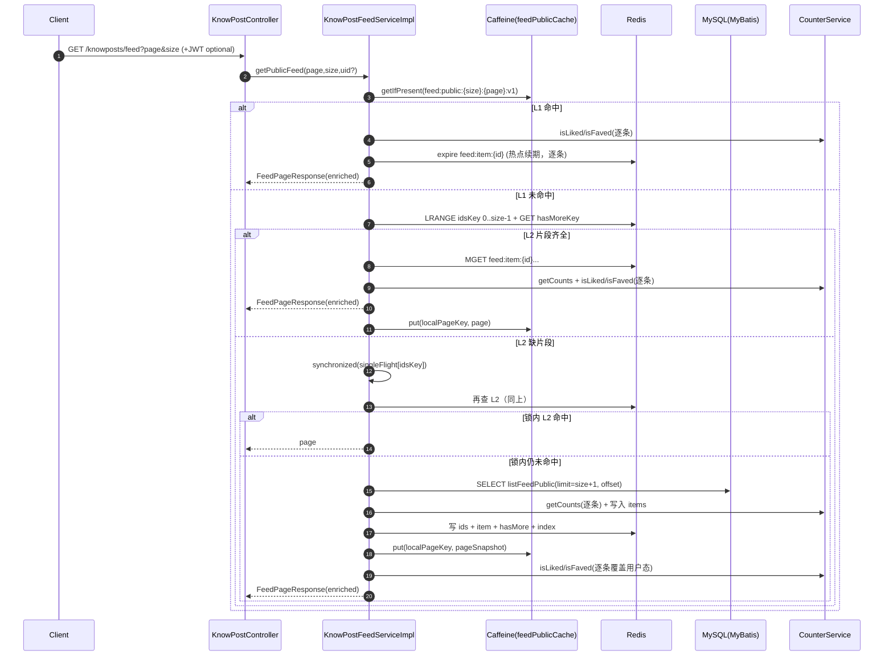
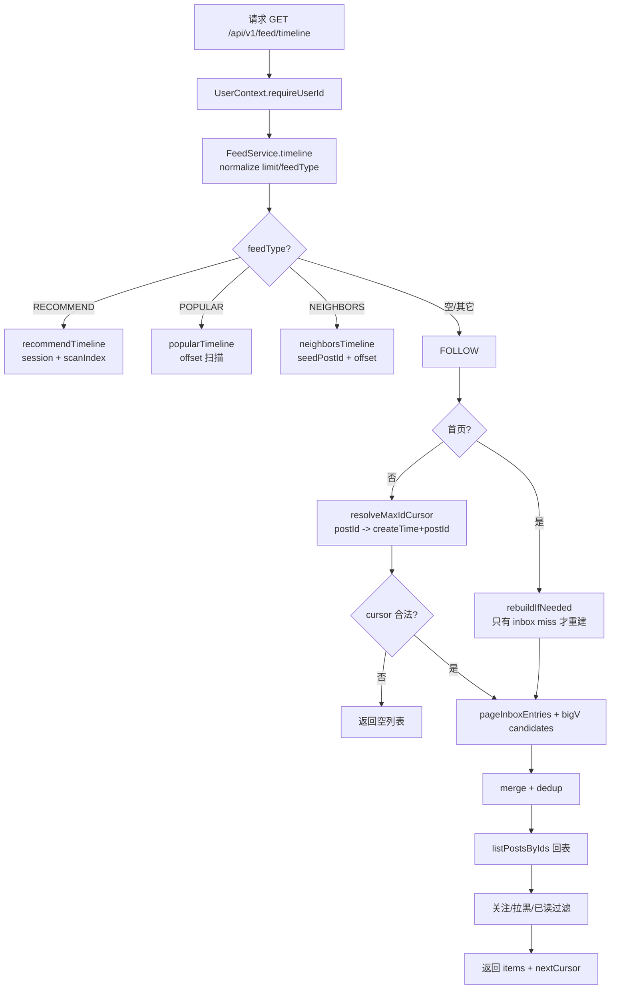
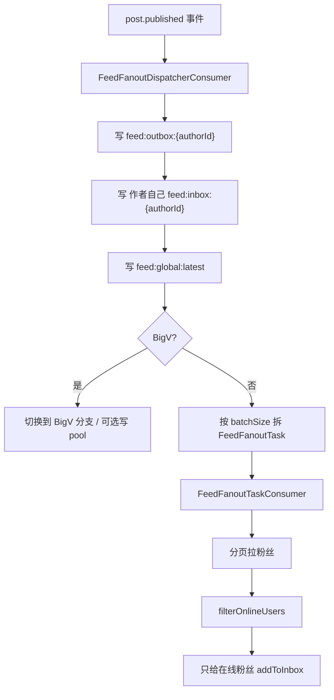

# Feed 流全链路说明与可复刻实现方案（zhiguang_be）

文档日期：2026-03-05  
仓库：`https://github.com/G-Pegasus/zhiguang_be`  
分析基准 commit：`23f4343ec030be0ea700db2d7107470453d96e15`  

> 目标：把该仓库里的“Feed 流（知文首页列表 + 我的已发布）”从 **HTTP 接口 → Service → 本地缓存 → Redis 片段缓存/页面缓存 → DB 回源 → 热点续期 → 计数事件旁路更新** 所有链路讲清楚，并输出一份足够详细的“可复刻实现方案”，让另一个 Codex agent 不读原代码也能复现同等行为与 Key 结构。

---

## 0. 需求理解确认（按你的规则走）

基于现有信息，我理解你的需求是：**在本地仓库 `zhiguang_be` 中，把 Feed 流完整拆开讲清楚**——包括公共首页 Feed（公开已发布内容）和“我的已发布”列表两条读链路，以及它们背后的缓存结构、回源策略、热点 TTL 延长、计数变更的旁路更新；并为每条链路给出 Mermaid 流程图；最后给出一份可以让另一个 Codex agent 复刻的实现方案（接口契约、Redis Key 约定、TTL、伪代码、验收用例）。

---

## 1. 结论（Linus 三选一）

✅ **值得做**：这套 Feed 在“读链路”里塞了多个工程化手段（三级缓存、片段缓存、软 hasMore、single-flight、防雪崩抖动、热点 TTL 延长、计数事件旁路更新），如果不把数据结构与边界条件写出来，复刻者会踩一堆隐形坑。

---

## 2. 范围与术语（先把名词说人话）

### 2.1 本文覆盖的 Feed 是什么

本仓库的 Feed 主要指知文（KnowPost）的两条列表：

1) **公共首页 Feed**：所有用户都能看（匿名也能看），内容条件为：`status = published` 且 `visible = public`  
2) **我的已发布**：只看当前用户自己发的已发布内容：`creator_id = me` 且 `status = published`

注意：**这不是“关注流/好友流”**，不按关注关系做个性化排序；它是一个“公开广场流 + 我的发布”。

### 2.2 权威数据 vs 缓存

- 权威内容元数据：MySQL `know_posts` + `users`（JOIN 作者信息）
- 权威计数：Redis（Counter 系统 SDS/bitmap），通过 `CounterService.getCounts/isLiked/isFaved` 读取
- Feed 缓存：Caffeine（进程内）+ Redis（片段/页面）

---

## 3. 代码地图（追链路只看这些文件）

### 3.1 HTTP 入口

- Feed 接口：`src/main/java/com/tongji/knowpost/api/KnowPostController.java`
  - `GET /api/v1/knowposts/feed`
  - `GET /api/v1/knowposts/mine`

### 3.2 Feed 核心实现

- `src/main/java/com/tongji/knowpost/service/impl/KnowPostFeedServiceImpl.java`
  - 公共 Feed：`getPublicFeed`
  - 我的已发布：`getMyPublished`
  - 片段缓存组装：`assembleFromCache`
  - 片段缓存写入：`writeCaches`
  - 用户态覆盖：`enrich`

### 3.3 热点探测（TTL 动态延长）

- `src/main/java/com/tongji/cache/hotkey/HotKeyDetector.java`
- `src/main/java/com/tongji/cache/config/CacheProperties.java`
- `src/main/java/com/tongji/cache/config/CacheConfig.java`

### 3.4 计数事件旁路更新（点赞/收藏导致 Feed 页缓存计数更新）

- `src/main/java/com/tongji/knowpost/listener/FeedCacheInvalidationListener.java`
- 计数事件模型：`src/main/java/com/tongji/counter/event/CounterEvent.java`
- 计数读写接口：`src/main/java/com/tongji/counter/service/CounterService.java`

### 3.5 DB 查询（MyBatis）

- Mapper 接口：`src/main/java/com/tongji/knowpost/mapper/KnowPostMapper.java`
- SQL：`src/main/resources/mapper/KnowPostMapper.xml`
- 行模型：`src/main/java/com/tongji/knowpost/model/KnowPostFeedRow.java`

---

## 4. 对外接口契约（HTTP 层）

### 4.1 公共首页 Feed

- 方法：`GET`
- 路径：`/api/v1/knowposts/feed`
- Query：
  - `page`：页码（默认 1，最小 1）
  - `size`：每页条数（默认 20，范围 1~50）
- 认证：
  - 可匿名（不带 JWT 也能返回）
  - 若带 JWT，会额外计算 `liked/faved`
- Response：`FeedPageResponse`

### 4.2 我的已发布

- 方法：`GET`
- 路径：`/api/v1/knowposts/mine`
- Query：同上
- 认证：必须带 JWT（否则无法获取 userId）
- Response：`FeedPageResponse`（条目会带 `isTop`）

### 4.3 FeedPageResponse / FeedItemResponse 结构

代码：  
`src/main/java/com/tongji/knowpost/api/dto/FeedPageResponse.java`  
`src/main/java/com/tongji/knowpost/api/dto/FeedItemResponse.java`

```json
{
  "items": [
    {
      "id": "262804640385601536",
      "title": "标题",
      "description": "摘要",
      "coverImage": "https://cdn/xxx.png",
      "tags": ["java","并发"],
      "authorAvatar": "https://cdn/a.png",
      "authorNickname": "张三",
      "tagJson": "{\"领域\":\"AI\"}",
      "likeCount": 128,
      "favoriteCount": 67,
      "liked": true,
      "faved": false,
      "isTop": null
    }
  ],
  "page": 1,
  "size": 20,
  "hasMore": true
}
```

字段语义：
- `likeCount/favoriteCount`：来自 Counter 系统（权威在 Redis）
- `liked/faved`：用户维度状态（实时读 bitmap），**不能写入公共共享缓存**
- `isTop`：
  - 公共 Feed：通常为 `null`（服务端不在公共流里返回置顶状态）
  - 我的已发布：返回 `true/false`

---

## 5. 数据结构（DB + Redis Key，一次列清楚）

### 5.1 MySQL 表（Feed 读取需要的最小字段）

来自 `db/schema.sql`（开源版有）。

`know_posts`（关键字段）：
- `id`（雪花 ID）
- `creator_id`
- `status`：`draft|published|deleted...`
- `visible`：`public|...`
- `title/description`
- `tags`（JSON 数组）
- `img_urls`（JSON 数组）
- `publish_time`
- `is_top`

`users`（作者字段）：
- `id`
- `avatar`
- `nickname`
- `tags_json`

### 5.2 Redis Key 约定（复刻必须一致）

#### A) 公共 Feed（只做“片段缓存”，不写 Redis 整页）

| 目的 | Key 模板 | 类型 | TTL | 写入者 | 读取者 |
|---|---|---|---|---|---|
| 本地页缓存 key（同时作为“页面标识”写入反向索引） | `feed:public:{size}:{page}:v{LAYOUT_VER}` | -（Caffeine key） | 15s（本地） | `getPublicFeed` | `getPublicFeed` |
| ID 列表片段 | `feed:public:ids:{size}:{hourSlot}:{page}` | List | `60~89s` | `writeCaches` | `assembleFromCache` |
| hasMore 软缓存 | `feed:public:ids:{size}:{hourSlot}:{page}:hasMore` | String(`0/1`) | `10s` 或 `10~20s` | `writeCaches` | `assembleFromCache` |
| 内容条目片段（JSON） | `feed:item:{id}` | String(JSON) | `60~89s`（可被热键延长） | `writeCaches` | `assembleFromCache` |
| 反向索引：内容 → 页面集合（按小时分段） | `feed:public:index:{id}:{hourSlot}` | Set(pageKey) | `60~89s` | `writeCaches` | `FeedCacheInvalidationListener` |
| 页面集合（当前实现仅写入，不消费） | `feed:public:pages` | Set(pageKey) | 无 | `writeCaches` | （暂无） |

解释：
- `hourSlot = System.currentTimeMillis() / 3600000`（以“小时”为片段维度）
- 公共 Feed **没有** Redis “整页 JSON 缓存”，只靠 `ids + item` 组装

#### B) 我的已发布（写 Redis 整页）

| 目的 | Key 模板 | 类型 | TTL | 写入者 | 读取者 |
|---|---|---|---|---|---|
| 我的发布整页 JSON | `feed:mine:{userId}:{size}:{page}` | String(JSON) | `30~49s`（可被热键延长） | `getMyPublished` | `getMyPublished` |
| 本地页缓存 | 同上（key 相同） | -（Caffeine key） | 10s（本地） | `getMyPublished` | `getMyPublished` |

#### C) 热键统计（只在内存，不在 Redis）

`HotKeyDetector` 用 `ConcurrentHashMap<String,int[]>` 存滑窗计数，不依赖 Redis。  
Feed 里使用的热键 key：
- 内容热键：`knowpost:{id}`
- mine 页热键：直接用页面 key（`feed:mine:...`）

---

## 6. 链路 1：公共 Feed 读链路（L1 → L2 → Single-Flight → DB）

入口：`KnowPostFeedServiceImpl.getPublicFeed(page,size,currentUserIdNullable)`

### 6.1 时序概览（Mermaid）



### 6.2 逐步拆解（你要复刻就照这个顺序写）

#### Step 1：参数收敛

- `safeSize = clamp(size, 1..50)`
- `safePage = max(page, 1)`

#### Step 2：生成缓存 key

```text
localPageKey = "feed:public:{safeSize}:{safePage}:v{LAYOUT_VER}"
hourSlot     = nowMillis / 3600000
idsKey       = "feed:public:ids:{safeSize}:{hourSlot}:{safePage}"
hasMoreKey   = idsKey + ":hasMore"
```

#### Step 3：L1 本地缓存命中（Caffeine）

命中条件：`feedPublicCache.getIfPresent(localPageKey)` 返回 `FeedPageResponse` 且 `items != null`

命中后做两件事：
1) **热点记录 + 续期**：对页面里每个 item 调 `recordItemHotKey(item.id())`（只续期 `feed:item:{id}`）  
2) **用户态覆盖**：对返回 items 执行 `enrich(items, uid)`（逐条计算 `liked/faved`）

注意：
- L1 命中不会刷新 `likeCount/favoriteCount`（所以可能短时间内计数略旧，靠 TTL 与旁路更新修正）

#### Step 4：L2 Redis 片段命中（assembleFromCache）

L2 命中条件很苛刻：**ids 列表存在且 item JSON 全部存在**，否则直接返回 `null`，触发 DB 回源。

组装逻辑：
1) `LRANGE idsKey 0..size-1`
2) `MGET feed:item:{id}...`（缺任何一个即视为 miss）
3) 反序列化 item JSON 得到“基础条目”
4) 对每条目：
   - `CounterService.getCounts("knowpost", id, ["like","fav"])` 刷新计数
   - `CounterService.isLiked/isFaved` 计算用户态（uid 为空则返回 false）
5) `hasMore`：
   - 优先读 `hasMoreKey`（`"1"`/`"0"`）
   - 缺失则用 `idList.size == size` 兜底

#### Step 5：Single-Flight（同一页并发只允许一个回源）

锁粒度：`idsKey`（包含 hourSlot，所以跨小时自动换锁）

```text
lock = singleFlight.computeIfAbsent(idsKey, new Object())
synchronized(lock) {
  again = assembleFromCache(...)
  if hit -> return again
  else -> DB 回源 -> 写缓存 -> return
}
finally: singleFlight.remove(idsKey)
```

注意：
- 这是**进程内** single-flight；多实例部署时不同实例之间不互斥（本仓库没做分布式锁）

#### Step 6：DB 回源（MyBatis）

SQL：`KnowPostMapper.listFeedPublic(limit, offset)`

实现细节：
- 用 `limit = size + 1` 多读 1 条判断 `hasMore`
- `hasMore = rows.size > size`，然后裁剪到 `size`
- 组装 items 时传 `userIdNullable = null`，避免把某个用户的 liked/faved 写进共享缓存
- 片段缓存 TTL：`60 + random(0..29)` 秒（防雪崩抖动）

---

## 7. 链路 2：公共 Feed 缓存写入链路（writeCaches）

入口：`KnowPostFeedServiceImpl.writeCaches(pageKey, idsKey, hasMoreKey, ...)`

### 7.1 流程图

```mermaid
flowchart TD
  A[DB rows & items] --> B[构造 idVals = rows.id 顺序列表]
  B --> C[LPUSH idsKey idVals...]
  C --> D[EXPIRE idsKey frTtl(60~89s)]
  B --> E[写 hasMoreKey: '1'/'0']
  E --> F[EXPIRE hasMoreKey 10s 或 10~20s]
  A --> G[feed:public:pages SADD pageKey]
  A --> H{for each item}
  H --> I[构造 idxKey = feed:public:index:{id}:{hourSlot}]
  I --> J[SADD idxKey pageKey]
  J --> K[EXPIRE idxKey frTtl]
  H --> L[SET feed:item:{id} itemJson EX frTtl]
```

### 7.2 关键细节（复刻时别“自作聪明”）

1) `idsKey` 写入用的是 `leftPushAll`（等价 Redis `LPUSH` 多值）  
   - Redis 的 `LPUSH key a b c` 会得到 `c b a`，也就是说**可能发生顺序反转**  
   - 复刻要么严格照原实现（保留反转行为），要么改成 `RPUSH` 并同时改读端验证（但那就不是“等价复刻”）

2) `hasMoreKey` 是“软缓存”：
   - 只有在“满页且 hasMore=true”时才给更长一点的 TTL（10~20s）
   - 否则统一 10s
   - 目的：减少“是否有下一页”的频繁回源，但又不希望这个标志长期错误

3) `feed:public:pages` 当前实现只写不读：  
   - 如果你复刻并准备上生产，建议要么加 TTL/清理任务，要么删掉它，别让它无限增长。

---

## 8. 链路 3：热点探测与 TTL 动态延长

### 8.1 HotKeyDetector 的工作方式（人话版）

`HotKeyDetector` 做的是“近 60 秒访问次数”统计：
- 把 60 秒窗口切成 6 段（每段 10 秒）
- 每次访问某个 key，就把当前段计数 +1
- 每 10 秒 rotate 一次，进入下一段并把新段清零
- 总热度 = 6 段求和

热度分级阈值（默认值，见 `CacheProperties`）：
- LOW：>= 50
- MEDIUM：>= 200
- HIGH：>= 500

TTL 扩展（默认值）：
- LOW：+20s
- MEDIUM：+60s
- HIGH：+120s

### 8.2 公共 Feed 的热点续期（recordItemHotKey）

触发点：公共 Feed 返回时（无论来自 L1/L2/DB），都会对每个 item 调一次 `recordItemHotKey(id)`

行为：
1) 热键统计：`hotKey.record("knowpost:{id}")`
2) 计算目标 TTL：`target = 60 + extend(level)`
3) 仅延长 `feed:item:{id}` 的 TTL：如果当前 TTL < target，则 `EXPIRE` 到 target

⚠️ 现实影响：只延长 `feed:item:{id}`，**不会延长 `idsKey`**。  
所以如果 `idsKey` 过期，你仍然无法用片段缓存组装页面（会回源 DB）。

### 8.3 详情页也会延长 feed:item TTL（跨链路影响）

`KnowPostServiceImpl.getDetail` 中的 `recordHotKeyAndExtendTtl` 会同时延长：
- `knowpost:detail:{id}:v{ver}`（详情整页缓存）
- `feed:item:{id}`（Feed item 片段）

也就是说：**内容详情如果很热，会间接让 Feed item 片段更耐活**。

---

## 9. 链路 4：计数变更旁路更新（CounterEvent → FeedCacheInvalidationListener）

### 9.1 为什么需要旁路更新

公共 Feed 的 L1 本地缓存命中时：
- 会实时计算 `liked/faved`
- 但不会刷新 `likeCount/favoriteCount`

所以当用户在短时间内频繁点赞/收藏时，页面上的计数可能在 15 秒 TTL 内“看起来没变”。  
旁路更新就是用事件把本地缓存里的计数“顺手补一下”。

### 9.2 事件来源（CounterServiceImpl）

点赞/收藏发生状态变化时（幂等成功），`CounterServiceImpl.toggle(...)` 会：
1) 发送 Kafka：`counter-events`
2) 发布本地 Spring 事件：`eventPublisher.publishEvent(CounterEvent...)`

`FeedCacheInvalidationListener` 用 `@EventListener` 监听本地事件（更快）。

### 9.3 监听器具体做了什么

入口：`FeedCacheInvalidationListener.onCounterChanged(CounterEvent event)`

流程图：

```mermaid
flowchart TD
  A[CounterEvent(entityType=knowpost, metric=like/fav, delta)] --> B{过滤 entityType/metric}
  B -->|非 knowpost 或 非 like/fav| X[ignore]
  B --> C[DB: KnowPostMapper.findById(eid)]
  C --> D[UserCounterService: 作者获赞/获藏 +delta]
  B --> E[hourSlot = now/1h]
  E --> F[pages = SMEMBERS index:eid:hourSlot ∪ index:eid:hourSlot-1]
  F --> G{for each pageKey}
  G --> H[L1: if feedPublicCache has pageKey -> adjust like/fav]
  G --> I[Redis: GET pageKey]
  I -->|命中| J[更新 JSON 并保持 TTL]
  I -->|未命中| K[SREM index:eid:hourSlot pageKey]
```

注意两点很关键（复刻必须照做，哪怕你觉得它怪）：
1) **它依赖反向索引**：`feed:public:index:{eid}:{hourSlot}` 里存了“这个内容出现在过哪些页面 key 里”。  
2) 它尝试更新 Redis “整页 JSON”（key=pageKey），但公共 Feed 当前实现**不写 Redis 整页**。  
   - 结果：`GET pageKey` 大概率拿不到，于是走 `SREM` 把 pageKey 从 index set 移除。  
   - 这意味着：索引会被事件逐步清理掉（更多像“清噪”而不是长期维护）。

---

## 10. 链路 5：我的已发布读链路（本地 → Redis 整页 → DB）

入口：`KnowPostFeedServiceImpl.getMyPublished(userId,page,size)`

### 10.1 流程图

```mermaid
flowchart TD
  A[GET /knowposts/mine (JWT required)] --> B[key=feed:mine:{uid}:{size}:{page}]
  B --> C{L1: Caffeine 命中?}
  C -->|Yes| D[hotKey.record(key) + maybeExtendTtlMine]
  D --> E[return local page]
  C -->|No| F{Redis GET key 命中?}
  F -->|Yes| G[JSON -> FeedPageResponse]
  G --> H{items counts 完整?}
  H -->|Yes| I[put local + hotKey.record + maybeExtendTtlMine]
  I --> J[enrich(items, uid) 覆盖 liked/faved]
  J --> K[return]
  H -->|No / 解析失败| L[DB 回源 listMyPublished(limit=size+1, offset)]
  F -->|No| L
  L --> M[mapRowsToItems(rows, uid, includeIsTop=true)]
  M --> N[Redis SET key TTL 30~49s + 本地 put + hotKey.record]
  N --> O[return]
```

### 10.2 关键细节

- mine Feed 的 key **包含 userId**，所以写 Redis 整页不会污染其他用户
- Redis TTL 更短（30~49s），但热点访问会通过 `HotKeyDetector` 把 TTL 延长（最多 +120s）
- mine 命中 Redis 时只做 `enrich` 覆盖用户态，不刷新计数（计数是否“秒级最终一致”由 Counter 系统负责）

---

## 11. 可复刻实现方案（另一个 Codex agent 照这个做就能复现）

> 本节不是“讲道理”，是“按步骤交付可跑系统”。你照做就行。

### 11.1 技术栈与依赖（最小集合）

- Java 21
- Spring Boot 3（Web + Validation + Security 可选）
- MyBatis
- MySQL 8
- Redis（String/List/Set + TTL）
- Caffeine
- Jackson
- （可选但建议）Kafka：因为 Counter 系统里有事件聚合；但 Feed 旁路更新只依赖本地事件也能跑

### 11.2 DB 设计（必须有的表与索引）

直接复用 `db/schema.sql` 中的：
- `users`
- `know_posts`

要求：
- `know_posts` 至少要有 `status/visible/publish_time/creator_id/is_top/tags/img_urls`
- 索引至少要覆盖：
  - `(status, publish_time)` 或 `(status, visible, publish_time)`（公共流排序）
  - `(creator_id, status, publish_time)`（我的发布）

### 11.3 MyBatis Mapper（必须等价）

接口：
- `listFeedPublic(limit, offset)`
- `listMyPublished(creatorId, limit, offset)`

SQL（等价于本仓库）：
- 公共 Feed：`WHERE status='published' AND visible='public' ORDER BY publish_time DESC LIMIT ? OFFSET ?`
  - 备注：XML 注释说“置顶优先”，但实际 SQL 没有 `ORDER BY is_top DESC`；以 SQL 为准。
- 我的发布：`WHERE creator_id=? AND status='published' ORDER BY is_top DESC, publish_time DESC LIMIT ? OFFSET ?`

### 11.4 DTO 结构（接口契约必须一致）

按 record 定义：
- `FeedItemResponse`
- `FeedPageResponse`

### 11.5 CacheProperties + Caffeine 配置

实现：
- `CacheProperties`（默认值见代码）
  - 公共页本地 TTL：15s，maxSize 1000
  - mine 页本地 TTL：10s，maxSize 1000
  - hotkey：window=60s, segment=10s, 阈值与 extendSeconds 见默认值
- `CacheConfig` 提供 `feedPublicCache`、`feedMineCache`

### 11.6 HotKeyDetector（必须是滑窗分段）

必须有：
- `record(key)`
- `ttlForPublic(baseTtl, key)`
- `ttlForMine(baseTtl, key)`
- `rotate()` 定时清段（按 `segmentSeconds`）

### 11.7 FeedService 伪代码（核心：别写错 key 和 TTL）

#### A) 公共 Feed

```text
function getPublicFeed(page,size,uid?):
  safePage = max(page,1)
  safeSize = clamp(size,1..50)

  pageKey  = "feed:public:{safeSize}:{safePage}:v1"
  hourSlot = nowMillis / 3600000
  idsKey   = "feed:public:ids:{safeSize}:{hourSlot}:{safePage}"
  moreKey  = idsKey + ":hasMore"

  # L1 local
  local = caffeine.get(pageKey)
  if local exists:
    for item in local.items: recordItemHotKey(item.id)
    return page(local.items.enrich(uid), local.hasMore)

  # L2 fragments
  fromCache = assembleFromCache(idsKey, moreKey, safePage, safeSize, uid)
  if fromCache exists:
    caffeine.put(pageKey, fromCache)
    for item in fromCache.items: recordItemHotKey(item.id)
    return fromCache

  # single-flight by idsKey
  lock = map.computeIfAbsent(idsKey, new Object())
  synchronized(lock):
    again = assembleFromCache(...)
    if again exists:
      caffeine.put(pageKey, again)
      return again

    rows = DB.listFeedPublic(limit=safeSize+1, offset=(safePage-1)*safeSize)
    hasMore = len(rows) > safeSize
    rows = rows.take(safeSize)

    itemsForCache = mapRowsToItems(rows, uid=null, includeIsTop=false)
    snapshot = page(itemsForCache, hasMore)

    frTtl = seconds(60 + rand(0..29))
    writeCaches(pageKey, idsKey, moreKey, safeSize, rows, itemsForCache, hasMore, frTtl)
    caffeine.put(pageKey, snapshot)

    return page(itemsForCache.enrich(uid), hasMore)
  finally:
    map.remove(idsKey)
```

#### B) assembleFromCache（必须是“缺一个就算 miss”）

```text
function assembleFromCache(idsKey, moreKey, page, size, uid?):
  ids = LRANGE(idsKey, 0, size-1)
  if ids empty: return null

  itemKeys = ids.map(id => "feed:item:" + id)
  itemJsons = MGET(itemKeys)
  if any json missing: return null

  baseItems = itemJsons.map(json => jsonToFeedItem(json))
  enriched = []
  for base in baseItems:
    counts = Counter.getCounts("knowpost", base.id, ["like","fav"])
    liked  = uid != null && Counter.isLiked("knowpost", base.id, uid)
    faved  = uid != null && Counter.isFaved("knowpost", base.id, uid)
    enriched.add(base.withCounts(counts).withUserFlags(liked,faved))

  moreStr = GET(moreKey)
  hasMore = moreStr != null ? (moreStr=="1") : (len(ids)==size)
  return page(enriched, page, size, hasMore)
```

#### C) writeCaches（Key、TTL、索引一致）

```text
function writeCaches(pageKey, idsKey, moreKey, size, rows, items, hasMore, frTtl):
  idVals = rows.map(r => str(r.id))
  if idVals not empty:
    LPUSH(idsKey, idVals...)    # 注意：可能反转顺序
    EXPIRE(idsKey, frTtl)
    if len(idVals)==size && hasMore:
      SET(moreKey,"1", ttl=10+rand(0..10))
    else:
      SET(moreKey, hasMore?"1":"0", ttl=10)

  SADD("feed:public:pages", pageKey)

  hourSlot = nowMillis / 3600000
  for item in items:
    idxKey = "feed:public:index:{item.id}:{hourSlot}"
    SADD(idxKey, pageKey)
    EXPIRE(idxKey, frTtl)

    SET("feed:item:{item.id}", json(item), EX=frTtl)
```

#### D) mine Feed

```text
function getMyPublished(uid,page,size):
  key = "feed:mine:{uid}:{size}:{page}"

  local = caffeineMine.get(key)
  if local exists:
    hotKey.record(key); maybeExtendMine(key)
    return local

  cached = GET(key)
  if cached exists and json OK and countsComplete:
    caffeineMine.put(key, cached)
    hotKey.record(key); maybeExtendMine(key)
    return page(cached.items.enrich(uid), cached.hasMore)

  rows = DB.listMyPublished(uid, limit=size+1, offset=(page-1)*size)
  hasMore = len(rows) > size
  rows = rows.take(size)

  items = mapRowsToItems(rows, uid, includeIsTop=true)
  resp = page(items, hasMore)
  SET(key, json(resp), EX=30+rand(0..19))
  caffeineMine.put(key, resp)
  hotKey.record(key)
  return resp
```

### 11.8 旁路更新监听器（可选但“全链路”必须做）

把 `CounterEvent` 监听起来，按本仓库逻辑实现：
- `entityType == "knowpost" && metric in ("like","fav")` 才处理
- 先更新作者维度计数（`UserCounterService.incrementLikesReceived/FavsReceived`）
- 再用反向索引 set 找到页面 key，更新本地缓存里的 `likeCount/favoriteCount`

### 11.9 必要配置（开源版 application.yml 为空，复刻必须补）

你至少要提供：
- `spring.datasource.*`（MySQL）
- `spring.data.redis.*`（Redis）
- `cache.*`（可不配，走默认值）

示例（只列关键项）：

```yaml
spring:
  datasource:
    url: jdbc:mysql://127.0.0.1:3306/zhiguang?useUnicode=true&characterEncoding=utf8&serverTimezone=Asia/Shanghai
    username: root
    password: root
  data:
    redis:
      host: 127.0.0.1
      port: 6379

cache:
  l2:
    public-cfg:
      ttl-seconds: 15
      max-size: 1000
    mine-cfg:
      ttl-seconds: 10
      max-size: 1000
  hotkey:
    window-seconds: 60
    segment-seconds: 10
    level-low: 50
    level-medium: 200
    level-high: 500
    extend-low-seconds: 20
    extend-medium-seconds: 60
    extend-high-seconds: 120
```

---

## 12. 验收清单（复刻后最小可验证）

1) 公共 Feed 基本分页：
- `GET /knowposts/feed?page=1&size=20` 返回 `page=1,size=20`
- 当 DB 实际有 >20 条 published+public 内容时，`hasMore=true`

2) 缓存命中路径：
- 第一次请求：日志里应出现 `source=db`（或你自己的标记），并写入 `idsKey/itemKey`
- 第二次同页请求：在 `idsKey` TTL 内应走 L2 组装（不触发 DB）
- 第三次在 15s 内多次访问：应走 L1（不触发 Redis LRANGE/MGET）

3) single-flight：
- 同一实例上并发打同一页（例如 100 并发）：理论上只有 1 次 DB 查询，其余在锁内复用缓存结果

4) mine Feed：
- 发布过内容的用户访问 `/mine` 能看到自己的列表，且条目包含 `isTop`
- 缓存 key `feed:mine:{uid}:{size}:{page}` 存在且 TTL 在 30~49s（或被热点延长）

5) 热点续期：
- 高频访问同一个内容 ID 后，`feed:item:{id}` 的 TTL 会被延长到 `60 + extend(level)`（最多 +120）

6) 计数旁路更新（如果你复刻了监听器）：
- 对某个 `knowpost` 点赞后，短时间内公共 Feed L1 缓存里该条目的 `likeCount` 会 +1（无需等待 15s TTL）

---

## 13. 已知“坑点/怪点”（你复刻前先看）

1) 公共 Feed 的 SQL 注释与实现不一致  
`KnowPostMapper.xml` 注释说“置顶优先”，但公共流实际 `ORDER BY publish_time DESC`（不含 is_top）。

2) `LPUSH` 可能导致 ids 顺序反转  
如果你线上发现“第一次 DB 回源顺序正确，第二次走缓存顺序反了”，基本就是这个。

3) 公共流不写 Redis 整页，但监听器仍尝试更新它  
这会导致 index set 在事件触发时被 `SREM` 清掉。当前实现更像“短期旁路”而不是长期一致性维护。

4) assembleFromCache 是“缺一片就全 miss”  
只要某个 `feed:item:{id}` 丢了，整页直接 DB 回源；这在高并发下对 DB 压力很敏感。

5) 计数读取没有批量  
每页每条都会调用 `getCounts`，没有用 `getCountsBatch`。复刻要保持一致（除非你准备优化并改验收）。


---

# Feed 流全链路说明与可复刻实现方案（nexus）

文档日期：2026-03-06  
仓库：`project/nexus`  
分析基准 commit：`9eb107575aa7ca7613157756abd1512ba31401ba`（外层工作区仓库 commit，`nexus` 本身不是独立 Git 仓库）  

> 目标：把 `nexus` 里的 Feed 流从 **HTTP 接口 → FeedService 分流 → Redis inbox/outbox/bigV pool/global latest/session cache → MySQL 回表 → MQ fanout → 推荐系统旁路反馈** 讲清楚，并给出可复刻的 Key、游标协议、配置、伪代码与复现步骤。下面一律以**当前源码真实行为**为准；若与仓库旧文档冲突，按源码写。

---

## 0. 需求理解确认（按你的规则走）

基于现有信息，我理解你的需求是：**参考现有 zhiguang Feed 文档的写法，对 `nexus` 项目的 Feed 全链路做同等级分析**，范围至少包括：FOLLOW 首页、RECOMMEND / POPULAR / NEIGHBORS 推荐流、PROFILE 个人页、发布后的 fanout 写扩散、推荐系统旁路，以及 Redis Key / TTL / 游标协议 / 配置 / 复现步骤 / 坑点，并把结果直接追加到本文档里。

---

## 1. 结论（Linus 三选一）

✅ **值得做**：`nexus` 的 Feed 不是单一列表，它把 **关注收件箱、BigV 拉模式、推荐会话缓存、全站 latest 兜底、MQ fanout、关系补偿** 全塞进了一套链路里；如果不把数据结构和分支条件写清楚，复刻者一定会把 cursor、Redis key 和“什么时候走哪条分支”写错。

---

## 2. 范围与术语（先把名词说人话）

### 2.1 本文覆盖的 Feed 是什么

1) `FOLLOW`：关注页时间线，默认 `feedType`  
2) `RECOMMEND`：推荐页，使用 Gorse + session cache，不够时降级 `global latest`  
3) `POPULAR`：热门流，直接从推荐端扫描热门候选  
4) `NEIGHBORS`：相关推荐流，以某条 `seedPostId` 为种子  
5) `PROFILE`：个人页，只看某个用户自己的已发布内容
6) 异步写链路：发布后写 `outbox`、作者自己的 `inbox`、`global latest`，再按作者分类决定普通 fanout 或 BigV 聚合池  
7) 关系补偿：关注成功后，若关注者在线，会把被关注者最近 K 条内容补进 inbox

### 2.2 权威数据 vs 派生缓存

- 权威帖子数据：`IContentRepository` 背后的内容主表 / 内容 KV，Feed 读侧只关心 `postId/userId/createTime/summary/contentText/postTypes`
- 关注关系 / 拉黑关系：关系表 + 邻接缓存
- Feed 索引缓存：Redis `ZSET / LIST / SET / STRING`
- 推荐候选：优先 `IRecommendationPort`；失败或为空时，只有 `RECOMMEND` 会降级 `feed:global:latest`

---

## 3. 代码地图（追链路只看这些文件）

### 3.1 HTTP 入口

- `project/nexus/nexus-trigger/src/main/java/cn/nexus/trigger/http/social/FeedController.java`
  - `GET /api/v1/feed/timeline`
  - `GET /api/v1/feed/profile/{targetId}`
- `project/nexus/nexus-api/src/main/java/cn/nexus/api/social/IFeedApi.java`

### 3.2 读链核心

- `project/nexus/nexus-domain/src/main/java/cn/nexus/domain/social/service/FeedService.java`
  - `timeline`
  - `recommendTimeline`
  - `popularTimeline`
  - `neighborsTimeline`
  - `profile`
- `project/nexus/nexus-domain/src/main/java/cn/nexus/domain/social/service/FeedInboxRebuildService.java`
- `project/nexus/nexus-domain/src/main/java/cn/nexus/domain/social/service/FeedFollowCompensationService.java`

### 3.3 Redis 仓储

- `project/nexus/nexus-infrastructure/src/main/java/cn/nexus/infrastructure/adapter/social/repository/FeedTimelineRepository.java`
- `project/nexus/nexus-infrastructure/src/main/java/cn/nexus/infrastructure/adapter/social/repository/FeedOutboxRepository.java`
- `project/nexus/nexus-infrastructure/src/main/java/cn/nexus/infrastructure/adapter/social/repository/FeedBigVPoolRepository.java`
- `project/nexus/nexus-infrastructure/src/main/java/cn/nexus/infrastructure/adapter/social/repository/FeedGlobalLatestRepository.java`
- `project/nexus/nexus-infrastructure/src/main/java/cn/nexus/infrastructure/adapter/social/repository/FeedRecommendSessionRepository.java`
- `project/nexus/nexus-infrastructure/src/main/java/cn/nexus/infrastructure/adapter/social/repository/FeedFollowSeenRepository.java`

### 3.4 发布 fanout / 写扩散

- `project/nexus/nexus-trigger/src/main/java/cn/nexus/trigger/mq/consumer/FeedFanoutDispatcherConsumer.java`
- `project/nexus/nexus-trigger/src/main/java/cn/nexus/trigger/mq/consumer/FeedFanoutTaskConsumer.java`
- `project/nexus/nexus-domain/src/main/java/cn/nexus/domain/social/service/FeedDistributionService.java`
- `project/nexus/nexus-trigger/src/main/java/cn/nexus/trigger/mq/config/FeedFanoutConfig.java`

### 3.5 推荐旁路

- `project/nexus/nexus-trigger/src/main/java/cn/nexus/trigger/mq/consumer/FeedRecommendItemUpsertConsumer.java`
- `project/nexus/nexus-trigger/src/main/java/cn/nexus/trigger/mq/consumer/FeedRecommendItemDeleteConsumer.java`
- `project/nexus/nexus-trigger/src/main/java/cn/nexus/trigger/mq/consumer/FeedRecommendFeedbackConsumer.java`
- `project/nexus/nexus-trigger/src/main/java/cn/nexus/trigger/mq/consumer/FeedRecommendFeedbackAConsumer.java`

---

## 4. 对外接口契约（HTTP 层）

### 4.1 `GET /api/v1/feed/timeline`

- 方法：`GET`
- 路径：`/api/v1/feed/timeline`
- 认证：**必须登录**。`FeedController.timeline()` 直接调用 `UserContext.requireUserId()`，拿不到 userId 会走异常分支
- Query：
  - `cursor`：不同 `feedType` 协议不同
  - `limit`：默认 20，最大 100
  - `feedType`：支持 `FOLLOW / RECOMMEND / POPULAR / NEIGHBORS`
  - `userId`：DTO 里有，但控制器**不信这个字段**，真实 userId 来自登录态
- 返回：`FeedTimelineResponseDTO`

### 4.2 `GET /api/v1/feed/profile/{targetId}`

- 方法：`GET`
- 路径：`/api/v1/feed/profile/{targetId}`
- 认证：**当前实现也要求登录**。控制器调用 `UserContext.requireUserId()` 取 `visitorId`
- Query：
  - `cursor`：格式 `"{lastCreateTimeMs}:{lastPostId}"`
  - `limit`：默认 20，最大 100
  - `targetId / visitorId`：DTO 里有，但控制器实际使用的是 path 参数 + 登录态 `visitorId`
- 特殊逻辑：
  - 若访问者和目标用户任一方向存在 `BLOCK` 关系，直接返回空列表
  - `targetId` 为空也直接空列表

### 4.3 响应结构

代码：  
`project/nexus/nexus-api/src/main/java/cn/nexus/api/social/feed/dto/FeedTimelineResponseDTO.java`  
`project/nexus/nexus-api/src/main/java/cn/nexus/api/social/feed/dto/FeedItemDTO.java`

```json
{
  "items": [
    {
      "postId": 10001,
      "authorId": 20001,
      "text": "正文文本",
      "summary": "摘要",
      "publishTime": 1741142400000,
      "source": "FOLLOW"
    }
  ],
  "nextCursor": "10001"
}
```

### 4.4 游标协议总表

- `FOLLOW`：`postId`（字符串），服务端回表把它还原成 `(createTimeMs, postId)` 再翻页
- `PROFILE`：`{lastCreateTimeMs}:{lastPostId}`
- `RECOMMEND`：`REC:{sessionId}:{scanIndex}`
- `POPULAR`：`POP:{offset}`
- `NEIGHBORS`：`NEI:{seedPostId}:{offset}`

---

## 5. 数据结构（帖子字段 + Redis Key + MQ）

### 5.1 Feed 读侧依赖的最小帖子字段

从 `FeedService` 和 `ContentRepository` 的真实使用看，Feed 主要依赖这些字段：
- `postId`
- `userId / authorId`
- `createTime`（发布时间）
- `summary`
- `contentText`
- `postTypes`（主要给推荐 item labels 使用）

### 5.2 Redis Key 一次列清楚

1) `feed:inbox:{userId}`：`ZSET`
- member=`postId`
- score=`publishTimeMs`
- 作用：FOLLOW 首页收件箱
- TTL：`feed.inbox.ttlDays`，默认 14 天
- 相关 key：
  - `feed:inbox:tmp:{userId}:{epochMs}`：重建临时 key
  - `feed:inbox:rebuild:lock:{userId}`：重建互斥锁
  - `__NOMORE__`：空 inbox 的哨兵 member，防止反复重建

2) `feed:outbox:{authorId}`：`ZSET`
- member=`postId`
- score=`publishTimeMs`
- 作用：作者发布流索引，给 BigV 拉模式用
- TTL：`feed.outbox.ttlDays`，默认 14 天
- 临时 key：`feed:outbox:tmp:{authorId}:{epochMs}`

3) `feed:bigv:pool:{bucket}`：`ZSET`
- member=`postId`
- score=`publishTimeMs`
- 作用：把很多 BigV 的发布流合并到少量 bucket 里
- 只有 `feed.bigv.pool.enabled=true` 才会真正写入
- 默认：`buckets=4`、`maxSizePerBucket=500000`、`ttlDays=7`

4) `feed:global:latest`：`ZSET`
- member=`postId`
- score=`publishTimeMs`
- 作用：推荐系统不可用时的全站 latest 兜底候选源
- 没有 TTL，靠 `maxSize=20000` 截断

5) 推荐 session cache
- `feed:rec:session:{userId}:{sessionId}`：`LIST`
- `feed:rec:seen:{userId}:{sessionId}`：`SET`
- `feed:rec:latestCursor:{userId}:{sessionId}`：`STRING`
- TTL：`feed.recommend.sessionTtlMinutes`，默认 20 分钟
- 作用：LIST 保存候选顺序，SET 做 session 内去重，STRING 记录 latest fallback 的内部游标

6) `feed:follow:seen:{userId}`：`SET`
- 作用：首页 FOLLOW 已读去重
- TTL：由 `markFollowSeen` 后主动 `expire(userId, 30)`，源码常量是 30 天
### 5.3 MQ 拓扑

1) Feed fanout 主拓扑：`social.feed`
- 发布事件队列：`feed.post.published.queue`
- 发布事件路由键：`post.published`
- 切片任务路由键：`feed.fanout.task`
- 切片任务队列：`feed.fanout.task.queue`
- 死信交换机：`social.feed.dlx.exchange`
- 死信队列：
  - `feed.post.published.dlx.queue`
  - `feed.fanout.task.dlx.queue`

2) 推荐 item 旁路
- `feed.recommend.item.upsert.queue`
- `feed.recommend.item.delete.queue`
- 都绑定在 `social.feed` 上，但**必须用独立队列**，不能和 fanout 共用

3) 推荐反馈旁路
- C 通道交换机：`social.recommend`
- 队列：`feed.recommend.feedback.queue`
- 路由键：`recommend.feedback`
- A 通道队列：`feed.recommend.feedback.a.queue`
- A 通道复用 `interaction.notify` 事件，但用独立队列，避免和通知消费者抢消息

---

## 6. 主读链路（timeline / profile）

### 6.1 `timeline()` 总分流

`FeedService.timeline(userId, cursor, limit, feedType)` 的真实分流：

1. `userId == null`：直接空列表  
2. `limit` 归一化：默认 20，最大 100  
3. `feedType` 为空或空白：当作 `FOLLOW`  
4. 分支：
- `RECOMMEND` → `recommendTimeline`
- `POPULAR` → `popularTimeline`
- `NEIGHBORS` → `neighborsTimeline`
- 其它全部 → `FOLLOW`

### 6.2 FOLLOW：首页时间线

这是默认首页，也是最复杂的一条。

处理步骤：
1. 判断是不是首页：`cursor` 为空即首页
2. 首页才会 `feedInboxRebuildService.rebuildIfNeeded(userId)`
- 不是每次都重建
- 只有 `feed:inbox:{userId}` key 不存在时，才真正 rebuild
3. 非首页时，先把 `cursor=postId` 用 `resolveMaxIdCursor` 回表查成 `(createTimeMs, postId)`
- 查不到 / 不是数字：直接空列表
4. 按 `publishTimeMs desc + postId desc` 从 `feed:inbox:{userId}` 拉候选
- 首页 `scanLimit = limit * 6`
- 非首页 `scanLimit = limit * 3`
5. 再拉关注列表 `listFollowings(userId)`
6. 若命中 BigV 条件，补拉大 V 候选：
- 关注数很大时，可走 BigV pool
- 否则逐个作者读 outbox 再多路合并
7. 把 inbox 候选 + bigV 候选按 `(publishTimeMs desc, postId desc)` 合并去重
8. 首页还会做 `feed:follow:seen:{userId}` 过滤，尽量避免重复刷到已读帖子
9. `contentRepository.listPostsByIds(postIds)` 批量回表拿内容
10. 读侧再做一层真实关系过滤：
- 只保留“作者是我自己或我仍然关注的人”
- 若作者与我双向任一方向拉黑，也跳过
11. 映射为 `FeedItemVO(source="FOLLOW")`
12. 返回 `items + nextCursor`
- `nextCursor` 是候选列表最后一个 `postId`

这里最重要的不是“读 inbox”，而是**读侧兜底纠偏**：
- 取消关注不强删 inbox
- 拉黑不强删 inbox
- 都靠读侧过滤保证“用户立刻感知正确”

### 6.3 FOLLOW：首页重建 `rebuildIfNeeded`

`FeedInboxRebuildService` 的逻辑很直白：

1. inbox key 已存在 → 不重建  
2. inbox key 不存在 → `doRebuild(userId)`  
3. 先拿关注列表，去掉自己  
4. 对每个关注对象取最近 `perFollowingLimit` 条内容，默认 20  
5. 全量候选按 `createTime desc + postId desc` 排序  
6. 截断到 `inboxSize`，默认 200  
7. 原子 `replaceInbox`
- 先写临时 key
- 再 `RENAME` 覆盖正式 inbox
- 即使没有任何内容，也会写 `__NOMORE__` 哨兵

### 6.4 RECOMMEND：推荐流

这是另一套逻辑，**不能**复用 FOLLOW 的 inbox / outbox 读取。
处理步骤：
1. 解析 cursor：`REC:{sessionId}:{scanIndex}`
2. session 无效或过期：
- 生成新的 `sessionId`
- `scanIndex` 归零
3. 计算预算：
- `scanBudget = limit * scanFactor`，默认 `limit * 10`
- `appendBatch = limit * prefetchFactor`，默认 `limit * 5`
- `maxAppendRounds = 3`
4. `ensureRecommendCandidates(...)` 确保 session 缓存里至少有 `scanIndex + scanBudget` 个候选
5. 优先从 Gorse 拉候选：
- `recommendationPort.recommend(userId, appendBatch)`
- 追加到 `feed:rec:session:*`
- 用 `feed:rec:seen:*` 去重
6. Gorse 失败或为空时，降级从 `feed:global:latest` 按 `timeMs:postId` 内部游标补齐
- 游标存在 `feed:rec:latestCursor:*`
7. 真正返回时，不是“读前 N 个”，而是从 `scanIndex` 开始扫描 session LIST
8. 每次按小块（源码固定 `chunkSize=50`）回表，减少 DB 次数
9. 过滤规则：
- post 不存在就跳过
- 同一个 author 在单页内只保留一条（`seenAuthors`）
10. 映射为 `FeedItemVO(source="RECOMMEND")`
11. `nextCursor = REC:{sessionId}:{newScanIndex}`
- 注意：这是**扫描指针**
- 不是“已经返回了多少条”

另外，RECOMMEND 返回后会异步上报 read feedback：
- `recommendationPort.insertFeedback(userId, postId, "read", tsMs)`
- best-effort，失败只打日志，不影响主链路

### 6.5 POPULAR：热门流

处理思路和 RECOMMEND 相似，但没有 session cache：
1. 解析 `POP:{offset}`
2. `scanBudget = limit * scanFactor`
3. `appendBatch = limit * prefetchFactor`
4. 循环调用 `recommendationPort.popular(userId, appendBatch, offset)`
5. 批量回表、单页内按 author 去重
6. 返回 `FeedItemVO(source="POPULAR")`
7. `nextCursor = POP:{nextOffset}`

关键差异：
- 没有 `feed:rec:session:*`
- 没有 `global latest` fallback
- 推荐端空了就空，不兜底

### 6.6 NEIGHBORS：相关推荐

处理步骤：
1. 解析 `NEI:{seedPostId}:{offset}`
2. `seedPostId` 必填，非法直接空列表
3. 计算 `needN = safeNeighborsN(offset, scanBudget)`
4. 调 `recommendationPort.neighbors(seedPostId, needN)`
5. 从 `offset` 开始切片扫描
6. 批量回表、单页内按 author 去重
7. 返回 `FeedItemVO(source="NEIGHBORS")`
8. `nextCursor = NEI:{seedPostId}:{nextOffset}`

同样，没有 latest fallback。

### 6.7 PROFILE：个人页

处理步骤：
1. `targetId == null` → 空列表
2. 访问者若存在，与目标用户双向任一方向拉黑 → 空列表
3. `limit` 归一化：默认 20，最大 100
4. `contentRepository.listUserPosts(targetId, cursor, limit)`
- cursor 格式：`{lastCreateTimeMs}:{lastPostId}`
5. 把帖子映射为 `FeedItemVO(source="PROFILE")`
6. 返回 `items + nextCursor`

这条链没有 Redis feed index，直接走内容仓储分页。

### 6.8 timeline 主流程图



---

## 7. 异步写链路：一条新帖子怎么进 Feed

### 7.1 发布后第一站：`FeedFanoutDispatcherConsumer`

监听 `social.feed` 上的 `post.published`，执行顺序是：

1. 参数不全直接跳过
2. **永远写 outbox**
- `feedOutboxRepository.addToOutbox(authorId, postId, publishTimeMs)`
3. **永远写作者自己的 inbox**
- 保证“我自己刚发的内容立刻可见”
4. **永远写 global latest**
- 给 RECOMMEND fallback 用
5. 读取作者分类 / 粉丝量
6. 若作者被判成 BigV：
- 至少可以确认会改走 BigV 分支，而不是普通全量 fanout
- 若 `feed.bigv.pool.enabled=true`，会写 `feed:bigv:pool:{bucket}`
- 仓库旧文档还提到“只推铁粉”，但我这次扫描未把那段执行细节完整追穿，所以这里不把它当硬事实写死
7. 非 BigV：
- 按 `feed.fanout.batchSize`，默认 200，把粉丝切成多个 `FeedFanoutTask`
- 投递到 `feed.fanout.task.queue`

### 7.2 切片 worker：`FeedFanoutTaskConsumer` + `FeedDistributionService`

每个任务只处理一片粉丝，不负责拆片。

`fanoutSlice(postId, authorId, publishTimeMs, offset, limit)`：
1. 分页拉 `relationRepository.listFollowerIds(authorId, offset, limit)`
2. 过滤掉 `null` 和作者自己
3. `feedTimelineRepository.filterOnlineUsers(followerIds)`
- inbox key 存在即视为在线
4. 只对在线粉丝 `addToInbox`
5. 离线粉丝跳过
6. 失败抛 `AmqpRejectAndDontRequeueException`
- 不 requeue
- 交给 DLQ 处理

### 7.3 为什么要这样拆

- 大 fanout 不会把一条 MQ 消费拖成超长事务
- 某一片失败，只重试这片，不从 0 开始
- 写 inbox 是幂等的：ZSET member 就是 `postId`

### 7.4 关注后的在线补偿

这不是发布 fanout，而是关系变更旁路。

`RelationEventListener` 收到 follow 事件后：
1. `status=ACTIVE` → `feedFollowCompensationService.onFollow(followerId, followeeId)`
2. 只有当 `followerId` 当前 inbox key 存在，才会补偿
3. 回表取被关注者最近 `feed.follow.compensate.recentPosts` 条，默认 20
4. 逐条写入 `feed:inbox:{followerId}`

`UNFOLLOW` 则不强制重建 inbox：
- 因为 inbox 索引里没有 `authorId`
- 精确删除成本高
- 直接依赖 FOLLOW 读侧过滤，保证取消关注立刻生效

### 7.5 写链路流程图



---

## 8. 推荐旁路：喂推荐系统 + 反馈回流

### 8.1 item upsert

`FeedRecommendItemUpsertConsumer` 监听 `post.published`：
1. 回表 `findPost(postId)`
2. 取 `postTypes` 作为 labels
3. `recommendationPort.upsertItem(postId, labels, tsMs)`

### 8.2 item delete

`FeedRecommendItemDeleteConsumer` 监听 `post.deleted`：
1. `recommendationPort.deleteItem(postId)`
2. best-effort，失败只打日志

### 8.3 feedback C 通道

`FeedRecommendFeedbackConsumer` 监听 `social.recommend` 的 `recommend.feedback`：
- 用独立队列 `feed.recommend.feedback.queue`
- 目的是把推荐反馈事件写回推荐系统

### 8.4 feedback A 通道

`FeedRecommendFeedbackAConsumer` 监听 `interaction.notify`：
- `LIKE_ADDED` → `feedbackType=like`
- `COMMENT_CREATED` → `feedbackType=comment`
- 再 `insertFeedback(userId, postId, feedbackType, tsMs)`

### 8.5 read feedback

RECOMMEND 页返回成功后，`FeedService` 还会异步补 `read` 反馈：
- `insertFeedback(userId, postId, "read", tsMs)`
- 失败不影响响应

---

## 9. 配置开关与默认值

从 `application-dev.yml` 和各 `*Properties` 看，Feed 相关默认值如下：

- `feed.inbox.maxSize=1000`
- `feed.inbox.ttlDays=14`
- `feed.outbox.maxSize=1000`
- `feed.outbox.ttlDays=14`
- `feed.fanout.batchSize=200`
- `feed.rebuild.perFollowingLimit=20`
- `feed.rebuild.inboxSize=200`
- `feed.rebuild.maxFollowings=2000`
- `feed.rebuild.lockSeconds=30`
- `feed.follow.compensate.recentPosts=20`
- `feed.bigv.followerThreshold=500000`
- `feed.bigv.pull.maxBigvFollowings=200`
- `feed.bigv.pull.perBigvLimit=50`
- `feed.bigv.pool.enabled=false`
- `feed.bigv.pool.buckets=4`
- `feed.bigv.pool.maxSizePerBucket=500000`
- `feed.bigv.pool.ttlDays=7`
- `feed.bigv.pool.fetchFactor=30`
- `feed.bigv.pool.triggerFollowings=200`
- `feed.recommend.baseUrl=http://127.0.0.1:8087`
- `feed.recommend.sessionTtlMinutes=20`
- `feed.recommend.prefetchFactor=5`
- `feed.recommend.scanFactor=10`
- `feed.recommend.maxAppendRounds=3`
- `feed.global.latest.maxSize=20000`

---

## 10. 本地复现方案（按链路验证）

### 10.1 FOLLOW 首页
1. 准备用户 A，关注若干用户 B / C / D  
2. 准备这些被关注者的已发布帖子  
3. 清掉 A 的 `feed:inbox:{A}`  
4. 登录 A，请求：
```http
GET /api/v1/feed/timeline?limit=20
```
5. 预期：
- 首次命中 `rebuildIfNeeded`
- Redis 里出现 `feed:inbox:{A}`
- 返回 `source=FOLLOW`
- `nextCursor` 是最后一条 `postId`

### 10.2 FOLLOW 翻页非法 cursor
```http
GET /api/v1/feed/timeline?cursor=not-a-number&limit=20
```
预期：
- 不报错
- 直接空列表
- 不会自动兜底成首页

### 10.3 RECOMMEND 推荐流
1. 保证推荐端可用，或故意把 `feed.recommend.baseUrl` 指向不可用地址  
2. 登录用户 A 请求：
```http
GET /api/v1/feed/timeline?feedType=RECOMMEND&limit=20
```
3. 记录返回 `nextCursor=REC:{sessionId}:{scanIndex}`  
4. 用同一个 cursor 重试一次  
5. 预期：
- Redis 出现 `feed:rec:session:{A}:{sessionId}`
- 同 cursor 重试时候选顺序稳定
- 若 Gorse 不可用但 `feed:global:latest` 有数据，仍可能返回非空

### 10.4 POPULAR / NEIGHBORS
```http
GET /api/v1/feed/timeline?feedType=POPULAR&limit=20
GET /api/v1/feed/timeline?feedType=NEIGHBORS&cursor=NEI:{seedPostId}:0&limit=20
```
预期：
- POPULAR 返回 `POP:*`
- NEIGHBORS 返回 `NEI:*`
- 推荐端空或不可用时，可能直接空列表

### 10.5 PROFILE
```http
GET /api/v1/feed/profile/{targetId}?limit=20
```
预期：
- 返回 `source=PROFILE`
- `nextCursor` 格式是 `{lastCreateTimeMs}:{lastPostId}`
- 若 visitor 与 target 任一方向拉黑，直接空列表

### 10.6 发布 fanout
1. 作者 A 发一条新帖子  
2. 观察 MQ / Redis  
3. 预期：
- `feed:outbox:{A}` 增加一条索引
- 作者自己的 `feed:inbox:{A}` 增加一条
- `feed:global:latest` 增加一条
- 普通作者：发出 `FeedFanoutTask`
- BigV：改走 BigV 分支 / pool

### 10.7 关注补偿
1. 用户 X 在线（已有 `feed:inbox:{X}`）  
2. X 关注 Y  
3. 预期：
- `RelationEventListener` 收到 ACTIVE follow 事件
- 把 Y 最近 `recentPosts` 条内容补进 `feed:inbox:{X}`

---

## 11. 可复刻实现方案（按源码真实行为）

### 11.1 先定接口
```text
GET /feed/timeline(cursor?, limit?, feedType?)
GET /feed/profile/{targetId}(cursor?, limit?)
```

### 11.2 先定 cursor 协议
```text
FOLLOW     => postId
PROFILE    => {lastCreateTimeMs}:{lastPostId}
RECOMMEND  => REC:{sessionId}:{scanIndex}
POPULAR    => POP:{offset}
NEIGHBORS  => NEI:{seedPostId}:{offset}
```

### 11.3 FOLLOW 伪代码
```text
function timelineFollow(userId, cursor, limit):
  home = isBlank(cursor)
  if home:
    rebuildIfNeeded(userId)

  maxId = home ? (null,null) : resolveMaxIdCursor(cursor)
  if !home and maxId == null:
    return empty

  inbox = pageInboxEntries(userId, maxId.time, maxId.postId, scanLimit(limit, home))
  followings = listFollowings(userId)
  bigv = listBigVCandidates(userId, followings, maxId, scanLimit)
  candidates = mergeAndDedup(inbox, bigv)

  if home:
    candidates = filterSeen(userId, candidates)

  posts = listPostsByIds(candidates.postIds)
  items = buildTimelineItems(userId, "FOLLOW", posts)
  markFollowSeen(userId, items)
  return items + lastPostIdAsNextCursor
```

### 11.4 RECOMMEND 伪代码
```text
function recommendTimeline(userId, cursor, limit):
  parsed = parseRecCursor(cursor)
  sessionId = valid(parsed) ? parsed.sessionId : newSessionId()
  scanIndex = valid(parsed) ? parsed.scanIndex : 0

  ensureRecommendCandidates(userId, sessionId, scanIndex, scanBudget, appendBatch)

  items = []
  seenAuthors = {}
  while items.size < limit and scanned < scanBudget:
    batch = range(feed:rec:session:user:session, idx, idx+chunk-1)
    posts = listPostsByIds(batch)
    for post in posts:
      idx++
      scanned++
      if author already seen: continue
      items.add(mapToItem(post, "RECOMMEND"))

  async writeReadFeedback(userId, items)
  return items + REC:{sessionId}:{idx}
```

### 11.5 ensureRecommendCandidates 伪代码
```text
function ensureRecommendCandidates(userId, sessionId, scanIndex, scanBudget, appendBatch):
  needSize = scanIndex + scanBudget
  rounds = 0
  while sessionSize < needSize and rounds < maxAppendRounds:
    try:
      candidates = gorse.recommend(userId, appendBatch)
      if candidates not empty:
        appendToSessionWithSeenSet(candidates)
      else:
        fallbackReason = GORSE_EMPTY
    catch:
      fallbackReason = GORSE_FAILED

    if sessionSize >= needSize:
      break

    latestCursor = getLatestCursor(sessionId)
    latestEntries = pageGlobalLatest(latestCursor, appendBatch)
    appendToSessionWithSeenSet(latestEntries.postIds)
    saveLatestCursor(lastEntry.time:lastEntry.postId)
    rounds++
```

### 11.6 发布 fanout 伪代码
```text
function onPostPublished(event):
  addToOutbox(authorId, postId, publishTimeMs)
  addToInbox(authorId, postId, publishTimeMs)
  addToGlobalLatest(postId, publishTimeMs)

  if isBigV(authorId):
    maybeAddToBigVPool(bucket(authorId), postId, publishTimeMs)
    return

  for each slice in followers(authorId, batchSize):
    publish FeedFanoutTask(postId, authorId, publishTimeMs, offset, limit)
```

### 11.7 fanout worker 伪代码
```text
function fanoutSlice(postId, authorId, publishTimeMs, offset, limit):
  followerIds = listFollowerIds(authorId, offset, limit)
  candidates = removeNullAndSelf(followerIds)
  online = filterOnlineUsers(candidates)

  for followerId in candidates:
    if followerId not in online:
      continue
    addToInbox(followerId, postId, publishTimeMs)
```

### 11.8 必要配置

至少要有：
- MySQL
- Redis
- RabbitMQ
- `feed.*` 相关配置
- 推荐端地址（如果需要 `RECOMMEND`）
- 若不启用 BigV pool，保持 `feed.bigv.pool.enabled=false`

---

## 12. 验收清单

1) `FOLLOW` 首页首次请求能触发 inbox rebuild，并生成 `feed:inbox:{userId}`  
2) `FOLLOW` 非法 cursor 返回空列表，不会回退首页  
3) `RECOMMEND` 返回 `REC:*` 游标，并生成 `feed:rec:session:*` 三件套  
4) Gorse 不可用时，`RECOMMEND` 仍可从 `feed:global:latest` 补齐  
5) `POPULAR / NEIGHBORS` 没有 latest fallback，推荐端空就空  
6) `PROFILE` 使用 `"{time}:{postId}"` 游标，拉黑关系下直接空列表  
7) `post.published` 后，至少能看到 outbox / 作者自己的 inbox / global latest 写入  
8) 普通 fanout 只给在线粉丝写 inbox；离线粉丝不补  
9) 关注成功后，在线用户能立即补到被关注者最近 K 条帖子  
10) 推荐旁路能看到：
- `post.published` → `upsertItem`
- `post.deleted` → `deleteItem`
- `read / like / comment` → `insertFeedback`

---

## 13. 已知坑点 / 怪点（按当前源码真实行为）

1) **旧文档和源码不一致**  
仓库 `docs/9-subdomains-tech-implementation.md` 仍写了 negative feedback 接口与“负反馈过滤”，但当前 `FeedController` / `IFeedApi` 只暴露 `timeline / profile`，`FeedService` 里也没看到同等级的负反馈 HTTP 入口与过滤链。

2) **FOLLOW 的 cursor 设计很别扭**  
客户端只传 `postId`，服务端再回表查 `createTime`。这不是最优雅，但这是当前真实协议。复刻时别自作聪明改成 `time:postId`，否则就不是同一行为。

3) **取消关注不删 inbox 索引**  
写侧不强删，靠读侧“关注关系 + 拉黑”过滤保证立刻生效。这是典型的“读侧纠偏，写侧省成本”。

4) **RECOMMEND 的 `nextCursor` 不是‘已返回条数’**  
它是 `scanIndex`，表示“已经扫描到哪里了”。如果你把它当页码或返回数量，重试稳定性会坏掉。

5) **RECOMMEND 和 POPULAR / NEIGHBORS 不是一套容错策略**  
只有 RECOMMEND 会降级 `global latest`；POPULAR 和 NEIGHBORS 没有这个兜底。

6) **PROFILE 也要求登录**  
虽然从业务上看个人页可以做成游客可见，但当前控制器调用了 `UserContext.requireUserId()`，所以真实行为是必须登录。

7) **DTO 里有些字段只是摆设**  
`FeedTimelineRequestDTO.userId`、`ProfileFeedRequestDTO.targetId / visitorId` 在 HTTP 层不可信，控制器最终用的是 path 参数和登录态。

8) **BigV pool 默认是关的**  
很多人看见代码里有 BigV 聚合池就以为默认生效。不是。`application-dev.yml` 里默认 `enabled=false`。

9) **作者分类变化会触发 Outbox 重建**  
`FeedAuthorCategoryStateMachine` 会按粉丝数把作者切成 `NORMAL / BIGV`，分类变化时会 `setCategory + forceRebuild(outbox)`；这说明 BigV 不是临时开关，而是一个长期数据结构分支。

---

## 14. 两套 Feed 方案对比、选型与融合建议

这一节不是再解释源码，而是把上面两套方案放到同一把尺子上比较，直接回答三个问题：

1) 它们到底哪里一样、哪里不一样？  
2) 如果我要做产品，该怎么选？  
3) 如果我要融合两者，怎样取其精华、去其糟粕？

### 14.1 一句话先说结论

- `zhiguang_be` 更像：**公共广场流 / 我的发布** 的高命中读缓存方案
- `nexus` 更像：**社交首页 + 推荐流 + 个人页 + 发布分发** 的多流路由方案
- 所以它们不是同一题的两份平替答案，而是**两种不同产品目标**下的架构
- 如果你的产品是“社交推荐产品”，主骨架应该更接近 `nexus`
- 但 `zhiguang_be` 里有不少“缓存品味”非常值得嫁接进来

### 14.2 相同点（它们解决的是同一类大问题）

两套方案虽然长得不一样，但底层想解决的事其实相同：

1) **都不想让 MySQL 直接扛所有 Feed 读流量**  
所以都用了 Redis / 本地缓存 / 派生结构做加速。

2) **都接受最终一致，不追求每个缓存瞬时强一致**  
也就是说：底层权威数据在 DB 或专门系统，缓存是为了快，不是为了绝对真理。

3) **都在努力把“排序问题”和“展示问题”拆开**  
- `zhiguang_be`：先拿页 / id 片段，再组装 item，再覆盖用户态  
- `nexus`：先从 inbox/outbox/session/latest 拿候选，再回表组装 item

4) **都已经进入工程化 Feed 阶段**  
不是简单 `select * from post order by time desc`，而是已经开始考虑：
- 缓存命中
- 热点
- 并发回源
- 降级兜底
- 大流量场景下的成本控制

### 14.3 本质不同（这是最重要的）

#### A. 业务目标不同

- `zhiguang_be` 的核心目标是：**公开内容广场 + 我的已发布**  
  它不是关注流，也不是推荐流。
- `nexus` 的核心目标是：**关注首页 + 推荐流 + 热门流 + 相关推荐 + 个人页**  
  它天然是社交推荐产品底座。

一句人话：

- `zhiguang_be` 主要优化“很多人看同一批内容”
- `nexus` 主要优化“不同人看不同内容”

#### B. 数据结构不同

- `zhiguang_be` 的核心结构：
  - 页缓存
  - 片段缓存
  - item 缓存
  - 本地 Caffeine
  - 计数系统覆盖

- `nexus` 的核心结构：
  - `feed:inbox:{userId}`
  - `feed:outbox:{authorId}`
  - `feed:bigv:pool:{bucket}`
  - `feed:global:latest`
  - `feed:rec:session:{userId}:{sessionId}`
  - `feed:follow:seen:{userId}`

一句人话：

- `zhiguang_be` 主要是“缓存分页结果”
- `nexus` 主要是“缓存候选索引流”

#### C. 分页协议不同

- `zhiguang_be`：`page + size`
- `nexus`：cursor，而且不同流 cursor 协议不同

这意味着：

- `zhiguang_be` 更像传统列表页
- `nexus` 更适合无限滚动和多流扫描

#### D. 写链路复杂度不同

- `zhiguang_be` 偏读优化，写链相对轻
- `nexus` 发布后要：
  - 写 outbox
  - 写作者自己的 inbox
  - 写 global latest
  - 走 MQ 拆片 fanout
  - 大 V 分支可能转 pool
  - 关系变化还要做 follow 补偿

所以：

- `zhiguang_be` 适合先把“读快”做好
- `nexus` 适合把“社交分发”做对

### 14.4 各自优点（哪些是它们最值钱的地方）

#### `zhiguang_be` 的优点

1) **读缓存设计清楚，命中路径简单**  
L1 / L2 / DB 回源路径明确，很适合公共流。

2) **`single-flight` 很实用**  
同一页并发只允许一个回源，能直接降低打库风暴。

3) **TTL 抖动、防雪崩、热点续期这些细节做得对**  
这类方案不花哨，但特别值钱。

4) **共享缓存不存用户态，这个品味很好**  
`liked/faved` 不写入共享缓存，避免缓存被用户私有状态污染。

5) **计数旁路更新思路成熟**  
点赞、收藏变化时，优先局部更新受影响内容，而不是粗暴失效整页。

#### `nexus` 的优点

1) **数据结构更适合社交推荐产品**  
`inbox/outbox/session/latest` 是正经时间线系统结构。

2) **多流分治而不是强行共用一条链**  
`FOLLOW / RECOMMEND / POPULAR / NEIGHBORS / PROFILE` 各走各的分支，品味比“一个万能 FeedService”更好。

3) **推荐流的 session cache 很值钱**  
它保证“同 cursor 重试稳定”，这点非常适合推荐产品。

4) **有 `global latest` 兜底，不会因为推荐系统抖动直接白屏**

5) **把现实问题考虑进去了**  
大 V、在线/离线、关注补偿、MQ 切片、死信队列，这些都不是纸上谈兵。

### 14.5 各自缺点（哪些不能无脑继承）

#### `zhiguang_be` 的缺点

1) **不适合强个性化首页**  
它优化的是公共流，不是关注流。

2) **`page + size` 对现代推荐流不够灵活**

3) **“缺一片就整页 miss”太脆**  
在个性化推荐场景里，这种策略会放大回源成本。

4) **如果硬搬到社交推荐产品，会过度依赖页缓存**

#### `nexus` 的缺点

1) **系统更重，理解和运维成本更高**

2) **写链复杂，组件多**  
Redis、MQ、推荐服务、BigV 分支、关系补偿，一起上会比较难维护。

3) **有些协议不够漂亮**  
例如 FOLLOW 只传 `postId`，服务端再回表找 `createTime`，这不算好品味，但这是当前真实行为。

4) **旧文档和源码已经出现分叉**  
这说明后续维护纪律必须加强。

### 14.6 我该怎么选（最实用的选择树）

#### 选 `zhiguang_be`，如果你满足下面大部分条件

- 你的核心是“公共广场流”
- 大多数用户看的内容重合度高
- 你暂时没有推荐系统
- 你想先快速上线、降低系统复杂度

一句话：**偏内容广场，选它。**

#### 选 `nexus`，如果你满足下面大部分条件

- 你的首页本质是“我关注的人发了什么”
- 你明确会做推荐流
- 你已经接受 MQ / 推荐服务 / 多套 Redis 结构
- 你担心大 V、在线/离线、分发成本

一句话：**偏社交推荐，选它。**

### 14.7 如果是社交推荐产品，最好的选择是什么

我的判断很直接：

> **主骨架用 `nexus`，缓存品味吸收 `zhiguang_be`。**

也就是说：

- 用 `nexus` 解决“这个用户应该看哪些帖子”
- 用 `zhiguang_be` 解决“这些帖子怎么又快又稳地组装出来”

这才叫取其精华，不是把两套系统硬焊成一坨。

### 14.8 融合路线（推荐做法）

#### 原则 1：不要做“万能 FeedService”

这是最容易犯的错。  
公共流、关注流、推荐流、个人页，本来就不是同一种问题。

正确做法是：

- `PUBLIC` 一套策略
- `FOLLOW` 一套策略
- `RECOMMEND` 一套策略
- `PROFILE/MINE` 一套策略

#### 原则 2：保留 `nexus` 的索引结构

如果你是社交推荐产品，下面这些不要动：

- `FOLLOW` 用 `inbox/outbox`
- `RECOMMEND` 用 `session cache`
- `global latest` 做推荐 fallback
- `PROFILE` 独立分页

这些是骨头。

#### 原则 3：把 `zhiguang_be` 的“缓存卫生”嫁接进来

最值得嫁接的 5 个点：

1) **共享缓存不存用户态**  
不要把 `liked/read/followed` 写进共享卡片缓存。

2) **`single-flight`**  
不要让同一批热点候选同时打穿 DB / Redis / 推荐服务。

3) **TTL 抖动 + 热点续期**  
别让一堆 key 同时过期。

4) **索引层和卡片层分离**  
候选顺序归候选顺序，卡片展示归卡片展示。

5) **局部旁路更新，不要整页失效**  
点赞数、评论数变化时，只更新卡片或计数副本，不动整条时间线。

### 14.9 融合后的推荐结构（我最推荐的版本）

把 Feed 拆成 3 层：

#### 第 1 层：索引层（决定看哪些帖子）

- `feed:inbox:{userId}`
- `feed:outbox:{authorId}`
- `feed:bigv:pool:{bucket}`
- `feed:global:latest`
- `feed:rec:session:{userId}:{sessionId}`

这一层只负责：**顺序和候选**。

#### 第 2 层：卡片层（决定帖子长什么样）

推荐增加：

- `feed:card:{postId}`：基础卡片，`String(JSON)`
- `feed:card:stat:{postId}`：热计数，`Hash`

基础卡片里放：

- `postId`
- `authorId`
- `authorName / avatar`
- `title / summary / cover`
- `publishTime`
- 其它稳定展示字段

不要放：

- `liked`
- `read`
- `followed`
- `isBlockedByMe`

#### 第 3 层：用户态层（决定“你和这条内容的关系”）

这一层最后补：

- 是否点赞
- 是否已读
- 是否关注作者
- 是否拉黑

这层不要污染共享缓存。

### 14.10 如果要做卡片缓存，Redis 里怎么存最好

最推荐的存法：

1) **基础卡片：`String(JSON)`**

```text
feed:card:{postId}
```

优点：

- 可以 `MGET`
- 很适合 Feed 列表批量组装
- 结构简单，最容易维护

2) **热计数：`Hash`**

```text
feed:card:stat:{postId}
```

字段例如：

- `likeCount`
- `commentCount`
- `favoriteCount`

优点：

- 局部改字段方便
- 不需要重写整张卡片 JSON

3) **用户态：单独查，不入共享卡片**

这一步可以走现有点赞/已读/关系服务，不要为了省一次查询，把整个缓存模型污染掉。

### 14.11 最终建议（给决策者的话）

如果你现在让我拍板：

- **做内容广场产品**：以 `zhiguang_be` 为主
- **做社交推荐产品**：以 `nexus` 为主
- **做混合型产品（内容 + 社交 + 推荐）**：

> 用 `nexus` 做 Feed 骨架，吸收 `zhiguang_be` 的缓存好品味。

最该保留的精华是：

- `nexus` 的多流分治、索引结构、推荐 session、global latest fallback
- `zhiguang_be` 的 single-flight、共享缓存不存用户态、TTL 抖动、热点续期、局部旁路更新

最该丢掉的糟粕是：

- 把页缓存硬套到强个性化首页
- 把用户态塞进共享缓存
- 把所有 Feed 类型揉进一条万能链路
- 让旧文档和源码继续分叉

一句最短总结：

> **`nexus` 决定“看什么”，`zhiguang_be` 优化“怎么快而稳地看出来”。**
