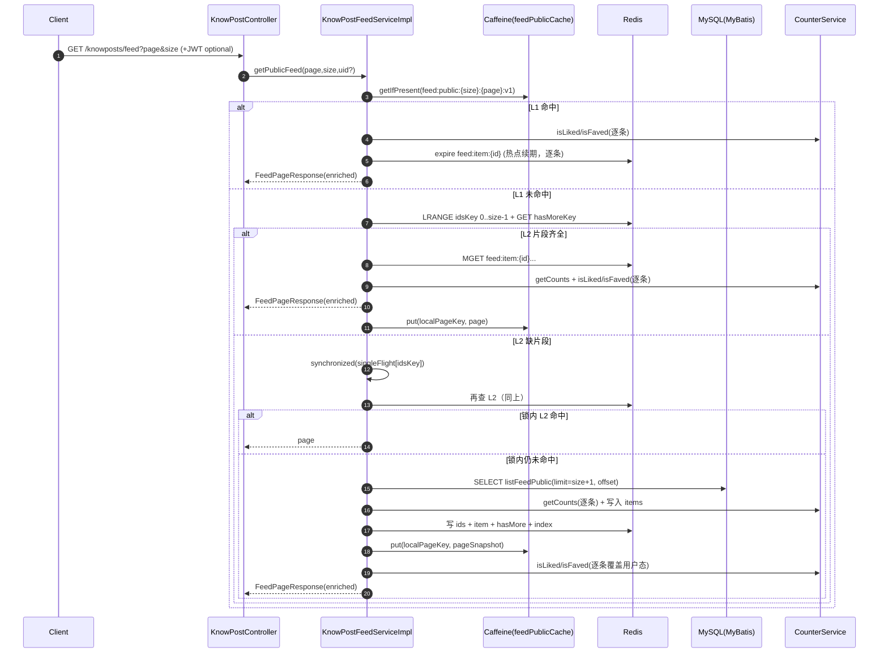

# Feed 流全链路说明与可复刻实现方案（zhiguang_be）

文档日期：2026-03-05  
仓库：`https://github.com/G-Pegasus/zhiguang_be`  
分析基准 commit：`23f4343ec030be0ea700db2d7107470453d96e15`  

> 目标：把该仓库里的“Feed 流（知文首页列表 + 我的已发布）”从 **HTTP 接口 → Service → 本地缓存 → Redis 片段缓存/页面缓存 → DB 回源 → 热点续期 → 计数事件旁路更新** 所有链路讲清楚，并输出一份足够详细的“可复刻实现方案”，让另一个 Codex agent 不读原代码也能复现同等行为与 Key 结构。

---

## 0. 需求理解确认（按你的规则走）

基于现有信息，我理解你的需求是：**在本地仓库 `zhiguang_be` 中，把 Feed 流完整拆开讲清楚**——包括公共首页 Feed（公开已发布内容）和“我的已发布”列表两条读链路，以及它们背后的缓存结构、回源策略、热点 TTL 延长、计数变更的旁路更新；并为每条链路给出 Mermaid 流程图；最后给出一份可以让另一个 Codex agent 复刻的实现方案（接口契约、Redis Key 约定、TTL、伪代码、验收用例）。

---

## 1. 结论（Linus 三选一）

✅ **值得做**：这套 Feed 在“读链路”里塞了多个工程化手段（三级缓存、片段缓存、软 hasMore、single-flight、防雪崩抖动、热点 TTL 延长、计数事件旁路更新），如果不把数据结构与边界条件写出来，复刻者会踩一堆隐形坑。

---

## 2. 范围与术语（先把名词说人话）

### 2.1 本文覆盖的 Feed 是什么

本仓库的 Feed 主要指知文（KnowPost）的两条列表：

1) **公共首页 Feed**：所有用户都能看（匿名也能看），内容条件为：`status = published` 且 `visible = public`  
2) **我的已发布**：只看当前用户自己发的已发布内容：`creator_id = me` 且 `status = published`

注意：**这不是“关注流/好友流”**，不按关注关系做个性化排序；它是一个“公开广场流 + 我的发布”。

### 2.2 权威数据 vs 缓存

- 权威内容元数据：MySQL `know_posts` + `users`（JOIN 作者信息）
- 权威计数：Redis（Counter 系统 SDS/bitmap），通过 `CounterService.getCounts/isLiked/isFaved` 读取
- Feed 缓存：Caffeine（进程内）+ Redis（片段/页面）

---

## 3. 代码地图（追链路只看这些文件）

### 3.1 HTTP 入口

- Feed 接口：`src/main/java/com/tongji/knowpost/api/KnowPostController.java`
  - `GET /api/v1/knowposts/feed`
  - `GET /api/v1/knowposts/mine`

### 3.2 Feed 核心实现

- `src/main/java/com/tongji/knowpost/service/impl/KnowPostFeedServiceImpl.java`
  - 公共 Feed：`getPublicFeed`
  - 我的已发布：`getMyPublished`
  - 片段缓存组装：`assembleFromCache`
  - 片段缓存写入：`writeCaches`
  - 用户态覆盖：`enrich`

### 3.3 热点探测（TTL 动态延长）

- `src/main/java/com/tongji/cache/hotkey/HotKeyDetector.java`
- `src/main/java/com/tongji/cache/config/CacheProperties.java`
- `src/main/java/com/tongji/cache/config/CacheConfig.java`

### 3.4 计数事件旁路更新（点赞/收藏导致 Feed 页缓存计数更新）

- `src/main/java/com/tongji/knowpost/listener/FeedCacheInvalidationListener.java`
- 计数事件模型：`src/main/java/com/tongji/counter/event/CounterEvent.java`
- 计数读写接口：`src/main/java/com/tongji/counter/service/CounterService.java`

### 3.5 DB 查询（MyBatis）

- Mapper 接口：`src/main/java/com/tongji/knowpost/mapper/KnowPostMapper.java`
- SQL：`src/main/resources/mapper/KnowPostMapper.xml`
- 行模型：`src/main/java/com/tongji/knowpost/model/KnowPostFeedRow.java`

---

## 4. 对外接口契约（HTTP 层）

### 4.1 公共首页 Feed

- 方法：`GET`
- 路径：`/api/v1/knowposts/feed`
- Query：
  - `page`：页码（默认 1，最小 1）
  - `size`：每页条数（默认 20，范围 1~50）
- 认证：
  - 可匿名（不带 JWT 也能返回）
  - 若带 JWT，会额外计算 `liked/faved`
- Response：`FeedPageResponse`

### 4.2 我的已发布

- 方法：`GET`
- 路径：`/api/v1/knowposts/mine`
- Query：同上
- 认证：必须带 JWT（否则无法获取 userId）
- Response：`FeedPageResponse`（条目会带 `isTop`）

### 4.3 FeedPageResponse / FeedItemResponse 结构

代码：  
`src/main/java/com/tongji/knowpost/api/dto/FeedPageResponse.java`  
`src/main/java/com/tongji/knowpost/api/dto/FeedItemResponse.java`

```json
{
  "items": [
    {
      "id": "262804640385601536",
      "title": "标题",
      "description": "摘要",
      "coverImage": "https://cdn/xxx.png",
      "tags": ["java","并发"],
      "authorAvatar": "https://cdn/a.png",
      "authorNickname": "张三",
      "tagJson": "{\"领域\":\"AI\"}",
      "likeCount": 128,
      "favoriteCount": 67,
      "liked": true,
      "faved": false,
      "isTop": null
    }
  ],
  "page": 1,
  "size": 20,
  "hasMore": true
}
```

字段语义：
- `likeCount/favoriteCount`：来自 Counter 系统（权威在 Redis）
- `liked/faved`：用户维度状态（实时读 bitmap），**不能写入公共共享缓存**
- `isTop`：
  - 公共 Feed：通常为 `null`（服务端不在公共流里返回置顶状态）
  - 我的已发布：返回 `true/false`

---

## 5. 数据结构（DB + Redis Key，一次列清楚）

### 5.1 MySQL 表（Feed 读取需要的最小字段）

来自 `db/schema.sql`（开源版有）。

`know_posts`（关键字段）：
- `id`（雪花 ID）
- `creator_id`
- `status`：`draft|published|deleted...`
- `visible`：`public|...`
- `title/description`
- `tags`（JSON 数组）
- `img_urls`（JSON 数组）
- `publish_time`
- `is_top`

`users`（作者字段）：
- `id`
- `avatar`
- `nickname`
- `tags_json`

### 5.2 Redis Key 约定（复刻必须一致）

#### A) 公共 Feed（只做“片段缓存”，不写 Redis 整页）

| 目的 | Key 模板 | 类型 | TTL | 写入者 | 读取者 |
|---|---|---|---|---|---|
| 本地页缓存 key（同时作为“页面标识”写入反向索引） | `feed:public:{size}:{page}:v{LAYOUT_VER}` | -（Caffeine key） | 15s（本地） | `getPublicFeed` | `getPublicFeed` |
| ID 列表片段 | `feed:public:ids:{size}:{hourSlot}:{page}` | List | `60~89s` | `writeCaches` | `assembleFromCache` |
| hasMore 软缓存 | `feed:public:ids:{size}:{hourSlot}:{page}:hasMore` | String(`0/1`) | `10s` 或 `10~20s` | `writeCaches` | `assembleFromCache` |
| 内容条目片段（JSON） | `feed:item:{id}` | String(JSON) | `60~89s`（可被热键延长） | `writeCaches` | `assembleFromCache` |
| 反向索引：内容 → 页面集合（按小时分段） | `feed:public:index:{id}:{hourSlot}` | Set(pageKey) | `60~89s` | `writeCaches` | `FeedCacheInvalidationListener` |
| 页面集合（当前实现仅写入，不消费） | `feed:public:pages` | Set(pageKey) | 无 | `writeCaches` | （暂无） |

解释：
- `hourSlot = System.currentTimeMillis() / 3600000`（以“小时”为片段维度）
- 公共 Feed **没有** Redis “整页 JSON 缓存”，只靠 `ids + item` 组装

#### B) 我的已发布（写 Redis 整页）

| 目的 | Key 模板 | 类型 | TTL | 写入者 | 读取者 |
|---|---|---|---|---|---|
| 我的发布整页 JSON | `feed:mine:{userId}:{size}:{page}` | String(JSON) | `30~49s`（可被热键延长） | `getMyPublished` | `getMyPublished` |
| 本地页缓存 | 同上（key 相同） | -（Caffeine key） | 10s（本地） | `getMyPublished` | `getMyPublished` |

#### C) 热键统计（只在内存，不在 Redis）

`HotKeyDetector` 用 `ConcurrentHashMap<String,int[]>` 存滑窗计数，不依赖 Redis。  
Feed 里使用的热键 key：
- 内容热键：`knowpost:{id}`
- mine 页热键：直接用页面 key（`feed:mine:...`）

---

## 6. 链路 1：公共 Feed 读链路（L1 → L2 → Single-Flight → DB）

入口：`KnowPostFeedServiceImpl.getPublicFeed(page,size,currentUserIdNullable)`

### 6.1 时序概览（Mermaid）



### 6.2 逐步拆解（你要复刻就照这个顺序写）

#### Step 1：参数收敛

- `safeSize = clamp(size, 1..50)`
- `safePage = max(page, 1)`

#### Step 2：生成缓存 key

```text
localPageKey = "feed:public:{safeSize}:{safePage}:v{LAYOUT_VER}"
hourSlot     = nowMillis / 3600000
idsKey       = "feed:public:ids:{safeSize}:{hourSlot}:{safePage}"
hasMoreKey   = idsKey + ":hasMore"
```

#### Step 3：L1 本地缓存命中（Caffeine）

命中条件：`feedPublicCache.getIfPresent(localPageKey)` 返回 `FeedPageResponse` 且 `items != null`

命中后做两件事：
1) **热点记录 + 续期**：对页面里每个 item 调 `recordItemHotKey(item.id())`（只续期 `feed:item:{id}`）  
2) **用户态覆盖**：对返回 items 执行 `enrich(items, uid)`（逐条计算 `liked/faved`）

注意：
- L1 命中不会刷新 `likeCount/favoriteCount`（所以可能短时间内计数略旧，靠 TTL 与旁路更新修正）

#### Step 4：L2 Redis 片段命中（assembleFromCache）

L2 命中条件很苛刻：**ids 列表存在且 item JSON 全部存在**，否则直接返回 `null`，触发 DB 回源。

组装逻辑：
1) `LRANGE idsKey 0..size-1`
2) `MGET feed:item:{id}...`（缺任何一个即视为 miss）
3) 反序列化 item JSON 得到“基础条目”
4) 对每条目：
   - `CounterService.getCounts("knowpost", id, ["like","fav"])` 刷新计数
   - `CounterService.isLiked/isFaved` 计算用户态（uid 为空则返回 false）
5) `hasMore`：
   - 优先读 `hasMoreKey`（`"1"`/`"0"`）
   - 缺失则用 `idList.size == size` 兜底

#### Step 5：Single-Flight（同一页并发只允许一个回源）

锁粒度：`idsKey`（包含 hourSlot，所以跨小时自动换锁）

```text
lock = singleFlight.computeIfAbsent(idsKey, new Object())
synchronized(lock) {
  again = assembleFromCache(...)
  if hit -> return again
  else -> DB 回源 -> 写缓存 -> return
}
finally: singleFlight.remove(idsKey)
```

注意：
- 这是**进程内** single-flight；多实例部署时不同实例之间不互斥（本仓库没做分布式锁）

#### Step 6：DB 回源（MyBatis）

SQL：`KnowPostMapper.listFeedPublic(limit, offset)`

实现细节：
- 用 `limit = size + 1` 多读 1 条判断 `hasMore`
- `hasMore = rows.size > size`，然后裁剪到 `size`
- 组装 items 时传 `userIdNullable = null`，避免把某个用户的 liked/faved 写进共享缓存
- 片段缓存 TTL：`60 + random(0..29)` 秒（防雪崩抖动）

---

## 7. 链路 2：公共 Feed 缓存写入链路（writeCaches）

入口：`KnowPostFeedServiceImpl.writeCaches(pageKey, idsKey, hasMoreKey, ...)`

### 7.1 流程图

```mermaid
flowchart TD
  A[DB rows & items] --> B[构造 idVals = rows.id 顺序列表]
  B --> C[LPUSH idsKey idVals...]
  C --> D[EXPIRE idsKey frTtl(60~89s)]
  B --> E[写 hasMoreKey: '1'/'0']
  E --> F[EXPIRE hasMoreKey 10s 或 10~20s]
  A --> G[feed:public:pages SADD pageKey]
  A --> H{for each item}
  H --> I[构造 idxKey = feed:public:index:{id}:{hourSlot}]
  I --> J[SADD idxKey pageKey]
  J --> K[EXPIRE idxKey frTtl]
  H --> L[SET feed:item:{id} itemJson EX frTtl]
```

### 7.2 关键细节（复刻时别“自作聪明”）

1) `idsKey` 写入用的是 `leftPushAll`（等价 Redis `LPUSH` 多值）  
   - Redis 的 `LPUSH key a b c` 会得到 `c b a`，也就是说**可能发生顺序反转**  
   - 复刻要么严格照原实现（保留反转行为），要么改成 `RPUSH` 并同时改读端验证（但那就不是“等价复刻”）

2) `hasMoreKey` 是“软缓存”：
   - 只有在“满页且 hasMore=true”时才给更长一点的 TTL（10~20s）
   - 否则统一 10s
   - 目的：减少“是否有下一页”的频繁回源，但又不希望这个标志长期错误

3) `feed:public:pages` 当前实现只写不读：  
   - 如果你复刻并准备上生产，建议要么加 TTL/清理任务，要么删掉它，别让它无限增长。

---

## 8. 链路 3：热点探测与 TTL 动态延长

### 8.1 HotKeyDetector 的工作方式（人话版）

`HotKeyDetector` 做的是“近 60 秒访问次数”统计：
- 把 60 秒窗口切成 6 段（每段 10 秒）
- 每次访问某个 key，就把当前段计数 +1
- 每 10 秒 rotate 一次，进入下一段并把新段清零
- 总热度 = 6 段求和

热度分级阈值（默认值，见 `CacheProperties`）：
- LOW：>= 50
- MEDIUM：>= 200
- HIGH：>= 500

TTL 扩展（默认值）：
- LOW：+20s
- MEDIUM：+60s
- HIGH：+120s

### 8.2 公共 Feed 的热点续期（recordItemHotKey）

触发点：公共 Feed 返回时（无论来自 L1/L2/DB），都会对每个 item 调一次 `recordItemHotKey(id)`

行为：
1) 热键统计：`hotKey.record("knowpost:{id}")`
2) 计算目标 TTL：`target = 60 + extend(level)`
3) 仅延长 `feed:item:{id}` 的 TTL：如果当前 TTL < target，则 `EXPIRE` 到 target

⚠️ 现实影响：只延长 `feed:item:{id}`，**不会延长 `idsKey`**。  
所以如果 `idsKey` 过期，你仍然无法用片段缓存组装页面（会回源 DB）。

### 8.3 详情页也会延长 feed:item TTL（跨链路影响）

`KnowPostServiceImpl.getDetail` 中的 `recordHotKeyAndExtendTtl` 会同时延长：
- `knowpost:detail:{id}:v{ver}`（详情整页缓存）
- `feed:item:{id}`（Feed item 片段）

也就是说：**内容详情如果很热，会间接让 Feed item 片段更耐活**。

---

## 9. 链路 4：计数变更旁路更新（CounterEvent → FeedCacheInvalidationListener）

### 9.1 为什么需要旁路更新

公共 Feed 的 L1 本地缓存命中时：
- 会实时计算 `liked/faved`
- 但不会刷新 `likeCount/favoriteCount`

所以当用户在短时间内频繁点赞/收藏时，页面上的计数可能在 15 秒 TTL 内“看起来没变”。  
旁路更新就是用事件把本地缓存里的计数“顺手补一下”。

### 9.2 事件来源（CounterServiceImpl）

点赞/收藏发生状态变化时（幂等成功），`CounterServiceImpl.toggle(...)` 会：
1) 发送 Kafka：`counter-events`
2) 发布本地 Spring 事件：`eventPublisher.publishEvent(CounterEvent...)`

`FeedCacheInvalidationListener` 用 `@EventListener` 监听本地事件（更快）。

### 9.3 监听器具体做了什么

入口：`FeedCacheInvalidationListener.onCounterChanged(CounterEvent event)`

流程图：

```mermaid
flowchart TD
  A[CounterEvent(entityType=knowpost, metric=like/fav, delta)] --> B{过滤 entityType/metric}
  B -->|非 knowpost 或 非 like/fav| X[ignore]
  B --> C[DB: KnowPostMapper.findById(eid)]
  C --> D[UserCounterService: 作者获赞/获藏 +delta]
  B --> E[hourSlot = now/1h]
  E --> F[pages = SMEMBERS index:eid:hourSlot ∪ index:eid:hourSlot-1]
  F --> G{for each pageKey}
  G --> H[L1: if feedPublicCache has pageKey -> adjust like/fav]
  G --> I[Redis: GET pageKey]
  I -->|命中| J[更新 JSON 并保持 TTL]
  I -->|未命中| K[SREM index:eid:hourSlot pageKey]
```

注意两点很关键（复刻必须照做，哪怕你觉得它怪）：
1) **它依赖反向索引**：`feed:public:index:{eid}:{hourSlot}` 里存了“这个内容出现在过哪些页面 key 里”。  
2) 它尝试更新 Redis “整页 JSON”（key=pageKey），但公共 Feed 当前实现**不写 Redis 整页**。  
   - 结果：`GET pageKey` 大概率拿不到，于是走 `SREM` 把 pageKey 从 index set 移除。  
   - 这意味着：索引会被事件逐步清理掉（更多像“清噪”而不是长期维护）。

---

## 10. 链路 5：我的已发布读链路（本地 → Redis 整页 → DB）

入口：`KnowPostFeedServiceImpl.getMyPublished(userId,page,size)`

### 10.1 流程图

```mermaid
flowchart TD
  A[GET /knowposts/mine (JWT required)] --> B[key=feed:mine:{uid}:{size}:{page}]
  B --> C{L1: Caffeine 命中?}
  C -->|Yes| D[hotKey.record(key) + maybeExtendTtlMine]
  D --> E[return local page]
  C -->|No| F{Redis GET key 命中?}
  F -->|Yes| G[JSON -> FeedPageResponse]
  G --> H{items counts 完整?}
  H -->|Yes| I[put local + hotKey.record + maybeExtendTtlMine]
  I --> J[enrich(items, uid) 覆盖 liked/faved]
  J --> K[return]
  H -->|No / 解析失败| L[DB 回源 listMyPublished(limit=size+1, offset)]
  F -->|No| L
  L --> M[mapRowsToItems(rows, uid, includeIsTop=true)]
  M --> N[Redis SET key TTL 30~49s + 本地 put + hotKey.record]
  N --> O[return]
```

### 10.2 关键细节

- mine Feed 的 key **包含 userId**，所以写 Redis 整页不会污染其他用户
- Redis TTL 更短（30~49s），但热点访问会通过 `HotKeyDetector` 把 TTL 延长（最多 +120s）
- mine 命中 Redis 时只做 `enrich` 覆盖用户态，不刷新计数（计数是否“秒级最终一致”由 Counter 系统负责）

---

## 11. 可复刻实现方案（另一个 Codex agent 照这个做就能复现）

> 本节不是“讲道理”，是“按步骤交付可跑系统”。你照做就行。

### 11.1 技术栈与依赖（最小集合）

- Java 21
- Spring Boot 3（Web + Validation + Security 可选）
- MyBatis
- MySQL 8
- Redis（String/List/Set + TTL）
- Caffeine
- Jackson
- （可选但建议）Kafka：因为 Counter 系统里有事件聚合；但 Feed 旁路更新只依赖本地事件也能跑

### 11.2 DB 设计（必须有的表与索引）

直接复用 `db/schema.sql` 中的：
- `users`
- `know_posts`

要求：
- `know_posts` 至少要有 `status/visible/publish_time/creator_id/is_top/tags/img_urls`
- 索引至少要覆盖：
  - `(status, publish_time)` 或 `(status, visible, publish_time)`（公共流排序）
  - `(creator_id, status, publish_time)`（我的发布）

### 11.3 MyBatis Mapper（必须等价）

接口：
- `listFeedPublic(limit, offset)`
- `listMyPublished(creatorId, limit, offset)`

SQL（等价于本仓库）：
- 公共 Feed：`WHERE status='published' AND visible='public' ORDER BY publish_time DESC LIMIT ? OFFSET ?`
  - 备注：XML 注释说“置顶优先”，但实际 SQL 没有 `ORDER BY is_top DESC`；以 SQL 为准。
- 我的发布：`WHERE creator_id=? AND status='published' ORDER BY is_top DESC, publish_time DESC LIMIT ? OFFSET ?`

### 11.4 DTO 结构（接口契约必须一致）

按 record 定义：
- `FeedItemResponse`
- `FeedPageResponse`

### 11.5 CacheProperties + Caffeine 配置

实现：
- `CacheProperties`（默认值见代码）
  - 公共页本地 TTL：15s，maxSize 1000
  - mine 页本地 TTL：10s，maxSize 1000
  - hotkey：window=60s, segment=10s, 阈值与 extendSeconds 见默认值
- `CacheConfig` 提供 `feedPublicCache`、`feedMineCache`

### 11.6 HotKeyDetector（必须是滑窗分段）

必须有：
- `record(key)`
- `ttlForPublic(baseTtl, key)`
- `ttlForMine(baseTtl, key)`
- `rotate()` 定时清段（按 `segmentSeconds`）

### 11.7 FeedService 伪代码（核心：别写错 key 和 TTL）

#### A) 公共 Feed

```text
function getPublicFeed(page,size,uid?):
  safePage = max(page,1)
  safeSize = clamp(size,1..50)

  pageKey  = "feed:public:{safeSize}:{safePage}:v1"
  hourSlot = nowMillis / 3600000
  idsKey   = "feed:public:ids:{safeSize}:{hourSlot}:{safePage}"
  moreKey  = idsKey + ":hasMore"

  # L1 local
  local = caffeine.get(pageKey)
  if local exists:
    for item in local.items: recordItemHotKey(item.id)
    return page(local.items.enrich(uid), local.hasMore)

  # L2 fragments
  fromCache = assembleFromCache(idsKey, moreKey, safePage, safeSize, uid)
  if fromCache exists:
    caffeine.put(pageKey, fromCache)
    for item in fromCache.items: recordItemHotKey(item.id)
    return fromCache

  # single-flight by idsKey
  lock = map.computeIfAbsent(idsKey, new Object())
  synchronized(lock):
    again = assembleFromCache(...)
    if again exists:
      caffeine.put(pageKey, again)
      return again

    rows = DB.listFeedPublic(limit=safeSize+1, offset=(safePage-1)*safeSize)
    hasMore = len(rows) > safeSize
    rows = rows.take(safeSize)

    itemsForCache = mapRowsToItems(rows, uid=null, includeIsTop=false)
    snapshot = page(itemsForCache, hasMore)

    frTtl = seconds(60 + rand(0..29))
    writeCaches(pageKey, idsKey, moreKey, safeSize, rows, itemsForCache, hasMore, frTtl)
    caffeine.put(pageKey, snapshot)

    return page(itemsForCache.enrich(uid), hasMore)
  finally:
    map.remove(idsKey)
```

#### B) assembleFromCache（必须是“缺一个就算 miss”）

```text
function assembleFromCache(idsKey, moreKey, page, size, uid?):
  ids = LRANGE(idsKey, 0, size-1)
  if ids empty: return null

  itemKeys = ids.map(id => "feed:item:" + id)
  itemJsons = MGET(itemKeys)
  if any json missing: return null

  baseItems = itemJsons.map(json => jsonToFeedItem(json))
  enriched = []
  for base in baseItems:
    counts = Counter.getCounts("knowpost", base.id, ["like","fav"])
    liked  = uid != null && Counter.isLiked("knowpost", base.id, uid)
    faved  = uid != null && Counter.isFaved("knowpost", base.id, uid)
    enriched.add(base.withCounts(counts).withUserFlags(liked,faved))

  moreStr = GET(moreKey)
  hasMore = moreStr != null ? (moreStr=="1") : (len(ids)==size)
  return page(enriched, page, size, hasMore)
```

#### C) writeCaches（Key、TTL、索引一致）

```text
function writeCaches(pageKey, idsKey, moreKey, size, rows, items, hasMore, frTtl):
  idVals = rows.map(r => str(r.id))
  if idVals not empty:
    LPUSH(idsKey, idVals...)    # 注意：可能反转顺序
    EXPIRE(idsKey, frTtl)
    if len(idVals)==size && hasMore:
      SET(moreKey,"1", ttl=10+rand(0..10))
    else:
      SET(moreKey, hasMore?"1":"0", ttl=10)

  SADD("feed:public:pages", pageKey)

  hourSlot = nowMillis / 3600000
  for item in items:
    idxKey = "feed:public:index:{item.id}:{hourSlot}"
    SADD(idxKey, pageKey)
    EXPIRE(idxKey, frTtl)

    SET("feed:item:{item.id}", json(item), EX=frTtl)
```

#### D) mine Feed

```text
function getMyPublished(uid,page,size):
  key = "feed:mine:{uid}:{size}:{page}"

  local = caffeineMine.get(key)
  if local exists:
    hotKey.record(key); maybeExtendMine(key)
    return local

  cached = GET(key)
  if cached exists and json OK and countsComplete:
    caffeineMine.put(key, cached)
    hotKey.record(key); maybeExtendMine(key)
    return page(cached.items.enrich(uid), cached.hasMore)

  rows = DB.listMyPublished(uid, limit=size+1, offset=(page-1)*size)
  hasMore = len(rows) > size
  rows = rows.take(size)

  items = mapRowsToItems(rows, uid, includeIsTop=true)
  resp = page(items, hasMore)
  SET(key, json(resp), EX=30+rand(0..19))
  caffeineMine.put(key, resp)
  hotKey.record(key)
  return resp
```

### 11.8 旁路更新监听器（可选但“全链路”必须做）

把 `CounterEvent` 监听起来，按本仓库逻辑实现：
- `entityType == "knowpost" && metric in ("like","fav")` 才处理
- 先更新作者维度计数（`UserCounterService.incrementLikesReceived/FavsReceived`）
- 再用反向索引 set 找到页面 key，更新本地缓存里的 `likeCount/favoriteCount`

### 11.9 必要配置（开源版 application.yml 为空，复刻必须补）

你至少要提供：
- `spring.datasource.*`（MySQL）
- `spring.data.redis.*`（Redis）
- `cache.*`（可不配，走默认值）

示例（只列关键项）：

```yaml
spring:
  datasource:
    url: jdbc:mysql://127.0.0.1:3306/zhiguang?useUnicode=true&characterEncoding=utf8&serverTimezone=Asia/Shanghai
    username: root
    password: root
  data:
    redis:
      host: 127.0.0.1
      port: 6379

cache:
  l2:
    public-cfg:
      ttl-seconds: 15
      max-size: 1000
    mine-cfg:
      ttl-seconds: 10
      max-size: 1000
  hotkey:
    window-seconds: 60
    segment-seconds: 10
    level-low: 50
    level-medium: 200
    level-high: 500
    extend-low-seconds: 20
    extend-medium-seconds: 60
    extend-high-seconds: 120
```

---

## 12. 验收清单（复刻后最小可验证）

1) 公共 Feed 基本分页：
- `GET /knowposts/feed?page=1&size=20` 返回 `page=1,size=20`
- 当 DB 实际有 >20 条 published+public 内容时，`hasMore=true`

2) 缓存命中路径：
- 第一次请求：日志里应出现 `source=db`（或你自己的标记），并写入 `idsKey/itemKey`
- 第二次同页请求：在 `idsKey` TTL 内应走 L2 组装（不触发 DB）
- 第三次在 15s 内多次访问：应走 L1（不触发 Redis LRANGE/MGET）

3) single-flight：
- 同一实例上并发打同一页（例如 100 并发）：理论上只有 1 次 DB 查询，其余在锁内复用缓存结果

4) mine Feed：
- 发布过内容的用户访问 `/mine` 能看到自己的列表，且条目包含 `isTop`
- 缓存 key `feed:mine:{uid}:{size}:{page}` 存在且 TTL 在 30~49s（或被热点延长）

5) 热点续期：
- 高频访问同一个内容 ID 后，`feed:item:{id}` 的 TTL 会被延长到 `60 + extend(level)`（最多 +120）

6) 计数旁路更新（如果你复刻了监听器）：
- 对某个 `knowpost` 点赞后，短时间内公共 Feed L1 缓存里该条目的 `likeCount` 会 +1（无需等待 15s TTL）

---

## 13. 已知“坑点/怪点”（你复刻前先看）

1) 公共 Feed 的 SQL 注释与实现不一致  
`KnowPostMapper.xml` 注释说“置顶优先”，但公共流实际 `ORDER BY publish_time DESC`（不含 is_top）。

2) `LPUSH` 可能导致 ids 顺序反转  
如果你线上发现“第一次 DB 回源顺序正确，第二次走缓存顺序反了”，基本就是这个。

3) 公共流不写 Redis 整页，但监听器仍尝试更新它  
这会导致 index set 在事件触发时被 `SREM` 清掉。当前实现更像“短期旁路”而不是长期一致性维护。

4) assembleFromCache 是“缺一片就全 miss”  
只要某个 `feed:item:{id}` 丢了，整页直接 DB 回源；这在高并发下对 DB 压力很敏感。

5) 计数读取没有批量  
每页每条都会调用 `getCounts`，没有用 `getCountsBatch`。复刻要保持一致（除非你准备优化并改验收）。

