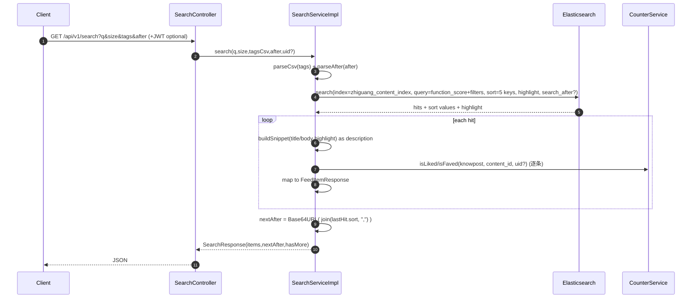
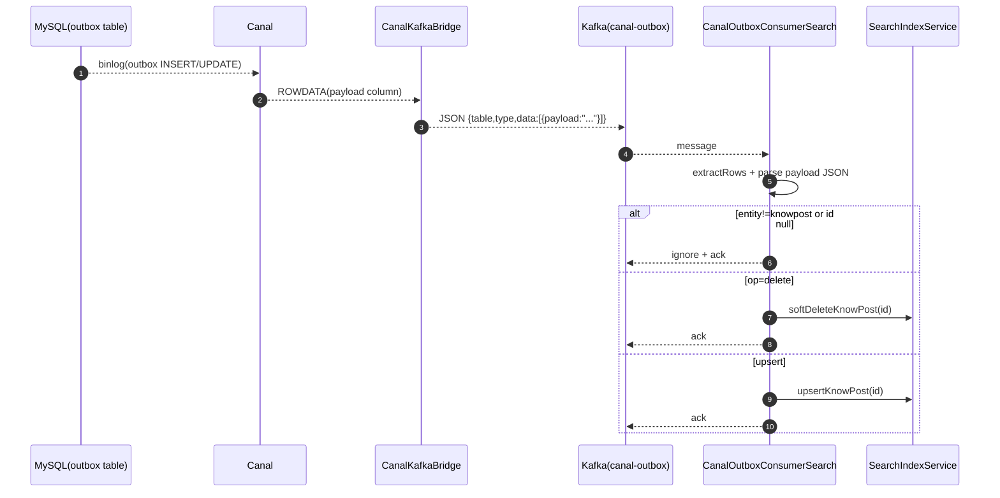

# 搜索系统全链路说明与可复刻实现方案（zhiguang_be）

文档日期：2026-03-05  
仓库：`https://github.com/G-Pegasus/zhiguang_be`  
分析基准 commit：`23f4343ec030be0ea700db2d7107470453d96e15`  

> 目标：把该仓库里的“搜索系统”从 **HTTP 接口 → Search Service → Elasticsearch Query → search_after 游标 → 高亮片段 → 返回结构** 全链路讲清楚，并补全 **索引初始化/回灌/增量更新** 的写入链路说明；最后输出一份足够细的“可复刻实现方案”，让另一个 Codex agent 不读原代码也能复现同等行为与数据结构。

---

## 0. 需求理解确认（按你的规则走）

基于现有信息，我理解你的需求是：**在本地仓库 `zhiguang_be` 中，把“搜索系统”完整拆开讲清楚**——包含：

1) 关键词检索 `/api/v1/search` 的完整读链路与游标分页（search_after）  
2) 联想建议 `/api/v1/search/suggest`（Completion Suggester）  
3) ES 索引初始化（Mapping/IK 分词）  
4) 启动回灌（当索引为空时从 MySQL 回填）  
5) 预留的增量写入链路（Outbox→Canal→Kafka→消费者→ES upsert/软删）  

并给出每条链路的流程图（Mermaid），以及可复刻实现清单（字段、索引、配置、伪代码、验收用例）。

---

## 1. 结论（Linus 三选一）

✅ **值得做**：搜索系统“看起来只是查 ES”，但它实际包含：
- 排序策略与 search_after 游标编码（最容易复刻错）
- function_score 加权（BM25 + 互动指标）
- 高亮 snippet 合并
- 索引 Mapping/IK 分词要求
- 回灌与（预留）增量索引链路

这些不写清楚，别人复刻出来的搜索行为会“能用但不一样”。

---

## 2. 范围与术语（先把名词说人话）

### 2.1 搜索系统搜的是什么

当前搜索索引是“内容统一索引”，但实际写入的是 **KnowPost（知文）**：
- 文档 ID：`knowpost.id`
- 检索字段：`title` + `body`
- 展示字段：作者信息、tags、图片、描述（或高亮 snippet）、like/fav 计数

### 2.2 相关性、加权与排序是什么关系

本仓库的排序是“复合排序”：
1) `_score`（BM25 相关性）  
2) `publish_time`（新内容优先）  
3) `like_count`（点赞更多优先）  
4) `view_count`（浏览更多优先，但当前实现写入恒为 0）  
5) `content_id`（稳定排序，防止同分抖动）  

加权使用 `function_score`：把 `like_count`/`view_count` 用 `log1p` 变换后加到 `_score` 上（boostMode=sum）。

### 2.3 游标分页（search_after）是什么

传统分页（from+size）深分页会很慢、也不稳定；`search_after` 的做法是：
- 让客户端带上“上一页最后一条命中的 sort 值数组”
- 下一页从这个 sort 值之后继续查

本仓库把这个 sort 值数组编码成一个 `after` 字符串（Base64URL）。

---

## 3. 代码地图（追链路只看这些文件）

### 3.1 HTTP 入口

- `src/main/java/com/tongji/search/api/SearchController.java`
  - `GET /api/v1/search`
  - `GET /api/v1/search/suggest`

### 3.2 搜索读链路（ES Query + search_after + 高亮）

- `src/main/java/com/tongji/search/service/impl/SearchServiceImpl.java`
- `src/main/java/com/tongji/search/api/dto/SearchResponse.java`
- `src/main/java/com/tongji/search/api/dto/SuggestResponse.java`

### 3.3 ES 客户端配置

- `src/main/java/com/tongji/config/ElasticsearchConfig.java`
- `src/main/java/com/tongji/config/EsProperties.java`
- Maven 依赖：`pom.xml`（`co.elastic.clients:elasticsearch-java` + `elasticsearch-rest-client`）

### 3.4 索引初始化 / 写入 / 回灌

- `src/main/java/com/tongji/search/index/SearchIndexInitializer.java`（启动确保索引存在）
- `src/main/java/com/tongji/search/index/SearchIndexService.java`（upsert/软删/启动回灌）

### 3.5 预留增量链路（Outbox→Canal→Kafka）

- `src/main/java/com/tongji/search/outbox/CanalOutboxConsumerSearch.java`
- Outbox JSON 解析：`src/main/java/com/tongji/common/util/OutboxMessageUtil.java`
- Canal→Kafka 桥：`src/main/java/com/tongji/relation/outbox/CanalKafkaBridge.java`
- Topic 常量：`src/main/java/com/tongji/relation/outbox/OutboxTopics.java`

### 3.6 依赖的业务模块（用于 liked/faved 与计数）

- `src/main/java/com/tongji/counter/service/CounterService.java`

---

## 4. 对外接口契约（HTTP 层）

### 4.1 关键词检索

- 方法：`GET`
- 路径：`/api/v1/search`
- Query：
  - `q`（必填）：关键词
  - `size`（可选，默认 20，最小 1）
  - `tags`（可选）：标签过滤，逗号分隔，如 `tags=java,并发`
  - `after`（可选）：游标（Base64URL）
- 认证：
  - 可匿名（不带 JWT 也能搜）
  - 带 JWT 时，会对每条结果计算 `liked/faved`

Response：`SearchResponse`
```json
{
  "items": [ /* FeedItemResponse[] */ ],
  "nextAfter": "Base64URL",
  "hasMore": true
}
```

说明：
- `items` 复用 `FeedItemResponse`（和 Feed 返回结构一致）
- `nextAfter`：下一页游标；无更多或无法生成则为 `null`
- `hasMore`：当前实现为 **启发式**（`items.size() >= size`），不保证 100% 准确

### 4.2 联想建议（Completion）

- 方法：`GET`
- 路径：`/api/v1/search/suggest`
- Query：
  - `prefix`（必填）：前缀
  - `size`（可选，默认 10，最小 1）

Response：`SuggestResponse`
```json
{
  "items": ["标题1", "标题2"]
}
```

---

## 5. Elasticsearch 数据结构（索引名、Mapping、关键字段）

### 5.1 索引名

写死常量（不是配置项）：
- `zhiguang_content_index`

来源：
- `SearchServiceImpl.INDEX`
- `SearchIndexInitializer.INDEX`
- `SearchIndexService.INDEX`

### 5.2 Mapping（启动时创建）

代码：`SearchIndexInitializer.ensureIndex()`

> 注意：`title/body/description` 使用 IK 分词器，需要 ES 安装 `analysis-ik` 插件；否则创建索引会失败（当前实现会吞异常并继续启动）。

字段（按实际 Mapping）：

| 字段 | 类型 | 说明 |
|---|---|---|
| `content_id` | long | 内容 ID（KnowPost.id） |
| `content_type` | keyword | 内容类型（如 image_text） |
| `title` | text(ik_max_word, search=ik_smart) | 标题（主召回字段，权重更高） |
| `body` | text(ik_max_word) | 正文（从 contentUrl 拉取并截断） |
| `description` | text(ik_max_word) | 描述（高亮缺失时的兜底展示） |
| `tags` | keyword | 标签数组 |
| `author_id` | long | 作者 ID |
| `author_avatar` | keyword | 作者头像 |
| `author_nickname` | keyword | 作者昵称 |
| `author_tag_json` | keyword | 作者领域标签 JSON |
| `publish_time` | date | 发布时间（写入 epoch millis） |
| `like_count` | integer | 点赞数（索引时写入，可能会滞后） |
| `favorite_count` | integer | 收藏数（索引时写入，可能会滞后） |
| `view_count` | integer | 浏览数（当前实现写入恒为 0） |
| `status` | keyword | 内容状态（search 只查 published） |
| `img_urls` | keyword | 图片 URL 数组 |
| `is_top` | keyword | 是否置顶（Mapping 是 keyword，但写入是 Boolean，存在潜在类型不一致风险） |
| `title_suggest` | completion | 联想字段（写入 title） |

---

## 6. 链路 1：关键词检索读链路（SearchController → SearchServiceImpl → ES）

入口：`SearchController.search(...)` → `SearchServiceImpl.search(...)`

### 6.1 时序图（Mermaid）



### 6.2 ES 查询的“等价描述”（复刻必须一致）

1) 召回：`multi_match`  
- query：`q`
- fields：`title^3`, `body`

2) 过滤：`bool.filter`
- `term status = published`
- `terms tags in {tags}`（当 tags 非空）

3) 加权：`function_score`
- `field_value_factor(like_count, modifier=log1p) weight=2.0`
- `field_value_factor(view_count, modifier=log1p) weight=1.0`
- `boost_mode = sum`

4) 高亮：
- `title`
- `body`

5) 排序（顺序非常关键）：
1. `_score desc`
2. `publish_time desc`
3. `like_count desc`
4. `view_count desc`
5. `content_id desc`

6) 分页：`search_after`
- 客户端带 `after` 时，服务端 decode 为 FieldValue 数组并传入 `searchAfter(afterValues)`

### 6.3 游标 after 的编码/解码协议（复刻最容易错）

编码（服务端生成 `nextAfter`）：

```text
sv = lastHit.sort()  # 与上面 5 个 sort 一一对应
parts = sv.map(fieldValueToString)
raw = join(parts, ",")
nextAfter = Base64URL_WITHOUT_PADDING(raw)
```

解码（服务端读取请求 `after`）：

```text
raw = Base64URL_DECODE(after)
parts = split(raw, ",")
FieldValue[0] = double(parts[0])   # _score
FieldValue[1] = long(parts[1])     # publish_time
FieldValue[2..] = long(parts[i])   # like/view/content_id
```

⚠️ 约束：
- 客户端必须原样回传服务端生成的 `nextAfter`，不要自己拼。
- 如果你改了排序字段顺序，就必须同时改编码/解码与验收用例。

### 6.4 结果映射规则（Hit → FeedItemResponse）

从 `_source` 取字段，并做以下拼装：
- `id = content_id`
- `description`：优先高亮 snippet（title/body 片段合并），否则用 `description` 字段
- `coverImage`：`img_urls` 的第一个元素（没有则 null）
- `likeCount/favoriteCount`：直接用 ES 文档字段（可能不是实时）
- `liked/faved`：实时调用 `CounterService.isLiked/isFaved`（用户态，不落 ES）
- `isTop`：当前实现固定 `null`

---

## 7. 链路 2：联想建议（Completion Suggester）

入口：`SearchController.suggest(...)` → `SearchServiceImpl.suggest(...)`

### 7.1 流程图

```mermaid
flowchart TD
  A[GET /api/v1/search/suggest?prefix&size] --> B[SearchServiceImpl.suggest]
  B --> C[ES search + suggest(title_suggest.completion)]
  C --> D[解析 suggest.options.text]
  D --> E[SuggestResponse(items)]
```

### 7.2 ES 请求等价描述

- suggest name：`title_suggest`
- prefix：`prefix`
- completion field：`title_suggest`
- size：`size`

返回解析：遍历 `resp.suggest()["title_suggest"][].completion().options[].text`。

---

## 8. 链路 3：索引初始化（启动确保 index + Mapping）

入口：`SearchIndexInitializer.ensureIndex()`（`@PostConstruct`）

流程图：

```mermaid
flowchart TD
  A[App start] --> B[SearchIndexInitializer.ensureIndex]
  B --> C{ES.indices.exists(index)?}
  C -->|Yes| D[return]
  C -->|No| E[ES.indices.create + mappings]
  E --> F[done]
```

注意：
- 创建索引时使用 IK 分词器：`ik_max_word / ik_smart`  
  若 ES 未安装 `analysis-ik` 插件会抛异常；当前实现吞异常并继续启动 → 可能导致后续索引写入时动态建索引/Mapping 不完整。

---

## 9. 链路 4：启动回灌（当 ES 索引为空时）

入口：`SearchIndexService.ensureBackfill()`（`@PostConstruct`）

流程图：

```mermaid
flowchart TD
  A[App start] --> B[SearchIndexService.ensureBackfill]
  B --> C[ES.count(index)]
  C -->|count>0| D[skip]
  C -->|count==0| E[分页查 MySQL listFeedPublic(limit=500, offset)]
  E --> F{rows empty?}
  F -->|Yes| G[done]
  F -->|No| H[for each row.id -> upsertKnowPost(id)]
  H --> I[offset += rows.size]
  I --> E
```

关键点：
- 回灌数据来源是 `KnowPostMapper.listFeedPublic`（只回灌 `published + public` 的内容）。
- 每条内容回灌都会 `refresh=wait_for`，回灌大量数据时会很慢（但“立即可搜”）。

---

## 10. 链路 5：预留的增量索引链路（Outbox→Canal→Kafka→Search Consumer）

### 10.1 消费者存在什么

代码：`CanalOutboxConsumerSearch`
- 监听 Kafka topic：`canal-outbox`
- 解析 outbox 行的 `payload` 字段（字符串 JSON）
- 期望 payload JSON 格式：
  - `entity`：必须为 `"knowpost"`
  - `op`：`"delete"` 表示软删；其他值按 upsert 处理
  - `id`：内容 ID

### 10.2 流程图



### 10.3 非常重要的现实问题（开源版的“链路断点/冲突”）

当前开源代码里：
1) **没有找到 knowpost 侧写 outbox 的生产者**（只看到 relation 写 outbox）。  
2) `CanalOutboxConsumer`（关系系统消费者）对每条 outbox payload 都强制反序列化为 `RelationEvent`，若混入 knowpost payload 会导致反序列化异常并且不 ack，从而阻塞整个 topic 的消费。  

所以：**这条“搜索增量索引”链路在开源代码状态下更像是预留/未接上游**。  

复刻时你有两个选择：
- **A. 等价复刻（不做增量）**：只实现“索引初始化 + 启动回灌 + 查询/联想”。这与当前代码能稳定运行的部分一致。  
- **B. 完整复刻（启用增量）**：必须先解决 outbox 多事件类型共用一个 topic 的兼容问题（例如：拆 topic/拆 outbox 表/转发完整行包含 type 字段并让消费者过滤），否则关系链路会被你搞死。

本文后面的“复刻实现方案”会把 A/B 两种都写清楚。

---

## 11. 链路 6：ES 写入（upsert/软删）

### 11.1 upsertKnowPost(id) 写入什么

入口：`SearchIndexService.upsertKnowPost(id)`

步骤：
1) DB 查询：`KnowPostMapper.findDetailById(id)`（带作者信息）
2) 构造 ES 文档字段：
   - `content_id/content_type/title/description/tags/img_urls/author_* /publish_time/status/is_top`
3) 正文 `body`：
   - 优先 `fetchContentSafe(contentUrl)` HTTP 拉取正文
   - 失败则退化为 `description`
   - 最终 `truncate(body, 4000)`
4) 计数：
   - `CounterService.getCounts("knowpost", id, ["like","fav"])`
   - 写入 `like_count/favorite_count`
   - `view_count` 写死 0
5) 补全：
   - `title_suggest = title`
6) 覆盖写入：
   - `index=zhiguang_content_index`
   - `id = String.valueOf(id)`
   - `refresh = wait_for`

### 11.2 softDeleteKnowPost(id) 做什么

入口：`SearchIndexService.softDeleteKnowPost(id)`
- 覆盖写同一个文档 ID
- 只写：
  - `content_id`
  - `status = deleted`
- `refresh = wait_for`

---

## 12. 可复刻实现方案（另一个 Codex agent 照着做）

> 这部分目标是“能复现行为”，不是“写论文”。按步骤做就行。

### 12.1 依赖与版本（最小集合）

- Java 21
- Spring Boot 3.2.x
- Elasticsearch 8/9（需兼容 `elasticsearch-java` 9.2.1；集群端版本请自行对齐）
- IK 分词插件：`analysis-ik`（必须）
- MySQL 8（存 know_posts/users）
- Redis（用于 CounterService：liked/faved 与 like/fav 计数；搜索读链路依赖它补用户态）

### 12.2 Elasticsearch 准备（复刻必须满足）

1) 安装并启用 IK 插件  
2) 确保 ES 可访问（HTTP）  
3) 确保应用能连上 ES（见 12.7 配置）

### 12.3 索引与 Mapping（两种方式）

方式 A（推荐，等价本仓库）：启动时由 `SearchIndexInitializer` 自动创建  
方式 B（手动）：用同等 Mapping 创建 `zhiguang_content_index`（字段与 analyzer 必须一致）

### 12.4 写入链路复刻（等价复刻：只回灌 + 手动触发）

实现：
- `SearchIndexService.ensureBackfill`：当 `count==0` 才回灌
- `upsertKnowPost/softDeleteKnowPost`：按 11.1/11.2 写 ES

验收最小闭环：
- 清空索引后启动应用 → 自动回灌 public published 内容
- `GET /api/v1/search?q=xxx` 能检索到回灌内容

### 12.5 写入链路复刻（完整复刻：增量索引）

如果你真要把“增量更新”跑起来，必须先选一种隔离策略：

1) **拆 topic（推荐）**  
   - CanalBridge 转发 outbox 时按 `type/aggregate_type` 分流到不同 topic  
   - Search consumer 只消费 `canal-outbox-search`  
   - Relation consumer 只消费 `canal-outbox-relation`

2) **拆 outbox 表**  
   - relation_outbox / search_outbox  
   - Canal 订阅两张表分别转发

3) **转发完整行并让消费者过滤**（需要改 CanalKafkaBridge）  
   - 把 outbox 的 `type/aggregate_type` 一起带下游  
   - 消费者先判断类型再反序列化 payload  

在不改这些的前提下，直接往 outbox 塞 knowpost payload 会把 relation consumer 卡死。

### 12.6 搜索读链路复刻（search + suggest）

按 `SearchServiceImpl` 的查询构造复刻：

- Query：multi_match(title^3, body) + filter(status=published) + optional terms(tags)  
- function_score：like_count/log1p*2 + view_count/log1p*1，boost_mode=sum  
- Highlight：title/body  
- Sort：score, publish_time, like_count, view_count, content_id（全部 desc）  
- Pagination：search_after（after Base64URL 编码/解码协议见 6.3）  
- Map hit→FeedItemResponse：snippet 优先，高亮为空用 description；cover=img_urls[0]；liked/faved 走 CounterService 实时判断

### 12.7 必要配置（开源版 application.yml 为空，复刻必须补）

你至少要提供：

```yaml
spring:
  elasticsearch:
    uris:
      - http://127.0.0.1:9200
    username: ""   # 可选
    password: ""   # 可选
```

以及 MySQL/Redis/Counter/Kafka（如果你要跑完整链路）相关配置。

---

## 13. 验收清单（复刻后最小可验证）

1) 索引初始化：
- ES 为空时启动应用，会创建 `zhiguang_content_index`（Mapping 含 IK analyzer 与 completion）

2) 回灌：
- 索引 count=0 时启动，会分页回灌（每批 500）并能搜到结果

3) 搜索基础：
- `GET /api/v1/search?q=关键词` 有结果
- 搜索结果 `description` 优先显示高亮 snippet（如果命中）

4) tags 过滤：
- `GET /api/v1/search?q=关键词&tags=java` 只返回 tags 包含 java 的内容

5) search_after：
- 首次搜索拿到 `nextAfter`
- 第二次带 `after=nextAfter` 能拿到下一页，且不会重复第一页最后一条

6) suggest：
- `GET /api/v1/search/suggest?prefix=xx` 返回标题候选

7)（可选）增量更新：
- 当一条内容被 upsert/软删事件触发后，ES 文档立刻可搜（refresh=wait_for）

---

## 14. 已知坑点/怪点（别假装它不存在）

1) `view_count` 恒为 0：加权/排序里 view_count 实际不起作用。  
2) `like_count/favorite_count` 来自 ES 文档：不是实时计数；如果不做增量刷新，越久越偏。  
3) `is_top` Mapping 是 keyword，但写入是 Boolean：存在潜在类型不一致风险（当前读链路也没用它）。  
4) Outbox 增量链路在开源版存在“生产者缺失 + 多事件类型冲突”的断点：要启用必须先隔离消息流。  

