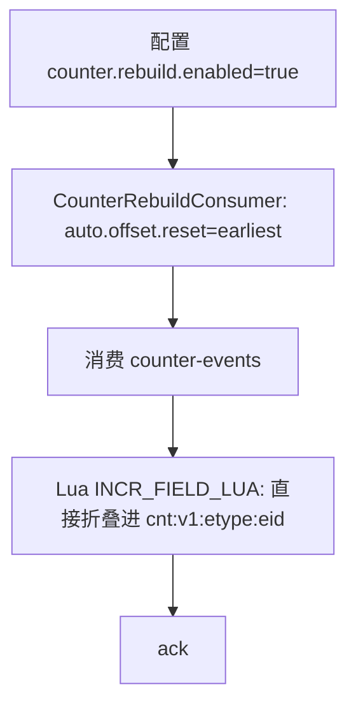

# 点赞系统全链路说明与可复刻实现方案（zhiguang_be）

文档日期：2026-03-05  
仓库：`https://github.com/G-Pegasus/zhiguang_be`  
分析基准 commit：`23f4343ec030be0ea700db2d7107470453d96e15`  

> 目标：把该仓库里的“点赞系统”从**接口 → 服务 → Redis → Kafka → 聚合落盘 → 读取 → 缓存旁路更新 →（灾难）重建**所有链路讲清楚，并输出一份足够详细的“可复刻实现方案”，供另一个 Codex agent 按步骤复现同等行为与数据结构。

---

## 0. 范围与术语

### 0.1 范围
- 本仓库的“点赞系统”实际上是一个通用**计数系统（Counter）**，同时覆盖：
  - 点赞：`like`
  - 收藏：`fav`
- 实体以 `entityType + entityId` 标识，当前业务主要使用：
  - `entityType = "knowpost"`（知文/内容）
- **重点**：点赞事实（是否点过）与点赞计数（likeCount）是两条不同的数据链路：
  - 事实层（truth）：Redis 位图 bitmap（实时、可幂等）
  - 计数快照（read-optimized）：Redis SDS 定长二进制（秒级最终一致）

### 0.2 “最终一致”与“实时”分别指什么
- “是否已点赞 liked”：实时（读 bitmap 的 `GETBIT`）
- “点赞数 likeCount”：秒级最终一致（Kafka → agg → 1s flush → SDS）
- 读快照异常时可自愈：基于 bitmap 分片做 `BITCOUNT` 重建 SDS

---

## 1. 代码地图（你要追链路就看这些文件）

### 1.1 对外 API
- 行为接口（点赞/取消/收藏/取消收藏）：`src/main/java/com/tongji/counter/api/ActionController.java`
- 计数读取接口：`src/main/java/com/tongji/counter/api/CounterController.java`
- 文档：`docs/API接口文档_计数.md`

### 1.2 核心服务
- Counter 接口：`src/main/java/com/tongji/counter/service/CounterService.java`
- 核心实现（bitmap + SDS + 重建）：`src/main/java/com/tongji/counter/service/impl/CounterServiceImpl.java`

### 1.3 Kafka 事件与聚合
- 事件模型：`src/main/java/com/tongji/counter/event/CounterEvent.java`
- 生产者：`src/main/java/com/tongji/counter/event/CounterEventProducer.java`
- 聚合消费者（Kafka → agg → 定时 flush 到 SDS）：`src/main/java/com/tongji/counter/event/CounterAggregationConsumer.java`
- 灾难回收消费者（earliest 回放折叠到 SDS，可选开启）：`src/main/java/com/tongji/counter/event/CounterRebuildConsumer.java`
- Topic 常量：`src/main/java/com/tongji/counter/event/CounterTopics.java`

### 1.4 Redis Key 与 schema
- Key 生成：`src/main/java/com/tongji/counter/schema/CounterKeys.java`
- SDS schema：`src/main/java/com/tongji/counter/schema/CounterSchema.java`
- bitmap 分片：`src/main/java/com/tongji/counter/schema/BitmapShard.java`

### 1.5 旁路链路（点赞事件触发的缓存/用户计数）
- Feed 缓存旁路更新监听：`src/main/java/com/tongji/knowpost/listener/FeedCacheInvalidationListener.java`
- 用户维度计数接口/实现：
  - `src/main/java/com/tongji/counter/service/UserCounterService.java`
  - `src/main/java/com/tongji/counter/service/impl/UserCounterServiceImpl.java`
- 用户维度计数读取端点（示例）：`src/main/java/com/tongji/relation/api/RelationController.java`

---

## 2. 对外接口契约（HTTP 层）

### 2.1 点赞 / 取消点赞
入口：`ActionController`

- `POST /api/v1/action/like`
- `POST /api/v1/action/unlike`

Request Body（两者相同）：
```json
{
  "entityType": "knowpost",
  "entityId": "123456"
}
```

Response：
```json
{
  "changed": true,
  "liked": true
}
```

字段语义：
- `changed`：这次操作是否真的改变了状态（幂等语义）
  - 已点赞再次点赞：`changed=false`
  - 已取消再次取消：`changed=false`
- `liked`：操作后“当前用户是否点赞”的最新状态（实时来自 bitmap）

### 2.2 收藏 / 取消收藏
- `POST /api/v1/action/fav`
- `POST /api/v1/action/unfav`

Response：
```json
{
  "changed": true,
  "faved": true
}
```

### 2.3 读取计数（like/fav）
入口：`CounterController`

- `GET /api/v1/counter/{etype}/{eid}?metrics=like,fav`

Response：
```json
{
  "entityType": "knowpost",
  "entityId": "123456",
  "counts": {
    "like": 128,
    "fav": 67
  }
}
```

说明：
- 计数优先来自 SDS 快照（低延迟读）。
- SDS 缺失或结构异常时，会触发基于 bitmap 的重建（带分布式锁、限流、退避降级）。

---

## 3. 核心数据结构（Redis + Kafka）

### 3.1 Redis Key 设计（实体维度）

| 名称 | Key 模板 | 类型 | 写入者 | 读取者 | 语义 |
|---|---|---|---|---|---|
| 位图分片（事实层） | `bm:{metric}:{etype}:{eid}:{chunk}` | String(bitset) | `CounterServiceImpl.toggle` | `isLiked/isFaved`、重建逻辑 | 用户是否对实体点赞/收藏 |
| 聚合桶（增量暂存） | `agg:v1:{etype}:{eid}` | Hash | `CounterAggregationConsumer.onMessage` | `flush()`、重建完成后清理 | Kafka 增量累加，等待刷入 SDS |
| SDS 快照（计数） | `cnt:v1:{etype}:{eid}` | String(binary) | `flush()`、重建逻辑 | `getCounts/getCountsBatch` | 定长 20 bytes，big-endian uint32 |

### 3.2 位图分片规则（避免单 key 膨胀）
代码：`BitmapShard.CHUNK_SIZE = 32768`

- `chunk = userId / 32768`
- `bit   = userId % 32768`
- bitmap key：`bm:like:knowpost:{eid}:{chunk}`

直观理解：
- 每个 bitmap 分片最多 32768 个用户位（约 4KB），不会因为 userId 很大导致单 key 膨胀。

### 3.3 SDS schema（实体计数 v1）
代码：`CounterSchema`

- `SCHEMA_ID = "v1"`
- `SCHEMA_LEN = 5`
- `FIELD_SIZE = 4`（4 bytes）
- 支持 metrics：`like`、`fav`
- idx 映射：
  - `like -> 1`
  - `fav  -> 2`

编码规则（必须复刻一致）：
- SDS 总长度：`SCHEMA_LEN * FIELD_SIZE = 20 bytes`
- 每段存储：big-endian uint32（读取后用 long 表示）
- offset 计算：`off = idx * FIELD_SIZE`（注意 idx=0 保留位）

### 3.4 Kafka 主题与消息
- topic：`counter-events`
- message：`CounterEvent` JSON
  - `{entityType, entityId, metric, idx, userId, delta}`

消费者：
- `CounterAggregationConsumer`：写聚合桶 `agg:*`，每 1s flush 到 `cnt:*`
- `CounterRebuildConsumer`（可选）：earliest 回放，直接折叠 `cnt:*`（灾难回收工具）

---

## 4. 全链路详细说明（从请求到落盘）

### 4.1 点赞/取消点赞（同步链路：写事实 + 发事件）
代码：`CounterServiceImpl.toggle(...)`、`ActionController`

关键点：
1. **幂等在 Redis Lua 里完成**：只要 bit 没变，就不发 Kafka、不改计数。
2. “是否点赞 liked”来自 bitmap，实时可读，不依赖 SDS。

细节步骤：
1. `ActionController.like` 解析 body，取 JWT 的 `uid`（`JwtService.extractUserId` 读取 claim `"uid"`）。
2. 调用 `CounterServiceImpl.like(...)` → `toggle(metric="like", idx=1, add=true)`
3. 计算 `chunk/bit`，构造 bitmap key：`bm:like:{etype}:{eid}:{chunk}`
4. `EVAL TOGGLE_LUA`：
   - `prev = GETBIT(bmKey, bit)`
   - add：
     - 若 `prev==1` → 返回 0（无变化）
     - 否则 `SETBIT(...,1)` → 返回 1（发生变化）
   - remove 同理
5. 若发生变化：
   - 发送 Kafka 事件（delta = +1/-1）
   - 同步发布本地 Spring 事件（同一个 `CounterEvent`），给缓存旁路更新使用
6. 返回 HTTP：`{changed, liked=GETBIT(...)}`（liked 再读一次保证是“操作后状态”）

### 4.2 异步链路（Kafka → agg → SDS）
代码：`CounterAggregationConsumer`

目标：在高并发写入下减少对 SDS 的写放大，把大量增量先聚合再批量折叠。

步骤：
1. `@KafkaListener` 消费 `counter-events`
2. 将 delta 先写入 Redis Hash 聚合桶：
   - `aggKey = agg:v1:{etype}:{eid}`
   - `field = idx`
   - `HINCRBY aggKey field delta`
3. 写入成功后手动 `ack.acknowledge()`，避免“写入 Redis 失败但 Kafka 已提交 offset”。
4. `@Scheduled(fixedDelay=1000ms)` 每秒触发 flush：
   - 扫描 `agg:v1:*`（当前实现用 `KEYS`）
   - 对每个 `aggKey`：
     - `HGETALL` 得到多个 idx 的 deltaSum
     - 对每个 field 执行 Lua `INCR_FIELD_LUA` 折叠到 `cnt:v1:{etype}:{eid}`
     - 折叠成功后再执行 Lua `DECR_FIELD_LUA` 从 `aggKey` 扣减并在归零时 `HDEL`
   - 若 `aggKey` 为空则删除 key

### 4.3 读取计数（读 SDS；异常时位图重建）
代码：`CounterServiceImpl.getCounts(...)`

正常路径：
1. 读取 `cnt:v1:{etype}:{eid}`（SDS）
2. 若长度为 20 bytes：按 idx 解码对应字段返回

异常路径（SDS 缺失/长度不对）：
1. 触发“重建”：
   - 退避降级（backoff）：`backoff:sds-rebuild:*`（用 Redisson bucket）
   - 频率限制（rate limiter）：`rl:sds-rebuild:*`（Redisson `RRateLimiter`）
   - 分布式锁：`lock:sds-rebuild:{etype}:{eid}`（Redisson `RLock`）
2. 重建逻辑：
   - 对每个 metric：
     - 找到所有 bitmap 分片 key：`bm:{metric}:{etype}:{eid}:*`（当前实现 `KEYS`）
     - pipeline 对每个分片 `BITCOUNT` 求和
   - 生成新的 20 bytes SDS，写回 `cnt:*`
   - 清理聚合桶对应 field：`HDEL agg:* idx`，避免“旧增量再次被 flush 加回去”造成双计数
3. 若无法重建（锁抢不到/限流/退避期）：**返回 0**（保证接口可用，不阻塞全站）

### 4.4 “是否点赞”读取（实时）
代码：`CounterServiceImpl.isLiked/isFaved`

不读 SDS，只做：
- `GETBIT bm:{metric}:{etype}:{eid}:{chunk} bit`

---

## 5. 旁路链路（点赞事件驱动的缓存与用户计数）

### 5.1 Feed 缓存计数旁路更新
代码：`FeedCacheInvalidationListener`

触发来源：
- `CounterServiceImpl.toggle()` 在状态变更时发布本地 Spring 事件 `CounterEvent`

做什么：
1. 仅处理 `entityType=="knowpost"` 且 metric in `{like,fav}`
2. 查 `KnowPost` 得到 creatorId：
   - like → `UserCounterService.incrementLikesReceived(creatorId, delta)`
   - fav  → `UserCounterService.incrementFavsReceived(creatorId, delta)`
3. 用“反向索引”定位受影响的 feed 页面 key：
   - `feed:public:index:{eid}:{hour}`（当前小时）
   - `feed:public:index:{eid}:{hour-1}`（上一小时，覆盖跨小时边界）
4. 对定位到的每个页面 key：
   - 更新本地 Caffeine `feedPublicCache` 的页面计数（对对应 item 做 `+delta`）
   - 若 Redis 里存在该页面 JSON（实现里也尝试更新），则更新并保持 TTL 不变

这条旁路的目的：
- SDS 是秒级最终一致；旁路让用户在 feed 里看到的计数“更像实时”。

### 5.2 用户维度“获赞/获收藏”计数
代码：`UserCounterServiceImpl`

存储：
- `ucnt:{userId}` SDS，5 段 * 4 bytes

更新：
- `incrementLikesReceived(userId, delta)` 折叠到第 4 段
- `incrementFavsReceived(userId, delta)` 折叠到第 5 段

读取示例：
- `RelationController.counter` 读取 `ucnt:{userId}` 并解码返回
- 缺失/异常长度会触发 `rebuildAllCounters(userId)` 自愈

---

## 6. 流程图（Mermaid）

### 6.1 点赞（同步链路：写事实 + 发事件）
```mermaid
flowchart TD
  A[客户端: POST /api/v1/action/like] --> B[Spring Security 校验JWT]
  B --> C[ActionController.like]
  C --> D[JwtService.extractUserId: 读 claim uid]
  D --> E[CounterService.like -> toggle(metric=like, add=true)]
  E --> F[Redis EVAL TOGGLE_LUA: GETBIT/SETBIT bm:like:etype:eid:chunk]
  F -->|changed=1| G[Kafka Producer: send CounterEvent(delta=+1) -> counter-events]
  F -->|changed=1| H[本地事件: publishEvent(CounterEvent)]
  F -->|changed=0| I[幂等: 不发事件, 不改计数]
  G --> J[HTTP 响应: {changed, liked=GETBIT}]
  H --> J
  I --> J
```

### 6.2 异步聚合落盘（Kafka -> agg Hash -> SDS）
```mermaid
flowchart LR
  K[Kafka: counter-events] --> L[CounterAggregationConsumer.onMessage]
  L --> M[Redis: HINCRBY agg:v1:etype:eid field=idx delta]
  M --> N[手动 ack Kafka offset]

  O[@Scheduled flush: fixedDelay=1s] --> P[Redis: KEYS agg:v1:*]
  P --> Q[对每个 aggKey: HGETALL]
  Q --> R[Lua INCR_FIELD_LUA: 把 delta 折叠进 cnt:v1:etype:eid SDS]
  R --> S[Lua DECR_FIELD_LUA: aggKey 对应 field 做 -delta; 变0则HDEL]
  S --> T[aggKey 空则 DEL]
```

### 6.3 读计数（优先 SDS，异常则位图重建）
```mermaid
flowchart TD
  A1[getCounts(etype,eid,metrics)] --> B1[GET cnt:v1:etype:eid]
  B1 --> C1{raw存在且长度==20?}
  C1 -->|是| D1[读 big-endian uint32: off=idx*4]
  C1 -->|否| E1{是否在 backoff?}
  E1 -->|是| F1[降级: metrics 全部返回0]
  E1 -->|否| G1{RateLimiter 允许?}
  G1 -->|否| H1[escalateBackoff; 返回0]
  G1 -->|是| I1{tryLock lock:sds-rebuild:etype:eid 成功?}
  I1 -->|否| J1[escalateBackoff; 返回0]
  I1 -->|是| K1[KEYS bm:metric:etype:eid:* + pipeline BITCOUNT 求和]
  K1 --> L1[写回 cnt:v1:etype:eid SDS]
  L1 --> M1[删除 agg:v1:etype:eid 中相关 field 防双计数]
  M1 --> N1[resetBackoff; 返回重建结果]
```

### 6.4 读“我是否点过赞”（直接查 bitmap）
```mermaid
flowchart TD
  S1[isLiked(etype,eid,uid)] --> T1[chunk=uid/32768, bit=uid%32768]
  T1 --> U1[GETBIT bm:like:etype:eid:chunk bit]
  U1 --> V1[返回 true/false]
```

### 6.5 点赞事件旁路：Feed 本地缓存 + 作者获赞计数
```mermaid
flowchart TD
  A2[toggle changed==1] --> B2[publishEvent(CounterEvent)]
  B2 --> C2[FeedCacheInvalidationListener.onCounterChanged]
  C2 --> D2{etype==knowpost 且 metric like/fav?}
  D2 -->|否| E2[忽略]
  D2 -->|是| F2[DB查 KnowPost.creatorId]
  F2 --> G2[UserCounterService.incrementLikesReceived/FavsReceived(delta)]
  F2 --> H2[读反向索引 Set: feed:public:index:eid:hour 与 hour-1]
  H2 --> I2[更新本地 Caffeine: feedPublicCache 页面计数(+/-delta)]
  H2 --> J2[若 Redis 存在整页 JSON: 同步更新并保持 TTL]
```

### 6.6 灾难回收（可选）：回放 Kafka 全量重建 SDS


---

## 7. 可复刻实现方案（另一个 Codex agent 的“照抄清单”）

> 复刻目标：实现同等 API 行为、同等 Redis key 与 schema、同等最终一致语义（bitmap 实时 + SDS 秒级最终一致 + 自愈重建）。

### 7.1 先把契约定死（不许改）
实体计数 SDS：
- schema：`v1`
- `SCHEMA_LEN=5`，`FIELD_SIZE=4`
- idx：`like=1`，`fav=2`
- offset：`off = idx * 4`（idx=0 保留）

bitmap 分片：
- `CHUNK_SIZE=32768`
- `chunk=userId/32768`，`bit=userId%32768`

Redis key：
- `bm:{metric}:{etype}:{eid}:{chunk}`
- `agg:v1:{etype}:{eid}`
- `cnt:v1:{etype}:{eid}`

Kafka：
- topic：`counter-events`
- message：`CounterEvent` JSON（字段必须一致）

### 7.2 模块拆分建议（按本仓库结构）
1) `counter/schema`：`CounterSchema/CounterKeys/BitmapShard`
2) `counter/event`：`CounterEvent/Producer/AggregationConsumer/RebuildConsumer/Topics`
3) `counter/service`：`CounterService/CounterServiceImpl`
4) `counter/api`：`ActionController/CounterController`
5) 旁路可选（若复刻“所有链路”）：
   - `FeedCacheInvalidationListener`
   - `UserCounterService/UserCounterServiceImpl`（`ucnt:{userId}`）

### 7.3 关键算法伪代码（实现必须等价）

#### A) 幂等点赞切换（事实层）
```text
function toggle(etype, eid, uid, metric, idx, add):
  chunk = uid / 32768
  bit   = uid % 32768
  bmKey = "bm:{metric}:{etype}:{eid}:{chunk}"

  changed = EVAL(TOGGLE_LUA, KEYS=[bmKey], ARGV=[bit, add? "add":"remove"])
  if changed != 1:
    return false

  delta = add ? +1 : -1
  kafka.send("counter-events", json({etype,eid,metric,idx,uid,delta}))
  spring.publishEvent(CounterEvent(...))
  return true
```

#### B) Kafka 聚合与 1s flush 到 SDS
```text
onKafkaMessage(event):
  aggKey = "agg:v1:{etype}:{eid}"
  field  = str(event.idx)
  HINCRBY aggKey field event.delta
  ack offset

every 1s flush():
  for each aggKey in KEYS("agg:v1:*"):
    {etype,eid} = parse aggKey
    cntKey = "cnt:v1:{etype}:{eid}"
    for each (field, deltaSum) in HGETALL(aggKey):
      if deltaSum == 0: continue
      idx = int(field)
      EVAL(INCR_FIELD_LUA, KEYS=[cntKey], ARGV=[schemaLen=5, fieldSize=4, idx, deltaSum])
      EVAL(DECR_FIELD_LUA, KEYS=[aggKey], ARGV=[field, deltaSum])
    if HLEN(aggKey)==0: DEL aggKey
```

#### C) 读计数（异常时位图重建）
```text
function getCounts(etype, eid, metrics):
  sdsKey = "cnt:v1:{etype}:{eid}"
  raw = GET(sdsKey)

  if raw exists and len(raw)==20:
    return decode(raw, metrics)  # off=idx*4 big-endian uint32

  if inBackoff(etype,eid): return allZero(metrics)
  if !rateLimiterAcquire(etype,eid): escalateBackoff(); return allZero(metrics)

  if !tryLock("lock:sds-rebuild:{etype}:{eid}"): escalateBackoff(); return allZero(metrics)
  try:
    newRaw = zeros(20)
    for metric in metrics:
      sum = SUM( BITCOUNT(key) for key in KEYS("bm:{metric}:{etype}:{eid}:*") )
      writeUInt32BE(newRaw, off=idx(metric)*4, sum)
    SET(sdsKey, newRaw)
    HDEL("agg:v1:{etype}:{eid}", fields=[idx(metric)...])
    resetBackoff()
    return computedMap
  finally:
    unlock
```

### 7.4 必要配置（本仓库 `application.yml` 为空，复刻必须补）
Redis（Spring Boot）：
- `spring.data.redis.host`
- `spring.data.redis.port`
- `spring.data.redis.password`（可选）
- `spring.data.redis.database`

Kafka（Spring Boot）：
- `spring.kafka.bootstrap-servers`
- 建议确保 Listener 使用手动 ack（因为代码显式调用 `Acknowledgment.acknowledge()`）

Redisson（通过 `RedissonConfig` 读取 RedisProperties）：
- `counter.rebuild.lock.watchdog-ms`（默认 30000）

计数重建参数（`CounterServiceImpl` 已有默认值）：
- `counter.rebuild.rate.permits`（默认 3）
- `counter.rebuild.rate.window-seconds`（默认 10）
- `counter.rebuild.backoff.base-ms`（默认 500）
- `counter.rebuild.backoff.max-ms`（默认 30000）
- `counter.rebuild.enabled`（默认 false，仅灾难回收用）

JWT：
- JWT 必须包含 claim `uid`（`JwtService` 从 `"uid"` 读 userId）

### 7.5 验收清单（复刻后最小可验证）
1. 幂等：
   - 第一次点赞：`changed=true, liked=true`
   - 第二次点赞：`changed=false, liked=true`
2. bitmap 与 liked 一致：`GETBIT` 的结果与接口返回一致
3. Kafka → agg：
   - 消费后 `agg:v1:*` 的对应 field 有增量累加
4. 1 秒内落到 SDS：
   - `cnt:v1:*` 的 like 计数在点赞后 1 秒内 +1（最终一致）
5. SDS 缺失自愈：
   - 删除 `cnt:v1:*` 后调用计数读取接口，触发 `BITCOUNT` 重建并返回正确值
6. 旁路链路（如果复刻了）：
   - 对 `knowpost` 点赞会让作者 `ucnt:{creatorId}` 第 4 段随 delta 变化

---

## 8. 已知风险与工程注意事项（照搬之前先看）

1) `KEYS` 风险  
当前实现用 `redis.keys("agg:v1:*")` 与 `redis.keys("bm:...:*")` 做扫描：键空间很大时会阻塞 Redis。  
生产建议：维护“活跃 key 索引集合”替代 `KEYS`（但本仓库暂未实现）。

2) “计数读降级返回 0”  
当重建遇到 backoff/限流/抢锁失败时，`getCounts` 直接返回 0，保证接口可用，但短时间内用户看到的 count 可能跳变。

3) 最终一致窗口  
flush 周期固定 1 秒：`likeCount` 可能延迟 0~1s（再叠加队列与调度延迟）。

4) SDS 溢出问题  
当前是 uint32（最大约 42 亿）。代码里写入时对负数归零；对上限做了截断（`writeInt32BE`）。如果业务可能超过上限，需要升级 schema（本仓库方案里有演进讨论）。

5) 灾难回收 consumer  
`CounterRebuildConsumer` earliest 回放会“累加式重建”，使用前要制定 runbook（例如清空旧 SDS、单独 consumer group、回放完成后关闭）。

---

## 9. 附：与业务展示的集成点（为什么用户能看到 liked/likeCount）

1) 详情页  
`KnowPostServiceImpl.enrichDetailResponse(...)`：
- `likeCount/favoriteCount` 来自 `CounterService.getCounts(...)`
- `liked/faved` 来自 `isLiked/isFaved`（实时）

2) 首页 Feed  
`KnowPostFeedServiceImpl`：
- 组装条目时调用 `getCounts` 填充 `likeCount/favCount`
- 返回前调用 `isLiked/isFaved` 覆盖用户维度标记（不写入公共缓存）

3) 作者获赞计数  
`FeedCacheInvalidationListener` 在本地事件里更新 `UserCounterService.incrementLikesReceived(...)`，读取端点可在 `RelationController.counter` 看到。

