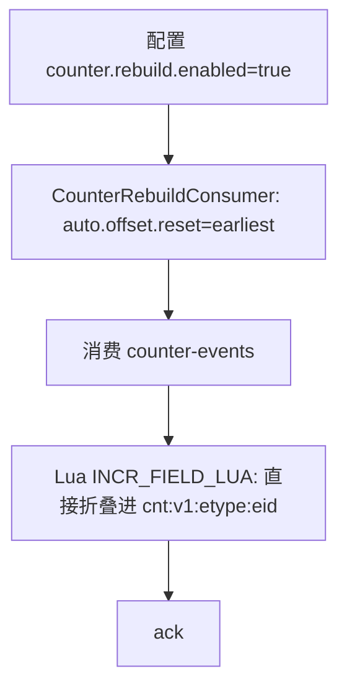
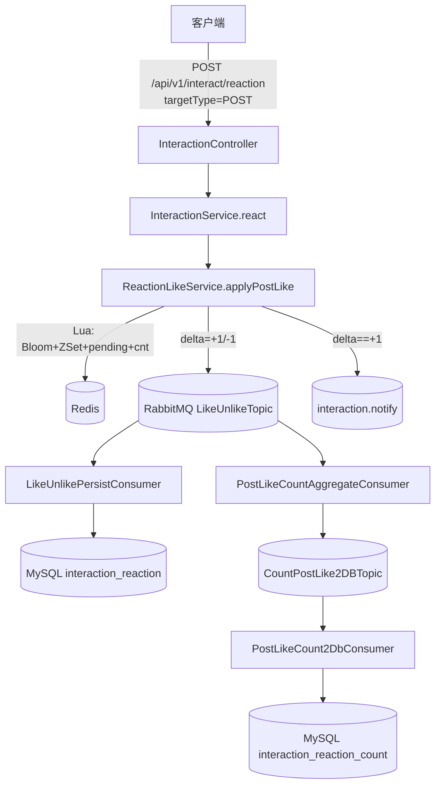
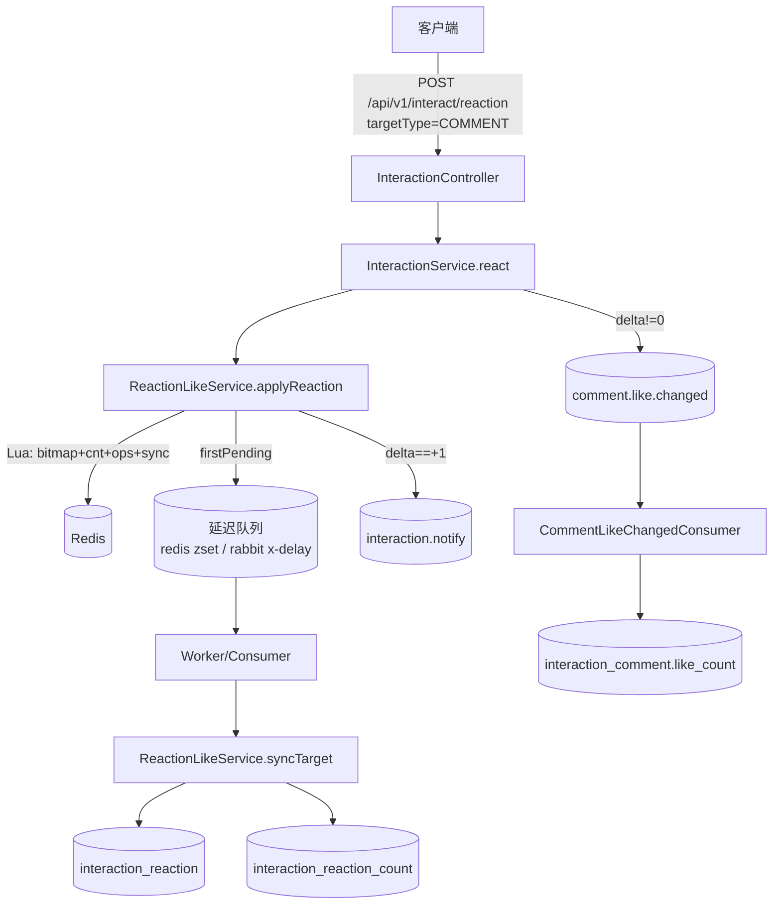

# 点赞系统全链路说明与可复刻实现方案（zhiguang_be）

文档日期：2026-03-05  
仓库：`https://github.com/G-Pegasus/zhiguang_be`  
分析基准 commit：`23f4343ec030be0ea700db2d7107470453d96e15`  

> 目标：把该仓库里的“点赞系统”从**接口 → 服务 → Redis → Kafka → 聚合落盘 → 读取 → 缓存旁路更新 →（灾难）重建**所有链路讲清楚，并输出一份足够详细的“可复刻实现方案”，供另一个 Codex agent 按步骤复现同等行为与数据结构。

---

## 0. 范围与术语

### 0.1 范围
- 本仓库的“点赞系统”实际上是一个通用**计数系统（Counter）**，同时覆盖：
  - 点赞：`like`
  - 收藏：`fav`
- 实体以 `entityType + entityId` 标识，当前业务主要使用：
  - `entityType = "knowpost"`（知文/内容）
- **重点**：点赞事实（是否点过）与点赞计数（likeCount）是两条不同的数据链路：
  - 事实层（truth）：Redis 位图 bitmap（实时、可幂等）
  - 计数快照（read-optimized）：Redis SDS 定长二进制（秒级最终一致）

### 0.2 “最终一致”与“实时”分别指什么
- “是否已点赞 liked”：实时（读 bitmap 的 `GETBIT`）
- “点赞数 likeCount”：秒级最终一致（Kafka → agg → 1s flush → SDS）
- 读快照异常时可自愈：基于 bitmap 分片做 `BITCOUNT` 重建 SDS

---

## 1. 代码地图（你要追链路就看这些文件）

### 1.1 对外 API
- 行为接口（点赞/取消/收藏/取消收藏）：`src/main/java/com/tongji/counter/api/ActionController.java`
- 计数读取接口：`src/main/java/com/tongji/counter/api/CounterController.java`
- 文档：`docs/API接口文档_计数.md`

### 1.2 核心服务
- Counter 接口：`src/main/java/com/tongji/counter/service/CounterService.java`
- 核心实现（bitmap + SDS + 重建）：`src/main/java/com/tongji/counter/service/impl/CounterServiceImpl.java`

### 1.3 Kafka 事件与聚合
- 事件模型：`src/main/java/com/tongji/counter/event/CounterEvent.java`
- 生产者：`src/main/java/com/tongji/counter/event/CounterEventProducer.java`
- 聚合消费者（Kafka → agg → 定时 flush 到 SDS）：`src/main/java/com/tongji/counter/event/CounterAggregationConsumer.java`
- 灾难回收消费者（earliest 回放折叠到 SDS，可选开启）：`src/main/java/com/tongji/counter/event/CounterRebuildConsumer.java`
- Topic 常量：`src/main/java/com/tongji/counter/event/CounterTopics.java`

### 1.4 Redis Key 与 schema
- Key 生成：`src/main/java/com/tongji/counter/schema/CounterKeys.java`
- SDS schema：`src/main/java/com/tongji/counter/schema/CounterSchema.java`
- bitmap 分片：`src/main/java/com/tongji/counter/schema/BitmapShard.java`

### 1.5 旁路链路（点赞事件触发的缓存/用户计数）
- Feed 缓存旁路更新监听：`src/main/java/com/tongji/knowpost/listener/FeedCacheInvalidationListener.java`
- 用户维度计数接口/实现：
  - `src/main/java/com/tongji/counter/service/UserCounterService.java`
  - `src/main/java/com/tongji/counter/service/impl/UserCounterServiceImpl.java`
- 用户维度计数读取端点（示例）：`src/main/java/com/tongji/relation/api/RelationController.java`

---

## 2. 对外接口契约（HTTP 层）

### 2.1 点赞 / 取消点赞
入口：`ActionController`

- `POST /api/v1/action/like`
- `POST /api/v1/action/unlike`

Request Body（两者相同）：
```json
{
  "entityType": "knowpost",
  "entityId": "123456"
}
```

Response：
```json
{
  "changed": true,
  "liked": true
}
```

字段语义：
- `changed`：这次操作是否真的改变了状态（幂等语义）
  - 已点赞再次点赞：`changed=false`
  - 已取消再次取消：`changed=false`
- `liked`：操作后“当前用户是否点赞”的最新状态（实时来自 bitmap）

### 2.2 收藏 / 取消收藏
- `POST /api/v1/action/fav`
- `POST /api/v1/action/unfav`

Response：
```json
{
  "changed": true,
  "faved": true
}
```

### 2.3 读取计数（like/fav）
入口：`CounterController`

- `GET /api/v1/counter/{etype}/{eid}?metrics=like,fav`

Response：
```json
{
  "entityType": "knowpost",
  "entityId": "123456",
  "counts": {
    "like": 128,
    "fav": 67
  }
}
```

说明：
- 计数优先来自 SDS 快照（低延迟读）。
- SDS 缺失或结构异常时，会触发基于 bitmap 的重建（带分布式锁、限流、退避降级）。

---

## 3. 核心数据结构（Redis + Kafka）

### 3.1 Redis Key 设计（实体维度）

| 名称 | Key 模板 | 类型 | 写入者 | 读取者 | 语义 |
|---|---|---|---|---|---|
| 位图分片（事实层） | `bm:{metric}:{etype}:{eid}:{chunk}` | String(bitset) | `CounterServiceImpl.toggle` | `isLiked/isFaved`、重建逻辑 | 用户是否对实体点赞/收藏 |
| 聚合桶（增量暂存） | `agg:v1:{etype}:{eid}` | Hash | `CounterAggregationConsumer.onMessage` | `flush()`、重建完成后清理 | Kafka 增量累加，等待刷入 SDS |
| SDS 快照（计数） | `cnt:v1:{etype}:{eid}` | String(binary) | `flush()`、重建逻辑 | `getCounts/getCountsBatch` | 定长 20 bytes，big-endian uint32 |

### 3.2 位图分片规则（避免单 key 膨胀）
代码：`BitmapShard.CHUNK_SIZE = 32768`

- `chunk = userId / 32768`
- `bit   = userId % 32768`
- bitmap key：`bm:like:knowpost:{eid}:{chunk}`

直观理解：
- 每个 bitmap 分片最多 32768 个用户位（约 4KB），不会因为 userId 很大导致单 key 膨胀。

### 3.3 SDS schema（实体计数 v1）
代码：`CounterSchema`

- `SCHEMA_ID = "v1"`
- `SCHEMA_LEN = 5`
- `FIELD_SIZE = 4`（4 bytes）
- 支持 metrics：`like`、`fav`
- idx 映射：
  - `like -> 1`
  - `fav  -> 2`

编码规则（必须复刻一致）：
- SDS 总长度：`SCHEMA_LEN * FIELD_SIZE = 20 bytes`
- 每段存储：big-endian uint32（读取后用 long 表示）
- offset 计算：`off = idx * FIELD_SIZE`（注意 idx=0 保留位）

### 3.4 Kafka 主题与消息
- topic：`counter-events`
- message：`CounterEvent` JSON
  - `{entityType, entityId, metric, idx, userId, delta}`

消费者：
- `CounterAggregationConsumer`：写聚合桶 `agg:*`，每 1s flush 到 `cnt:*`
- `CounterRebuildConsumer`（可选）：earliest 回放，直接折叠 `cnt:*`（灾难回收工具）

---

## 4. 全链路详细说明（从请求到落盘）

### 4.1 点赞/取消点赞（同步链路：写事实 + 发事件）
代码：`CounterServiceImpl.toggle(...)`、`ActionController`

关键点：
1. **幂等在 Redis Lua 里完成**：只要 bit 没变，就不发 Kafka、不改计数。
2. “是否点赞 liked”来自 bitmap，实时可读，不依赖 SDS。

细节步骤：
1. `ActionController.like` 解析 body，取 JWT 的 `uid`（`JwtService.extractUserId` 读取 claim `"uid"`）。
2. 调用 `CounterServiceImpl.like(...)` → `toggle(metric="like", idx=1, add=true)`
3. 计算 `chunk/bit`，构造 bitmap key：`bm:like:{etype}:{eid}:{chunk}`
4. `EVAL TOGGLE_LUA`：
   - `prev = GETBIT(bmKey, bit)`
   - add：
     - 若 `prev==1` → 返回 0（无变化）
     - 否则 `SETBIT(...,1)` → 返回 1（发生变化）
   - remove 同理
5. 若发生变化：
   - 发送 Kafka 事件（delta = +1/-1）
   - 同步发布本地 Spring 事件（同一个 `CounterEvent`），给缓存旁路更新使用
6. 返回 HTTP：`{changed, liked=GETBIT(...)}`（liked 再读一次保证是“操作后状态”）

### 4.2 异步链路（Kafka → agg → SDS）
代码：`CounterAggregationConsumer`

目标：在高并发写入下减少对 SDS 的写放大，把大量增量先聚合再批量折叠。

步骤：
1. `@KafkaListener` 消费 `counter-events`
2. 将 delta 先写入 Redis Hash 聚合桶：
   - `aggKey = agg:v1:{etype}:{eid}`
   - `field = idx`
   - `HINCRBY aggKey field delta`
3. 写入成功后手动 `ack.acknowledge()`，避免“写入 Redis 失败但 Kafka 已提交 offset”。
4. `@Scheduled(fixedDelay=1000ms)` 每秒触发 flush：
   - 扫描 `agg:v1:*`（当前实现用 `KEYS`）
   - 对每个 `aggKey`：
     - `HGETALL` 得到多个 idx 的 deltaSum
     - 对每个 field 执行 Lua `INCR_FIELD_LUA` 折叠到 `cnt:v1:{etype}:{eid}`
     - 折叠成功后再执行 Lua `DECR_FIELD_LUA` 从 `aggKey` 扣减并在归零时 `HDEL`
   - 若 `aggKey` 为空则删除 key

### 4.3 读取计数（读 SDS；异常时位图重建）
代码：`CounterServiceImpl.getCounts(...)`

正常路径：
1. 读取 `cnt:v1:{etype}:{eid}`（SDS）
2. 若长度为 20 bytes：按 idx 解码对应字段返回

异常路径（SDS 缺失/长度不对）：
1. 触发“重建”：
   - 退避降级（backoff）：`backoff:sds-rebuild:*`（用 Redisson bucket）
   - 频率限制（rate limiter）：`rl:sds-rebuild:*`（Redisson `RRateLimiter`）
   - 分布式锁：`lock:sds-rebuild:{etype}:{eid}`（Redisson `RLock`）
2. 重建逻辑：
   - 对每个 metric：
     - 找到所有 bitmap 分片 key：`bm:{metric}:{etype}:{eid}:*`（当前实现 `KEYS`）
     - pipeline 对每个分片 `BITCOUNT` 求和
   - 生成新的 20 bytes SDS，写回 `cnt:*`
   - 清理聚合桶对应 field：`HDEL agg:* idx`，避免“旧增量再次被 flush 加回去”造成双计数
3. 若无法重建（锁抢不到/限流/退避期）：**返回 0**（保证接口可用，不阻塞全站）

### 4.4 “是否点赞”读取（实时）
代码：`CounterServiceImpl.isLiked/isFaved`

不读 SDS，只做：
- `GETBIT bm:{metric}:{etype}:{eid}:{chunk} bit`

---

## 5. 旁路链路（点赞事件驱动的缓存与用户计数）

### 5.1 Feed 缓存计数旁路更新
代码：`FeedCacheInvalidationListener`

触发来源：
- `CounterServiceImpl.toggle()` 在状态变更时发布本地 Spring 事件 `CounterEvent`

做什么：
1. 仅处理 `entityType=="knowpost"` 且 metric in `{like,fav}`
2. 查 `KnowPost` 得到 creatorId：
   - like → `UserCounterService.incrementLikesReceived(creatorId, delta)`
   - fav  → `UserCounterService.incrementFavsReceived(creatorId, delta)`
3. 用“反向索引”定位受影响的 feed 页面 key：
   - `feed:public:index:{eid}:{hour}`（当前小时）
   - `feed:public:index:{eid}:{hour-1}`（上一小时，覆盖跨小时边界）
4. 对定位到的每个页面 key：
   - 更新本地 Caffeine `feedPublicCache` 的页面计数（对对应 item 做 `+delta`）
   - 若 Redis 里存在该页面 JSON（实现里也尝试更新），则更新并保持 TTL 不变

这条旁路的目的：
- SDS 是秒级最终一致；旁路让用户在 feed 里看到的计数“更像实时”。

### 5.2 用户维度“获赞/获收藏”计数
代码：`UserCounterServiceImpl`

存储：
- `ucnt:{userId}` SDS，5 段 * 4 bytes

更新：
- `incrementLikesReceived(userId, delta)` 折叠到第 4 段
- `incrementFavsReceived(userId, delta)` 折叠到第 5 段

读取示例：
- `RelationController.counter` 读取 `ucnt:{userId}` 并解码返回
- 缺失/异常长度会触发 `rebuildAllCounters(userId)` 自愈

---

## 6. 流程图（Mermaid）

### 6.1 点赞（同步链路：写事实 + 发事件）
```mermaid
flowchart TD
  A[客户端: POST /api/v1/action/like] --> B[Spring Security 校验JWT]
  B --> C[ActionController.like]
  C --> D[JwtService.extractUserId: 读 claim uid]
  D --> E[CounterService.like -> toggle(metric=like, add=true)]
  E --> F[Redis EVAL TOGGLE_LUA: GETBIT/SETBIT bm:like:etype:eid:chunk]
  F -->|changed=1| G[Kafka Producer: send CounterEvent(delta=+1) -> counter-events]
  F -->|changed=1| H[本地事件: publishEvent(CounterEvent)]
  F -->|changed=0| I[幂等: 不发事件, 不改计数]
  G --> J[HTTP 响应: {changed, liked=GETBIT}]
  H --> J
  I --> J
```

### 6.2 异步聚合落盘（Kafka -> agg Hash -> SDS）
```mermaid
flowchart LR
  K[Kafka: counter-events] --> L[CounterAggregationConsumer.onMessage]
  L --> M[Redis: HINCRBY agg:v1:etype:eid field=idx delta]
  M --> N[手动 ack Kafka offset]

  O[@Scheduled flush: fixedDelay=1s] --> P[Redis: KEYS agg:v1:*]
  P --> Q[对每个 aggKey: HGETALL]
  Q --> R[Lua INCR_FIELD_LUA: 把 delta 折叠进 cnt:v1:etype:eid SDS]
  R --> S[Lua DECR_FIELD_LUA: aggKey 对应 field 做 -delta; 变0则HDEL]
  S --> T[aggKey 空则 DEL]
```

### 6.3 读计数（优先 SDS，异常则位图重建）
```mermaid
flowchart TD
  A1[getCounts(etype,eid,metrics)] --> B1[GET cnt:v1:etype:eid]
  B1 --> C1{raw存在且长度==20?}
  C1 -->|是| D1[读 big-endian uint32: off=idx*4]
  C1 -->|否| E1{是否在 backoff?}
  E1 -->|是| F1[降级: metrics 全部返回0]
  E1 -->|否| G1{RateLimiter 允许?}
  G1 -->|否| H1[escalateBackoff; 返回0]
  G1 -->|是| I1{tryLock lock:sds-rebuild:etype:eid 成功?}
  I1 -->|否| J1[escalateBackoff; 返回0]
  I1 -->|是| K1[KEYS bm:metric:etype:eid:* + pipeline BITCOUNT 求和]
  K1 --> L1[写回 cnt:v1:etype:eid SDS]
  L1 --> M1[删除 agg:v1:etype:eid 中相关 field 防双计数]
  M1 --> N1[resetBackoff; 返回重建结果]
```

### 6.4 读“我是否点过赞”（直接查 bitmap）
```mermaid
flowchart TD
  S1[isLiked(etype,eid,uid)] --> T1[chunk=uid/32768, bit=uid%32768]
  T1 --> U1[GETBIT bm:like:etype:eid:chunk bit]
  U1 --> V1[返回 true/false]
```

### 6.5 点赞事件旁路：Feed 本地缓存 + 作者获赞计数
```mermaid
flowchart TD
  A2[toggle changed==1] --> B2[publishEvent(CounterEvent)]
  B2 --> C2[FeedCacheInvalidationListener.onCounterChanged]
  C2 --> D2{etype==knowpost 且 metric like/fav?}
  D2 -->|否| E2[忽略]
  D2 -->|是| F2[DB查 KnowPost.creatorId]
  F2 --> G2[UserCounterService.incrementLikesReceived/FavsReceived(delta)]
  F2 --> H2[读反向索引 Set: feed:public:index:eid:hour 与 hour-1]
  H2 --> I2[更新本地 Caffeine: feedPublicCache 页面计数(+/-delta)]
  H2 --> J2[若 Redis 存在整页 JSON: 同步更新并保持 TTL]
```

### 6.6 灾难回收（可选）：回放 Kafka 全量重建 SDS


---

## 7. 可复刻实现方案（另一个 Codex agent 的“照抄清单”）

> 复刻目标：实现同等 API 行为、同等 Redis key 与 schema、同等最终一致语义（bitmap 实时 + SDS 秒级最终一致 + 自愈重建）。

### 7.1 先把契约定死（不许改）
实体计数 SDS：
- schema：`v1`
- `SCHEMA_LEN=5`，`FIELD_SIZE=4`
- idx：`like=1`，`fav=2`
- offset：`off = idx * 4`（idx=0 保留）

bitmap 分片：
- `CHUNK_SIZE=32768`
- `chunk=userId/32768`，`bit=userId%32768`

Redis key：
- `bm:{metric}:{etype}:{eid}:{chunk}`
- `agg:v1:{etype}:{eid}`
- `cnt:v1:{etype}:{eid}`

Kafka：
- topic：`counter-events`
- message：`CounterEvent` JSON（字段必须一致）

### 7.2 模块拆分建议（按本仓库结构）
1) `counter/schema`：`CounterSchema/CounterKeys/BitmapShard`
2) `counter/event`：`CounterEvent/Producer/AggregationConsumer/RebuildConsumer/Topics`
3) `counter/service`：`CounterService/CounterServiceImpl`
4) `counter/api`：`ActionController/CounterController`
5) 旁路可选（若复刻“所有链路”）：
   - `FeedCacheInvalidationListener`
   - `UserCounterService/UserCounterServiceImpl`（`ucnt:{userId}`）

### 7.3 关键算法伪代码（实现必须等价）

#### A) 幂等点赞切换（事实层）
```text
function toggle(etype, eid, uid, metric, idx, add):
  chunk = uid / 32768
  bit   = uid % 32768
  bmKey = "bm:{metric}:{etype}:{eid}:{chunk}"

  changed = EVAL(TOGGLE_LUA, KEYS=[bmKey], ARGV=[bit, add? "add":"remove"])
  if changed != 1:
    return false

  delta = add ? +1 : -1
  kafka.send("counter-events", json({etype,eid,metric,idx,uid,delta}))
  spring.publishEvent(CounterEvent(...))
  return true
```

#### B) Kafka 聚合与 1s flush 到 SDS
```text
onKafkaMessage(event):
  aggKey = "agg:v1:{etype}:{eid}"
  field  = str(event.idx)
  HINCRBY aggKey field event.delta
  ack offset

every 1s flush():
  for each aggKey in KEYS("agg:v1:*"):
    {etype,eid} = parse aggKey
    cntKey = "cnt:v1:{etype}:{eid}"
    for each (field, deltaSum) in HGETALL(aggKey):
      if deltaSum == 0: continue
      idx = int(field)
      EVAL(INCR_FIELD_LUA, KEYS=[cntKey], ARGV=[schemaLen=5, fieldSize=4, idx, deltaSum])
      EVAL(DECR_FIELD_LUA, KEYS=[aggKey], ARGV=[field, deltaSum])
    if HLEN(aggKey)==0: DEL aggKey
```

#### C) 读计数（异常时位图重建）
```text
function getCounts(etype, eid, metrics):
  sdsKey = "cnt:v1:{etype}:{eid}"
  raw = GET(sdsKey)

  if raw exists and len(raw)==20:
    return decode(raw, metrics)  # off=idx*4 big-endian uint32

  if inBackoff(etype,eid): return allZero(metrics)
  if !rateLimiterAcquire(etype,eid): escalateBackoff(); return allZero(metrics)

  if !tryLock("lock:sds-rebuild:{etype}:{eid}"): escalateBackoff(); return allZero(metrics)
  try:
    newRaw = zeros(20)
    for metric in metrics:
      sum = SUM( BITCOUNT(key) for key in KEYS("bm:{metric}:{etype}:{eid}:*") )
      writeUInt32BE(newRaw, off=idx(metric)*4, sum)
    SET(sdsKey, newRaw)
    HDEL("agg:v1:{etype}:{eid}", fields=[idx(metric)...])
    resetBackoff()
    return computedMap
  finally:
    unlock
```

### 7.4 必要配置（本仓库 `application.yml` 为空，复刻必须补）
Redis（Spring Boot）：
- `spring.data.redis.host`
- `spring.data.redis.port`
- `spring.data.redis.password`（可选）
- `spring.data.redis.database`

Kafka（Spring Boot）：
- `spring.kafka.bootstrap-servers`
- 建议确保 Listener 使用手动 ack（因为代码显式调用 `Acknowledgment.acknowledge()`）

Redisson（通过 `RedissonConfig` 读取 RedisProperties）：
- `counter.rebuild.lock.watchdog-ms`（默认 30000）

计数重建参数（`CounterServiceImpl` 已有默认值）：
- `counter.rebuild.rate.permits`（默认 3）
- `counter.rebuild.rate.window-seconds`（默认 10）
- `counter.rebuild.backoff.base-ms`（默认 500）
- `counter.rebuild.backoff.max-ms`（默认 30000）
- `counter.rebuild.enabled`（默认 false，仅灾难回收用）

JWT：
- JWT 必须包含 claim `uid`（`JwtService` 从 `"uid"` 读 userId）

### 7.5 验收清单（复刻后最小可验证）
1. 幂等：
   - 第一次点赞：`changed=true, liked=true`
   - 第二次点赞：`changed=false, liked=true`
2. bitmap 与 liked 一致：`GETBIT` 的结果与接口返回一致
3. Kafka → agg：
   - 消费后 `agg:v1:*` 的对应 field 有增量累加
4. 1 秒内落到 SDS：
   - `cnt:v1:*` 的 like 计数在点赞后 1 秒内 +1（最终一致）
5. SDS 缺失自愈：
   - 删除 `cnt:v1:*` 后调用计数读取接口，触发 `BITCOUNT` 重建并返回正确值
6. 旁路链路（如果复刻了）：
   - 对 `knowpost` 点赞会让作者 `ucnt:{creatorId}` 第 4 段随 delta 变化

---

## 8. 已知风险与工程注意事项（照搬之前先看）

1) `KEYS` 风险  
当前实现用 `redis.keys("agg:v1:*")` 与 `redis.keys("bm:...:*")` 做扫描：键空间很大时会阻塞 Redis。  
生产建议：维护“活跃 key 索引集合”替代 `KEYS`（但本仓库暂未实现）。

2) “计数读降级返回 0”  
当重建遇到 backoff/限流/抢锁失败时，`getCounts` 直接返回 0，保证接口可用，但短时间内用户看到的 count 可能跳变。

3) 最终一致窗口  
flush 周期固定 1 秒：`likeCount` 可能延迟 0~1s（再叠加队列与调度延迟）。

4) SDS 溢出问题  
当前是 uint32（最大约 42 亿）。代码里写入时对负数归零；对上限做了截断（`writeInt32BE`）。如果业务可能超过上限，需要升级 schema（本仓库方案里有演进讨论）。

5) 灾难回收 consumer  
`CounterRebuildConsumer` earliest 回放会“累加式重建”，使用前要制定 runbook（例如清空旧 SDS、单独 consumer group、回放完成后关闭）。

---

## 9. 附：与业务展示的集成点（为什么用户能看到 liked/likeCount）

1) 详情页  
`KnowPostServiceImpl.enrichDetailResponse(...)`：
- `likeCount/favoriteCount` 来自 `CounterService.getCounts(...)`
- `liked/faved` 来自 `isLiked/isFaved`（实时）

2) 首页 Feed  
`KnowPostFeedServiceImpl`：
- 组装条目时调用 `getCounts` 填充 `likeCount/favCount`
- 返回前调用 `isLiked/isFaved` 覆盖用户维度标记（不写入公共缓存）

3) 作者获赞计数  
`FeedCacheInvalidationListener` 在本地事件里更新 `UserCounterService.incrementLikesReceived(...)`，读取端点可在 `RelationController.counter` 看到。


---

# 点赞系统全链路说明与可复刻实现方案（nexus）

文档日期：2026-03-05  
仓库：`project/nexus`  
分析基准 commit：`cd48a0a5662b117f4cff36f0f1a6f5a8d28e97e3`  

> 目标：把 nexus 里的“点赞系统”从**接口 → 领域服务 → Redis →（延迟队列 / MQ）→ MySQL 落库 → 读取 → 旁路（通知/推荐/热榜）**讲清楚，并输出一份足够详细的“可复刻实现方案”。

---

## 0. 范围与术语

### 0.1 范围
- 本项目的“点赞”在代码里叫 **Reaction（态势）**，但当前只开放 `LIKE`（点赞）。
- 支持点赞目标：
  - 帖子：`targetType="POST"`
  - 一级评论：`targetType="COMMENT"`（业务约束：楼内回复不允许被点赞）
- **重点**：同一个“点赞系统”，在代码里其实分成两条实现链路：
  - **POST 点赞**：Bloom(位图) + ZSet（最近点赞）+ pendingKey（短时状态）+ RabbitMQ（Like/Unlike 事件）+ MySQL 落库（事实表）+ 计数对齐（count 表）
  - **COMMENT 点赞**：bitmap 分片（按 userId）+ cntKey + opsKey（变更集合）+ 延迟同步（Redis ZSET 延迟队列 / 可切 RabbitMQ x-delay）+ MySQL 批量落库

你可以把它简单理解成：
- Redis：很快的“记事本”（实时读写，扛高并发）
- MySQL：最终“档案馆”（慢一点，但要保证最后能对上）

### 0.2 关键术语（读懂后面就够了）
- `ReactionTargetVO = targetType + targetId + reactionType`：点赞目标的“唯一键”
  - 例：`{POST:90001:LIKE}`、`{COMMENT:80001:LIKE}`
- 动作不是 toggle：`action=ADD/REMOVE` 表示“设成已赞/未赞”（天然幂等）
  - 代码：`ReactionActionEnumVO.desiredState()`
- `delta`：这次操作是否真的改变了状态
  - `+1` 代表真的新增点赞（可以发通知/旁路）
  - `-1` 代表真的取消点赞
  - `0` 代表重复请求（幂等：不应该刷通知）
- `success=true` 的语义（非常重要）：**只代表 Redis 在线写成功**，不代表 MySQL 已经同步完成
  - 代码注释：`ReactionLikeService` 类注释

---

## 1. 代码地图（你要追链路就看这些文件）

### 1.1 对外 API（HTTP）
- 入口 Controller：`project/nexus/nexus-trigger/src/main/java/cn/nexus/trigger/http/social/InteractionController.java`
  - `POST /api/v1/interact/reaction`（点赞/取消）
  - `GET  /api/v1/interact/reaction/state`（查询点赞状态+计数）
- DTO：
  - `project/nexus/nexus-api/src/main/java/cn/nexus/api/social/interaction/dto/ReactionRequestDTO.java`
  - `project/nexus/nexus-api/src/main/java/cn/nexus/api/social/interaction/dto/ReactionResponseDTO.java`
  - `project/nexus/nexus-api/src/main/java/cn/nexus/api/social/interaction/dto/ReactionStateRequestDTO.java`
  - `project/nexus/nexus-api/src/main/java/cn/nexus/api/social/interaction/dto/ReactionStateResponseDTO.java`
- userId 注入：
  - `project/nexus/nexus-trigger/src/main/java/cn/nexus/trigger/http/support/UserContext.java`
  - `project/nexus/nexus-trigger/src/main/java/cn/nexus/trigger/http/support/UserContextInterceptor.java`

### 1.2 领域服务（核心入口）
- 聚合入口：`project/nexus/nexus-domain/src/main/java/cn/nexus/domain/social/service/InteractionService.java`
  - `parseTarget`：评论必须是根评（`rootId==null`），否则直接拒绝
  - 评论点赞 delta 驱动 `CommentLikeChangedEvent`
- 点赞子域服务：`project/nexus/nexus-domain/src/main/java/cn/nexus/domain/social/service/ReactionLikeService.java`
  - 在线写：`applyReaction/applyPostLike`
  - 读状态：`queryState`
  - 延迟落库：`syncTarget`

### 1.3 Redis（事实/计数/延迟同步）
- COMMENT 点赞缓存（bitmap + cnt + ops + sync）：`project/nexus/nexus-infrastructure/src/main/java/cn/nexus/infrastructure/adapter/social/port/ReactionCachePort.java`
- POST 点赞缓存（Bloom + ZSet + pending + cnt）：`project/nexus/nexus-infrastructure/src/main/java/cn/nexus/infrastructure/adapter/social/port/PostLikeCachePort.java`
- POST 作者查询缓存（用于派生计数）：`project/nexus/nexus-infrastructure/src/main/java/cn/nexus/infrastructure/adapter/social/port/PostAuthorPort.java`

### 1.4 MySQL（事实表 + 计数表）
- DDL：`project/nexus/docs/social_schema.sql`
  - `interaction_reaction`（事实表：谁对谁点过赞）
  - `interaction_reaction_count`（计数表：某目标的点赞数）
- delta 模型 inbox（可选）：`project/nexus/docs/migrations/20260304_02_add_reaction_count_delta_inbox.sql`
  - `interaction_reaction_count_delta_inbox`（幂等去重）
- 仓储实现：`project/nexus/nexus-infrastructure/src/main/java/cn/nexus/infrastructure/adapter/social/repository/ReactionRepository.java`
- Mapper：
  - `project/nexus/nexus-infrastructure/src/main/resources/mapper/social/InteractionReactionMapper.xml`
  - `project/nexus/nexus-infrastructure/src/main/resources/mapper/social/InteractionReactionCountMapper.xml`
  - `project/nexus/nexus-infrastructure/src/main/resources/mapper/social/InteractionReactionCountDeltaInboxMapper.xml`

### 1.5 MQ/延迟队列（异步落库与计数对齐）
POST 点赞（RabbitMQ）：
- Like/Unlike 事件拓扑：`project/nexus/nexus-trigger/src/main/java/cn/nexus/trigger/mq/config/LikeUnlikeMqConfig.java`
- Batch 容器（≈1000/1s BufferTrigger）：`project/nexus/nexus-trigger/src/main/java/cn/nexus/trigger/mq/config/LikeUnlikeListenerContainerConfig.java`
- 关系落库（A 组）：`project/nexus/nexus-trigger/src/main/java/cn/nexus/trigger/mq/consumer/LikeUnlikePersistConsumer.java`
- 计数聚合（B 组）：`project/nexus/nexus-trigger/src/main/java/cn/nexus/trigger/mq/consumer/PostLikeCountAggregateConsumer.java`
  - 路由策略（snapshot/delta）：`project/nexus/nexus-trigger/src/main/java/cn/nexus/trigger/mq/consumer/strategy/RoutingPostLikeCountAggregateStrategy.java`
- 计数写库（C 组）：`project/nexus/nexus-trigger/src/main/java/cn/nexus/trigger/mq/consumer/PostLikeCount2DbConsumer.java`
  - 路由策略（snapshot/delta）：`project/nexus/nexus-trigger/src/main/java/cn/nexus/trigger/mq/consumer/strategy/RoutingPostLikeCount2DbStrategy.java`
- Count 对齐拓扑：`project/nexus/nexus-trigger/src/main/java/cn/nexus/trigger/mq/config/CountPostLikeMqConfig.java`

COMMENT 点赞（延迟同步，默认 Redis ZSET 延迟队列）：
- 端口：`project/nexus/nexus-domain/src/main/java/cn/nexus/domain/social/adapter/port/IReactionDelayPort.java`
- Redis 模式（默认）：
  - 入队端口：`project/nexus/nexus-trigger/src/main/java/cn/nexus/trigger/redis/ReactionSyncDelayPortRedis.java`
  - Worker：`project/nexus/nexus-trigger/src/main/java/cn/nexus/trigger/job/social/ReactionSyncZsetWorker.java`
  - Lua：`project/nexus/nexus-trigger/src/main/resources/lua/reaction_sync/*`
- Rabbit 模式（可选）：
  - 延迟交换机/队列：`project/nexus/nexus-trigger/src/main/java/cn/nexus/trigger/mq/config/ReactionSyncDelayConfig.java`
  - Producer：`project/nexus/nexus-trigger/src/main/java/cn/nexus/trigger/mq/producer/ReactionSyncProducer.java`
  - Consumer：`project/nexus/nexus-trigger/src/main/java/cn/nexus/trigger/mq/consumer/ReactionSyncConsumer.java`

旁路（通知/推荐/热榜）：
- 通知事件：`project/nexus/nexus-infrastructure/src/main/java/cn/nexus/infrastructure/adapter/social/port/InteractionNotifyEventPort.java`
- 通知消费：`project/nexus/nexus-trigger/src/main/java/cn/nexus/trigger/mq/consumer/InteractionNotifyConsumer.java`
- 推荐反馈 A：`project/nexus/nexus-trigger/src/main/java/cn/nexus/trigger/mq/consumer/FeedRecommendFeedbackAConsumer.java`
- 推荐反馈 C：`project/nexus/nexus-trigger/src/main/java/cn/nexus/trigger/mq/consumer/FeedRecommendFeedbackConsumer.java`
- 评论 like_count 回写：`project/nexus/nexus-trigger/src/main/java/cn/nexus/trigger/mq/consumer/CommentLikeChangedConsumer.java`

---

## 2. 对外接口契约（HTTP 层）

### 2.1 点赞 / 取消点赞
入口：`InteractionController.react`

- `POST /api/v1/interact/reaction`

Request Body：
```json
{
  "requestId": "optional-for-logs",
  "targetId": 90001,
  "targetType": "POST",
  "type": "LIKE",
  "action": "ADD"
}
```

Response（只看 data 部分就行）：
```json
{
  "requestId": "rid-123456789",
  "currentCount": 10,
  "success": true
}
```

字段语义：
- `action`：只允许 `ADD/REMOVE`（设成已赞/未赞）
- `type`：当前只支持 `LIKE`
- `success=true`：只代表 Redis 接住了（MySQL 可能还没同步）
- `currentCount`：近实时点赞数（来自 Redis）

用户身份（userId）来源：
- 优先：Sa-Token（`Authorization: Bearer ...`）
- 其次：Header `userId` 或 `X-User-Id`
  - 代码：`UserContextInterceptor`

评论约束：
- `targetType=COMMENT` 时必须是“一级评论”（`rootId==null`），否则返回非法参数
  - 代码：`InteractionService.parseTarget`

### 2.2 查询：我是否点过赞 + 当前计数
入口：`InteractionController.reactionState`

- `GET /api/v1/interact/reaction/state?targetId=90001&targetType=POST&type=LIKE`

Response（data）：
```json
{
  "state": true,
  "currentCount": 10
}
```

---

## 3. 核心数据结构（Redis + MQ + MySQL）

### 3.1 COMMENT 点赞：Redis Key 设计（按 target 维度）
实现：`ReactionCachePort`

| 名称 | Key 模板 | 类型 | 写入者 | 读取者 | 语义 |
|---|---|---|---|---|---|
| bitmap 分片（事实层） | `interact:reaction:bm:{target}:{shard}` | String(bitset) | `LUA_APPLY_ATOMIC` | `getState` | 用户是否点赞（实时） |
| 计数（近实时） | `interact:reaction:cnt:{target}` | String(number) | `LUA_APPLY_ATOMIC` | `getCount/getCountFromRedis` | 点赞数（实时/热点走 L1） |
| ops（待落库变更） | `interact:reaction:ops:{target}` | Hash | `LUA_APPLY_ATOMIC` | `syncTarget` | `userId -> desiredState(0/1)` |
| ops 快照（同步中） | `interact:reaction:ops:processing:{target}` | Hash | `LUA_SNAPSHOT_OPS` | `syncTarget` | RENAME 出来的快照，避免并发写丢失 |
| sync 标记 | `interact:reaction:sync:{target}` | String | `LUA_APPLY_ATOMIC`/`setSyncPending` | 同步链路 | “是否已投递同步”的哨兵（NX+TTL） |
| last_sync（留痕） | `interact:reaction:last_sync:{target}` | String | `syncTarget` | 排障 | 最后一次同步时间 |
| window_ms（可选） | `interact:reaction:window_ms:{target}` | String | 配置/运维 | `getWindowMs` | 动态窗口（不配就用默认 5 分钟） |

`{target}` 的样子来自 `ReactionTargetVO.hashTag()`：
- 例：`{COMMENT:80001:LIKE}`

### 3.2 COMMENT bitmap 分片规则（避免单 key 过大）
代码：`ReactionCachePort.BIT_SHARD_SIZE = 1_000_000`

- `shard  = userId / 1_000_000`
- `offset = userId % 1_000_000`
- bitmap key 示例：`interact:reaction:bm:{COMMENT:80001:LIKE}:0`

直观理解：
- 1,000,000 bit ≈ 125KB（一片），用户再多也只会长出更多 shard，不会把单个 key 撑爆。

### 3.3 POST 点赞：Redis Key 设计（按 user 维度 + 共享计数）
实现：`PostLikeCachePort`

| 名称 | Key | 类型 | 语义 |
|---|---|---|---|
| Bloom 位图 | `bloom:post:likes:<userId>` | String(bitset) | 很快判断“可能点过赞”（有误判） |
| 最近点赞 ZSet | `user:post:likes:<userId>` | ZSet | 最近 100 条点赞 postId（score=时间戳） |
| pending like | `pending:post:like:<userId>:<postId>` | String | “刚点赞”的短时状态（默认 10 分钟） |
| pending unlike | `pending:post:unlike:<userId>:<postId>` | String | “刚取消赞”的短时状态（默认 10 分钟） |
| 帖子点赞数 | `interact:reaction:cnt:{POST:<postId>:LIKE}` | String(number) | 近实时 count（在线写直接 INCR/DECR） |
| 作者收到赞数 | `interact:reaction:cnt:{USER:<creatorId>:LIKE}` | String(number) | 派生计数（作者维度） |

默认参数（见 `PostLikeCachePort` 的 `@Value` 默认值）：
- Bloom：`like.bloom.size=262144`（≈32KB），`like.bloom.ttl-sec=2592000`（≈30 天）
- ZSet：`like.zset.max-size=100`，`like.zset.ttl-sec=86400`（1 天）
- pending：`like.pending.ttl-sec=600`（10 分钟）

### 3.4 MySQL 表（最终真相）
核心两张表：

1) 事实表：`interaction_reaction`（谁对哪个目标点过赞）  
主键：`(target_type, target_id, reaction_type, user_id)`（天然幂等）

2) 计数表：`interaction_reaction_count`（某目标点赞数）  
主键：`(target_type, target_id, reaction_type)`（派生值，最终一致即可）

delta 模型幂等去重（可选）：
- `interaction_reaction_count_delta_inbox`（见迁移脚本 `20260304_02_add_reaction_count_delta_inbox.sql`）

---

## 4. 全链路详细说明（从请求到落盘）

### 4.1 入口：`/interact/reaction`
主链路调用：
`InteractionController.react` → `InteractionService.react` → `ReactionLikeService.applyReaction`

公共步骤：
1. 从 `UserContext` 拿 `userId`
2. `parseTarget` 校验：`targetId/targetType/type` 必须合法
3. 评论额外校验：必须是根评（`rootId==null`）
4. 解析动作：`ADD/REMOVE`（设状态）

接下来按 targetType 分流：POST 走一套，COMMENT 走一套。

### 4.2 POST 点赞/取消点赞（在线写 Redis + MQ 异步落库）
代码：`ReactionLikeService.applyPostLike`、`PostLikeCachePort`

关键点：
1. POST 点赞的“我是否点过赞”优先走 **ZSet/pendingKey**（非常快）
2. ZSet 只留最近 100 条，历史点赞可能“不在 ZSet” → 用 Bloom 判断“可能点过” → 必要时回 DB 查一次
3. DB 落库不在主链路：主链路只负责写 Redis + 发 MQ

步骤（按代码主线）：
1. 查 `creatorId`：`postAuthorPort.getPostAuthorId(postId)`，没有就 `404`
2. 防御性回填计数基线（best-effort）：
   - `reactionCachePort.getCountFromRedis({POST:postId:LIKE})`
   - `reactionCachePort.getCountFromRedis({USER:creatorId:LIKE})`
   目的：避免 `cntKey` 被误删时从 0 开始导致“计数跳变”。
3. 在线写（Lua 原子）：
   - 点赞：`postLikeCachePort.tryLike(...)`
   - 取消：`postLikeCachePort.tryUnlike(...)`
4. 若返回 `NEED_DB_CHECK`：回表查真相 `reactionRepository.exists(target,userId)`，再决定 `forceLike/forceUnlike` 或视为 `ALREADY`
5. 得到 `delta/currentCount` 后：
   - `delta!=0`：更新作者派生计数 `applyCreatorLikeDelta(creatorId, delta)`（允许短暂偏差）
   - `delta==+1`：发布 `LikeUnlikePostEvent(type=1)` + 发布 `LIKE_ADDED` 通知（旁路）
   - `delta==-1`：发布 `LikeUnlikePostEvent(type=0)` + 发布推荐反馈 `unlike`（旁路）
6. 返回 HTTP：`success=true + currentCount`

### 4.3 POST 异步链路 A：关系落库（事实表）
代码：`LikeUnlikePersistConsumer` → `ReactionRepository.batchUpsert/batchDelete`

关键点：
- 批量消费（≈1000/1s），先在内存里做“同一 userId+postId 取最后一次”（last-write-wins）
- 然后按 postId 分组批量落库
- 消费端用 `SimpleRateLimiter` 限速，保护 DB

落库表：
- `interaction_reaction`（target_type=POST, reaction_type=LIKE）

### 4.4 POST 异步链路 B/C：计数对齐（count 表）
这条链路把 Redis 里的近实时 count 对齐到 MySQL `interaction_reaction_count`。

入口：`PostLikeCountAggregateConsumer`（B 组）→ `PostLikeCount2DbConsumer`（C 组）

模式开关（同一个开关同时影响 B 与 C）：
- `reaction.count.model=snapshot`（默认）
- `reaction.count.model=delta`
配置位置：`project/nexus/nexus-app/src/main/resources/application-*.yml`

1) snapshot 模式（默认，更简单）
- B 组：收一批 LikeUnlikePostEvent → 去重出 postIds/creatorIds → 直接读 Redis 当前值 → 发送 `ReactionCountSnapshotEvent(count=绝对值)`
  - 代码：`SnapshotPostLikeCountAggregateStrategy`
- C 组：收到快照 → `reactionRepository.upsertCount(target, count)` 覆盖写
  - 代码：`SnapshotPostLikeCount2DbStrategy`

2) delta 模式（更难，但写库更省）
- B 组：把每条 Like/Unlike 转成 `ReactionCountDeltaEvent(delta=+1/-1)`，并用 `(eventId,target)` 去重
  - 代码：`DeltaPostLikeCountAggregateStrategy`
- C 组：`applyCountDeltaOnce(target,eventId,delta)`
  - 先 `INSERT IGNORE` 到 `interaction_reaction_count_delta_inbox`
  - 插入成功才 `count += delta`（且做非负保护）
  - 代码：`ReactionRepository.applyCountDeltaOnce`

### 4.5 COMMENT 点赞/取消点赞（在线写 Redis + 延迟落库）
代码：`ReactionLikeService.applyReaction`（非 POST 分支）+ `ReactionCachePort`

在线写只有一行“真相”：
`reactionCachePort.applyAtomic(userId, target, desiredState, SYNC_TTL_SEC)`

Lua（一次性做完 4 件事）：
1. bitmap：`SETBIT` 把用户位设成 1/0（旧值决定幂等）
2. count：只有旧值发生变化才 `INCR/DECR`（`delta=+1/-1/0`）
3. ops：`HSET opsKey userId desiredState`（最后写入胜出）
4. sync：`SET syncKey PENDING NX EX`（只在第一次 pending 时返回 firstPending=true）

延迟落库触发：
- `firstPending=true` 才会 `sendDelay(target, windowMs)`，避免重复投递
- `windowMs` 默认 5 分钟（可用 `window_ms` key 动态调整）

### 4.6 COMMENT 延迟落库：`syncTarget(target)`
延迟触发方式（两选一，默认 Redis）：
- `reaction.sync.mode=redis`：Redis ZSET 延迟队列（入队 + worker 轮询）
- `reaction.sync.mode=rabbit`：RabbitMQ x-delayed-message（延迟消息）

`syncTarget` 做的事（事务）：
1. `snapshotOps`：把 `opsKey` 原子 `RENAME` 成 `processingKey`（冻结快照）
2. 读快照：得到 `userId -> desiredState`
3. 拆两组：
   - desiredState=1 → `addUserIds`
   - desiredState=0 → `removeUserIds`
4. 批量写事实表：
   - `batchUpsert`（点赞存在）
   - `batchDelete`（取消点赞）
5. 读 Redis 当前 count → 覆盖写入 count 表：`upsertCount(target, cnt)`
6. 清理快照与标记：`clearOpsSnapshot` + `setLastSyncTime` + `clearSyncFlag`
7. 同步期间又产生新 ops：若 `existsOps(target)=true`，再 set pending + 再投递一次延迟同步（避免丢更新）

---

## 5. 旁路链路（点赞带来的“顺带发生什么”）

### 5.1 站内通知（LIKE_ADDED，只在 delta=+1 时发）
生产端：`ReactionLikeService.publishNotifyLikeAdded`（best-effort）  
投递：`InteractionNotifyEventPort` → `social.interaction` exchange / `interaction.notify` routing key  
消费端：`InteractionNotifyConsumer`

消费者关键点：
1. inbox 幂等去重：`interaction_notify_inbox`（先落库再处理）
2. 解析目标归属（发给谁）：POST 查 post owner，COMMENT 查 comment owner
3. 聚合 UPSERT：`interaction_notification`（同 bizType+target 累加 unreadCount）

### 5.2 推荐反馈（A 通道 like/comment + C 通道 unlike）
1) A 通道（复用通知事件）：`FeedRecommendFeedbackAConsumer`
- LIKE_ADDED → feedbackType=`like`
- COMMENT_CREATED → feedbackType=`comment`

2) C 通道（只处理 unlike）：`FeedRecommendFeedbackConsumer`
- `ReactionLikeService` 在 `delta==-1 && target=POST` 时发布 `RecommendFeedbackEvent(feedbackType=\"unlike\")`

两条链路都是 best-effort：失败只打日志，不允许拖死主流程。

### 5.3 评论 like_count 回写 + 热榜刷新（最终一致）
触发：`InteractionService.react`（target=COMMENT 且 `delta!=0`）发布 `CommentLikeChangedEvent(delta)`  
消费：`CommentLikeChangedConsumer`

消费者做三件事：
1. inbox 幂等：`interaction_comment_inbox`
2. `interaction_comment.like_count += delta`
3. afterCommit 刷热榜（派生缓存）：`score = likeCount*10 + replyCount*20`

---

## 6. 流程图（Mermaid）

### 6.1 POST 点赞：在线写 + MQ 落库 + 计数对齐


### 6.2 COMMENT 点赞：在线写 + 延迟落库 + 评论派生计数


---

## 7. 可复刻实现方案（另一个 Codex agent 的“照抄清单”）

> 复刻目标：实现同等 HTTP 行为、同等 Redis key、同等异步落库语义（Redis 实时 + MySQL 最终一致），并保留旁路（通知/推荐/评论热榜）。

### 7.1 先把契约定死（不许改）
HTTP：
- `POST /api/v1/interact/reaction`：`{targetId,targetType,type=LIKE,action=ADD/REMOVE,requestId?}` → 返回 `{requestId,currentCount,success}`
- `GET /api/v1/interact/reaction/state`：返回 `{state,currentCount}`

MySQL：
- `interaction_reaction`：主键 `(target_type,target_id,reaction_type,user_id)`
- `interaction_reaction_count`：主键 `(target_type,target_id,reaction_type)`
- delta 模型（可选）：`interaction_reaction_count_delta_inbox`（主键包含 eventId）

Redis（COMMENT 链路）：
- `interact:reaction:bm:{target}:{shard}`（bitmap 分片）
- `interact:reaction:cnt:{target}`
- `interact:reaction:ops:{target}` / `...:ops:processing:{target}`
- `interact:reaction:sync:{target}`

Redis（POST 链路）：
- `bloom:post:likes:<userId>`（bitmap bloom）
- `user:post:likes:<userId>`（ZSet，最近 100）
- `pending:post:like:<userId>:<postId>` / `pending:post:unlike:<userId>:<postId>`
- `interact:reaction:cnt:{POST:<postId>:LIKE}`（计数）
- `interact:reaction:cnt:{USER:<creatorId>:LIKE}`（作者收到赞数）

### 7.2 模块拆分建议（按本仓库结构）
1) `domain`：`InteractionService` + `ReactionLikeService` + valobj（target/action/result）  
2) `infrastructure`：
   - Redis ports：`ReactionCachePort` + `PostLikeCachePort`
   - DB repo：`ReactionRepository` + MyBatis Mapper
3) `trigger`：
   - HTTP：`InteractionController`
   - MQ consumers：persist/count/notify/commentLikeChanged
   - COMMENT 延迟同步：redis worker 或 rabbit delay consumer

### 7.3 关键算法伪代码（实现必须等价）

#### A) COMMENT 在线写（Lua 原子：bitmap + cnt + ops + sync）
```text
function applyAtomic(userId, target, desiredState, syncTtlSec):
  shard  = userId / 1_000_000
  offset = userId % 1_000_000
  bmKey   = "interact:reaction:bm:" + target.hashTag + ":" + shard
  cntKey  = "interact:reaction:cnt:" + target.hashTag
  opsKey  = "interact:reaction:ops:" + target.hashTag
  syncKey = "interact:reaction:sync:" + target.hashTag

  # Lua:
  # old = SETBIT(bmKey, offset, desiredState)
  # if desiredState=1 and old=0: INCR cntKey, delta=+1
  # if desiredState=0 and old=1: DECR cntKey, delta=-1
  # HSET opsKey userId desiredState
  # firstPending = SET syncKey "PENDING" NX EX syncTtlSec
  # return {currentCount, delta, firstPending}
```

#### B) COMMENT 延迟落库（ops 快照 + 批量写 DB）
```text
function syncTarget(target):
  # 1) 冻结 ops：RENAME opsKey -> processingKey（若 processingKey 已存在则复用）
  if !snapshotOps(target): clearSyncFlag(target); return

  ops = HGETALL(processingKey)  # userId -> desiredState
  add = [uid where desiredState==1]
  remove = [uid where desiredState==0]

  DB.batchUpsert(interaction_reaction, target, add)
  DB.batchDelete(interaction_reaction, target, remove)

  cnt = GET cntKey   # Redis 当前值
  DB.upsert(interaction_reaction_count, target, cnt)  # 覆盖写（snapshot）

  DEL processingKey
  DEL syncKey

  if EXISTS opsKey:
    SET syncKey PENDING EX syncTtlSec
    enqueueDelay(target, windowMs)
```

#### C) POST 在线写（Bloom + ZSet + pending + cnt）
```text
function postLikeTry(userId, postId, nowMs):
  if ZSCORE(zsetKey(userId), postId) exists: return ALREADY
  if EXISTS(pendingLikeKey(userId,postId)): return ALREADY

  if bloomMaybeContains(bloomKey(userId), postId):
    return NEED_DB_CHECK

  bloomAdd(bloomKey(userId), postId)  # 3 个 bit
  ZADD(zsetKey(userId), nowMs, postId); trim maxSize=100; EXPIRE 1d
  SET pendingLikeKey EX 10m
  INCR cntKey(postId)
  return APPLIED(delta=+1)
```

#### D) POST 异步落库（LikeUnlikeTopic）
```text
on LikeUnlikePostEvent batch:
  lastByUserPost = last-write-wins(messages, key=userId+postId)
  for each postId:
    upserts = userIds with type=LIKE
    deletes = userIds with type=UNLIKE
    DB.batchUpsert/delete(interaction_reaction, target=POST:postId:LIKE, users)
```

#### E) POST 计数对齐（CountPostLike2DBTopic）
```text
if reaction.count.model == snapshot:
  aggregate batch -> unique postIds/creatorIds
  cnt = GET interact:reaction:cnt:{POST:id:LIKE}  # 从 Redis 读
  send snapshot events
  consumer: upsert interaction_reaction_count(count=cnt)
else (delta):
  aggregate batch -> delta events (+1/-1)
  consumer: insert ignore inbox(eventId,target) then count += delta
```

### 7.4 必要配置（复刻必须补）
Redis/MySQL/RabbitMQ：按 Spring Boot 常规配置即可（见 `project/nexus/nexus-app/src/main/resources/application-dev.yml`）。

关键开关：
- `reaction.sync.mode=redis|rabbit`（默认 redis）
- `reaction.count.model=snapshot|delta`（默认 snapshot）

### 7.5 最小验收（冒烟）
1) 对 POST 点赞：`/interact/reaction` 返回 success=true，且 `currentCount` +1  
2) 再查 state：`/interact/reaction/state` 返回 `state=true`  
3) 观察 Redis：POST 链路应出现 `bloom:*`、`user:post:likes:*`、`interact:reaction:cnt:{POST:*:LIKE}`  
4) 等待 MQ 消费：MySQL `interaction_reaction` 出现事实；`interaction_reaction_count` 出现计数  
5) 对 COMMENT 点赞：state/count 立刻变化；过窗口后 DB 事实/计数补齐；`interaction_comment.like_count` 通过 MQ 逐步对齐

---

## 8. 已知风险与工程注意事项（照搬之前先看）

1) POST Lua 在 Redis Cluster 里可能直接跑不起来  
`PostLikeCachePort` 的 Lua 同时操作 `bloomKey/zsetKey/pendingKey/cntKey`，这些 key 目前没有统一 hash-tag。  
如果你未来上 Redis Cluster，需要：
- 要么把这些 key 统一到同一个 hash-tag
- 要么拆成多次 Redis 操作（接受“非原子”）并补偿幂等

2) COMMENT 的 state 读只看 Redis bitmap（没有 DB fallback）  
Redis bitmap 丢失/被清空时，`state` 会错误地变成 `false`。当前代码没有自动重建。  
（至少要在 runbook 里写清楚：如何从 `interaction_reaction` 回灌 bitmap。）

3) COMMENT 的 cntKey 被误删会“从 0 开始”  
Lua 里遇到 cntKey 缺失会先 `SET 0` 再 `INCR/DECR`，这会丢掉历史基线。  
生产建议：为 COMMENT 写入也做一次“从 DB count 表回填基线”的防御（类似 POST 的做法）。

4) 延迟同步 worker 必须在跑  
`reaction.sync.mode=redis` 时必须启用 `@Scheduled`（`ReactionSyncZsetWorker`）。否则 DB 永远不会补齐。

5) Bloom 误判会带来 DB 回表  
Bloom 是“可能包含”，不是“确定包含”。误判时会走 `NEED_DB_CHECK`，会增加数据库压力。

6) ZSet 只存最近 100 条  
如果用户点赞历史很长，`liked` 状态可能频繁走 DB fallback（`ReactionLikeService.queryState` 的 POST 分支）。

7) MQ 至少一次投递必须配合幂等  
delta 模型依赖 `interaction_reaction_count_delta_inbox` 去重；通知/评论派生也依赖各自 inbox 表。

---

## 9. 附：与业务展示的集成点（为什么用户能看到 liked/likeCount）

1) 点赞按钮初始化（列表页/详情页）  
调用：`GET /api/v1/interact/reaction/state`  
返回：`state + currentCount`，用于按钮高亮与计数展示。

2) 用户点击点赞/取消  
调用：`POST /api/v1/interact/reaction`（`action=ADD/REMOVE`）  
返回：`currentCount` 用于即时刷新；`success=true` 代表 Redis 已更新。

3) 评论列表的点赞数展示  
读侧通常直接读 `interaction_comment.like_count`（异步更新，最终一致）。  
如果你要“更实时”，也可以在评论卡片上额外调用 reaction/state（但会多一次接口请求）。

---

## 10. 选型结论：当你需要“点赞列表/谁点过赞”时，为什么以 nexus 为基线

文档追加日期：2026-03-06  
执行者：Codex（本地分析）

前提：产品需要“点赞列表/谁点过赞”，也就是后端必须能回答：
- 对某个 target（POST/COMMENT），有哪些 userId 点过赞？
- 或者：某个 userId 点过哪些 target？

对比结论（只谈数据结构与可恢复性）：
1) `zhiguang_be` 的“是否点赞(liked)”真相在 Redis bitmap，仓库内没有对应的 MySQL 事实表作为最终真相。结果是：
   - 很难实现点赞列表（除非扫描 bitmap 或额外维护索引；两者都很重且不可靠）。
   - Redis 一旦丢数据/被清空，liked 真相就没了，无法从 DB 自动恢复。
2) `nexus` 明确引入 MySQL 事实表 `interaction_reaction`（主键天然幂等），因此：
   - 点赞列表能力是“结构上就支持”的：你可以直接按 target 查询 userId 列表。
   - POST 的 state 查询在缓存不足时会回查 DB（可恢复性更强）。
   - count 丢失时也有从 DB count 表回填的逻辑（至少 count 不会永久错误）。

因此：在“需要点赞列表”的硬需求下，以 `nexus` 为基线更合适；但必须补齐 COMMENT 链路的可恢复性与耐久性（见下一节改造方案）。

---

## 11. COMMENT 链路改造：不丢 state、不丢事实、可做点赞列表

### 11.1 现状缺口（本地已查证）

1) 读缺口（state 可能永久错误）
- `COMMENT` 的 `state` 查询只读 Redis bitmap（`GETBIT`），没有 DB fallback。Redis bitmap 丢失/被清空时，`state` 会读成 `false`，且不会自动恢复。

2) 写缺口（事实表可能缺数据）
- `COMMENT` 的事实表落库依赖 Redis `opsKey` 的“延迟同步”。如果 Redis 在窗口期内丢失 `opsKey`，那么这段时间内发生过的点赞/取消可能根本没落到 MySQL，点赞列表会缺数据。

3) 额外风险（性能/内存）
- 当前 COMMENT 在线写 Lua 用 `SETBIT` 直接写 0/1。对 `REMOVE` 场景，如果旧值本来就是 0，也会 `SETBIT ... 0`，有潜在“创建大量全 0 bitmap 分片 key”的风险。更稳的写法是像 `zhiguang_be` 一样：先 `GETBIT`，只有在状态变化时才 `SETBIT`。

### 11.2 约束（尽量不破坏 userspace）
- HTTP 协议不改：`POST /api/v1/interact/reaction`、`GET /api/v1/interact/reaction/state` 保持语义。
- `success=true` 仍代表“Redis 在线写成功”，不强行把 DB 写入塞回主链路（除非你选择强一致备选方案）。
- MySQL 事实表 `interaction_reaction` 作为最终真相，点赞列表统一从这里查询。

### 11.3 改造方案（推荐）：COMMENT 也走 MQ 落库，Redis 只负责在线体验

核心思想：把“谁点过赞”这条真相从 Redis 延迟同步（`opsKey`）迁移到 MQ→DB 链路，避免 Redis 故障导致真相永久丢失。

A) 在线写（保持快）
- 仍然用 Redis Lua 做：bitmap 去重 + cnt 计数，返回 `{state,currentCount,delta}`。
- 只要 `delta != 0`（状态真的变化），就发布一条 Like/Unlike 事件到 MQ（风格与 POST 类似）。

事件字段建议（最小集）：
```text
eventId = requestId（或服务端生成）
userId
targetType = COMMENT
targetId  = commentId
reactionType = LIKE
action = ADD/REMOVE（或 delta=+1/-1）
createTime
```

B) 异步落库（可批量 + 可幂等）
- 新增 COMMENT 的持久化 consumer（或复用 POST 的 batch buffer 思路）：
  - 批量聚合（例如 ~1000/1s），对同一 `(userId,target)` 做 last-write-wins（只保留最后一次动作）。
  - `ADD` → `batchUpsert(interaction_reaction)`
  - `REMOVE` → `batchDelete(interaction_reaction)`
- 计数表对齐：
  - 简单版：继续 snapshot（从 Redis `cntKey` 读“绝对值”覆盖写 `interaction_reaction_count`）。
  - 进阶版：delta 模型（consumer 侧用 inbox 去重后 `count += delta`）。

C) 读兜底 + 自愈（修复“Redis 丢了就 false”）
- COMMENT 的 state 查询改成“三态”：
  1) 若 bitmap shard key 存在：`GETBIT` 结果可信 → 直接返回。
  2) 若 bitmap shard key 不存在：回查 DB `exists` → 返回，并（可选）回灌 bitmap（只在 exists=true 时回灌 bit=1）。
- 注意：不能“只要 `GETBIT=false` 就回查 DB”，否则 DB 压力会爆炸；必须先区分“key 不存在”这个信号。

D) 收口：逐步下线旧的 delay-sync（砍掉双真相）
- MQ 落库稳定后，COMMENT 的 `opsKey/syncKey/processingKey` 与 worker/consumer 可以逐步下线。
- 最终只保留：Redis bitmap+cnt（在线体验） + MQ→MySQL facts（最终真相）。

### 11.4 改造清单（按模块列）

1) domain（核心语义层）
- 改 `ReactionLikeService.queryState`：COMMENT 分支增加 DB fallback + 可选回灌。
- 改 COMMENT 的在线写分支：在 `delta != 0` 时发布 MQ 事件（新增一个 port，保持依赖隔离）。

2) trigger（消息投递与消费）
- 新增 COMMENT Like/Unlike 的 MQ producer。
- 新增 COMMENT 持久化 consumer：批量、last-write-wins、落 `interaction_reaction`。

3) infrastructure（Redis 与 MySQL 适配）
- `ReactionCachePort`：
  - 增加“bitmap shard key 是否存在”的查询接口（或让 `getState` 返回 tri-state）。
  - 优化 COMMENT 在线写 Lua：先 `GETBIT`，仅在变化时才 `SETBIT`（避免无意义写入/创建全 0 key）。
- `ReactionRepository`：
  - 复用已有 `batchUpsert/batchDelete/exists`。
  - 新增“点赞列表查询”方法（按 target 分页返回 userId；或按 userId 分页返回 target）。

4) SQL / 索引（为点赞列表准备）
- `interaction_reaction` 若要支持“按 userId 反查点赞过什么”，建议增加组合索引（示例：`(user_id, target_type, reaction_type, target_id)`），避免全表扫。

### 11.5 改造步骤（建议按顺序做，降低风险）

Step 1：先补 COMMENT 读兜底（最快见效）
- 增加 shard-key exists 判断 + DB exists fallback。
- 可选：当 DB exists=true 时回灌 bitmap，减少后续 DB 压力。

Step 2：把 COMMENT 真相落库迁到 MQ（解决“窗口期真丢”）
- 增加事件 + consumer 批量落库。
- 先短期并行（保留旧 syncTarget），观察无误后下线旧路径，避免两套真相打架。

Step 3：收尾与产品能力落地
- 增加“点赞列表”查询接口（基于 `interaction_reaction` 分页）。
- 补齐运维 runbook：Redis 清空/迁移后的回灌与重建流程。

### 11.6 最小验收（必须过）
1) COMMENT 点赞：`/interact/reaction` 立即返回 `success=true`，`GET /interact/reaction/state` 立即 `state=true`。
2) 等异步消费完成：MySQL `interaction_reaction` 出现事实记录（点赞列表可查）。
3) 手工删除某个 COMMENT 的 bitmap shard key 后，再查 state：应能从 DB 恢复正确结果；回灌后第二次查询不再打 DB。
4) 同一用户对同一 COMMENT 连续 ADD/REMOVE 多次：最终 DB 以最后一次为准（last-write-wins）。
