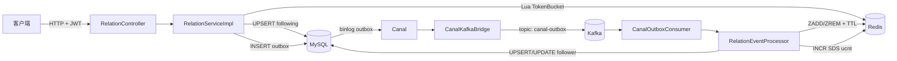
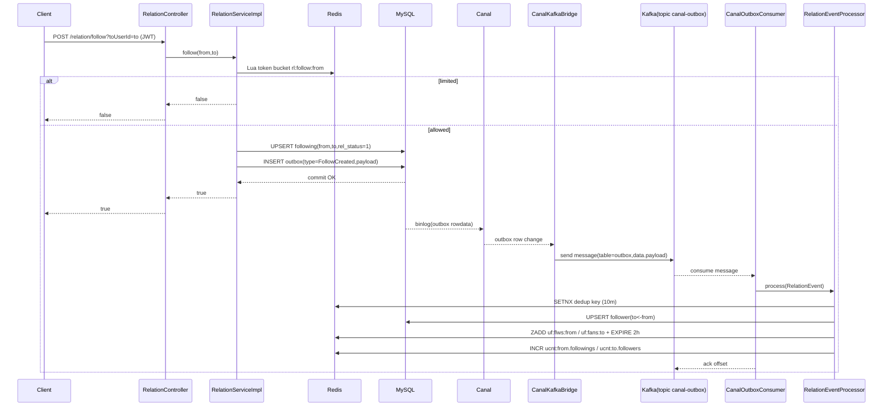
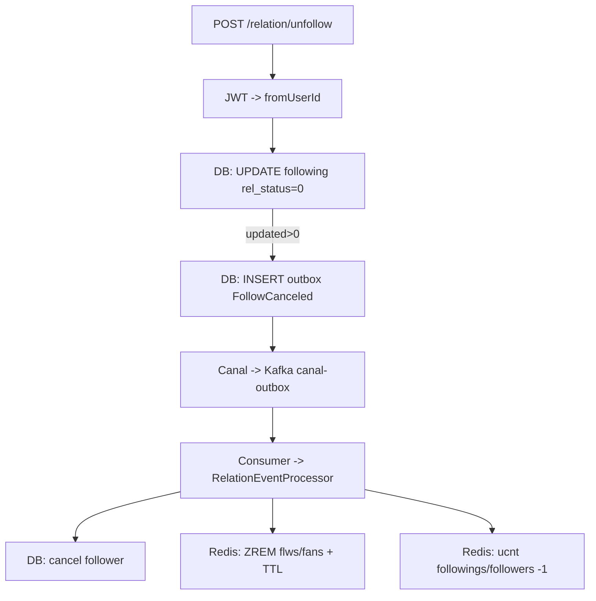

# 知光后端：用户关系系统全链路说明与复现方案

- 生成日期：2026-03-05
- 目标读者：另一个 Codex agent（可照本文复现实现）
- 覆盖范围：关注/取关、关系三态、关注/粉丝列表（偏移+游标）、用户维度计数（SDS）、Outbox→Canal→Kafka 异步链路、缓存一致性与自检重建

---

## 0. 需求理解确认（按你的规则走）

基于现有信息，我理解你的需求是：**在本地仓库 `zhiguang_be` 中，把“用户关系系统”完整拆开讲清楚**——包括所有链路（同步写链路、异步事件链路、读链路、缓存回填链路、计数自检/重建链路），并为每条链路给出**流程图**；最后再写一份**足够详细的复现实现方案**，让另一个 Codex agent 不需要读原代码也能重建同等系统。

如果你指的“用户关系”除了关注/粉丝（例如拉黑、好友、私信关系）也要覆盖，请告诉我；当前仓库里实现的是**关注关系**。

---

## 1) 结论（Linus 三选一）

✅ **值得做**：仓库里这套关系系统是典型的“主表 + 伪从 + 缓存 + 事件驱动”的组合；链路多、隐含约束多，不写成可复现文档，别人基本不可能稳定复刻。

---

## 2) 系统总览（你先看清“数据长什么样”，再谈代码）

### 2.1 核心数据结构（最重要）

**关系事实（Source of Truth）**：MySQL `following` 表  
`(from_user_id -> to_user_id, rel_status)`

**伪从（Pseudo replica）**：MySQL `follower` 表  
`(to_user_id <- from_user_id, rel_status)`  
它不直接由 API 写入，而是靠事件异步同步。

**缓存（读优化 + 降 DB 压力）**：Redis ZSet

- 关注列表：`uf:flws:{userId}` → `ZSet(member=toUserId, score=timestamp_ms)`
- 粉丝列表：`uf:fans:{userId}` → `ZSet(member=fromUserId, score=timestamp_ms)`

**计数（用户维度）**：Redis SDS（固定 20 字节二进制结构）

- Key：`ucnt:{userId}`
- Value：`5 段 × 4 字节`（大端 int32）
  1. followings（关注数）
  2. followers（粉丝数）
  3. posts（发文数）
  4. likedPosts（获赞数，作者维度累计）
  5. favedPosts（获藏数，作者维度累计）

**异步事件（驱动伪从/缓存/计数更新）**：Outbox + Canal + Kafka

- MySQL `outbox` 表：事务内写入领域事件（payload 为 JSON）
- Canal 订阅 `outbox` 的 binlog
- `CanalKafkaBridge` 将 binlog 行变更写入 Kafka topic：`canal-outbox`
- `CanalOutboxConsumer` 消费 topic，把 payload 反序列化成 `RelationEvent`，交给 `RelationEventProcessor` 落地到伪从与缓存/计数

### 2.2 一张图看全链路（架构图）



---

## 3) 数据库设计（可直接复刻）

> 对应：`db/schema.sql`、`src/main/resources/mapper/RelationMapper.xml`、`src/main/resources/mapper/OutboxMapper.xml`

### 3.1 following（主表）

用途：**关系事实**（我关注了谁）

关键约束：
- 唯一键：`(from_user_id, to_user_id)`，防止重复关系
- 软删除：`rel_status=0` 表示取消关注

```sql
CREATE TABLE following (
  id BIGINT UNSIGNED NOT NULL,
  from_user_id BIGINT UNSIGNED NOT NULL,
  to_user_id BIGINT UNSIGNED NOT NULL,
  rel_status TINYINT NOT NULL DEFAULT 1,
  created_at DATETIME(3) NOT NULL,
  updated_at DATETIME(3) NOT NULL,
  PRIMARY KEY (id),
  UNIQUE KEY uk_from_to (from_user_id, to_user_id),
  KEY idx_from_created (from_user_id, created_at, to_user_id, rel_status),
  KEY idx_to (to_user_id, from_user_id, rel_status)
) ENGINE=InnoDB DEFAULT CHARSET=utf8mb4;
```

### 3.2 follower（伪从表）

用途：**反向查询加速**（谁关注了我 / 粉丝列表）

```sql
CREATE TABLE follower (
  id BIGINT UNSIGNED NOT NULL,
  to_user_id BIGINT UNSIGNED NOT NULL,
  from_user_id BIGINT UNSIGNED NOT NULL,
  rel_status TINYINT NOT NULL DEFAULT 1,
  created_at DATETIME(3) NOT NULL,
  updated_at DATETIME(3) NOT NULL,
  PRIMARY KEY (id),
  UNIQUE KEY uk_to_from (to_user_id, from_user_id),
  KEY idx_to_created (to_user_id, created_at, from_user_id, rel_status),
  KEY idx_from (from_user_id, to_user_id, rel_status)
) ENGINE=InnoDB DEFAULT CHARSET=utf8mb4;
```

### 3.3 outbox（事件表）

用途：**同一事务里写业务事实 + 写事件**，把“异步一致性”从代码变成数据事实（binlog 可追溯）。

```sql
CREATE TABLE outbox (
  id BIGINT UNSIGNED NOT NULL,
  aggregate_type VARCHAR(64) NOT NULL,
  aggregate_id BIGINT UNSIGNED NULL,
  type VARCHAR(64) NOT NULL,
  payload JSON NOT NULL,
  created_at TIMESTAMP(3) NOT NULL DEFAULT CURRENT_TIMESTAMP(3),
  PRIMARY KEY (id),
  KEY ix_outbox_agg (aggregate_type, aggregate_id),
  KEY ix_outbox_ct (created_at)
) ENGINE=InnoDB DEFAULT CHARSET=utf8mb4;
```

---

## 4) Redis 设计（Key/结构/TTL 一次讲清）

### 4.1 关注/粉丝列表缓存（ZSet）

- `uf:flws:{userId}`：关注列表（member=toUserId）
- `uf:fans:{userId}`：粉丝列表（member=fromUserId）
- score：毫秒时间戳（用于倒序分页）
- TTL：**2 小时**（每次回填/事件更新都会刷新 TTL）

### 4.2 限流令牌桶（Hash + Lua）

- Key：`rl:follow:{fromUserId}`
- 字段：
  - `last`：上次补充时间（秒）
  - `tokens`：剩余令牌（数值）
- 配置：
  - capacity=100
  - rate=1 token / second
  - PEXPIRE=60000ms

### 4.3 事件去重（SETNX）

- Key：`dedup:rel:{type}:{from}:{to}:{id_or_0}`
- TTL：10 分钟
- 目的：Kafka 至少一次投递下的幂等控制（避免重复处理导致重复计数/重复写）

### 4.4 用户计数（SDS 固定结构）

- Key：`ucnt:{userId}`
- Value：20 bytes（5×4 bytes，大端 int32）
- 维护方式：事件驱动增量更新；读取端抽样自检不一致则重建

---

## 5) 链路 A：关注（Follow）写链路（同步 + 异步）

> 对应源码：  
> - API：`src/main/java/com/tongji/relation/api/RelationController.java`  
> - 写主表+outbox：`src/main/java/com/tongji/relation/service/impl/RelationServiceImpl.java`  
> - CDC→Kafka：`src/main/java/com/tongji/relation/outbox/CanalKafkaBridge.java`  
> - Kafka 消费：`src/main/java/com/tongji/relation/outbox/CanalOutboxConsumer.java`  
> - 落地伪从+缓存+计数：`src/main/java/com/tongji/relation/processor/RelationEventProcessor.java`

### 5.1 步骤拆解（按时间顺序）

**1）客户端发起请求**

- `POST /api/v1/relation/follow?toUserId={to}`
- Header：`Authorization: Bearer <JWT>`

**2）服务端鉴权并拿到 fromUserId**

- `RelationController.follow()` 里通过 `JwtService.extractUserId(jwt)` 得到 `fromUserId`

**3）写服务：令牌桶限流（Redis Lua）**

- 调用 Lua：`tokenBucket(key="rl:follow:{from}", capacity=100, rate=1/s)`
- 若返回 0：直接 `return false`（限流）

**4）写 following 主表（MySQL，幂等 UPSERT）**

- `INSERT INTO following ... ON DUPLICATE KEY UPDATE rel_status=1, updated_at=NOW(3)`
- 只要 MySQL 返回影响行数 >0，这一步就算成功（包括重复关注变更为 rel_status=1）

**5）同事务写 outbox 事件**

- `type=FollowCreated`
- `payload` 为 JSON（见 5.2）
- 这一步写入成功后提交事务：保证“事实 + 事件”同生共死

**6）Canal 订阅 outbox 的 binlog**

- `CanalKafkaBridge` 从 Canal 拉取 RowData 变更
- 仅转发 `INSERT/UPDATE`，并只取 `payload` 字段

**7）桥接器写入 Kafka**

- topic：`canal-outbox`
- message JSON 格式见 5.3

**8）Kafka 消费者解析 payload → RelationEvent**

- `CanalOutboxConsumer`：groupId=`relation-outbox-consumer`
- 手动 ack：全部处理完成才 `ack.acknowledge()`

**9）RelationEventProcessor 幂等处理（伪从+缓存+计数）**

- 先 `SETNX dedup:rel:...`（10 分钟），不是首次就直接 return
- FollowCreated：
  - `UPSERT follower`（伪从表）
  - `ZADD uf:flws:{from}`、`ZADD uf:fans:{to}`，并 `EXPIRE 2h`
  - `UserCounterService.incrementFollowings(from,+1)`、`incrementFollowers(to,+1)`（更新 SDS）

### 5.2 领域事件 payload（RelationEvent）

Java 定义（仓库实际结构）：

- `type`：`FollowCreated`
- `fromUserId`
- `toUserId`
- `id`：关系记录 ID（可为空；取消关注时为空）

```json
{
  "type": "FollowCreated",
  "fromUserId": 100,
  "toUserId": 200,
  "id": 987654321
}
```

### 5.3 CanalKafkaBridge 写入 Kafka 的消息格式

```json
{
  "table": "outbox",
  "type": "INSERT",
  "data": [
    { "payload": "{\"type\":\"FollowCreated\",\"fromUserId\":100,\"toUserId\":200,\"id\":987654321}" }
  ]
}
```

### 5.4 流程图（关注写链路）



---

## 6) 链路 B：取消关注（Unfollow）写链路（同步 + 异步）

### 6.1 步骤拆解

**1）请求**

- `POST /api/v1/relation/unfollow?toUserId={to}`

**2）写 following 主表（逻辑取消）**

- `UPDATE following SET rel_status=0 WHERE from_user_id=? AND to_user_id=?`
- 若更新行数 >0：认为取消成功

**3）同事务写 outbox**

- `type=FollowCanceled`
- `payload`：
  - `type=FollowCanceled`
  - `fromUserId/toUserId`
  - `id=null`（仓库实现就是空）

**4）异步处理**

- FollowCanceled：
  - `UPDATE follower SET rel_status=0 ...`
  - `ZREM uf:flws:{from} member=to`
  - `ZREM uf:fans:{to} member=from`
  - 计数 `followings-- / followers--`

### 6.2 流程图（取消关注）



---

## 7) 链路 C：关系三态查询（following / followedBy / mutual）

> 对应：`RelationServiceImpl.relationStatus()`、`RelationMapper.existsFollowing()`

### 7.1 行为定义

- `following`：我是否关注 TA（following(from=me,to=ta,rel_status=1)）
- `followedBy`：TA 是否关注我（following(from=ta,to=me,rel_status=1)）
- `mutual`：两者都为 true

### 7.2 读链路

1. `existsFollowing(me, ta)` → following
2. `existsFollowing(ta, me)` → followedBy
3. mutual = following && followedBy

```mermaid
flowchart LR
  A[GET /relation/status?toUserId=ta] --> B[DB: existsFollowing(me,ta)]
  A --> C[DB: existsFollowing(ta,me)]
  B --> D[compose result]
  C --> D
  D --> E[{following,followedBy,mutual}]
```

---

## 8) 链路 D：关注/粉丝列表读取（偏移分页：offset + limit）

> 对应：`RelationServiceImpl.following()` / `followers()` / `getListWithOffset()`

### 8.1 统一读策略：L1 → L2 → L3

- **L1：本地 Caffeine（仅大V）**
  - 缓存 Top 500（从 Redis ZSet 取）
  - 过期 10 分钟
  - Caffeine 最大 size=1000（按 userId 维度）
- **L2：Redis ZSet**
  - `reverseRange(key, offset, offset+limit-1)`
- **L3：MySQL**
  - 读取行数据（包含 createdAt），回填 ZSet（score=createdAt ms），设置 TTL=2h
  - 回填量：`need = max(1, limit+offset)`，上限 1000

### 8.2 关注列表（following）偏移分页

- Redis Key：`uf:flws:{userId}`
- DB 回填来源：`following` 表（`RelationMapper.listFollowingRows(userId, need, 0)`）

### 8.3 粉丝列表（followers）偏移分页

- Redis Key：`uf:fans:{userId}`
- DB 回填来源：`follower` 表（`RelationMapper.listFollowerRows(userId, need, 0)`）

### 8.4 流程图（偏移分页通用）

```mermaid
flowchart TD
  A[GET list(userId,limit,offset)] --> B{L1 本地缓存命中?}
  B -->|是且 offset 在 Top 内| C[返回 Top 子区间]
  B -->|否| D{L2 Redis ZSet 命中?}
  D -->|是| E[ZREVRANGE by rank 返回]
  D -->|否| F[L3 DB 读取 rows(need=max(limit+offset,1), cap 1000)]
  F -->|rows 非空| G[回填 ZSet(score=createdAt) + EXPIRE 2h]
  G --> H{大V?}
  H -->|是| I[更新本地 Top500 缓存]
  H -->|否| J[跳过]
  I --> K[ZREVRANGE 返回目标区间]
  J --> K
  F -->|rows 空| L[返回空列表]
```

---

## 9) 链路 E：关注/粉丝列表读取（游标分页：cursor + limit）

> 对应：`RelationServiceImpl.followingCursor()` / `followersCursor()` / `getListWithCursor()`

### 9.1 Cursor 定义

cursor 是毫秒时间戳（上一页最后一条的 score）。

- 第一页：`cursor = null` → `max = +∞`
- 下一页：`cursor = lastScore` → 取 `score <= cursor` 的记录

### 9.2 Redis 查询

- `ZREVRANGEBYSCORE key (-inf, max) LIMIT 0 limit`

### 9.3 Miss 回填策略

当 Redis miss：

- DB 拉取 `need=max(limit, 100)`（cap 1000）
- 回填时若 cursor 非空：只写入 `score <= cursor` 的行
- 设置 TTL=2h
- 再查一次 Redis 返回

### 9.4 流程图（游标分页通用）

```mermaid
flowchart TD
  A[GET listCursor(userId,limit,cursor)] --> B[计算 max = cursor ? cursor : +inf]
  B --> C{Redis 命中? ZREVRANGEBYSCORE}
  C -->|是| D[直接返回 IDs]
  C -->|否| E[DB 读取 rows(need=max(limit,100), cap 1000)]
  E -->|rows 非空| F[回填 ZSet(score=createdAt, 若 cursor 则 score<=cursor) + EXPIRE 2h]
  F --> G[再查 Redis ZREVRANGEBYSCORE 返回]
  E -->|rows 空| H[返回空列表]
```

---

## 10) 链路 F：列表结果“用户资料聚合”（ProfileResponse）

> 对应：`RelationServiceImpl.followingProfiles()` / `followersProfiles()` / `toProfiles()`、`UserMapper.listByIds()`

链路：

1. 先按前面链路拿到 `List<Long> ids`
2. 批量查用户：`SELECT * FROM users WHERE id IN (...)`
3. 用 Map 把用户按 id 建索引
4. 按原 ids 顺序组装 `ProfileResponse[]`

```mermaid
flowchart LR
  A[List<Long> ids] --> B[DB: users WHERE id IN ids]
  B --> C[Map(id->User)]
  C --> D[按 ids 顺序映射为 ProfileResponse]
```

---

## 11) 链路 G：用户计数读取（SDS）+ 抽样自检 + 按需重建

> 对应：`RelationController.counter()`、`UserCounterServiceImpl.rebuildAllCounters()`、`RelationMapper.countFollowingActive/countFollowerActive`

### 11.1 SDS 读取规则（20 字节）

- 每段 4 字节大端
- 段序号（1 基）：
  1. followings
  2. followers
  3. posts
  4. likedPosts
  5. favedPosts

### 11.2 异常处理 1：SDS 缺失/长度异常 → 立刻重建

如果 `GET ucnt:{userId}` 返回 null 或长度 < 20：

1. 调用 `UserCounterService.rebuildAllCounters(userId)`
2. 重读 SDS
3. 仍失败则返回全 0（保证接口可用）

### 11.3 异常处理 2：抽样一致性校验（每 300 秒最多一次）

用 key `ucnt:chk:{userId}` 做节流：

- `SETNX ucnt:chk:{userId} = 1 EX 300s`
- 命中时才做校验

校验项：

- `SDS.followings` vs `DB.countFollowingActive(userId)`（following 表）
- `SDS.followers` vs `DB.countFollowerActive(userId)`（follower 表）
- 或 `seg != 5`

不一致：触发 `rebuildAllCounters` 并重读返回。

### 11.4 流程图（计数读取 + 自检重建）

```mermaid
flowchart TD
  A[GET /relation/counter?userId] --> B[Redis GET ucnt:userId]
  B --> C{raw 存在且 len>=20?}
  C -->|否| D[rebuildAllCounters(userId)]
  D --> E[重读 ucnt]
  E --> F{仍无效?}
  F -->|是| G[返回 0 0 0 0 0]
  F -->|否| H[继续]
  C -->|是| H[继续]
  H --> I{300s 抽样校验触发? SETNX ucnt:chk}
  I -->|否| J[直接按 SDS 返回]
  I -->|是| K[DB count following/follower]
  K --> L{与 SDS 一致且 seg=5?}
  L -->|是| J
  L -->|否| M[rebuildAllCounters + 重读 + 返回]
```

---

## 12) 复现实现方案（给另一个 Codex agent 的“照做清单”）

下面是“按模块拆分 + 接口契约 + 关键实现细节 + 验收方式”。照着做，能复刻出与仓库一致的系统。

### 12.1 依赖与前置（必须有）

- Java 21
- Spring Boot（Web、Security、Data Redis、Kafka）
- MyBatis + MySQL
- Redis（用于 ZSet、SDS、去重、限流）
- Kafka（topic：`canal-outbox`）
- Canal（订阅 MySQL binlog，或替换为 Debezium；本文按仓库实现写的是 Canal）
- Caffeine（大V本地 Top 缓存）

### 12.2 数据库落地（先建表）

1. 创建 `following`、`follower`、`outbox`（DDL 见第 3 节）
2. 确保 `following.uk_from_to` 和 `follower.uk_to_from` 生效（否则幂等 UPSERT 全废）

### 12.3 领域模型与事件（最小集合）

**RelationEvent**

```pseudocode
record RelationEvent(type, fromUserId, toUserId, id)
```

事件类型约定：
- `FollowCreated`
- `FollowCanceled`

### 12.4 MyBatis Mapper（SQL 契约要对齐）

**RelationMapper**

必须包含：

- `insertFollowing(id, from, to, relStatus)`：UPSERT following
- `cancelFollowing(from,to)`：rel_status=0
- `insertFollower(id, to, from, relStatus)`：UPSERT follower
- `cancelFollower(to, from)`：rel_status=0
- `existsFollowing(from,to)`：COUNT rel_status=1
- `listFollowingRows(from, limit, offset)`：返回 `toUserId, createdAt`
- `listFollowerRows(to, limit, offset)`：返回 `fromUserId, createdAt`
- `countFollowingActive(from)`、`countFollowerActive(to)`

**OutboxMapper**

- `insert(outboxId, aggregateType, aggregateId, type, payloadJson)`

### 12.5 写服务（follow/unfollow）——必须“事务内写 following + outbox”

**接口**

```pseudocode
boolean follow(fromUserId, toUserId)
boolean unfollow(fromUserId, toUserId)
```

**follow(from,to) 伪代码**

```pseudocode
if tokenBucketAcquire("rl:follow:{from}", capacity=100, rate=1/s) == false:
  return false

begin transaction
  relId = randomLong()
  affected = UPSERT following(relId, from, to, rel_status=1)
  if affected > 0:
    outId = randomLong()
    payload = JSON(RelationEvent("FollowCreated", from, to, relId))
    INSERT outbox(outId, aggregate_type="following", aggregate_id=relId, type="FollowCreated", payload)
    commit
    return true
  rollback
  return false
```

**unfollow(from,to) 伪代码**

```pseudocode
begin transaction
  affected = UPDATE following SET rel_status=0 WHERE from,to
  if affected > 0:
    outId = randomLong()
    payload = JSON(RelationEvent("FollowCanceled", from, to, id=null))
    INSERT outbox(outId, aggregate_type="following", aggregate_id=null, type="FollowCanceled", payload)
    commit
    return true
  rollback
  return false
```

> 注意：仓库实现里 follow/unfollow 对 outbox 写入失败是吞掉异常的（try/catch ignored）。复刻时如果要“完全一致”，也这么做；但这会让系统更难排障。

### 12.6 限流 Lua（令牌桶）

要求：**原子补充 + 原子扣减**，并且 key 60s 自动过期。

```pseudocode
HGET last,tokens
if empty: last=now; tokens=capacity
elapsed = now-last
tokens = min(capacity, tokens + elapsed*rate)
if tokens < 1: HSET(last,tokens); PEXPIRE 60s; return 0
tokens -= 1; HSET(last,tokens); PEXPIRE 60s; return 1
```

### 12.7 Outbox → Kafka（CanalKafkaBridge）

目标：把 outbox 表的行变更转成 Kafka 消息，**至少一次**投递。

**关键点**

- `connector.getWithoutAck(batchSize)` 拉取
- 成功处理完 batch 后 `connector.ack(batchId)`
- 只关心 `EntryType=ROWDATA`，只转发 `INSERT/UPDATE`
- 只提取列名为 `payload` 的值（JSON 字符串）
- Kafka topic 固定：`canal-outbox`

**消息格式**：见 5.3

### 12.8 Kafka 消费者（CanalOutboxConsumer）

要求：手动 ack，避免“处理失败但位点已提交”。

```pseudocode
onMessage(message, ack):
  rows = extractRows(message)  // table==outbox && type in {INSERT,UPDATE}
  for row in rows:
    evt = parseJSON(row.payload) as RelationEvent
    processor.process(evt)
  ack()
```

### 12.9 事件处理器（RelationEventProcessor）

目标：把事件落地成三份伪从数据：

1) follower 表  
2) Redis ZSet 列表缓存  
3) Redis SDS 用户计数

**去重**

- key：`dedup:rel:{type}:{from}:{to}:{id_or_0}`
- TTL：10 分钟

**处理 FollowCreated**

```pseudocode
if SETNX(dedupKey, ttl=10m) == false: return

UPSERT follower(id=evt.id, to=evt.to, from=evt.from, rel_status=1)
now = currentTimeMillis()
ZADD uf:flws:{from} score=now member={to}; EXPIRE 2h
ZADD uf:fans:{to} score=now member={from}; EXPIRE 2h
ucnt:{from}.followings += 1   // SDS field 1
ucnt:{to}.followers += 1     // SDS field 2
```

**处理 FollowCanceled**

```pseudocode
if SETNX(dedupKey, ttl=10m) == false: return

UPDATE follower SET rel_status=0 WHERE to,from
ZREM uf:flws:{from} member={to}; EXPIRE 2h
ZREM uf:fans:{to} member={from}; EXPIRE 2h
ucnt:{from}.followings -= 1
ucnt:{to}.followers -= 1
```

### 12.10 列表读（偏移/游标）+ 大V本地缓存

实现必须满足：

- L1 Caffeine（仅大V）→ L2 Redis ZSet → L3 DB 回填
- ZSet score 用 `createdAt`（回填时）
- TTL 2h
- 回填量上限 1000
- 大V阈值：SDS followers 段值 `>= 500_000`
- 本地缓存只存 Top 500，expire 10 分钟

### 12.11 用户计数 SDS：增量更新 Lua + 重建

你至少要实现：

1. `incrementFollowings(userId, delta)`：SDS 第 1 段
2. `incrementFollowers(userId, delta)`：SDS 第 2 段
3. `rebuildAllCounters(userId)`：从 DB 重算关注/粉丝并回写 SDS

仓库实现里 `rebuildAllCounters` 还会重建 posts/获赞/获藏（依赖 knowpost 与内容计数系统），如果你只复刻“用户关系系统”，可以先只实现关注/粉丝两段。

### 12.12 验收（你要怎么证明做对了）

**场景 1：首次关注**

1. 调 `POST /relation/follow?toUserId=200` 返回 true
2. DB：`following(from=100,to=200,rel_status=1)` 存在
3. outbox：有 `FollowCreated` payload
4. 等待异步链路跑完后：
   - DB：`follower(to=200,from=100,rel_status=1)` 存在
   - Redis：`ZSCORE uf:flws:100 200` 存在
   - Redis：`ZSCORE uf:fans:200 100` 存在
   - Redis：`ucnt:100` 第 1 段 +1，`ucnt:200` 第 2 段 +1

**场景 2：取消关注**

1. `POST /relation/unfollow?toUserId=200` 返回 true
2. DB：`following rel_status=0`
3. 异步完成后：`follower rel_status=0`，ZSet member 被移除，SDS 计数递减

**场景 3：列表回填**

1. 手动删除 `uf:flws:100`
2. 调 `GET /relation/following?userId=100&limit=20&offset=0`
3. 期待：DB 回填发生，Redis key 重新出现且 TTL=2h

---

## 13) 风险点（我不替你粉饰太平）

这部分不是“为了抬杠”，而是为了让复刻的人知道哪里会炸。

1. **FollowCreated 事件幂等性并不牢靠**：去重 key 包含 `evt.id`，而 follow 写库使用随机 id + UPSERT，重复 follow 可能产生不同 id，导致重复消费时仍会重复加计数。  
   - 现有系统靠 `/relation/counter` 的抽样自检 + 重建来“兜住计数”，但 follower 表和列表缓存不一定能完全自愈。
2. **Outbox 写入异常被吞掉**（try/catch ignored）：主表写成功但 outbox 丢了，异步链路不会触发，系统会长期不一致，而且你很难排查。
3. **follower 表是伪从但缺少周期性对账/重建**：如果 Kafka/Canal 长时间故障，follower 会永久落后。

你要“复刻仓库行为”就照做；你要“做得像个工程”就修掉这些问题。

---

# Nexus 后端：用户关系系统全链路说明与复现方案

- 生成日期：2026-03-06
- 目标读者：另一个 Codex agent（可照本文复现实现）
- 覆盖范围：关注/取关、好友申请与决策、屏蔽、关系邻接缓存（Redis Set + 热门分桶）、RabbitMQ fanout、关系事件收件箱（Inbox）幂等
- 重要说明：nexus 当前关系域 **只有写接口**（`C:\Users\Administrator\Desktop\文档\project\nexus\nexus-trigger\src\main\java\cn\nexus\trigger\http\social\RelationController.java`），列表/状态读接口未对外暴露；缓存读能力主要通过 `IRelationAdjacencyCachePort` 作为内部能力存在

---

## 0. 需求理解确认（按你的规则走）

基于现有信息，我理解你的需求是：**在本地仓库 `project/nexus` 中，把“用户关系系统”按知光文档同样的颗粒度拆开讲清楚**——包括同步写链路（关注/取关/好友/屏蔽）、缓存设计与自愈（Redis 邻接集合）、异步 fanout（RabbitMQ）、Inbox 幂等（关系事件收件箱）；最后写一份足够详细的**可复刻实现方案**，让另一个 Codex agent 不需要读原代码也能重建同等系统。

如果你把“用户关系”也算上“关注分组管理/黑名单管理/列表查询 API”，nexus 当前实现只覆盖了其中一部分（分组表在 schema 里，但没看到对外 API/领域实现），我会在本文里明确写出来，避免你以为“系统已经做完了”。

---

## 1) 结论（Linus 三选一）

✅ **值得做**：nexus 这套关系系统是更“直给”的工程形态：**MySQL 存事实（user_relation）→ 同步维护反向表（user_follower）→ Redis 做邻接缓存 → MQ 做 fanout**。链路比知光少一段（没有 Outbox→Canal→Kafka），更容易复刻；但它也更依赖“写链路把所有派生数据都维护好”，并且当前实现里有几处明显的工程缺陷（inbox 指纹不一致、幂等/重放不完整、Set 无序导致读链路不可分页、好友请求 id 生成可能碰撞等）。

---

## 2) 系统总览（先看“数据长什么样”，再谈代码）

### 2.1 核心数据结构（最重要）

**关系事实（Source of Truth）**：MySQL `user_relation` 表（正向边）

- `(source_id -> target_id, relation_type, status)`
- `relation_type`：`1=关注`、`2=好友`、`3=屏蔽`
- `status`：`1=ACTIVE/通过`、`2=PENDING/待审批`、`3=REJECTED/拒绝`

**反向表（读优化 / 计数与列表的基础）**：MySQL `user_follower` 表（反向边）

- `(user_id <- follower_id)`
- 在 nexus 里它不是“异步伪从”，而是 **写链路同步维护**（follow/unfollow/friend/block 都会写/删）
- 主要用途：
  - 粉丝数 `countFollowers(userId)`
  - 粉丝列表 `selectFollowerIds(userId, offset, limit)`
  - 关注列表 `selectFollowingIds(followerId, offset, limit)`

**好友请求事实（审批状态）**：MySQL `friend_request`

- `(request_id, source_id, target_id, status)`
- 这是好友关系的“前置状态机”，通过 decision 才会落 `user_relation(type=FRIEND)` 与 `user_follower`

**缓存（读优化 + DB 回源自愈）**：Redis Set（邻接集合）

- 关注集合：`social:adj:following:{sourceId}` → `SET(targetId)`
- 粉丝集合（普通用户）：`social:adj:followers:{targetId}` → `SET(sourceId)`
- 粉丝集合（热门用户分桶）：`social:adj:followers:bucket:{targetId}:b0..b3` → `SET(sourceId)`

**异步 fanout（不是事实，只是通知下游）**：RabbitMQ direct exchange

- exchange：`social.relation`
- routingKey：`relation.follow` / `relation.friend` / `relation.block`
- queue：`relation.follow.queue` / `relation.friend.queue` / `relation.block.queue`

**Inbox（幂等/补偿的“地基”，但当前没把房子盖完）**：MySQL `relation_event_inbox`

- 按 `fingerprint` 唯一去重，理论上用于“事件去重 / 重放 / 清理”
- 现状：Producer/Consumer 都写 inbox，但 fingerprint 规则不一致（下面会骂）

### 2.2 一张图看全链路（架构图）

```mermaid
flowchart LR
  Client[客户端] -->|HTTP| RC[RelationController]
  RC --> RS[RelationService]

  RS -->|UPSERT/DELETE| UR[(MySQL user_relation)]
  RS -->|INSERT/DELETE| UF[(MySQL user_follower)]
  RS -->|INSERT/UPDATE| FR[(MySQL friend_request)]
  RS -->|SADD/SREM| Redis[(Redis 邻接缓存)]

  RS --> REP[RelationEventPort]
  REP -->|INSERT NEW| Inbox[(MySQL relation_event_inbox)]
  REP -->|publish| MQ[(RabbitMQ exchange: social.relation)]

  MQ --> L[RelationEventListener]
  L -->|INSERT NEW(幂等)| Inbox
  L -->|调用下游| Downstream[Feed/通知/风控等]
  L -->|mark DONE| Inbox
```

---

## 3) 数据库设计（可直接复刻）

> schema 来源：`C:\Users\Administrator\Desktop\文档\project\nexus\docs\social_schema.sql`  \n> SQL 映射：`C:\Users\Administrator\Desktop\文档\project\nexus\nexus-infrastructure\src\main\resources\mapper\social\RelationMapper.xml` 等

### 3.1 user_relation（关系事实表：正向边）

用途：**我关注/好友/屏蔽了谁**（事实源）

```sql
CREATE TABLE IF NOT EXISTS `user_relation` (
  `id` BIGINT NOT NULL,
  `source_id` BIGINT NOT NULL COMMENT '发起方ID (Sharding Key)',
  `target_id` BIGINT NOT NULL COMMENT '目标方ID',
  `relation_type` TINYINT NOT NULL COMMENT '1关注，2好友，3屏蔽',
  `status` TINYINT DEFAULT 1 COMMENT '1正常/通过，2待审批，3已拒绝',
  `group_id` BIGINT DEFAULT 0 COMMENT '分组ID（关注分组）',
  `version` BIGINT DEFAULT 0 COMMENT '乐观锁',
  `create_time` DATETIME DEFAULT CURRENT_TIMESTAMP,
  PRIMARY KEY (`id`),
  UNIQUE KEY `uk_source_target_type` (`source_id`, `target_id`, `relation_type`),
  KEY `idx_source_status` (`source_id`, `status`)
) ENGINE=InnoDB DEFAULT CHARSET=utf8mb4 COMMENT='用户关系正向表';
```

**落库行为（MyBatis）**：`insertOrUpdate` 使用 `ON DUPLICATE KEY UPDATE`，会把 `status/group_id` 更新，并 `version+1`。见：`C:\Users\Administrator\Desktop\文档\project\nexus\nexus-infrastructure\src\main\resources\mapper\social\RelationMapper.xml`。

### 3.2 user_follower（反向表：粉丝边）

用途：**谁关注了我 / 我关注了谁**（读优化 + 粉丝计数）

```sql
CREATE TABLE IF NOT EXISTS `user_follower` (
  `id` BIGINT NOT NULL,
  `user_id` BIGINT NOT NULL COMMENT '被关注者ID (Sharding Key)',
  `follower_id` BIGINT NOT NULL COMMENT '粉丝ID',
  `create_time` DATETIME DEFAULT CURRENT_TIMESTAMP,
  PRIMARY KEY (`id`),
  UNIQUE KEY `uk_user_follower` (`user_id`, `follower_id`),
  KEY `idx_user_time` (`user_id`, `create_time`)
) ENGINE=InnoDB DEFAULT CHARSET=utf8mb4 COMMENT='用户粉丝反向表';
```

> 注意：nexus 的业务语义里，“好友”也会写两条 follower 记录（互相成为 follower），所以 follower 不是纯粹的 follow，而是“关系邻接的一种落地”。

### 3.3 friend_request（好友请求表）

用途：好友建立前的**审批状态机**

```sql
CREATE TABLE IF NOT EXISTS `friend_request` (
  `request_id` BIGINT NOT NULL,
  `source_id` BIGINT NOT NULL,
  `target_id` BIGINT NOT NULL,
  `idempotent_key` VARCHAR(64) NOT NULL,
  `status` TINYINT DEFAULT 2 COMMENT '1通过，2待审批，3已拒绝',
  `version` BIGINT DEFAULT 0 COMMENT '乐观锁',
  `create_time` DATETIME DEFAULT CURRENT_TIMESTAMP,
  PRIMARY KEY (`request_id`),
  UNIQUE KEY `uk_idem` (`idempotent_key`),
  KEY `idx_target_status` (`target_id`, `status`)
) ENGINE=InnoDB DEFAULT CHARSET=utf8mb4 COMMENT='好友请求';
```

### 3.4 user_privacy_setting（隐私策略）

用途：决定 follow 是否进入 `PENDING`（需要审批）

```sql
CREATE TABLE IF NOT EXISTS `user_privacy_setting` (
  `user_id` BIGINT NOT NULL,
  `need_approval` TINYINT DEFAULT 0 COMMENT '1需要审批，0公开',
  `update_time` DATETIME DEFAULT CURRENT_TIMESTAMP ON UPDATE CURRENT_TIMESTAMP,
  PRIMARY KEY (`user_id`)
) ENGINE=InnoDB DEFAULT CHARSET=utf8mb4 COMMENT='用户隐私配置';
```

### 3.5 relation_event_inbox（关系事件收件箱：幂等/重放基础）

用途：对 MQ 事件做“**唯一指纹去重** + 状态流转（NEW→DONE/FAIL）+ 清理”

```sql
CREATE TABLE IF NOT EXISTS `relation_event_inbox` (
  `id` BIGINT UNSIGNED NOT NULL AUTO_INCREMENT COMMENT '主键',
  `event_type` VARCHAR(32) NOT NULL COMMENT '事件类型 FOLLOW/FRIEND/BLOCK',
  `fingerprint` VARCHAR(128) NOT NULL COMMENT '事件指纹，唯一去重',
  `payload` TEXT NOT NULL COMMENT '事件内容序列化',
  `status` VARCHAR(32) NOT NULL DEFAULT 'NEW' COMMENT '状态 NEW/PROCESSED/FAILED',
  `create_time` DATETIME NOT NULL DEFAULT CURRENT_TIMESTAMP COMMENT '创建时间',
  `update_time` DATETIME NOT NULL DEFAULT CURRENT_TIMESTAMP ON UPDATE CURRENT_TIMESTAMP COMMENT '更新时间',
  PRIMARY KEY (`id`),
  UNIQUE KEY `uk_fingerprint` (`fingerprint`),
  KEY `idx_event_type` (`event_type`)
) ENGINE=InnoDB DEFAULT CHARSET=utf8mb4 COMMENT='关系事件收件箱';
```

> 现状问题：schema 注释是 `NEW/PROCESSED/FAILED`，但实现用的是 `NEW/DONE/FAIL`（见 `C:\Users\Administrator\Desktop\文档\project\nexus\nexus-infrastructure\src\main\java\cn\nexus\infrastructure\adapter\social\port\RelationEventInboxPort.java`）。这不是“风格问题”，这是未来对账/运维会炸的埋雷。

---

## 4) Redis 设计（Key/结构/TTL 一次讲清）

> 实现：`C:\Users\Administrator\Desktop\文档\project\nexus\nexus-infrastructure\src\main\java\cn\nexus\infrastructure\adapter\social\port\RelationAdjacencyCachePort.java`

### 4.1 邻接缓存（关注/粉丝集合）

**Key 约定**

- 关注集合：`social:adj:following:{sourceId}`（SET）
- 粉丝集合（普通）：`social:adj:followers:{targetId}`（SET）
- 粉丝集合（热门分桶）：`social:adj:followers:bucket:{targetId}:b{0..3}`（SET）

**分桶规则**

- 热门阈值：`HOT_THRESHOLD=5000`（用 DB count 判断）
- 桶数：`HOT_BUCKETS=4`
- bucketIndex：`followerId mod 4`

**一致性策略（非常关键）**

- Redis **不是事实源**，丢了就从 MySQL **重建**（rebuildFollowing/rebuildFollowers）
- list 时做“缺口检测”：`members.size < dbCount` 触发重建

> 但注意：它用的是 `SET`，**无序**；因此你只能拿“集合的一部分”，无法做稳定分页/游标。

### 4.2 关注数缓存（用于关注上限判定）

> 实现：`C:\Users\Administrator\Desktop\文档\project\nexus\nexus-infrastructure\src\main\java\cn\nexus\infrastructure\adapter\social\port\RelationCachePort.java`

- Key：`social:follow:count:{sourceId}`
- TTL：`3600s`
- 缺失回源：`SELECT COUNT(*) FROM user_relation WHERE source_id=? AND relation_type=1`

> 现状问题：`RelationService.follow/unfollow` 并没有调用 `incrFollow/decrFollow`，所以这个缓存值可能长期不准（最多靠 TTL 被动纠正）。这属于“写了一半”的典型坏味道。

### 4.3 好友请求幂等锁（防重复提交）

> 实现：`C:\Users\Administrator\Desktop\文档\project\nexus\nexus-infrastructure\src\main\java\cn\nexus\infrastructure\adapter\social\port\FriendRequestIdempotentPort.java`

- Key：`social:friend:req:idem:{sourceId-targetId}`
- 语义：`SETNX + TTL`，占用成功才允许插入 `friend_request`
- 默认 TTL：调用方传 `60s`

---

## 5) MQ + Inbox（fanout 链路）

### 5.1 RabbitMQ 拓扑

> 配置：`C:\Users\Administrator\Desktop\文档\project\nexus\nexus-trigger\src\main\java\cn\nexus\trigger\mq\config\RelationMqConfig.java`

- Exchange：`social.relation`（Direct，durable）
- RoutingKey：
  - follow：`relation.follow`
  - friend：`relation.friend`
  - block：`relation.block`
- Queue：
  - follow：`relation.follow.queue`
  - friend：`relation.friend.queue`
  - block：`relation.block.queue`

### 5.2 Producer（领域服务发布事件）

> 实现：`C:\Users\Administrator\Desktop\文档\project\nexus\nexus-infrastructure\src\main\java\cn\nexus\infrastructure\adapter\social\port\RelationEventPort.java`

关键逻辑：

1. 先写 Inbox：`relation_event_inbox(event_type, fingerprint, payload, status=NEW)`
2. 再发 MQ：`rabbitTemplate.convertAndSend(exchange, routingKey, event)`

**fingerprint 规则（Producer 侧）**

- follow：`{sourceId}:{targetId}:{status}`
- friend：`{sourceId}:{targetId}:`（status 为空字符串）
- block：`{sourceId}:{targetId}:`（status 为空字符串）

### 5.3 Consumer（trigger 层消费并 fanout）

> 实现：`C:\Users\Administrator\Desktop\文档\project\nexus\nexus-trigger\src\main\java\cn\nexus\trigger\listener\social\RelationEventListener.java`

关键点：

- 使用 `AmqpRejectAndDontRequeueException`：失败直接进死信（不重试）
- 也会写 Inbox 做幂等（但 fingerprint 不同，见风险点）

**fingerprint 规则（Consumer 侧）**

- follow：`follow:{sourceId}:{targetId}:{status}`
- friend：`friend:{sourceId}:{targetId}`
- block：`block:{sourceId}:{targetId}`

**现状结论**：Producer/Consumer 写的是同一张表，但指纹空间不一致 ⇒ **无法形成统一的幂等/重放语义**，只是在制造脏数据。

---

## 6) 写链路（HTTP → Domain → DB/Redis → MQ）

### 6.1 关注 follow

入口：`POST /api/v1/relation/follow`  \n代码：`C:\Users\Administrator\Desktop\文档\project\nexus\nexus-trigger\src\main\java\cn\nexus\trigger\http\social\RelationController.java`

领域实现：`C:\Users\Administrator\Desktop\文档\project\nexus\nexus-domain\src\main\java\cn\nexus\domain\social\service\RelationService.java`

```pseudocode
follow(sourceId, targetId):
  if invalidPair: return INVALID
  if policy.isBlocked(sourceId,targetId) or existsBlockEdgeEitherSide: return BLOCKED
  if getFollowCount(sourceId) >= 5000: return LIMIT_REACHED

  if exists user_relation(sourceId,targetId,type=FOLLOW): return status
  if exists user_relation(sourceId,targetId,type=FRIEND,status=ACTIVE): return ACTIVE

  needApprove = privacy.needApproval(targetId)
  status = needApprove ? PENDING : ACTIVE

  begin transaction
    UPSERT user_relation(id=nextId, sourceId,targetId,type=FOLLOW,status)
    INSERT user_follower(id=nextId, user_id=targetId, follower_id=sourceId)
  commit

  Redis.SADD social:adj:following:sourceId targetId
  Redis.SADD social:adj:followers:targetId sourceId (or bucket)

  Inbox.INSERT(eventType=FOLLOW, fingerprint="source:target:status", status=NEW)
  MQ.PUBLISH(exchange="social.relation", rk="relation.follow", payload={sourceId,targetId,status})

  return status
```

### 6.2 取关 unfollow（幂等）

入口：`POST /api/v1/relation/unfollow`

```pseudocode
unfollow(sourceId, targetId):
  if invalidPair: return INVALID

  if not exists user_relation(sourceId,targetId,type=FOLLOW):
    Redis best-effort remove adjacency
    DB best-effort delete user_follower(targetId,sourceId)
    return NOT_FOLLOWING

  begin transaction
    DELETE user_relation(sourceId,targetId,type=FOLLOW)
    DELETE user_follower(user_id=targetId,follower_id=sourceId)
  commit

  Redis.SREM adjacency
  Inbox.INSERT(FOLLOW, fp="source:target:UNFOLLOW")
  MQ.PUBLISH(rk="relation.follow", status="UNFOLLOW")
  return UNFOLLOWED
```

### 6.3 好友申请 friend/request（带 Redis 幂等锁）

入口：`POST /api/v1/relation/friend/request`

```pseudocode
friendRequest(sourceId, targetId):
  if invalidPair: return INVALID
  if existsBlockEdgeEitherSide: return BLOCKED
  if exists FRIEND edge either side: return ACCEPTED
  if exists friend_request(idempotent_key="source-target", status=PENDING):
    return PENDING (return existing requestId)

  if Redis.SETNX("social:friend:req:idem:source-target", ttl=60s) == false:
    // 并发/重复提交：尝试回源 request_id
    if exists friend_request(requestId=deterministicEdgeId(source,target)): return existing status
    return PENDING

  INSERT friend_request(request_id=deterministicEdgeId, idempotent_key="source-target", status=PENDING)
  return PENDING + request_id
```

> 注意：好友申请本身不发 MQ，它只是写“待处理事实”。只有 decision=ACCEPT 才会建立好友边并发事件。

### 6.4 好友决策 friend/decision（ACCEPT/REJECT）

入口：`POST /api/v1/relation/friend/decision`

```pseudocode
friendDecision(requestIds, action):
  requestIds = dedup(requestIds)
  accept = (action == "ACCEPT")

  requests = SELECT * FROM friend_request WHERE request_id IN (...)
  if missingAny: return success=false
  if any status != PENDING: return success=false

  updated = UPDATE friend_request SET status=accept?ACTIVE:REJECTED WHERE status=PENDING AND id IN (...)
  if updated != size(requestIds): return success=false
  if not accept: return success=true

  for each request:
    begin transaction (实际代码是在同一 @Transactional 方法内)
      UPSERT user_relation(source->target, type=FRIEND, status=ACTIVE)
      UPSERT user_relation(target->source, type=FRIEND, status=ACTIVE)
      INSERT user_follower(target,source)
      INSERT user_follower(source,target)
    commit

    Redis add adjacency both directions
    Inbox.INSERT(FRIEND, fp="source:target:")
    MQ.PUBLISH(rk="relation.friend")

  return success=true
```

### 6.5 屏蔽 block（强制清理双向关系）

入口：`POST /api/v1/relation/block`

```pseudocode
block(sourceId, targetId):
  if invalidPair: return INVALID

  begin transaction
    UPSERT user_relation(source->target, type=BLOCK, status=ACTIVE)

    DELETE user_relation(source->target, type=FOLLOW)
    DELETE user_relation(target->source, type=FOLLOW)
    DELETE user_relation(source->target, type=FRIEND)
    DELETE user_relation(target->source, type=FRIEND)

    DELETE friend_request between both directions
    DELETE user_follower(target,source)
    DELETE user_follower(source,target)
  commit

  Redis remove adjacency both directions
  Inbox.INSERT(BLOCK, fp="source:target:")
  MQ.PUBLISH(rk="relation.block")
  return BLOCKED
```

---

## 7) 读链路（内部能力：邻接集合读取 + 自愈重建）

> 代码：`C:\Users\Administrator\Desktop\文档\project\nexus\nexus-infrastructure\src\main\java\cn\nexus\infrastructure\adapter\social\port\RelationAdjacencyCachePort.java`

### 7.1 listFollowing（关注集合读取）

```pseudocode
listFollowing(sourceId, limit):
  key = "social:adj:following:" + sourceId
  members = SMEMBERS(key)
  dbCount = COUNT(user_relation where source_id=sourceId and relation_type=FOLLOW)

  if key missing OR members is null OR members.size < dbCount:
    rebuildFollowing(sourceId)
    members = SMEMBERS(key)

  return takeFirstN(members, limit)  // Set 无序
```

### 7.2 listFollowers（粉丝集合读取：聚合 base + bucket）

```pseudocode
listFollowers(targetId, limit):
  aggregated = SMEMBERS("social:adj:followers:" + targetId)
  for i in 0..3:
    aggregated += SMEMBERS("social:adj:followers:bucket:" + targetId + ":b" + i)

  dbCount = COUNT(user_relation where target_id=targetId and relation_type=FOLLOW)
  if aggregated.size < dbCount:
    rebuildFollowers(targetId)
    re-read aggregated

  return takeFirstN(aggregated, limit)  // Set 无序
```

### 7.3 rebuildFollowing / rebuildFollowers（缓存重建）

- rebuildFollowing：
  - 删除 `social:adj:following:{sourceId}`
  - 从 `user_relation(source_id=sourceId,type=FOLLOW)` 全量灌回
  - 若关系表为空，fallback 走 `user_follower(follower_id=sourceId)` 分页灌回（每页 1000）
- rebuildFollowers：
  - 删除 `social:adj:followers:{targetId}` + 所有 bucket key
  - 从 `user_relation(target_id=targetId,type=FOLLOW)` 全量灌回
  - 热门用户（>=5000）按 bucket 写入

---

## 8) 复刻清单（你照着做，就能在新项目里复刻出同等系统）

### 8.1 最小依赖

- MySQL：至少建 5 张表：`user_relation`、`user_follower`、`friend_request`、`user_privacy_setting`、`relation_event_inbox`
- Redis：String + Set（不需要 Lua）
- RabbitMQ：Direct Exchange + 3 个队列

### 8.2 必须复刻的接口/模块（按重要性排序）

1. **HTTP 写接口**（同路径同语义）
   - `POST /api/v1/relation/follow`
   - `POST /api/v1/relation/unfollow`
   - `POST /api/v1/relation/friend/request`
   - `POST /api/v1/relation/friend/decision`
   - `POST /api/v1/relation/block`
2. **关系领域服务**：`follow/unfollow/friendRequest/friendDecision/block`
3. **MyBatis 仓储**：`user_relation` + `user_follower` + `friend_request`
4. **Redis 邻接缓存**：add/remove/list + rebuild
5. **MQ 拓扑 + producer/consumer**：`RelationEventPort` + `RelationMqConfig` + `RelationEventListener`
6. **Inbox 表与端口**：save/markDone/markFail（即使你暂时不做重放任务，也要把“唯一指纹去重”做对）

---

## 9) 验收（你要怎么证明做对了）

### 9.1 关注 + 取关

1. 调用 `POST /api/v1/relation/follow`（source=100, target=200）
2. DB：
   - `user_relation`：存在 `(100->200,type=1,status in {1,2})`
   - `user_follower`：存在 `(user_id=200,follower_id=100)`
3. Redis：
   - `SISMEMBER social:adj:following:100 200` 为 true
   - `SISMEMBER social:adj:followers:200 100`（或 bucket key）为 true
4. MQ：`relation.follow.queue` 被消费，inbox 有 DONE 记录（注意：当前实现会写两条 inbox，见风险点）

然后调用 `POST /api/v1/relation/unfollow`（100,200）：

- DB：两张表对应记录删除
- Redis：集合成员移除
- MQ：收到 UNFOLLOW

### 9.2 好友申请幂等

1. 连续两次调 `POST /api/v1/relation/friend/request`（100,200）
2. 期待：`friend_request` 只有一条记录（`idempotent_key="100-200"`），返回同一个 `request_id`

### 9.3 好友通过

1. 调 `POST /api/v1/relation/friend/decision`（requestIds=[...], action=ACCEPT）
2. DB：
   - `user_relation`：存在 `100->200(type=2)` 与 `200->100(type=2)`
   - `user_follower`：存在两条互相关注
3. Redis：双方 `following` 都包含对方
4. MQ：`relation.friend.queue` 消费成功

### 9.4 屏蔽强一致清理

1. 先让 100 和 200 建立关注/好友关系
2. 调 `POST /api/v1/relation/block`（100,200）
3. 期待：
   - `user_relation`：只剩 `100->200(type=3)`
   - 关注/好友边双向都被清掉
   - `friend_request` 双向都清空
   - `user_follower` 双向都清空
   - Redis 邻接集合双方都不含对方

### 9.5 Redis 丢数据后的自愈

1. 手动删除 `social:adj:following:100`
2. 调用 `IRelationAdjacencyCachePort.listFollowing(100, limit=20)`
3. 期待：触发 rebuild，key 重新出现，集合成员与 DB 一致

---

## 10) 风险点（我不替你粉饰太平）

1. **没有 Outbox，MQ 与 DB 不具备事务一致性**：`@Transactional` 只能兜住 MySQL；RabbitMQ 发送在事务内执行，回滚时可能已经发出消息；提交成功时也可能因为网络失败“消息丢了”。要做成工程，你要引入 Outbox 或者事务消息机制。
2. **Inbox 状态枚举不一致**：schema 写 `NEW/PROCESSED/FAILED`，实现用 `NEW/DONE/FAIL`，长期会造成运维脚本/清理任务/报表统计全都对不上。
3. **Inbox fingerprint 规则撕裂**：Producer 指纹 `{source}:{target}:{status}`，Consumer 指纹 `follow:{source}:{target}:{status}`。同一事件会插两条记录，幂等语义也不成立。
4. **好友请求 request_id 生成可能碰撞**：`deterministicEdgeId = abs(source*37 + target)` 不是单射，碰撞会导致“更新了别人的请求记录”。这不是边缘情况，这是数学必然。
5. **Redis Set 无序**：`SMEMBERS` 没有顺序，你无法提供稳定分页/游标；如果你未来要做“关注/粉丝列表 API”，这里必须换成 ZSet（timestamp score）或分页型存储。
6. **邻接缓存重建使用 user_relation 全量扫描**：`rebuildFollowers` 从 `user_relation(target_id=...)` 回源，对大号非常重；你其实已经有 `user_follower`，更合理的是用它回源（它天然就是反向表）。
7. **关注上限缓存写了一半**：有 `incr/decr` 却没在写链路调用，导致上限判定可能失效；要么删掉（直接 DB count），要么补齐增减。

你要“复刻 nexus 当前行为”，照着实现即可；你要“做得像个工程”，先把上面这些坑填了再谈扩展。

---

# 附录：两套方案对比、优缺点与选型/融合建议（绿地项目版）

- 生成日期：2026-03-06
- 目标场景：**未上线 / 无存量数据 / 无下游依赖**（你现在的情况）
- 目标：用最少的补丁拿到“可上线、可扩展、好维护”的用户关系系统

## A) 一句话结论（给你做决策）

1. **不要原样照抄任何一套**：两套文档都自己承认有坑，照抄就是把坑搬家。
2. **骨架用“知光”的有序列表 + Outbox 思维**：ZSet + cursor 分页 + L1/L2/L3 回填这套是能对外提供列表服务的。
3. **业务语义用“Nexus”的 `user_relation` 模型**：关注/好友/屏蔽/审批都能统一表达，别再拆成多张“事实表”。

你最终应该落一个“第三方案”：`user_relation` 做事实源 + `user_follower` 做反向边（可同步写）+ Redis **ZSet** 做列表缓存 + Outbox 保证“事实与事件同生共死” + Inbox 用一个统一 eventId 做幂等。

## B) 核心差异（决定成败的那几条）

| 维度 | 知光方案 | Nexus 方案 | 真实影响 |
| --- | --- | --- | --- |
| 事件一致性 | 事务内写 outbox，CDC→Kafka 异步消费 | 事务里直接发 MQ（无 Outbox） | Nexus 会出现“DB 成功但消息丢 / DB 回滚但消息已发”这类不可控不一致 |
| 列表分页 | Redis **ZSet**（score=时间戳）支持 offset + cursor | Redis **Set**（无序），热门分桶也无序 | Nexus 天生做不了稳定分页；对外暴露列表 API 会直接烂掉 |
| 反向表维护 | `follower` 是伪从（异步落地） | `user_follower` 写链路同步维护 | 异步伪从需要对账；同步维护写放大但更可控 |
| 业务覆盖 | 主要覆盖“关注” + 列表 + 计数 | 覆盖关注/好友/屏蔽/隐私审批，但读接口未对外 | Nexus 业务更全，但工程链路更脆 |
| 幂等/去重 | Redis SETNX 去重（但 key 设计有坑） | Inbox（但 fingerprint 撕裂） | 两边都没做到“一个事件只处理一次”的干净语义 |

## C) 优缺点（不粉饰太平）

### C.1 知光方案

优点（该保留）

- **有序列表**：ZSet + cursor/offset 是能跑到上线的基础能力。
- **读分层**：L1（大V Caffeine）→ L2（Redis）→ L3（DB 回填），可控、可压测。
- **Outbox 思路正确**：把“异步一致性”从代码习惯变成数据事实（binlog 可追溯）。

缺点（照抄会踩的雷，必须先修）

1. **去重 key 设计不稳定**：`dedup` key 把 `evt.id` 放进去了，而 `FollowCreated` 的 `id` 是随机生成 + UPSERT，重复 follow 可能产生不同 id ⇒ dedup 失效 ⇒ 计数可能重复 +1（文档第 13 节已点名）。
2. **取消关注事件 id=null**：`FollowCanceled` 的 `id=null` 会把 dedup key 的 `{id_or_0}` 固定成 0，在短时间内的快速切换场景下，可能误杀合法事件（跳过处理）。
3. **Outbox 写入异常被吞掉**：主表成功但 outbox 丢失，会导致 follower/缓存/计数长期不一致且难排障（文档第 13 节已点名）。
4. **伪从 follower 缺少对账/重建**：CDC/Kafka 故障期间 follower 可能永久落后，必须补“周期对账/重建”能力。

### C.2 Nexus 方案

优点（该保留）

- **业务语义更完整**：`user_relation(relation_type + status)` 能统一表达关注/好友/屏蔽/审批。
- **强制清理语义清晰**：block 会清理双向 follow/friend + friend_request + follower + Redis，业务上是对的。
- **反向表同步写**：`user_follower` 可作为粉丝计数/列表的稳定回源底座。

缺点（照抄就是在埋雷，必须删/改）

1. **Redis Set 无序**：不支持稳定分页/游标；未来一旦要对外提供列表 API，必然返工为 ZSet（文档第 10 节已点名）。
2. **没有 Outbox**：DB 与 MQ 无事务一致性；故障时不一致不可避免（文档第 10 节已点名）。
3. **Inbox fingerprint 撕裂**：Producer/Consumer 两套 fingerprint ⇒ 一张表里写两份语义不一致的记录 ⇒ 幂等/重放根本成立不了（文档第 10 节已点名）。
4. **好友 request_id 生成碰撞**：`abs(source*37 + target)` 必然碰撞，不是边缘情况（文档第 10 节已点名）。
5. **“写了一半”的缓存**：关注数缓存有 incr/decr 端口但不在写链路调用，属于典型坏味道（文档第 10 节已点名）。

## D) 选型建议（按你要交付什么）

1. 你要对外提供“关注/粉丝列表 + 稳定翻页” → **必须采用知光的 ZSet + cursor**（Nexus Set 直接淘汰）。
2. 你要支持“好友/屏蔽/审批” → **必须采用 Nexus 的 `user_relation + friend_request + privacy` 语义**（知光那套表结构不够表达力）。
3. 绿地项目默认推荐 → **第三方案（融合）**，理由：你可以一次性把两边已知的坑删掉，不需要背历史包袱。

## E) 融合成“第三方案”的落地步骤（建议按这个顺序做）

### E.1 先定“唯一事实源”（别搞两套事实表）

- 事实源：MySQL `user_relation(source_id, target_id, relation_type, status, ...)`
- 反向边：MySQL `user_follower(user_id, follower_id, create_time, ...)`
  - 绿地项目建议：**写链路同步维护 `user_follower`**（简单可控）；后续真扛不住写放大再考虑异步化。
- 事件表：MySQL `outbox(id, type, payload, created_at, ...)`（核心：事务内写）
- 幂等表：MySQL `relation_event_inbox(event_id, event_type, payload, status, ...)`
  - 关键：**只用一个全局 eventId**（推荐直接用 outboxId），不要 fingerprint 发明比赛。

### E.2 写链路原则（好品味：消灭特殊情况）

- 事务内只做：写 `user_relation`（+必要时写 `user_follower`）+ 写 `outbox`
- 事务外再做：Redis 更新、计数更新、MQ 发布、下游 fanout
- Outbox 写失败：**直接让请求失败**（或至少硬告警 + 可补偿），不允许 try/catch 吞掉当没发生

### E.3 异步链路（你可以选实现，但原则不变）

- 原则：Outbox 是事实，消息只是派生物
- 实现选项：
  1. 继续知光的 CDC（Canal/Debezium）→ Kafka → Consumer
  2. 或者更简单：Outbox Poller 定时扫表 → 发布 MQ → 标记已发布
- 下游通知：Kafka/RabbitMQ 任选，但**不要再让 MQ 参与事实一致性**

### E.4 列表缓存与分页（必须一次做对）

- Redis 结构：关注/粉丝列表一律用 **ZSet(score=关注时间戳)**，提供 cursor 分页（必要时再补 offset）
- 缓存丢失：从 `user_follower` 回源重建（比扫 `user_relation` 更自然、更便宜）

### E.5 幂等与去重（把“唯一性”做成数据结构，不要靠运气）

- 事件幂等：inbox 唯一键 = `event_id`（outboxId）
- dedup key（如果仍用 Redis）：也只用 `event_id`，别把随机 relationId 混进去
- 这样可以一次性解决：
  - 知光：重复 follow 生成不同 id 导致 dedup 失效的问题
  - Nexus：Producer/Consumer fingerprint 撕裂的问题

## F) 绿地项目建议的最小交付切片（别一口吃成胖子）

1. v0（第一周就该能跑）：follow/unfollow + 关系三态 status + following/followers **cursor** 列表 + 基础计数
2. v1：privacy 审批（PENDING）+ friend_request + friend/decision
3. v2：block 全量清理 + 下游 fanout（Feed/通知等）
