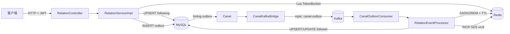
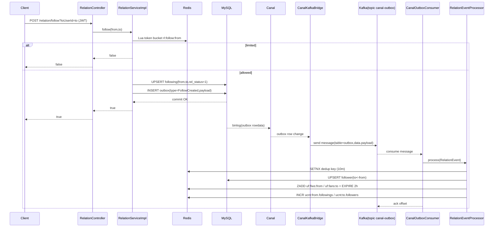
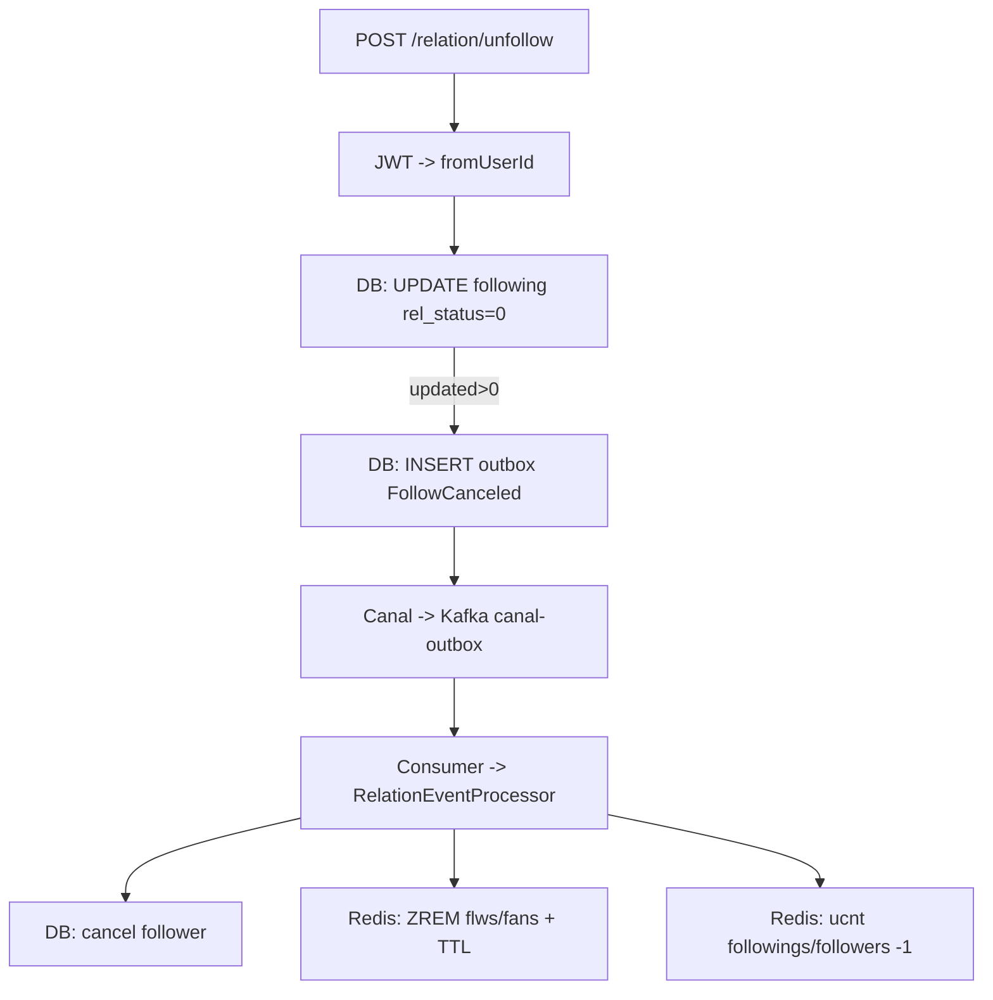

# 知光后端：用户关系系统全链路说明与复现方案

- 生成日期：2026-03-05
- 目标读者：另一个 Codex agent（可照本文复现实现）
- 覆盖范围：关注/取关、关系三态、关注/粉丝列表（偏移+游标）、用户维度计数（SDS）、Outbox→Canal→Kafka 异步链路、缓存一致性与自检重建

---

## 0. 需求理解确认（按你的规则走）

基于现有信息，我理解你的需求是：**在本地仓库 `zhiguang_be` 中，把“用户关系系统”完整拆开讲清楚**——包括所有链路（同步写链路、异步事件链路、读链路、缓存回填链路、计数自检/重建链路），并为每条链路给出**流程图**；最后再写一份**足够详细的复现实现方案**，让另一个 Codex agent 不需要读原代码也能重建同等系统。

如果你指的“用户关系”除了关注/粉丝（例如拉黑、好友、私信关系）也要覆盖，请告诉我；当前仓库里实现的是**关注关系**。

---

## 1) 结论（Linus 三选一）

✅ **值得做**：仓库里这套关系系统是典型的“主表 + 伪从 + 缓存 + 事件驱动”的组合；链路多、隐含约束多，不写成可复现文档，别人基本不可能稳定复刻。

---

## 2) 系统总览（你先看清“数据长什么样”，再谈代码）

### 2.1 核心数据结构（最重要）

**关系事实（Source of Truth）**：MySQL `following` 表  
`(from_user_id -> to_user_id, rel_status)`

**伪从（Pseudo replica）**：MySQL `follower` 表  
`(to_user_id <- from_user_id, rel_status)`  
它不直接由 API 写入，而是靠事件异步同步。

**缓存（读优化 + 降 DB 压力）**：Redis ZSet

- 关注列表：`uf:flws:{userId}` → `ZSet(member=toUserId, score=timestamp_ms)`
- 粉丝列表：`uf:fans:{userId}` → `ZSet(member=fromUserId, score=timestamp_ms)`

**计数（用户维度）**：Redis SDS（固定 20 字节二进制结构）

- Key：`ucnt:{userId}`
- Value：`5 段 × 4 字节`（大端 int32）
  1. followings（关注数）
  2. followers（粉丝数）
  3. posts（发文数）
  4. likedPosts（获赞数，作者维度累计）
  5. favedPosts（获藏数，作者维度累计）

**异步事件（驱动伪从/缓存/计数更新）**：Outbox + Canal + Kafka

- MySQL `outbox` 表：事务内写入领域事件（payload 为 JSON）
- Canal 订阅 `outbox` 的 binlog
- `CanalKafkaBridge` 将 binlog 行变更写入 Kafka topic：`canal-outbox`
- `CanalOutboxConsumer` 消费 topic，把 payload 反序列化成 `RelationEvent`，交给 `RelationEventProcessor` 落地到伪从与缓存/计数

### 2.2 一张图看全链路（架构图）



---

## 3) 数据库设计（可直接复刻）

> 对应：`db/schema.sql`、`src/main/resources/mapper/RelationMapper.xml`、`src/main/resources/mapper/OutboxMapper.xml`

### 3.1 following（主表）

用途：**关系事实**（我关注了谁）

关键约束：
- 唯一键：`(from_user_id, to_user_id)`，防止重复关系
- 软删除：`rel_status=0` 表示取消关注

```sql
CREATE TABLE following (
  id BIGINT UNSIGNED NOT NULL,
  from_user_id BIGINT UNSIGNED NOT NULL,
  to_user_id BIGINT UNSIGNED NOT NULL,
  rel_status TINYINT NOT NULL DEFAULT 1,
  created_at DATETIME(3) NOT NULL,
  updated_at DATETIME(3) NOT NULL,
  PRIMARY KEY (id),
  UNIQUE KEY uk_from_to (from_user_id, to_user_id),
  KEY idx_from_created (from_user_id, created_at, to_user_id, rel_status),
  KEY idx_to (to_user_id, from_user_id, rel_status)
) ENGINE=InnoDB DEFAULT CHARSET=utf8mb4;
```

### 3.2 follower（伪从表）

用途：**反向查询加速**（谁关注了我 / 粉丝列表）

```sql
CREATE TABLE follower (
  id BIGINT UNSIGNED NOT NULL,
  to_user_id BIGINT UNSIGNED NOT NULL,
  from_user_id BIGINT UNSIGNED NOT NULL,
  rel_status TINYINT NOT NULL DEFAULT 1,
  created_at DATETIME(3) NOT NULL,
  updated_at DATETIME(3) NOT NULL,
  PRIMARY KEY (id),
  UNIQUE KEY uk_to_from (to_user_id, from_user_id),
  KEY idx_to_created (to_user_id, created_at, from_user_id, rel_status),
  KEY idx_from (from_user_id, to_user_id, rel_status)
) ENGINE=InnoDB DEFAULT CHARSET=utf8mb4;
```

### 3.3 outbox（事件表）

用途：**同一事务里写业务事实 + 写事件**，把“异步一致性”从代码变成数据事实（binlog 可追溯）。

```sql
CREATE TABLE outbox (
  id BIGINT UNSIGNED NOT NULL,
  aggregate_type VARCHAR(64) NOT NULL,
  aggregate_id BIGINT UNSIGNED NULL,
  type VARCHAR(64) NOT NULL,
  payload JSON NOT NULL,
  created_at TIMESTAMP(3) NOT NULL DEFAULT CURRENT_TIMESTAMP(3),
  PRIMARY KEY (id),
  KEY ix_outbox_agg (aggregate_type, aggregate_id),
  KEY ix_outbox_ct (created_at)
) ENGINE=InnoDB DEFAULT CHARSET=utf8mb4;
```

---

## 4) Redis 设计（Key/结构/TTL 一次讲清）

### 4.1 关注/粉丝列表缓存（ZSet）

- `uf:flws:{userId}`：关注列表（member=toUserId）
- `uf:fans:{userId}`：粉丝列表（member=fromUserId）
- score：毫秒时间戳（用于倒序分页）
- TTL：**2 小时**（每次回填/事件更新都会刷新 TTL）

### 4.2 限流令牌桶（Hash + Lua）

- Key：`rl:follow:{fromUserId}`
- 字段：
  - `last`：上次补充时间（秒）
  - `tokens`：剩余令牌（数值）
- 配置：
  - capacity=100
  - rate=1 token / second
  - PEXPIRE=60000ms

### 4.3 事件去重（SETNX）

- Key：`dedup:rel:{type}:{from}:{to}:{id_or_0}`
- TTL：10 分钟
- 目的：Kafka 至少一次投递下的幂等控制（避免重复处理导致重复计数/重复写）

### 4.4 用户计数（SDS 固定结构）

- Key：`ucnt:{userId}`
- Value：20 bytes（5×4 bytes，大端 int32）
- 维护方式：事件驱动增量更新；读取端抽样自检不一致则重建

---

## 5) 链路 A：关注（Follow）写链路（同步 + 异步）

> 对应源码：  
> - API：`src/main/java/com/tongji/relation/api/RelationController.java`  
> - 写主表+outbox：`src/main/java/com/tongji/relation/service/impl/RelationServiceImpl.java`  
> - CDC→Kafka：`src/main/java/com/tongji/relation/outbox/CanalKafkaBridge.java`  
> - Kafka 消费：`src/main/java/com/tongji/relation/outbox/CanalOutboxConsumer.java`  
> - 落地伪从+缓存+计数：`src/main/java/com/tongji/relation/processor/RelationEventProcessor.java`

### 5.1 步骤拆解（按时间顺序）

**1）客户端发起请求**

- `POST /api/v1/relation/follow?toUserId={to}`
- Header：`Authorization: Bearer <JWT>`

**2）服务端鉴权并拿到 fromUserId**

- `RelationController.follow()` 里通过 `JwtService.extractUserId(jwt)` 得到 `fromUserId`

**3）写服务：令牌桶限流（Redis Lua）**

- 调用 Lua：`tokenBucket(key="rl:follow:{from}", capacity=100, rate=1/s)`
- 若返回 0：直接 `return false`（限流）

**4）写 following 主表（MySQL，幂等 UPSERT）**

- `INSERT INTO following ... ON DUPLICATE KEY UPDATE rel_status=1, updated_at=NOW(3)`
- 只要 MySQL 返回影响行数 >0，这一步就算成功（包括重复关注变更为 rel_status=1）

**5）同事务写 outbox 事件**

- `type=FollowCreated`
- `payload` 为 JSON（见 5.2）
- 这一步写入成功后提交事务：保证“事实 + 事件”同生共死

**6）Canal 订阅 outbox 的 binlog**

- `CanalKafkaBridge` 从 Canal 拉取 RowData 变更
- 仅转发 `INSERT/UPDATE`，并只取 `payload` 字段

**7）桥接器写入 Kafka**

- topic：`canal-outbox`
- message JSON 格式见 5.3

**8）Kafka 消费者解析 payload → RelationEvent**

- `CanalOutboxConsumer`：groupId=`relation-outbox-consumer`
- 手动 ack：全部处理完成才 `ack.acknowledge()`

**9）RelationEventProcessor 幂等处理（伪从+缓存+计数）**

- 先 `SETNX dedup:rel:...`（10 分钟），不是首次就直接 return
- FollowCreated：
  - `UPSERT follower`（伪从表）
  - `ZADD uf:flws:{from}`、`ZADD uf:fans:{to}`，并 `EXPIRE 2h`
  - `UserCounterService.incrementFollowings(from,+1)`、`incrementFollowers(to,+1)`（更新 SDS）

### 5.2 领域事件 payload（RelationEvent）

Java 定义（仓库实际结构）：

- `type`：`FollowCreated`
- `fromUserId`
- `toUserId`
- `id`：关系记录 ID（可为空；取消关注时为空）

```json
{
  "type": "FollowCreated",
  "fromUserId": 100,
  "toUserId": 200,
  "id": 987654321
}
```

### 5.3 CanalKafkaBridge 写入 Kafka 的消息格式

```json
{
  "table": "outbox",
  "type": "INSERT",
  "data": [
    { "payload": "{\"type\":\"FollowCreated\",\"fromUserId\":100,\"toUserId\":200,\"id\":987654321}" }
  ]
}
```

### 5.4 流程图（关注写链路）



---

## 6) 链路 B：取消关注（Unfollow）写链路（同步 + 异步）

### 6.1 步骤拆解

**1）请求**

- `POST /api/v1/relation/unfollow?toUserId={to}`

**2）写 following 主表（逻辑取消）**

- `UPDATE following SET rel_status=0 WHERE from_user_id=? AND to_user_id=?`
- 若更新行数 >0：认为取消成功

**3）同事务写 outbox**

- `type=FollowCanceled`
- `payload`：
  - `type=FollowCanceled`
  - `fromUserId/toUserId`
  - `id=null`（仓库实现就是空）

**4）异步处理**

- FollowCanceled：
  - `UPDATE follower SET rel_status=0 ...`
  - `ZREM uf:flws:{from} member=to`
  - `ZREM uf:fans:{to} member=from`
  - 计数 `followings-- / followers--`

### 6.2 流程图（取消关注）



---

## 7) 链路 C：关系三态查询（following / followedBy / mutual）

> 对应：`RelationServiceImpl.relationStatus()`、`RelationMapper.existsFollowing()`

### 7.1 行为定义

- `following`：我是否关注 TA（following(from=me,to=ta,rel_status=1)）
- `followedBy`：TA 是否关注我（following(from=ta,to=me,rel_status=1)）
- `mutual`：两者都为 true

### 7.2 读链路

1. `existsFollowing(me, ta)` → following
2. `existsFollowing(ta, me)` → followedBy
3. mutual = following && followedBy

```mermaid
flowchart LR
  A[GET /relation/status?toUserId=ta] --> B[DB: existsFollowing(me,ta)]
  A --> C[DB: existsFollowing(ta,me)]
  B --> D[compose result]
  C --> D
  D --> E[{following,followedBy,mutual}]
```

---

## 8) 链路 D：关注/粉丝列表读取（偏移分页：offset + limit）

> 对应：`RelationServiceImpl.following()` / `followers()` / `getListWithOffset()`

### 8.1 统一读策略：L1 → L2 → L3

- **L1：本地 Caffeine（仅大V）**
  - 缓存 Top 500（从 Redis ZSet 取）
  - 过期 10 分钟
  - Caffeine 最大 size=1000（按 userId 维度）
- **L2：Redis ZSet**
  - `reverseRange(key, offset, offset+limit-1)`
- **L3：MySQL**
  - 读取行数据（包含 createdAt），回填 ZSet（score=createdAt ms），设置 TTL=2h
  - 回填量：`need = max(1, limit+offset)`，上限 1000

### 8.2 关注列表（following）偏移分页

- Redis Key：`uf:flws:{userId}`
- DB 回填来源：`following` 表（`RelationMapper.listFollowingRows(userId, need, 0)`）

### 8.3 粉丝列表（followers）偏移分页

- Redis Key：`uf:fans:{userId}`
- DB 回填来源：`follower` 表（`RelationMapper.listFollowerRows(userId, need, 0)`）

### 8.4 流程图（偏移分页通用）

```mermaid
flowchart TD
  A[GET list(userId,limit,offset)] --> B{L1 本地缓存命中?}
  B -->|是且 offset 在 Top 内| C[返回 Top 子区间]
  B -->|否| D{L2 Redis ZSet 命中?}
  D -->|是| E[ZREVRANGE by rank 返回]
  D -->|否| F[L3 DB 读取 rows(need=max(limit+offset,1), cap 1000)]
  F -->|rows 非空| G[回填 ZSet(score=createdAt) + EXPIRE 2h]
  G --> H{大V?}
  H -->|是| I[更新本地 Top500 缓存]
  H -->|否| J[跳过]
  I --> K[ZREVRANGE 返回目标区间]
  J --> K
  F -->|rows 空| L[返回空列表]
```

---

## 9) 链路 E：关注/粉丝列表读取（游标分页：cursor + limit）

> 对应：`RelationServiceImpl.followingCursor()` / `followersCursor()` / `getListWithCursor()`

### 9.1 Cursor 定义

cursor 是毫秒时间戳（上一页最后一条的 score）。

- 第一页：`cursor = null` → `max = +∞`
- 下一页：`cursor = lastScore` → 取 `score <= cursor` 的记录

### 9.2 Redis 查询

- `ZREVRANGEBYSCORE key (-inf, max) LIMIT 0 limit`

### 9.3 Miss 回填策略

当 Redis miss：

- DB 拉取 `need=max(limit, 100)`（cap 1000）
- 回填时若 cursor 非空：只写入 `score <= cursor` 的行
- 设置 TTL=2h
- 再查一次 Redis 返回

### 9.4 流程图（游标分页通用）

```mermaid
flowchart TD
  A[GET listCursor(userId,limit,cursor)] --> B[计算 max = cursor ? cursor : +inf]
  B --> C{Redis 命中? ZREVRANGEBYSCORE}
  C -->|是| D[直接返回 IDs]
  C -->|否| E[DB 读取 rows(need=max(limit,100), cap 1000)]
  E -->|rows 非空| F[回填 ZSet(score=createdAt, 若 cursor 则 score<=cursor) + EXPIRE 2h]
  F --> G[再查 Redis ZREVRANGEBYSCORE 返回]
  E -->|rows 空| H[返回空列表]
```

---

## 10) 链路 F：列表结果“用户资料聚合”（ProfileResponse）

> 对应：`RelationServiceImpl.followingProfiles()` / `followersProfiles()` / `toProfiles()`、`UserMapper.listByIds()`

链路：

1. 先按前面链路拿到 `List<Long> ids`
2. 批量查用户：`SELECT * FROM users WHERE id IN (...)`
3. 用 Map 把用户按 id 建索引
4. 按原 ids 顺序组装 `ProfileResponse[]`

```mermaid
flowchart LR
  A[List<Long> ids] --> B[DB: users WHERE id IN ids]
  B --> C[Map(id->User)]
  C --> D[按 ids 顺序映射为 ProfileResponse]
```

---

## 11) 链路 G：用户计数读取（SDS）+ 抽样自检 + 按需重建

> 对应：`RelationController.counter()`、`UserCounterServiceImpl.rebuildAllCounters()`、`RelationMapper.countFollowingActive/countFollowerActive`

### 11.1 SDS 读取规则（20 字节）

- 每段 4 字节大端
- 段序号（1 基）：
  1. followings
  2. followers
  3. posts
  4. likedPosts
  5. favedPosts

### 11.2 异常处理 1：SDS 缺失/长度异常 → 立刻重建

如果 `GET ucnt:{userId}` 返回 null 或长度 < 20：

1. 调用 `UserCounterService.rebuildAllCounters(userId)`
2. 重读 SDS
3. 仍失败则返回全 0（保证接口可用）

### 11.3 异常处理 2：抽样一致性校验（每 300 秒最多一次）

用 key `ucnt:chk:{userId}` 做节流：

- `SETNX ucnt:chk:{userId} = 1 EX 300s`
- 命中时才做校验

校验项：

- `SDS.followings` vs `DB.countFollowingActive(userId)`（following 表）
- `SDS.followers` vs `DB.countFollowerActive(userId)`（follower 表）
- 或 `seg != 5`

不一致：触发 `rebuildAllCounters` 并重读返回。

### 11.4 流程图（计数读取 + 自检重建）

```mermaid
flowchart TD
  A[GET /relation/counter?userId] --> B[Redis GET ucnt:userId]
  B --> C{raw 存在且 len>=20?}
  C -->|否| D[rebuildAllCounters(userId)]
  D --> E[重读 ucnt]
  E --> F{仍无效?}
  F -->|是| G[返回 0 0 0 0 0]
  F -->|否| H[继续]
  C -->|是| H[继续]
  H --> I{300s 抽样校验触发? SETNX ucnt:chk}
  I -->|否| J[直接按 SDS 返回]
  I -->|是| K[DB count following/follower]
  K --> L{与 SDS 一致且 seg=5?}
  L -->|是| J
  L -->|否| M[rebuildAllCounters + 重读 + 返回]
```

---

## 12) 复现实现方案（给另一个 Codex agent 的“照做清单”）

下面是“按模块拆分 + 接口契约 + 关键实现细节 + 验收方式”。照着做，能复刻出与仓库一致的系统。

### 12.1 依赖与前置（必须有）

- Java 21
- Spring Boot（Web、Security、Data Redis、Kafka）
- MyBatis + MySQL
- Redis（用于 ZSet、SDS、去重、限流）
- Kafka（topic：`canal-outbox`）
- Canal（订阅 MySQL binlog，或替换为 Debezium；本文按仓库实现写的是 Canal）
- Caffeine（大V本地 Top 缓存）

### 12.2 数据库落地（先建表）

1. 创建 `following`、`follower`、`outbox`（DDL 见第 3 节）
2. 确保 `following.uk_from_to` 和 `follower.uk_to_from` 生效（否则幂等 UPSERT 全废）

### 12.3 领域模型与事件（最小集合）

**RelationEvent**

```pseudocode
record RelationEvent(type, fromUserId, toUserId, id)
```

事件类型约定：
- `FollowCreated`
- `FollowCanceled`

### 12.4 MyBatis Mapper（SQL 契约要对齐）

**RelationMapper**

必须包含：

- `insertFollowing(id, from, to, relStatus)`：UPSERT following
- `cancelFollowing(from,to)`：rel_status=0
- `insertFollower(id, to, from, relStatus)`：UPSERT follower
- `cancelFollower(to, from)`：rel_status=0
- `existsFollowing(from,to)`：COUNT rel_status=1
- `listFollowingRows(from, limit, offset)`：返回 `toUserId, createdAt`
- `listFollowerRows(to, limit, offset)`：返回 `fromUserId, createdAt`
- `countFollowingActive(from)`、`countFollowerActive(to)`

**OutboxMapper**

- `insert(outboxId, aggregateType, aggregateId, type, payloadJson)`

### 12.5 写服务（follow/unfollow）——必须“事务内写 following + outbox”

**接口**

```pseudocode
boolean follow(fromUserId, toUserId)
boolean unfollow(fromUserId, toUserId)
```

**follow(from,to) 伪代码**

```pseudocode
if tokenBucketAcquire("rl:follow:{from}", capacity=100, rate=1/s) == false:
  return false

begin transaction
  relId = randomLong()
  affected = UPSERT following(relId, from, to, rel_status=1)
  if affected > 0:
    outId = randomLong()
    payload = JSON(RelationEvent("FollowCreated", from, to, relId))
    INSERT outbox(outId, aggregate_type="following", aggregate_id=relId, type="FollowCreated", payload)
    commit
    return true
  rollback
  return false
```

**unfollow(from,to) 伪代码**

```pseudocode
begin transaction
  affected = UPDATE following SET rel_status=0 WHERE from,to
  if affected > 0:
    outId = randomLong()
    payload = JSON(RelationEvent("FollowCanceled", from, to, id=null))
    INSERT outbox(outId, aggregate_type="following", aggregate_id=null, type="FollowCanceled", payload)
    commit
    return true
  rollback
  return false
```

> 注意：仓库实现里 follow/unfollow 对 outbox 写入失败是吞掉异常的（try/catch ignored）。复刻时如果要“完全一致”，也这么做；但这会让系统更难排障。

### 12.6 限流 Lua（令牌桶）

要求：**原子补充 + 原子扣减**，并且 key 60s 自动过期。

```pseudocode
HGET last,tokens
if empty: last=now; tokens=capacity
elapsed = now-last
tokens = min(capacity, tokens + elapsed*rate)
if tokens < 1: HSET(last,tokens); PEXPIRE 60s; return 0
tokens -= 1; HSET(last,tokens); PEXPIRE 60s; return 1
```

### 12.7 Outbox → Kafka（CanalKafkaBridge）

目标：把 outbox 表的行变更转成 Kafka 消息，**至少一次**投递。

**关键点**

- `connector.getWithoutAck(batchSize)` 拉取
- 成功处理完 batch 后 `connector.ack(batchId)`
- 只关心 `EntryType=ROWDATA`，只转发 `INSERT/UPDATE`
- 只提取列名为 `payload` 的值（JSON 字符串）
- Kafka topic 固定：`canal-outbox`

**消息格式**：见 5.3

### 12.8 Kafka 消费者（CanalOutboxConsumer）

要求：手动 ack，避免“处理失败但位点已提交”。

```pseudocode
onMessage(message, ack):
  rows = extractRows(message)  // table==outbox && type in {INSERT,UPDATE}
  for row in rows:
    evt = parseJSON(row.payload) as RelationEvent
    processor.process(evt)
  ack()
```

### 12.9 事件处理器（RelationEventProcessor）

目标：把事件落地成三份伪从数据：

1) follower 表  
2) Redis ZSet 列表缓存  
3) Redis SDS 用户计数

**去重**

- key：`dedup:rel:{type}:{from}:{to}:{id_or_0}`
- TTL：10 分钟

**处理 FollowCreated**

```pseudocode
if SETNX(dedupKey, ttl=10m) == false: return

UPSERT follower(id=evt.id, to=evt.to, from=evt.from, rel_status=1)
now = currentTimeMillis()
ZADD uf:flws:{from} score=now member={to}; EXPIRE 2h
ZADD uf:fans:{to} score=now member={from}; EXPIRE 2h
ucnt:{from}.followings += 1   // SDS field 1
ucnt:{to}.followers += 1     // SDS field 2
```

**处理 FollowCanceled**

```pseudocode
if SETNX(dedupKey, ttl=10m) == false: return

UPDATE follower SET rel_status=0 WHERE to,from
ZREM uf:flws:{from} member={to}; EXPIRE 2h
ZREM uf:fans:{to} member={from}; EXPIRE 2h
ucnt:{from}.followings -= 1
ucnt:{to}.followers -= 1
```

### 12.10 列表读（偏移/游标）+ 大V本地缓存

实现必须满足：

- L1 Caffeine（仅大V）→ L2 Redis ZSet → L3 DB 回填
- ZSet score 用 `createdAt`（回填时）
- TTL 2h
- 回填量上限 1000
- 大V阈值：SDS followers 段值 `>= 500_000`
- 本地缓存只存 Top 500，expire 10 分钟

### 12.11 用户计数 SDS：增量更新 Lua + 重建

你至少要实现：

1. `incrementFollowings(userId, delta)`：SDS 第 1 段
2. `incrementFollowers(userId, delta)`：SDS 第 2 段
3. `rebuildAllCounters(userId)`：从 DB 重算关注/粉丝并回写 SDS

仓库实现里 `rebuildAllCounters` 还会重建 posts/获赞/获藏（依赖 knowpost 与内容计数系统），如果你只复刻“用户关系系统”，可以先只实现关注/粉丝两段。

### 12.12 验收（你要怎么证明做对了）

**场景 1：首次关注**

1. 调 `POST /relation/follow?toUserId=200` 返回 true
2. DB：`following(from=100,to=200,rel_status=1)` 存在
3. outbox：有 `FollowCreated` payload
4. 等待异步链路跑完后：
   - DB：`follower(to=200,from=100,rel_status=1)` 存在
   - Redis：`ZSCORE uf:flws:100 200` 存在
   - Redis：`ZSCORE uf:fans:200 100` 存在
   - Redis：`ucnt:100` 第 1 段 +1，`ucnt:200` 第 2 段 +1

**场景 2：取消关注**

1. `POST /relation/unfollow?toUserId=200` 返回 true
2. DB：`following rel_status=0`
3. 异步完成后：`follower rel_status=0`，ZSet member 被移除，SDS 计数递减

**场景 3：列表回填**

1. 手动删除 `uf:flws:100`
2. 调 `GET /relation/following?userId=100&limit=20&offset=0`
3. 期待：DB 回填发生，Redis key 重新出现且 TTL=2h

---

## 13) 风险点（我不替你粉饰太平）

这部分不是“为了抬杠”，而是为了让复刻的人知道哪里会炸。

1. **FollowCreated 事件幂等性并不牢靠**：去重 key 包含 `evt.id`，而 follow 写库使用随机 id + UPSERT，重复 follow 可能产生不同 id，导致重复消费时仍会重复加计数。  
   - 现有系统靠 `/relation/counter` 的抽样自检 + 重建来“兜住计数”，但 follower 表和列表缓存不一定能完全自愈。
2. **Outbox 写入异常被吞掉**（try/catch ignored）：主表写成功但 outbox 丢了，异步链路不会触发，系统会长期不一致，而且你很难排查。
3. **follower 表是伪从但缺少周期性对账/重建**：如果 Kafka/Canal 长时间故障，follower 会永久落后。

你要“复刻仓库行为”就照做；你要“做得像个工程”就修掉这些问题。

