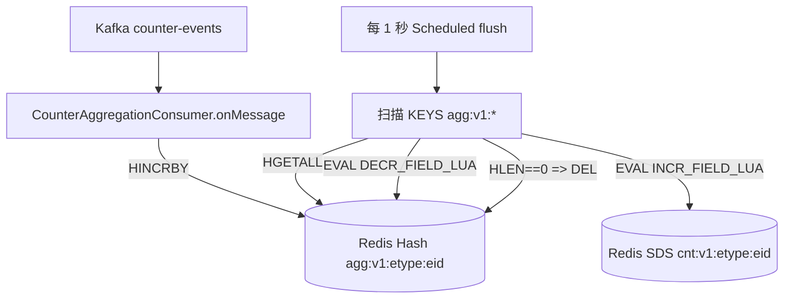
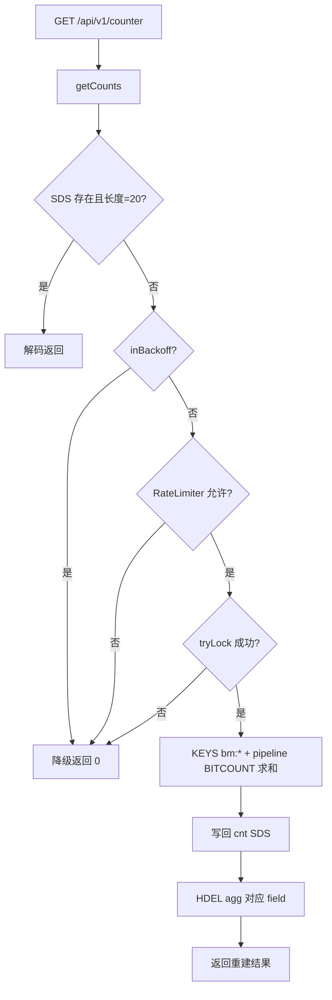

# 计数系统全链路说明与可复刻实现方案（zhiguang_be）

文档日期：2026-03-05  
仓库：`https://github.com/G-Pegasus/zhiguang_be`  
分析基准 commit：`23f4343ec030be0ea700db2d7107470453d96e15`  

> 目标：把该仓库里的「计数系统」从 **入口接口 → 写入幂等 → Redis 数据结构 → Kafka 事件聚合 → 汇总快照（SDS）→ 读取/降级/重建 → 用户维度计数（SDS）→ Outbox/Canal 链路 → 旁路缓存更新** 全部讲清楚，并提供一份**足够详细**的实现方案，使另一个 Codex agent 能按步骤复现出“相同行为 + 相同 key/schema/topic 契约”。

---

## 0. 你要先记住的 3 句话（给非技术同学）

1) **“有没有点赞/收藏过”** 是实时的：查 Redis 位图的一位（`GETBIT`）。  
2) **“点赞数/收藏数”** 是秒级最终一致的：先发 Kafka 事件，再每 1 秒刷到计数快照（SDS）。  
3) **用户维度计数**（关注/粉丝/发文/获赞/获收藏）也是 SDS，但它的写入来源分三条链路：关注关系 Outbox、发文发布、点赞收藏事件旁路更新。

---

## 1. 范围与术语（避免鸡同鸭讲）

### 1.1 本文覆盖的计数

计数系统在该仓库里分两层：

**A. 内容实体维度计数（Counter）**  
实体用 `(entityType, entityId)` 标识，当前业务主用：
- `entityType = "knowpost"`：知文内容

对外支持的指标（metric）只有两种（见 `CounterSchema.NAME_TO_IDX`）：
- `like`：点赞数
- `fav`：收藏数

> `CounterSchema` 里还预留了 `comment/repost/read` 的槽位，但 **当前没有对外暴露**（不在 `SUPPORTED_METRICS`）。

**B. 用户维度计数（UserCounter）**  
以 `userId` 为粒度，固定 5 段（每段 4 字节，大端 uint32）：
1. 关注数 `followings`
2. 粉丝数 `followers`
3. 发文数 `posts`
4. 获赞数 `likesReceived`（接口命名为 `likedPosts`）
5. 获收藏数 `favsReceived`（接口命名为 `favedPosts`）

### 1.2 两类“数据”：事实层 vs 快照层

内容维度的 `like/fav` 有两套数据结构：
- **事实层（Truth）**：Redis Bitmap（按用户分片），保证**幂等**与**实时状态**  
  - 问题回答：某用户是否点过赞/收藏？
- **快照层（Snapshot）**：Redis SDS（定长 20 bytes），保证**低延迟读计数**  
  - 问题回答：点赞数是多少？

快照层不可信时（缺失/长度异常），系统会回到事实层做 `BITCOUNT` **重建**。

---

## 2. 代码地图（追链路必看文件）

### 2.1 内容维度计数（like/fav）
- API：
  - `src/main/java/com/tongji/counter/api/ActionController.java`（/api/v1/action/like|unlike|fav|unfav）
  - `src/main/java/com/tongji/counter/api/CounterController.java`（/api/v1/counter/{etype}/{eid}）
- 核心服务：
  - `src/main/java/com/tongji/counter/service/CounterService.java`
  - `src/main/java/com/tongji/counter/service/impl/CounterServiceImpl.java`
- Redis schema/key：
  - `src/main/java/com/tongji/counter/schema/CounterSchema.java`
  - `src/main/java/com/tongji/counter/schema/CounterKeys.java`
  - `src/main/java/com/tongji/counter/schema/BitmapShard.java`
- Kafka 聚合：
  - `src/main/java/com/tongji/counter/event/CounterEvent.java`
  - `src/main/java/com/tongji/counter/event/CounterEventProducer.java`
  - `src/main/java/com/tongji/counter/event/CounterAggregationConsumer.java`
  - `src/main/java/com/tongji/counter/event/CounterRebuildConsumer.java`（可选灾备）
  - `src/main/java/com/tongji/counter/event/CounterTopics.java`
- 模块配置：
  - `src/main/java/com/tongji/counter/config/CounterConfig.java`（@EnableScheduling + @EnableKafka）
  - `src/main/java/com/tongji/config/RedissonConfig.java`（重建锁/限流/退避用）

### 2.2 用户维度计数（ucnt）
- 写入/重建：
  - `src/main/java/com/tongji/counter/service/UserCounterService.java`
  - `src/main/java/com/tongji/counter/service/impl/UserCounterServiceImpl.java`
  - `src/main/java/com/tongji/counter/schema/UserCounterKeys.java`（`ucnt:{userId}`）
- 读取端点（顺带做采样校验与重建）：
  - `src/main/java/com/tongji/relation/api/RelationController.java`（GET /api/v1/relation/counter）

### 2.3 用户维度计数的来源链路（很关键）
- 关注/取关 → Outbox → Canal → Kafka → Consumer → Processor → `ucnt`：
  - `src/main/java/com/tongji/relation/service/impl/RelationServiceImpl.java`（写 following + 写 outbox）
  - `src/main/java/com/tongji/relation/outbox/CanalKafkaBridge.java`（Canal→Kafka 桥接）
  - `src/main/java/com/tongji/relation/outbox/CanalOutboxConsumer.java`（消费 canal-outbox）
  - `src/main/java/com/tongji/relation/processor/RelationEventProcessor.java`（幂等去重 + 更新 ucnt）
  - `src/main/java/com/tongji/common/util/OutboxMessageUtil.java`
  - `src/main/java/com/tongji/relation/event/RelationEvent.java`
  - 表结构：`db/schema.sql`（outbox/following/follower）
- 发文发布 → `ucnt.posts +1`：
  - `src/main/java/com/tongji/knowpost/service/impl/KnowPostServiceImpl.java`（publish 内 try/catch）
- 点赞/收藏 → 本地 Spring 事件旁路更新 `ucnt.likesReceived/favsReceived`：
  - `src/main/java/com/tongji/knowpost/listener/FeedCacheInvalidationListener.java`

---

## 3. 对外接口契约（HTTP 层）

### 3.1 内容行为接口：like/unlike/fav/unfav

入口：`ActionController`（都需要登录 JWT，用户 id 从 claim `uid` 提取）

- `POST /api/v1/action/like`
- `POST /api/v1/action/unlike`
- `POST /api/v1/action/fav`
- `POST /api/v1/action/unfav`

Request Body：
```json
{
  "entityType": "knowpost",
  "entityId": "123456"
}
```

Response（以 like 为例）：
```json
{
  "changed": true,
  "liked": true
}
```

关键语义：
- `changed`：本次操作是否真的改变了状态（幂等点击不会重复计数）
- `liked/faved`：操作后的实时状态（读 bitmap 的 `GETBIT`）

### 3.2 内容计数读取接口：读快照（必要时自愈重建）

入口：`CounterController`

- `GET /api/v1/counter/{etype}/{eid}?metrics=like,fav`

Response：
```json
{
  "entityType": "knowpost",
  "entityId": "123456",
  "counts": {
    "like": 128,
    "fav": 67
  }
}
```

说明：
- 默认指标集来自 `CounterSchema.SUPPORTED_METRICS`（目前只含 like/fav）。
- 读取优先来自 SDS 快照；缺失/长度异常时触发位图重建（带锁、限流、退避降级）。

### 3.3 用户维度计数读取接口：读 ucnt（带采样自检与重建）

入口：`RelationController`

- `GET /api/v1/relation/counter?userId={userId}`

Response：
```json
{
  "followings": 10,
  "followers": 3,
  "posts": 7,
  "likedPosts": 120,
  "favedPosts": 55
}
```

说明（这点很“工程化”）：
- 若 `ucnt:{userId}` 不存在或长度 < 20，会调用 `UserCounterService.rebuildAllCounters(userId)` 后再读一次。
- 每个用户 300 秒最多触发一次“采样校验”：只对比**关注/粉丝**两段与 DB 的真实值，不一致则重建。

---

## 4. 核心数据结构与 Key 约定（复刻必须一致）

### 4.1 内容维度：Redis keys（bm / agg / cnt）

| 名称 | Key 模板 | Redis 类型 | 写入者 | 读取者 | 语义 |
|---|---|---|---|---|---|
| 位图事实（分片） | `bm:{metric}:{etype}:{eid}:{chunk}` | String(bitset) | `CounterServiceImpl.toggle` | `isLiked/isFaved`、重建 | 某用户是否对实体点过 |
| 聚合桶（增量暂存） | `agg:v1:{etype}:{eid}` | Hash | `CounterAggregationConsumer.onMessage` | `flush()`、重建后清理 | Kafka 增量累加 |
| 快照（SDS） | `cnt:v1:{etype}:{eid}` | String(binary) | `flush()`、重建 | `getCounts/getCountsBatch` | 20 bytes 定长计数 |

### 4.2 bitmap 分片规则（避免单 key 变成巨无霸）

代码：`BitmapShard.CHUNK_SIZE = 32768`

- `chunk = userId / 32768`
- `bit   = userId % 32768`
- 位图 key：`bm:like:knowpost:{eid}:{chunk}`

直觉：每个分片最多 32768 位 ≈ 4KB，用户 id 再大也不会把单 key 撑爆。

### 4.3 内容快照 SDS（cnt:v1）格式（20 bytes）

代码：`CounterSchema`：
- `SCHEMA_ID = v1`
- `FIELD_SIZE = 4`（4 字节无符号整型，big-endian）
- `SCHEMA_LEN = 5`（预留 5 个槽位）
- 指标下标：
  - `idx=0`：read（预留）
  - `idx=1`：like
  - `idx=2`：fav
  - `idx=3`：comment（预留）
  - `idx=4`：repost（预留）

**读写偏移规则（必须一致）**：
- `offsetBytes = idx * FIELD_SIZE`
- 例如 like 的 offset = `1 * 4 = 4`（第 2 段）

### 4.4 Kafka topic 与消息格式

内容计数事件 topic：
- `counter-events`（见 `CounterTopics.EVENTS`）

消息体（JSON）：
```json
{
  "entityType": "knowpost",
  "entityId": "123456",
  "metric": "like",
  "idx": 1,
  "userId": 10001,
  "delta": 1
}
```

说明：
- 该事件是“状态变化导致的增量”，不是“最终计数”。
- 由于增量可交换（+1/-1 可累加），Kafka **不需要强顺序**；仓库代码也没有设置 key 分区。

### 4.5 用户维度：Redis key（ucnt）

用户计数 key：
- `ucnt:{userId}`（见 `UserCounterKeys`）

格式：
- 固定 5 段 × 4 字节（20 bytes），大端 uint32
- 段序（1 基）：
  1. followings
  2. followers
  3. posts
  4. likesReceived（接口字段 `likedPosts`）
  5. favsReceived（接口字段 `favedPosts`）

---

## 5. 全链路一：内容计数写入链路（like/fav，幂等）

### 5.1 入口到 Redis（事实层 bitmap）

流程要点：
- “点赞/收藏”本质是**状态切换**：从 0→1 或 1→0
- 系统用 Lua 在 Redis 里执行 `GETBIT + SETBIT`，确保“读前状态 + 写后状态”在一个原子步骤里完成
- **只有状态真的变化**才会产生 `CounterEvent`（这就是幂等的根）

关键代码点：
- `CounterServiceImpl.toggle(...)`：计算分片与 bit 偏移，EVAL `TOGGLE_LUA`
- 返回 `changed=1` 才会：
  - 发送 Kafka：`CounterEventProducer.publish(...)`
  - 发布本地 Spring 事件：`eventPublisher.publishEvent(...)`（旁路用途）

写入流程图：
```mermaid
flowchart TD
  C[客户端点击 like/fav] --> A[ActionController]
  A -->|extract uid| S[CounterServiceImpl.toggle]
  S -->|EVAL TOGGLE_LUA| R[(Redis bitmap bm:...)]
  R -->|changed=0| S0[幂等: 不发事件\nchanged=false]
  R -->|changed=1| E[CounterEvent(delta=±1)]
  E --> K[Kafka topic counter-events]
  E --> L[本地 Spring 事件\nCounterEvent]
```

### 5.2 TOGGLE_LUA 的等价实现（复刻必须原子）

仓库 Lua（语义版）：
```text
inputs: bmKey, offset(bit), op(add/remove)
prev = GETBIT(bmKey, offset)
if op == add:
  if prev == 1: return 0
  SETBIT(bmKey, offset, 1); return 1
if op == remove:
  if prev == 0: return 0
  SETBIT(bmKey, offset, 0); return 1
return -1
```

复刻注意：
- 不要在应用层用“先 GETBIT 再 SETBIT”的两次请求替代，**并发下会破坏幂等**。

---

## 6. 全链路二：Kafka 聚合 → Redis Hash → 1s 刷写到 SDS

这条链路解决的是：**写入非常频繁（高并发）**，但我们又希望读计数非常快。

### 6.1 Kafka 消费：事件落到聚合桶 agg

`CounterAggregationConsumer.onMessage` 做两件事：
1) JSON → CounterEvent
2) `HINCRBY agg:v1:{etype}:{eid} {idx} delta`
3) 成功后手动 `ack`（把“已入 Redis 聚合桶”当作消费成功语义）

### 6.2 每 1 秒 flush：把 agg 折叠进 cnt（SDS）

`CounterAggregationConsumer.flush`（@Scheduled fixedDelay=1000ms）：
- 扫描所有聚合桶：`KEYS agg:v1:*`（注意：这是阻塞操作，生产有风险）
- 对每个桶：读取 entries（idx→deltaSum）
  - 通过 Lua `INCR_FIELD_LUA` 把 `deltaSum` 原子累加到 `cnt:v1:{etype}:{eid}` 指定段
  - 再通过 Lua `DECR_FIELD_LUA` 把该 `deltaSum` 从 agg 字段扣回去
    - 扣回后若字段变 0 就 HDEL
    - 这样可以处理 flush 与新事件并发：flush 只“消耗”自己看到的那部分增量，不会误删后来新增的增量
- 桶空了就 DEL（减少后续扫描噪音）

聚合/刷写流程图：


---

## 7. 全链路三：内容计数读取（SDS 优先；异常时基于 bitmap 重建）

### 7.1 正常读：直接解码 SDS

`CounterServiceImpl.getCounts`：
- 读 `cnt:v1:{etype}:{eid}` 的 raw bytes
- raw 长度 == 20（5*4）则按 `offset=idx*4` 大端解码返回

### 7.2 异常读：SDS 缺失/长度不对 → 重建

触发条件：
- `raw == null` 或 `raw.length != expectedLen`

保护机制（按顺序）：
1) **指数退避窗口**：若处于 backoff，直接返回 0（避免热点抖动重建风暴）
2) **限流**：Redisson `RRateLimiter`（默认 10s 3 次）
3) **分布式锁**：`lock:sds-rebuild:{etype}:{eid}`（Redisson watchdog 自动续期）

重建动作（持锁者执行）：
- newSds 初始化为 20 bytes 全 0
- 对每个 metric：
  - `KEYS bm:{metric}:{etype}:{eid}:*` 找到所有分片
  - pipeline `BITCOUNT` 求和得到真实计数 sum
  - `writeUInt32BE(newSds, idx*4, sum)`
  - 将 sum 写入返回结果
- `SET cntKey newSds`
- `HDEL aggKey fields=[idx...]`（清理聚合桶对应字段，避免 flush 再加一次）
- reset backoff

读取/重建流程图：


> 重要现实：本实现重建时会清理 agg 的 field，但 agg 消费与重建没有共享同一把锁，存在并发竞态窗口（见“风险”章节）。复刻时按原样实现即可。

### 7.3 批量读 getCountsBatch：只读不重建

`CounterServiceImpl.getCountsBatch`：
- pipeline GET 一批 `cnt:v1:{etype}:{eid}`，降低 RTT
- 单个实体 raw 不存在或长度不对：直接把请求的 metrics 填 0  
  （目的：批量接口不触发重建，避免一次请求引爆 KEYS+BITCOUNT）

---

## 8. 全链路四：用户维度计数（ucnt）的写入来源

用户维度计数不是一个入口写一次就完，它由三条链路驱动：

### 8.1 关注/取关：Outbox → Canal → Kafka → Processor → ucnt

#### 8.1.1 写入端：RelationServiceImpl 写 following + 写 outbox

- follow：
  - 令牌桶 Lua 限流（`rl:follow:{fromUserId}`）
  - `following` 表插入成功后写 outbox：
    - aggregate_type=`following`
    - type=`FollowCreated`
    - payload=`RelationEvent{type, fromUserId, toUserId, id}`
- unfollow：
  - 更新 following rel_status
  - 写 outbox：type=`FollowCanceled`（aggregateId 为空）

#### 8.1.2 Canal→Kafka 桥接：只转发 outbox.payload

`CanalKafkaBridge`：
- 订阅 binlog 的 rowdata
- 只处理 outbox 表 INSERT/UPDATE
- 只抽出 `payload` 字段，封装成消息发到 Kafka topic `canal-outbox`

#### 8.1.3 消费端：CanalOutboxConsumer → RelationEventProcessor

`CanalOutboxConsumer`：
- 消费 `canal-outbox`
- 用 `OutboxMessageUtil.extractRows` 抽 rows
- 反序列化 `payload` 为 `RelationEvent`
- 调用 `RelationEventProcessor.process(evt)`

`RelationEventProcessor`：
- 生成去重 key：`dedup:rel:{type}:{from}:{to}:{id}`，TTL 10min  
  非首次直接 return（幂等）
- FollowCreated：
  - 写入 `follower` 表
  - 更新缓存 ZSet（关注/粉丝列表）
  - `ucnt.fromUserId.followings += 1`
  - `ucnt.toUserId.followers += 1`
- FollowCanceled：同理 -1

关注链路流程图：
```mermaid
flowchart TD
  U[客户端 follow/unfollow] --> RC[RelationController]
  RC --> RS[RelationServiceImpl]
  RS -->|写 following| DB[(MySQL)]
  RS -->|写 outbox(payload)| DB
  DB -->|binlog rowdata| CANAL[Canal]
  CANAL --> BR[CanalKafkaBridge]
  BR --> KO[Kafka topic canal-outbox]
  KO --> OC[CanalOutboxConsumer]
  OC --> P[RelationEventProcessor(去重/幂等)]
  P -->|写 follower| DB
  P -->|更新 ZSet 缓存| RZ[(Redis ZSet uf:flws / uf:fans)]
  P -->|Lua 原子增量| UCNT[(Redis SDS ucnt:userId)]
```

### 8.2 发文发布：ucnt.posts +1（同步 best-effort）

`KnowPostServiceImpl.publish`：
- `mapper.publish(id, creatorId)` 成功后：
  - `try { userCounterService.incrementPosts(creatorId, 1); } catch (ignored) {}`

特点：
- 没有 -1（删除/撤回不在这套实现里维护）
- try/catch 表明它是 best-effort（失败不影响发布主流程）

### 8.3 点赞/收藏：作者获赞/获收藏旁路更新（本地事件）

`CounterServiceImpl.toggle` 在状态变化时会发布本地 Spring 事件 `CounterEvent`。  
`FeedCacheInvalidationListener.onCounterChanged` 监听该事件：
- 只处理 `entityType == "knowpost"` 且 metric in {like,fav}
- 查 DB 拿到 knowpost 的作者 `creatorId`
- `like`：`userCounterService.incrementLikesReceived(owner, delta)`
- `fav`：`userCounterService.incrementFavsReceived(owner, delta)`

这条链路的特点：
- 不走 Kafka（所以跨系统消费不到）
- 依赖能从 DB 查到 knowpost（查不到就跳过）

---

## 9. 用户维度计数读取链路（/api/v1/relation/counter）

`RelationController.counter` 的逻辑可以概括为三段：

1) 读取 `GET ucnt:{userId}`  
2) 若缺失/长度异常：调用 `UserCounterService.rebuildAllCounters(userId)`，再读一次  
3) 每 300 秒一次采样校验：只校验关注/粉丝两段与 DB 真实值  
   - 不一致则重建，再读并返回最新值

用户计数读取流程图：
```mermaid
flowchart TD
  REQ[GET /api/v1/relation/counter] --> R[GET ucnt:userId]
  R --> OK1{raw>=20?}
  OK1 -->|否| RB[rebuildAllCounters(userId)]
  RB --> R2[GET ucnt:userId 再读]
  R2 --> OK2{raw>=20?}
  OK2 -->|否| Z[返回全 0]
  OK2 -->|是| S[采样校验(300s)]
  OK1 -->|是| S
  S -->|不需要/一致| OUT[按段解码返回]
  S -->|不一致| RB2[rebuildAllCounters]
  RB2 --> OUT2[再读并返回]
```

---

## 10. 纠偏与灾难场景

### 10.1 内容计数灾备：earliest 回放 CounterEvent 折叠到 SDS（可选）

`CounterRebuildConsumer`（默认关闭，需 `counter.rebuild.enabled=true`）：
- `groupId = counter-rebuild`
- `auto.offset.reset = earliest`
- 消费 `counter-events`，每条事件直接用 Lua `INCR_FIELD_LUA` 折叠到 `cnt:v1:{etype}:{eid}`
- 成功后 ack（失败不 ack，重试）

**Runbook（非常重要）**：
- 这是“累加式重建”，如果你不清空旧 SDS，会把历史再加一遍 → **翻倍**  
  正确做法：在启用 earliest 回放前，明确：
  1) 是否需要清空 `cnt:v1:*`（通常需要）
  2) 用独立 consumer group 做一次性回放
  3) 回放完成后关闭该 consumer

### 10.2 用户计数重建：rebuildAllCounters(userId)

`UserCounterServiceImpl.rebuildAllCounters`：
- followings/followers：从 DB 关系表 count
- posts：从 DB `knowPostMapper.listMyPublishedIds(userId)` 的 size
- likesReceived/favsReceived：遍历该作者发布的所有 knowpost id，调用 `counterService.getCountsBatch("knowpost", ids, ["like","fav"])` 后求和
- 写回 `ucnt:{userId}`（覆盖式写 20 bytes）

注意：
- 这里用的是 `getCountsBatch`（只读不重建），所以如果内容计数 SDS 缺失，用户获赞/获收藏重建可能得到 0。

---

## 11. 可复刻实现方案（另一位 Codex agent 按这个做）

下面按“从零复刻一个等价系统”的顺序写，尽量把每个契约写死。

### 11.1 复刻目标（验收清单）

内容维度（like/fav）：
1) 幂等：重复点赞不重复计数（`changed=false`）
2) 状态实时：`liked/faved` 与 bitmap `GETBIT` 一致
3) 秒级最终一致：likeCount/favCount 在 0~1s 内落到 `cnt:v1:*`
4) 自愈：删除 `cnt:v1:*` 后读计数触发 `BITCOUNT` 重建并返回正确值

用户维度（ucnt）：
5) follow/unfollow 后（允许异步延迟）关注/粉丝计数变化正确
6) 点赞/取消点赞会让作者的 `ucnt` 第 4 段随 delta 变化（获赞）
7) 收藏/取消收藏会让作者的 `ucnt` 第 5 段随 delta 变化（获收藏）
8) 发布知文后 `ucnt` 第 3 段 +1
9) `/api/v1/relation/counter` 能在缺失时触发重建并返回（不崩）

### 11.2 基础设施（最小集与全量集）

最小可运行（只复刻内容计数 like/fav）：
- Redis（必须）
- Kafka（必须）
- 应用服务（必须）

完整复刻（包含用户维度关注/粉丝链路）：
- MySQL（必须：following/follower/outbox/know_posts/users）
- Canal（必须：消费 binlog，把 outbox.payload 转发到 Kafka）

> 如果你不想上 Canal：可以把 `RelationEventProcessor` 直接挂到应用内部队列/定时扫描 outbox 表，语义上仍是 Outbox 模式，但就不等价了。

### 11.3 必须一致的“契约”（Key/Schema/Topic）

内容维度：
- bitmap：`bm:{metric}:{etype}:{eid}:{chunk}`，`CHUNK_SIZE=32768`
- agg：`agg:v1:{etype}:{eid}`，field=idx，value=deltaSum
- sds：`cnt:v1:{etype}:{eid}`，长度 20 bytes，big-endian uint32，offset=idx*4
- topic：`counter-events`
- event：`CounterEvent{entityType, entityId, metric, idx, userId, delta}`

用户维度：
- sds：`ucnt:{userId}`，长度 20 bytes，1 基段序如 4.5

Outbox（如果复刻关注链路）：
- 表：`outbox(id, aggregate_type, aggregate_id, type, payload, created_at)`
- Kafka topic：`canal-outbox`
- Canal→Kafka 消息格式：`{ table:"outbox", type:"INSERT|UPDATE", data:[{payload:"..."}] }`

### 11.4 组件拆分（按仓库结构复刻最省事）

建议按 4 个模块拆：
1) `counter`：内容维度计数（bitmap + Kafka + SDS）
2) `user-counter`：用户维度计数（ucnt SDS + 重建）
3) `relation-outbox`：关注写入 + outbox + canal 消费 + processor（可选）
4) `knowpost`：发布与 feed/详情集成（可选，但仓库就是这么用的）

### 11.5 关键算法伪代码（要求等价，不要求语言一致）

#### A) 内容行为幂等切换（事实层）
```text
function toggle(etype, eid, uid, metric, idx, add):
  chunk = uid / 32768
  bit   = uid % 32768
  bmKey = "bm:{metric}:{etype}:{eid}:{chunk}"

  changed = EVAL(TOGGLE_LUA, KEYS=[bmKey], ARGV=[bit, add? "add":"remove"])
  if changed != 1:
    return false

  delta = add ? +1 : -1
  kafka.send("counter-events", json({etype,eid,metric,idx,uid,delta}))
  spring.publishLocalEvent(CounterEvent(...))  # 旁路用途
  return true
```

#### B) Kafka 聚合与 1s flush
```text
onKafkaMessage(event):
  aggKey = "agg:v1:{etype}:{eid}"
  field  = str(event.idx)
  HINCRBY aggKey field event.delta
  ack offset

every 1s flush():
  for each aggKey in KEYS("agg:v1:*"):
    {etype,eid} = parse aggKey
    cntKey = "cnt:v1:{etype}:{eid}"
    for each (field, deltaSum) in HGETALL(aggKey):
      if deltaSum == 0: continue
      idx = int(field)
      EVAL(INCR_FIELD_LUA, KEYS=[cntKey], ARGV=[schemaLen=5, fieldSize=4, idx, deltaSum])
      EVAL(DECR_FIELD_LUA, KEYS=[aggKey], ARGV=[field, deltaSum])
    if HLEN(aggKey)==0: DEL aggKey
```

#### C) 读计数（异常时位图重建）
```text
function getCounts(etype, eid, metrics):
  cntKey = "cnt:v1:{etype}:{eid}"
  raw = GET(cntKey)
  if raw exists and len(raw)==20:
    return decode(raw, metrics)  # off=idx*4 big-endian uint32

  if inBackoff(etype,eid): return allZero(metrics)
  if !rateLimiterAcquire(etype,eid): backoff++; return allZero(metrics)
  if !tryLock("lock:sds-rebuild:{etype}:{eid}"): backoff++; return allZero(metrics)

  try:
    newRaw = zeros(20)
    for metric in metrics:
      sum = SUM( BITCOUNT(k) for k in KEYS("bm:{metric}:{etype}:{eid}:*") )
      writeUInt32BE(newRaw, off=idx(metric)*4, sum)
    SET(cntKey, newRaw)
    HDEL("agg:v1:{etype}:{eid}", fields=[idx(metric)...])
    backoffReset()
    return computedMap
  finally:
    unlock
```

#### D) 用户计数原子增量（ucnt SDS）
```text
function incrUserField(userId, idx1Based, delta):
  key = "ucnt:{userId}"
  EVAL(USER_INCR_LUA, KEYS=[key], ARGV=[schemaLen=5, fieldSize=4, idx=idx1Based, delta])
```

#### E) 关注 Outbox 链路（完整复刻用）
```text
follow(from, to):
  if tokenBucketReject("rl:follow:{from}"): return false
  id = randomLong()
  INSERT following(id, from, to, active)
  INSERT outbox(id=randomLong(), aggregate_type="following", aggregate_id=id,
               type="FollowCreated", payload=json(RelationEvent(...)))
  return true

unfollow(from, to):
  UPDATE following SET inactive WHERE from,to
  INSERT outbox(... type="FollowCanceled", payload=json(RelationEvent(...)))
  return true

canal_bridge():
  tail binlog rowdata on table outbox
  for each INSERT/UPDATE row:
    emit kafka "canal-outbox" with {table:"outbox",type:"INSERT|UPDATE",data:[{payload:"..."}]}

outbox_consumer():
  for each message on "canal-outbox":
    for row in data:
      evt = parse row.payload as RelationEvent
      if dedupKey exists: continue
      if evt.type == FollowCreated: insert follower; ucnt(from)+1; ucnt(to)+1
      if evt.type == FollowCanceled: cancel follower; ucnt(from)-1; ucnt(to)-1
```

### 11.6 必要配置清单（仓库 application.yml 为空）

内容计数最小配置（Spring Boot）：
- Redis：`spring.data.redis.host/port/password/database`
- Kafka：`spring.kafka.bootstrap-servers`
- Kafka listener 建议开启手动 ack（代码显式调用 `Acknowledgment.acknowledge()`）

重建相关（都有默认值，可不配，但复刻建议写出来）：
- `counter.rebuild.rate.permits`（默认 3）
- `counter.rebuild.rate.window-seconds`（默认 10）
- `counter.rebuild.backoff.base-ms`（默认 500）
- `counter.rebuild.backoff.max-ms`（默认 30000）
- `counter.rebuild.lock.watchdog-ms`（默认 30000，见 `RedissonConfig`）
- `counter.rebuild.enabled`（默认 false；开启灾备回放 consumer）

Outbox/Canal（复刻关注链路才需要）：
- `canal.enabled`（true/false）
- `canal.host`
- `canal.port`
- `canal.destination`
- `canal.username`
- `canal.password`
- `canal.filter`（建议只订阅 outbox 表）
- `canal.batchSize`
- `canal.intervalMs`

JWT（行为接口必需）：
- JWT claim 必须包含 `uid`（`JwtService.extractUserId` 从 `"uid"` 读取）

### 11.7 本地验证（建议按这个顺序）

1) 点赞一次：
   - `/api/v1/action/like` 返回 `changed=true`
   - Redis 出现 `bm:like:knowpost:{eid}:{chunk}` 且对应 bit=1
2) 再点一次：
   - 返回 `changed=false`
3) 看聚合桶：
   - Kafka consumer 运行后 `HGETALL agg:v1:knowpost:{eid}` 出现字段 `1`（like idx）
4) 等 1 秒：
   - `GET cnt:v1:knowpost:{eid}` 长度应为 20 bytes，like 段 +1
5) 删除快照再读：
   - `DEL cnt:v1:knowpost:{eid}` 后请求 `/api/v1/counter/...`，应触发 `BITCOUNT` 重建
6) 点赞影响作者 ucnt（如果启用了 FeedCacheInvalidationListener）：
   - `GET ucnt:{creatorId}` 第 4 段随 delta 变化
7) follow/unfollow（完整链路）：
   - follow 后 outbox 有新行
   - canal-outbox topic 有消息
   - 消费后 `ucnt:{from}` 第 1 段 +1，`ucnt:{to}` 第 2 段 +1

---

## 12. 已知风险与改进建议（不影响复刻，但你应当知道它们）

1) **Redis KEYS 扫描风险**  
`flush()` 使用 `KEYS agg:v1:*`；重建使用 `KEYS bm:...:*`。键空间大时会阻塞 Redis。  
改进：维护“活跃 aggKey/bitmapKey 索引集合”，用 `SSCAN` 或集合遍历替代 `KEYS`。

2) **重建与聚合并发竞态**  
重建完成后会 `HDEL agg` 对应字段，理论上可能与并发新事件存在窗口（会导致短暂不一致甚至丢增量）。  
改进：为 `(etype,eid)` 维度引入统一写屏障（同一把锁或版本号），或用“以 bitmap 为源，SDS 仅作缓存”并允许读时回补。

3) **getCountsBatch 不自愈**  
批量读直接补 0，不触发重建；`UserCounterServiceImpl.rebuildAllCounters` 又依赖 batch 读，可能在内容快照缺失时把获赞/获藏重建成 0。  
改进：重建用户获赞/获藏时改用逐个 `getCounts`（允许重建），或在后台异步补齐内容快照。

4) **posts 只增不减**  
发布会 +1，但未看到撤回/删除时 -1 的链路。  
改进：补齐内容状态流转事件并对 ucnt.posts 做相应增减。

5) **降级返回 0 的用户体验**  
内容快照缺失时，如果命中 backoff/限流/抢锁失败，会直接返回 0。  
改进：可以返回“上次可用值 + 标记 stale”，或在 API 层返回 `degraded=true` 让前端展示更合理。

