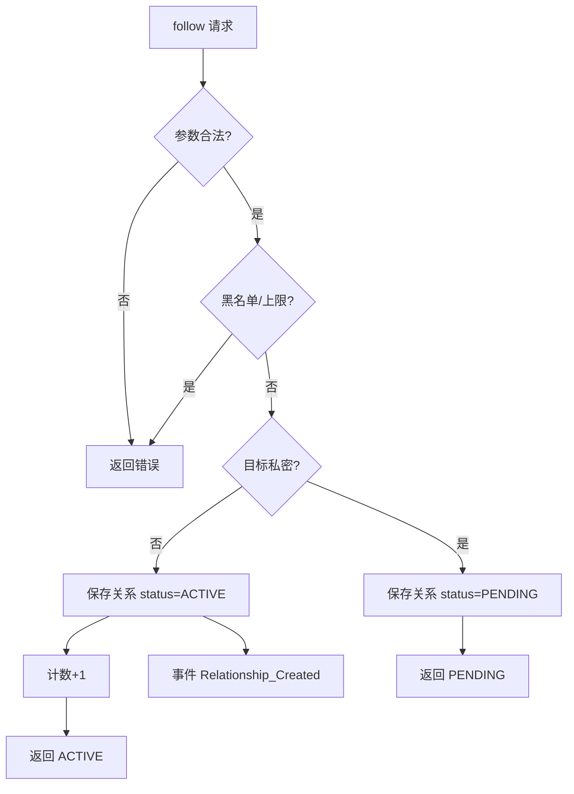
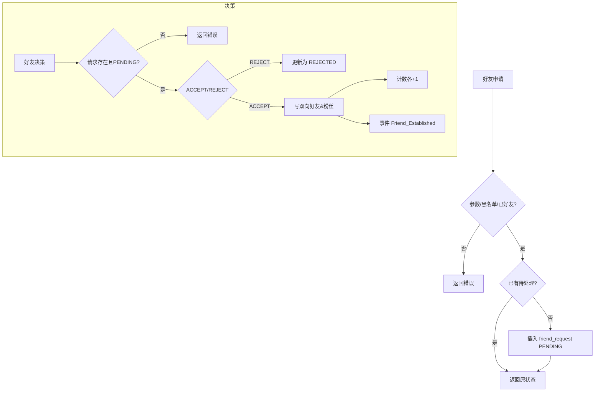
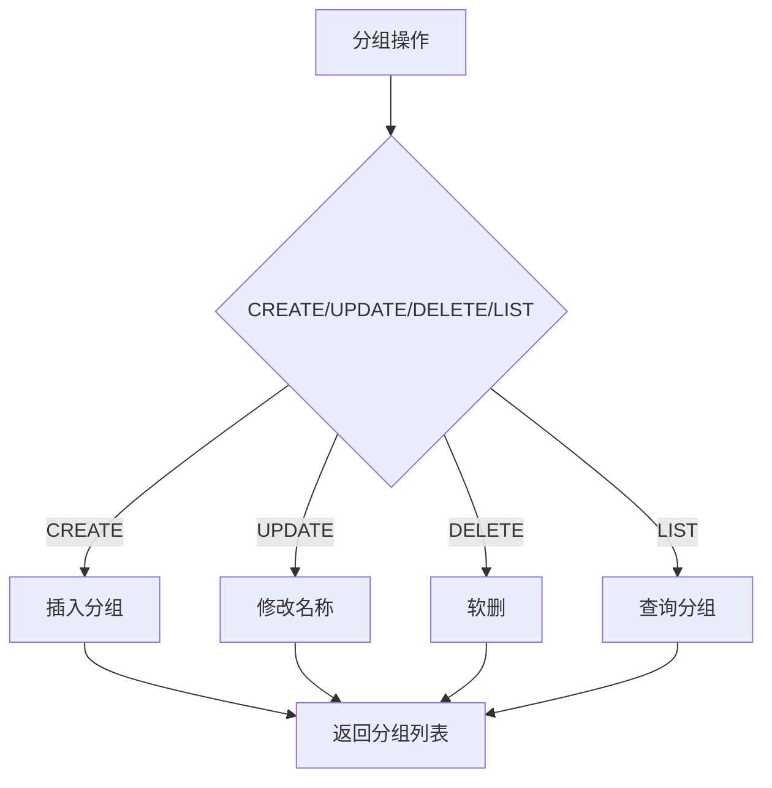
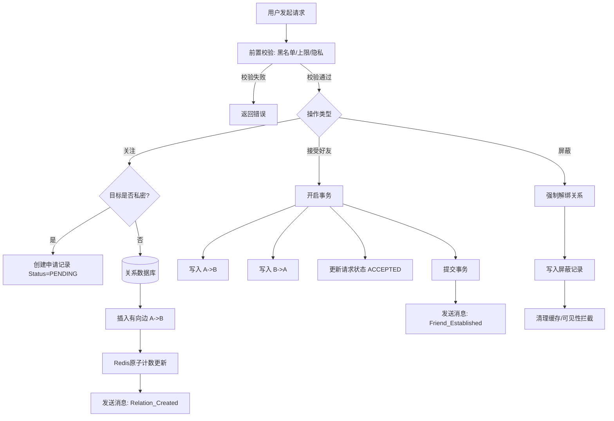
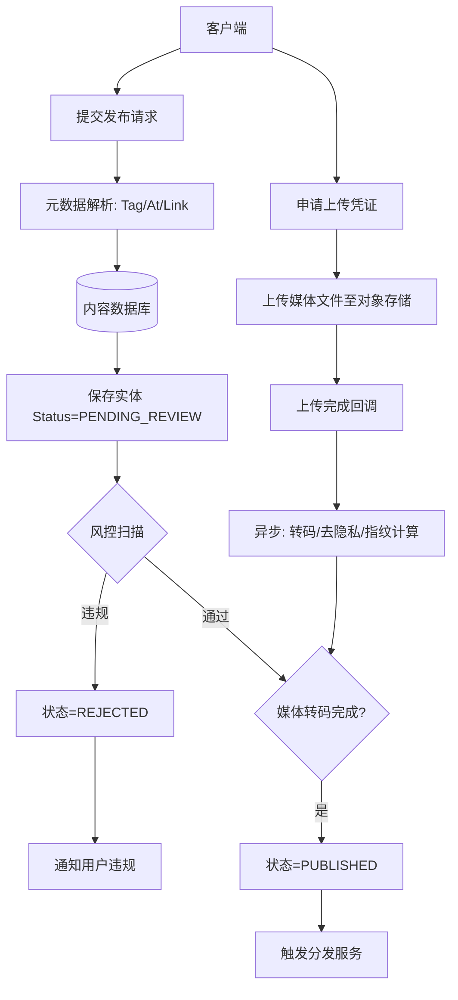
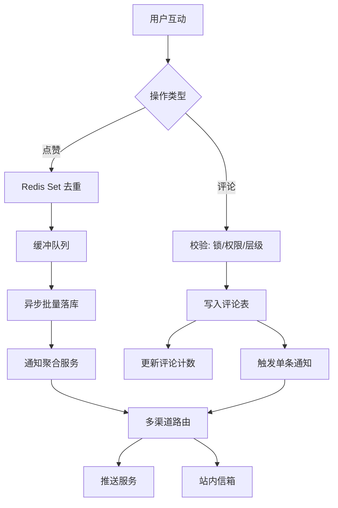
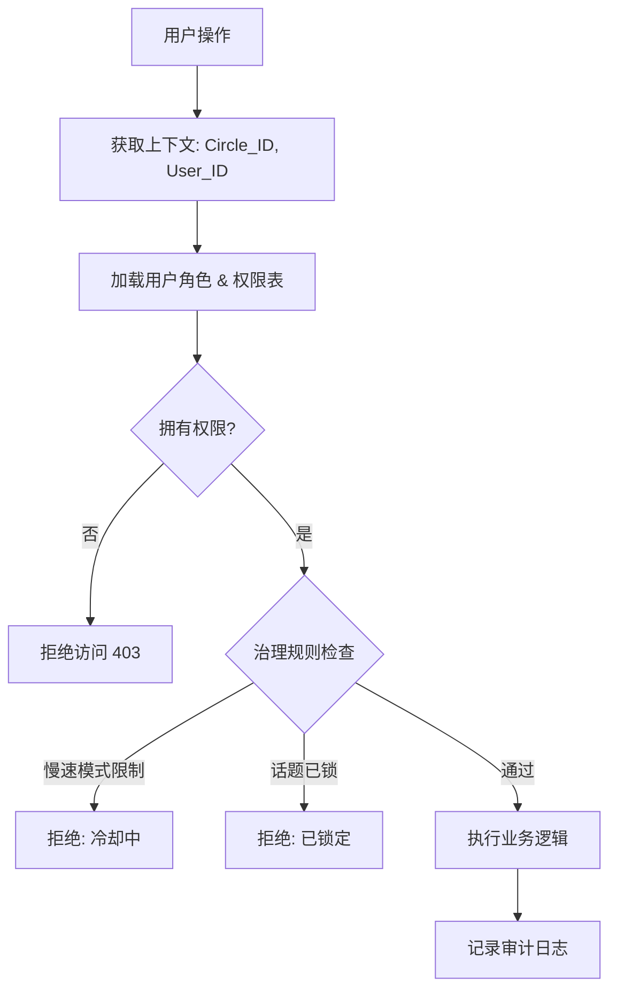
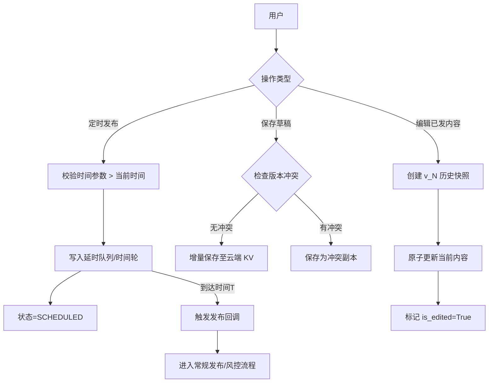
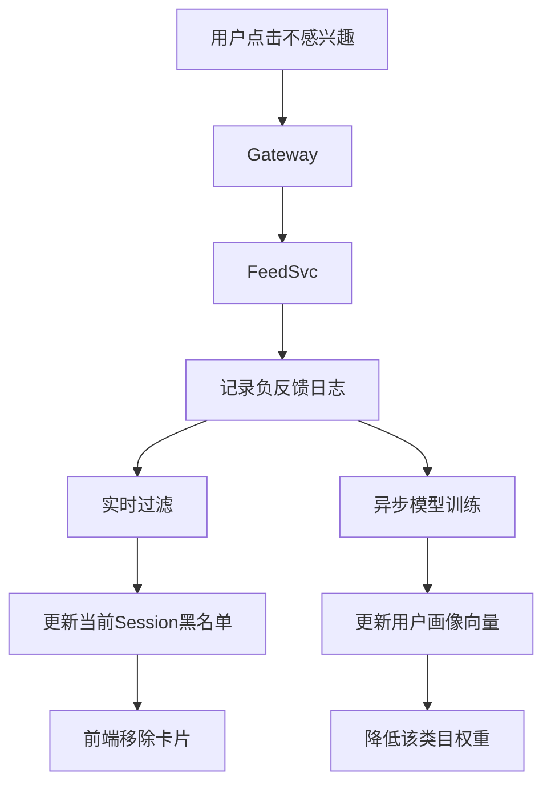
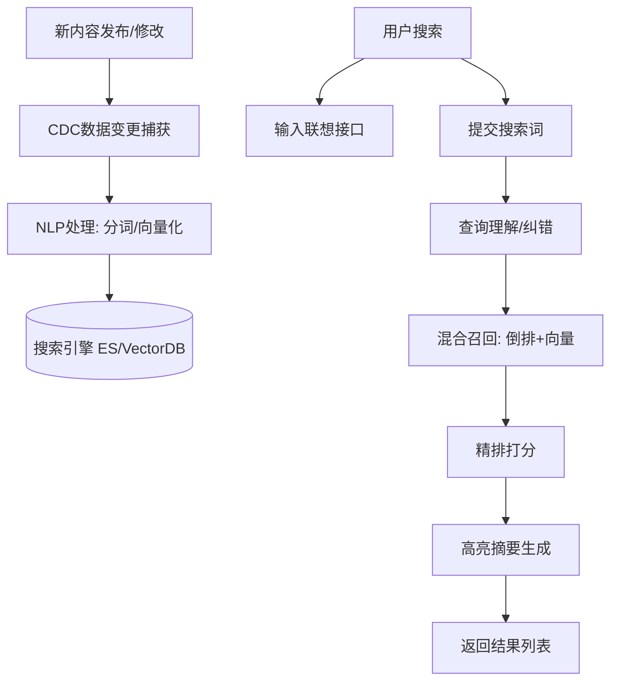

根据您提供的《社区社交业务域深度原子级拆解与架构演进研究报告》，我为您梳理了该业务域下的核心微服务拆分、业务逻辑流程、Mermaid 流程图以及详细的接口定义。

为了保证架构的清晰性，我们将系统划分为六大核心服务群。

---

### 1. 用户关系服务 (User Relationship Service)

**核心职责**：管理用户之间的连接状态（关注、好友、屏蔽），维护社交图谱，处理隐私权限校验。

#### 当前实现接口流程（与代码保持一致）

1. `/v1/relation/follow`
   * 校验：source/target >0 且不相等；关注上限；黑名单；重复关注返回原状态；好友存在直接 ACTIVE。
   * 私密用户：写入状态 PENDING；公开写 ACTIVE；均写 user_relation + user_follower；更新计数；ACTIVE 触发 `Relationship_Created` 事件。
   * 屏蔽存在直接失败。
2. `/v1/relation/friend/request`
   * 校验：参数、黑名单、已是好友；存在待处理申请直接返回原状态。
   * 写 friend_request 状态 PENDING。
3. `/v1/relation/friend/decision`
   * 校验：请求存在且 PENDING。
   * ACCEPT：更新申请状态 ACCEPTED，写入双向好友边 + 粉丝索引，计数各 +1，触发 `Friend_Established` 事件。
   * REJECT：仅更新状态。
4. `/v1/relation/block`
   * 写 user_block；清理双方关注/好友、粉丝索引、待处理好友申请；计数相应扣减；触发 `Block_Created` 事件；调用屏蔽后清理占位（IM/可见性）。
5. `/v1/relation/list` 分组增删改查
   * CREATE：写 user_relation_group。
   * UPDATE：改名。
   * DELETE：软删。
   * LIST：按 create_time 返回分组列表。





```mermaid
flowchart TD
    BLK[屏蔽请求] --> BChk{参数合法?}
    BChk -- 否 --> BErr[返回错误]
    BChk -- 是 --> BSave[写 user_block]
    BSave --> BClean[删除关注/好友/粉丝/待处理申请]
    BClean --> BCnt[计数扣减]
    BSave --> BEv[事件 Block_Created]
    BSave --> BHook[调用清理占位(IM/可见性)]
```



#### 1.1 业务逻辑与流程

1. **关注/订阅逻辑**：
* 校验源用户关注上限及目标用户黑名单。
* 检查目标用户隐私设置（公开/需审批）。
* 若需审批，写入 PENDING 状态；否则写入 ACTIVE 状态。
* 原子化更新 Redis 计数器 (Following/Follower Count)。
* 发送 `Relationship_Created` 事件触发 Feed 流写扩散。


2. **好友双向确认逻辑**：
* A 发起请求 -> 生成 Request 记录。
* B 接受 -> 事务写入双向关注边 -> 提升隐私权限等级 -> 触发通知。


3. **屏蔽/阻断逻辑**：
* 强制解除双方关注/好友关系。
* 写入屏蔽记录 (Block Edge)。
* 触发下游清理（清理IM会话、隐藏Profile）。


#### 1.2 业务流程图 (Mermaid)



#### 1.3 核心接口定义

| 接口名称 | Method | Path | 请求参数 (Body/Query) | 响应数据 |
| --- | --- | --- | --- | --- |
| **关注用户** | POST | `/v1/relation/follow` | `source_id` (Long), `target_id` (Long) | `status` (String: ACTIVE/PENDING) |
| **发送好友请求** | POST | `/v1/relation/friend/request` | `source_id`, `target_id`, `verify_msg` (String), `source_channel` (Enum) | `request_id` (Long) |
| **处理好友请求** | POST | `/v1/relation/friend/decision` | `request_id`, `action` (Enum: ACCEPT/REJECT) | `success` (Bool) |
| **屏蔽用户** | POST | `/v1/relation/block` | `source_id`, `target_id` | `success` (Bool) |
| **创建/管理分组** | POST | `/v1/relation/list` | `user_id`, `list_name`, `member_ids` (List) | `list_id` (Long) |

---

### 2. 内容发布与媒体服务 (Content Publication & Media Service)

**核心职责**：管理内容全生命周期（草稿、发布、删除），处理多媒体资源（上传、转码、去敏），编排发布状态机。

#### 2.1 业务逻辑与流程

1. **媒体处理**：
* 申请上传 Token (S3 Signed URL)。
* 客户端分片上传，服务端合并。
* 异步触发转码（HLS/DASH）及 EXIF 隐私数据剥离。


2. **内容创建**：
* 生成全局唯一 `Post_ID` (Snowflake)。
* 解析元数据（Hashtag, Mention, URL Preview）。
* 持久化内容实体，状态置为 `Pending_Review`。


3. **发布编排**：
* 调用风控服务进行扫描。
* 若风控通过 -> 状态置为 `Published` -> 触发分发。
* 若风控拒绝 -> 状态置为 `Rejected` -> 通知用户。


#### 2.2 业务流程图 (Mermaid)



#### 2.3 核心接口定义

| 接口名称 | Method | Path | 请求参数 | 响应数据 |
| --- | --- | --- | --- | --- |
| **获取上传凭证** | POST | `/v1/media/upload/session` | `file_type`, `file_size`, `crc32` | `upload_url`, `token`, `session_id` |
| **保存草稿** | PUT | `/v1/content/draft` | `user_id`, `content_text`, `media_ids` (List) | `draft_id` |
| **发布内容** | POST | `/v1/content/publish` | `user_id`, `text`, `media_info` (JSON), `location` (Optional), `visibility` | `post_id`, `status` |
| **删除内容** | DELETE | `/v1/content/{post_id}` | `user_id` | `success` |

---

### 3. 分发与Feed服务 (Distribution & Feed Service)

**核心职责**：聚合内容流，计算用户Feed，处理读写扩散，执行排序算法。

#### 3.1 业务逻辑与流程

1. **写扩散 (Push)**：
* 接收 `Post_Published` 事件。
* 查询发布者的活跃粉丝列表。
* 将 `Post_ID` 写入粉丝的 `Inbox_Timeline` (Redis List)。


2. **读扩散 (Pull)**：
* 用户请求刷新 Feed。
* 拉取关注的大V最新内容。
* 与 Inbox 中的内容进行多路归并。


3. **混合排序 (Ranking)**：
* 召回候选集（关注+推荐）。
* 计算亲密度分数 (Affinity Score) 和 预测分数 (pCTR/pLike)。
* 应用多样性打散规则（同作者/同类型限制）。
* 插入广告位。


#### 3.2 业务流程图 (Mermaid)

```mermaid
graph TD
    User[用户刷新Feed] --> Gateway[API网关]
    Gateway --> FeedSvc[Feed服务]
    
    FeedSvc --> PullInbox[拉取写扩散收件箱 (Redis)]
    FeedSvc --> PullBigV[拉取大V最新内容 (读扩散)]
    FeedSvc --> RecSys[调用推荐召回 (兴趣/向量)]
    
    PullInbox & PullBigV & RecSys --> Merge[多路归并]
    Merge --> Filter[规则过滤: 屏蔽/去重]
    Filter --> RankEngine[排序引擎]
    
    RankEngine --> Feature[特征提取]
    Feature --> Model[预测打分 pCTR/pLike]
    Model --> ReRank[重排: 多样性打散/广告注入]
    ReRank --> Response[返回有序Feed列表]

```

#### 3.3 核心接口定义

| 接口名称 | Method | Path | 请求参数 | 响应数据 |
| --- | --- | --- | --- | --- |
| **获取主页Feed** | GET | `/v1/feed/timeline` | `user_id`, `cursor` (String), `limit` (Int), `feed_type` (FOLLOW/RECOMMEND) | `items` (List), `next_cursor` |
| **获取用户个人页内容** | GET | `/v1/feed/profile/{target_id}` | `visitor_id`, `cursor`, `limit` | `items` (List), `next_cursor` |

---

### 4. 互动与通知服务 (Interaction & Notification Service)

**核心职责**：处理高并发的点赞/评论，维护计数一致性，生成并路由通知。

#### 4.1 业务逻辑与流程

1. **点赞/态势表达**：
* 幂等性校验。
* Redis 缓存快速写入去重。
* MQ 异步落库。
* 聚合通知（如"A、B等10人点赞了..."）。


2. **评论管理**：
* 校验 `Parent_ID` 和 `Locked` 状态。
* 检查层级深度，若超过限制则扁平化处理。
* 支持置顶操作 (Pin)。


3. **通知路由**：
* 聚合窗口内同类事件。
* 根据用户在线状态路由至 App Push / 短信 / 红点。


#### 4.2 业务流程图 (Mermaid)



#### 4.3 核心接口定义

| 接口名称 | Method | Path | 请求参数 | 响应数据 |
| --- | --- | --- | --- | --- |
| **态势表达(点赞)** | POST | `/v1/interact/reaction` | `target_id`, `target_type` (POST/COMMENT), `type` (LIKE/LOVE/ANGRY), `action` (ADD/REMOVE) | `current_count`, `success` |
| **发表评论** | POST | `/v1/interact/comment` | `post_id`, `parent_id` (Optional), `content`, `mentions` | `comment_id`, `create_time` |
| **置顶评论** | POST | `/v1/interact/comment/pin` | `comment_id`, `post_id` | `success` |
| **获取通知列表** | GET | `/v1/notification/list` | `user_id`, `cursor` | `notifications` (List) |

---

### 5. 风控与信任服务 (Risk Control & Trust Service)

**核心职责**：内容安全扫描，用户行为风控，处置与惩罚执行。

#### 5.1 业务逻辑与流程

1. **内容识别**：
* 文本：AC算法敏感词匹配 + NLP语义分析（识别变体/仇恨言论）。
* 图片：pHash 指纹黑库比对 + CV 模型识别（色情/暴力）。


2. **处置执行**：
* **可见性降级 (Shadowban)**：将 Ranking_Weight 设为 0。
* **账号挑战 (Challenge)**：触发滑块/短信验证，冻结写权限。
* **路由审核**：根据置信度分发至机审或人审队列。


#### 5.2 业务流程图 (Mermaid)

```mermaid
graph TD
    Input[内容/行为输入] --> PreCheck[指纹/黑名单比对]
    PreCheck -- 命中黑库 --> Block[直接拦截]
    PreCheck -- 未命中 --> Model[AI模型检测]
    
    Model --> Score{置信度分数}
    Score -- 高风险 --> AutoBan[自动封禁/删除]
    Score -- 中风险 --> Human[路由至人审队列]
    Score -- 疑似 --> Challenge[触发身份验证(滑块/SMS)]
    Score -- 低风险 --> Pass[通过]
    
    AutoBan & Human --> Penalty[执行惩罚]
    Penalty --> Shadow[Shadowban/降权]
    Penalty --> Freeze[冻结权限]

```

#### 5.3 核心接口定义

| 接口名称 | Method | Path | 请求参数 | 响应数据 |
| --- | --- | --- | --- | --- |
| **文本同步检测** | POST | `/v1/risk/scan/text` | `content`, `user_id`, `scenario` | `result` (PASS/BLOCK/REVIEW), `tags` |
| **图片异步检测** | POST | `/v1/risk/scan/image` | `image_url`, `user_id` | `task_id` (Callback机制) |
| **获取用户风控状态** | GET | `/v1/risk/user/status` | `user_id` | `status` (NORMAL/FROZEN/SHADOWBANNED), `capabilities` (List) |

---

### 6. 社群管理服务 (Community Governance Service)

**核心职责**：圈子/群组生命周期管理，RBAC 权限控制，频道治理。

#### 6.1 业务逻辑与流程

1. **成员准入**：
* 处理申请/审批流程。
* 校验邀请码 (Invite Token) 及归因。


2. **RBAC 鉴权**：
* 基于角色的权限映射（如 Role: Admin -> Perm: DELETE_POST）。
* 操作前校验：`Current_User_Role.Level > Target_User_Role.Level`。


3. **频道治理**：
* **慢速模式**：校验 `Current_Time - Last_Msg_Time >= Cooldown`。
* **话题锁定**：检查 Thread 状态，拦截新增互动。


#### 6.2 业务流程图 (Mermaid)



#### 6.3 核心接口定义

| 接口名称 | Method | Path | 请求参数 | 响应数据 |
| --- | --- | --- | --- | --- |
| **加入圈子** | POST | `/v1/group/join` | `group_id`, `user_id`, `answers` (Optional), `invite_token` | `status` (JOINED/PENDING) |
| **踢出/封禁成员** | POST | `/v1/group/member/kick` | `group_id`, `target_id`, `reason`, `is_ban` (Bool) | `success` |
| **修改成员角色** | POST | `/v1/group/member/role` | `group_id`, `target_id`, `role_id` | `success` |
| **设置频道模式** | POST | `/v1/group/channel/config` | `channel_id`, `slow_mode_interval` (Int), `is_locked` (Bool) | `success` |

根据您的需求，我将把**定时发布、云端草稿、版本控制、负反馈、打赏、投票**以及**搜索服务**这六大增值能力，按照之前的架构标准，补充到相应的服务域中。

为了保持文档的一致性，我将分为**原有服务域的增强**和**新增独立服务域**两部分来描述。

---

### 1. 内容发布服务域 (Content Publication Service) - **增强**

**新增能力**：定时发布 (Scheduled Publishing)、草稿箱云同步 (Cloud Draft Sync)、版本控制 (Versioning)。

#### 1.1 新增业务逻辑与流程

1. **定时发布 (Time-Wheel Scheduling)**：
* 用户提交发布请求带上 `schedule_time`。
* 系统不再立即写入 Feed，而是将任务写入**延时队列 (Delayed Queue)** 或 **时间轮 (Time Wheel)** 服务。
* 状态标记为 `SCHEDULED`。
* 到达时间  后，Worker 自动触发标准发布流程（转码检查 -> 风控 -> 写入 Feed）。


2. **草稿云同步 (Cloud Sync)**：
* 基于 `draft_id` 进行增量补丁上传 (Patch)。
* 利用 `last_modified_time` 解决多端冲突（如手机端和网页端同时编辑），采用“最后写入优先”或“冲突保留副本”策略。


3. **版本控制 (Audit Trail)**：
* 当用户调用 `Update Post` 时，触发 **Copy-on-Write**。
* 将旧内容（Text/Media/Tags）快照存入 `Content_History` 表，版本号 `v1` -> `v2`。
* 前端可展示“已编辑 (Edited)”标记，并允许查看修改历史（防欺诈）。


#### 1.2 增强流程图 (Mermaid)



#### 1.3 新增接口定义

| 接口名称 | Method | Path | 请求参数 | 响应数据 |
| --- | --- | --- | --- | --- |
| **创建定时发布任务** | POST | `/v1/content/schedule` | `content_data`, `publish_time` (Timestamp), `timezone` | `task_id`, `status` |
| **同步草稿 (增量)** | PATCH | `/v1/content/draft/{draft_id}` | `diff_content`, `client_version`, `device_id` | `server_version`, `sync_time` |
| **获取内容编辑历史** | GET | `/v1/content/{post_id}/history` | `user_id` (鉴权), `limit` | `versions` (List: {v_id, content, time}) |
| **回滚/恢复版本** | POST | `/v1/content/{post_id}/rollback` | `target_version_id` | `success` |

---

### 2. 分发与Feed服务域 (Distribution & Feed Service) - **增强**

**新增能力**：负反馈与阻断 (Negative Feedback & Blocking)。

#### 2.1 新增业务逻辑与流程

1. **负反馈收集**：
* 用户点击“不感兴趣 (Not Interested)”或“减少推荐此类内容”。
* 前端上报 `Item_ID` 及 `Reason` (内容质量差/重复/反感作者)。


2. **实时阻断与降权**：
* **短效阻断**：利用 BloomFilter 或 Redis Set，在本次 Session 中立刻移除同类内容。
* **长效降权**：异步更新用户的 **User Profile Vector**，降低对应 Tag 或 Category 的权重。
* **作者屏蔽**：若理由为“屏蔽作者”，调用用户关系域的 Block 接口。


#### 2.2 增强流程图 (Mermaid)



#### 2.3 新增接口定义

| 接口名称 | Method | Path | 请求参数 | 响应数据 |
| --- | --- | --- | --- | --- |
| **提交负反馈** | POST | `/v1/feed/feedback/negative` | `target_id`, `type` (POST/AD), `reason_code`, `extra_tags` (Optional) | `success`, `toast_msg` |
| **撤销负反馈** | DELETE | `/v1/feed/feedback/negative/{target_id}` | `user_id` | `success` |

---

### 3. 互动服务域 (Interaction Service) - **增强**

**新增能力**：打赏与虚拟资产 (Tipping)、投票与问答 (Polls & Q&A)。

#### 3.1 新增业务逻辑与流程

1. **打赏 (Tipping)**：（先不要做）
* **前置校验**：检查打赏者余额 (Wallet Balance) 及接收者账户状态。
* **两阶段提交**：冻结打赏者资金 -> 增加接收者待结算余额 -> 扣除打赏者资金 -> 生成流水 (Transaction Record)。
* **特效触发**：返回特效元数据，客户端播放动画。


2. **投票 (Polls)**：
* 投票实体作为一种特殊的 `Attachment` 挂载在帖子上。
* **原子计数**：使用 Redis `HINCRBY` 对选项进行计数，保证高并发准确性。
* **防刷逻辑**：记录 `User_ID + Poll_ID` 的参与状态，防止重复投票。
* **过期控制**：读取时校验 `expire_time`，过期后仅展示结果不可操作。


#### 3.2 增强流程图 (Mermaid)

```mermaid
graph TD
    User[用户] --> Interact{互动类型}
    
    Interact -- 打赏 --> CheckBal[检查余额]
    CheckBal -- 足额 --> Tx[开启转账事务]
    Tx --> Deduct[扣款A]
    Tx --> Add[入账B (待结算)]
    Tx --> LogTx[记录流水]
    LogTx --> Notify[通知B收到打赏]
    
    Interact -- 投票 --> CheckState[校验: 是否投过/是否过期]
    CheckState -- 允许 --> AtomInc[Redis原子计数+1]
    AtomInc --> Record[记录已投状态]
    Record --> Return[返回最新票数分布]

```

#### 3.3 新增接口定义

| 接口名称 | Method | Path | 请求参数 | 响应数据 |
| --- | --- | --- | --- | --- |
| **发起打赏** | POST | `/v1/wallet/tip` | `to_user_id`, `amount`, `currency`, `post_id` (归因用) | `tx_id`, `effect_url` |
| **创建投票** | POST | `/v1/interaction/poll/create` | `question`, `options` (List), `allow_multi`, `expire_seconds` | `poll_id` |
| **参与投票** | POST | `/v1/interaction/poll/vote` | `poll_id`, `option_ids` (List) | `updated_stats` (JSON) |
| **查询钱包余额** | GET | `/v1/wallet/balance` | `currency_type` | `amount`, `frozen_amount` |

---

### 4. 搜索与发现服务域 (Search & Discovery Service) - **新增独立域**

**核心职责**：全站内容的实时索引、倒排检索、语义搜索及搜索建议。

#### 4.1 业务逻辑与流程

1. **索引构建 (Indexing)**：
* 监听 Binlog (CDC) 或 消息队列。
* **文本处理**：分词 (Tokenization)、去停用词、提取实体 (NER)。
* **向量化**：将内容转为 Vector Embedding 用于语义搜索。
* 写入 Elasticsearch / OpenSearch。


2. **查询处理 (Querying)**：
* **Query Understanding**：纠错 (Did you mean)、意图识别 (搜人 vs 搜贴)。
* **召回 (Retrieval)**：倒排索引 + 向量索引 (KNN) 混合召回。
* **精排 (Ranking)**：基于文本相关性 (BM25)、时效性、用户个性化权重进行打分。


3. **联想建议 (Suggestion)**：
* 基于前缀匹配 (Prefix Match) 和 热门搜索日志 (Query Logs) 实时推荐。


#### 4.2 业务流程图 (Mermaid)



#### 4.3 核心接口定义

| 接口名称 | Method | Path | 请求参数 | 响应数据 |
| --- | --- | --- | --- | --- |
| **综合搜索** | GET | `/v1/search/general` | `q` (Query), `type` (ALL/USER/POST/GROUP), `sort` (RELEVANT/LATEST), `filters` | `items` (List), `facets` (分类统计) |
| **搜索联想 (Typeahead)** | GET | `/v1/search/suggest` | `keyword` | `suggestions` (List: Text + Type) |
| **获取热门搜索** | GET | `/v1/search/trending` | `category` | `keywords` (List) |
| **清空搜索历史** | DELETE | `/v1/search/history` | `user_id` | `success` |

这是一份非常专业的补充请求。**账号与认证服务（Identity & Access Management, IAM）** 是所有业务的基石，确实不应遗漏。特别是在大厂架构中，它承担着“看门人”的角色，涉及高安全性、高并发（瞬间流量高峰）以及复杂的会话管理。

参照您提供的《社区社交业务域深度原子级拆解与架构演进研究报告》的风格与深度，我为您补充这第七个核心服务域。

---
