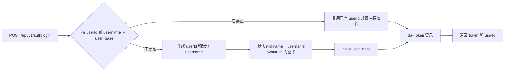
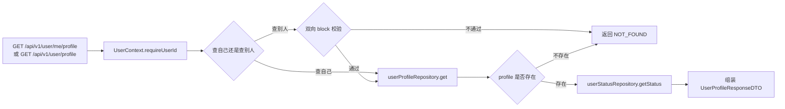
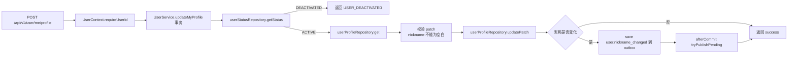
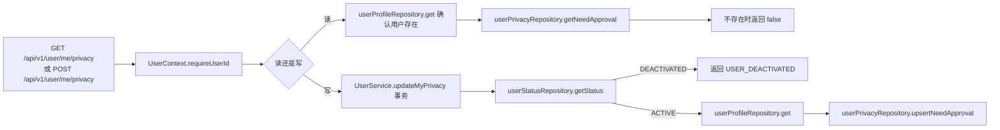
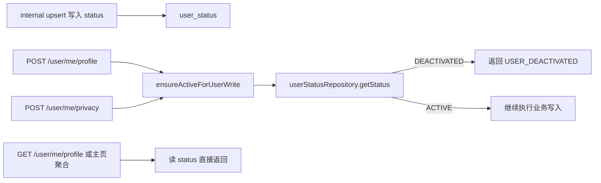
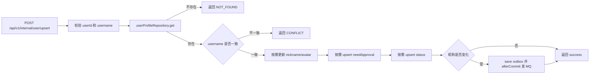
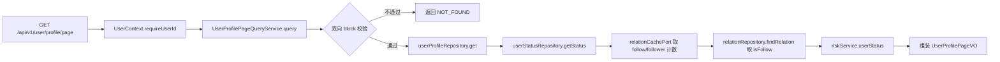
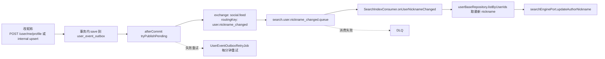
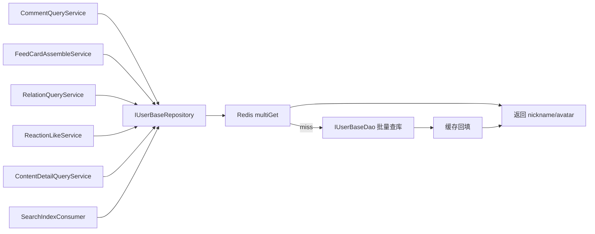
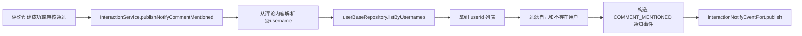

# 用户中心领域分析

## 1. 领域定位

用户中心在这套代码里，解决的不是“登录注册全家桶”，而是“用户已经有 `userId` 之后，这张名片怎么存、怎么改、怎么给别人看、怎么给别的领域复用”。

一句话概括：**用户中心 = 名片真值 + 隐私开关 + 账号状态 + 主页聚合 + 跨域读模型 + 昵称变更事件**。

当前源码里的真值拆分很清楚：

| 真值对象 | 真实落点 | 谁负责写 | 谁负责读 | 说明 |
| --- | --- | --- | --- | --- |
| 用户名片 | `user_base` | `UserService`、`AuthController` 边界初始化 | 用户资料接口、搜索、评论、关系、点赞人列表等 | 保存 `username`、`nickname`、`avatar_url` |
| 隐私设置 | `user_privacy_setting` | `UserService.updateMyPrivacy`、`UserService.internalUpsert` | 隐私查询接口、`RelationPolicyPort` | 当前只有 `need_approval` 一个开关 |
| 用户状态 | `user_status` | `UserService.internalUpsert` | 资料查询、主页聚合、普通写接口准入 | 当前只有 `ACTIVE / DEACTIVATED` |
| 用户事件 | `user_event_outbox` | `UserService` | `UserEventOutboxRetryJob`、RabbitMQ、搜索消费者 | 当前只承载 `user.nickname_changed` |
| 用户上下文 | `UserContext` + `UserContextInterceptor` | HTTP 拦截器统一注入 | 所有 `/api/v1/**` Controller | 当前代码优先从 Sa-Token 取登录态，取不到再读 `userId` 或 `X-User-Id` Header |

这个领域还有两个边界要先说清楚，不然后面会误判：

1. **用户创建不在用户中心主链里。** 当前仓库里，`user_base` 首次插入发生在 `AuthController.login`，用户中心内部接口 `POST /api/v1/internal/user/upsert` 是 update-only，不会自动建用户。
2. **主页不是把所有东西都塞进用户表。** 主页聚合时，用户中心只拿自己的名片和状态，再去关系域拿粉丝/关注，再去风控域拿能力状态。这是典型“真值分散，查询聚合”的设计。

## 2. 业务链路总表

| 序号 | 链路 | 类型 | 当前状态 |
| --- | --- | --- | --- |
| 1 | 用户基础档案初始化链路 | 边界链路 | 已实现，但创建发生在 `AuthController.login`，不是用户中心内部接口 |
| 2 | 用户资料查询链路（我自己 / 看别人） | 对外读链路 | 已实现 |
| 3 | 用户资料更新链路 | 对外写链路 | 已实现 |
| 4 | 隐私设置读写链路 | 对外读写链路 | **部分实现**，设置本身可读可写，但“关注需审批”还没接入 follow 主链 |
| 5 | 用户状态控制链路 | 内部规则链路 | 已实现，但状态只能通过 internal 接口改 |
| 6 | 内部同步更新链路 | 内部写链路 | 已实现，但仓库里未看到上游调用方 |
| 7 | 个人主页聚合链路 | 聚合读链路 | 已实现，但聚合范围目前只有 Profile + 关系 + 风控 |
| 8 | 昵称变更事件与搜索索引刷新链路 | 事件链路 | 已实现 |
| 9 | `user_base` 跨域读模型复用链路 | 内部同步读链路 | 已实现 |
| 10 | `@username` 提及映射链路 | 内部同步读链路 | 已实现 |

## 3. 链路 1：用户基础档案初始化链路

**链路名称**：用户基础档案初始化链路（边界链路）

**入口 / 核心类**：`AuthController.login`、`IUserBaseDao`、`UserBaseMapper.xml`

**要解决的问题**：用户中心后面的所有查询和更新，都默认 `user_base` 里已经有这条用户记录。如果系统没有一个“第一次把用户名片落下去”的地方，后面所有 Profile/Settings 都会直接 `NOT_FOUND`。

**Mermaid 流程图**：

**详细文本描述**：当前仓库里，真正负责“第一次插入 `user_base`”的不是用户中心 Controller，而是 `AuthController.login`。它会先按 `userId` 和 `username` 查一遍，如果命中了老数据，就只做冲突校验；如果没命中，就生成 `userId`，并把 `username`、`nickname`、`avatarUrl` 组装成一条 `user_base` 记录插进去。默认规则也很清楚：`nickname` 没传时就等于 `username`，头像没传时就是空串。

**实现方式为什么这么设计**：这样做的好处是边界清楚。登录/注册边界负责“有没有这个人”，用户中心负责“这个人的资料怎么改”。所以 `internal upsert` 故意不自动创建用户，而是让创建问题留在账号边界暴露出来，不在用户中心悄悄补洞。

**STAR 面试讲法**：S：用户域很多接口都要求 `user_base` 已存在；T：必须先找一个地方把最小用户名片初始化进去；A：我把初始化留在登录边界里，先查重，再插入，并用 `userId/username` 双向冲突校验保证不会串号；R：后面的用户中心接口可以统一假设“用户已存在”，内部写接口也能保持 update-only，不会默默制造脏数据。

**亮点 / 兜底 / 一致性 / 性能点**：初始化时同时支持按 `userId` 和 `username` 查重；插入失败后会再按 `username` 重查一次，避免并发场景下误判失败；默认昵称直接跟用户名对齐，保证系统一开始就有可展示字段。

**当前代码现状**：这条链路目前只在 `AuthController.login` 里看到，注释也写的是 `Minimal dev login`。也就是说，仓库里还看不到一个完整的“正式账号中心”实现，当前更像开发态的最小初始化入口。

**上游**：触发方是 `POST /api/v1/auth/login`。输入来自登录请求体里的 `userId / username / nickname / avatarUrl`，前置依赖是 `ISocialIdPort` 发号能力，以及 `IUserBaseDao` 对 `user_base` 的按 `userId/username` 查重。

**下游**：成功时写入 `user_base`，随后由 `Sa-Token` 建立登录态并返回 token。它不发 MQ、不刷缓存，但会直接决定后续资料查询、资料更新、隐私设置、主页聚合，以及评论/关系/搜索补用户名片这些链路能不能继续走。

**相关技术栈、职责与原理**
- `Spring MVC`：`AuthController` 用 `@RestController + @PostMapping` 接登录请求，适合把“创建最小用户名片”的边界收口在 HTTP 入口。
- `MyBatis + MySQL`：`IUserBaseDao + UserBaseMapper.xml` 直接查写 `user_base`，适合做显式查重和最小字段初始化，不会把建档逻辑藏进别的服务。
- `Sa-Token`：`StpUtil.login()` 在建档后立刻建立登录态，后面的用户链路优先从 token 取当前人，比让每个接口自己传 `userId` 更稳。

## 4. 链路 2：用户资料查询链路

**链路名称**：用户资料查询链路（我自己 / 看别人）

**入口 / 核心类**：`UserProfileController.myProfile`、`UserProfileController.profile`、`UserContext`、`IUserProfileRepository`、`IUserStatusRepository`、`IRelationPolicyPort`

**要解决的问题**：用户需要查自己的资料，也需要看别人的资料；但“看别人”不能泄露被拉黑用户的存在，同时返回里还要带上最小状态信息。

**Mermaid 流程图**：

**详细文本描述**：这条链路拆成两个接口。`GET /user/me/profile` 只查当前登录人；`GET /user/profile?targetUserId=...` 先拿当前查看者 `viewerId`，再做双向屏蔽校验，只要任意一边拉黑，就直接返回 `NOT_FOUND`。如果校验通过，再从 `user_base` 读 `username/nickname/avatarUrl`，再从 `user_status` 读状态，最后返回给前端。

**实现方式为什么这么设计**：一是统一由 `UserContext.requireUserId()` 取当前人，不信任请求体里的用户 ID；二是“看别人”先做 block 校验，再决定是否读数据，这样不会把“这个人其实存在，只是你没权限看”暴露出去；三是查询资料直接走 `UserProfileRepository -> userBaseDao.selectByUserId`，不走读模型缓存，优先保证当前资料是真值。

**STAR 面试讲法**：S：用户资料查询既要方便，又要避免隐私泄露；T：同一套接口要同时支持“看自己”和“看别人”；A：我把身份入口统一收口到 `UserContext`，把“看别人”的隐私判断放在读库之前，再把状态单独从 `user_status` 取出来；R：既保证了最小可用查询，又把拉黑场景处理成“不暴露存在性”的行为。

**亮点 / 兜底 / 一致性 / 性能点**：拉黑场景返回 `NOT_FOUND` 而不是“已拉黑”，这是典型防枚举做法；`user_status` 不存在时默认 `ACTIVE`，降低老数据迁移成本；资料查询读真值，避免用户刚改完昵称立刻读到旧缓存。

**当前代码现状**：这条链路已闭环。当前返回字段只有 `userId / username / nickname / avatarUrl / status`，没有简介、背景图之类扩展字段。

**上游**：触发方是 `GET /api/v1/user/me/profile` 和 `GET /api/v1/user/profile`。输入来源是当前请求里的登录态或 Header 注入的 `userId`，以及“看别人”时传入的 `targetUserId`；前置依赖是 `UserContextInterceptor` 先把当前人写进 `UserContext`，再由 `RelationPolicyPort` 做 block 校验。

**下游**：这条链路只读 `user_base` 和 `user_status`，不写表、不删缓存、不发 MQ，当前主要在本域内闭环。它的结果直接返回给前端，同时也给主页聚合链路复用同一套 Profile/Status 读口径。

**相关技术栈、职责与原理**
- `Spring MVC`：两个 `GET` 接口把“看自己”和“看别人”分开暴露，适合把读场景边界讲清楚。
- `Sa-Token + Header 注入 + ThreadLocal`：`UserContextInterceptor` 先尝试 `StpUtil.getLoginIdAsLong()`，取不到再读 `userId/X-User-Id` Header，并写入 `UserContext` 的 `ThreadLocal`；这样 Controller 统一从服务端上下文取当前人，不信任请求体。
- `MyBatis + MySQL`：`UserProfileRepository` 读 `user_base`，`UserStatusRepository` 读 `user_status`，适合这种“资料真值 + 最小状态”分表读取。

## 5. 链路 3：用户资料更新链路

**链路名称**：用户资料更新链路

**入口 / 核心类**：`UserProfileController.updateMyProfile`、`UserService.updateMyProfile`、`UserProfilePatchVO`、`UserProfileRepository`、`IUserEventOutboxPort`

**要解决的问题**：用户要改昵称和头像，但又不能把用户名改乱，不能把停用账号继续放行写入，还要在改昵称后把搜索索引一起刷新。

**Mermaid 流程图**：

**详细文本描述**：Controller 只做一件事，就是把 HTTP 请求转成 `UserProfilePatchVO`。真正的规则都在 `UserService.updateMyProfile` 里：先检查当前账号状态是不是 `DEACTIVATED`，再确认 `user_base` 里真的有这条用户记录，然后校验 patch 语义。这里的语义很重要：`null = 不改`，`avatarUrl = ""` 允许清空，`nickname` 只要是空白字符串就直接报错。更新成功后，如果发现昵称真的变了，就往 `user_event_outbox` 落一条 `user.nickname_changed`，并在事务提交后尝试发 MQ。

**实现方式为什么这么设计**：这套写法把“参数语义”“写库”“发事件”分开了。数据先改成功，再通过 `afterCommit` 发事件，避免消费者比数据库先看到消息；事件先落 outbox，再发 MQ，避免“数据库改成功但消息丢了”；Profile 真值写在 `user_base`，而不是到处复制昵称头像，后面评论、搜索、关系读侧都能复用。

**STAR 面试讲法**：S：资料更新最容易出“主库成功、搜索没更新”这种半成功问题；T：我要保证昵称修改后下游最终能收敛；A：我把 patch 语义收口到一个 VO，把账号停用校验放在写前，再用 outbox + after-commit 解决主库和消息的一致性问题；R：主流程保持简单，失败面被压缩，搜索索引也有可靠刷新路径。

**亮点 / 兜底 / 一致性 / 性能点**：`UserProfileRepository.updatePatch` 不直接用 MySQL `affectedRows` 判断是否存在，因为“值相同”也可能返回 0，所以它会二次 `selectByUserId` 确认用户是否存在；更新成功后会主动删掉 `social:userbase:{userId}` 缓存，让跨域读模型尽快看到新昵称；用户名映射缓存不用删，因为 `username` 在这套设计里是不可变的。

**当前代码现状**：这条链路已闭环。当前用户只能改 `nickname` 和 `avatarUrl`，不能改 `username`。

**上游**：触发方是 `POST /api/v1/user/me/profile`。输入来自 `UserProfileUpdateRequestDTO` 的 `nickname / avatarUrl`，前置依赖是 `UserContext` 提供当前 `userId`、`ensureActiveForUserWrite` 校验账号状态，以及 `user_base` 中已存在这条用户记录。

**下游**：主写入落到 `user_base`；成功后会删除 Redis 键 `social:userbase:{userId}`；如果昵称发生变化，再写 `user_event_outbox`，并在事务提交后投递到 `social.feed` 的 `user.nickname_changed`，继续影响搜索索引刷新和所有复用 `user_base` 读模型的查询链路。

**相关技术栈、职责与原理**
- `Spring MVC`：Controller 只负责接请求和组装 patch，适合把 HTTP 细节和业务规则分开。
- `Sa-Token + Header 注入 + ThreadLocal`：当前用户统一从 `UserContext` 取，避免客户端伪造“替别人改资料”。
- `MyBatis + MySQL`：`UserProfileRepository.updatePatch()` 更新 `user_base`，并在 `affectedRows=0` 时二次回表确认“是值没变，还是用户不存在”，这比单看行数更稳。
- `Redis`：这里只做读模型缓存失效，不参与真值写入，适合用户名片这种“低写高读”的场景。
- `Spring 事务 + Outbox + RabbitMQ`：先把事件写 `user_event_outbox`，`afterCommit` 再发 MQ，适合解决“主库成功但消息丢了”的半成功问题。

## 6. 链路 4：隐私设置读写链路

**链路名称**：隐私设置读写链路

**入口 / 核心类**：`UserSettingController.myPrivacy`、`UserSettingController.updateMyPrivacy`、`UserService.updateMyPrivacy`、`IUserPrivacyRepository`、`RelationPolicyPort`

**要解决的问题**：用户需要一个最小隐私开关，控制“别人关注我时要不要经过审批”。

**Mermaid 流程图**：

**详细文本描述**：读链路很直接，先确认 `user_base` 里有这个人，再查 `user_privacy_setting.need_approval`，如果没有这一行，就默认返回 `false`。写链路则和 Profile 一样，先做账号状态校验，再确认用户存在，最后对 `user_privacy_setting` 做 upsert。

**实现方式为什么这么设计**：把隐私开关单独放表，不跟 `user_base` 混在一起，意思很明确: 名片是名片，策略是策略。关系域如果需要这个开关，只能通过 `RelationPolicyPort` 去读，不自己维护一份副本，这样不会出现“双写后谁说了算”的问题。

**STAR 面试讲法**：S：用户设置类字段会越来越多，如果一开始就和名片混在一个对象里，后面改动会越来越脏；T：先把最小隐私开关独立出来；A：我用独立表做真值，读时默认 false，写时统一 upsert，并通过端口暴露给关系域；R：用户中心保留了配置所有权，关系域只读策略，不参与双写。

**亮点 / 兜底 / 一致性 / 性能点**：缺省返回 `false`，避免所有老用户都必须先初始化一条隐私记录；写接口走 upsert，避免“先查再插/改”的竞态；这类设置读写量不大，当前没有上缓存，优先保证配置变更立刻可见。

**当前代码现状**：**设置本身已可读可写，但“关注需审批”还没有真正接入 follow 主链。** 证据很直接：`RelationPolicyPort` 虽然实现了 `needApproval(targetId)`，但当前 `RelationService.follow(...)` 只校验 block、关注上限和重复关注，并没有调用 `needApproval(...)`。所以这条链路目前是“开关有了，真正业务动作还没接上”。

**上游**：触发方是 `GET /api/v1/user/me/privacy` 和 `POST /api/v1/user/me/privacy`。输入来源是当前请求里的登录态或 Header 注入 `userId`，写请求再额外带 `needApproval`；前置依赖是 `UserContext`、`user_base` 已存在，以及写链路里的账号状态校验。

**下游**：读写都落在 `user_privacy_setting`；当前不发 MQ、不刷缓存，关系域只能通过 `RelationPolicyPort.needApproval(targetId)` 来读取它。因为 `RelationService.follow(...)` 还没接这一步，所以当前主要在本域内闭环。

**相关技术栈、职责与原理**
- `Spring MVC`：对外暴露最小读写接口，适合把“用户自己配隐私”收在用户域。
- `Sa-Token + Header 注入 + ThreadLocal`：和 Profile 链路一样，当前人统一从服务端上下文取，避免客户端伪造配置对象归属。
- `MyBatis + MySQL`：`UserPrivacyRepository + UserPrivacyMapper.xml` 直接查写 `user_privacy_setting`，`ON DUPLICATE KEY UPDATE` 很适合这种单行配置开关的 upsert。

## 7. 链路 5：用户状态控制链路

**链路名称**：用户状态控制链路

**入口 / 核心类**：`UserService.ensureActiveForUserWrite`、`IUserStatusRepository`、`UserStatusRepository`、`UserStatusMapper.xml`

**要解决的问题**：系统需要一个最小的账号状态，能表达“这个人是否还能继续改资料、改设置”，但又不想把风控那套复杂能力模型塞进用户中心。

**Mermaid 流程图**：

**详细文本描述**：状态表很简单，只有 `ACTIVE` 和 `DEACTIVATED`。普通写请求在真正改资料前，都会走 `ensureActiveForUserWrite`。如果是 `DEACTIVATED`，直接拒绝；如果 `user_status` 里根本没这行，仓储会默认当成 `ACTIVE`。读请求不拦，仍然可以把状态读出来返回给前端或主页。

**实现方式为什么这么设计**：用户中心只做“最小状态”，不重复实现风控的 `POST_BAN / COMMENT_BAN / LOGIN_BAN`。所以停用状态只拦普通写接口，不拦资料查询；更细的能力，比如“还能不能发帖、能不能评论”，交给 `RiskService.userStatus` 去算。

**STAR 面试讲法**：S：业务上既需要“停用账号不能继续写”，又不能把风控复杂度全搬进用户域；T：做一个最小但清楚的状态模型；A：我把状态单独抽成 `user_status`，写前统一拦，读时只展示不阻断，并约定缺失记录默认 `ACTIVE`；R：迁移成本低，职责也不打架。

**亮点 / 兜底 / 一致性 / 性能点**：缺失记录默认 `ACTIVE`，这对老数据非常友好；普通读请求不受 `DEACTIVATED` 影响，避免把“停用后历史资料完全不可见”这种用户侧惊讶行为带进来；状态写入和读出都很轻量，单行 upsert 足够。

**当前代码现状**：当前没有单独的“用户自己停用账号”接口，也没有用户域自己的后台管理接口。状态只能通过 internal upsert 从系统侧写入。

**上游**：读侧上游主要是资料查询和主页聚合，要把状态带给前端；写侧上游主要是 `updateMyProfile`、`updateMyPrivacy` 在写前调用 `ensureActiveForUserWrite`，以及 `internalUpsert` 从系统侧同步 `status`。输入来源分别是当前用户写请求和内部同步请求。

**下游**：状态真值落在 `user_status`，并继续影响 Profile/Privacy 两条普通写链的准入，以及资料查询、主页聚合的返回字段。不发 MQ、不走缓存，当前主要在本域内闭环。

**相关技术栈、职责与原理**
- `MyBatis + MySQL`：`UserStatusRepository + UserStatusMapper.xml` 用单行 upsert 维护 `user_status`，很适合 `ACTIVE / DEACTIVATED` 这种最小状态模型。
- `Spring 事务`：状态写入跟 `internalUpsert` 在一个事务里，适合保证“名片、隐私、状态”这种同次内部同步一起成功或一起回滚。

## 8. 链路 6：内部同步更新链路

**链路名称**：内部同步更新链路

**入口 / 核心类**：`InternalUserController.upsert`、`UserService.internalUpsert`、`UserInternalUpsertRequestVO`

**要解决的问题**：上游系统需要把用户名片、隐私开关、状态同步到用户中心，但不能让用户中心偷偷替上游补建用户，更不能让不可变的 `username` 被改乱。

**Mermaid 流程图**：

**详细文本描述**：这条链路不对外，只给系统用。它的规则比用户自己改资料更严格：`userId` 必填，`username` 必填且不能为空白；先按 `userId` 查当前 Profile，如果不存在就直接 `NOT_FOUND`；如果存在但请求里的 `username` 和库里不一致，直接 `CONFLICT`。只有一致时，才允许更新 `nickname`、`avatarUrl`、`needApproval`、`status`。如果昵称变了，同样会触发 `user.nickname_changed` 事件。

**实现方式为什么这么设计**：`internal upsert` 看起来像“帮上游补数据”，但源码故意做成 update-only。原因很现实：如果上游没有正确完成初始化，这本来就是上游的问题，用户中心不应该把错误吞掉，然后悄悄造一条可能不完整的用户数据。这样做虽然更“严格”，但系统边界更干净。

**STAR 面试讲法**：S：系统同步最怕“越权修数据”，最后谁都不知道真值在哪里；T：给上游一个可同步但不越界的接口；A：我把接口做成 update-only，并对 `username` 做强一致校验，只允许改可变字段；R：边界很清楚，错误暴露得早，也不会把用户名这种稳定主键改穿。

**亮点 / 兜底 / 一致性 / 性能点**：`username` 被当成不可变 handle，只做一致性校验，不允许被同步接口修改；昵称变化才发事件，不做无意义消息；状态和隐私设置都是按需更新，不传就不改。

**当前代码现状**：接口本身已经在仓库里落好，但全仓库搜索下来，没看到它的上游调用方。也就是说，这条链路在代码层面“可用”，但真正由哪个网关/系统来调，当前仓库里看不到。

**上游**：触发方是 `POST /api/v1/internal/user/upsert`。输入来源应当是外部系统或网关的内部同步请求，字段包含 `userId / username / nickname / avatarUrl / needApproval / status`；前置依赖是 `user_base` 已经存在，并且请求里的 `username` 必须和库里一致。当前代码现状是：上游调用方在仓库里没看到。

**下游**：按请求内容分别更新 `user_base`、`user_privacy_setting`、`user_status`；如果昵称变化，再写 `user_event_outbox` 并投递 `user.nickname_changed`，继续影响搜索索引刷新和跨域用户名片读链。它本身不负责自动建用户。

**相关技术栈、职责与原理**
- `Spring MVC`：`InternalUserController` 暴露内部 HTTP 入口，适合把系统同步和用户自助写接口分开。
- `MyBatis + MySQL`：同一条内部链路里分别更新 `user_base / user_privacy_setting / user_status`，适合把真值仍然留在各自表里，不搞“大表补丁”。
- `Spring 事务 + Outbox + RabbitMQ`：昵称变更仍然沿用和外部写链一致的事件通道，适合保证内部同步和搜索刷新口径一致。

## 9. 链路 7：个人主页聚合链路

**链路名称**：个人主页聚合链路

**入口 / 核心类**：`UserProfilePageController.profilePage`、`UserProfilePageQueryService`、`IRelationCachePort`、`IRelationRepository`、`IRiskService`

**要解决的问题**：个人主页不能只返回昵称和头像，还要给出粉丝数、关注数、我是否已关注对方，以及这个用户当前还能不能发帖/评论。

**Mermaid 流程图**：

**详细文本描述**：主页聚合从 `viewerId` 和 `targetUserId` 出发。先做和他人资料查询一样的双向 block 校验，然后分别去不同地方拿数据：Profile 和 status 来自用户中心自己的仓储；粉丝数、关注数来自关系缓存；`isFollow` 这种“当前查看者对目标的边”来自关系库；最后再去风控域拿一份 `UserRiskStatusVO`，里面会告诉前端这个人当前是 `NORMAL` 还是 `FROZEN`，以及还剩哪些能力。

**实现方式为什么这么设计**：主页是天然的“查询拼装场景”，不适合塞进一个大聚合里写死。把它单独做成 `QueryService` 的好处是很明显的：谁是真值就去谁那里读，用户中心自己不重复存一份粉丝数，也不重复算一份风控能力。

**STAR 面试讲法**：S：个人主页一定是跨域数据最多的页面之一；T：要在不打乱领域边界的前提下，把用户关心的关键信息一次性返回；A：我用 `UserProfilePageQueryService` 做编排，Profile 读用户域，计数读关系缓存，关系边读关系库，能力读风控域；R：页面可用性高，同时领域边界仍然清楚。

**亮点 / 兜底 / 一致性 / 性能点**：关注数和粉丝数走缓存，适合高频读取；`isFollow` 走关系库，避免缓存里查一条边把模型做复杂；风控能力不复制，直接问风控域，避免两边状态打架。

**当前代码现状**：当前主页聚合只包含 `profile + relation + risk`。作品数、获赞数、内容统计等常见主页字段，在现有源码里还没接进来。

**上游**：触发方是 `GET /api/v1/user/profile/page`。输入来源是当前查看者的登录态或 Header 注入 `userId`，再加上请求里的 `targetUserId`；前置依赖是 `UserContext`、双向 block 校验、用户域资料仓储、关系计数缓存/关系库，以及风控域查询服务都可用。

**下游**：这是纯聚合查询，不落库、不发 MQ。它会读用户域自己的 `user_base / user_status`，再读关系域的计数缓存和关注边，最后补一份风控状态返回前端，所以不是单域闭环，而是查询编排闭环。

**相关技术栈、职责与原理**
- `Spring MVC`：`UserProfilePageController` 暴露单独主页接口，适合把聚合查询和普通资料查询区分开。
- `Sa-Token + Header 注入 + ThreadLocal`：查看者身份仍然由 `UserContext` 统一提供，这样 `isFollow` 和 block 校验都能拿到可信的 `viewerId`。
- `MyBatis + MySQL`：Profile/Status 仍从用户域真值表读，关系边也通过 `IRelationRepository` 回源，适合保证主页里的关键身份信息和关系判断不漂移。
- `Redis`：`RelationCachePort` 用 Redis Hash 缓存 follow/follower 计数，适合主页这种高频只读计数场景。

## 10. 链路 8：昵称变更事件与搜索索引刷新链路

**链路名称**：昵称变更事件与搜索索引刷新链路

**入口 / 核心类**：`UserService.updateMyProfile`、`UserService.internalUpsert`、`UserEventOutboxPort`、`UserEventOutboxRetryJob`、`SearchIndexMqConfig`、`SearchIndexConsumer.onUserNicknameChanged`、`SearchEnginePort.updateAuthorNickname`

**要解决的问题**：搜索索引里冗余了作者昵称。用户一旦改昵称，主库改对了还不够，搜索结果里的作者昵称也必须跟着收敛，而且不能因为 MQ 一次失败就永远脏掉。

**Mermaid 流程图**：

**详细文本描述**：写入口不会直接发 MQ，而是先把 `userId + tsMs` 落到 `user_event_outbox`。事务提交后，会立刻尝试把待发送事件投出去；如果失败，定时任务每分钟再重试一次。搜索侧通过 `search.user.nickname_changed.queue` 消费这条消息，收到后不信任消息体里的昵称，而是回表再查一次 `user_base`，然后调用 `SearchEnginePort.updateAuthorNickname(...)` 对搜索索引做 update-by-query。

**实现方式为什么这么设计**：这条链路做了三层保护。第一层是 `afterCommit`，防止消息比数据库更早可见；第二层是 outbox，防止“数据库成功、MQ 丢失”；第三层是消费者回表查最新昵称，防止消息体里带太多冗余字段导致版本不一致。消息体最小化，只发 `{userId, tsMs}`，就是为了让真值永远留在主库。

**STAR 面试讲法**：S：搜索索引本质上是副本，不可能和主库强一致，但又不能长期脏；T：要让昵称修改后搜索最终一定收敛；A：我把事件生产做成 outbox，事务后再发，失败靠定时任务重试，搜索消费时只拿 userId 回主库取最新昵称；R：主库和索引之间形成了可靠的最终一致链路。

**亮点 / 兜底 / 一致性 / 性能点**：`SearchIndexMqConfig` 给这条队列单独配了重试和 DLQ；`UserEventOutboxPort` 对事件按 `event_type:userId:tsMs` 做指纹去重；搜索侧用 update-by-query，只改作者昵称字段，不需要整篇重建文档。

**当前代码现状**：这条链路已经闭环，仓库里同时存在 producer、outbox、定时重试、MQ 绑定和 search consumer。

**上游**：触发方不是单独接口，而是链路 3 和链路 6 里的“昵称确实发生变化”。输入来源被压成最小事件 `{userId, tsMs}`，前置依赖是事务已经提交、`user_event_outbox` 落库成功，以及 MQ/消费者链路可用。

**下游**：先写 `user_event_outbox`，再投到 `social.feed` 交换机和 `search.user.nickname_changed.queue`；搜索消费者会回表读最新 `user_base` 后更新搜索索引作者昵称。失败时会把 outbox 状态打成 `FAIL` 供定时任务重试，消费侧重试耗尽后进 DLQ，直接影响搜索查询链路的最终一致性。

**相关技术栈、职责与原理**
- `Spring 事务 afterCommit`：只有数据库事务成功提交后才尝试发消息，适合避免“索引先看到新昵称、主库还没提交”的时序问题。
- `MyBatis + MySQL`：`UserEventOutboxMapper.xml` 把事件落在 `user_event_outbox`，并用 `fingerprint` 去重，适合把消息可靠性收口在数据库里。
- `RabbitMQ / Spring AMQP`：`RabbitTemplate` 负责投递，`@RabbitListener` 负责消费，`SearchIndexMqConfig` 还配置了重试和 DLQ，适合这种允许最终一致但不能无限静默失败的刷新链路。
- `MyBatis + Redis`：消费者不是信消息体里的昵称，而是通过 `IUserBaseRepository.listByUserIds(...)` 回表/回缓存拿最新真值，适合降低事件版本漂移风险。

## 11. 链路 9：`user_base` 跨域读模型复用链路

**链路名称**：`user_base` 跨域读模型复用链路

**入口 / 核心类**：`IUserBaseRepository`、`UserBaseRepository`、`CommentQueryService`、`FeedCardAssembleService`、`RelationQueryService`、`ReactionLikeService`、`ContentDetailQueryService`、`SearchIndexConsumer`

**要解决的问题**：评论列表、Feed 卡片、关系列表、点赞人列表、内容详情、搜索索引都需要昵称和头像。如果每个地方都自己查 `user_base`，系统很快就会变成 N+1 查询地狱。

**Mermaid 流程图**：

**详细文本描述**：用户中心没有把昵称头像复制到各个领域，而是把 `user_base` 做成一个“最小用户名片读模型”。调用方必须走 `IUserBaseRepository` 的批量接口。这个仓储内部会先去 Redis 批量拿缓存，没命中的再一次性回源数据库。`listByUserIds(...)` 负责“按用户 ID 补名片”，`listByUsernames(...)` 负责“按 username 反查 userId 再补名片”。评论列表、Feed、关系列表、点赞人列表、内容详情甚至搜索消费者，都是靠这套能力补昵称头像的。

**实现方式为什么这么设计**：这里的关键不是“有缓存”，而是“接口被设计成只能批量查”。这是一种很好的约束式设计。因为调用方根本拿不到单查接口，所以它天然不容易写出循环查库的 N+1 代码。仓储内部还把“昵称为空时回退到 username”的兼容逻辑压在一处，调用方不需要到处打补丁。

**STAR 面试讲法**：S：很多读场景都要补昵称头像，如果让业务方自己查，很容易出现重复查库和兼容逻辑四处扩散；T：做一个统一、批量、可缓存的用户读模型；A：我把接口限定成批量查询，并在仓储内部做去重、Redis `multiGet`、数据库回源和缓存回填；R：多个领域复用同一套读模型，性能和一致性都更容易守住。

**亮点 / 兜底 / 一致性 / 性能点**：`UserBaseRepository` 会先对输入去重并保序；按 `userId` 读取的缓存 key 是 `social:userbase:{userId}`，按 `username` 读取时先命中 `social:userbase:uid:{username}`，再复用 `listByUserIds(...)`；缓存 TTL 是 1 小时；昵称回退到 `username` 的兼容逻辑只允许留在仓储层一处，避免调用方复制补丁。

**当前代码现状**：这条链路已经非常成熟，是用户中心最像“基础设施能力”的一部分。注意，Profile 自己的查询没有走这个缓存仓储，而是直接读主库，这是有意为之。

**上游**：触发方来自评论列表、Feed 卡片、关系列表、点赞人列表、内容详情、搜索消费者这些跨域读场景。输入来源是批量 `userId` 或批量 `username`，前置依赖是调用方先把需要补的用户集合收集好，而不是循环单查。

**下游**：先读 Redis 的 `social:userbase:{userId}` 和 `social:userbase:uid:{username}`，miss 时回源 `user_base`，再把结果回填缓存。它不发 MQ，但会直接影响评论、Feed、关系、点赞列表、内容详情、搜索消费这些查询链路的昵称头像补全。

**相关技术栈、职责与原理**
- `Redis`：`UserBaseRepository` 用 `multiGet` 批量取缓存，并回填 `userId -> 名片`、`username -> userId` 两套 key，适合高频读和批量补全。
- `MyBatis + MySQL`：缓存 miss 时通过 `IUserBaseDao` 批量查 `user_base`，适合守住这份跨域读模型的主真值。
- `ObjectMapper`：缓存里只序列化 `userId / nickname / avatarUrl` 这组最小字段，适合把缓存对象做小，减少无关字段漂移。

## 12. 链路 10：`@username` 提及映射链路

**链路名称**：`@username` 提及映射链路

**入口 / 核心类**：`InteractionService.publishNotifyCommentMentioned`、`IUserBaseRepository.listByUsernames`、`InteractionNotifyEvent`

**要解决的问题**：评论里出现 `@username` 时，系统要知道到底提及了谁，并把通知发给正确的人。这个映射不能靠前端传 `userId`，否则很容易被伪造。

**Mermaid 流程图**：

**详细文本描述**：评论主链在创建成功后，会调用 `publishNotifyCommentMentioned(...)`。这个方法先从评论文本里提取 `@username`，再通过 `userBaseRepository.listByUsernames(...)` 把这些用户名批量映射成真实 `userId`。拿到 `userId` 后，会过滤掉“自己提及自己”这种无效情况，然后给每个被提及的人发一条 `COMMENT_MENTIONED` 通知事件。

**实现方式为什么这么设计**：后端自己解析 `@username`，意味着“提及谁”这件事由服务端决定，不受客户端伪造影响。再加上 `user_base.username` 在库里是唯一且区分大小写的，这就让 `@username -> userId` 的映射足够稳定，历史评论里的提及不会因为昵称修改而漂移。

**STAR 面试讲法**：S：评论提及是个小功能，但如果映射做错，通知就会发给错误的人；T：把提及对象的识别放到服务端做成可信逻辑；A：我在评论成功后解析 `@username`，统一走 `user_base` 映射 userId，再发布标准通知事件；R：提及通知的目标人稳定、可信，也顺手复用了用户中心的读模型能力。

**亮点 / 兜底 / 一致性 / 性能点**：提及映射是批量处理，不是一个用户名查一次库；不存在的用户名会被自然忽略，不影响评论主流程；“提及通知”是旁路逻辑，即使失败也只记 warning，不会把评论创建主链拖死。

**当前代码现状**：这条链路已闭环。它依赖的是 `username` 的稳定性，而不是 `nickname`，所以改昵称不会影响历史提及。

**上游**：触发方是评论创建成功，或者待审核评论在风控放行后补发通知。输入来源是评论正文里的 `@username` 文本，前置依赖是后端先解析出用户名集合，再通过 `IUserBaseRepository.listByUsernames(...)` 做可信映射，而不是信前端传 `userId`。

**下游**：用户中心这一侧不写表，只负责把 `@username` 映射成真实 `userId`；之后会发布 `COMMENT_MENTIONED` 通知事件到互动通知链路，影响通知聚合和通知列表查询，所以用户中心在这里主要提供稳定映射能力。

**相关技术栈、职责与原理**
- `Redis + MyBatis + MySQL`：`UserBaseRepository.listByUsernames(...)` 先查 `username -> userId` 缓存，miss 再回 `user_base`，适合把 `@username` 映射做成稳定、批量、可缓存的基础能力。
- `RabbitMQ`：`InteractionNotifyEventPort` 最终通过 `ReliableMqOutboxService` 把 `COMMENT_MENTIONED` 发到 `social.interaction`，适合把通知发布从评论主事务里旁路出去。
- `MySQL`：`user_base.username` 在 schema 里是唯一且区分大小写的，适合做 `@username -> userId` 的稳定键，不会因为昵称变化而漂移。

## 13. 面试官最感兴趣的亮点汇总

1. **真值拆分很干净。** 名片、隐私、状态、事件各有自己的表，没有把所有字段糊进一个大对象里。
2. **用户上下文统一入口。** Controller 不信任请求体里的 `userId`，统一从 `UserContext` 取当前人，避免一堆接口各自判断。
3. **`user_base` 是可复用的读模型，不是顺手写出来的工具类。** 它强制批量查询，内部有 Redis 多读少写缓存，还把昵称兼容逻辑压在仓储层一处。
4. **昵称更新做到了可靠最终一致。** 不是“改完资料顺手发个 MQ”，而是 `afterCommit + outbox + retry job + DLQ + 搜索侧回表查真值`。
5. **主页聚合用了 Query Service，而不是把所有跨域数据硬塞进用户聚合。** 这类设计很符合大厂常见的“写真值分散，读场景编排”思路。
6. **状态和风控故意分开。** 用户中心只管 `ACTIVE / DEACTIVATED` 这种最小账号状态，发帖/评论能力交给风控域，不重复造一套规则。
7. **update-only 的 internal 同步接口是好味道。** 不帮上游自动建用户，不偷偷修改不可变 `username`，边界清晰，错误暴露得早。

## 14. 当前边界与可追问风险

1. **用户初始化链路还比较“开发态”。** 当前仓库里创建 `user_base` 的地方是 `AuthController.login`，不是一个正式的账号中心或注册服务。
2. **隐私设置还没真正影响 follow 主链。** `needApproval` 已经能存，也有策略端口，但 `RelationService.follow(...)` 没接它，所以“关注需审批”目前还不是闭环能力。
3. **主页聚合范围还比较克制。** 现在只有 `Profile + 关系统计 + 风控能力`，没有作品数、获赞数、内容统计等常见主页数据。
4. **internal upsert 的上游调用方不在当前仓库。** 面试时如果被问“谁来调这个接口”，只能老实说：接口已经准备好，但当前代码库没看到调用方实现。
5. **搜索昵称刷新是最终一致，不是强一致。** 好处是主链简单、可靠；代价是用户刚改昵称的一小段时间内，搜索结果可能暂时还是旧昵称。
6. **用户上下文信任链依赖网关或登录态。** 当前代码优先信任 Sa-Token 登录态，取不到再读 Header，这说明用户域本身不承担鉴权真伪校验。

## 15. 一句话收尾

如果面试官只给你 30 秒总结这个领域，可以直接说：

**这套用户中心不是一个“资料 CRUD 模块”，而是把用户名片真值、隐私开关、账号状态、主页聚合和跨域读模型拆开处理。写链路靠 `UserService` 收口，读链路靠 `user_base` 复用，跨域一致性靠 outbox 事件补齐。当前最明显的未闭环点，是“关注需审批”这个开关已经能配，但还没真正进入 follow 主链。**
