# 内容生产与发布中心领域分析

## 1. 领域定位

一句话先讲清楚：**这个域就是“把一条内容从还没上传，变成可保存、可审核、可发布、可定时、可回滚、可追责”的总装车间。**

它不是单纯的“发帖接口”。从源码看，这个域至少同时管 6 类东西：

| 核心对象 | 作用 | 主要拥有/修改方 | 面试里怎么解释 |
| --- | --- | --- | --- |
| `content_draft` | 云端草稿 | `ContentService.saveDraft/syncDraft` | 先拿稳定 ID，再谈发布、定时、回滚 |
| `content_post` | 当前可见版本主表 | `publish/delete/rollback/applyRiskReviewResult` | 这是“用户现在看到什么”的真相来源 |
| KV 正文（`content_uuid` -> Cassandra） | 大正文单独存储 | `upsertPost/rollback` 写，`ContentRepository.findPost` 回填 | 主表轻、读写快，正文不用硬塞进 MySQL 热表 |
| `content_history` | 历史版本快照 | `publish/review/rollback` 写入 | 回滚和审计都靠它，不能和当前主表混在一起 |
| `content_publish_attempt` | 发布尝试过程表 | `publish/applyRiskReviewResult/getPublishAttemptAudit` | 一次发布有没有被风控拦、有没有转码、最后什么结果，都在这里 |
| `content_schedule` | 定时发布任务 | `schedule/cancel/update/executeSchedule` | 未来时间点要发生的事，不能靠内存定时器，要靠落库 + MQ |

从业务边界看，这个域自己负责：

- 上传会话
- 草稿保存与同步
- 正式发布
- 发布尝试审计
- 内容详情
- 删除
- 定时发布、取消、更新、执行
- 历史版本与回滚
- 风控审核结果回流后的状态推进
- 发布后摘要回写

它依赖但不亲自实现的东西：

- 对象存储：`MediaStoragePort`，当前默认 MinIO
- 风控决策：`IRiskService`
- 媒体转码：`IMediaTranscodePort`
- MQ 与 Outbox：可靠消息和异步消费
- 缓存：本地 Caffeine、Redis、热点续命、广播失效

最值得面试里先抛出来的设计点有两个：

1. **`draftId = postId`**。草稿、正式内容、定时任务都围着同一个 ID 转，少了一层“草稿 ID 和正文 ID 映射表”的复杂度。
2. **“当前可见态”和“过程审计态”被拆开了**。`content_post` 管当前展示，`content_publish_attempt` 管发布过程，`content_history` 管历史版本。

## 2. 业务链路总表

| 编号 | 链路 | 入口 / 核心类 | 关键数据 | 当前代码现状 |
| --- | --- | --- | --- | --- |
| 1 | 上传会话 | `ContentController.createUploadSession` / `ContentService.createUploadSession` | `UploadSessionVO` | 已落地，默认 MinIO，`crc32` 目前未真正校验 |
| 2 | 草稿保存 | `ContentController.saveDraft` / `ContentService.saveDraft` | `content_draft` | 已落地，`draftId=postId` |
| 3 | 草稿同步 | `ContentController.syncDraft` / `ContentService.syncDraft` | `content_draft.client_version` | 已落地，但不是“真 diff 合并”，而是覆盖写 |
| 4 | 正式发布 | `ContentController.publish` / `ContentService.publish` | `content_post` + `content_history` + `content_publish_attempt` | 主链已落地；转码端口当前是占位实现 |
| 5 | 发布尝试审计 | `ContentController.publishAttempt` / `ContentService.getPublishAttemptAudit` | `content_publish_attempt` | 已落地，只支持按 `attemptId` 查单条 |
| 6 | 内容详情 | `ContentController.detail` / `ContentDetailQueryService` | `content_post` + KV 正文 + 用户信息 + 点赞数 | 已落地，读路径很完整 |
| 7 | 删除内容 | `ContentController.delete` / `ContentService.delete` | `content_post.status=6` | 已落地，软删 + 延迟物理清理 |
| 8 | 定时发布创建 | `ContentController.schedule` / `ContentService.schedule` | `content_schedule` | 已落地，`timezone` 当前未使用 |
| 9 | 取消定时 | `ContentController.cancelSchedule` / `ContentService.cancelSchedule` | `content_schedule.is_canceled` | 已落地 |
| 10 | 更新定时 | `ContentController.updateSchedule` / `ContentService.updateSchedule` | `content_schedule.schedule_time` | 已落地，但只允许改时间，不允许改内容 |
| 11 | 风控审核结果回流 | `RiskAsyncService.applyToBiz` / `RiskAdminService.applyToBiz` / `ContentService.applyRiskReviewResult` | `content_publish_attempt` + `content_post` | 已落地，依赖风控域闭环 |
| 12 | 调度执行 | `ContentScheduleConsumer.onMessage` / `ContentService.executeSchedule` | `content_schedule` + 延时 MQ | 已落地，DLQ 告警还是日志占位 |
| 13 | 历史版本查询 | `ContentController.history` / `ContentService.history` | `content_history` | 已落地，只返回标题/正文/时间，不回媒体快照 |
| 14 | 版本回滚 | `ContentController.rollback` / `ContentService.rollback` | `content_history` -> `content_post` | 已落地，但有一处失败后仍写 history 的边界风险 |
| 15 | 发布后摘要回写 | `ContentEventOutboxPort.savePostSummaryGenerate` / `PostSummaryGenerateConsumer` | `content_post.summary` | 已落地，但摘要生成端口当前是占位实现 |

## 3. 链路逐条展开

### 链路 1：上传会话

**链路名称**

- 上传会话

**入口 / 核心类**

- HTTP 入口：`ContentController.createUploadSession`
- 领域服务：`ContentService.createUploadSession`
- 存储路由：`MediaStoragePort`
- 默认实现：`MinioMediaStorageStrategy`

**要解决的问题**

- 大文件不能先传到应用服务器再中转，不然服务器既费带宽又容易被打爆。
- 客户端需要先拿到一个“临时上传凭证”，再直接把文件打到对象存储。

**Mermaid 流程图**

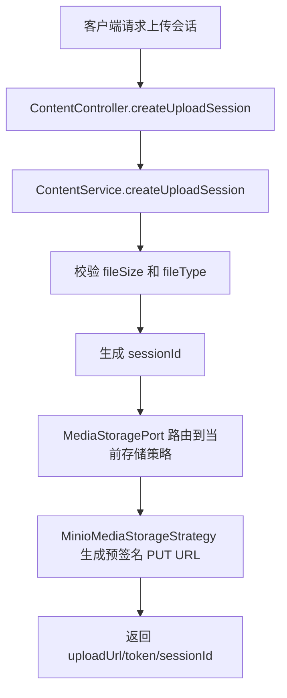

**详细文本描述**

- 控制器只做一件事：收请求，交给领域服务。
- `ContentService` 先做轻量校验：
  - 文件大于 50MB 直接拒绝。
  - `fileType` 不在白名单里，就自动降级成 `application/octet-stream`。
- 服务生成 `sessionId = "session-" + socialIdPort.nextId()`。
- 再通过 `MediaStoragePort` 找到当前配置的存储策略。默认是 MinIO。
- `MinioMediaStorageStrategy` 会：
  - 保证 bucket 存在；
  - 生成一个对象名；
  - 返回预签名 `PUT` URL；
  - 把 `token` 直接等同于 `uploadUrl` 返回。

**实现方式为什么这么设计**

- 这是典型的“应用只签名，不搬运文件”。服务器不碰大文件，主链路更轻。
- `MediaStoragePort` 做了一层路由，将来切 OSS、S3、MinIO，不用改业务服务。
- 白名单 + 大小限制是第一层防线，先在入口做粗过滤，便宜且有效。

**上游**

- 直接上游是客户端准备上传媒体时发起的会话申请，请求里带 `fileSize`、`fileType`、`crc32`。
- 这一步发生在草稿保存之前，先把媒体的上传落点准备好，后面的草稿和发布链路只消费媒体结果，不在这里创建内容记录。

**下游**

- 客户端拿到 `uploadUrl/token/sessionId` 后，会直接把文件传到 MinIO，而不是先传给应用服务器。
- 上传成功后的媒体引用，再进入草稿保存、草稿同步或正式发布链路；这个接口本身不写 `content_draft`、`content_post`。

**相关技术栈、职责与原理**

- `Spring MVC`：负责接住 HTTP 请求并交给 `ContentController`。适合这里，因为上传会话只是轻编排接口，控制层保持薄，参数校验和错误返回能统一处理。
- `MinIO`：负责对象存储和预签名 `PUT` URL。适合这里，因为媒体文件大，客户端直传对象存储可以把带宽和 CPU 压力从应用服务器挪走。

**STAR 面试讲法**

- S：内容平台里图片和视频上传量大，如果先传给应用服务器再中转，成本和风险都很高。
- T：我要把上传从“服务器搬运”改成“服务器签名，客户端直传”。
- A：我在内容域里做上传会话接口，只生成 `sessionId` 和预签名 URL；再用存储端口把 MinIO 这种具体实现隔离出去。
- R：上传主链路压力从应用层移走，服务端只承担参数校验和凭证签发，后续接别的对象存储也不用改业务逻辑。

**亮点 / 兜底 / 一致性 / 性能点**

- 亮点：上传前只生成“会话”，不提前创建内容记录，职责清楚。
- 亮点：`fileType` 降级到通用二进制类型，避免前端乱传导致服务崩。
- 兜底：如果存储端生成签名失败，会抛异常并返回统一错误。
- 性能点：应用服务器不转发媒体流量，节省带宽和 CPU。

**当前代码现状**

- 默认实现是 MinIO。
- `crc32` 参数虽然一路传下去了，但 `MinioMediaStorageStrategy` 里目前没有真的拿它做校验。

### 链路 2：草稿保存

**链路名称**

- 草稿保存

**入口 / 核心类**

- HTTP 入口：`ContentController.saveDraft`
- 领域服务：`ContentService.saveDraft`
- 仓储：`ContentRepository.saveDraft`

**要解决的问题**

- 用户写一半的内容不能丢。
- 正式发布前，需要先拿到一个稳定 ID，后面的定时发布、回滚、历史版本都要围着这个 ID 转。

**Mermaid 流程图**

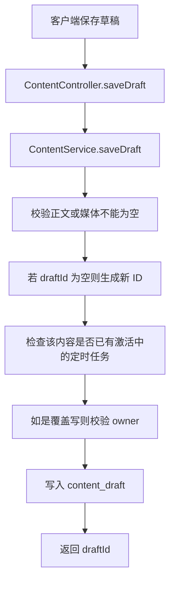

**详细文本描述**

- `saveDraft` 要求正文和媒体至少有一个非空。
- 如果前端没传 `draftId`，服务端生成一个新 ID。
- 这套代码约定：**`draftId = postId`**。
- 如果是覆盖已有草稿，会先查库并校验归属，避免别人覆盖你的草稿。
- 然后把标题、正文、媒体列表、设备信息、客户端版本写进 `content_draft`。
- 这里用的是 upsert，等价于“有就更新，没有就插入”。

**实现方式为什么这么设计**

- 把草稿 ID 和正式内容 ID 做成同一个，是这里最有“好品味”的设计。这样：
  - 发布不用再做草稿 ID -> 内容 ID 转换；
  - 定时任务直接绑 `postId`；
  - 历史版本、删除、回滚全都围着同一个对象。
- `assertNotScheduled` 让“已定时的内容”变成冻结态，避免定时前最后一秒还在乱改内容。

**上游**

- 上游通常是用户已经完成文字输入或媒体上传，携带标题、正文、媒体列表来保存草稿。
- 如果前面已经走过上传会话，这里只接媒体引用，不重复处理对象存储本身。

**下游**

- 这一步产出稳定的 `draftId/postId`，给草稿同步、正式发布、定时发布创建、版本回滚这些后续链路复用。
- 如果内容已经挂了激活中的定时任务，这里会直接拦住，避免把后续执行链路的输入改乱。

**相关技术栈、职责与原理**

- `Spring MVC`：负责草稿保存接口入口。适合这里，因为保存草稿是标准同步请求，控制器薄、服务层厚，边界清楚。
- `MyBatis + MySQL`：负责把 `content_draft` 做 upsert、归属校验和定时任务状态检查。适合这里，因为草稿是强一致状态数据，需要关系表的事务和条件更新能力。

**STAR 面试讲法**

- S：用户会反复编辑内容，如果先没有稳定 ID，后面的发布、定时、回滚都会变复杂。
- T：我需要让“写草稿”和“正式内容”从第一天开始就指向同一个业务对象。
- A：我让 `draftId=postId`，草稿先占坑，后续发布直接在这个 ID 上推进状态，而不是再造一层映射。
- R：整个内容生命周期都围着一个 ID 转，链路简单很多，特殊情况也少很多。

**亮点 / 兜底 / 一致性 / 性能点**

- 亮点：`draftId=postId` 直接把后续链路复杂度砍掉一层。
- 一致性：已有定时任务时禁止继续改草稿，保证“定时发布的内容”是稳定快照。
- 兜底：覆盖写时做 owner 校验，避免串号。
- 性能点：草稿表结构很轻，不把发布态字段都塞进来。

**当前代码现状**

- `deviceId` 在 `saveDraft` 里被写死为 `"unknown"`。
- 保存是整条覆盖，不做差量合并。

### 链路 3：草稿同步

**链路名称**

- 草稿同步

**入口 / 核心类**

- HTTP 入口：`ContentController.syncDraft`
- 领域服务：`ContentService.syncDraft`
- 仓储：`ContentRepository.findDraftForUpdate/saveDraft`

**要解决的问题**

- 用户可能在多端编辑草稿。
- 旧客户端不能把新内容顶掉。

**Mermaid 流程图**

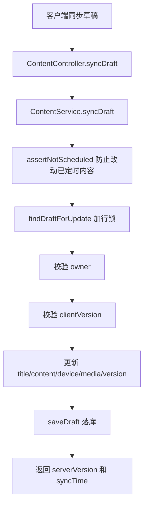

**详细文本描述**

- 同步前先做内容非空校验。
- 也会先检查有没有激活中的定时任务，有的话不让改。
- `findDraftForUpdate` 这一步会拿数据库行锁，避免两个客户端同时覆盖。
- 然后检查 `clientVersion` 是否够新。
- 如果版本通过，就把：
  - 标题
  - 正文
  - 设备号
  - 客户端版本
  - 媒体列表
  全量覆盖回草稿表。

**实现方式为什么这么设计**

- 这个场景本质上不是“合并文档”，而是“保护最新版本不被旧版本覆盖”。
- 行锁 + 客户端版本号，是成本最低、最稳的一种做法。
- 已经有定时任务时直接锁死内容，比支持“边定时边改内容”简单得多，也安全得多。

**上游**

- 上游是已经存在的草稿和来自不同客户端的同步请求，本质上是在同一个 `draftId/postId` 上继续编辑。
- 它依赖草稿保存链路先把基础记录建出来；没有草稿，这条链路就没有同步目标。

**下游**

- 同步成功后会更新 `content_draft.client_version` 和最新内容，给正式发布、定时发布创建提供新的输入基线。
- 版本过旧会被直接拒绝，不会继续推进到发布或定时这些下游链路。

**相关技术栈、职责与原理**

- `Spring MVC`：负责多端同步入口。适合这里，因为同步请求需要统一做参数校验和登录态边界。
- `MyBatis + MySQL`：负责 `findDraftForUpdate/saveDraft` 以及 `client_version` 相关读写。适合这里，因为 MySQL 行锁能守住同一条草稿的并发覆盖，MyBatis 让这类条件 SQL 保持清晰。

**STAR 面试讲法**

- S：多端同步最怕旧设备把新内容覆盖掉。
- T：我要做一个简单但可靠的冲突保护，不引入复杂文档合并。
- A：我用 `findDraftForUpdate` 加数据库行锁，再结合 `clientVersion` 做版本防护。
- R：同步流程足够稳，而且实现很短，没有演化成复杂的冲突合并引擎。

**亮点 / 兜底 / 一致性 / 性能点**

- 亮点：数据库行锁保证同一草稿不会被并发乱写。
- 一致性：`STALE_VERSION` 直接阻止旧版本覆盖。
- 兜底：媒体列表只有在请求传了新值时才覆盖。
- 性能点：同步只打一行草稿表，不碰发布主表。

**当前代码现状**

- `diffContent` 这个名字容易误导。当前实现并没有做“差量补丁合并”，而是直接把它当成新的全文内容。
- 版本判断是 `incoming >= current`，不是严格大于，所以“同版本重放”也会被接受。

### 链路 4：正式发布

**链路名称**

- 正式发布

**入口 / 核心类**

- HTTP 入口：`ContentController.publish`
- 领域服务：`ContentService.publish` / `publishInternal`
- 核心仓储：`ContentRepository`、`ContentPublishAttemptRepository`
- 外部协同：`IRiskService`、`IMediaTranscodePort`、`ContentEventOutboxPort`、`ContentCacheEvictPort`

**要解决的问题**

- 发布不是“写一张表”这么简单。
- 它要同时解决：
  - 并发重复点击
  - 风控拦截
  - 待审核隔离
  - 媒体转码
  - 版本历史
  - 缓存失效
  - 下游分发一致性

**Mermaid 流程图**

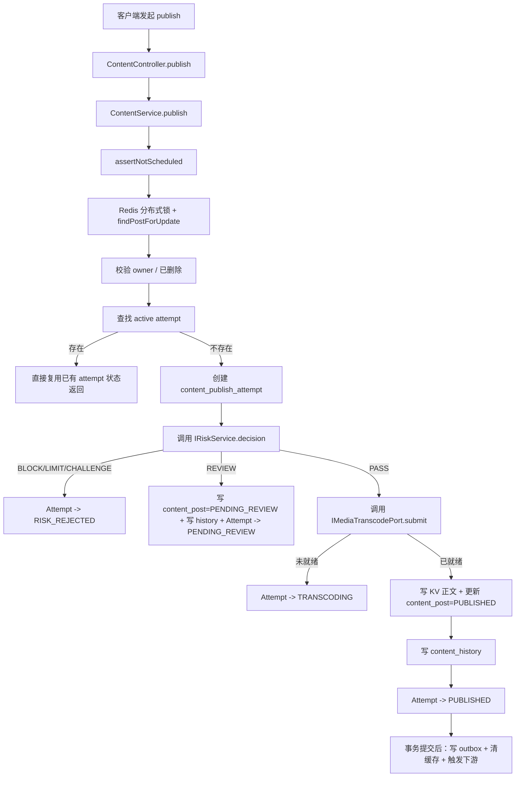

**详细文本描述**

- 这条链路先做 `assertNotScheduled`，也就是内容如果已经挂了定时任务，就不允许临时插队直接发。
- 然后拿两层锁：
  - Redis 分布式锁，防多实例同时发；
  - `findPostForUpdate` 行锁，防同一条记录版本漂移。
- 如果当前内容已经被删掉，直接返回 `DELETED`。
- 如果这个 `postId + userId` 已经有“进行中的发布尝试”，直接复用最新 attempt，不再重复创建。
- 然后构造一个幂等 token，用来创建 `content_publish_attempt`。
- 每次发布都会先写一条 Attempt，它记录：
  - 发布输入快照
  - 风控状态
  - 转码状态
  - 错误信息
  - 成功后的版本号
- 风控有三条主要分支：
  - `BLOCK/LIMIT/CHALLENGE`：Attempt 标记为拒绝，主表不动。
  - `REVIEW`：主表先进入 `PENDING_REVIEW`，同时写一条 `content_history`，Attempt 标记为待审核。
  - `PASS`：继续转码。
- 转码分支：
  - 未就绪：Attempt 标成 `TRANSCODING`，返回“处理中”。
  - 已就绪：真正推进可见版本。
- 真正发布成功时，会同时做 4 件事：
  - 把正文写进 KV，并在 `content_post` 里只存一个 `content_uuid`；
  - 更新 `content_post` 的状态、版本号、媒体、位置、可见性；
  - 写一条 `content_history` 快照；
  - 把 Attempt 推到 `PUBLISHED`。
- 事务提交后才做异步动作：
  - 写内容域 outbox；
  - 触发 `post.published` 或后续事件；
  - 清本地缓存、Redis 缓存和 feed 卡片缓存；
  - 触发“生成摘要”的异步事件。

**实现方式为什么这么设计**

- **Attempt 表** 是这条链路的关键。它把“这次发布过程发生了什么”从主表里拆出来，便于追查，也便于前端轮询。
- **主表只表达当前可见态**，历史表只表达“过去发生过哪些版本”，这样语义不混。
- **正文放 KV，主表放 UUID**，能让热读表更轻，不把大正文塞到主表热点行里。
- **Outbox after commit**，保证“库里已经成功，消息才允许发出去”，避免下游读到未提交数据。

**上游**

- 上游是已经保存好的草稿和用户发起的 publish 请求，输入里带稳定的 `postId`、标题、正文、媒体、可见性等发布信息。
- 这条链路还会先吃到风控判断和转码返回，把它们当成发布主链里的分支条件，而不是散落到别的地方补丁处理。

**下游**

- 成功后会推进 `content_post`、`content_history`、`content_publish_attempt` 三类数据，并给内容详情、历史查询、版本回滚提供事实来源。
- 事务提交后会清缓存、写 outbox、触发下游分发和摘要生成；如果进入 `PENDING_REVIEW`，后续还会由风控审核结果回流链路继续推进。

**相关技术栈、职责与原理**

- `Spring MVC`：负责发布 API 的 HTTP 入口。适合这里，因为发布前要做统一鉴权、参数校验和错误码返回，控制层保持薄更稳。
- `MyBatis + MySQL`：负责写 `content_post`、`content_history`、`content_publish_attempt`。适合这里，因为当前态、历史态、过程态都需要事务和条件更新，关系型表最容易保证一致性。
- `Redis`：负责分布式锁。适合这里，因为发布会遇到重复点击和多实例并发，跨 JVM 的短锁能先挡一层并发风暴。
- `Cassandra(KV)`：负责正文按 `content_uuid` 存取。适合这里，因为大正文不适合塞进 MySQL 热主表，KV 让主表保持轻量。
- `Outbox + RabbitMQ`：负责在事务提交后再发发布事件和后续异步任务。适合这里，因为下游分发、缓存失效、摘要生成都不能早于数据库提交。
- `风控回流`：负责把 `REVIEW` 分支延后到异步审核结果再落最终状态。适合这里，因为风控结论可能晚到，发布接口不能一直同步阻塞。

**STAR 面试讲法**

- S：发布一条内容，其实会撞上风控、转码、重复点击、缓存一致性、下游分发这些问题。
- T：我要把发布做成一条可审计、可重试、可解释、不会把状态写乱的主链。
- A：我把发布拆成 `content_post + content_history + content_publish_attempt + outbox` 四类数据，再用 Redis 锁、行锁、expected status/version 把并发压住。
- R：发布链路既能给前端同步返回状态，也能给异步审核和后续排障留下完整证据。

**亮点 / 兜底 / 一致性 / 性能点**

- 亮点：`activeAttempt` 复用，用户重复点击不会制造多条并发发布。
- 亮点：`postTypes` 会去重，最多保留 5 个，避免脏数据膨胀。
- 一致性：Redis 锁 + DB 行锁 + `expectedAttemptStatus` + `expectedVersion`，四层防并发漂移。
- 一致性：事务内先写库，事务后再清缓存、发事件。
- 兜底：转码端口返回 `null` 时，代码会降级为“已就绪”，不把主链直接打断。
- 性能点：正文写 KV，详情读走缓存，历史快照单独走 MySQL。

**当前代码现状**

- 这里要特别讲真话：`.codex/content-publish-attempt-implementation.md` 里说“`REVIEW` 分支只更新 Attempt，不更新 `content_post/history`”，**但真实源码不是这样**。当前源码里，`REVIEW` 会先把 `content_post` 写成 `PENDING_REVIEW`，也会写一条 `content_history`。
- `IMediaTranscodePort` 当前默认实现是占位，永远返回 `ready=true`。
- 发布接口不支持“没草稿直接发”。`postId` 不能为空，必须先存草稿拿 ID。
- `visibility=FRIEND` 当前直接抛错，不支持。

### 链路 5：发布尝试审计

**链路名称**

- 发布尝试审计

**入口 / 核心类**

- HTTP 入口：`ContentController.publishAttempt`
- 领域服务：`ContentService.getPublishAttemptAudit`
- 仓储：`ContentPublishAttemptRepository.findByAttemptId`

**要解决的问题**

- 发布可能不是秒成。
- 前端和排障人员需要知道：这次发布到底卡在风控、审核还是转码。

**Mermaid 流程图**

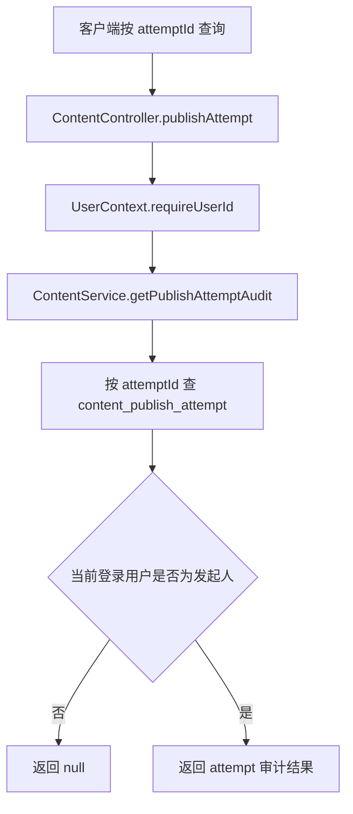

**详细文本描述**

- 发布接口返回 `attemptId`。
- 查询接口根据这个 `attemptId` 去 `content_publish_attempt` 里找记录。
- 能看到的内容包括：
  - `attemptStatus`
  - `riskStatus`
  - `transcodeStatus`
  - `transcodeJobId`
  - `publishedVersionNum`
  - 错误码和错误文案
- 只有发起人自己能看到。

**实现方式为什么这么设计**

- 如果没有 Attempt 审计，前端只能问“这条帖子为什么没出来”，但系统回答不了。
- 把过程状态和主表拆开后，审计接口就天然好做，也不污染主表语义。

**上游**

- 上游来自正式发布链路返回的 `attemptId`，这个 ID 是审计查询唯一锚点。
- 查询人必须是当次发布的发起人，这个权限前提来自登录上下文而不是请求里随便传的 `userId`。

**下游**

- 下游主要是前端轮询和排障查询，帮助判断当前卡在风控、审核还是转码。
- 这条链路只读 `content_publish_attempt`，不会反向改 `content_post` 或重新推进发布状态。

**相关技术栈、职责与原理**

- `Spring MVC`：负责暴露按 `attemptId` 查询的接口。适合这里，因为它就是一个标准同步查询 API，控制层边界非常清晰。
- `MyBatis + MySQL`：负责从 `content_publish_attempt` 读取过程态。适合这里，因为发布过程状态是结构化审计数据，关系表按主键查询成本低、语义也清楚。

**STAR 面试讲法**

- S：发布链路存在异步环节，前端不能只看“帖子有没有出现”。
- T：我要给前端和客服一个统一的“过程态查询锚点”。
- A：我让每次 publish 都先创建 Attempt，再暴露按 `attemptId` 查询的接口。
- R：用户可以明确知道是“审核中”“媒体处理中”还是“被风控拦了”，排障也快很多。

**亮点 / 兜底 / 一致性 / 性能点**

- 亮点：发布和查询之间用 `attemptId` 解耦。
- 一致性：只读 `content_publish_attempt`，不需要拼多个表。
- 兜底：查不到或不是本人时直接返回空，不暴露别人的过程数据。
- 性能点：单主键查询，成本很低。

**当前代码现状**

- 控制器方法里虽然保留了 `userId` 请求参数，但真正做权限判断的是 `UserContext.requireUserId()` 拿到的登录用户。
- 当前只支持按 `attemptId` 查单条，不支持按 `postId` 列出历史尝试。

### 链路 6：内容详情

**链路名称**

- 内容详情

**入口 / 核心类**

- HTTP 入口：`ContentController.detail`
- 查询服务：`ContentDetailQueryService`
- 读仓储：`ContentRepository.findPost`
- 关联依赖：`IUserBaseRepository`、`IReactionCachePort`

**要解决的问题**

- 用户打开一条内容详情时，不只要正文，还要作者信息、点赞数、摘要、媒体信息。
- 这条链路必须快，因为它是高频读接口。

**Mermaid 流程图**

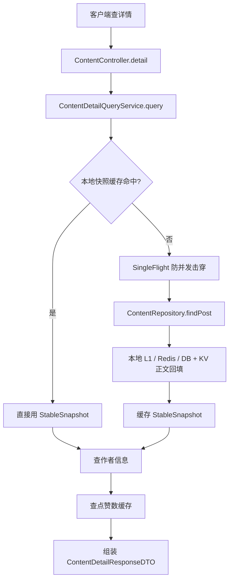

**详细文本描述**

- 控制器要求用户先登录。
- `ContentDetailQueryService` 先看自己本地的 `Caffeine` 快照缓存。
- 没命中就用 `SingleFlight` 合并并发请求，避免同一个 `postId` 被同时打爆。
- 真正查内容时，会走 `ContentRepository.findPost`：
  - 先查本地热点缓存；
  - 再查 Redis；
  - 再查 MySQL；
  - 正文不是直接放在主表，而是通过 `content_uuid` 去 KV 批量回填。
- 拿到稳定内容后，再分别查：
  - 作者昵称和头像；
  - 点赞数缓存。
- 最终返回给前端的是一份“内容稳定快照 + 动态侧数据”的拼装结果。

**实现方式为什么这么设计**

- 内容主体变化没那么频繁，但作者头像、昵称、点赞数这些边数据变化更频繁。
- 所以这里把“稳定部分”和“易变部分”拆开：
  - 稳定内容做本地快照缓存；
  - 点赞数和作者资料按需回填，保持相对新鲜。
- 这是典型的读优化设计，不把所有东西都硬塞进同一份缓存里。

**上游**

- 上游是正式发布、版本回滚、摘要回写这些写链路产出的当前可见内容，以及作者资料、点赞数这类侧数据。
- 其中正文真正来源是 `content_post.content_uuid` 指向的 KV 正文，不是主表里直接塞大文本。

**下游**

- 下游是详情页渲染结果，前端最终拿到的是“稳定内容快照 + 动态侧数据”的拼装响应。
- 热门内容会被本地缓存和 Redis 继续承接，减轻后续重复详情请求对数据库的冲击。

**相关技术栈、职责与原理**

- `Spring MVC`：负责详情查询 API 入口。适合这里，因为详情是高频读接口，统一控制器边界便于做登录校验和参数约束。
- `Caffeine`：负责本地 `StableSnapshot` 快照缓存。适合这里，因为稳定内容读取频繁、更新不算特别高，本地内存命中延迟最低。
- `Redis`：负责二级缓存和热点 TTL 续命。适合这里，因为热点内容会被多实例反复访问，Redis 能在实例之间共享热点结果。
- `MyBatis + MySQL`：负责查询 `content_post` 主记录。适合这里，因为当前可见态和基础元数据仍然适合放在关系表里管理。
- `Cassandra(KV)`：负责按 `content_uuid` 回填正文。适合这里，因为正文大字段放 KV，更适合在读链路按需取回，不拖累 MySQL 热表。

**STAR 面试讲法**

- S：详情页是高频读接口，但它需要拼多种数据。
- T：我要既快，又不能把所有数据都绑死在一层缓存里。
- A：我把详情拆成稳定快照和动态侧数据两部分，主内容走本地缓存 + Redis + DB + KV，点赞数和作者信息单独查。
- R：主内容读压力被压下去，同时点赞数和作者信息不会因为长缓存而过旧。

**亮点 / 兜底 / 一致性 / 性能点**

- 亮点：`SingleFlight` 抗击穿，避免相同详情请求并发穿透数据库。
- 亮点：正文存在 KV，主表只存 UUID，详情读时再回填。
- 一致性：写链路统一走缓存失效广播，详情缓存不会长期脏。
- 兜底：加载作者或点赞数失败时会降级成空值或 0，不打断详情主链。
- 性能点：本地缓存 + Redis + 热点 TTL 续命，专门照顾热门内容。

**当前代码现状**

- 详情接口当前没有做“可见性/owner ACL”校验。也就是说，代码里只校验了 `postId` 非空，并要求用户已登录，但**没有根据 `visibility` 或 `status` 再拦一层**。
- 控制器保留了 `userId` 请求参数，但实际没有使用。

### 链路 7：删除内容

**链路名称**

- 删除内容

**入口 / 核心类**

- HTTP 入口：`ContentController.delete`
- 领域服务：`ContentService.delete`
- 后续任务：`ContentSoftDeleteCleanupJob`

**要解决的问题**

- 删除必须立刻对用户生效。
- 但审计历史不能一起抹掉。
- 还要避免“删除和发布并发”把状态写乱。

**Mermaid 流程图**

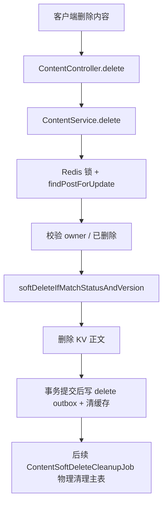

**详细文本描述**

- 删除先拿和 publish 同一把内容锁，防止“删了又发”“发了又删”。
- 再用 `findPostForUpdate` 查当前版本。
- 如果不是本人，直接拒绝。
- 如果已经是删除态，直接返回成功，保持幂等。
- 真正删除时不是物理删，而是：
  - `status=6`
  - 记录 `delete_time`
- 删除成功后：
  - 把 KV 里的正文删掉；
  - 提交后写 `post.deleted` outbox；
  - 统一清缓存。
- 后台还有个 `ContentSoftDeleteCleanupJob`，每天凌晨会清掉软删超过 N 天的主表记录和类型映射。

**实现方式为什么这么设计**

- 软删是为了“用户看来已经没了，但系统还能审计和追责”。
- 物理清理延后做，是为了把用户体验和后台治理拆开。
- 用状态 + 版本一起做删除条件，是为了防止并发覆盖。

**上游**

- 上游是用户对现有内容发起删除请求，目标对象来自 `content_post` 当前版本。
- 这条链路和正式发布共用同一套内容锁，所以它天然把“正在发布”和“正在删除”当成互相竞争的上游状态。

**下游**

- 下游首先让详情读取不到这条内容，然后提交后写 `post.deleted` outbox 并统一清缓存。
- 更晚一点还有 `ContentSoftDeleteCleanupJob` 做物理清理；历史版本会保留，供审计和回放继续使用。

**相关技术栈、职责与原理**

- `Spring MVC`：负责删除接口入口。适合这里，因为删除是明确的用户动作，HTTP 边界和权限校验都应该在控制层起步。
- `Redis`：负责和发布共用分布式锁。适合这里，因为删除与发布会争同一条内容，跨实例先抢锁最直接。
- `MyBatis + MySQL`：负责软删主表、记录删除时间和后续批量清理。适合这里，因为删除态是关系型状态机的一部分，需要事务和条件更新。
- `Cassandra(KV)`：负责删除正文 KV。适合这里，因为正文独立存放，删除时要把主表状态和正文存储一起收口。
- `Outbox + RabbitMQ`：负责事务提交后再通知下游 `post.deleted`。适合这里，因为删除事件如果先发出去、库里却回滚，会把下游状态带歪。

**STAR 面试讲法**

- S：内容删除不能只是 `DELETE FROM`，因为审计、回放、下游一致性都要考虑。
- T：我要做到“前台立即不可见，后台仍可审计，而且并发下不写乱”。
- A：我把删除做成软删，再用版本条件更新、延迟物理清理、提交后发事件和清缓存。
- R：用户体验和审计要求都保住了，并发也更稳。

**亮点 / 兜底 / 一致性 / 性能点**

- 亮点：删除和发布共用一套锁，避免相互打架。
- 一致性：`softDeleteIfMatchStatusAndVersion` 防止状态被旧写覆盖。
- 兜底：重复删直接返回 `DELETED`，不再重复派发事件。
- 性能点：物理清理异步做，不阻塞用户请求。

**当前代码现状**

- 历史版本不会被清理，`ContentSoftDeleteCleanupJob` 只删 `content_post` 和 `content_post_type`。
- 删除不会自动取消已有定时任务。

### 链路 8：定时发布创建

**链路名称**

- 定时发布创建

**入口 / 核心类**

- HTTP 入口：`ContentController.schedule`
- 领域服务：`ContentService.schedule`
- 生产者：`ContentScheduleProducer`
- MQ 可靠发送：`ReliableMqOutboxService`

**要解决的问题**

- 用户要“现在写，未来发”。
- 这个未来动作不能靠 JVM 内存里的定时器保存，不然服务重启就丢。

**Mermaid 流程图**

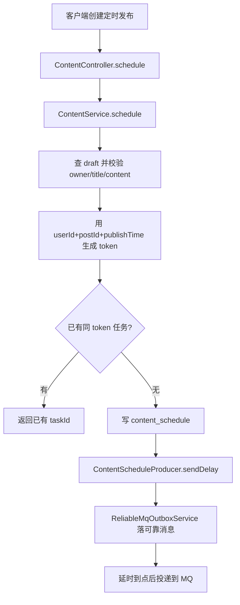

**详细文本描述**

- 创建定时任务时，服务会先找到同 ID 的草稿。
- 只有草稿存在、标题合法、正文或媒体不为空，才允许创建任务。
- 任务 token 用的是 `userId + postId + publishTime` 的哈希。
- 如果同一个 token 已经有未执行任务，就不再新建，直接返回旧任务。
- 真正落库时，会写：
  - `taskId`
  - `postId`
  - `contentData`
  - `scheduleTime`
  - `status=0`
  - `retryCount=0`
  - `isCanceled=0`
  - `alarmSent=0`
- 控制器在拿到 `taskId` 后，会再发一条延时 MQ。
- MQ 也不是直接裸发，而是先写可靠 outbox，再由重试任务统一投递。

**实现方式为什么这么设计**

- “未来要发生的事”一定要先落地成数据，不能只放内存。
- 创建任务后立刻锁住内容编辑，是为了保证 token 不需要把整份内容也带进去。因为内容已经被冻结了，`postId + publishTime` 足够唯一。
- 延时 MQ 比轮询表更节省资源，也更接近真实触发时间。

**上游**

- 上游是已经保存好的草稿和用户给出的 `publishTime`，也就是“现在写，未来发”的请求。
- 这条链路会先校验草稿、标题、正文和媒体是否满足发布条件，不满足就不往后走。

**下游**

- 下游会先写 `content_schedule`，再写可靠消息，最终由调度执行链路在未来时间点真正触发发布。
- 一旦任务创建成功，当前内容就进入冻结态，后面的草稿编辑会被 `assertNotScheduled` 拦住。

**相关技术栈、职责与原理**

- `Spring MVC`：负责创建定时任务的同步入口。适合这里，因为它要接住用户的未来发布时间并立即返回任务结果。
- `MyBatis + MySQL`：负责把 `content_schedule` 落成事实表。适合这里，因为未来动作必须先持久化，服务重启后也能恢复。
- `Outbox`：负责可靠记录“要发一条延时消息”这件事。适合这里，因为裸发 MQ 容易出现库写成功但消息丢失的问题。
- `RabbitMQ + 延时消息`：负责在未来时间点触发执行。适合这里，因为比高频扫表更省资源，也更接近目标触发时间。

**STAR 面试讲法**

- S：定时发布最怕服务重启和重复触发。
- T：我要把定时发布做成“可恢复、可审计、可幂等”的链路。
- A：我先把任务落 `content_schedule`，再把延时消息写可靠 outbox，执行时靠 token 和任务状态防重。
- R：即使消息重复投递或服务重启，任务仍然有据可查，也不容易重复执行。

**亮点 / 兜底 / 一致性 / 性能点**

- 亮点：任务先入库，再发消息，符合“数据优先”的设计。
- 一致性：定时任务创建后，内容进入冻结态，防止任务执行时内容已经变了。
- 兜底：同 token 创建冲突时直接返回旧任务，不重复造任务。
- 性能点：用延时 MQ 代替高频扫描数据库。

**当前代码现状**

- `timezone` 参数当前完全没有参与服务端计算。
- 服务端没有显式校验 `publishTime` 必须是未来时间；如果传过去的时间已经过去，控制器会算成 `delayMs <= 0`，消息会立即投递。
- `contentData` 虽然入库了，但后续真正执行时并不是拿这份 `contentData` 发，而是重新查草稿。

### 链路 9：取消定时

**链路名称**

- 取消定时发布

**入口 / 核心类**

- HTTP 入口：`ContentController.cancelSchedule`
- 领域服务：`ContentService.cancelSchedule`
- 仓储：`ContentRepository.cancelSchedule`

**要解决的问题**

- 用户改主意了，要让未来这件事不再发生。
- 取消后还要保留审计痕迹。

**Mermaid 流程图**

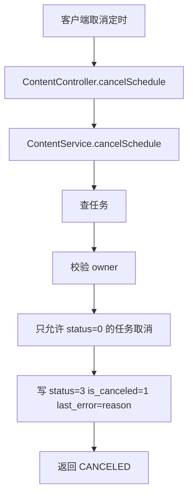

**详细文本描述**

- 服务先查任务是否存在。
- 再校验当前登录用户是不是任务拥有者。
- 只有 `status=0` 的待执行任务允许取消。
- 仓储层会把：
  - `status` 改成 3；
  - `is_canceled` 改成 1；
  - `last_error` 写成取消原因。

**实现方式为什么这么设计**

- 取消不是删除。删除了就没法追问“为什么这次没发”。
- 写取消原因到 `last_error`，虽然字段名不完美，但能复用已有审计结构。

**上游**

- 上游是已经存在的待执行定时任务，以及任务拥有者发起的取消动作。
- 这条链路默认任务已经可能写过延时消息，所以取消的重点不是回收消息，而是把业务状态改成不可执行。

**下游**

- 下游会把任务推进到 `CANCELED`，并让后续调度执行链路在消费到消息时主动跳过。
- 取消完成后，这条内容又可以重新编辑或重新创建新的定时任务。

**相关技术栈、职责与原理**

- `Spring MVC`：负责取消定时任务接口入口。适合这里，因为这是标准的用户状态变更请求，权限边界清楚。
- `MyBatis + MySQL`：负责按 `taskId + userId + status` 条件更新 `content_schedule`。适合这里，因为取消本质是状态机推进，关系表条件更新最直接。
- `延时消息`：负责未来触发，但取消不尝试把已发出的延时消息硬撤回。适合这里，因为让执行链路按 `is_canceled/status` 自行跳过，比回收消息更稳、更简单。

**STAR 面试讲法**

- S：定时任务不能只支持创建，不支持取消，不然就不是可运营的系统。
- T：我要让取消成为一个可追踪的状态变更，而不是物理删记录。
- A：我把取消设计成状态推进：`scheduled -> canceled`，并保留取消原因。
- R：后续审计能看见是谁取消的、为什么取消的，问题更容易追。

**亮点 / 兜底 / 一致性 / 性能点**

- 亮点：状态机清楚，不做硬删除。
- 一致性：owner 校验放在服务层，仓储层再次按 `taskId + userId + status` 做条件更新。
- 兜底：任务不存在或状态不允许取消时，不会误更新别的任务。
- 性能点：单行更新，成本很低。

**当前代码现状**

- 只有待执行任务能取消；已经完成或已经取消的任务不会重复推进。
- 取消后，`assertNotScheduled` 就不再命中，这条内容可以重新编辑或重新挂定时。

### 链路 10：更新定时

**链路名称**

- 更新定时发布时间

**入口 / 核心类**

- HTTP 入口：`ContentController.updateSchedule`
- 领域服务：`ContentService.updateSchedule`
- 仓储：`ContentRepository.updateSchedule`

**要解决的问题**

- 用户常见诉求不是改内容，而是“我想晚点发”。
- 如果允许“定时着还改内容”，特殊情况会爆炸，所以这里要收边界。

**Mermaid 流程图**

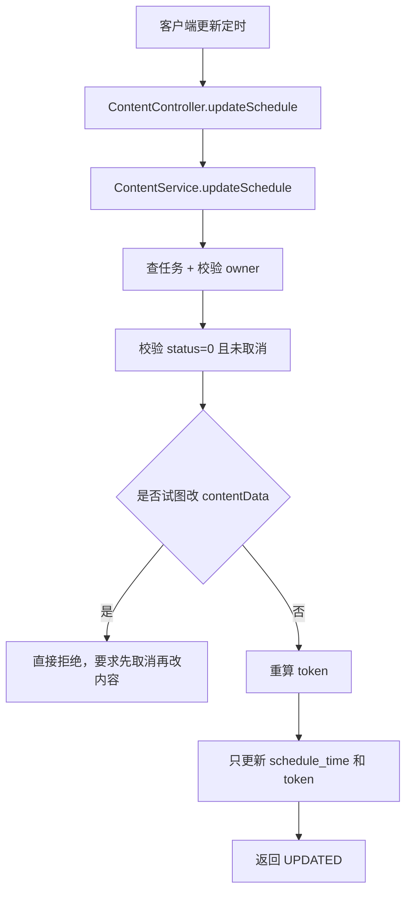

**详细文本描述**

- 服务先查任务和归属。
- 已取消任务不能改。
- 非待执行状态也不能改。
- 如果请求里带了新的 `contentData`，服务会直接报冲突，明确要求“先取消，再改内容，再重新定时”。
- 真正允许改的只有时间，所以仓储更新时主要改：
  - `schedule_time`
  - `idempotent_token`
  - `last_error`（这里被复用成变更原因）

**实现方式为什么这么设计**

- 这条链路很体现“好品味”：**主动砍掉一个复杂场景**。
- 因为一旦允许“改时间 + 改内容”，就会出现：
  - 任务执行时到底读旧内容还是新内容；
  - 幂等 token 应不应该变；
  - 已经投出去的延时消息怎么处理；
  - 已创建的审核上下文还算不算数。
- 当前代码直接把这类特殊情况一刀砍掉，复杂度立刻下来。

**上游**

- 上游是已创建但尚未执行的定时任务，以及用户只想改发布时间的请求。
- 这条链路明确假设内容本体不变；如果用户想改内容，必须先回到“取消定时 -> 修改草稿 -> 重新创建定时”的路径。

**下游**

- 下游只会更新 `schedule_time` 和 token，后续仍由调度执行链路按新的时间去触发。
- 因为不改 `contentData`，所以不会反向影响草稿、发布尝试或风控上下文这些别的链路。

**相关技术栈、职责与原理**

- `Spring MVC`：负责更新时间的同步接口。适合这里，因为它就是一个明确的状态修改请求，入口简单清楚。
- `MyBatis + MySQL`：负责单行更新 `content_schedule.schedule_time` 和 `idempotent_token`。适合这里，因为改时间是很明确的关系型状态变更，不需要引入复杂异步编排。
- `延时消息`：负责未来触发语义。适合这里，因为一旦只允许改时间、不允许改内容，就能避免“已投出的延时消息到底该对应哪份内容”的歧义。

**STAR 面试讲法**

- S：运营侧常想“一边挂定时一边改内容”，但这会把执行语义搞乱。
- T：我要让这条链路足够稳，而不是看起来功能很多。
- A：我明确规定“定时任务只允许改时间，不允许改内容”；想改内容就取消重建。
- R：代码和状态机都更短，线上也更不容易出诡异问题。

**亮点 / 兜底 / 一致性 / 性能点**

- 亮点：主动收缩能力边界，换来更稳定的执行语义。
- 一致性：只有 `scheduled` 状态且未取消的任务允许变更。
- 兜底：冲突场景直接拒绝，不做模糊兼容。
- 性能点：更新时间只改单行，不触发额外的大链路。

**当前代码现状**

- 请求 DTO 里有 `contentData` 字段，但当前实现不会真的用它更新内容。
- 仓储更新时写回的仍然是 `task.getContentData()`，也就是旧值。

### 链路 11：风控审核结果回流

**链路名称**

- 风控审核结果回流

**入口 / 核心类**

- 风控异步入口：`RiskAsyncService.applyToBiz`
- 风控人工入口：`RiskAdminService.applyToBiz`
- 内容域处理：`ContentService.applyRiskReviewResult`

**要解决的问题**

- 发布时可能先进入“待审核”。
- 后面无论是异步模型复判，还是人工审核，都要把最终结果安全地回写到内容域。

**Mermaid 流程图**

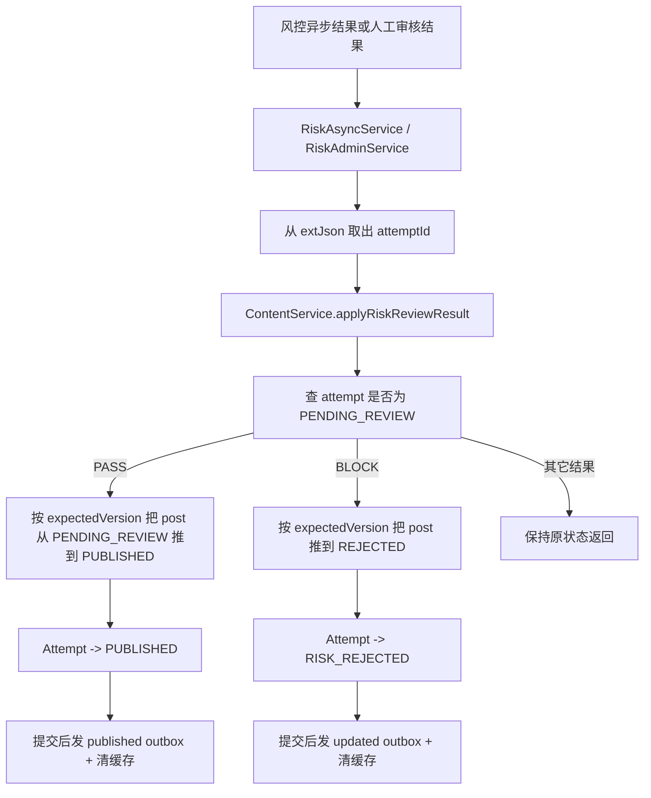

**详细文本描述**

- 风控域在自己的决策日志里保存了 `attemptId`。
- 当异步模型或人工审核得出明确结论时，会通过 `applyToBiz` 回调到内容域。
- 内容域拿到 `attemptId` 后先做两层保护：
  - Attempt 当前必须还是 `PENDING_REVIEW`；
  - `content_post` 当前状态和版本号必须和 Attempt 记录的一致。
- `PASS` 分支：
  - 把 `content_post` 从 `PENDING_REVIEW` 推到 `PUBLISHED`；
  - Attempt 改成 `PUBLISHED`；
  - 事务后发发布事件和摘要生成事件。
- `BLOCK` 分支：
  - 把 `content_post` 从 `PENDING_REVIEW` 推到 `REJECTED`；
  - Attempt 改成 `RISK_REJECTED`；
  - 事务后发 `post.updated` 事件并清缓存；
  - 不会生成摘要。

**实现方式为什么这么设计**

- 审核结果常常是“晚到”的，所以必须把版本号绑上。
- 如果不校验 `expectedVersion`，晚来的审核结果就可能覆盖掉更新后的新版本。
- 这条链路其实是“跨域回流”：风控做决定，内容域负责落业务状态。

**上游**

- 上游是正式发布链路里已经进入 `PENDING_REVIEW` 的 Attempt，以及风控域异步模型或人工审核返回的最终结论。
- 风控域通过 `attemptId` 回来，不是直接拿 `postId` 盲写，这让回流目标足够精确。

**下游**

- `PASS` 会把内容推进到 `PUBLISHED`，继续触发发布事件、缓存失效和摘要生成。
- `BLOCK` 会把内容推进到 `REJECTED`，只发更新类事件，不再触发摘要生成；无论哪种结果，发布尝试审计链路都能看到最终过程态。

**相关技术栈、职责与原理**

- `风控回流`：负责把风控域的异步或人工结论带回内容域。适合这里，因为风控判断天然是跨域、晚到、可能重复回调的，不适合塞在同步发布接口里等。
- `MyBatis + MySQL`：负责按 `expectedVersion + expectedAttemptStatus` 条件更新 `content_post` 和 `content_publish_attempt`。适合这里，因为晚到结果最怕误覆盖，关系表条件更新最容易兜住这个边界。
- `Outbox + RabbitMQ`：负责在状态真正落库后再通知下游发布或更新事件。适合这里，因为回流结论必须先成为数据库事实，再让别的系统看见。

**STAR 面试讲法**

- S：待审核内容的最终结论不是发布请求里就能拿到，常常是异步回来的。
- T：我要保证晚到的审核结果不会把新版本误伤。
- A：我让风险回流一定带 `attemptId`，再用 `expectedVersion + expectedAttemptStatus` 做并发保护。
- R：审核回写变成可控的状态推进，而不是一次盲写。

**亮点 / 兜底 / 一致性 / 性能点**

- 亮点：审核回流不是按 `postId` 硬改，而是按 `attemptId` 精确回写。
- 一致性：`expectedVersion` 防止旧审核覆盖新版本。
- 一致性：`expectedAttemptStatus=PENDING_REVIEW` 防止重复回调乱推进。
- 兜底：若状态或版本不匹配，只记录 warn 并返回当前 attempt，不会强推。
- 性能点：单条更新，不重跑完整 publish 主链。

**当前代码现状**

- 这条链路没有内容域自己的 HTTP 接口，而是由风控域服务直接调用。
- 对“编辑老帖子后进入待审核”的场景，`PASS` 分支当前统一走 `dispatchAfterCommit`，也就是仍然发“发布型事件”，没有区分“首次发布”和“编辑更新”。

### 链路 12：调度执行

**链路名称**

- 定时调度执行

**入口 / 核心类**

- MQ 消费入口：`ContentScheduleConsumer.onMessage`
- 核心执行：`ContentService.executeSchedule`
- 死信处理：`ContentScheduleDLQConsumer`
- 备用批处理：`ContentService.processSchedules`

**要解决的问题**

- 定时消息到点后，必须只执行一次真正副作用。
- 即使消息重复投递、服务重启、执行失败，也要能重试和追责。

**Mermaid 流程图**

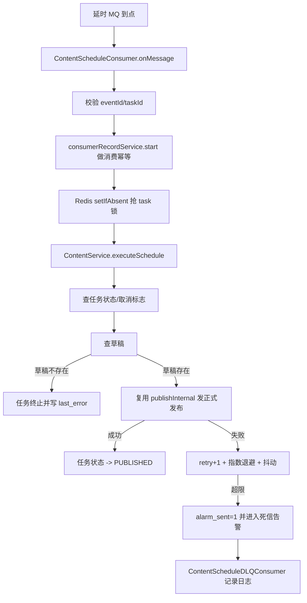

**详细文本描述**

- 延时消息进来后，消费者先检查 `taskId` 和 `eventId` 是否齐全。
- 然后用 `ReliableMqConsumerRecordService.start` 做消费侧幂等。
- 再用 Redis `setIfAbsent` 抢一把 60 秒的任务锁，防止并发执行同一个任务。
- 真正执行逻辑在 `executeSchedule`：
  - 任务不存在：返回失败；
  - 状态不是待执行：跳过；
  - 已取消：跳过；
  - 草稿不存在：把任务标记终止并记录错误；
  - 草稿存在：直接复用 `publishInternal`。
- 如果发布成功，任务状态改成 `PUBLISHED`。
- 如果失败，就：
  - `retry_count + 1`
  - 计算指数退避 + 抖动后的下一次执行时间
  - 继续留在 `SCHEDULED`，或者超过上限后终止并打 `alarm_sent=1`
- 死信消费者当前只做两件事：
  - 记录死信；
  - 打值班路由日志。

**实现方式为什么这么设计**

- 延时 MQ 是“触发器”，`content_schedule` 才是“事实表”。
- 消费幂等记录 + 任务状态 + Redis 锁，这三层一起扛住 MQ 的“至少一次投递”语义。
- 失败不立刻永久放弃，而是走重试和退避，符合真实生产环境的稳态要求。

**上游**

- 上游是定时发布创建或更新时间之后留下的 `content_schedule` 记录，以及到点投递过来的延时消息。
- 真正执行前还会再读一次任务状态和草稿，确认这次触发对应的业务事实还成立。

**下游**

- 成功时会复用正式发布主链，把任务状态推进到 `PUBLISHED`。
- 失败时会写 `retry_count/last_error` 并重排下一次执行时间；超过上限则进入死信告警链路。

**相关技术栈、职责与原理**

- `RabbitMQ + 延时消息`：负责在未来时间点触发消费。适合这里，因为 MQ 天然适合“至少一次投递”的异步触发，再配合业务幂等就能形成生产级调度。
- `Redis`：负责 `setIfAbsent` 抢任务锁。适合这里，因为同一任务可能被重复投递或多实例同时消费，跨实例锁能先兜住并发。
- `MyBatis + MySQL`：负责读取 `content_schedule`、更新重试次数、错误原因和最终状态。适合这里，因为任务事实表需要清晰的状态机和可审计字段。

**STAR 面试讲法**

- S：定时任务最难的不是“定时”，而是“重复投递、失败补偿、如何只产生一次有效副作用”。
- T：我要让定时发布具备生产级的幂等、防重试炸穿、可告警能力。
- A：我用任务落库做真实状态，再加消费幂等记录、Redis 锁、指数退避和死信处理。
- R：这条链路就算遇到消息重复、实例并发、临时失败，也能稳定收敛。

**亮点 / 兜底 / 一致性 / 性能点**

- 亮点：消费幂等和业务状态幂等两层都做了，不只靠一层。
- 亮点：指数退避 + 抖动，避免失败时形成固定节奏的“重试雪崩”。
- 一致性：执行时仍然复用正式 publish 主链，不写两套发布逻辑。
- 兜底：失败后保留 `last_error` 和 `retry_count`，方便查原因。
- 性能点：平时不扫全表，主要靠延时 MQ，到点才执行。

**当前代码现状**

- `ContentScheduleDLQConsumer` 目前只是日志占位，还没有真正接短信、钉钉、PagerDuty 之类的告警系统。
- `ContentService.processSchedules` 这条“批量扫描到期任务”的备用方法在当前 `trigger` 模块里没看到实际调度入口，主链实际跑的是 MQ 延时消费。
- 定时执行时调用 `publishInternal` 用的是草稿里的 `mediaIds` 作为 `mediaInfo`，而且固定 `location=null`、`visibility=PUBLIC`、`postTypes=null`。这说明当前定时发布更像“按草稿正文重放”，不是完整重放一次发布请求。

### 链路 13：历史版本查询

**链路名称**

- 历史版本查询

**入口 / 核心类**

- HTTP 入口：`ContentController.history`
- 领域服务：`ContentService.history`
- 仓储：`ContentRepository.listHistory`

**要解决的问题**

- 面试里经常会被问：用户改了 10 次内容，系统怎么回看过去？
- 这条链路既是“回看历史”，也是“回滚的输入源”。

**Mermaid 流程图**

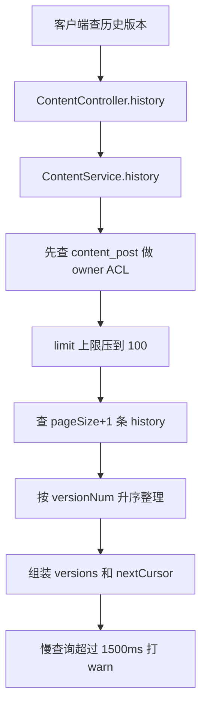

**详细文本描述**

- 服务先看这条 `postId` 当前主表是谁的。
- 如果主表存在且请求人不是 owner，就直接返回空列表并带 `NO_PERMISSION`。
- 分页参数会被标准化：
  - 默认 20 条；
  - 最多 100 条。
- 仓储层其实按 `version_num DESC` 查出数据。
- 服务层再排序成升序返回，让前端看到的是“从旧到新”的版本顺序。
- 还会多查 1 条，用来判断有没有下一页，并返回 `nextCursor`。

**实现方式为什么这么设计**

- 历史版本表用的是全量快照，不依赖正文 KV，这样最稳定，也最适合审计和回滚。
- 单条内容的版本数通常不会太夸张，所以 offset 分页能接受，没必要上来就做复杂游标表。

**上游**

- 上游是正式发布、待审核写快照、版本回滚这些写链路持续产出的 `content_history`。
- 查询前还会先借当前 `content_post` 做一次 owner ACL，决定这次历史是否允许看。

**下游**

- 下游是前端历史版本列表展示，也是版本回滚链路选定目标版本的输入来源。
- 这条链路本身不改任何版本状态，只负责把快照按面向用户的顺序整理出来。

**相关技术栈、职责与原理**

- `Spring MVC`：负责历史查询接口入口。适合这里，因为它就是标准分页查询，HTTP 语义清楚。
- `MyBatis + MySQL`：负责从 `content_history` 取全量快照并做分页。适合这里，因为历史是审计型、结构化、需要排序的关系数据，不依赖 KV 更稳。

**STAR 面试讲法**

- S：内容编辑多次后，系统需要能给用户和运营回看版本演进。
- T：我要做一条简单、稳定、能支撑回滚的历史查询链路。
- A：我把每次关键版本都存成 `content_history` 全量快照，查询时分页返回，并统一做 owner ACL。
- R：历史查询和回滚数据来源统一，后面功能演进更稳。

**亮点 / 兜底 / 一致性 / 性能点**

- 亮点：历史快照独立于 KV，正文热存储失效也不影响审计链。
- 一致性：分页查询额外多拿 1 条，可靠算出 `nextCursor`。
- 兜底：超慢查询会打 warn，方便后续排查。
- 性能点：limit 被强制上限 100，避免一把拉太多历史。

**当前代码现状**

- API 返回里只有 `versionId/title/content/time`，**没有把 `snapshotMedia` 返回给前端**。
- 如果 `content_post` 已经不存在，但 `content_history` 还在，当前 owner ACL 可能不会生效，因为服务先查的是主表。

### 链路 14：版本回滚

**链路名称**

- 版本回滚

**入口 / 核心类**

- HTTP 入口：`ContentController.rollback`
- 领域服务：`ContentService.rollback`
- 仓储：`ContentRepository.findHistoryVersion/updatePostStatusAndContent/saveHistory`

**要解决的问题**

- 用户后悔了，想把内容恢复到过去某个版本。
- 回滚不能“偷偷改旧记录”，而应该产生新的当前版本。

**Mermaid 流程图**

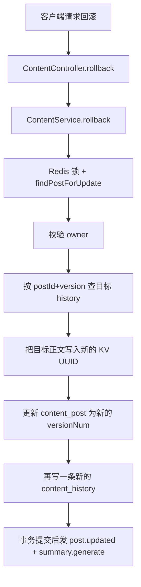

**详细文本描述**

- 回滚也先拿内容锁，避免和发布、删除并发。
- 找到目标历史版本后，不是把主表的 `version_num` 改回旧值，而是：
  - 生成新的 KV UUID；
  - 把旧版本正文重新写成一份新的 KV 正文；
  - 把主表推进到一个新的版本号；
  - 再写一条新的 `content_history`。
- 这说明系统把“回滚”理解成：**基于旧快照生成一个新的当前版本**。
- 回滚成功后，事务提交再发 `post.updated` 和摘要生成事件。

**实现方式为什么这么设计**

- 这样做的最大好处是：审计链永远线性增长。
- 如果是“直接把指针拨回旧版本”，那中间到底发生过什么就容易讲不清楚。
- 生成新版本，最符合“可追责”的要求。

**上游**

- 上游是历史版本查询或用户明确指定的目标版本，以及当前仍然存在的 `content_post`。
- 回滚前还会先锁住当前内容，避免和正式发布、删除这些别的写链路并发打架。

**下游**

- 下游会生成新的当前版本、新的 `content_history`，并触发 `post.updated` 和摘要生成。
- 内容详情随后读到的是这个新的当前版本，不是把页面偷偷指回旧记录。

**相关技术栈、职责与原理**

- `Spring MVC`：负责回滚接口入口。适合这里，因为回滚是明确的用户动作，需要统一做登录、参数和错误码边界。
- `Redis`：负责和发布、删除共用内容锁。适合这里，因为回滚同样会改当前版本，必须先挡住多实例并发。
- `MyBatis + MySQL`：负责读取目标 `content_history`、更新 `content_post`、再写一条新的 `content_history`。适合这里，因为回滚本质是事务内的版本推进，不是简单读旧值。
- `Cassandra(KV)`：负责把目标正文写到新的 `content_uuid`。适合这里，因为回滚后仍要保持“主表轻、正文独立”的存储结构。
- `摘要生成`：负责在回滚成功后重新概括新的当前版本。适合这里，因为正文变了，摘要也应该跟着变，但它又不值得阻塞回滚主链。
- `Outbox + RabbitMQ`：负责事务提交后再发 `post.updated` 和摘要事件。适合这里，因为回滚后的下游通知必须建立在新版本已经落库的前提上。

**STAR 面试讲法**

- S：内容一旦支持编辑，运营和用户迟早会要“回到上一个版本”。
- T：我要支持回滚，但不能破坏审计链。
- A：我把回滚设计成“从历史快照复制出一个新版本”，而不是篡改旧版本。
- R：系统既能恢复用户想要的状态，又保留完整演进过程。

**亮点 / 兜底 / 一致性 / 性能点**

- 亮点：回滚不是改历史，而是生成新历史，审计链最清楚。
- 一致性：主表仍然走版本递增和事务内更新。
- 兜底：找不到目标版本时直接返回 `VERSION_NOT_FOUND`。
- 性能点：只处理单条内容，不扫全历史表。

**当前代码现状**

- 回滚主要恢复的是 `title + content`。媒体、位置、可见性更多是沿用当前主表里的值，不是完全按历史快照恢复。
- 这里有一个真实边界风险：`updatePostStatusAndContent(...)` 如果失败，方法**仍然会继续写一条新的 `content_history`**，然后返回 `ROLLBACK_FAIL`。也就是说，可能出现“主表没回滚成功，但历史又多了一条记录”的情况。

### 链路 15：发布后摘要回写

**链路名称**

- 发布后摘要回写

**入口 / 核心类**

- 事件写入：`ContentEventOutboxPort.savePostSummaryGenerate`
- 重试任务：`ContentEventOutboxRetryJob`
- MQ 消费：`PostSummaryGenerateConsumer`
- 摘要端口：`PostSummaryPort`

**要解决的问题**

- 摘要生成可能比较慢，不能把发布主链堵住。
- 但详情页又希望能展示摘要状态和摘要内容。

**Mermaid 流程图**

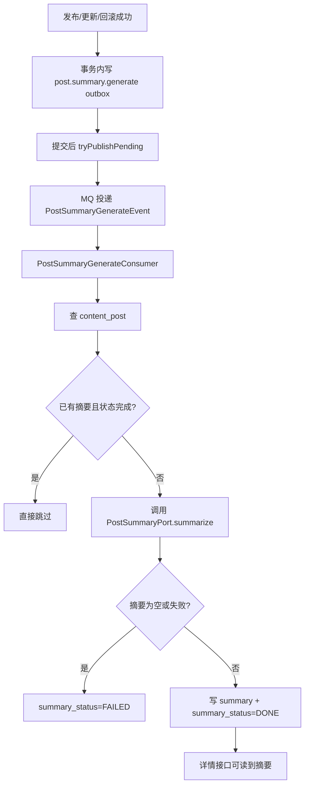

**详细文本描述**

- 发布成功、更新成功、回滚成功后，系统都会写一条 `post.summary.generate` outbox。
- 提交后异步把这个事件发到 MQ。
- 消费者拿到事件后先查当前帖子。
- 如果帖子已经有摘要并且状态是完成，就直接跳过，保持幂等。
- 否则调用摘要端口生成摘要。
- 生成失败就把 `summary_status=2`。
- 成功就把摘要正文和 `summary_status=1` 写回主表。
- 详情接口读取内容时，会把 `summary` 和 `summaryStatus` 一起返回。

**实现方式为什么这么设计**

- 摘要是“加分项”，不是“发布门槛”。
- 所以最好异步化，让发布主链只做真正必须做的事。
- 用 outbox 而不是直接 MQ，原因和发布事件一样：保证数据库提交后再发消息。

**上游**

- 上游是正式发布、风控通过后的最终发布、版本回滚这些成功写链路在事务内写下的 `post.summary.generate` outbox。
- 消费时还会再读一次当前 `content_post`，确认摘要是不是已经生成过，避免重复工作。

**下游**

- 下游会把 `summary` 和 `summary_status` 写回 `content_post`，让内容详情链路直接可读。
- 如果消费失败，会进入死信记录和后续排障，而不会反向拖慢已经成功的发布主链。

**相关技术栈、职责与原理**

- `Outbox + RabbitMQ`：负责把“需要生成摘要”这件事可靠地异步化。适合这里，因为摘要不是主事务的门槛，但事件又必须在数据库提交后再发。
- `摘要生成`：负责通过 `PostSummaryPort` 生成摘要文本。适合这里，因为摘要是典型的可慢、可失败、可重试能力，天然适合单独拆成异步步骤。
- `MyBatis + MySQL`：负责把摘要结果和 `summary_status` 回写 `content_post`。适合这里，因为摘要最终是当前内容的一部分，写回主表后详情查询最直接。

**STAR 面试讲法**

- S：详情页想展示摘要，但摘要生成不能拖慢发布。
- T：我要把摘要从同步主链里剥出来，做成可失败、可重试、可观测的异步任务。
- A：我在发布成功后写摘要生成 outbox，再由 MQ 消费者回表生成并写回摘要。
- R：发布速度和摘要能力解耦了，摘要慢或失败也不会影响用户发内容。

**亮点 / 兜底 / 一致性 / 性能点**

- 亮点：幂等检查，已有摘要就不重复生成。
- 一致性：摘要写回走主表状态字段，不额外造一张摘要表。
- 兜底：摘要失败会把状态标成 `FAILED`，不是静默丢掉。
- 性能点：异步生成，不阻塞发布和详情主链。

**当前代码现状**

- `PostSummaryPort` 当前是占位实现：有正文时取前 80 个字符，没有正文但有媒体时返回“一条媒体内容”。
- `PostSummaryGenerateDlqConsumer` 当前只记录死信，没有进一步自动补偿。

## 4. 面试官最感兴趣的亮点汇总

### 亮点 1：一个 ID 串起整条生命周期

- `draftId = postId = schedule.postId`
- 这让“草稿 -> 发布 -> 定时 -> 历史 -> 回滚”都围着同一个对象转。
- 面试里可以直接说：**我不是靠多张映射表拼起来的，我从草稿阶段就让内容对象稳定下来了。**

### 亮点 2：把“当前可见态”“过程态”“历史态”拆开

- `content_post`：当前用户看到什么
- `content_publish_attempt`：这次发布过程经历了什么
- `content_history`：过去有哪些版本
- 这是内容系统里很重要的建模能力。一个表全干，会非常脏。

### 亮点 3：正文不塞主表，主表更轻

- 主表只存 `content_uuid`
- 真正文在 KV（Cassandra）
- 历史版本则存 MySQL 全量快照
- 面试里这句话很好用：**热读主表轻量化，审计快照独立化。**

### 亮点 4：发布主链不是裸发 MQ，而是 after-commit outbox

- 发布成功先写库，再写 outbox，再 after-commit 发消息
- 这样不会出现“下游已经收到了发布事件，但主表事务最后回滚”的鬼故事

### 亮点 5：并发控制是分层做的，不是只靠一把锁

- Redis 分布式锁：防多实例并发
- `FOR UPDATE`：防同一行并发改版本
- `expectedVersion`：防旧写覆盖新写
- `expectedAttemptStatus`：防重复回调把 Attempt 状态推进乱

### 亮点 6：读路径也有专门设计

- `ContentRepository.findPost`：本地 L1 + Redis + DB + KV
- `ContentDetailQueryService`：Caffeine 快照 + SingleFlight
- 热点内容还会延长 Redis TTL
- 面试里可以强调：**我不是只会写链路，读链路也考虑了热点和击穿。**

### 亮点 7：定时发布是真正的生产级定时，不是 demo 级 cron

- 任务落库
- 延时 MQ
- 消费幂等记录
- Redis 锁
- 指数退避 + 抖动
- 死信记录

### 亮点 8：风控回流不是盲写，而是“绑版本号推进”

- 审核结论晚到是常态
- 用 `attemptId + expectedVersion` 绑定，避免把新版本误判掉

### 亮点 9：删除和回滚都保留审计链

- 删除保留 `content_history`
- 回滚生成新版本，不篡改旧版本
- 这很适合讲“大厂为什么爱问审计和可追责”

### 亮点 10：主动砍掉“已定时还改内容”的复杂场景

- 更新定时只允许改时间，不允许改内容
- 这是典型的工程取舍：**少一个功能，少很多诡异边界。**

## 5. 当前边界与可追问风险

### 5.1 当前代码里已经明确是占位或未闭环的地方

- 媒体转码端口 `MediaTranscodePort` 当前永远返回 `ready=true`，真实异步转码还没接。
- 摘要端口 `PostSummaryPort` 当前只是简单截断正文，不是真模型。
- `ContentScheduleDLQConsumer` 和 `PostSummaryGenerateDlqConsumer` 目前主要是日志记录，不是真告警闭环。
- 上传会话里的 `crc32` 目前没有被 MinIO 实现真正用起来。

### 5.2 当前代码和草稿/文档不完全一致的地方

- `.codex/content-publish-attempt-implementation.md` 说 `REVIEW` 分支只更新 Attempt；但真实源码里 `REVIEW` 已经会写 `content_post=PENDING_REVIEW` 和 `content_history`。
- `social_content_tables.sql` 里的 `content_publish_attempt.attempt_status` 注释没写 `PENDING_REVIEW=7`，但真实枚举 `ContentPublishAttemptStatusEnumVO` 里是有的。
- `content_history` 的真实 mapper 会写 `snapshot_title`，表结构草稿里却没有完全对齐出来。

### 5.3 真实存在、面试官可能继续追问的风险点

- **详情 ACL 风险**：`ContentDetailQueryService` 当前没有基于 `visibility/status/owner` 再做一层拦截。
- **历史 ACL 风险**：如果 `content_post` 已经不存在，但 `content_history` 还在，`history` 这条链路的 owner 校验可能绕空。
- **回滚一致性风险**：`rollback` 在主表更新失败时仍会写入新的 history。
- **定时参数语义风险**：`timezone` 没用，`contentData` 也不是执行源，只是审计快照。
- **编辑待审通过后的事件语义风险**：`applyRiskReviewResult(PASS)` 当前统一走 `dispatchAfterCommit`，没有区分“首次发布”和“编辑更新”。

### 5.4 面试时怎么把风险讲得高级一点

- 不要说“这里写得烂”。
- 要说：**“当前主链已经完整，但有几处边界仍然是源码事实上的技术债。我能明确指出它们在哪、为什么会出问题、后面怎么收敛。”**

可以按下面这种说法讲：

- 详情和历史现在更偏“内部可信场景”，如果走外部开放流量，需要补齐 visibility/owner ACL。
- 转码、摘要、DLQ 告警的端口已经有接口和链路位置，但当前还是占位实现，说明架子搭好了，外部能力还没完全接入。
- 回滚的语义已经对了，但事务内“失败后仍写 history”这一步需要再补一刀保护。

## 6. 最后一段面试总结

如果只能用 1 分钟总结这个域，我会这样说：

> 这个内容生产与发布中心不是一个简单的发帖接口，而是一套完整的内容生命周期系统。它从上传会话、草稿、正式发布、发布尝试审计、定时发布、审核回流、历史版本、回滚，到发布后的摘要生成，链路基本都齐了。它最值得讲的点有三个：第一，`draftId=postId` 让整条生命周期围着一个对象转；第二，`content_post`、`content_publish_attempt`、`content_history` 把当前态、过程态、历史态拆开了；第三，发布和定时都不是裸写，而是带锁、带版本、带 outbox、带缓存失效和补偿思路的生产级实现。**
