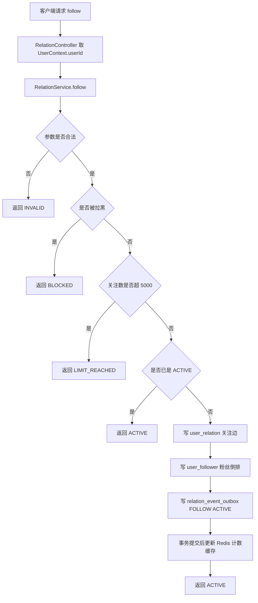
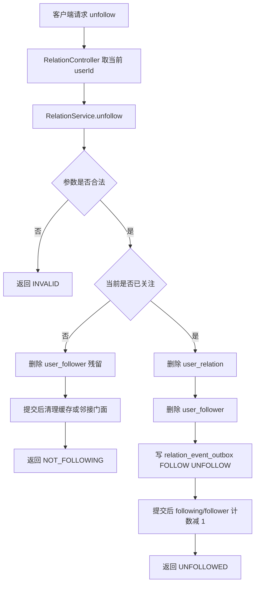
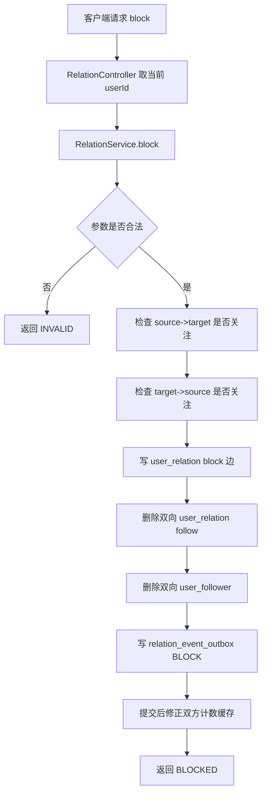
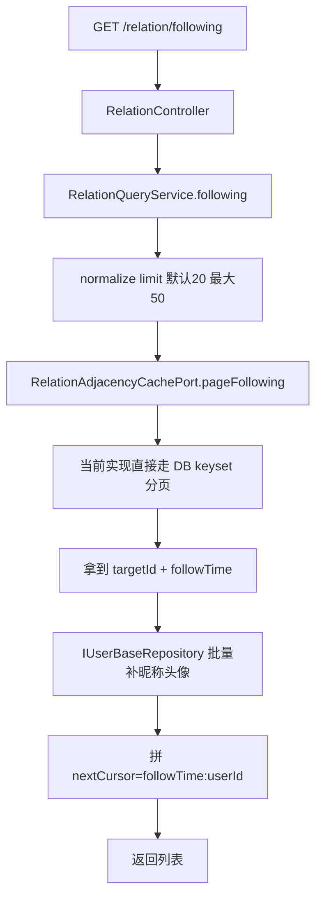
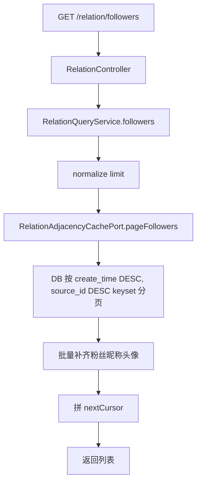
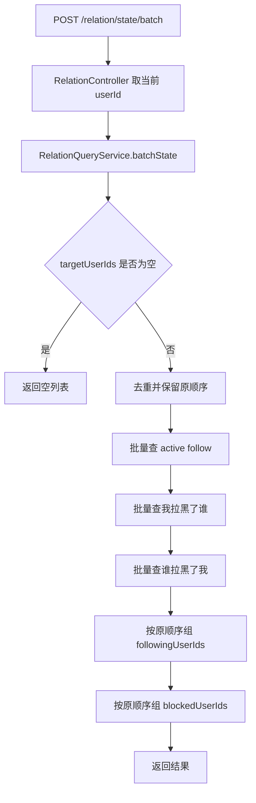
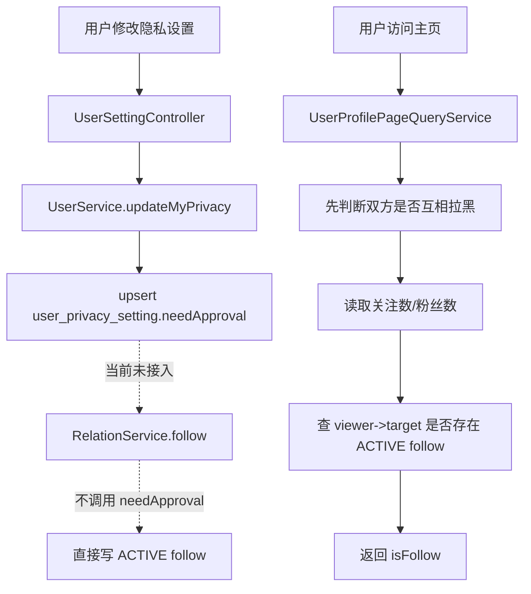
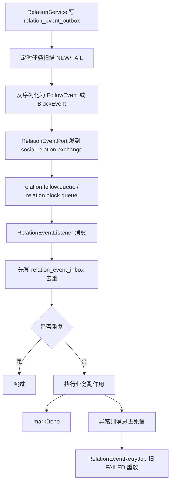
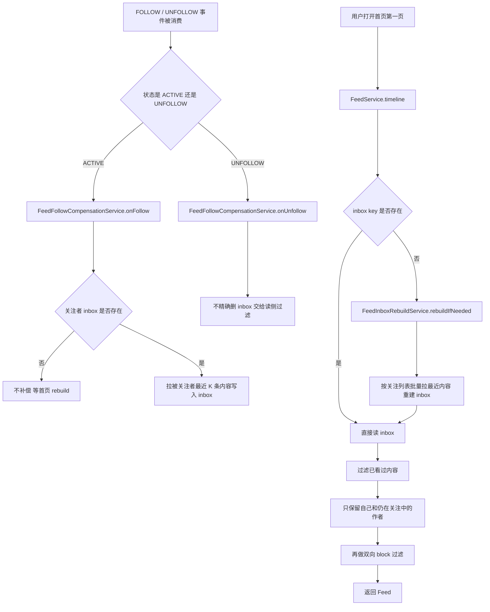

# 03-社交关系中心领域分析

## 领域定位

社交关系中心负责维护整个平台最基础的“人和人之间的边”。代码里真正落地的关系类型只有两种：

- `RELATION_FOLLOW = 1`：关注
- `RELATION_BLOCK = 3`：拉黑

这套设计不是把“粉丝列表、关注列表、主页关注态、Feed 是否可见、作者是否算大 V”拆成很多各自维护的小逻辑，而是先把**关系边**存成真相源，再让别的域来消费这张关系图。

从代码看，这个域的职责分成 4 层：

- HTTP 入口层：`RelationController`
- 关系写侧：`RelationService`
- 关系读侧：`RelationQueryService`
- 关系外溢链路：`relation_event_outbox -> MQ -> RelationEventListener -> Feed/Risk`

一句话讲本质：

> 这是平台的“关系图谱底座”。写操作先保证库里关系正确，再把缓存、计数、Feed 补偿、大 V 分类这些副作用延后做成最终一致。

## 业务链路总表

| 链路 | 入口 | 核心类 | 解决的问题 | 当前状态 |
| --- | --- | --- | --- | --- |
| 1. 关注 | `POST /api/v1/relation/follow` | `RelationController`、`RelationService` | 建立单向关注边、粉丝倒排、事件 outbox | 已闭环 |
| 2. 取关 | `POST /api/v1/relation/unfollow` | `RelationController`、`RelationService` | 删除关注边并让读侧尽快生效 | 已闭环 |
| 3. 拉黑 | `POST /api/v1/relation/block` | `RelationController`、`RelationService` | 建立黑名单边并清理双向关注 | 已闭环 |
| 4. 关注列表 | `GET /api/v1/relation/following` | `RelationController`、`RelationQueryService` | 查“我关注了谁” | 已闭环 |
| 5. 粉丝列表 | `GET /api/v1/relation/followers` | `RelationController`、`RelationQueryService` | 查“谁关注了我” | 已闭环 |
| 6. 批量关系状态 | `POST /api/v1/relation/state/batch` | `RelationController`、`RelationQueryService` | 一次查多人的关注态/拉黑态 | 已闭环 |
| 7. 关注审批与好友态判断 | 用户隐私接口、主页聚合接口 | `UserSettingController`、`UserService`、`RelationPolicyPort`、`UserProfilePageQueryService` | 处理 needApproval 和主页关系态展示 | 部分实现，主链未接通 |
| 8. 关系事件投递 | 定时任务 + MQ | `RelationEventOutboxPublishJob`、`RelationEventPort`、`RelationEventListener`、`RelationEventRetryJob` | 让关注/拉黑的副作用可靠外发 | 已闭环，通知部分偏占位 |
| 9. Feed 补偿与离线重建 | 关系事件监听、Feed 首页读取 | `FeedFollowCompensationService`、`FeedInboxRebuildService`、`FeedService` | 刚关注立刻可见、离线用户后补 | 已闭环 |

## 链路 1：关注

### 链路名称

关注

### 入口 / 核心类

- 入口：`RelationController.follow`
- 核心类：`RelationService.follow`
- 关键依赖：`IRelationRepository`、`IRelationEventOutboxRepository`、`IRelationPolicyPort`、`IRelationCachePort`

### 要解决的问题

用户点“关注”后，系统要同时解决 3 件事：

- 关系边要真的建起来
- 对方的粉丝列表要能查到自己
- 后面的 Feed、风控、大 V 分类这些副作用不能漏

### Mermaid 流程图

### 详细文本描述

1. 控制器不信请求体里的 `sourceId`，直接从 `UserContext.requireUserId()` 取当前登录用户。
2. `RelationService.follow` 先做 4 个前置判断：
   - 不能自己关注自己
   - 不能传空或非法 ID
   - 目标拉黑了你，或者双方任一侧已有 block 边，就直接拒绝
   - 当前关注数不能超过 `5000`
3. 如果数据库里已经有一条 `sourceId -> targetId` 的 `RELATION_FOLLOW` 且状态是 `ACTIVE`，直接返回 `ACTIVE`，不重复写。
4. 真正落库时同时写两份数据：
   - `user_relation`：保存“我关注了谁”
   - `user_follower`：保存“谁是我的粉丝”
5. 同一个事务里再写 `relation_event_outbox`，事件类型是 `FOLLOW`，状态是 `ACTIVE`。
6. 事务提交后才做缓存副作用：
   - `followingCount +1`
   - `followerCount +1`
   - 邻接缓存门面 `addFollow` 被调用，但当前实现已经退化成空操作，真相源还是 DB

### **上游**

- 触发方是客户端的关注按钮，请求先经过 `RelationController.follow`，真正的发起人来自 `UserContext.requireUserId()`，不会信请求体里的 `sourceId`。
- 输入来源是 `targetId` 和当前登录用户；前置依赖是登录态、参数合法、未被 block、关注数未超 `5000`。
- 进入写链路前还依赖 `IRelationPolicyPort` 和 `IRelationRepository` 做 block/旧关系检查，先把非法请求挡在事务外。

### **下游**

- 主事务写 `user_relation`、`user_follower`、`relation_event_outbox`。
- `afterCommit` 后只改 Redis 计数缓存：`followingCount`、`followerCount`；邻接缓存门面当前是空实现。
- 后续会影响关注列表、粉丝列表、批量关系状态、主页计数；outbox 再把事件送到 MQ，继续影响 Feed 补偿、作者大 V 分类和关系事件消费链路。

### **相关技术栈、职责与原理**

- `Spring MVC`：在这里负责接住 `POST /api/v1/relation/follow` 并拿到登录用户。原理是把 HTTP/鉴权细节挡在控制器层，领域服务只处理关系规则。
- `MyBatis + MySQL`：在这里把关注边、粉丝倒排、outbox 事件一起落库。原理是事务型存储最适合做关系真相源，能保证这 3 步要么都成功，要么都回滚。
- `Outbox`：在这里把 `FOLLOW ACTIVE` 先写入 `relation_event_outbox`。原理是“先把事实和待发事件一起持久化，再异步投递”，适合避免“关系建好了但消息丢了”。
- `Redis`：在这里缓存关注数和粉丝数。原理是计数允许最终一致，用缓存换主页和列表的低延迟。
- `afterCommit`：在这里把 Redis 更新延后到事务提交后。原理是数据库没提交就不碰外部副作用，适合避免回滚后缓存先脏。

### 实现方式为什么这么设计

- **关系边和粉丝倒排分开存**：因为“我关注了谁”和“谁关注了我”是两类高频查询。只存一张表也能查，但粉丝 fanout 和计数都会更重。
- **主事务里只做最小必要写入**：关系表、粉丝表、outbox 一起落库，保证“关系成功但事件丢了”这件事不会发生。
- **缓存放到 afterCommit**：避免事务回滚后 Redis 先脏掉。
- **重复关注直接返回 ACTIVE**：这是很实用的幂等味道，用户多点一次不会把数据写坏。

### STAR 面试讲法

- S：关注动作不是单表插入，它会影响粉丝列表、Feed、作者分类和风控感知。
- T：我需要把“建立关系”做成一个小而稳的事务，同时不能让后续副作用丢失。
- A：我把写路径拆成“库内真相源”和“库外副作用”。事务内只写 `user_relation + user_follower + relation_event_outbox`，事务后只更新计数缓存。
- R：这样主链简单、失败面可控，后面的 Feed 补偿和 MQ 消费都可以重试，不会把关注成功和副作用绑定死。

### 亮点 / 兜底 / 一致性 / 性能点

- 亮点：控制器忽略请求体里的 `sourceId`，只信登录态，避免伪造来源用户。
- 亮点：关注上限走 Redis 计数缓存，避免每次都 `COUNT(*)`。
- 兜底：重复关注直接返回已有状态，不制造重复数据。
- 一致性：outbox 和关系写入同事务，保证“数据成功了，事件一定能补发”。
- 性能点：粉丝倒排单独落表，后面 Feed 写扩散可以直接扫 `user_follower`。

## 链路 2：取关

### 链路名称

取关

### 入口 / 核心类

- 入口：`RelationController.unfollow`
- 核心类：`RelationService.unfollow`

### 要解决的问题

用户取消关注后，要做到两件事：

- 关系立刻失效
- Feed 尽量立刻看不到对方内容，但不要为了“精确删除 inbox”把写侧做得很重

### Mermaid 流程图

### 详细文本描述

1. `unfollow` 先查 `user_relation` 里是否存在这条 active follow。
2. 如果本来就没关注：
   - 仍然尝试删 `user_follower` 残留
   - 提交后清掉计数缓存
   - 返回 `NOT_FOLLOWING`
3. 如果确实关注了：
   - 删除 `user_relation`
   - 删除 `user_follower`
   - 写一条 `FOLLOW` 类型、状态为 `UNFOLLOW` 的 outbox 事件
4. 事务提交后：
   - `followingCount -1`
   - `followerCount -1`
5. 后面由关系事件监听器驱动 Feed 的“取消关注立刻生效”补偿逻辑。

### **上游**

- 触发方是客户端的取关按钮，请求走 `RelationController.unfollow`，源用户仍然只取 `UserContext`。
- 输入来源是当前登录用户 + `targetId`；前置依赖只有参数合法，不要求先查到一定存在的关注边。
- 进入删除前会先查 `sourceId -> targetId` 的 active follow，用来判断是正常取关还是幂等清理。

### **下游**

- 已关注时会删 `user_relation`、删 `user_follower`，再写一条 `FOLLOW/UNFOLLOW` 到 `relation_event_outbox`。
- 事务提交后会移除邻接门面记录，并把 Redis 里的 `followingCount`、`followerCount` 各减一。
- 这会直接影响关注列表、粉丝列表、批量关系状态、主页计数；Feed 侧再通过关系事件消费和读侧过滤，让“取关后立刻看不见”成立。

### **相关技术栈、职责与原理**

- `Spring MVC`：在这里负责接收 `POST /api/v1/relation/unfollow` 并绑定登录用户。原理和关注链路一样，先把入口数据收敛干净。
- `MyBatis + MySQL`：在这里删除关系边和粉丝倒排。原理是删除要直接落在真相源上，后面所有查询链路才会自然收敛。
- `Outbox`：在这里记录 `UNFOLLOW` 事件。原理是主链只做删边，副作用通过异步事件慢慢追上，适合把取关保持成短事务。
- `Redis`：在这里维护关注数/粉丝数缓存。原理是计数高频读、低频写，适合在提交后做轻量修正。
- `afterCommit`：在这里保证删边成功后再动缓存。原理是先保证库内正确，再做最终一致的外围更新。

### 实现方式为什么这么设计

- **未关注也做幂等清理**：这不是多余，而是承认线上可能有残留脏数据，顺手修掉更实用。
- **删除和事件投递解耦**：先把关系删掉，再让读侧和补偿链路慢慢追上，用户感知更稳。
- **不在写侧精确删 inbox**：因为 inbox 里只有 `postId`，没有 `authorId`，硬删会很贵，所以改成读侧过滤 + 首页重建。

### STAR 面试讲法

- S：取关不只是删一条边，还会影响 Feed 可见性。
- T：我要让用户马上感觉“取消关注生效了”，但不能把写链路搞成高成本精确清理。
- A：我把写侧收敛成删关系、删倒排、写 outbox；Feed 侧改成读时过滤和离线重建。
- R：主链保持短事务，体验上也能做到很快生效，而且不会因为删 inbox 失败把取关卡死。

### 亮点 / 兜底 / 一致性 / 性能点

- 亮点：未关注时返回 `NOT_FOLLOWING`，但仍尝试清残留，属于“顺手修脏数据”。
- 一致性：`UNFOLLOW` 事件和删边同事务落库。
- 兜底：提交后如果缓存更新失败，最多影响计数短暂不准，不影响关系真相。
- 性能点：把“精确删 inbox”换成读侧过滤，避免在取关高峰时做大量反查。

## 链路 3：拉黑

### 链路名称

拉黑

### 入口 / 核心类

- 入口：`RelationController.block`
- 核心类：`RelationService.block`

### 要解决的问题

拉黑不是普通状态改写，它要把双方后续关系都切断。也就是说：

- 要建立 block 边
- 要把双向 follow 都清掉
- 后续主页、Feed、列表都不能再按正常关系看见彼此

### Mermaid 流程图

### 详细文本描述

1. `block` 会先判断双方之前是否互相关注，用来决定后面计数要不要减。
2. 然后写入一条 `RELATION_BLOCK` 关系边。
3. 接着直接删掉：
   - `source -> target` 的 follow
   - `target -> source` 的 follow
   - 两边对应的 `user_follower` 倒排
4. 同事务写 `BLOCK` 事件到 `relation_event_outbox`。
5. 事务提交后：
   - 把两边 follow 关系从邻接门面移除
   - 如果之前真有关注，再减双方缓存计数

### **上游**

- 触发方是客户端拉黑动作，请求入口是 `RelationController.block`，源用户同样只取登录态。
- 输入来源是当前登录用户 + `targetId`；前置依赖是参数合法，且服务会先检查双方之前是否存在 active follow。
- 在真正落库前没有走审批或额外状态机，核心依赖就是 `IRelationRepository`、`IRelationEventOutboxRepository`、计数缓存端口。

### **下游**

- 主事务会写一条 `RELATION_BLOCK` 到 `user_relation`，同时删除双向 follow 边和双向 `user_follower` 倒排，再写 `relation_event_outbox`。
- `afterCommit` 后会修正双方 Redis 关注数/粉丝数，并从邻接门面移除双向 follow。
- 直接影响批量关系状态、后续 Feed 按 block 过滤的读链路，以及关系事件消费后的作者分类刷新；拉黑后的世界当前主要先在关系域内闭环。

### **相关技术栈、职责与原理**

- `Spring MVC`：在这里负责接收 `POST /api/v1/relation/block`。原理是把用户请求先规范成统一领域调用。
- `MyBatis + MySQL`：在这里同时写 block 边、删双向 follow、删粉丝倒排。原理是把“拉黑后的干净状态”一次性落到数据库里，比留脏边让读侧补判断更稳。
- `Outbox`：在这里记录 `BLOCK` 事件。原理是 block 会外溢到 Feed/风控，但这些副作用不该拉长主事务。
- `Redis`：在这里维护双方关系计数缓存。原理是缓存修正便宜，但必须依附于前面已经确认过的旧关注态。
- `afterCommit`：在这里延迟做缓存扣减。原理是只有事务成功，才允许对外部缓存产生副作用。

### 实现方式为什么这么设计

- **拉黑单独建边，不是 follow 上加状态**：因为 block 是更强语义，它不是“我不看你”，而是“双方关系都要被截断”。
- **拉黑时顺手清双向关注**：这避免后面每个读接口都加一堆“如果被拉黑但仍互关怎么办”的补丁分支。
- **先检查旧关注态再扣计数**：避免把缓存扣成负数。

### STAR 面试讲法

- S：拉黑是社交系统里破坏力最大的关系操作，处理不好会留下很多脏边。
- T：我要把“拉黑后的世界”做成一个干净状态，而不是在读侧到处补 if/else。
- A：我选了最直接的做法，block 单独建边，同时清理双向关注和粉丝倒排，再异步通知下游。
- R：关系图会马上收敛成一个简单状态，后续主页、Feed、列表都能复用统一的 block 判断。

### 亮点 / 兜底 / 一致性 / 性能点

- 亮点：通过“清边”而不是“保留旧边再到处判断”来消灭特殊情况。
- 一致性：block 和删 follow 同事务。
- 兜底：缓存只在确认之前确实有关注时才减，避免负数。
- 性能点：把复杂性前置到写侧，换读侧全域简化。

## 链路 4：关注列表

### 链路名称

关注列表

### 入口 / 核心类

- 入口：`RelationController.following`
- 核心类：`RelationQueryService.following`
- 关键依赖：`IRelationAdjacencyCachePort`、`IUserBaseRepository`

### 要解决的问题

用户要看“我关注了谁”，而且分页要稳定，不能随着数据增长越翻越慢。

### Mermaid 流程图

### 详细文本描述

1. 控制器把 `userId、cursor、limit` 交给 `RelationQueryService`。
2. `limit` 会被规范成：
   - 默认 20
   - 最大 50
3. 名字虽然叫 `RelationAdjacencyCachePort`，但当前实现已经明确说明：
   - 不再维护 Redis 邻接缓存
   - 直接以 DB 为真相源分页
4. DB 查询使用 keyset 分页：
   - 条件按 `create_time DESC, target_id DESC`
   - 游标格式是 `followTime:userId`
5. 关系域只返回 `targetId + followTime`，用户昵称和头像由 `IUserBaseRepository` 批量补齐。

### **上游**

- 触发方通常是用户主页或“我的关注”页，请求入口是 `GET /api/v1/relation/following`。
- 输入来源是 `userId、cursor、limit`；前置依赖只有分页参数规范化，当前代码不会自动把空 `userId` 回退成当前登录用户。
- 进入查询前依赖 `RelationAdjacencyCachePort.pageFollowing` 和 `IUserBaseRepository.listByUserIds`，先拿边，再补资料。

### **下游**

- 这条链路不写表、不写 MQ；当前主要在本域内闭环。
- 读路径先查 `user_relation` 的关注边，再批量读用户基础信息缓存/库，最终返回 `targetId + nickname + avatar + followTime`。
- 结果会被关注列表页、主页关注 tab 这类读接口直接消费。

### **相关技术栈、职责与原理**

- `Spring MVC`：在这里负责接住列表查询参数。原理是列表接口天然适合在控制器层做参数归一化。
- `MyBatis + MySQL`：在这里通过 `pageActiveBySource` 做 keyset 分页。原理是按 `create_time + target_id` 游标翻页，比深 `offset` 更稳定。
- `RelationAdjacencyCachePort`：名字像缓存，但这里实际是 DB 查询门面。原理是保留旧接口、把内部实现收敛成单一真相源，可以减少外围调用方改动。
- `Redis + MyBatis`：在这里由 `UserBaseRepository` 先批量读用户资料缓存，miss 再回源 DB。原理是关系列表只存边，昵称头像走独立读缓存更省耦合。

### 实现方式为什么这么设计

- **关系列表和用户资料分开查**：关系域只关心边，用户域负责昵称头像，职责很清。
- **keyset 分页代替 offset 深翻页**：越往后翻也不需要扫前面很多行，稳定很多。
- **保留老接口名，但缩小语义**：`RelationAdjacencyCachePort` 这个名字没改，是为了减少调用方改动；但内部已经收敛成“DB 查询门面”。

### STAR 面试讲法

- S：关注列表是高频页面，不能用深 offset 分页硬顶。
- T：我要让分页稳定，同时不把用户资料冗余到关系表里。
- A：我把列表查询拆成“关系边 keyset 分页 + 用户信息批量补齐”两步。
- R：这样结构很干净，分页成本稳定，关系域也不会和用户资料强耦合。

### 亮点 / 兜底 / 一致性 / 性能点

- 亮点：明确把旧“邻接缓存”收缩成 DB 门面，减少假缓存和重建复杂度。
- 性能点：keyset 分页比 offset 更适合社交列表。
- 性能点：批量补齐用户资料，避免 N+1 查询。
- 当前代码现状：如果 `userId` 为空，当前实现会直接返回空，不会自动回退到当前登录用户。

## 链路 5：粉丝列表

### 链路名称

粉丝列表

### 入口 / 核心类

- 入口：`RelationController.followers`
- 核心类：`RelationQueryService.followers`
- 关键依赖：`RelationAdjacencyCachePort.pageFollowers`

### 要解决的问题

用户要查“谁关注了我”。这条链路和关注列表看起来像镜像，其实实现上更难，因为目标侧索引要求更高。

### Mermaid 流程图

### 详细文本描述

1. 这条链路和关注列表一样，也走 `RelationQueryService -> RelationAdjacencyCachePort`。
2. 但真正 SQL 不同，它按：
   - `target_id = 当前用户`
   - `relation_type = follow`
   - `status = active`
   - `ORDER BY create_time DESC, source_id DESC`
3. Mapper 里专门写了注释：
   - 这是**用户可见主路径**
   - 不允许回退成 offset 深分页
   - 上线前要确认目标侧复合索引覆盖完整

### **上游**

- 触发方通常是用户主页的粉丝页，请求入口是 `GET /api/v1/relation/followers`。
- 输入来源是 `userId、cursor、limit`；前置依赖是分页参数归一化，以及目标用户 ID 已确定。
- 查询前依赖 `RelationAdjacencyCachePort.pageFollowers` 和用户资料补齐仓储；它和 Feed fanout 用的 `user_follower offset` 不是一条路径。

### **下游**

- 这条链路也不写表、不写 MQ；当前主要在本域内闭环。
- 读路径会查 `user_relation` 的目标侧 keyset 分页，再批量补齐用户昵称头像。
- 结果直接服务粉丝列表页；同时这条链路的 SQL 设计也反过来约束了目标侧索引方案。

### **相关技术栈、职责与原理**

- `Spring MVC`：在这里接收粉丝列表分页请求。原理和关注列表一致，先把外部参数收敛成统一查询输入。
- `MyBatis + MySQL`：在这里走 `pageActiveByTarget`。原理是目标侧 `create_time DESC, source_id DESC` 的 keyset 能保证用户可见分页稳定，不会越翻越慢。
- `RelationAdjacencyCachePort`：在这里继续作为 DB 门面，而不是 Redis 邻接缓存。原理是粉丝列表是用户主路径，宁可直查真相源，也不维护一套更脆的假缓存。
- `Redis + MyBatis`：在这里补齐 `user_base` 昵称头像。原理是列表页需要展示资料，但关系表不该冗余这些字段。

### 实现方式为什么这么设计

- **粉丝列表不能偷懒复用 user_follower offset 扫描**：`user_follower` 的 `LIMIT/OFFSET` 只留给 Feed fanout 内部切片，不能拿来做用户可见分页。
- **专门走 relation 主表 keyset**：这样语义更稳定，也更容易保证翻页不抖。

### STAR 面试讲法

- S：粉丝列表和 fanout 都要看“谁关注了我”，但两者不是一个问题。
- T：我要避免“内部批处理 SQL”被误拿来做用户页面。
- A：我把 Feed fanout 和用户可见列表明确拆开：前者用 `user_follower offset` 切片，后者用 `user_relation keyset` 分页。
- R：两条路径都清楚，各自为自己的场景优化，不会互相污染。

### 亮点 / 兜底 / 一致性 / 性能点

- 亮点：把“内部批处理扫描”和“用户可见分页”明确分开，这是很好的边界意识。
- 性能点：keyset 保证深分页稳定性。
- 风险点：Mapper 已经提示，上线前必须确认目标侧复合索引，否则功能对、性能未必对。

## 链路 6：批量关系状态

### 链路名称

批量关系状态

### 入口 / 核心类

- 入口：`RelationController.stateBatch`
- 核心类：`RelationQueryService.batchState`

### 要解决的问题

首页卡片、用户列表、搜索结果经常会一次展示很多人。前端不能对每个人再打一遍“我有没有关注/有没有被拉黑”的接口。

### Mermaid 流程图

### 详细文本描述

1. 这条接口必须登录，因为源用户一定是当前用户。
2. 服务里先做两层保护：
   - 空列表直接返回空
   - 去重，避免前端重复传同一个用户
3. 然后分 3 次批量查：
   - 我关注了哪些目标用户
   - 我拉黑了哪些目标用户
   - 哪些目标用户拉黑了我
4. 最终返回两个列表：
   - `followingUserIds`
   - `blockedUserIds`
5. 结果顺序会尽量和请求顺序一致，前端比较好对位。

### **上游**

- 触发方通常是列表卡片、搜索结果、主页聚合接口，需要一次判断很多人的按钮态。
- 输入来源是当前登录用户和 `targetUserIds` 列表；前置依赖是必须登录、空列表直接返回、重复 ID 先去重。
- 查询前没有依赖缓存预热，核心前置就是把输入洗干净，避免把重复和空 ID 带进批量 SQL。

### **下游**

- 这条链路不写表、不写缓存、不发 MQ，当前主要在本域内闭环。
- 它直接读取 follow/block 关系，输出 `followingUserIds` 和 `blockedUserIds`，供前端按钮态、列表态、聚合接口复用。
- 因为把双向 block 折叠成一个返回集，下游调用方不需要自己再拼复杂判断。

### **相关技术栈、职责与原理**

- `Spring MVC`：在这里接收批量状态请求，并强制把源用户绑定为当前登录用户。原理是按钮态必须以“我是谁”为前提。
- `MyBatis + MySQL`：在这里分 3 次批量查关注、我拉黑、谁拉黑我。原理是批量 `IN` 查询比逐个查稳定得多，也更容易保持结果正确。
- `RelationQueryService` 的去重回组：在这里保留输入顺序并消掉重复 ID。原理是先规范数据，再做查询，能让前端回填位置更简单。

### 实现方式为什么这么设计

- **关注态和拉黑态一次查完**：因为在社交场景里，“能不能关注”和“能不能看见内容”经常一起判断。
- **双向 block 都算 blocked**：这是符合用户认知的。无论你拉黑了对方，还是对方拉黑了你，关系按钮都不该当正常态显示。
- **不返回复杂枚举，只返回 ID 集合**：前端最容易消费，也最省流量。

### STAR 面试讲法

- S：列表页一次会出现很多作者，逐个查关系状态会把接口打爆。
- T：我要把关系判断收敛成一次批量查询。
- A：我把关注态和双向拉黑态都合并到 `batchState`，先去重，再三次批量查，最后按输入顺序回组。
- R：前端只要一次接口就能拿到按钮态，列表页和卡片页都能复用。

### 亮点 / 兜底 / 一致性 / 性能点

- 亮点：双向 block 统一折叠成一个 `blockedUserIds`，对前端很友好。
- 性能点：批量 `IN` 查询替代逐个 `selectOne`。
- 兜底：空请求、空 ID、重复 ID 都会被清洗掉。

## 链路 7：关注审批与好友态判断

### 链路名称

关注审批与好友态判断

### 入口 / 核心类

- 隐私配置入口：`UserSettingController.myPrivacy / updateMyPrivacy`
- 配置写入：`UserService.updateMyPrivacy`
- 策略读取：`RelationPolicyPort.needApproval`
- 主页关系态：`UserProfilePageQueryService.query`

### 要解决的问题

这条链路不是“当前已完整闭环的功能”，而是要回答两个面试高频问题：

- 私密账号的关注审批现在接没接进 follow？
- 系统有没有“好友”这个关系态？

### Mermaid 流程图

### 详细文本描述

1. 用户域已经支持保存隐私配置 `needApproval`：
   - `GET /api/v1/user/me/privacy`
   - `POST /api/v1/user/me/privacy`
2. `RelationPolicyPort.needApproval` 也已经能从 `user_privacy_setting` 读出这个开关。
3. 但关键事实是：`RelationService.follow` 里**没有调用** `needApproval`。
4. 这意味着当前 follow 主链只有两种结果：
   - 直接 `ACTIVE`
   - 被 block 或参数问题拦掉
5. 主页聚合接口里，关系态只有一个字段：`isFollow`。
6. 活跃源码里没有 friend request / friend decision 入口，`IRelationApi` 和 `RelationController` 都只有 follow、unfollow、block、list、batchState 这 6 类接口。
7. 仓库里虽然还保留 `_removed_friend` 目录和旧文档，但它不在当前活跃模块路径里，不能当成现网链路来讲。

### **上游**

- 这条链路其实有两个入口：隐私设置页走 `UserSettingController.myPrivacy / updateMyPrivacy`，主页关系态走 `UserProfilePageQueryService.query`。
- 输入来源分别是用户自己提交的 `needApproval`，以及主页查看时的 `viewerId + targetUserId`。
- 前置依赖已经有 `RelationPolicyPort.needApproval`、`user_privacy_setting` 读写能力和主页聚合查询，但 `RelationService.follow` 还没有接入审批判断。

### **下游**

- 已落地的写入只有 `user_privacy_setting.needApproval`；主页查询会读取 `user_profile/user_status`、Redis 关系计数和 `user_relation` 的 follow 边。
- 当前没有审批申请表、没有 `PENDING` 关系状态、也没有审批相关 MQ/outbox；所以审批能力还没下沉到 follow 主链。
- 现阶段真正稳定影响的是“隐私设置可读写”和“主页只展示 `isFollow`”；这条链路当前是部分实现，未形成完整闭环。

### **相关技术栈、职责与原理**

- `Spring MVC`：在这里负责暴露隐私设置接口。原理是设置读写天然属于用户域 HTTP 入口。
- `MyBatis + MySQL`：在这里把 `needApproval` upsert 到 `user_privacy_setting`，并在读取时回查。原理是配置类数据适合直接落表，简单、稳定、可审计。
- `IRelationPolicyPort`：在这里负责把“是否需要审批”抽成策略端口。原理是先把判断口隔离出来，后面要不要接状态机，不需要把控制器和存储层绑死。
- `Redis`：在这里由 `RelationCachePort` 给主页提供关注数/粉丝数。原理是主页读多写少，计数缓存适合做快读。
- 当前代码现状：`RelationService.follow` 没有调用 `needApproval`。这说明策略口已经有了，但审批状态机还没接通。

### 实现方式为什么这么设计

这条链路更准确地说，是“当前设计做到一半”的状态：

- **隐私配置已经抽成用户域能力**，这是对的
- **关系策略读取口也预留了**，这也是对的
- **但 follow 主链没有接审批状态机**，所以现在不能说系统支持私密账号审批关注
- **好友态已经被整体删掉**，系统当前只有单向关注，不存在双向好友闭环

### STAR 面试讲法

- S：面试官通常会问“私密账号怎么办”“好友和关注有什么区别”。
- T：我要基于源码诚实说明能力边界，不能把旧设计稿当成现状。
- A：我会直接说，现在代码里 `needApproval` 只有配置读写，没有接进 `follow`；主页只算 `isFollow`，好友态已从活跃链路删除。
- R：这样回答虽然克制，但非常可信。然后我再补一句，如果要做审批，我会把 follow 的结果从 `ACTIVE` 扩成 `PENDING/ACTIVE/REJECTED` 状态机。

### 亮点 / 兜底 / 一致性 / 性能点

- 当前代码现状：审批配置已存在，但关注审批主链未闭环。
- 当前代码现状：好友态不是现网能力，只有历史遗留痕迹。
- 面试亮点：敢讲边界，比“把草稿功能说成已上线”更像成熟工程师。

## 链路 8：关系事件投递

### 链路名称

关系事件投递

### 入口 / 核心类

- 出站：`RelationService`、`RelationEventOutboxRepository`
- 发布：`RelationEventOutboxPublishJob`、`RelationEventPort`
- MQ 配置：`RelationMqConfig`
- 消费：`RelationEventListener`
- 消费幂等与补偿：`RelationEventInboxPort`、`RelationEventRetryJob`

### 要解决的问题

关注和拉黑之后，不只是关系域自己要变，Feed、风险、作者分类这些旁路也要跟着变。问题是：

- 不能因为 MQ 一次失败就让主链失败
- 也不能因为消费者重复收到消息就重复执行副作用

### Mermaid 流程图

### 详细文本描述

1. 写侧不会直接发 MQ，而是先写 `relation_event_outbox`。
2. `RelationEventOutboxPublishJob` 每分钟扫两类记录：
   - `NEW`
   - 到期可重试的 `FAIL`
3. 发布成功就把 outbox 置成 `DONE`，失败就把状态改成 `FAIL`，并把 `nextRetryTime` 往后推。
4. MQ 拓扑很简单：
   - exchange：`social.relation`
   - routing key：`relation.follow`、`relation.block`
   - queue：`relation.follow.queue`、`relation.block.queue`
5. 消费端 `RelationEventListener` 收到消息后，第一件事不是做业务，而是把事件指纹写进 `relation_event_inbox`。
6. 如果 inbox 已存在同一个 `eventId`，说明重复消费，直接跳过。
7. 真正副作用包括：
   - follow/unfollow：触发 Feed 补偿、刷新作者大 V 分类
   - block：刷新风控状态、刷新双方作者分类
8. 如果消费失败，Rabbit 会把消息拒绝且不重回原队列，失败副作用再由 `RelationEventRetryJob` 从 inbox 的 `FAILED` 记录里重放。

### **上游**

- 第一段上游不是用户请求，而是 `RelationService` 在主事务里先写好的 `relation_event_outbox`。
- 第二段上游是 `RelationEventOutboxPublishJob` 定时扫描 `NEW/FAIL` 记录，再通过 `RelationEventPort` 发到 MQ。
- 前置依赖是 outbox 表里已经有事件、RabbitMQ 拓扑已建好、消费侧 inbox 端口可用。

### **下游**

- 发布侧会把事件状态写回 `relation_event_outbox` 的 `DONE/FAIL`，消费侧会把指纹写进 `relation_event_inbox` 并更新 `PROCESSED/FAILED`。
- MQ 下游是 `relation.follow.queue`、`relation.block.queue`，再继续影响 Feed 补偿、作者分类刷新。
- 风控和通知当前代码现状偏弱：`riskService.userStatus(...)` 更像刷新/读取，`interactionService.notifications(...)` 只是读通知列表，不是完整通知生产链路。

### **相关技术栈、职责与原理**

- `Outbox`：在这里负责把待发事件先存到 `relation_event_outbox`。原理是发送和业务事实同库提交，适合保证“事件最终可发”。
- `RabbitMQ`：在这里通过 `DirectExchange + routingKey + queue` 分发 `FOLLOW/BLOCK`。原理是关系事件天然适合解耦成异步广播，不要同步串一长串下游。
- `@Scheduled` 定时重试：在这里每分钟扫 `NEW/FAIL`，凌晨清理已完成记录。原理是把外部抖动转成可重试任务，不把用户主链拖下水。
- `Inbox`：在这里把消费指纹写进 `relation_event_inbox` 去重。原理是消息可能重复投递，但副作用只需要执行一次。
- `RabbitListener + AmqpRejectAndDontRequeueException`：在这里消费失败直接拒绝原消息，再交给 `RelationEventRetryJob` 重放。原理是把“在线消费失败”和“离线补偿重放”拆开，便于控制重试节奏。
- `MyBatis + MySQL`：在这里持久化 outbox/inbox 状态。原理是可靠消息的状态机需要可查询、可补偿、可清理的存储。

### 实现方式为什么这么设计

- **outbox 保证“先有事实，再发消息”**
- **inbox 保证“消息重复来，也只处理一次”**
- **定时重试保证“外部系统短暂抖动不丢事件”**

这就是很典型的“可靠事件外发”设计。

### STAR 面试讲法

- S：关系变更会影响多个域，直接同步调用会让主链又长又脆。
- T：我要让副作用可异步、可重试、可去重。
- A：我用了 outbox + MQ + inbox 的组合。发送端保证事件不丢，消费端保证重复不炸。
- R：这样关注/拉黑主链就能保持小事务，下游失败也能补，不会把用户操作拖死。

### 亮点 / 兜底 / 一致性 / 性能点

- 亮点：同时做了发送端 outbox 和消费端 inbox，不只是半套可靠消息。
- 一致性：关系写库成功后，事件最终一定可投递。
- 兜底：发布失败可重试，消费失败可重放，完成记录还能定期清理。
- 当前代码现状：`RelationEventListener.handleFollow` 里对通知域的处理只是调用 `interactionService.notifications(...)` 读通知列表，没有显式写入新通知，所以“通知触达”更像占位串联，不是完整通知生产链路。

## 链路 9：Feed 补偿与离线重建

### 链路名称

Feed 补偿与离线重建

### 入口 / 核心类

- 关系事件消费：`RelationEventListener`
- 在线补偿：`FeedFollowCompensationService`
- 离线重建：`FeedInboxRebuildService`
- 读侧过滤：`FeedService.timeline`

### 要解决的问题

关注关系刚变更时，用户最在意的是“我现在能不能马上看到/看不到对方内容”。这件事如果完全靠全量 fanout，会很重；如果完全不补，又会让体验发虚。

### Mermaid 流程图

### 详细文本描述

1. 关注事件消费后，如果状态是 `ACTIVE`：
   - `FeedFollowCompensationService.onFollow` 先判断关注者 inbox 是否存在
   - 只有“在线用户”才立刻补
   - 补偿内容是“被关注者最近 K 条帖子”，默认 20 条
2. 如果状态是 `UNFOLLOW`：
   - 当前实现**不**去 inbox 里精确删作者帖子
   - 代码注释明确说明：因为 inbox 索引里没有 `authorId`，写侧精确删除成本高
   - 所以改成读侧过滤，保证取消关注后首页立刻不展示
3. 对离线用户，首页第一页会触发 `FeedInboxRebuildService.rebuildIfNeeded`：
   - 如果 inbox key 不存在，才会重建
   - 重建目标包含自己 + 关注的人
   - 每个关注对象取最近 N 条，汇总排序后写回 Redis ZSET
4. `FeedService.timeline` 在 FOLLOW 首页还会继续做 3 层关系过滤：
   - 过滤已经看过的帖子
   - 只允许作者属于“自己或当前仍关注的人”
   - 双向 block 任一命中就不展示

### **上游**

- 这条链路有两个触发源：关系事件消费后的 `FeedFollowCompensationService.onFollow/onUnfollow`，以及用户打开 FOLLOW 首页时的 `FeedService.timeline`。
- 输入来源一部分是 `FOLLOW/UNFOLLOW` 事件里的 `sourceId/targetId`，另一部分是首页请求的 `userId/cursor/limit`。
- 前置依赖是 Feed outbox 已有作者帖子、关系查询能拿到 follow 列表、Redis inbox key 是否存在可以判断用户是否在线。

### **下游**

- 在线补偿会把帖子写到 Redis `feed:inbox:{userId}`；离线重建会整体替换这个 inbox。
- 读侧如果发现索引脏了，会顺手清 `feed:inbox`、`feed:outbox` 和大 V 池里的旧索引；已读过滤还会写 follow seen 集合。
- 主要影响 FOLLOW 首页读取链路；这条链路基本在 Feed 域内闭环，但它最终受关系图裁决。

### **相关技术栈、职责与原理**

- `Feed 补偿`：在这里 `onFollow` 只给在线用户补最近 K 条帖子。原理是小范围回填比全量重算便宜，最适合“刚关注立刻有内容”的体验问题。
- `Feed 重建`：在这里 `rebuildIfNeeded` 只在首页且 inbox miss 时重建。原理是离线用户不值得实时写扩散，按需懒重建更省资源。
- `Redis ZSET`：在这里存 `feed:inbox`、`feed:outbox`，按发布时间排序分页。原理是时间线天然就是“按分值排序取前 N 条”，ZSET 很贴合。
- `读侧过滤`：在这里 `FeedService.timeline` 回表后再按 follow/block 和已读状态过滤。原理是旧索引可以滞后，但最终展示必须看当前关系图，这比写侧精确删更稳。
- `互斥锁`：在这里 `FeedTimelineRepository` 用 `setIfAbsent` 控制 rebuild 锁。原理是离线重建可能并发触发，先抢锁可以避免重复重建。

### 实现方式为什么这么设计

- **在线用户走小补偿**：成本低，体验好。
- **离线用户走首页懒重建**：不浪费资源去给不在线的人写 inbox。
- **取消关注靠读侧过滤，不靠写侧精确删**：这是典型的“别为难写链路”的好品味。
- **关注关系是 Feed 可见性的最终裁判**：就算 inbox 里还有旧索引，读侧也会再按当前关系图过滤掉。

### STAR 面试讲法

- S：社交产品里，关注后“马上有内容”、取关后“马上看不见内容”是强感知体验。
- T：我要用尽量便宜的方式把体验做出来，不能把关系写链路和 Feed 存储绑死。
- A：我做了三层策略，在线补偿、离线重建、读侧最终过滤。
- R：体验上用户感觉很快，系统上又保留了轻写重读的空间，扩展性更好。

### 亮点 / 兜底 / 一致性 / 性能点

- 亮点：在线与离线分流，避免无效写扩散。
- 亮点：读侧最终再按 follow/block 过滤，保证关系变更优先于旧索引。
- 兜底：rebuild 会写入 `__NOMORE__` 哨兵，避免空 inbox 反复重建。
- 兜底：读到索引有、帖子没了时，会懒清理 inbox/outbox/bigVPool 的脏索引。
- 性能点：inbox 重建有互斥锁，避免并发重复重建。

## 面试官最感兴趣的亮点汇总

### 1. 关系真相源和副作用解耦

关注、取关、拉黑的事务都只做最小必要写入：关系边、粉丝倒排、事件 outbox。缓存、Feed、作者分类这些副作用全部后移。这样主链短、好回滚、易补偿。

### 2. 不是所有“能查到粉丝”的表都拿来做用户分页

`user_follower` 的 offset 扫描只给 Feed fanout 内部切片用；用户可见的粉丝列表坚持走 `user_relation` keyset 分页。这说明设计者有清楚区分“内部批处理路径”和“用户主链路径”。

### 3. block 用“清理关系边”消灭特殊情况

拉黑时直接清双向 follow，而不是保留旧边再让每个读接口都加补丁判断。这是典型的“通过重塑状态消灭 if/else”。

### 4. outbox + inbox 是完整可靠消息，不是只做一半

很多系统只做发送端 outbox，这里连消费端 inbox 去重和重放也做了，面试时这点很加分。

### 5. Feed 可见性不是只靠写扩散

这里用了“在线补偿 + 离线重建 + 读侧最终过滤”三层方案。重点不是追求绝对实时写全量，而是让用户感知正确，同时控制成本。

### 6. 敢于明确说“当前没做完”

`needApproval` 已有配置但没接进 follow，好友态也不在当前活跃链路里。把这件事讲清楚，比硬吹“支持私密关注审批”更可信。

## 当前边界与可追问风险

### 1. 关注审批没有闭环

风险：

- `user_privacy_setting.needApproval` 已可读写
- `RelationPolicyPort.needApproval` 已存在
- 但 `RelationService.follow` 没有用它

面试可追问：

- 如果要补齐，我会把 follow 从“直接 ACTIVE”改成 `PENDING/ACTIVE/REJECTED`
- 再补申请表或复用关系表状态机，并决定是否给粉丝表延迟落地

### 2. 好友态已删除

风险：

- 当前主页只有 `isFollow`
- 活跃接口没有 friend request / decision

面试可追问：

- 如果产品真的要好友体系，最好单独建“关系类型 + 状态机”，不要在 follow 上硬补双向逻辑

### 3. 通知链路不是完整闭环

风险：

- `RelationEventListener` 在 follow 事件里只是读取通知列表，没有明确写通知

面试可追问：

- 真要补齐，应由关系事件生产专门的互动通知事件，而不是调一个查询接口

### 4. 粉丝列表依赖复合索引

风险：

- SQL 已经写了 keyset 语义，但 Mapper 注释也承认需要上线前确认索引

面试可追问：

- 如果线上数据量大，要重点确认 `(target_id, relation_type, status, create_time, source_id)` 类覆盖索引

### 5. 计数缓存是最终一致，不是强一致

风险：

- Redis 计数更新在 `afterCommit`
- 短时间可能和 DB 有轻微差异

面试可追问：

- 这是有意选择，因为主页计数允许短暂延迟，但关系边本身不能错

## 结论

如果把这套代码当成面试故事来讲，最值得强调的不是“支持了多少接口”，而是这几个工程判断：

- 关系边是底座，别把副作用塞进主事务
- 用户可见分页和内部批处理必须分路径
- 用 block 清关系边，消灭后续特殊情况
- 用 outbox/inbox 做可靠异步
- 对没做完的审批和好友态要诚实说明当前代码现状

这会让面试官感觉你不是在背接口，而是真的理解这套关系系统为什么这样长出来。
