# Feed 分发与推荐中心领域分析

> 范围说明：本文只写当前源码里真的存在的实现。`.codex` 草稿只用来辅助找线索，凡是和源码冲突的地方，一律以源码为准。
>
> 一句话先说透：这个领域做三件事。第一，把“发帖”变成一堆可快速读取的时间线索引。第二，把这些索引组装成首页、个人页、推荐页、热门页、相关推荐页。第三，用 Outbox、Inbox、幂等记录、离线重建、关系补偿这些手段，把“最终一致”做稳。

## 1. 领域定位

### 1.1 这个领域到底负责什么

这个领域不是单纯“按时间倒序刷帖子”。它同时负责：

1. 关注流首页：优先读 Redis 索引，尽量不打重 SQL。
2. 个人主页：直接按作者分页，不走分发。
3. 发布后分发：把内容同步到作者自己的索引、粉丝索引、推荐系统和全站兜底池。
4. 大 V 策略：普通作者走写扩散，大 V 走 Outbox/池化拉取。
5. 推荐体系接入：RECOMMEND、POPULAR、NEIGHBORS 三条链路都接推荐端口，但兜底策略不一样。
6. 补偿与修复：离线重建、关注补偿、删帖懒清理、索引读时修复。

### 1.2 核心数据结构

| 数据 | 存储 | 作用 | 谁写 | 谁读 |
| --- | --- | --- | --- | --- |
| `feed:inbox:{userId}` | Redis ZSET | 用户首页关注流索引 | fanout worker、关注补偿、离线重建 | `FeedService.timeline` |
| `feed:outbox:{authorId}` | Redis ZSET | 作者发布索引，大 V 拉模式依赖它 | fanout dispatcher、outbox 重建 | `FeedService.listBigVCandidates` |
| `feed:bigv:pool:{bucket}` | Redis ZSET | 大 V 聚合池，可选开关 | dispatcher | `FeedService.listPoolCandidates` |
| `feed:global:latest` | Redis ZSET | 推荐降级兜底候选池 | dispatcher | `FeedService.ensureRecommendCandidates` |
| `feed:rec:session:{userId}:{sessionId}` | Redis LIST | 推荐流本次 session 的候选顺序 | `FeedService.ensureRecommendCandidates` | `FeedService.recommendTimeline` |
| `feed:rec:seen:{userId}:{sessionId}` | Redis SET | 推荐 session 内去重 | `FeedRecommendSessionRepository` | `FeedRecommendSessionRepository` |
| `feed:rec:latestCursor:{userId}:{sessionId}` | Redis STRING | 推荐降级到 latest 时的内部游标 | `FeedRecommendSessionRepository` | `FeedRecommendSessionRepository` |
| `feed:follow:seen:{userId}` | Redis SET | FOLLOW 首页“看过了就先别再给我”的短期标记 | `FeedService.markFollowSeen` | `FeedService.filterFollowSeenCandidates`、`FeedCardAssembleService` |
| `feed:author:category` | Redis HASH | 记录作者是不是大 V | `FeedAuthorCategoryStateMachine` | dispatcher、`FeedService.pickBigVAuthors` |
| `feed:card:{postId}` | Redis String + Caffeine L1 | Feed 卡片基础信息缓存 | `FeedCardRepository` | `FeedCardAssembleService` |
| `content_event_outbox` | MySQL 表 | 内容发布/删除等事件的发送 Outbox | `ContentService` | `ContentEventOutboxPort`、`ContentEventOutboxRetryJob` |
| `relation_event_outbox` | MySQL 表 | 关注/取关/拉黑事件的发送 Outbox | `RelationService` | `RelationEventOutboxPublishJob` |
| `relation_event_inbox` | MySQL 表 | 关系事件消费去重收件箱 | `RelationEventListener` | `RelationEventRetryJob` |

### 1.3 先给面试官的总判断

- 这是一个“读写分离很明显”的领域。写入时尽量只写索引，读取时再回表组装卡片。
- 这是一个“普通用户和大 V 分不同路线”的领域。普通用户偏写扩散，大 V 偏读扩散。
- 这是一个“强事务只管真相源，索引和推荐走最终一致”的领域。

## 2. 业务链路总表

| 编号 | 链路 | 用户看到什么 | 入口/核心类 | 当前代码现状 |
| --- | --- | --- | --- | --- |
| 1 | 首页 FOLLOW 时间线 | 刷首页关注流 | `FeedController`、`FeedService` | 已落地 |
| 2 | 个人主页 PROFILE Feed | 看某个人主页的帖子 | `FeedController.profile`、`ContentRepository.listUserPosts` | 已落地 |
| 3 | 发布后分发总入口 | 发帖后触发 Feed/推荐链路 | `ContentService`、`ContentEventOutboxPort` | 已落地，主链不是裸发 MQ |
| 4 | Fanout dispatcher / worker | 普通作者发帖后把索引推给在线粉丝 | `FeedFanoutDispatcherConsumer`、`FeedFanoutTaskConsumer`、`FeedDistributionService` | 已落地 |
| 5 | 大 V 分级、大 V 池、Outbox 重建 | 大 V 不做全量写扩散 | `FeedAuthorCategoryStateMachine`、`FeedOutboxRebuildService`、`FeedBigVPoolRepository` | 已落地，铁粉推未落地 |
| 6 | 删除回收与读时修复 | 删帖后推荐删除，首页懒清理脏索引 | `ContentService.dispatchDeleteAfterCommit`、`FeedService.cleanupMissingIndexes` | 已落地 |
| 7 | RECOMMEND 推荐流与推荐 session | 个性化推荐流 | `FeedService.recommendTimeline`、`FeedRecommendSessionRepository` | 已落地 |
| 8 | POPULAR 热门流 | 热门内容流 | `FeedService.popularTimeline` | 已落地，无本地兜底 |
| 9 | NEIGHBORS 相关推荐流 | 基于某篇内容看相似内容 | `FeedService.neighborsTimeline` | 已落地，无本地兜底 |
| 10 | 推荐池写入/删除/冷启动回灌 | 推荐系统里有 item，能冷启动 | `FeedRecommendItemUpsertConsumer`、`FeedRecommendItemDeleteConsumer`、`FeedRecommendItemBackfillRunner` | 已落地 |
| 11 | 推荐反馈 A/C/read 三通道 | 推荐系统收到正负反馈与阅读反馈 | `FeedRecommendFeedbackAConsumer`、`FeedRecommendFeedbackConsumer`、`FeedService.writeRecommendReadFeedbackAsync` | 已落地 |
| 12 | 离线重建 | 很久没打开首页的人重新拿到时间线 | `FeedInboxRebuildService` | 已落地 |
| 13 | 关注补偿、取关即时生效、关系事件闭环 | 刚关注后马上能看到，取关后马上消失 | `RelationService`、`RelationEventOutboxPublishJob`、`RelationEventListener`、`FeedFollowCompensationService` | 已落地 |
| 14 | Feed 卡片装配 | 把 postId 变成用户看到的卡片 | `FeedCardAssembleService`、`FeedCardRepository` | 已落地 |
| 15 | 负反馈链路 | “不想看”/“屏蔽类型” | `IFeedApi`、`FeedController`、`IFeedService` | 当前源码不存在，只在旧文档里出现 |

## 3. 链路 1：首页 FOLLOW 时间线

- 链路名称：首页 FOLLOW 时间线
- 入口/核心类：`FeedController.timeline`、`FeedService.timeline`、`FeedTimelineRepository`、`FeedCardAssembleService`
- 要解决的问题：用户刷首页时，要快、要稳、要能处理取关、大 V、离线回归、拉黑这些情况。

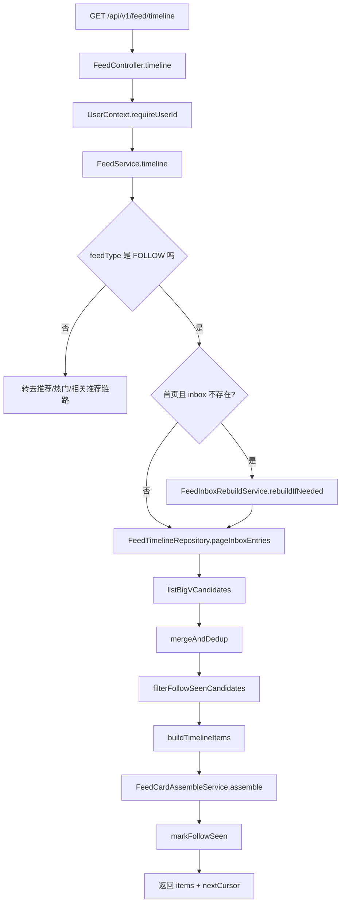

- 详细文本描述：
1. Controller 不信请求里的 `userId`，直接从 `UserContext` 取。这一点很关键，因为 `FeedTimelineRequestDTO` 里虽然有 `userId` 字段，但当前控制器根本不用它。
2. `FeedService.timeline` 先按 `feedType` 分流。不是 `FOLLOW`，就直接走 RECOMMEND、POPULAR、NEIGHBORS 的独立逻辑。
3. `FOLLOW` 首页如果没有 `cursor`，并且 `feed:inbox:{userId}` 这个 key 不存在，就触发离线重建。
4. 正常读取时，先从 `feed:inbox:{userId}` 里按“时间倒序 + postId 倒序”拉一批候选，再补一批大 V 候选。
5. 候选合并后，会做两层过滤。第一层是 FOLLOW 首页的“已读去重”，避免刚看完第一页又马上看到同一条。第二层是回表后的关系过滤，只允许“我自己 + 我当前仍然关注的人”，并且会过滤双向拉黑。
6. 最后，`FeedCardAssembleService` 把冷冰冰的 `postId` 变成用户真正看到的卡片：补作者昵称头像、点赞数、我是否点过赞、我是否关注作者、我是否看过。

- 实现方式为什么这么设计：
1. 首页先读 Redis 索引，是为了把大部分请求从 MySQL 里拿出去。
2. “取关后立刻生效”没有选择去扫 Redis 删历史索引，而是让读侧只认当前关注关系。这样便宜很多，也更稳。
3. 对外的 `cursor` 只暴露上页最后一条 `postId`，对前端简单；服务端内部再把它转成 `(createTime, postId)` 的 Max_ID 语义，兼顾稳定分页。

- STAR 面试讲法：
1. S：首页 Feed 是最高频接口，既要快，又要能处理取关、大 V、拉黑、离线回归。
2. T：我需要把“读快”和“语义正确”同时保住，不能因为图省事就把脏内容刷出来。
3. A：我用 Redis inbox 存索引，用 MySQL 做真相源；用读侧关系过滤解决取关即时生效；再加首页已读去重和大 V 补拉。
4. R：结果是首页主路径只读 Redis 少量 key，再批量回表组装卡片；用户看到的内容更稳定，写回收成本也可控。

- 亮点/兜底/一致性/性能点：
1. `FeedTimelineRepository.pageInboxEntries` 只在 ZSET 里存 `postId + publishTimeMs`，结构很干净。
2. Redis ZSET 的 score 只有时间，所以实现里会多抓一点数据，再用 `postId` 做二次比较，避免同一毫秒下翻页乱序。
3. FOLLOW 首页的“已读去重”只在首页第一页启用，不会把后续翻页逻辑搞复杂。
4. `FeedCardAssembleService` 把静态卡片、动态计数、关系态拆开装配，缓存更容易命中。

- **上游**
1. 发布分发链路会先把普通作者内容写进 `feed:inbox:{userId}`，把大 V 内容写进作者 outbox 或 bigv pool，所以首页读链路本质上是在消费这些上游索引。
2. 如果用户长期离线导致 inbox 不存在，这条链路会直接把“离线重建”当自己的上游补齐；如果关系刚变化，当前关注关系和拉黑关系也来自关系域真相源。

- **下游**
1. 候选 `postId` 会交给 `FeedCardAssembleService` 组装成前端真正看到的卡片。
2. 首页第一页读完后会写 `feed:follow:seen:{userId}` 给下一次第一页去重用；如果回表发现内容缺失，还会顺手触发读时修复，把坏索引删掉。

- **相关技术栈、职责与原理**
1. `Redis ZSET`：负责存 `feed:inbox:{userId}` 这类按时间排序的首页索引。它适合这里，因为 Feed 首页的核心就是“按分数倒序拿一段候选”，ZSET 天然擅长这个。
2. `Redis SET`：负责存 `feed:follow:seen:{userId}` 的短期已读集合。它适合这里，因为首页第一页只需要快速判断“这条刚看过没”，SET 的成员判断是 O(1)。
3. `MySQL`：负责保存内容真相和关注/拉黑关系真相。它适合这里，因为首页可以快读 Redis，但“你现在还关注他吗”“内容真的还存在吗”这类判断必须回真相源。
4. `读时修复`：负责在用户真的读到坏索引时顺手删除脏数据。它适合这里，因为删帖和取关影响面很大，放到写时全量回收太贵，读时修复能把成本摊薄。

## 4. 链路 2：个人主页 PROFILE Feed

- 链路名称：个人主页 PROFILE Feed
- 入口/核心类：`FeedController.profile`、`FeedService.profile`、`ContentRepository.listUserPosts`
- 要解决的问题：看某一个作者的主页时，没有必要走“分发后的 inbox”，直接按作者查就够了。

```mermaid
graph TD
    A[GET /api/v1/feed/profile/{targetId}] --> B[FeedController.profile]
    B --> C[UserContext.requireUserId]
    C --> D[FeedService.profile]
    D --> E{双方拉黑了吗}
    E -- 是 --> F[返回空列表]
    E -- 否 --> G[ContentRepository.listUserPosts]
    G --> H[FeedCardAssembleService.assemble]
    H --> I[返回 items + nextCursor]
```

- 详细文本描述：
1. 个人页接口也不信 DTO 里的 `visitorId`，只信 `UserContext`。
2. `FeedService.profile` 先做一层关系检查。只要双方任意一方把对方拉黑，就直接返回空。
3. 个人页不读 inbox/outbox，而是直接调用 `ContentRepository.listUserPosts`。
4. 这里的分页游标是 `"{lastCreateTimeMs}:{lastPostId}"`，和首页 FOLLOW 的 `postId` 游标不一样。
5. 当前 SQL 是 `status in (1,2)`，也就是“审核中 + 已发布”都能查出来。

- 实现方式为什么这么设计：
1. 个人页只看一个作者，不需要提前把索引分发给别人，直接查库更自然。
2. 个人页分页直接用 `create_time DESC, post_id DESC`，比先写个人 inbox 再读更简单。

- STAR 面试讲法：
1. S：个人主页访问模式和首页完全不同，它不是“我关注了谁”，而是“我就看这个人”。
2. T：我要把个人页做得简单，不要把首页的分发复杂度硬塞进去。
3. A：我直接按作者查 MySQL，再复用统一的卡片装配服务。
4. R：这样个人页逻辑很短，分页稳定，也不会把 Redis 索引空间浪费在低价值场景上。

- 亮点/兜底/一致性/性能点：
1. 个人页和首页分开，是“不同问题用不同数据结构”的典型做法。
2. 个人页也复用 `FeedCardAssembleService`，所以展示层字段保持一致。
3. 当前代码风险很明确：`selectByUserPage` 查的是 `status in (1,2)`，面试时要如实说明这意味着“审核中内容是否应该被他人看到”，还需要产品和权限再收口。

- **上游**
1. 请求从 `GET /api/v1/feed/profile/{targetId}` 进入，但访问者身份仍然来自 `UserContext`，不是前端传参。
2. 关系域提供双方拉黑状态，内容域提供作者自己的发帖真相数据。

- **下游**
1. `ContentRepository.listUserPosts` 拉出来的内容会继续走统一卡片装配，所以个人页最终返回的字段和首页、推荐页保持一套口径。
2. 返回值会带 `"{lastCreateTimeMs}:{lastPostId}"` 游标，供前端继续翻页。

- **相关技术栈、职责与原理**
1. `MySQL`：负责按作者和时间直接分页查内容。它适合这里，因为个人页只看一个作者，直接走索引分页比先分发再读更短。
2. `FeedCardAssembleService`：负责把内容实体补成统一卡片视图。它适合这里，因为个人页不该单独维护一套展示拼装逻辑。
3. `Max_ID 游标`：负责保证 `create_time DESC, post_id DESC` 下的稳定翻页。它适合这里，因为同一时间戳下再用 `postId` 打破并列，翻页不会乱。

## 5. 链路 3：发布后分发总入口

- 链路名称：发布后分发总入口
- 入口/核心类：`ContentService.dispatchAfterCommit`、`ContentEventOutboxPort`、`ContentEventOutboxRetryJob`
- 要解决的问题：发帖成功后，既要触发 Feed 分发，又不能出现“数据库没提交，MQ 先发了”或“数据库提交了，MQ 丢了”的事故。

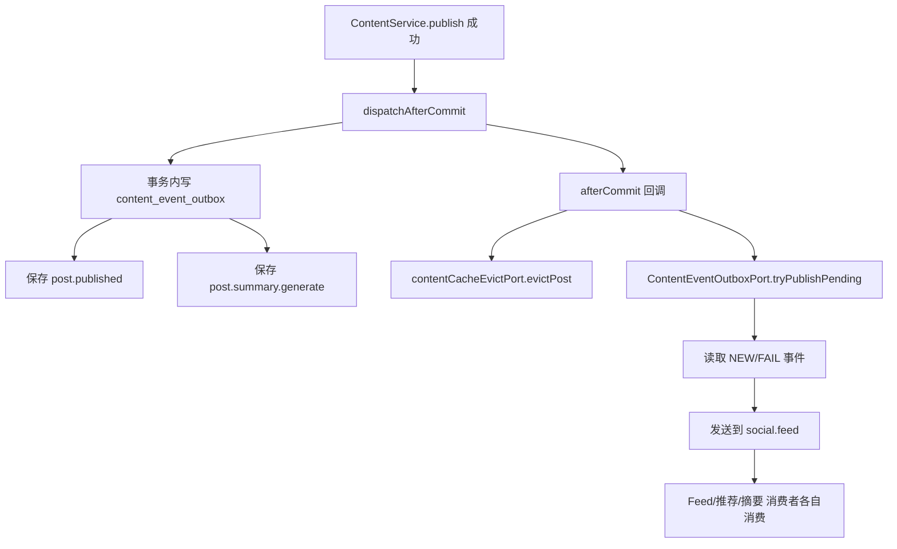

- 详细文本描述：
1. 当前真正的主链不是 `ContentDispatchPort` 那种“直接发 MQ”，而是 `ContentService` 里的内容事件 Outbox。
2. 发布成功后，事务内会先往 `content_event_outbox` 写两条事件：`post.published` 和 `post.summary.generate`。
3. 真正发 MQ 的动作放到 `afterCommit`。也就是说，只有数据库事务已经提交，才尝试把 Outbox 里的事件推到 `social.feed`。
4. 如果 MQ 当时不可用，也不会丢。`ContentEventOutboxRetryJob` 每分钟会继续扫 `NEW/FAIL` 事件重发。
5. 删除内容也一样，走 `dispatchDeleteAfterCommit`，写 `post.deleted` Outbox。

- 实现方式为什么这么设计：
1. 这是标准的“事务真相源 + Outbox 最终投递”设计。先保住数据库，再异步把副作用扩散出去。
2. 发送失败不回滚业务事务，是因为“内容成功发布”不应该被“推荐系统短暂不可用”拖死。

- STAR 面试讲法：
1. S：发帖后要通知很多下游，但最怕双写不一致。
2. T：我要保证“帖子成功”这件事和“事件最终能发出去”同时成立。
3. A：我把事件先写 Outbox 表，再在事务提交后触发发布，并配重试任务。
4. R：这样数据库和 MQ 解耦了，MQ 短暂故障不会把核心发帖流程打挂。

- 亮点/兜底/一致性/性能点：
1. Outbox 事件 ID 用 `eventType:postId:versionNum` 这种确定性格式，天然利于幂等。
2. `ContentEventOutboxRetryJob` 每分钟重试、每天清理七天前已发送记录，闭环完整。
3. 当前代码现状：`ContentDispatchPort` 仍然存在，但不是发布主链路。面试时要明确说“现网主链是 Outbox 版，不是裸发 MQ 版”。

- **上游**
1. 上游是真正的内容发布/删除事务，也就是 `ContentService.publish` 和 `dispatchDeleteAfterCommit`。
2. 事务里先落 `content_event_outbox`，说明这条链路的起点不是 MQ，而是 MySQL 里的待发送事件。

- **下游**
1. `social.feed` 上的 `post.published` 会继续驱动 fanout、推荐 item upsert、摘要生成等异步消费者。
2. `post.deleted` 会驱动推荐 item 删除和后续读时修复收敛。

- **相关技术栈、职责与原理**
1. `MySQL Outbox`：负责把“内容已提交”和“后续要发什么事件”绑在同一个事务里。它适合这里，因为数据库提交成功才是业务真相。
2. `RabbitMQ`：负责把 `post.published`、`post.deleted` 异步发给多个下游。它适合这里，因为 Feed、推荐、摘要是并行副作用，不该串在发帖事务里。
3. `afterCommit + Retry Job`：负责“提交后尝试发送”和“失败后补发”。它适合这里，因为能避免双写不一致，又不用让 MQ 短故障回滚发帖主事务。

## 6. 链路 4：Fanout dispatcher / worker 写扩散

- 链路名称：Fanout dispatcher / worker 写扩散
- 入口/核心类：`FeedFanoutDispatcherConsumer`、`FeedFanoutTaskConsumer`、`FeedDistributionService`
- 要解决的问题：普通作者发一条帖，如何把索引推给粉丝，同时避免一条消息把消费者拖死。

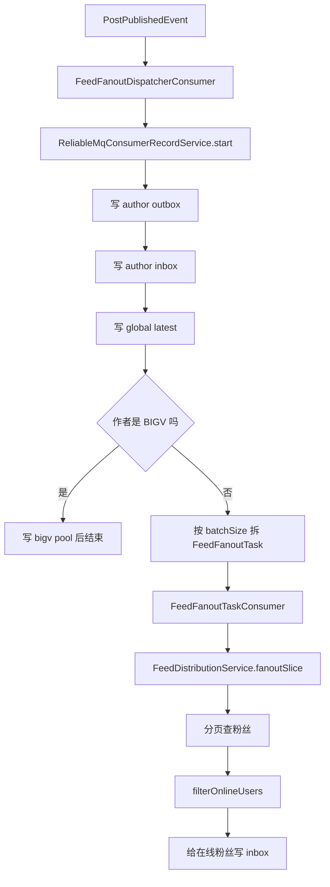

- 详细文本描述：
1. 发布事件进 `feed.post.published.queue` 后，dispatcher 先做三件肯定要做的事：写作者 outbox、写作者自己 inbox、写全站 latest。
2. 之所以先写作者自己 inbox，是为了保证“我刚发的内容我自己马上能看到”。
3. `global latest` 是推荐流的本地兜底池，和 fanout 不是一回事，但顺手在这里更新最便宜。
4. 如果作者被标记成 BIGV，dispatcher 只写大 V 池，然后直接返回，不再投递全量粉丝任务。
5. 如果不是 BIGV，就按 `feed.fanout.batchSize` 拆成多个 `FeedFanoutTask`。
6. worker 处理每个切片时，会分页查粉丝，再用 `feed:inbox:{userId}` 是否存在来判断这个用户当前是不是“在线”，只给在线粉丝写 inbox。

- 实现方式为什么这么设计：
1. dispatcher 只做轻逻辑，重活拆到 worker，这是为了把单条消息耗时压短。
2. “在线推、离线不推”是为了控制写放大。离线用户下次回来走重建，没必要一直往过期 inbox 里灌。

- STAR 面试讲法：
1. S：粉丝量一大，单条发帖的 fanout 很容易把 MQ 消费时间拉爆。
2. T：我要把 fanout 做成可拆、可重试、可幂等。
3. A：我做了 dispatcher/worker 两段式；dispatcher 负责必要写入和拆片，worker 负责单片 fanout；在线状态直接用 inbox key 是否存在来近似判断。
4. R：结果是大 fanout 也能横向拆开跑，失败时只重试某一片，不用全量重来。

- 亮点/兜底/一致性/性能点：
1. `FeedFanoutTask` 只带 `postId/authorId/publishTimeMs/offset/limit`，消息很轻。
2. `ReliableMqConsumerRecordService` 用 `eventId + consumerName` 做消费幂等。
3. Redis ZSET 以 `postId` 为 member，重复写天然不产生重复条目。
4. 当前代码现状：`FeedDistributionService.fanout(PostPublishedEvent)` 这个单体接口还在，但真实主链走的是 dispatcher + task worker。
5. 当前代码现状：配置里有 `feed.bigv.coreFanMaxPush`，但当前源码里没有铁粉推送实现。

- **上游**
1. 上游是链路 3 发出来的 `post.published` 事件。
2. dispatcher 先消费总事件，再按 `batchSize` 拆成多个 `FeedFanoutTask` 给 worker，所以上游其实分两层：内容事件层和 fanout 任务层。

- **下游**
1. 会落作者自己的 outbox、作者自己的 inbox、`feed:global:latest`，给首页和推荐降级用。
2. 普通作者会继续下发 fanout task，把索引写进在线粉丝 inbox；大 V 则只写 bigv pool，后面交给读链路补拉。

- **相关技术栈、职责与原理**
1. `RabbitMQ`：负责把大 fanout 拆成 dispatcher 和 worker 两段消息。它适合这里，因为一条发帖可能要扇出很多粉丝，拆片后失败只重试一片。
2. `Redis ZSET`：负责存作者 outbox、粉丝 inbox、`global latest`、bigv pool 这些时间线索引。它适合这里，因为这些结构本质都是“按时间有序取最近若干条”。
3. `MySQL`：负责分页查粉丝真相数据。它适合这里，因为粉丝关系是强一致业务数据，不适合只靠缓存拍脑袋。

## 7. 链路 5：大 V 分级、大 V 池、Outbox 重建

- 链路名称：大 V 分级、大 V 池、Outbox 重建
- 入口/核心类：`FeedAuthorCategoryStateMachine`、`FeedAuthorCategoryRepository`、`FeedOutboxRebuildService`、`FeedService.listBigVCandidates`
- 要解决的问题：大 V 粉丝太多时，不能继续走“发帖时给每个粉丝写 inbox”的普通路线。

```mermaid
graph TD
    A[关注/取关/拉黑事件] --> B[FeedAuthorCategoryStateMachine.onFollowerCountChanged]
    B --> C[统计粉丝数]
    C --> D[写 feed:author:category]
    D --> E{类别发生变化?}
    E -- 是 --> F[FeedOutboxRebuildService.forceRebuild]
    E -- 否 --> G[结束]
    H[首页 FOLLOW 读取] --> I[listBigVCandidates]
    I --> J{启用 bigv pool 且关注很多?}
    J -- 是 --> K[pagePool(bucket)]
    J -- 否 --> L[pickBigVAuthors + pageOutbox]
    K --> M[合并回首页候选]
    L --> M
```

- 详细文本描述：
1. 作者是不是大 V，不是每次现算，而是放在 `feed:author:category` 里做结果缓存。
2. 关注、取关、拉黑都会触发 `FeedAuthorCategoryStateMachine.onFollowerCountChanged`，因为这些动作都可能改变粉丝数。
3. 如果作者类别从普通用户切到 BIGV，或者反过来切回来，会触发 `FeedOutboxRebuildService.forceRebuild`，把作者最近一段时间的内容重新灌进 outbox。
4. 首页读大 V 内容时，先看要不要启用聚合池。只有 `feed.bigv.pool.enabled=true` 且关注数量超过阈值时，才会去读 `feed:bigv:pool:{bucket}`。
5. 如果不用池，就先找出我关注的人里哪些是 BIGV，再逐个读这些人的 outbox。
6. 如果首页读取时发现“我的关注数正好被 `maxFollowings` 截断了”，代码还会额外去 DB 查一批 BIGV 关注对象补进来，避免漏掉大作者。

- 实现方式为什么这么设计：
1. 大 V 的核心矛盾是写压力，不是读压力，所以先把“写扩散”改成“读拉取”。
2. 大 V 聚合池不是主语义，只是兜底优化。即使读池，也还要按“我是否真的关注了这个作者”再次过滤。

- STAR 面试讲法：
1. S：普通作者和大 V 的量级完全不同，不能一套分发模型打天下。
2. T：我要把大 V 的发布成本从“和粉丝数线性相关”改成“和自己内容量相关”。
3. A：我做了作者分级缓存、类别切换时 outbox 重建、读侧按需读 outbox 或聚合池。
4. R：大 V 发帖的写成本明显下降，而粉丝刷首页时还能补回来，不丢语义。

- 亮点/兜底/一致性/性能点：
1. 这是典型的“普通用户写扩散，大 V 读扩散”双模型。
2. Outbox 重建按“最近 N 天 + 最大条数”做，不会无限膨胀。
3. 当前代码现状：`feed.corefans` 只有配置，没有对应实现；面试时不要把旧草稿里的铁粉推说成已上线事实。

- **上游**
1. 上游是关系事件带来的粉丝数变化，包括关注、取关、拉黑。
2. 首页 FOLLOW 读链路在补大 V 候选时，也会反向依赖这条链路产出的 `feed:author:category`、outbox 和 bigv pool。

- **下游**
1. 类别变化会触发 `FeedOutboxRebuildService.forceRebuild`，把作者最近内容重建到 outbox。
2. 后续首页读取时，会按配置选择读作者 outbox 还是 `feed:bigv:pool:{bucket}`。

- **相关技术栈、职责与原理**
1. `Redis HASH`：负责存 `feed:author:category` 这类作者分级结果。它适合这里，因为读路径只需要高频查“这个作者是不是 BIGV”，HASH 读便宜、结构也简单。
2. `Redis ZSET`：负责存作者 outbox 和 bigv 聚合池。它适合这里，因为大 V 方案的本质是把“写给每个粉丝”改成“读时按时间拉候选”。
3. `离线重建 / Outbox 重建`：负责在作者类别切换时把历史内容重新灌进可读索引。它适合这里，因为类别一变，旧索引模型就不对了，重建比堆补丁更干净。
4. `MySQL`：负责统计粉丝数真相。它适合这里，因为大 V 分级是业务判定，不能只靠缓存猜。

## 8. 链路 6：删除回收与读时修复

- 链路名称：删除回收与读时修复
- 入口/核心类：`ContentService.dispatchDeleteAfterCommit`、`FeedRecommendItemDeleteConsumer`、`FeedService.cleanupMissingIndexes`
- 要解决的问题：删帖后，推荐系统要删 item；Feed 索引不能长期挂着失效 `postId`；但又不想做全量扫库回收。

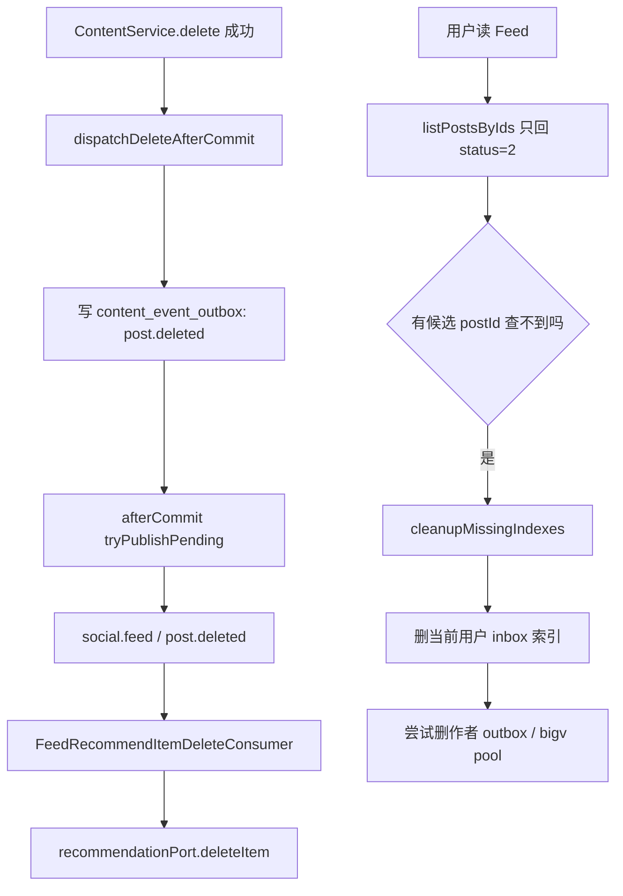

- 详细文本描述：
1. 删除内容后，内容域会写 `post.deleted` Outbox，并在事务提交后尝试发到 `social.feed`。
2. 推荐删除消费者收到后，会调用 `recommendationPort.deleteItem(postId)`，把推荐系统里的 item 删除。
3. Feed 自己不会去扫所有人的 inbox 做全量清理。它的做法是：用户读到一条索引时，如果回表发现这条内容已经查不到，就当场把这条索引懒清掉。
4. `cleanupMissingIndexes` 一定会删当前用户 inbox 里的坏索引。
5. 如果还能从 `contentRepository.findPost(postId)` 找到原始作者，就顺手再删作者 outbox 和大 V 池里的那条索引。

- 实现方式为什么这么设计：
1. 删帖时最怕写放大。全量扫 inbox 成本太高，也很难做成强一致。
2. 把大清理延后到读时处理，写路径就可以保持很轻。

- STAR 面试讲法：
1. S：删帖是低频动作，但影响范围可能很大，最怕因为一次删帖把一堆索引全扫一遍。
2. T：我要做到“删除最终生效”，但不能让写路径失控。
3. A：推荐系统用 `post.deleted` 异步删 item；Feed 自己采用读时懒清理。
4. R：结果是删除主链很轻，用户读取到脏索引时也会自动修掉，系统能逐步收敛。

- 亮点/兜底/一致性/性能点：
1. 首页回表只认 `status=2` 的内容，所以审核中、已删内容都不会真正展示出来。
2. 当前代码风险：如果 `findPost(postId)` 已经拿不到作者，就只能清当前用户 inbox，作者 outbox 和大 V 池要等别的读请求再慢慢修。
3. 删除消费者失败会进入 DLQ，但不会影响“内容已删除”这个主事务结果。

- **上游**
1. 上游一头是内容删除事务发出的 `post.deleted` Outbox 事件。
2. 另一头是用户真实读取 Feed 时回表发现 `postId` 已经查不到，这会触发本地懒清理。

- **下游**
1. 推荐删除消费者会调用推荐端口删 item，让推荐系统别再召回这条内容。
2. 当前用户 inbox 里的脏索引会被删掉；如果还能拿到作者信息，还会顺手清作者 outbox 和 bigv pool。

- **相关技术栈、职责与原理**
1. `MySQL Outbox`：负责把删除事件稳定落库。它适合这里，因为删帖主事务先要保证内容状态变了，副作用可以后补。
2. `RabbitMQ`：负责把 `post.deleted` 扩散给推荐删除等消费者。它适合这里，因为删除影响多个下游，但不该卡住主事务。
3. `Redis ZSET`：负责存 inbox、outbox、bigv pool 里的可见索引。它适合这里，因为删坏索引时可以按 `postId` 定位 member 做定点删除。
4. `读时修复`：负责把“全量回收”改成“谁读到谁修”。它适合这里，因为删除是低频但影响面大，读时修复能明显降低写放大。
5. `推荐端口`：负责通知外部推荐系统删除 item。它适合这里，因为推荐系统和业务库是两套存储，必须通过接口同步。

## 9. 链路 7：RECOMMEND 推荐流与推荐 session

- 链路名称：RECOMMEND 推荐流与推荐 session
- 入口/核心类：`FeedService.recommendTimeline`、`FeedRecommendSessionRepository`、`IRecommendationPort`
- 要解决的问题：推荐流的候选来源会抖动，如果前端用同一个 cursor 重试，结果最好稳定，不要一刷新就乱跳。

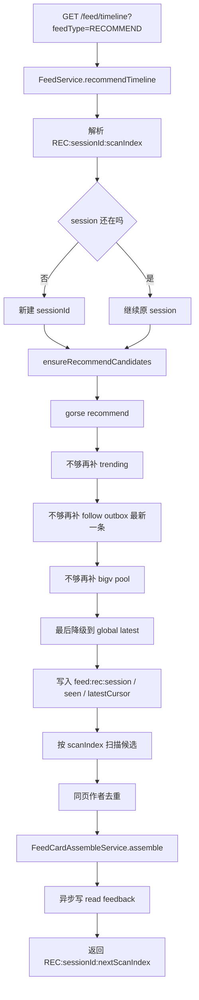

- 详细文本描述：
1. RECOMMEND 的 cursor 不是 `postId`，而是 `REC:{sessionId}:{scanIndex}`。
2. `sessionId` 不存在或已经过期时，服务端会新建一个 12 位短 session。
3. `ensureRecommendCandidates` 会尽量把“本次读取需要的候选”先准备好，写进 Redis session。
4. 候选补齐顺序很清楚：先找 gorse 个性化推荐，再找 trending，再拿关注作者 outbox 的最新一条，再拿 bigv pool，最后才降级到 `feed:global:latest`。
5. `feed:rec:seen:{userId}:{sessionId}` 会保证同一个 session 内不重复追加同一条内容。
6. 真正返回结果时，不是按“取前 N 个”这么粗暴，而是从 `scanIndex` 开始扫描，遇到同页重复作者会跳过，所以 `scanIndex` 是“扫描指针”，不是“已返回条数”。

- 实现方式为什么这么设计：
1. session cache 的目的是让同一个 cursor 重试时结果更稳定，不受实时推荐波动影响。
2. 把兜底顺序写死在服务里，是为了保证“推荐挂了也能出内容”，而不是直接白屏。

- STAR 面试讲法：
1. S：推荐系统可能抖动，也可能短暂不可用，但用户还是会一直往下刷。
2. T：我要让推荐流既能个性化，又能稳定翻页，还要有降级方案。
3. A：我用 session cache 固定一段时间内的候选集合，再用扫描指针推进；候选不够时按个性化、trending、社交、bigV、latest 多级补齐。
4. R：结果是推荐流既能在推荐系统正常时给个性化结果，也能在异常时持续吐内容，不至于空白。

- 亮点/兜底/一致性/性能点：
1. `feed:rec:session`、`feed:rec:seen`、`feed:rec:latestCursor` 三个 key 组合起来，正好解决“顺序、去重、兜底游标”三个问题。
2. RECOMMEND 最后会异步写 `read` 反馈，但失败不影响主链路。
3. 当前代码现状：`IRecommendationPort.sessionRecommend()` 接口虽然有，但推荐主链并没有用它。
4. 当前代码现状：源码里没有单独的“本地推荐池仓储”；所谓推荐池，实际是“外部推荐系统 + session cache + global latest + 社交候选”的组合。

- **上游**
1. 上游是 `GET /feed/timeline?feedType=RECOMMEND` 请求和已有的 `REC:{sessionId}:{scanIndex}` 游标。
2. 候选来源不是单一源头，而是推荐端口、trending、关注作者 outbox、bigv pool、global latest 这一串召回源。

- **下游**
1. 选好的候选顺序会写进 `feed:rec:session`、`feed:rec:seen`、`feed:rec:latestCursor`，给本 session 继续翻页用。
2. 返回卡片后，还会异步写 `read` 反馈，给推荐系统补行为数据。

- **相关技术栈、职责与原理**
1. `Redis LIST`：负责保存 `feed:rec:session:{userId}:{sessionId}` 的候选顺序。它适合这里，因为 session 里最重要的是“固定顺序”，LIST 天然就是按位置读取。
2. `Redis SET`：负责保存 `feed:rec:seen:{userId}:{sessionId}` 去重集合。它适合这里，因为补候选时要频繁判断“这条进过 session 没”，SET 最直接。
3. `Redis STRING`：负责保存 `feed:rec:latestCursor:{userId}:{sessionId}`。它适合这里，因为 latest 兜底只需要记一个内部游标，不需要复杂结构。
4. `推荐端口`：负责对接个性化推荐、trending 和相似推荐这类外部能力。它适合这里，因为推荐系统是可替换的外部依赖，先抽端口才能优雅降级。
5. `Redis ZSET`：负责提供 follow outbox、bigv pool、global latest 这些本地兜底候选。它适合这里，因为兜底的共同需求也是“按时间拿最近内容”。

## 10. 链路 8：POPULAR 热门流

- 链路名称：POPULAR 热门流
- 入口/核心类：`FeedService.popularTimeline`
- 要解决的问题：给用户一条热门流，但不要复用 FOLLOW 的 inbox 语义。

```mermaid
graph TD
    A[GET /feed/timeline?feedType=POPULAR] --> B[FeedService.popularTimeline]
    B --> C[解析 POP:offset]
    C --> D[recommendationPort.nonPersonalized(trending)]
    D --> E[按 offset + scanBudget 扫描]
    E --> F[同页作者去重]
    F --> G[FeedCardAssembleService.assemble]
    G --> H[返回 POP:nextOffset]
```

- 详细文本描述：
1. POPULAR 的 cursor 是 `POP:{offset}`，它也是扫描指针。
2. 热门候选来自 `recommendationPort.nonPersonalized(trendingRecommenderName, userId, n, offset)`。
3. 这条链路会做同页作者去重，但不会走 FOLLOW 的关系过滤逻辑。
4. 最终还是复用统一卡片装配。

- 实现方式为什么这么设计：
1. 热门流是推荐语义，不应该去读用户自己的 inbox。
2. 用 offset 而不是 `postId`，是因为热门流的顺序由推荐系统决定，不是时间线顺序。

- STAR 面试讲法：
1. S：热门流和关注流不是同一个问题，不能共用同一套游标协议。
2. T：我要用推荐系统的排序结果，同时避免同一页作者刷屏。
3. A：我把热门流做成独立链路，直接用 non-personalized recommender，再在应用层做作者去重。
4. R：这样热门流实现很清晰，和首页关注流不会互相污染。

- 亮点/兜底/一致性/性能点：
1. POPULAR 和 RECOMMEND 共用“扫描指针”思路，分页稳定性更容易统一。
2. 当前代码现状：如果 `feed.recommend.baseUrl` 为空，`GorseRecommendationPort` 会直接返回空列表，这条链路没有本地 latest 兜底。

- **上游**
1. 上游是 `feedType=POPULAR` 的时间线请求。
2. 候选只来自 `recommendationPort.nonPersonalized(trending...)`，不走 inbox/outbox。

- **下游**
1. 候选会经过同页作者去重，再交给统一卡片装配返回给前端。
2. 返回新的 `POP:{nextOffset}`，让前端继续按扫描指针翻页。

- **相关技术栈、职责与原理**
1. `推荐端口`：负责调用非个性化 trending 推荐器。它适合这里，因为热门流的排序标准来自推荐系统，不是时间顺序。
2. `offset 扫描指针`：负责在推荐结果里稳定往后扫。它适合这里，因为热门流没有 `postId` 时间线语义，用页码反而更容易跳。
3. `FeedCardAssembleService`：负责把推荐结果统一转成 Feed 卡片。它适合这里，因为热门流只该换召回，不该再做一套展示层。

## 11. 链路 9：NEIGHBORS 相关推荐流

- 链路名称：NEIGHBORS 相关推荐流
- 入口/核心类：`FeedService.neighborsTimeline`
- 要解决的问题：用户正在看某条内容时，给他一组“相似内容”。

```mermaid
graph TD
    A[GET /feed/timeline?feedType=NEIGHBORS] --> B[FeedService.neighborsTimeline]
    B --> C[解析 NEI:seedPostId:offset]
    C --> D{seedPostId 合法吗}
    D -- 否 --> E[返回空]
    D -- 是 --> F[recommendationPort.itemToItem(similar)]
    F --> G[按 offset 截取 slice]
    G --> H[同页作者去重]
    H --> I[FeedCardAssembleService.assemble]
    I --> J[返回 NEI:seedPostId:nextOffset]
```

- 详细文本描述：
1. 相关推荐的 cursor 格式是 `NEI:{seedPostId}:{offset}`。
2. 这意味着第一次请求就得带 `seedPostId`，不然服务端连“和谁相似”都不知道。
3. 代码会先把 `offset + scanBudget` 这么多候选一次性从推荐端口拿回来，再在应用层做切片和同页作者去重。

- 实现方式为什么这么设计：
1. 相似推荐天然围绕一个 seed 展开，所以把 seed 直接写进 cursor 最省事。
2. 相关推荐不读 inbox/outbox，是为了和时间线语义彻底分开。

- STAR 面试讲法：
1. S：相关推荐不是“你关注了谁”，而是“这篇内容像什么”。
2. T：我要保证请求里始终带着 seed，并且支持继续往后翻。
3. A：我定义了 `NEI:{seedPostId}:{offset}` 协议，用 item-to-item recommender 拉相似结果，再做应用层切片和作者去重。
4. R：这样相关推荐链路很干净，面试时也容易讲清楚“为什么它的 cursor 和别的都不一样”。

- 亮点/兜底/一致性/性能点：
1. 相关推荐和热门流一样，也是推荐排序，不受 inbox/outbox 影响。
2. 当前代码现状：这条链路没有本地兜底；推荐系统不给结果，就直接空列表。

- **上游**
1. 上游是带 `seedPostId` 的 `feedType=NEIGHBORS` 请求。
2. 候选源头只有 item-to-item 推荐器；如果 `seedPostId` 不合法，链路直接返回空。

- **下游**
1. 返回前会做同页作者去重和统一卡片装配。
2. 返回 `NEI:{seedPostId}:{nextOffset}`，保持同一个 seed 继续往后翻。

- **相关技术栈、职责与原理**
1. `推荐端口`：负责调用 item-to-item 相似推荐。它适合这里，因为这条链路的问题不是“最近谁发了”，而是“这篇内容像什么”。
2. `seedPostId + offset` 游标：负责把“围绕哪条内容推荐”和“翻到哪里了”一起带下去。它适合这里，因为相关推荐天然依赖 seed。
3. `FeedCardAssembleService`：负责把推荐出的 `postId` 继续转成统一卡片。它适合这里，因为相关推荐只是候选来源不同，展示尾巴和别的流一样。

## 12. 链路 10：推荐池写入、删除、冷启动回灌

- 链路名称：推荐池写入、删除、冷启动回灌
- 入口/核心类：`FeedRecommendItemUpsertConsumer`、`FeedRecommendItemDeleteConsumer`、`FeedRecommendItemBackfillRunner`
- 要解决的问题：推荐系统要先“知道有哪些 item”，不然 RECOMMEND、POPULAR、NEIGHBORS 都没基础。

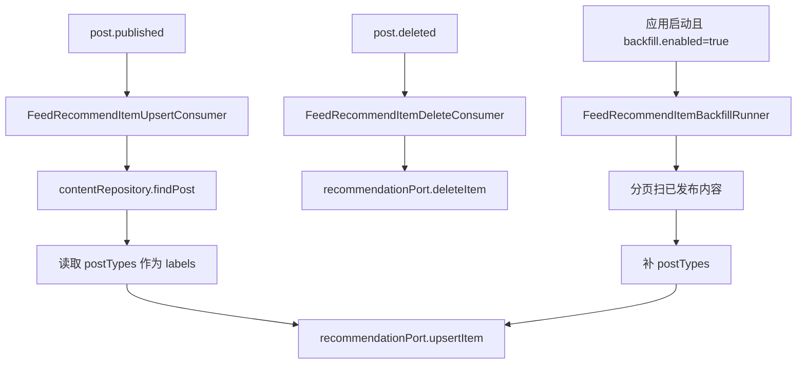

- 详细文本描述：
1. `FeedRecommendItemUpsertConsumer` 监听的是独立队列 `feed.recommend.item.upsert.queue`，不会和 fanout 共用队列。
2. 它收到 `post.published` 后，会回表查内容，再把 `postTypes` 规范化成 labels，调用 `recommendationPort.upsertItem`。
3. 删除链路也独立，`FeedRecommendItemDeleteConsumer` 收到 `post.deleted` 后删推荐 item。
4. 如果推荐系统以前是空的，可以打开 `feed.recommend.backfill.enabled=true`，让 `FeedRecommendItemBackfillRunner` 启动时扫一遍历史已发布内容回灌。

- 实现方式为什么这么设计：
1. 推荐系统和业务库分离时，最重要的是保持 item 元数据同步。
2. 独立 upsert/delete 队列是为了避免和 fanout 消费争资源，也方便单独看 DLQ。

- STAR 面试讲法：
1. S：推荐系统不是数据库的镜像，它只认自己那套 item/feedback 数据。
2. T：我要把内容的新增、删除、冷启动回灌都补齐。
3. A：发布后异步 upsert item，删除后异步 delete item，历史数据靠启动回灌一次性补齐。
4. R：这样推荐系统既能跟上增量变化，也能在新环境里快速冷启动。

- 亮点/兜底/一致性/性能点：
1. upsert 和 delete 都有自己的 DLQ，排障边界更清楚。
2. 回灌 runner 默认关闭，避免线上误触。
3. labels 直接来自 `content_post_type`，语义比只传 `mediaType` 更像真实推荐特征。

- **上游**
1. 上游是链路 3 发出的 `post.published`、`post.deleted` 事件，以及应用启动时的 backfill 开关。
2. 增量同步时会回表读内容和 `content_post_type`，冷启动时会分页扫历史已发布内容。

- **下游**
1. 下游是外部推荐系统的 item 库，后续 RECOMMEND、POPULAR、NEIGHBORS 都依赖这里先有 item 才能召回。
2. 回灌完成后，新环境或新推荐实例才有最基本的冷启动数据。

- **相关技术栈、职责与原理**
1. `RabbitMQ`：负责把 upsert 和 delete 拆到独立队列。它适合这里，因为推荐 item 同步和 fanout 是两类负载，分队列更容易隔离故障。
2. `MySQL`：负责提供内容正文和 `content_post_type` 标签真相。它适合这里，因为推荐系统只存 item，不是内容库本身。
3. `推荐端口`：负责把 item upsert/delete 到外部推荐系统。它适合这里，因为推荐系统是外部组件，接口层最适合做适配。
4. `离线重建 / 冷启动回灌`：负责在推荐系统空库时一次性补历史 item。它适合这里，因为新环境最缺的不是实时消息，而是历史底座。

## 13. 链路 11：推荐反馈 A/C/read 三通道

- 链路名称：推荐反馈 A/C/read 三通道
- 入口/核心类：`FeedRecommendFeedbackAConsumer`、`FeedRecommendFeedbackConsumer`、`ReactionLikeService.publishRecommendUnlike`、`FeedService.writeRecommendReadFeedbackAsync`
- 要解决的问题：推荐系统只有 item 没用，还要知道用户喜欢、不喜欢、读了什么。

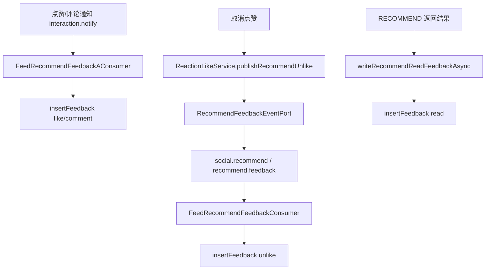

- 详细文本描述：
1. A 通道复用互动域的 `interaction.notify`。当前只处理两类：`LIKE_ADDED` 和 `COMMENT_CREATED`，分别映射成 `like`、`comment`。
2. C 通道是“反向语义”。当前明确能看到的生产者是 `ReactionLikeService` 在取消点赞时发 `RecommendFeedbackEvent(feedbackType=unlike)`。
3. RECOMMEND 读链路自己还会异步上报 `read` 反馈。
4. 三条反馈链路都是旁路。失败不会影响点赞、评论、读推荐这些主功能。

- 实现方式为什么这么设计：
1. 正反馈和负反馈来源不一样，分两条通道更清楚。
2. `read` 放在异步线程里，是因为用户已经拿到页面数据了，没必要等推荐反馈写成功。

- STAR 面试讲法：
1. S：只有 item 没有 feedback，推荐系统会越来越瞎。
2. T：我要把正反馈、负反馈和阅读反馈都补齐，同时不影响主业务。
3. A：我复用了互动通知做正反馈，用独立 `social.recommend` exchange 做负反馈，用推荐读链路异步补 `read`。
4. R：推荐系统能拿到更完整的用户行为，业务主链又不会被推荐系统可用性绑死。

- 亮点/兜底/一致性/性能点：
1. C 通道走 `ReliableMqOutboxService`，发送端也有 Outbox 保护。
2. 当前代码现状：C 通道源码里明确能看到的反馈生产者是 `unlike`；别的 `feedbackType` 是否有生产者，要看其它领域。

- **上游**
1. 上游一头是互动域的 `interaction.notify`，提供 `like/comment` 正反馈。
2. 另一头是 `ReactionLikeService.publishRecommendUnlike` 提供 `unlike` 负反馈，和 RECOMMEND 读链路异步补的 `read` 反馈。

- **下游**
1. 三条通道最终都会写到推荐系统的 feedback 数据里。
2. 推荐系统后续训练、召回和排序会利用这些行为，反过来影响 RECOMMEND、POPULAR、NEIGHBORS 的效果。

- **相关技术栈、职责与原理**
1. `RabbitMQ`：负责承接 `interaction.notify` 和 `social.recommend` 两条反馈消息流。它适合这里，因为点赞、评论、取消点赞都不该同步阻塞主业务。
2. `Outbox`：负责保护 `unlike` 这类发送端消息不丢。它适合这里，因为负反馈虽然是旁路，但一旦丢失，推荐系统画像会越来越偏。
3. `推荐端口 / insertFeedback 接口`：负责落 `like/comment/unlike/read` 反馈。它适合这里，因为业务侧只关心反馈语义，不该绑死推荐系统的具体 API。
4. `异步 read 反馈`：负责在结果已经返回后补读行为。它适合这里，因为 `read` 是高频旁路信号，异步上报更不影响用户体验。

## 14. 链路 12：离线重建

- 链路名称：离线重建
- 入口/核心类：`FeedInboxRebuildService`、`FeedTimelineRepository.replaceInbox`
- 要解决的问题：一个长期没打开首页的用户，不会持续收到在线 fanout，那他重新回来时怎么马上看到内容。

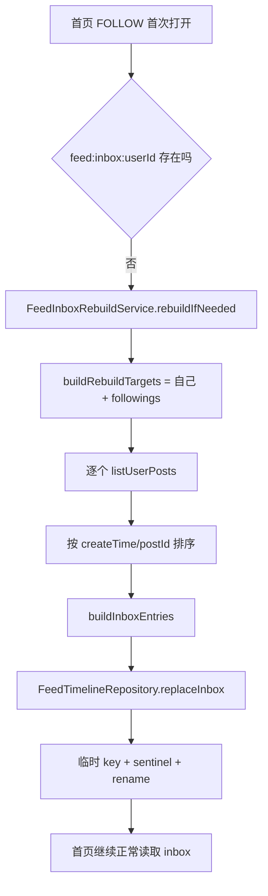

- 详细文本描述：
1. 离线的定义非常工程化：不是“没登录”，而是 Redis 里没有 `feed:inbox:{userId}` 这个 key。
2. 重建目标集合是“自己 + 当前关注的人”，上限受 `feed.rebuild.maxFollowings` 控制。
3. 每个目标会拉最近 `perFollowingLimit` 条内容，再按时间倒序合并。
4. 写回 inbox 时不会直接覆盖旧 key，而是先写临时 key，再写一个 `__NOMORE__` 哨兵，最后 `RENAME` 成正式 key。
5. 重建前还会拿一个短锁，防止同一个用户被并发重建多次。

- 实现方式为什么这么设计：
1. 离线用户最适合“回来时现建一份”，不适合一直给他推。
2. 临时 key + `RENAME` 是为了保证替换过程是原子的，避免用户读到半截 inbox。

- STAR 面试讲法：
1. S：在线推可以省很多写，但代价是离线用户回来时 inbox 可能根本不存在。
2. T：我要让离线用户第一次打开首页也能很快看到最近内容。
3. A：我在首页首屏做 inbox miss 检测，缺了就从“自己 + followings”的真相源重建，再原子替换写回 Redis。
4. R：结果是离线用户不需要提前占资源，回来时也能在一次请求里恢复时间线。

- 亮点/兜底/一致性/性能点：
1. `RelationAdjacencyCachePort` 这个名字虽然叫 cache，但当前实现其实直接回 DB；面试时不要误说成 Redis 邻接缓存。
2. 重建只处理索引，不直接拼卡片，职责很清楚。
3. 当前代码现状：重建抓内容用的是 `listUserPosts`，底层 SQL 查 `status in (1,2)`；真正展示时因为 `listPostsByIds` 只回 `status=2`，这些非发布内容最终会被懒清掉，但会带来额外索引噪音。
4. 当前代码现状：重建里没有负反馈过滤，因为当前源码根本没有 Feed 负反馈链路。

- **上游**
1. 上游是首页 FOLLOW 首屏请求发现 `feed:inbox:{userId}` 不存在。
2. 重建数据来自“自己 + 当前关注的人”的关系真相和内容真相。

- **下游**
1. 重建后的 inbox 会被原子替换成正式 key，随后首页链路就按正常 inbox 继续读。
2. 这份新 inbox 也会成为之后 fanout 补写、关注补偿、读时修复的共同基底。

- **相关技术栈、职责与原理**
1. `MySQL`：负责提供 followings 和最近内容真相。它适合这里，因为离线用户缺的是索引，不是真相源。
2. `Redis ZSET`：负责重新写 `feed:inbox:{userId}`。它适合这里，因为首页最终还是读时间有序索引，重建结果要回到同一种结构里。
3. `临时 key + sentinel + RENAME`：负责原子替换 inbox。它适合这里，因为用户读到半截重建结果比短暂 miss 更糟。
4. `短锁`：负责避免同一个用户并发重建多次。它适合这里，因为离线回归常发生在首屏重试和并发点击场景。

## 15. 链路 13：关注补偿、取关即时生效、关系事件闭环

- 链路名称：关注补偿、取关即时生效、关系事件闭环
- 入口/核心类：`RelationService`、`RelationEventOutboxPublishJob`、`RelationEventListener`、`FeedFollowCompensationService`
- 要解决的问题：刚关注一个人时，希望立刻看到他的最近内容；刚取关时，也希望他的内容马上别再出现。

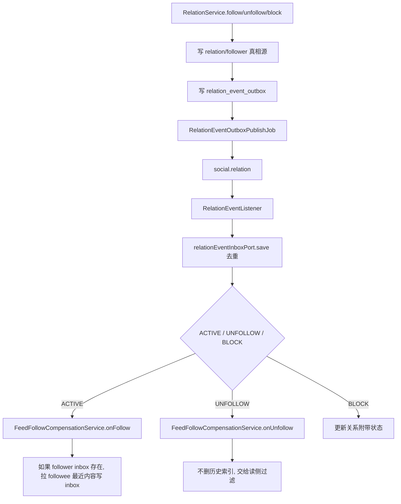

- 详细文本描述：
1. `RelationService.follow` 和 `unfollow` 先写关系表与反向粉丝表，再写 `relation_event_outbox`。
2. `RelationEventOutboxPublishJob` 每分钟把 `NEW/FAIL` 事件发到 `social.relation`。
3. `RelationEventListener` 收到 follow/block 事件后，会先把事件指纹写入 `relation_event_inbox`，避免重复处理。
4. `ACTIVE` 时，`FeedFollowCompensationService.onFollow` 会判断关注者 inbox 是否存在。只有 inbox 存在，也就是这个人当前算“在线”，才会把被关注者最近几条内容写进他的 inbox。
5. `UNFOLLOW` 时，代码明确不去删 Redis 历史索引。它依赖首页 FOLLOW 的读侧过滤，只要你不再关注这个作者，这些旧索引就不会再被展示。
6. 关系事件还会触发 `FeedAuthorCategoryStateMachine`，因为关注数变化会影响大 V 分级。

- 实现方式为什么这么设计：
1. 关注补偿是体验优化，不是强一致要求，所以只给在线用户补。
2. 取关后不扫 Redis，是为了避免高成本写回收，改用“读时只认当前关系”。

- STAR 面试讲法：
1. S：用户最敏感的两个瞬间，一个是“我刚关注了，怎么首页还没有”，一个是“我都取关了，怎么还在刷到”。
2. T：我要让这两个体验都马上生效，但不能为了删索引把系统写爆。
3. A：我把关系变更做成 Outbox 事件，再由 listener 触发 onFollow/onUnfollow；关注时只给在线用户补最近内容，取关时靠首页读侧只认当前关系。
4. R：结果是关注体验更顺滑，取关也能立刻生效，而且没有引入昂贵的全量清理任务。

- 亮点/兜底/一致性/性能点：
1. 这是“写少一点，读聪明一点”的典型案例。
2. `RelationEventInboxPort` 提供了消费去重收件箱，避免 follow/block 重复副作用。
3. 当前代码现状：`RelationAdjacencyCachePort.addFollow/removeFollow` 是空实现，名字叫 cache，但当前不是 Redis 邻接缓存。
4. 当前代码风险：`RelationEventRetryJob` 只重放 inbox 里 `FAILED` 的记录，而 listener 失败时是直接抛异常进 MQ 死信，没有显式 `markFail`；这意味着关系消费失败更依赖 DLQ 处理，而不是 inbox 自动重放。

- **上游**
1. 上游是 `RelationService.follow/unfollow/block` 对关系真相源的变更。
2. 这些变更先写 `relation_event_outbox`，再由发布任务发到 `social.relation`。

- **下游**
1. `RelationEventListener` 会先写 `relation_event_inbox` 去重，再触发 `onFollow`、`onUnfollow`。
2. `onFollow` 只给在线用户补写 inbox；`onUnfollow` 不删历史索引，而是让首页读链路立刻按当前关系过滤；粉丝数变化还会继续驱动大 V 分级。

- **相关技术栈、职责与原理**
1. `MySQL Outbox`：负责把关系变更事件稳稳落库。它适合这里，因为 `follow/unfollow` 是强业务动作，事件不能靠“顺便发一下”。
2. `MySQL Inbox`：负责做 `relation_event_inbox` 消费去重。它适合这里，因为关系事件重复消费会造成重复补偿或重复副作用。
3. `RabbitMQ`：负责把关系变化异步广播给 Feed 侧 listener。它适合这里，因为关系变更会影响补偿、大 V 分级等多个下游。
4. `Redis ZSET`：负责给在线用户补写 `feed:inbox:{userId}` 索引。它适合这里，因为补偿的目标不是查全量内容，而是快速把最近几条排进首页。
5. `读时修复 / 读侧过滤`：负责让取关即时生效而不去扫全量 Redis。它适合这里，因为取关后的核心诉求是“别再展示”，不是“立刻物理删光所有索引”。

## 16. 链路 14：Feed 卡片装配

- 链路名称：Feed 卡片装配
- 入口/核心类：`FeedCardAssembleService`、`FeedCardRepository`
- 要解决的问题：索引里只有 `postId`，用户真正看到的卡片却要包含正文摘要、作者信息、点赞数、我是否点赞、我是否关注、我是否已看过。

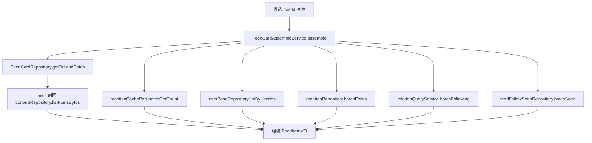

- 详细文本描述：
1. 这条链路的输入不是内容实体，而是一组候选 `postId`。
2. `FeedCardRepository` 会先查 Redis，再查本地 Caffeine L1。都没命中时，才用 `contentRepository.listPostsByIds` 回表重建。
3. 组装时，静态信息和动态信息是分开的。静态信息是文本、摘要、媒体、作者；动态信息是点赞数、是否点赞、是否关注、是否看过。
4. 点赞数来自 `reactionCachePort.batchGetCount`，我是否点赞来自 `reactionRepository.batchExists`，我是否关注来自 `RelationQueryService.batchFollowing`，我是否已看过来自 `feedFollowSeenRepository.batchSeen`。

- 实现方式为什么这么设计：
1. 把“索引读取”和“卡片装配”拆开，可以让首页、个人页、推荐页共享同一个装配尾巴。
2. 静态卡片适合缓存，动态计数和关系态适合现查，这样缓存命中率更高，也不容易过期失真。

- STAR 面试讲法：
1. S：Feed 真正难的不是拿到一串 `postId`，而是把它们变成用户要看的卡片，还不能查太多次库。
2. T：我要把装配做成复用能力，让所有 Feed 类型都能共用。
3. A：我把基础卡片、动态计数、关系态拆开批量读取，再统一组装成 `FeedItemVO`。
4. R：这样页面字段统一了，缓存也更容易做热点优化，后面加新 Feed 类型时几乎只用改候选召回，不用重写展示尾巴。

- 亮点/兜底/一致性/性能点：
1. `FeedCardRepository` 有 Redis + Caffeine 两级缓存，还有 `SingleFlight` 防击穿。
2. 热点卡片还会结合 `JdHotKeyStore` 续 Redis TTL，明显是按热点优化思路写的。
3. `seen` 这个字段所有流都能展示，但“首页已读去重”只有 FOLLOW 首页第一页真的会用来过滤候选。

- **上游**
1. 上游是各条召回链路给出的一批 `postId`，包括 FOLLOW、PROFILE、RECOMMEND、POPULAR、NEIGHBORS。
2. 这些上游只决定“给哪些 `postId`”，不负责把展示字段拼完整。

- **下游**
1. 下游是统一的 `FeedItemVO` 返回结果，直接给控制器响应。
2. 组装过程中如果缓存 miss，会反向把静态卡片回填到缓存，供后续请求复用。

- **相关技术栈、职责与原理**
1. `Redis String`：负责缓存 `feed:card:{postId}` 的静态卡片。它适合这里，因为单条卡片是一个完整对象，String 最直白。
2. `Caffeine`：负责本地 L1 热点缓存。它适合这里，因为卡片是高频热点读，本地内存命中比每次都打 Redis 更快。
3. `MySQL`：负责在缓存 miss 时通过 `listPostsByIds` 回表重建基础卡片。它适合这里，因为内容真相和作者静态信息都在库里。
4. `SingleFlight`：负责合并同一时刻的重复 miss。它适合这里，因为热点帖子最容易击穿，合并加载比加很多 if 更干净。

## 17. 链路 15：负反馈链路（当前代码现状）

- 链路名称：负反馈链路（当前代码现状）
- 入口/核心类：`IFeedApi`、`FeedController`、`IFeedService`
- 要解决的问题：用户想表达“这条我不想看”“这个类型我不感兴趣”。

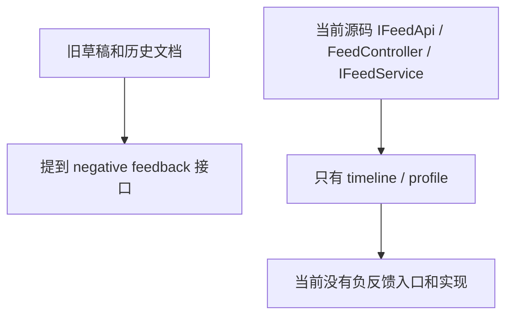

- 详细文本描述：
1. 我用源码追了一遍当前主线：`IFeedApi` 只有 `timeline`、`profile` 两个方法。
2. 当前 `FeedController` 也只有这两个 HTTP 入口，没有 `feedback/negative`。
3. 当前 `IFeedService` 只有 `timeline` 和 `profile`，也没有 `negativeFeedback` 或 `cancelNegativeFeedback`。
4. 在 `nexus-domain`、`nexus-trigger`、`nexus-infrastructure` 里搜索 `negativeFeedback`，命中的都是旧文档，不是运行代码。

- 实现方式为什么这么设计：
1. 这里不能脑补。当前代码就是没有这条链路。
2. 面试时最稳的答法不是硬凑，而是明确说“历史草稿有设计，当前源码主线已经没有入口，所以我不会把它当成已实现能力”。

- STAR 面试讲法：
1. S：面试官经常会拿设计稿和源码对照，故意看你会不会把草稿当事实。
2. T：我需要对系统边界保持诚实，不把不存在的链路说成已上线。
3. A：我先以源码为准，再把旧草稿中提到但源码不存在的功能单独标成“当前代码现状”。
4. R：这样回答既严谨，也能顺带体现我做系统分析时重事实、轻想象。

- 亮点/兜底/一致性/性能点：
1. 这条链路最大的亮点就是“事实纪律”。不把设计图当现网。
2. 如果面试官继续追问，你可以顺手补一句：当前推荐链路已经有 `unlike` 反馈，但 Feed 自己没有“屏蔽这条/屏蔽类型”的本地过滤闭环。

- **上游**
1. 上游只有“历史草稿里提过负反馈”这个背景，以及用户真实的“不想看 / 不感兴趣”需求。
2. 但从当前源码入口看，这条链路没有 HTTP 入口、没有 service 方法、也没有本地过滤仓储。

- **下游**
1. 当前 Feed 领域没有本地下游，所以不会出现“点了不想看后立刻从首页过滤掉”这种效果。
2. 目前最接近的相关能力是推荐链路里的 `unlike` 反馈，它只会影响推荐系统侧偏好，不等于 Feed 本地闭环。

- **相关技术栈、职责与原理**
1. `当前不存在本地 Redis SET / 名单过滤`：如果真要做“不想看”或“屏蔽类型”，通常会需要一个本地过滤集合来在读链路 O(1) 判断；但当前源码没有这层。
2. `当前不存在本地 Outbox / MQ 负反馈传播`：如果真要让多个 Feed 读链路都生效，通常要有事件传播；但当前源码没有这条已实现链路。
3. `现有的推荐反馈 unlike`：它负责告诉推荐系统“少推类似内容”。它适合做模型侧偏好学习，但原理上不等于 Feed 侧马上把这条内容硬过滤掉。

## 18. 面试官最感兴趣的亮点汇总

1. 发布链路不是裸发 MQ，而是“事务内写 Outbox，事务后 tryPublishPending，再由重试任务兜底”。这是大厂面试里很吃香的点。
2. FOLLOW、RECOMMEND、POPULAR、NEIGHBORS 四条读链路不是一个方法里硬塞四个 if，而是四种不同数据语义：关注索引、个性化推荐、热门推荐、相似推荐。
3. 大 V 和普通用户走两套分发模型。普通用户写扩散，大 V 读扩散，这个设计能很好体现“按规模分治”。
4. 取关即时生效没有靠高成本删 Redis，而是靠读侧“只认当前关注关系”，这很有工程味。
5. 推荐流 cursor 不是简单页码，而是 `sessionId + scanIndex`，它解决的是“重试稳定性”问题，不只是翻页问题。
6. 系统里有很多“名字看起来像缓存，但当前实现其实是 DB 门面”的地方，比如 `RelationAdjacencyCachePort`。面试时能把这种现实讲明白，说明你读代码不是只看类名。
7. 卡片装配把“基础信息缓存”和“动态状态现查”拆开，是典型的高频读接口做法。

## 19. 当前边界与可追问风险

1. 个人主页当前查 `status in (1,2)`，也就是“审核中 + 已发布”。如果这个接口对外完全开放，这就是明显的可追问风险。
2. FOLLOW 读链路会做拉黑和当前关注关系过滤，但 RECOMMEND、POPULAR、NEIGHBORS 当前没有这层过滤逻辑，是否接受要看产品定义。
3. 删除后的索引清理主要靠读时懒修复，不是全量回收。好处是便宜，坏处是脏索引可能会留一阵子。
4. 大 V 铁粉推只有配置，没有实现；不要把草稿里的能力说成现有事实。
5. Feed 负反馈链路当前不存在；推荐负反馈只看得到 `unlike` 这类推荐系统反馈，不等于 Feed 本地“屏蔽内容”已经闭环。
6. 关系事件收件箱有去重，但自动重放只扫 `FAILED`，而 listener 失败时更偏向走 MQ 死信；这条恢复路径值得继续补强。
7. `ContentDispatchPort` 这种直接发 MQ 的端口还在代码里，但内容主链已经升级成 `ContentEventOutboxPort`，答题时要分清“遗留实现”和“现行主链”。

## 20. 结论

如果要把这个领域讲成一段大厂面试复盘，可以直接这样收尾：

1. 这套 Feed 不是“一个时间线接口”，而是一组读写模型。普通作者走写扩散，大 V 走读扩散，推荐流再走独立召回。
2. 真相源在 MySQL，Feed/推荐/关系这些副作用靠 Outbox、Inbox、幂等记录和重试任务做最终一致。
3. 真正体现工程取舍的，不是代码里有多少类，而是哪里选择了“提前写”，哪里选择了“读时补”，哪里选择了“先别做强一致”。
