# 05-互动与通知中心领域分析

## 1. 领域定位

这个领域解决的不是“点个赞这么简单”的问题，而是下面四件事一起成立：

1. 用户的互动动作要先被系统记住。
2. 列表页、热榜、点赞态、点赞人列表要能查得快。
3. 被互动的人要收到站内通知，而且不能被重复刷爆。
4. 高并发链路不能把 MySQL 直接打穿，所以要把“事实表”“派生计数”“通知聚合”拆开。

按真实代码看，这个领域的核心数据有 6 组：

- `interaction_reaction`：谁给谁点过赞，是真相表。
- `interaction_reaction_count`：某个目标当前有多少赞，是派生计数表。
- `interaction_comment`：评论元数据，支持两级盖楼。
- `interaction_comment_pin`：一帖一条置顶评论。
- `interaction_notification`：站内通知聚合收件箱，不是逐条消息明细。
- `interaction_notify_inbox` / `interaction_comment_inbox`：MQ 收件箱，专门做幂等去重。

这套代码有 4 个必须先讲清的真实结论：

1. 帖子点赞和评论点赞不是一套实现。
   帖子点赞走“缓存快写 + MQ 异步落库”，评论点赞走“DB 真相 + Redis 加速读”。
2. 评论写侧和评论读侧是分开的。
   `InteractionService` 负责写，`CommentQueryService` 负责读。
3. 通知是聚合模型，不是每次互动都插一条通知明细。
   同一个用户、同一种业务、同一个目标，会聚合到一条通知上，用 `unread_count` 累加。
4. 打赏、投票、钱包接口虽然挂在这个域，但现在还是占位能力，不能包装成“支付域已经做完”。

身份来源也要说明白：

- 写接口大多通过 `UserContext.requireUserId()` 取当前用户。
- `UserContextInterceptor` 会优先读 Sa-Token 登录态，否则兼容 `userId` 或 `X-User-Id` 请求头。

---

## 2. 业务链路总表

| 链路 | 入口接口 | 核心类/表 | 当前代码现状 |
| --- | --- | --- | --- |
| 1. 帖子点赞 / 取消点赞 | `POST /api/v1/interact/reaction` | `InteractionService`、`ReactionLikeService.applyPostLike`、`PostLikeCachePort`、`interaction_reaction`、`interaction_reaction_count` | 主链路完整，走缓存快写 + MQ 三段式异步落库 |
| 2. 评论点赞 / 取消点赞 | `POST /api/v1/interact/reaction` | `InteractionService`、`ReactionLikeService.applyCommentLike`、`ReactionRepository`、`CommentLikeChangedConsumer` | 主链路完整，走 DB 真相 + Redis 回填 |
| 3. 点赞状态查询 | `GET /api/v1/interact/reaction/state` | `ReactionLikeService.queryState`、`PostLikeCachePort`、`ReactionCachePort` | 主链路完整，帖子和评论查法不同 |
| 4. 点赞人列表 | `GET /api/v1/interact/reaction/likers` | `ReactionLikeService.queryLikers`、`ReactionRepository.pageUserEdgesByTarget` | 当前只支持评论点赞人列表，不支持帖子点赞人列表 |
| 5. 评论创建 / 回复 | `POST /api/v1/interact/comment` | `InteractionService.comment`、`CommentRepository`、`CommentCreatedConsumer`、`RootReplyCountChangedConsumer` | 主链路完整，含风控、通知、热榜初始化、回复计数 |
| 6. 一级评论列表 | `GET /api/v1/comment/list` | `CommentController`、`CommentQueryService.listRootComments`、`CommentRepository` | 主链路完整，支持 pinned、游标、回复预加载 |
| 7. 楼内回复列表 | `GET /api/v1/comment/reply/list` | `CommentQueryService.listReplies`、`CommentRepository.pageReplyCommentIds` | 主链路完整，只支持两级楼中楼 |
| 8. 评论热榜 | `GET /api/v1/comment/hot` | `CommentQueryService.hotComments`、`CommentHotRankRepository`、`CommentHotRankRebuildService` | 主链路完整，附带手动重建兜底 |
| 9. 评论删除 | `DELETE /api/v1/comment/{commentId}` | `InteractionService.deleteComment`、`CommentRepository`、`CommentSoftDeleteCleanupJob` | 主链路完整，先软删，后定时物理清理 |
| 10. 评论置顶 | `POST /api/v1/interact/comment/pin` | `InteractionService.pinComment`、`CommentPinRepository` | 主链路完整，但没有单独“取消置顶”接口 |
| 11. 通知生成与聚合入库 | MQ 旁路 | `InteractionNotifyEventPort`、`InteractionNotifyConsumer`、`interaction_notification` | 主链路完整，统一吃点赞 / 评论 / @ 提及 |
| 12. 通知列表 | `GET /api/v1/notification/list` | `InteractionService.notifications`、`InteractionNotificationRepository` | 主链路完整，只返回未读通知，固定每页 20 条 |
| 13. 单条通知已读 | `POST /api/v1/notification/read` | `InteractionService.readNotification`、`InteractionNotificationRepository.markRead` | 主链路完整，但“单条已读”清的是整条聚合桶 |
| 14. 全部通知已读 | `POST /api/v1/notification/read/all` | `InteractionService.readAllNotifications`、`InteractionNotificationRepository.markReadAll` | 主链路完整 |
| 15. 打赏 / 投票 / 钱包 | `/wallet/tip`、`/interaction/poll/create`、`/interaction/poll/vote`、`/wallet/balance` | `InteractionService.tip/createPoll/vote/balance` | 明确是占位实现，没有业务闭环 |

---

## 3. 链路逐条展开

### 链路 1：帖子点赞 / 取消点赞

- 链路名称：帖子点赞 / 取消点赞
- 入口 / 核心类：
  `InteractionController.react`
  `InteractionService.react`
  `ReactionLikeService.applyPostLike`
  `PostLikeCachePort`
  `LikeUnlikeEventPort`
  `LikeUnlikePersistConsumer`
  `PostLikeCountAggregateConsumer`
  `PostLikeCount2DbConsumer`
- 要解决的问题：
  帖子点赞是高频动作，既要让用户点下去马上有反馈，又不能每次都同步写 MySQL，还要顺带把“帖子被赞数”和“作者收到的赞数”一起算出来。

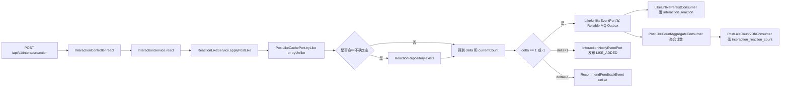

- 详细文本描述：
  1. 入口统一走 `POST /api/v1/interact/reaction`，请求体里有 `targetId / targetType / type / action / requestId`。这里的 `requestId` 只用于日志串联，不参与幂等。
  2. `InteractionService.react` 先做目标解析，确认这是 `POST + LIKE` 还是 `COMMENT + LIKE`，然后把帖子点赞分给 `ReactionLikeService.applyPostLike`。
  3. `applyPostLike` 会先通过 `IPostAuthorPort` 查帖子作者，再进入 `PostLikeCachePort`。这一步不是直接写数据库，而是先打 Redis。
  4. Redis 侧用了 4 类状态：
     `Bloom` 判断“这个用户大概率点过没”；
     `ZSet` 保存“用户最近点过的帖子”；
     `pendingLike/pendingUnlike` 保存短时间待落库状态；
     `interact:reaction:cnt:{POST:postId:LIKE}` 保存帖子近实时点赞数。
  5. 如果 Bloom 告诉系统“可能点过”，`PostLikeCachePort` 会返回 `NEED_DB_CHECK`，这时服务层会回表查 `interaction_reaction`，再决定是否 `forceLike/forceUnlike`，避免 Bloom 误判把业务做错。
  6. 一旦产生真实变化：
     `delta=1` 表示真的新增点赞，会发 `LikeUnlikePostEvent(type=1)`，同时发站内通知事件 `LIKE_ADDED`；
     `delta=-1` 表示真的取消点赞，会发 `LikeUnlikePostEvent(type=0)`，同时给推荐域发 `unlike` 反馈。
  7. MQ 后面拆了 3 段：
     ConsumerGroup A `LikeUnlikePersistConsumer` 只负责把用户-帖子点赞关系批量落到 `interaction_reaction`；
     ConsumerGroup B `PostLikeCountAggregateConsumer` 只负责聚合帖子和作者两个计数；
     ConsumerGroup C `PostLikeCount2DbConsumer` 只负责把聚合结果落到 `interaction_reaction_count`。
  8. 计数聚合当前默认走 `snapshot` 模式，也就是消费端从 Redis 直接读当前 count，再覆盖写 DB。代码里也保留了 `delta` 模式，但默认值不是它。

- `**上游**`
  1. 上游入口是 `InteractionController.react -> InteractionService.react`，它先把统一点赞请求按 `POST + LIKE` 和 `COMMENT + LIKE` 分流，帖子点赞才会进入这条链。
  2. `UserContext` 提供当前操作者，`IPostAuthorPort` 提供帖子作者，这两个前置事实决定了缓存写入、作者获赞计数和后续通知要发给谁。
  3. `PostLikeCachePort` 前面已经接住了“用户刚点下去”的实时动作，所以这里的上游重点不是先写库，而是先把热点写压力收进 Redis。

- `**下游**`
  1. `LikeUnlikePersistConsumer` 会把最终点赞真相批量落到 `interaction_reaction`，给后续回表校验和统计留持久依据。
  2. `PostLikeCountAggregateConsumer` 和 `PostLikeCount2DbConsumer` 会把帖子点赞数、作者获赞数继续推进到 `interaction_reaction_count`。
  3. `InteractionNotifyEventPort` 会把新增点赞送进通知链，`RecommendFeedbackEvent` 会把取消点赞送给推荐域，说明这条链不只是改一个数字。

- `**相关技术栈、职责与原理**`
  1. `Spring MVC`：负责把 `POST /api/v1/interact/reaction` 暴露成统一 HTTP 入口；适合这里，因为帖子点赞和评论点赞虽然实现不同，但入口收敛后分流规则更集中。
  2. `Redis`：负责 Bloom、最近点赞 ZSet、`pendingLike/pendingUnlike` 和近实时点赞数；适合这里，因为帖子点赞是高频写，先写内存结构比每次直打 MySQL 更能抗热点。
  3. `RabbitMQ`：负责把点赞事实落库、计数聚合、通知旁路拆成异步阶段；适合这里，因为一个点赞后面跟着多条派生动作，不该全部卡在用户请求里。
  4. `MyBatis + MySQL`：负责把 `interaction_reaction` 真相表和 `interaction_reaction_count` 派生表最终持久化；适合这里，因为关系真相和聚合计数最后都需要可追溯、可对账的落点。
  5. `异步落库`：负责把“先给用户反馈”和“稍后把数据库对齐”拆开；适合这里，因为这条链的核心矛盾是写吞吐，不是每次都要强一致同步写库。

- 实现方式为什么这么设计：
  1. 帖子点赞量最大，所以必须“先快后稳”。用户看到的是 Redis 的近实时结果，DB 走最终一致。
  2. 把“关系落库”和“计数落库”拆成不同消费者，是为了让事实表和派生表互不拖累。关系表追求真相，计数表追求快和便宜。
  3. 作者收到的赞数也复用了同一套 reaction count，说明这套模型不是只服务一个接口，而是给主页、通知、统计都预留了统一计数来源。

- STAR 面试讲法：
  - S：帖子点赞是全站高频动作，如果每次都打 MySQL，热点帖子一定先把数据库打抖。
  - T：我要让点赞接口快返回，同时保住关系真相、聚合计数、作者获赞数和通知旁路。
  - A：我把主链路改成 Redis 快写，只有不确定态才回表；再把 MQ 消费拆成“关系落库”“计数聚合”“计数落库”三段，发送侧统一走 Outbox。
  - R：用户侧先拿到近实时结果，数据库最终对齐，热点路径不再被同步写库拖慢，后续推荐反馈和通知也能顺带吃到同一份事件。

- 亮点 / 兜底 / 一致性 / 性能点：
  - 亮点：`LikeUnlikePersistConsumer` 先按 `(userId, postId)` 做 last-write-wins 聚合，再批量落库，能吃掉短时间内重复点赞/取消点赞抖动。
  - 亮点：计数不仅有帖子维度，还有 `USER + LIKE` 维度，作者获赞数是同链路顺带产物。
  - 兜底：Bloom 误判不直接相信，先回表 `reactionRepository.exists` 再 force 写缓存。
  - 一致性：发送端不是裸发 RabbitMQ，而是统一写 `ReliableMqOutboxService`，避免事务提交成功但消息没发出去。
  - 性能点：MQ 批消费配置是 `prefetch=1000 / batch-size=1000`，并配了 rate limit，说明这条链路就是按高吞吐设计的。

---

### 链路 2：评论点赞 / 取消点赞

- 链路名称：评论点赞 / 取消点赞
- 入口 / 核心类：
  `InteractionController.react`
  `InteractionService.parseTarget`
  `ReactionLikeService.applyCommentLike`
  `ReactionRepository`
  `CommentLikeChangedConsumer`
  `CommentHotRankRepository`
- 要解决的问题：
  评论点赞量通常小于帖子点赞，但它需要马上支持“点赞状态”“点赞人列表”“评论热榜”，所以更适合直接以数据库为真相，再用 Redis 做加速。

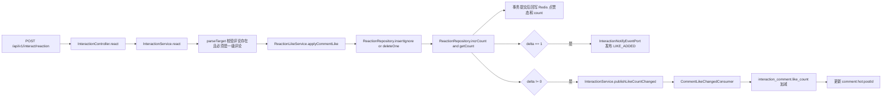

- 详细文本描述：
  1. 评论点赞和帖子点赞共用一个入口，但 `InteractionService.parseTarget` 会先卡死业务边界：
     评论必须存在；
     评论状态必须是正常；
     `rootId != null` 的楼内回复不允许点赞。
  2. `ReactionLikeService.applyCommentLike` 走的不是 Redis 快写，而是直接写 `interaction_reaction`：
     点赞用 `insertIgnore`；
     取消点赞用 `deleteOne`；
     真正有变化才对 `interaction_reaction_count` 做 `incrCount`。
  3. 当前 count 直接从 DB `interaction_reaction_count` 取，再在事务提交后把 Redis 位图和 count 回填。
  4. 如果 `delta=1`，会发站内通知 `LIKE_ADDED`，这样评论作者就能看到“评论获赞”。
  5. `InteractionService.react` 在拿到结果后，如果发现目标是评论且 `delta != 0`，会再发一个 `CommentLikeChangedEvent`。
  6. `CommentLikeChangedConsumer` 先写 `interaction_comment_inbox(event_id)` 做幂等，去重成功后才会：
     给 `interaction_comment.like_count` 加减；
     回查根评论；
     按 `like_count * 10 + reply_count * 20` 刷新热榜分数。

- `**上游**`
  1. 上游入口同样来自 `InteractionController.react`，但先经过 `InteractionService.parseTarget` 做业务裁剪，只让“正常的一级评论点赞”进入这条链。
  2. 评论本身的存在性、状态和楼层关系是这条链的前置条件，所以它天然依赖评论元数据已经先落在 `interaction_comment`。
  3. 这条链还吃到统一点赞入口带来的请求参数和当前用户身份，但不会复用帖子点赞那套 Redis 快写分支。

- `**下游**`
  1. `interaction_reaction` 和 `interaction_reaction_count` 会被同步改成最新真相，这是点赞状态、点赞人列表的直接数据源。
  2. `InteractionNotifyEventPort` 会在 `delta=1` 时补发 `LIKE_ADDED`，把“评论获赞”送进通知中心。
  3. `CommentLikeChangedConsumer` 会继续把结果推给 `interaction_comment.like_count` 和评论热榜 ZSet，让读侧不用临时现算热度。

- `**相关技术栈、职责与原理**`
  1. `Spring MVC`：负责承接统一点赞接口，再由服务层分流到评论点赞实现；适合这里，因为入口可以统一，真正复杂度留给服务层按目标类型处理。
  2. `MyBatis + MySQL`：负责直接写 `interaction_reaction` 和 `interaction_reaction_count`；适合这里，因为评论点赞需要稳定支撑点赞人列表，事实表分页天然比缓存集合更可靠。
  3. `Redis`：负责在事务提交后回填点赞位图和 count；适合这里，因为评论点赞量没帖子那么夸张，缓存更像读加速层，不需要承担主真相。
  4. `RabbitMQ`：负责把 `CommentLikeChangedEvent` 异步送到消费端；适合这里，因为 `like_count` 和热榜分数都是派生结果，不该塞进点赞主事务。
  5. `Inbox 去重`：负责用 `interaction_comment_inbox(event_id)` 抵抗 RabbitMQ 至少一次投递；适合这里，因为重复消费最容易把 `like_count` 和热榜分数加错。
  6. `评论热榜`：负责承接点赞变化后的派生排序结果；适合这里，因为热门评论是读优化数据，应该由异步事件慢慢刷新，不是主事务当场重排。

- 实现方式为什么这么设计：
  1. 评论点赞需要直接支撑“点赞人列表”，而列表天然更适合从事实表分页，所以评论点赞直接落真相表更简单。
  2. 评论点赞量没有帖子点赞那么夸张，没必要为了统一而把所有目标都塞进同一套复杂缓存快写流程。
  3. 热榜是评论域的派生数据，不应该在点赞主事务里同步更新，所以用了独立事件异步回写。

- STAR 面试讲法：
  - S：评论点赞要同时服务点赞态、点赞人列表和热榜，如果全走帖子那套超高并发缓存方案，会把简单问题做复杂。
  - T：我要保证评论点赞结果准确、列表稳定，还不能把热榜更新塞进主事务。
  - A：我把评论点赞改成 DB 真相表直接写，主事务只返回结果；提交后再刷新 Redis，并通过 `CommentLikeChangedEvent` 异步回写 `interaction_comment.like_count` 和热榜。
  - R：链路更短，行为更稳定，点赞人列表天然有了可靠数据源，热榜也能最终一致刷新。

- 亮点 / 兜底 / 一致性 / 性能点：
  - 亮点：评论点赞和帖子点赞分开建模，不为了“看起来统一”牺牲可读性。
  - 亮点：`afterCommit` 再刷 Redis，避免事务回滚后缓存比数据库更“超前”。
  - 兜底：`insertIgnore/deleteOne` 天然幂等，重复点赞不会把 count 越加越大。
  - 一致性：`CommentLikeChangedConsumer` 先写 `interaction_comment_inbox`，RabbitMQ 至少一次投递也不会重复加 count。
  - 当前代码现状：`ReactionCachePort.applyAtomic`、`ReactionSyncConsumer`、`ReactionSyncZsetWorker` 这套“延迟落库”代码仍然保留，但当前评论点赞主链路已经不再走它，它现在更像兼容遗留实现的保留件。

---

### 链路 3：点赞状态查询

- 链路名称：点赞状态查询
- 入口 / 核心类：
  `InteractionController.reactionState`
  `InteractionService.reactionState`
  `ReactionLikeService.queryState`
  `PostLikeCachePort`
  `ReactionCachePort`
- 要解决的问题：
  用户刷新页面时，要尽快知道“我有没有点过赞”和“当前一共有多少赞”，但帖子和评论的查法不能一刀切。

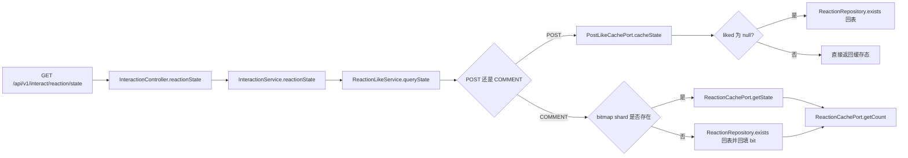

- 详细文本描述：
  1. 入口是 `GET /api/v1/interact/reaction/state`，用户身份必须从 `UserContext.requireUserId()` 取。
  2. 帖子点赞状态查询先走 `PostLikeCachePort.cacheState`。这里会依次看：
     有没有 `pendingUnlike`；
     有没有 `pendingLike`；
     最近点赞 ZSet 里有没有这个帖子。
  3. 如果缓存能明确告诉系统“已点赞”或“未点赞”，就直接返回；如果只能返回 `liked = null`，说明缓存没有足够信息，这时才回表 `reactionRepository.exists`。
  4. 评论点赞状态查询更简单：先看对应位图分片 key 在不在。
     如果分片在，直接 `GETBIT`；
     如果分片不在，说明是冷读，这时回表 `reactionRepository.exists`，查到为真再回填 bit。
  5. 评论 count 则统一走 `ReactionCachePort.getCount`。它会先看 JD HotKey 是否判定为热点，热点才用 Caffeine L1，非热点直接回 Redis。
  6. 如果评论 count 的 Redis key 丢了或写坏了，`ReactionCachePort.redisGetCntOrRebuild` 会回 `interaction_reaction_count` 重建。

- `**上游**`
  1. 上游是页面刷新或重新打开时发起的 `GET /api/v1/interact/reaction/state`，调用方已经明确给出 `targetId`、`targetType` 和当前用户。
  2. 这条链前面依赖的是点赞写链已经把真相或缓存状态更新出去，否则查询侧就没有可读数据。
  3. 对帖子来说，上游更依赖 Redis 里的 pending 和最近点赞集合；对评论来说，上游更依赖事实表和位图分片是否已经建立。

- `**下游**`
  1. 下游直接是页面渲染结果，前端会用它决定按钮是否高亮、计数显示多少。
  2. 冷读回表后会顺手回填 bit 或 count 缓存，等于给后续同类查询做预热。
  3. 这条链自己不改业务事实，但它会把帖子异步落库、评论同步落库后的状态统一暴露给读侧。

- `**相关技术栈、职责与原理**`
  1. `Spring MVC`：负责提供统一的状态查询接口；适合这里，因为点赞态是页面级高频读，单独拉平一个 GET 接口最直接。
  2. `Redis`：负责帖子点赞态的 pending/最近点赞判断、评论点赞位图和计数缓存；适合这里，因为查询比写更频繁，用缓存能把绝大多数读挡在内存层。
  3. `MyBatis + MySQL`：负责在缓存缺失或不确定时回表查 `interaction_reaction`、`interaction_reaction_count`；适合这里，因为最终真值仍然要以持久层为准。
  4. `冷热分层读取`：负责把“热点直接读缓存”和“冷数据允许回表”分开；适合这里，因为帖子和评论来源不同，强行统一只会把简单查询做复杂。

- 实现方式为什么这么设计：
  1. 帖子点赞状态的瓶颈在写流量，所以读状态更偏缓存优先。
  2. 评论点赞状态的瓶颈在准确性和列表联动，所以读状态接受少量冷启动回表。
  3. `bitmapShardExists` 这个判断很关键，它避免了“分片 key 不存在时直接 GETBIT 返回 false”带来的假阴性。

- STAR 面试讲法：
  - S：点赞态查询是页面每次打开都会打的接口，如果全回表，会把 DB 浪费在大量本来可以走缓存的读上。
  - T：我要让帖子和评论都查得快，但不能因为缓存为空就把真值查错。
  - A：我让帖子状态先看 pending 和最近点赞缓存，评论状态先看位图分片是否存在，不存在才回表，并把真值回填到缓存。
  - R：热点读走缓存，冷读也不会错，接口响应快且稳定。

- 亮点 / 兜底 / 一致性 / 性能点：
  - 亮点：帖子和评论不是一套状态查询逻辑，说明实现是按真实数据来源倒推的，不是强行统一。
  - 兜底：评论 count 丢了会从 `interaction_reaction_count` 自动重建，不会因为 Redis 脏数据直接把页面打挂。
  - 一致性：评论态冷读回表后会顺手回填 bit，后续读就越来越快。
  - 性能点：只有 HotKey 才进 Caffeine L1，避免把本地缓存浪费在冷 key 上。

---

### 链路 4：点赞人列表

- 链路名称：点赞人列表
- 入口 / 核心类：
  `InteractionController.reactionLikers`
  `InteractionService.reactionLikers`
  `ReactionLikeService.queryLikers`
  `ReactionRepository.pageUserEdgesByTarget`
  `IUserBaseRepository`
- 要解决的问题：
  页面要展示“谁点过这个评论的赞”，而且要能做稳定分页，不能一翻页就重复或漏人。

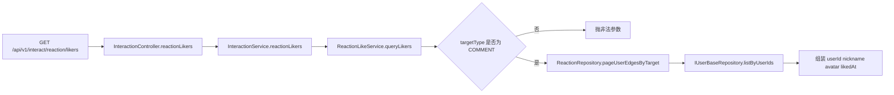

- 详细文本描述：
  1. 入口是 `GET /api/v1/interact/reaction/likers`。
  2. `ReactionLikeService.queryLikers` 先强校验：当前只支持 `COMMENT`，如果传 `POST` 直接报错。
  3. 数据来源是 `interaction_reaction` 事实表，不走 Redis 集合。查询 SQL 按 `update_time DESC, user_id DESC` 排序，游标格式是 `likedAt:userId`。
  4. 拿到点赞边后，服务不会一条条去查用户，而是把 `userId` 去重后一次性调 `IUserBaseRepository.listByUserIds`，再回填 `nickname / avatarUrl`。

- `**上游**`
  1. 上游入口是 `GET /api/v1/interact/reaction/likers`，并且服务层先把业务边界卡成“只支持评论点赞人列表”。
  2. 这条链依赖评论点赞真相已经落在 `interaction_reaction`，否则就没有稳定的明细分页基础。
  3. 用户基础信息仓储也是它的上游之一，因为点赞边本身只有 `userId`，昵称和头像要靠后置补全。

- `**下游**`
  1. 下游是前端的点赞人弹层或列表页，拿到 `nickname / avatarUrl / likedAt` 后可以直接渲染。
  2. 这条链不会反向改点赞事实，它只是把 `interaction_reaction` 里的明细结果稳定翻页给读侧。
  3. 因为结果来自事实表，下游的分页稳定性不会受 Redis 热点策略波动影响。

- `**相关技术栈、职责与原理**`
  1. `Spring MVC`：负责提供 `GET /api/v1/interact/reaction/likers` 查询入口；适合这里，因为点赞人列表是标准读接口，不需要额外消息链。
  2. `MyBatis + MySQL`：负责按 `update_time DESC, user_id DESC` 从 `interaction_reaction` 做游标分页；适合这里，因为点赞人列表本质是事实明细列表，直接查真相表最稳。
  3. `批量资料补全`：负责把一批 `userId` 一次性换成昵称和头像；适合这里，因为列表接口最怕 N+1 查询，批量回填更省成本。
  4. `不走 Redis 明细集合`：负责保证列表语义稳定；适合这里，因为缓存更适合状态和计数，不适合承担“谁按什么顺序点过赞”的可靠分页。

- 实现方式为什么这么设计：
  1. 点赞人列表本质是事实明细列表，最稳的来源就是事实表。
  2. 评论点赞已经直接落 DB，所以这条链天然就很适合直接走分页 SQL。
  3. 用户资料批量补全，能避免典型的 N+1 查询问题。

- STAR 面试讲法：
  - S：点赞人列表是典型明细查询，不适合拿聚合 count 或临时缓存去“猜”。
  - T：我要给前端一个稳定、可翻页的点赞人列表，还要把用户头像昵称一起带回去。
  - A：我直接从 `interaction_reaction` 做游标分页，再批量查用户基础信息，一次性组装返回。
  - R：分页稳定、查询简单、不会被缓存不一致拖累。

- 亮点 / 兜底 / 一致性 / 性能点：
  - 亮点：游标不是只用时间，而是 `时间 + userId` 双字段，避免同一毫秒多条数据时分页漂移。
  - 亮点：用户信息批量查，避免 N+1。
  - 当前代码现状：帖子点赞人列表没有开放，原因很直接，当前帖子点赞主链是高频写优化优先，没有把 likers 明细接口做成一等公民。
  - 一致性：因为直接读真相表，所以结果不会受到 Redis 热点策略影响。

---

### 链路 5：评论创建 / 回复

- 链路名称：评论创建 / 回复
- 入口 / 核心类：
  `InteractionController.comment`
  `InteractionService.comment`
  `CommentRepository.insert`
  `IRiskService`
  `CommentCreatedConsumer`
  `RootReplyCountChangedConsumer`
  `InteractionNotifyConsumer`
- 要解决的问题：
  用户发评论时，不只是插一行数据，还要同时处理：楼层归属、风控审核、正文存储、通知、回复数、热榜初始化、@ 提及。

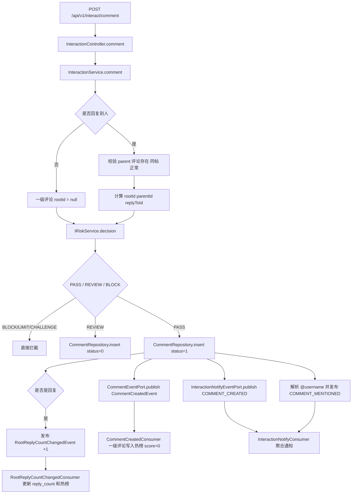

- 详细文本描述：
  1. 评论写入口是 `POST /api/v1/interact/comment`，用户身份必须从 `UserContext.requireUserId()` 取。
  2. 如果 `parentId` 为空，就是一级评论；如果不为空，就必须先查父评论，确认：
     父评论存在；
     `postId` 一致，没有串楼；
     父评论状态是正常。
  3. 回复时的楼层模型是：
     `rootId = parent.rootId == null ? parent.commentId : parent.rootId`
     `parentIdToSave = parent.commentId`
     `replyToId = parent.commentId`
     这说明当前只做两级盖楼，不继续往第三层套娃。
  4. 真正写库前会先走 `IRiskService.decision` 做评论风控。
     如果结果是 `BLOCK / LIMIT / CHALLENGE`，直接拦截；
     如果结果是 `REVIEW`，评论以 `status=0` 入库，接口返回 `PENDING_REVIEW`；
     如果结果是 `PASS`，评论以 `status=1` 入库并继续发布后续事件。
  5. `CommentRepository.insert` 并不是把正文直接塞进 `interaction_comment`，而是先生成 `contentId(UUID)`，再按 `postId + yearMonth + contentId` 写到评论 KV，最后只把元数据写进 `interaction_comment`。
  6. 正常评论入库后会触发 4 类旁路：
     `CommentCreatedEvent`：一级评论热榜初始化用；
     `COMMENT_CREATED` 通知：发给帖子作者或被回复评论作者；
     `COMMENT_MENTIONED` 通知：从正文里解析 `@username` 后按收件人逐条发；
     `RootReplyCountChangedEvent(+1)`：只有回复评论才会发，用来更新一级评论 `reply_count`。
  7. `CommentCreatedConsumer` 只处理一级评论，把它以 `score=0` 放入热榜 ZSet。
  8. `RootReplyCountChangedConsumer` 先写 `interaction_comment_inbox` 去重，再更新 `interaction_comment.reply_count`，最后按新值刷新热榜分数。
  9. 如果评论因为风控先进入待审核，后续风险域可以调用 `InteractionService.applyCommentRiskReviewResult`。一旦审核通过，会补发和正常评论相同的创建、通知、回复计数事件，保证下游一致。

- `**上游**`
  1. 上游入口是 `POST /api/v1/interact/comment`，前面先有当前用户身份、帖子归属、父评论合法性这些前置校验。
  2. `IRiskService` 也是关键上游，因为它先决定评论是 `PASS`、`REVIEW` 还是 `BLOCK`，直接影响这条链是继续下发事件还是当场拦截。
  3. 回复评论时，上游还依赖父评论已经存在且同帖，这样才能正确算出 `rootId / parentId / replyToId`。

- `**下游**`
  1. 评论元数据会先落到 `interaction_comment`，正文则落到评论 KV，下游读接口再按 `contentId` 取正文。
  2. `CommentCreatedConsumer`、`RootReplyCountChangedConsumer` 会继续更新评论热榜和 `reply_count`。
  3. `InteractionNotifyConsumer` 会吃到 `COMMENT_CREATED`、`COMMENT_MENTIONED`，把帖子作者、被回复者、被提及者的通知聚合起来。
  4. 风控晚放行时还会补发同一套旁路事件，确保通知、热榜、回复计数这些下游最终一致。

- `**相关技术栈、职责与原理**`
  1. `Spring MVC`：负责承接评论创建 HTTP 入口；适合这里，因为评论提交需要统一吃登录态、参数和错误码。
  2. `MyBatis + MySQL`：负责落 `interaction_comment` 元数据；适合这里，因为楼层关系、状态、计数这些结构化字段要稳定持久化，后面列表和删除都要依赖它。
  3. `RabbitMQ`：负责把热榜初始化、回复计数、通知提及这些旁路拆出去；适合这里，因为评论主事务要尽量短，不该让一堆派生动作卡住用户发言。
  4. `Inbox 去重`：负责在 `interaction_comment_inbox` 里去重回复计数和热榜刷新事件；适合这里，因为 MQ 至少一次投递下，重复消费最容易把 `reply_count` 算坏。
  5. `聚合通知`：负责把评论、回复、@ 提及统一收敛到通知收件箱；适合这里，因为互动提醒的目标是“少噪音地提醒到人”，不是给每次动作都建明细。
  6. `评论热榜`：负责让一级评论在创建后先进入候选集合，后面再靠点赞数和回复数慢慢变热；适合这里，因为热度是派生结果，不该和评论入库绑死在一个事务里。

- 实现方式为什么这么设计：
  1. 写评论是主事务，通知、热榜、计数是派生事务，必须拆开，不然一个旁路失败就会拖垮主写链路。
  2. 正文放 KV、表里只存 `contentId`，是为了把最常查的评论元数据表做瘦，减少行宽和缓存成本。
  3. `@ 提及` 不相信客户端传 userId 列表，而是后端自己从正文解析 `@username`，这样权限和格式都掌握在服务端。

- STAR 面试讲法：
  - S：评论不是单表插入这么简单，它天然会连着风控、通知、热榜和楼层统计一起动。
  - T：我要让评论创建主链路尽量稳，同时不让这些旁路把事务拉长。
  - A：我把评论正文外置到 KV，元数据单独落表；主写事务只做必要校验和入库，后面的通知、热榜、回复计数都通过 Outbox + MQ 异步补齐。
  - R：评论创建返回快，楼层关系清晰，风控和通知也能闭环，而且审核通过后还能补发下游事件，不会漏数。

- 亮点 / 兜底 / 一致性 / 性能点：
  - 亮点：`rootId / parentId / replyToId` 三个字段把两级盖楼关系说得很清楚，代码里基本没有额外补丁分支。
  - 亮点：评论正文外置 KV，是很好的面试点，说明你考虑过热表行宽和缓存成本。
  - 兜底：`COMMENT_MENTIONED` 的提及用户来自 `userBaseRepository.listByUsernames`，解析不到就跳过，不会影响评论主链。
  - 一致性：风险审核通过后会补发事件，保证“晚放行”的评论也能补上通知和回复计数。
  - 当前代码现状：`CommentRequestDTO.commentId` 可以由业务方透传，但当前更像“外部指定主键”，不是完整的幂等协议，重复提交同一 `commentId` 依赖数据库主键报错而不是优雅幂等返回。

---

### 链路 6：一级评论列表

- 链路名称：一级评论列表
- 入口 / 核心类：
  `CommentController.list`
  `CommentQueryService.listRootComments`
  `CommentRepository.pageRootCommentIds`
  `CommentPinRepository`
- 要解决的问题：
  评论列表既要稳定分页，又要支持“置顶不参与分页”“回复预加载”“待审核只对本人可见”，还不能把读路径写得很重。

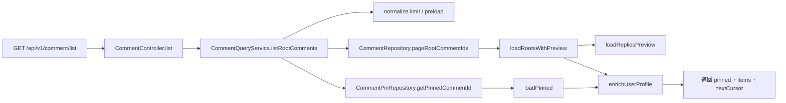

- 详细文本描述：
  1. 一级评论读入口是 `GET /api/v1/comment/list`，这里不是强制登录接口。`CommentController` 用的是 `UserContext.getUserId()`，所以匿名用户也能看列表。
  2. `CommentQueryService.listRootComments` 会先做参数归一化：
     `limit` 默认 20，最大 50；
     `preloadReplyLimit` 默认 3，最大 10。
  3. 置顶评论不跟分页混在一起。服务先查 `interaction_comment_pin`，单独加载 `pinned`，然后再查普通 `items`。
  4. `CommentRepository.pageRootCommentIds` 的 SQL 会明确排除 `pinnedId`，并且按 `create_time DESC, comment_id DESC` 游标分页。
  5. 如果当前有 `viewerId`，SQL 会额外放开“自己的待审核评论”：
     `status = 1 OR (status = 0 AND user_id = viewerId)`。
     这说明作者自己能看到待审核评论，但别人看不到。
  6. 每个一级评论还能预加载前 N 条楼内回复。回复预览按时间正序取，读出来后还会再做一遍 `visibleToViewer` 过滤，防止待审核回复被误暴露。
  7. 最后会批量补齐用户资料，不会一条评论查一次昵称头像。

- `**上游**`
  1. 上游入口是 `GET /api/v1/comment/list`，它会先带着 `postId`、游标和可选 `viewerId` 进入读链。
  2. 这条链依赖评论写链已经把一级评论、置顶配置、回复预览数据准备好，否则读侧只有空壳分页。
  3. `interaction_comment_pin` 和评论详情缓存也是它的前置数据源，因为列表最终要同时拼出 `pinned + items`。

- `**下游**`
  1. 下游直接是前端评论区首屏，拿到 `pinned + items + nextCursor` 后就能渲染主列表。
  2. 回复预览会继续把用户点进楼内回复列表的阅读路径接起来，相当于一级列表的下游延伸。
  3. 这条链还把“作者可见自己的待审核评论”这个规则稳定暴露给页面，避免前端自己猜。

- `**相关技术栈、职责与原理**`
  1. `Spring MVC`：负责暴露评论列表查询接口；适合这里，因为列表是标准读链，参数归一化和 viewer 透传放在 controller/service 最自然。
  2. `MyBatis + MySQL`：负责先按游标查一级评论 ID，再加载评论元数据；适合这里，因为分页排序规则需要数据库稳定执行，不能靠前端拼。
  3. `Redis`：负责评论详情缓存和正文 KV 读取；适合这里，因为热门帖子评论区会被反复刷，缓存能把重复读挡在 MySQL 前面。
  4. `置顶分离模型`：负责把 `pinned` 从普通 `items` 里拿出来；适合这里，因为这样能直接消掉“置顶参与分页”这个脏分支。

- 实现方式为什么这么设计：
  1. `pinned` 单独返回，是为了避免分页漂移。否则第一页有置顶、第二页没置顶，前端很容易重复或漏数据。
  2. 把“查 commentId 列表”和“加载评论详情”拆开，是为了让分页游标逻辑清楚，详情加载还能单独加缓存。
  3. 待审核只对作者可见，用 SQL 和服务层双保险处理，比只靠前端过滤可靠得多。

- STAR 面试讲法：
  - S：评论列表最容易出现的问题就是置顶和分页互相打架，再加上待审核评论可见性，很容易写成一堆 if/else。
  - T：我要把列表查得稳定，还要支持置顶、回复预览、作者看见自己的待审核评论。
  - A：我把置顶拆成 `pinned` 单独返回，普通列表只做游标分页；回复预览独立查询；评论详情统一走缓存层再批量补用户资料。
  - R：分页不漂，读路径清楚，前端拿到的数据结构也简单。

- 亮点 / 兜底 / 一致性 / 性能点：
  - 亮点：置顶评论不参与 `items` 和 `limit`，这是非常典型的大厂面试加分点。
  - 亮点：`CommentRepository` 做了 L1 Caffeine + L2 Redis + SingleFlight + 负缓存，读热点不会一直回表。
  - 亮点：评论正文从 KV 批量回填，不在主表里，说明表设计考虑了读热点和行宽。
  - 兜底：如果置顶评论已经删了、串帖了、不是一级评论了，`loadPinned` 会自动清理脏 pin。
  - 性能点：用户资料统一 `listByUserIds` 批量补齐，避免 N+1。

---

### 链路 7：楼内回复列表

- 链路名称：楼内回复列表
- 入口 / 核心类：
  `CommentController.replyList`
  `CommentQueryService.listReplies`
  `CommentRepository.pageReplyCommentIds`
- 要解决的问题：
  楼内回复要按“说话顺序”展示，也要支持游标翻页，还要保证待审核回复不会泄漏给别人。

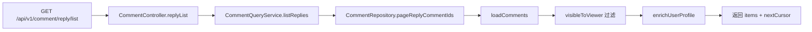

- 详细文本描述：
  1. 入口是 `GET /api/v1/comment/reply/list`，参数核心是 `rootId`。
  2. 这里的分页顺序不是倒序，而是 `create_time ASC, comment_id ASC`。也就是说，楼内回复列表是按从早到晚展示，游标条件用的是“比当前游标更大”。
  3. `limit` 默认 50，最大 100。
  4. 如果当前用户已登录，作者本人能看到自己的待审核回复；匿名和其他人只能看到正常回复。
  5. `CommentRepository.pageReplyCommentIds` 对匿名、小页、空游标的场景会复用“回复预览缓存”，但服务层仍然会再做一次 `visibleToViewer` 过滤。

- `**上游**`
  1. 上游入口是 `GET /api/v1/comment/reply/list`，调用方先给出 `rootId`，说明它通常是从一级评论列表继续往下钻。
  2. 这条链依赖一级评论和楼内回复已经按两级盖楼模型写好，否则就没有明确的 `rootId` 可查。
  3. 匿名或登录态 viewer 也是它的上游条件之一，因为待审核回复是否可见取决于当前看的人是谁。

- `**下游**`
  1. 下游是楼内回复面板，页面会按 `items + nextCursor` 继续向后翻页。
  2. `visibleToViewer` 过滤后的结果会直接影响作者和普通用户看到的回复内容差异。
  3. 这条链不改任何事实表，它只是把已有的回复关系按“对话顺序”稳定地读出来。

- `**相关技术栈、职责与原理**`
  1. `Spring MVC`：负责提供楼内回复查询入口；适合这里，因为回复列表本身就是一个独立读场景，和一级评论列表不是一套排序语义。
  2. `MyBatis + MySQL`：负责按 `create_time ASC, comment_id ASC` 游标读取楼内回复；适合这里，因为对话顺序必须稳定，数据库排序最可靠。
  3. `Redis`：负责在匿名、小页、空游标场景复用回复预览缓存；适合这里，因为热门楼层会被重复展开，缓存可以省掉重复查库。
  4. `服务层可见性过滤`：负责在缓存命中后再补一道 `visibleToViewer`；适合这里，因为缓存 key 不带 viewer 时，最后一道过滤能兜住审核态泄漏风险。

- 实现方式为什么这么设计：
  1. 楼内讨论天然应该按时间正序看，不然用户会很难理解对话上下文。
  2. 回复列表和一级评论列表不是一个排序语义，所以分成两个接口、两个 SQL 更干净。
  3. 即使缓存 key 没带 viewerId，服务层也再做一次可见性过滤，说明实现者确实考虑过待审核数据泄漏。

- STAR 面试讲法：
  - S：楼中楼最容易写坏的点不是查不出来，而是排序和可见性。
  - T：我要让回复按对话顺序展示，并且作者能看到自己的待审核回复，其他人看不到。
  - A：我让楼内分页独立走正序 SQL，再在服务层用 `visibleToViewer` 补一道保险。
  - R：前端展示顺序符合用户直觉，待审核数据也没有串出给别人。

- 亮点 / 兜底 / 一致性 / 性能点：
  - 亮点：游标语义和一级评论不同，这个拆分是对的，说明没有为了复用硬把两个问题混成一个。
  - 兜底：`cursor` 解析失败会按空游标处理，不会把整页直接打成 500。
  - 一致性：缓存命中后仍然做可见性过滤，避免“缓存 key 没分 viewerId”带来的审核态泄漏。
  - 当前代码现状：当前只支持两级楼中楼，没有第三层及以上的无限嵌套。

---

### 链路 8：评论热榜

- 链路名称：评论热榜
- 入口 / 核心类：
  `CommentController.hot`
  `CommentQueryService.hotComments`
  `CommentHotRankRepository`
  `CommentCreatedConsumer`
  `RootReplyCountChangedConsumer`
  `CommentLikeChangedConsumer`
  `CommentHotRankRebuildService`
- 要解决的问题：
  需要一个读取很快的“热门评论”列表，而且不想在每次读取时临时扫 MySQL 现算热度。

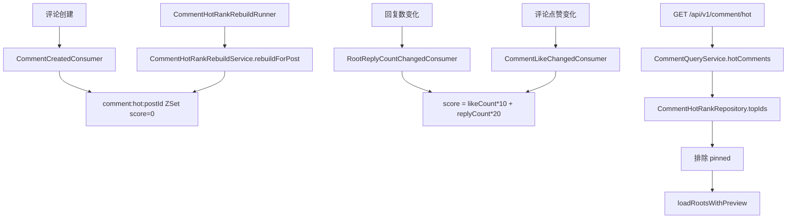

- 详细文本描述：
  1. 热榜的 Redis key 是 `comment:hot:{postId}`，底层结构是 ZSet。
  2. 一级评论创建成功后，`CommentCreatedConsumer` 会先把它塞进 ZSet，初始分数是 `0`。
  3. 热榜真正变热，靠后续两个异步事件更新分数：
     回复数变化时，由 `RootReplyCountChangedConsumer` 刷新；
     点赞数变化时，由 `CommentLikeChangedConsumer` 刷新。
  4. 当前分数公式写死在消费者里：
     `score = likeCount * 10 + replyCount * 20`
     也就是系统认为“被回复”比“被点赞”更能代表讨论热度。
  5. 读接口 `GET /api/v1/comment/hot` 会先查 pinned，再从 ZSet 按分数倒序取 Top N，最后排除 pinned，返回 `pinned + items`。
  6. 如果热榜脏了或 Redis 丢 key，代码里还有 `CommentHotRankRebuildService` 和 `CommentHotRankRebuildRunner` 可以手动重建。只有显式传 `comment.hot.rebuild.postId` 时才会执行，默认不开。

- `**上游**`
  1. 上游不是用户直接写热榜，而是评论创建、评论点赞变化、回复数变化这三条链持续把新事实推过来。
  2. 其中 `CommentCreatedConsumer` 负责把一级评论先放进候选集合，`CommentLikeChangedConsumer` 和 `RootReplyCountChangedConsumer` 再不断刷新分数。
  3. 置顶关系也是它的上游约束之一，因为热榜读侧要明确排除 pinned，避免重复展示。

- `**下游**`
  1. 下游是 `GET /api/v1/comment/hot` 读接口，它直接从 ZSet 取 TopN，再把结果交给页面渲染。
  2. 热榜结果会反向影响用户对“哪些评论值得看”的注意力分配，所以它本质上是评论域的派生读模型。
  3. `CommentHotRankRebuildRunner` 是它的运维修复下游，Redis 丢数据时可以按帖子维度重建。

- `**相关技术栈、职责与原理**`
  1. `Redis`：负责用 ZSet 保存 `comment:hot:{postId}` 和分数；适合这里，因为热榜最核心是排序读快，ZSet 天生适合 TopN 场景。
  2. `RabbitMQ`：负责把评论创建、点赞变化、回复变化异步送到热榜消费者；适合这里，因为热榜只是派生结果，不该把排序计算塞进主事务。
  3. `Inbox 去重`：负责让 `RootReplyCountChangedConsumer`、`CommentLikeChangedConsumer` 在至少一次投递下仍然只生效一次；适合这里，因为重复消费最容易把热度算歪。
  4. `评论热榜`：负责把 `likeCount * 10 + replyCount * 20` 这套规则固化成可快速读取的读模型；适合这里，因为“热门”本来就是派生视图，不是事实表字段。
  5. `MyBatis + MySQL`：负责提供评论元数据和计数字段给消费者回查；适合这里，因为热榜分数最终还是建立在评论事实和计数真相之上。

- 实现方式为什么这么设计：
  1. 热榜是典型派生数据，最适合放 Redis ZSet，不该在读路径临时扫表现算。
  2. 用异步事件更新分数，说明评论主链路只负责“把事实写对”，派生排名交给旁路去慢慢对齐。
  3. 把“重建能力”单独做成 runner，而不是在热榜读接口里做重建 fallback，是非常好的工程习惯。重建是运营工具，不该污染在线读路径。

- STAR 面试讲法：
  - S：热门评论如果每次都回表按点赞数和回复数现排，读接口一定又重又慢。
  - T：我要把热门评论做成一个轻量读接口，同时支持异常时重建。
  - A：我用 ZSet 存热榜，创建时先放进去，后续由点赞和回复事件异步刷新 score，再补一个手动重建 runner。
  - R：热榜读取很轻，刷新逻辑也清楚，Redis 异常后还能按帖子维度重建。

- 亮点 / 兜底 / 一致性 / 性能点：
  - 亮点：热度公式简单直接，面试里很好讲，也方便后续 AB 实验替换。
  - 亮点：pinned 永远不和热榜 items 混排，避免同一条评论既在置顶又在热榜里重复出现。
  - 兜底：`CommentHotRankRebuildRunner` 默认不执行，只有显式给 `postId` 才启动，避免线上误伤。
  - 当前代码现状：热榜查询没有 `viewerId` 参数，所以待审核评论不会出现在热榜里，即便评论作者本人在看也不会看到。
  - 性能点：热榜读只做 ZSet TopN + 批量加载详情，不会把排序压力丢给 MySQL。

---

### 链路 9：评论删除

- 链路名称：评论删除
- 入口 / 核心类：
  `CommentController.delete`
  `InteractionService.deleteComment`
  `CommentRepository.softDelete`
  `CommentRepository.softDeleteByRootId`
  `CommentSoftDeleteCleanupJob`
- 要解决的问题：
  删除评论不能只是“删一行”，还要处理权限、楼层关系、回复计数、热榜、置顶，以及后续的物理清理。

```mermaid
flowchart TD
  A[DELETE /api/v1/comment/{commentId}] --> B[CommentController.delete]
  B --> C[InteractionService.deleteComment]
  C --> D[CommentRepository.getBrief]
  D --> E{是否有删除权限}
  E -- 否 --> F[返回 NO_PERMISSION]
  E -- 是 --> G{一级评论还是回复}
  G -- 回复 --> H[softDelete status 1->2]
  H --> I{本次真的删掉了?}
  I -- 是 --> J[发布 RootReplyCountChangedEvent -1]
  G -- 一级评论 --> K[softDelete 自己]
  K --> L[softDeleteByRootId 批量删楼内回复]
  L --> M[CommentHotRankRepository.remove]
  M --> N[CommentPinRepository.clearIfPinned]
  O[每天 03:00] --> P[CommentSoftDeleteCleanupJob 物理删 7 天前软删数据]
```

- 详细文本描述：
  1. 删除入口是 `DELETE /api/v1/comment/{commentId}`，必须登录。
  2. 权限规则不是只有评论作者能删，帖子作者也能删自己帖子下的评论。`hasDeletePermission` 会同时判断“是不是评论作者”和“是不是帖子作者”。
  3. 如果评论不存在，接口直接返回成功，状态是 `DELETED`。这说明删除接口是按幂等语义做的。
  4. 删除回复时：
     只会在 `status=1 -> 2` 真正发生变化时，才发 `RootReplyCountChangedEvent(-1)`；
     这样 MQ 重试或重复删除不会把 `reply_count` 反复扣成负数。
  5. 删除一级评论时：
     先把一级评论自己软删；
     再把这个楼里的二级回复批量软删；
     同时把它从热榜 ZSet 移除；
     如果它正好是 pinned，还会把 pin 记录清掉。
  6. 真正的物理删除不是接口当场做，而是 `CommentSoftDeleteCleanupJob` 每天凌晨 3 点跑一次，默认清掉 7 天前的软删评论。

- `**上游**`
  1. 上游入口是 `DELETE /api/v1/comment/{commentId}`，删除动作前必须先拿到当前用户身份和评论简要信息。
  2. 权限判断依赖评论作者、帖子作者这两个已有事实，所以删除链不是孤立动作，而是建立在评论和帖子归属数据之上。
  3. 如果删除的是回复，上游还要先识别它属于哪条根评论，这样后面才能正确回滚 `reply_count`。

- `**下游**`
  1. 一级评论删除会继续影响评论热榜和置顶关系，下游会把对应 ZSet 成员和 pin 记录清掉。
  2. 回复删除会通过 `RootReplyCountChangedEvent(-1)` 把影响传给回复计数和热榜分数。
  3. `CommentSoftDeleteCleanupJob` 是最终的清理下游，在线请求只负责先让前台看不见，物理删延后完成。

- `**相关技术栈、职责与原理**`
  1. `Spring MVC`：负责暴露删除接口并承接权限失败、幂等删除这些用户可见结果；适合这里，因为删除是明显的交互动作，HTTP 语义要直接。
  2. `MyBatis + MySQL`：负责做评论软删、批量软删楼内回复和后续物理清理；适合这里，因为删除首先是状态变更，最稳的做法是先把持久层状态改掉。
  3. `RabbitMQ`：负责在回复真实删除后异步发送 `RootReplyCountChangedEvent(-1)`；适合这里，因为回复数和热榜都是派生结果，不该让删除请求自己把所有派生都算完。
  4. `评论热榜`：负责接住一级评论删除后的派生清理；适合这里，因为热门列表不该继续保留已删除评论。
  5. `延迟清理`：负责把“前台立刻不可见”和“后台慢慢物理删”拆开；适合这里，因为真正耗时的是批量物理删除，不是用户眼前的状态切换。

- 实现方式为什么这么设计：
  1. 删除是用户可见行为，应该先保证“前台立刻看不见”，而不是当场做大量物理清理。
  2. 一级评论删除时直接级联软删整层楼，避免还要逐条回滚 reply_count 和热榜，复杂度更低。
  3. 物理清理用定时任务延后，是典型的把慢操作从在线请求里摘出去。

- STAR 面试讲法：
  - S：评论删除看起来简单，但它其实会影响楼层可见性、回复数、热榜、置顶和数据保留周期。
  - T：我要保证删除动作对用户立刻生效，同时不把接口做成大事务。
  - A：我把删除设计成软删，回复和一级评论分开处理；一级评论删除直接级联软删整楼，热榜和置顶同步清掉，物理删除交给定时任务。
  - R：接口足够快，用户立即感知删除成功，后台数据也能按 retention 策略慢慢清掉。

- 亮点 / 兜底 / 一致性 / 性能点：
  - 亮点：删除接口对“不存在的评论”返回成功，这就是典型幂等删除。
  - 亮点：帖子作者也能删，说明权限设计是按业务实际来的。
  - 兜底：`reply_count` 只有在真实 1->2 删除成功时才扣一次，不会因为重复调用越扣越多。
  - 当前代码现状：删除评论不会反向清理 `interaction_reaction` 里的历史点赞事实，也不会回收旧的聚合通知，只是保证前台列表、热榜、置顶不再展示它。
  - 性能点：物理清理由定时任务批量做，在线接口只做软删和必要的派生清理。

---

### 链路 10：评论置顶

- 链路名称：评论置顶
- 入口 / 核心类：
  `InteractionController.pinComment`
  `InteractionService.pinComment`
  `CommentPinRepository`
  `interaction_comment_pin`
- 要解决的问题：
  每个帖子都可能有一条“作者想强调给所有人看”的评论，但这条评论不能把普通分页和热榜逻辑搅乱。

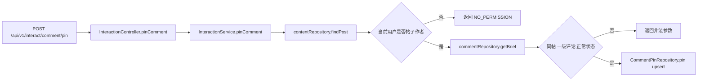

- 详细文本描述：
  1. 置顶入口是 `POST /api/v1/interact/comment/pin`。
  2. `InteractionService.pinComment` 先查帖子，如果帖子不存在直接返回 `NOT_FOUND`。
  3. 权限非常明确：只有帖子作者自己能置顶评论。
  4. 被置顶的评论也要满足 4 个条件：
     评论存在；
     属于当前帖子；
     是一级评论；
     状态正常。
  5. 真正落库时，`interaction_comment_pin` 只保存一行，主键就是 `post_id`，所以天然保证“一帖只有一条置顶”。

- `**上游**`
  1. 上游入口是 `POST /api/v1/interact/comment/pin`，并且先要查到帖子和评论这两个对象都存在。
  2. 当前用户必须先被判定为帖子作者，这个权限事实是整条链能否继续的前提。
  3. 评论本身还得满足“同帖、一级、正常状态”三个条件，说明置顶链依赖评论元数据已经先建好。

- `**下游**`
  1. 下游最直接受影响的是一级评论列表和评论热榜读取，它们都会把 pinned 单独拿出来，不再跟普通 items 混排。
  2. 如果后面再置顶另一条一级评论，旧 pin 会被覆盖，说明下游永远只维护“一帖一条置顶”。
  3. 删除链也会继续消费这个结果，一旦被置顶评论删除，就会把无效 pin 清掉。

- `**相关技术栈、职责与原理**`
  1. `Spring MVC`：负责暴露评论置顶入口；适合这里，因为置顶是帖子作者的明确管理动作，HTTP 接口最直观。
  2. `MyBatis + MySQL`：负责把置顶关系落到 `interaction_comment_pin`；适合这里，因为 `post_id` 做主键后，一帖一条置顶可以靠数据结构天然保证。
  3. `特殊情况外置建模`：负责把置顶从评论表主流程里拆出去；适合这里，因为“置顶”本来就是特殊展示规则，单独一张表比在评论排序里堆 if/else 更干净。
  4. `评论热榜`：负责在读侧与置顶协同，但不和置顶混排；适合这里，因为热门和作者手动强调是两种不同语义，拆开后分页和排序都更稳。

- 实现方式为什么这么设计：
  1. 把置顶单独放一张表，而不是在评论表上加一个 `is_pinned`，可以避免普通列表和热榜查询都多背一个特殊分支。
  2. `post_id` 作为主键，说明这张表本质是“帖子级配置”，不是评论属性。
  3. 读侧把 pinned 单独返回，比在列表里混排更容易让前端渲染，也更不容易出分页 bug。

- STAR 面试讲法：
  - S：置顶评论是典型特殊情况，如果直接混在评论表排序逻辑里，列表会越来越脏。
  - T：我要支持置顶，但不让分页、热榜和普通评论排序一起变复杂。
  - A：我把置顶单独拆成一张 `interaction_comment_pin` 表，读接口返回 `pinned + items` 两段结构。
  - R：置顶逻辑独立、权限清晰、读写都简单。

- 亮点 / 兜底 / 一致性 / 性能点：
  - 亮点：一帖一条 pin 用单表单主键解决，没有靠一堆 if/else 混在评论表里。
  - 兜底：读侧发现 pin 指向的评论脏了，会自动清掉无效 pin。
  - 当前代码现状：没有单独的“取消置顶”接口，但再次置顶另一条一级评论会直接覆盖旧值。
  - 性能点：查 pin 是单行查表，不会影响普通评论分页 SQL。

---

### 链路 11：通知生成与聚合入库

- 链路名称：通知生成与聚合入库
- 入口 / 核心类：
  `ReactionLikeService.publishNotifyLikeAdded`
  `InteractionService.publishNotifyCommentCreated`
  `InteractionService.publishNotifyCommentMentioned`
  `InteractionNotifyEventPort`
  `InteractionNotifyConsumer`
  `InteractionNotificationRepository.upsertIncrement`
- 要解决的问题：
  用户每次被点赞、被评论、被回复、被 @ 提及时都要收到提醒，但不能一条互动就插一条通知明细，否则通知中心会被刷爆。

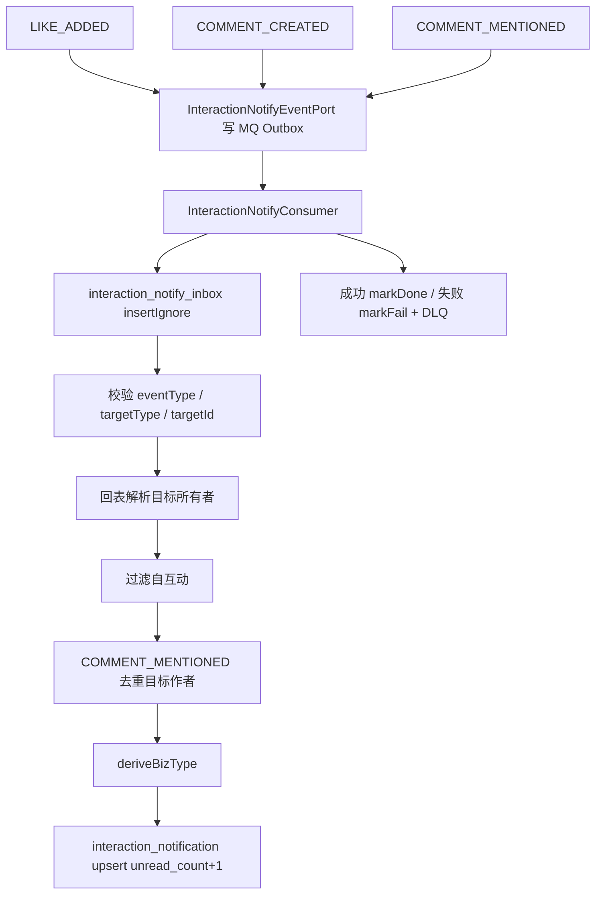

- 详细文本描述：
  1. 这个域把通知来源统一收敛成 3 种事件：
     `LIKE_ADDED`
     `COMMENT_CREATED`
     `COMMENT_MENTIONED`
  2. 点赞时只有 `delta=1` 才会发通知，重复点赞和取消点赞都不会刷通知。
  3. 评论创建时：
     一级评论会通知帖子作者；
     回复评论会通知被回复评论作者；
     `@username` 会按收件人一条条发 `COMMENT_MENTIONED`。
  4. 发送端不直接裸发 RabbitMQ，而是统一通过 `InteractionNotifyEventPort` 调 `ReliableMqOutboxService.save`。
  5. `InteractionNotifyConsumer` 收到事件后，先把 `eventId` 写进 `interaction_notify_inbox`，插入成功才继续处理，天然抗 RabbitMQ 至少一次投递。
  6. 然后消费者会回表判断通知到底该发给谁：
     `POST` 就查帖子作者；
     `COMMENT` 就查评论作者。
     如果事件自带 `toUserId`，比如 `COMMENT_MENTIONED`，就优先用它。
  7. 它还做了两个关键过滤：
     自己给自己点的赞或自己评论自己，不发通知；
     如果提及的人本来就是目标作者，也不再额外发一条 mention 通知，避免双通知。
  8. 最终不会插一堆明细，而是对 `interaction_notification` 做聚合 UPSERT。唯一键是：
     `(to_user_id, biz_type, target_type, target_id)`。
     同一类通知继续来，只会把 `unread_count` 累加，把 `lastActorUserId / lastCommentId / update_time` 更新掉。

- `**上游**`
  1. 上游不是 HTTP，而是点赞链、评论创建链、@ 提及链发出来的 `LIKE_ADDED`、`COMMENT_CREATED`、`COMMENT_MENTIONED` 事件。
  2. 这些事件先经过 `InteractionNotifyEventPort` 和 Outbox 保存下来，说明通知链依赖前面业务链已经把事实提交成功。
  3. 目标归属信息也来自上游事实表回查，比如帖子作者、评论作者、被提及人，这些都是决定通知该发给谁的前提。

- `**下游**`
  1. `interaction_notify_inbox` 会先吃到事件做幂等去重，只有首次事件才继续往后执行。
  2. `interaction_notification` 会被聚合 UPSERT 成收件箱记录，给通知列表、单条已读、全部已读这些接口提供统一数据源。
  3. 失败事件会进入 `markFail + DLQ` 这条下游，方便后续排障和重放。

- `**相关技术栈、职责与原理**`
  1. `RabbitMQ`：负责承接点赞、评论、提及事件，并把通知生成做成异步链；适合这里，因为通知不是主事务核心结果，不该阻塞用户交互。
  2. `Inbox 去重`：负责用 `interaction_notify_inbox` 的 `eventId` 先挡住重复消费；适合这里，因为 RabbitMQ 至少一次投递下，通知最怕被重复加 unread。
  3. `聚合通知`：负责把 `(to_user_id, biz_type, target_type, target_id)` 相同的事件合成一个通知桶；适合这里，因为提醒中心追求的是“少打扰地提醒到位”，不是保存每条噪音明细。
  4. `MyBatis + MySQL`：负责把聚合后的通知桶持久化到 `interaction_notification`；适合这里，因为未读数、最后操作者、最后评论这些结构化事实需要稳定落库。
  5. `异步落库`：负责把通知生成从点赞/评论主链拆出去；适合这里，因为通知失败不该拖垮主业务，只要最终能补齐就够。

- 实现方式为什么这么设计：
  1. 通知中心的本质不是“日志中心”，而是“提醒中心”，所以聚合比明细更符合用户体验。
  2. 统一事件结构 `InteractionNotifyEvent`，消费者只做幂等、目标归属解析和 UPSERT，复杂度明显更低。
  3. 发送端 Outbox + 消费端 Inbox，是这条通知链能讲得很完整的关键。

- STAR 面试讲法：
  - S：互动类通知如果按每次操作都插一条，很快就会把用户通知页刷成噪音，而且 MQ 重投还会重复提醒。
  - T：我要让通知既完整又克制，还要抗重复消费。
  - A：我把点赞、评论、@提及统一成一种事件结构，发送端走 Outbox，消费端先写 Inbox 去重，再按用户+业务+目标做聚合 UPSERT。
  - R：通知数明显更可控，重复消息不会重复加 unread，通知中心结构也足够简单。

- 亮点 / 兜底 / 一致性 / 性能点：
  - 亮点：通知的 `bizType` 不是事件里硬塞的，而是消费者根据 `eventType + targetType` 推导，这样事件模型更干净。
  - 亮点：消费者坏数据直接抛异常，`markFail` 后进 DLQ，不会悄悄吞掉错误。
  - 兜底：`payload` 会以 JSON 形式写进 `interaction_notify_inbox`，方便排障和重放分析。
  - 一致性：发送端 Outbox、消费端 Inbox、失败 DLQ 三件套都在，属于很完整的可靠消息链。
  - 当前代码现状：通知只支持新增，不支持“取消点赞后回收通知”或“删评论后反向扣 unread_count”。

---

### 链路 12：通知列表

- 链路名称：通知列表
- 入口 / 核心类：
  `InteractionController.notifications`
  `InteractionService.notifications`
  `InteractionNotificationRepository.pageByUser`
- 要解决的问题：
  用户打开通知中心时，要看到的是“还有哪些提醒没处理”，而不是底层所有历史明细。

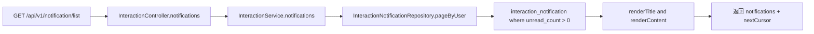

- 详细文本描述：
  1. 通知列表入口是 `GET /api/v1/notification/list`。
  2. Controller 会强制从 `UserContext.requireUserId()` 取当前用户，DTO 里虽然有 `userId` 字段，但这里根本不用它。
  3. `InteractionNotificationRepository.pageByUser` 的 SQL 只查 `unread_count > 0` 的记录，并按 `update_time DESC, notification_id DESC` 排序。
  4. 服务层拿到结果后，会根据 `bizType` 渲染标题和文案：
     `POST_LIKED -> 帖子获赞`
     `COMMENT_LIKED -> 评论获赞`
     `POST_COMMENTED -> 帖子被评论`
     `COMMENT_REPLIED -> 评论被回复`
     `COMMENT_MENTIONED -> 提及你`
  5. 文案本身不是存数据库里的，而是查询时现拼，比如：
     `你的帖子新增 N 个赞`
     `有人在评论里提及你 N 次`
  6. 当前分页大小是写死的 20 条，不接收前端 limit。

- `**上游**`
  1. 上游是通知聚合消费者已经把未读提醒写进 `interaction_notification`，否则列表接口就没有可读收件箱。
  2. 当前用户身份也是上游前提，因为列表只展示自己的未读通知，不接受前端随便传 `userId` 冒充别人。
  3. `bizType`、`lastActorUserId`、`unread_count` 这些字段都来自聚合通知链，列表本身不再重新推导业务事实。

- `**下游**`
  1. 下游直接是通知中心页面，前端会用标题、文案、未读数和游标继续翻页。
  2. 单条已读、全部已读接口都依赖这里返回的 `notificationId` 和聚合桶视图继续往下操作。
  3. 因为列表只查 `unread_count > 0`，所以下游页面天然呈现的是“待处理提醒”，不是消息档案馆。

- `**相关技术栈、职责与原理**`
  1. `Spring MVC`：负责暴露通知列表 HTTP 入口；适合这里，因为通知中心是典型读接口，身份校验和游标参数都适合放在这一层。
  2. `MyBatis + MySQL`：负责从 `interaction_notification` 按 `update_time DESC, notification_id DESC` 读取未读聚合桶；适合这里，因为分页稳定性和用户隔离都要由 SQL 明确保证。
  3. `聚合通知`：负责把底层多次互动先收敛成单条提醒；适合这里，因为列表接口因此可以保持很薄，只做读取和文案拼装。
  4. `结构化文案渲染`：负责根据 `bizType` 现拼标题和内容；适合这里，因为文案是展示层逻辑，放在查询时现算，比把历史文案硬存数据库更灵活。

- 实现方式为什么这么设计：
  1. 通知已经在消费端聚合过了，所以列表接口应该非常薄，只做读取和文案拼装。
  2. 标题和文案现算，说明 DB 只存结构化事实，不存易变文案，这样后续改展示文案不用回刷历史数据。
  3. 只返回未读通知，很符合“消息中心”的产品定位。

- STAR 面试讲法：
  - S：通知中心如果直接把事件明细全抖给前端，用户体验很差，接口也会越来越重。
  - T：我要让通知列表直接给出“还没处理的聚合提醒”，并支持稳定翻页。
  - A：我让消费端先把通知聚合成一张收件箱表，列表接口只读 `unread_count > 0`，再根据 `bizType` 现拼标题和文案。
  - R：接口很薄，前端拿来就能渲染，通知页也不会被噪音刷屏。

- 亮点 / 兜底 / 一致性 / 性能点：
  - 亮点：通知列表不是查“消息明细”，而是查“聚合收件箱”，这是产品模型和表模型一致的好例子。
  - 亮点：`nextCursor = updateTime:notificationId`，双字段游标避免同一时刻多条数据翻页重复。
  - 当前代码现状：固定每页 20 条；DTO 里的 `userId` 被忽略，真正用户身份只认上下文。
  - 一致性：一旦某条聚合通知被读成 `unread_count = 0`，它就不会再出现在列表里。

---

### 链路 13：单条通知已读

- 链路名称：单条通知已读
- 入口 / 核心类：
  `InteractionController.readNotification`
  `InteractionService.readNotification`
  `InteractionNotificationRepository.markRead`
- 要解决的问题：
  用户点开一条通知后，要把这条提醒清掉，但因为通知本身是聚合桶，所以“已读”的语义要讲清楚。

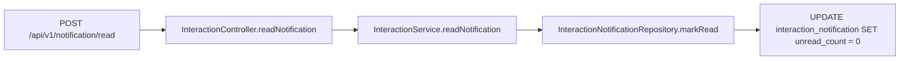

- 详细文本描述：
  1. 入口是 `POST /api/v1/notification/read`，请求体只需要 `notificationId`。
  2. 服务层不做复杂逻辑，直接调用 `markRead(toUserId, notificationId)`。
  3. SQL 也很直接：
     `UPDATE interaction_notification SET unread_count = 0 WHERE to_user_id = ? AND notification_id = ?`
  4. 这件事最重要的理解不是代码，而是业务语义：
     这不是“把 5 次未读变成 4 次未读”，而是“这整个聚合通知桶我都看过了，直接清零”。

- `**上游**`
  1. 上游是通知列表已经先把某个 `notificationId` 暴露给前端，用户点开后才会触发这条接口。
  2. 这条链依赖 `interaction_notification` 里已经存在聚合桶，否则就没有可清零的对象。
  3. 当前用户身份同样是上游前提，因为“读掉谁的通知”只能由服务端按 `to_user_id` 约束。

- `**下游**`
  1. 下游会直接把对应聚合桶的 `unread_count` 置 0，下一次通知列表查询时它就消失。
  2. 这条链不会生成新的事件，也不会拆成多条明细已读，而是直接结束在收件箱表。
  3. 从产品效果看，下游结果就是“这一整桶提醒我处理完了”，不是“减少 1 条”。

- `**相关技术栈、职责与原理**`
  1. `Spring MVC`：负责提供单条已读接口；适合这里，因为用户动作就是点开一条提醒，HTTP 调用最直接。
  2. `MyBatis + MySQL`：负责按 `to_user_id + notification_id` 精确更新 `interaction_notification`；适合这里，因为聚合桶已读本质就是一次受限更新。
  3. `聚合通知`：负责定义“单条已读=整桶清零”的业务语义；适合这里，因为系统没有逐条消息明细，减 1 反而会和模型打架。

- 实现方式为什么这么设计：
  1. 因为通知本来就是聚合模型，所以单条已读最自然的语义就是“整桶清零”。
  2. 如果这里设计成减 1，反而和前面的聚合策略打架，因为你已经没有单条明细可供用户逐个消费。

- STAR 面试讲法：
  - S：通知不是明细表，而是聚合桶，如果还用“逐条已读”的思路去设计，语义会不一致。
  - T：我要让通知已读和聚合模型完全对齐。
  - A：我把单条已读定义成“单个聚合通知桶已读”，SQL 直接把 `unread_count` 清零。
  - R：实现简单，产品语义也明确，不会出现“到底读掉了哪一条”的混乱问题。

- 亮点 / 兜底 / 一致性 / 性能点：
  - 亮点：已读语义和聚合模型完全一致，没有强行模仿明细消息系统。
  - 当前代码现状：所谓“单条已读”，本质上是“单个聚合桶已读”，不是消费 1 条未读计数。
  - 一致性：SQL 带 `to_user_id` 条件，不能跨用户乱改通知状态。
  - 性能点：单条更新，开销很低。

---

### 链路 14：全部通知已读

- 链路名称：全部通知已读
- 入口 / 核心类：
  `InteractionController.readAllNotifications`
  `InteractionService.readAllNotifications`
  `InteractionNotificationRepository.markReadAll`
- 要解决的问题：
  用户点“全部已读”时，要一次性清空自己的整个互动通知中心。

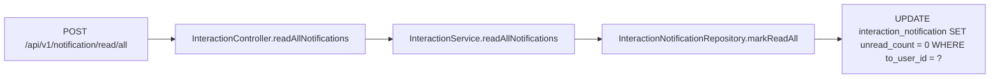

- 详细文本描述：
  1. 入口是 `POST /api/v1/notification/read/all`。
  2. 服务层只校验当前用户存在，然后调用 `markReadAll(userId)`。
  3. SQL 会把这个用户的所有聚合通知 `unread_count` 一次性置 0。
  4. 因为通知列表本来就只查 `unread_count > 0`，所以执行完以后列表会立刻空掉。

- `**上游**`
  1. 上游是这个用户当前还保留着若干未读聚合通知，否则这条接口执行后只是空操作。
  2. 用户身份是唯一必要的前置条件，因为全部已读就是对“我自己的收件箱”做批量动作。
  3. 这条链前面依赖的仍然是通知聚合模型，只有先有 `interaction_notification`，后面才谈得上整库清零。

- `**下游**`
  1. 下游会把这个用户的所有聚合桶 `unread_count` 统一清零，通知列表下一次查询会立刻变空。
  2. 它不会逐条遍历通知做复杂处理，而是直接在收件箱表结束。
  3. 从页面效果看，下游是“一键清空提醒”，不是一条条消费历史事件。

- `**相关技术栈、职责与原理**`
  1. `Spring MVC`：负责暴露全部已读接口；适合这里，因为这是标准的用户交互动作，入口要清晰可控。
  2. `MyBatis + MySQL`：负责按 `to_user_id` 批量把 `interaction_notification.unread_count` 置 0；适合这里，因为批量更新比循环逐条改更简单、更稳。
  3. `聚合通知`：负责让“全部已读”可以用一条 SQL 结束；适合这里，因为系统面对的是聚合桶，不是海量消息明细。

- 实现方式为什么这么设计：
  1. 既然通知只展示未读，那么“全部已读”就不需要复杂事务，直接批量清零最直接。
  2. 这比逐条扫通知再更新更省，也不会出现部分成功、部分失败造成的体验割裂。

- STAR 面试讲法：
  - S：用户常见操作是“一键清空提醒”，如果做成循环逐条更新，既慢又容易出中间态。
  - T：我要把全部已读做成一个明确、可预期的动作。
  - A：我直接在收件箱表上按用户批量清零 unread_count。
  - R：语义清晰，执行成本低，通知列表会立刻收敛到空。

- 亮点 / 兜底 / 一致性 / 性能点：
  - 亮点：复用了聚合模型的天然优势，不需要去管消息明细。
  - 一致性：只按 `to_user_id` 生效，不会越权改别人通知。
  - 性能点：单 SQL 批量更新，接口很薄。

---

### 链路 15：打赏 / 投票 / 钱包占位能力

- 链路名称：打赏 / 投票 / 钱包占位能力
- 入口 / 核心类：
  `InteractionController.tip`
  `InteractionController.createPoll`
  `InteractionController.vote`
  `InteractionController.balance`
  `InteractionService.tip/createPoll/vote/balance`
- 要解决的问题：
  这些接口现在更像“合同占位”，让前端和上层业务先有 API 可以对接，但并没有真正形成支付、投票、钱包结算闭环。

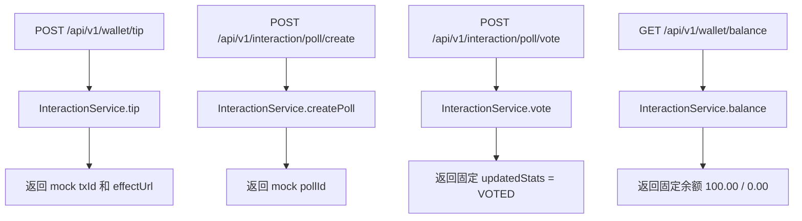

- 详细文本描述：
  1. 打赏接口 `/api/v1/wallet/tip` 当前只是返回：
     `txId = "tx-" + nextId`
     `effectUrl = "https://effect/mock"`
  2. 创建投票接口 `/api/v1/interaction/poll/create` 只返回一个新的 `pollId`。
  3. 投票接口 `/api/v1/interaction/poll/vote` 只返回固定字符串 `VOTED`。
  4. 钱包余额接口 `/api/v1/wallet/balance` 直接回：
     `amount = 100.00`
     `frozenAmount = 0.00`
  5. 这 4 个接口当前都没有看到对应表、事务、消息、权限校验、账务流水，也没有和真实支付域形成闭环。

- `**上游**`
  1. 上游只是前端或其他业务方希望先有可联调的 API 合同，所以这些接口先被挂出来。
  2. 但从当前代码事实看，它们没有接上真实账本、投票明细、余额计算，也没有统一走用户身份闭环。
  3. 也就是说，这里的上游诉求是“先联调”，不是“已经有完整业务事实可以消费”。

- `**下游**`
  1. 下游目前只有 mock 返回值，最多让页面把 `txId`、`pollId`、余额占位先展示出来。
  2. 它不会继续驱动通知、异步落库、账务流水或风控链路，因为这些都还没接上。
  3. 所以下游结果本质是“合同占位”，不是成熟业务闭环。

- `**相关技术栈、职责与原理**`
  1. `Spring MVC`：负责先把打赏、投票、钱包余额接口合同暴露出来；适合这里，因为联调阶段最先需要的是稳定 URL 和返回结构。
  2. `MyBatis + MySQL`：当前没有看到对应真表和持久化逻辑；这恰恰说明它还不是完整业务，因为成熟的钱包或投票一定要有可追溯持久层。
  3. `Redis`：当前没有看到余额缓存、投票状态缓存或热点计数缓存；这说明它还没进入高频读写优化阶段。
  4. `RabbitMQ`：当前没有看到支付回调、账务异步落库或投票统计消息；这说明它还没接成真正的业务链，只是接口保留位。

- 实现方式为什么这么设计：
  1. 这是典型的接口占位，先把外部契约挂出来，让页面或别的域能先联调。
  2. 把它们挂在互动域里，说明当前项目还没把“支付 / 钱包 / 投票”单独抽成成熟子域。

- STAR 面试讲法：
  - S：项目需要先把互动接口面铺开，但某些能力还没到值得独立建设的时候。
  - T：我要给前端和上层调用方一个稳定 API，不在这一轮把支付和钱包真正做完。
  - A：我先保留接口合同，让返回结构固定，但明确不承诺真实业务闭环。
  - R：联调能继续推进，同时不会把半成品包装成成熟支付系统。

- 亮点 / 兜底 / 一致性 / 性能点：
  - 当前代码现状：这 4 个接口是明确的占位实现，不能算“支付域完成”。
  - 当前代码现状：它们甚至没有统一走 `UserContext.requireUserId()`，说明连身份闭环都还没接上。
  - 面试建议：这部分必须诚实讲成“接口保留位”，不要为了好看把 mock 说成产品能力。

---

## 4. 面试官最感兴趣的亮点汇总

1. 帖子点赞和评论点赞故意拆成两套。
   这不是重复造轮子，而是尊重不同数据规模和查询诉求。帖子点赞追求写入吞吐，评论点赞追求列表真相和热榜联动。

2. 评论正文外置 KV，元数据单独落表。
   这是非常好的“好品味”例子。评论列表最常查的是楼层关系、时间、状态、计数，不是正文大字段。

3. `pinned + items` 结构直接消灭分页特殊情况。
   置顶不参与分页和热榜，是这份代码里最值得在面试里主动讲的设计点之一。

4. 通知是聚合收件箱，不是消息明细。
   唯一键 `(to_user_id, biz_type, target_type, target_id)` + `unread_count`，说明作者在用产品语义驱动数据模型，而不是机械堆表。

5. 发送端 Outbox + 消费端 Inbox 做得很完整。
   评论事件、通知事件、帖子点赞事件都不是直接裸发 MQ，这让“最终一致”讲起来更有底气。

6. 评论读侧对“待审核可见性”做了双保险。
   SQL 层只给作者放开，服务层再做 `visibleToViewer` 过滤，尤其是回复预览缓存不带 viewerId 时，这个补刀非常关键。

7. 删除链路没有追求“当场扫干净一切”。
   先软删让用户立刻看不见，再由定时任务做物理清理，这是成熟系统常见的取舍。

8. 热榜读路径没有塞重建逻辑。
   Redis 丢数据时走单独 runner 重建，而不是在线接口里偷偷扫库，这一点很大厂。

---

## 5. 当前边界与可追问风险

1. `ReactionSyncConsumer`、`ReactionSyncZsetWorker`、`ReactionLikeService.syncTarget` 这套延迟落库链还在代码里，但当前主点赞链已经不再主动把新请求送进这套链路。
   面试里要实话实说：这是保留实现，不是当前主线。

2. 点赞人列表当前只支持评论，不支持帖子。
   如果面试官追问原因，可以直接回答：帖子点赞优先为高并发写路径服务，还没把 likers 明细接口做成一等公民。

3. 评论热榜接口没有 `viewerId` 概念。
   这意味着待审核评论即便对作者本人，在热榜里也不会展示。

4. 删除评论不会反向清理历史点赞事实和旧通知聚合。
   当前实现保证的是前台不再展示这条评论，但底层历史事实仍会保留。

5. `CommentRequestDTO.commentId` 不是完整幂等协议。
   它更像“允许业务方传自定义主键”，重复请求会依赖数据库主键冲突，而不是优雅返回同一个结果。

6. 通知列表只查 `unread_count > 0`。
   这意味着系统没有提供“已读通知历史列表”，当前通知中心更像提醒盒子，不像消息档案馆。

7. 打赏 / 投票 / 钱包现在只是占位接口。
   如果后面真要做成成熟支付子域，还需要补身份、账本、冻结、回调、对账、风控等完整链路。

8. 计数聚合默认走 `snapshot` 模式，代码里也保留了 `delta` 模式。
   如果面试官追问为什么默认 snapshot，可以直接回答：至少一次投递下，覆盖写比增量累计更稳，更不容易重复加数。

---

## 6. 一句话收尾

这个领域真正成熟的地方，不是“接口很多”，而是它已经把互动事实、评论读写、通知聚合、异步派生、缓存加速、幂等去重这些东西拆清楚了。

如果面试里只能挑 3 句话讲，我建议讲这 3 句：

1. 帖子点赞和评论点赞不是一套实现，我是按数据规模和查询诉求拆开的。
2. 评论读侧把 pinned、分页、回复预加载、待审核可见性拆清了，特殊情况尽量被数据结构吃掉了。
3. 通知不是明细流，而是聚合收件箱，发送端 Outbox、消费端 Inbox，把最终一致和去重讲完整了。
