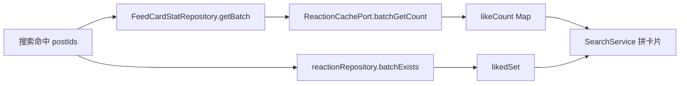
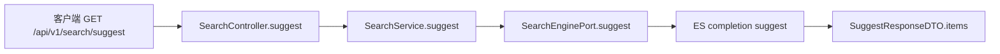
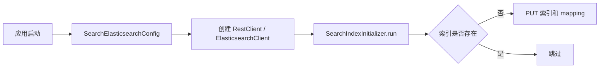
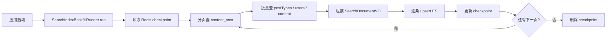
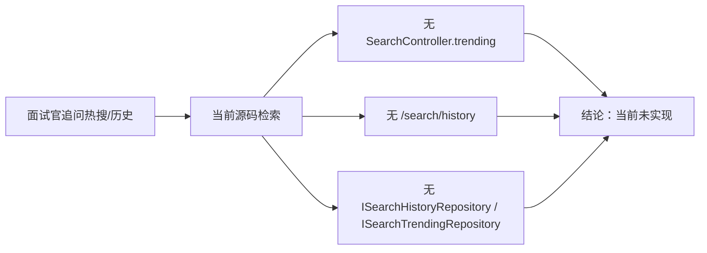

# 搜索与内容发现中心领域分析

> 说明
> - 本文只基于当前源码事实写。`.codex/search-discovery-implementation.md` 只用于辅助识别候选链路，和源码冲突时一律以源码为准。
> - 当前真实对外接口只有 `GET /api/v1/search` 和 `GET /api/v1/search/suggest`。
> - 本领域的本质不是“做一个搜索框”，而是“把帖子持续变成可检索索引，并把结果装成前端能直接展示的卡片”。

## 领域定位

一句话说明：这个领域是内容域、用户域、互动域和 Elasticsearch 之间的连接层。它一头接收用户搜索请求，另一头持续把帖子、作者昵称、点赞数这些信息同步到索引里。

从职责上看，它分成两半：

1. 读链路
   - `SearchController` 接 HTTP 请求。
   - `SearchService` 做参数归一化、结果装配、点赞态补齐。
   - `SearchEnginePort` 直接对 Elasticsearch 发查询和联想请求。
2. 写链路
   - 内容发布/编辑/删除由 `ContentService` 发 outbox 事件。
   - 昵称变更由 `UserService` 发 outbox 事件。
   - `SearchIndexConsumer` 消费 MQ，把帖子索引 upsert、软删、批量刷新昵称。
   - `SearchIndexBackfillRunner` 负责把历史帖子整批回填进索引。

这个领域当前的边界也很清楚：

- 只搜帖子，`SearchDocumentAssembler` 固定写 `contentType="POST"`。
- 联想词来自 ES 的 `completion suggest`，不是热搜榜。
- 搜索结果里的点赞态是实时补的，但收藏态不是。
- 热搜、搜索历史在当前源码里没有真正落地。

## 业务链路总表

| 编号 | 链路 | 当前状态 | 入口/核心类 | 一句话说明 |
| --- | --- | --- | --- | --- |
| 1 | 搜索主链路 | 已闭环 | `SearchController.search` / `SearchService.search` / `SearchEnginePort.search` | 把 `q/size/tags/after` 变成 ES 查询和游标分页结果。 |
| 2 | 搜索结果装配 | 已闭环，部分字段占位 | `SearchService.search` / `SearchDocumentAssembler` | 把 ES 命中装成前端卡片。 |
| 3 | 点赞态拼装 | 已闭环，收藏态未闭环 | `SearchService.loadLikeStats` / `IFeedCardStatRepository` / `IReactionRepository` | 给结果补点赞总数和“我是否点过赞”。 |
| 4 | 联想词链路 | 已闭环 | `SearchController.suggest` / `SearchService.suggest` / `SearchEnginePort.suggest` | 用标题前缀补全做联想词。 |
| 5 | 索引初始化链路 | 已闭环 | `SearchElasticsearchConfig` / `SearchIndexInitializer` | 服务启动时自动建索引。 |
| 6 | 内容发布/编辑触发索引 upsert | 已闭环 | `ContentService` / `ContentEventOutboxPort` / `SearchIndexConsumer` | 帖子发布或更新后，把最新内容写进 ES。 |
| 7 | 删除/不可检索状态触发索引软删 | 已闭环 | `ContentService.delete` / `SearchIndexConsumer.handleSoftDelete` / `SearchEnginePort.softDelete` | 让删帖、私密、驳回内容从搜索里消失。 |
| 8 | 昵称变更索引刷新 | 已闭环，头像未同样刷新 | `UserService` / `UserEventOutboxPort` / `SearchIndexConsumer.onUserNicknameChanged` | 用户改昵称后，历史帖子里的作者名一起更新。 |
| 9 | 索引回填链路 | 已闭环 | `SearchIndexBackfillRunner` | 把历史已发布帖子批量灌进索引。 |
| 10 | 热搜与搜索历史 | 当前源码未实现 | 无真实入口 | 草稿里有方案，但源码没有 Controller、Repository、Redis key。 |

## 链路 1：搜索主链路

**链路名称**：搜索请求到 ES 召回

**入口/核心类**：`SearchController.search`、`SearchService.search`、`SearchEnginePort.search`

**要解决的问题**：用户输入关键词后，系统要快速找出相关帖子，还要支持稳定分页，不能越翻页越慢。

**详细文本描述**

1. `SearchController.search` 接收 `q`、`size`、`tags`、`after`，同时从 `UserContext` 取 `userId`。
2. `SearchService.search` 会先做很轻的归一化：
   - `q` 必填，去首尾空格，再把连续空白压成一个空格。
   - `size` 默认 20，小于 1 直接报参数错误。
   - `tags` 按逗号拆开、去空白、去重。
3. 归一化后的查询被装进 `SearchEngineQueryVO`，然后交给 `SearchEnginePort.search`。
4. `SearchEnginePort.search` 真实发出的 ES 查询有几个关键点：
   - `multi_match` 只搜 `title^3` 和 `body`，标题权重大于正文。
   - 强制过滤 `status=published`，保证软删和下架内容不会被查出来。
   - 如果传了 `tags`，再叠加 `terms tags` 过滤。
   - 用 `function_score` 给 `like_count` 和 `view_count` 加权，让“相关”之外再带一点“受欢迎”排序。
   - 开启 `highlight`，高亮 `title` 和 `body`。
   - 排序顺序是 `_score`、`publish_time`、`like_count`、`view_count`、`content_id`。
5. 分页不是常见的 `from + size`，而是 `search_after`：
   - 查询时多拿一条，`size = limit + 1`。
   - 如果真多拿到一条，就说明还有下一页。
   - `nextAfter` 是把最后一条可见数据的 sort 数组编码成 Base64 返回给前端。

**上游**

- 用户或前端调用 `GET /api/v1/search`；输入来自 `q/size/tags/after`，登录态来自 `UserContext`。
- 前置依赖是搜索索引已存在，且写链路/回填链路已经把可搜文档持续写进 ES。

**下游**

- 结果先交给 `SearchService` 做高亮摘要和点赞态补齐，再由 `SearchController` 映射成 `SearchResponseDTO` 返回前端。
- 这条链路只读 ES，不回写 MySQL 或缓存；它给后续点赞态拼装提供 `contentId` 列表。

**相关技术栈、职责与原理**

- `Spring MVC`：负责接 HTTP 参数。原理是 `@GetMapping + @RequestParam` 把 URL 查询串绑定到 Controller 方法。适合这里，因为控制层只做薄入口。
- `SearchService`：负责参数归一化和查询规则收口。原理是把散的入参收成 `SearchEngineQueryVO`，避免 Controller 直接拼 ES DSL。适合这里，因为分页和过滤规则集中更稳。
- `Elasticsearch`：负责全文召回、`function_score` 排序、`highlight` 和 `search_after` 分页。原理是倒排索引先召回文档，再按 sort 数组继续翻页。适合这里，因为全文搜索和深分页不是 MySQL 的强项。

**实现方式为什么这么设计**

- 这是典型的“读库前置”设计。搜索直接读 ES，不回 MySQL 拼结果，避免把数据库拖进全文检索场景。
- `search_after` 比深分页 `from/size` 更适合往后翻很多页的场景，因为 ES 不需要为前面所有页做大偏移跳过。
- 排序把相关性、发布时间、互动热度串在一起，说明这套搜索不是纯技术 demo，而是兼顾“搜得准”和“看起来顺眼”。

**STAR 面试讲法**

- S：搜索接口需要支持真实帖子检索和分页，不能每次翻页都越来越慢。
- T：我负责把 HTTP 入参变成稳定的 ES 查询，还要兼顾相关性和用户体验。
- A：我把搜索统一收口到 `SearchService`，只让 ES 做召回；同时用 `search_after` 替代深分页，用标题高权重和互动加权提升结果质量。
- R：最终接口能直接返回可翻页的搜索卡片，且分页游标稳定，不依赖数据库深翻页。

**亮点/兜底/一致性/性能点**

- 亮点：`search_after` 是真正做过搜索的人会讲的点，不是只会 `pageNo/pageSize`。
- 亮点：查询只认 `published`，和写链路的软删设计天然闭环。
- 一致性：搜索召回只信 ES，不回数据库做“补查补丁”，逻辑边界清楚。
- 性能点：标题权重更高，正文补召回，减少“正文里提了一句就冲到前面”的噪音。
- 当前代码现状：虽然索引里存了 `author_nickname`、`content_id`、`description`，但当前查询并没有把它们作为召回字段。

## 链路 2：搜索结果装配

**链路名称**：ES 命中结果装成前端卡片

**入口/核心类**：`SearchService.search`、`SearchResultVO`、`SearchItemDTO`、`SearchDocumentAssembler`

**要解决的问题**：ES 返回的是索引文档，不是前端能直接渲染的卡片。系统需要把它变成“标题、摘要、封面、作者、标签”这些字段齐全的展示结果。

**详细文本描述**

1. `SearchEnginePort.parseSearchResponse` 会把 `_source` 映射成 `SearchDocumentVO`。
2. `SearchService.search` 再把每个 `SearchDocumentVO` 变成 `SearchItemVO`。
3. 摘要的取值顺序有明确优先级：
   - 先看标题高亮。
   - 再看正文高亮。
   - 两个都有就拼起来。
   - 都没有就退回索引里的 `description`，也就是内容摘要。
4. 封面图不是查询时临时算的，而是索引写入时就已经准备好 `imgUrls`，查询时只取第一个非空图片。
5. 作者头像、作者昵称、标签也都是直接从索引里拿，不需要再回表查用户域或内容域。
6. 最终 `SearchController` 只做一层 DTO 映射，把领域对象转成接口对象。

**上游**

- 输入直接来自链路 1 的 `SearchEngineResultVO.hits`，核心数据是 ES `_source` 和高亮片段。
- 前置依赖是写链路/回填链路已经把标题、摘要、作者、图片、标签这些展示字段提前写进索引。

**下游**

- 输出交给 `SearchController` 映射成 `SearchItemDTO`，最终直接给前端渲染卡片。
- 这条链路不改索引、不回表，当前主要在本域内闭环，只影响返回结果形状。

**相关技术栈、职责与原理**

- `SearchDocumentVO / SearchResultVO`：负责把 ES 文档和接口卡片拆成两层模型。原理是先做领域对象，再做接口 DTO，避免前端结构和 `_source` 强绑定。适合这里，因为字段扩展更可控。
- `SearchService.resolveDescription`：负责摘要优先级。原理是先吃标题/正文高亮，缺失时再回退到索引里的 `description`。适合这里，因为用户最关心“为什么命中我”。
- `SearchDocumentAssembler`：负责在写索引时把首图、标题补全词、作者信息先准备好。原理是把展示字段前置到索引。适合这里，因为读链路就能保持很薄。

**实现方式为什么这么设计**

- 这套设计的关键思想是“把展示所需字段尽量前置到索引”。这样查询链路只做轻量装配，不做跨库拼接。
- 搜索结果里最贵的不是“找不到”，而是“找到了但还要再查三四次库才能展示”。当前实现显然在避免这个坑。
- 用高亮覆盖摘要，比单纯返回全文片段更适合搜索场景，因为用户最关心“为什么命中我”。

**STAR 面试讲法**

- S：搜索命中只是原始索引文档，前端想要的是完整内容卡片。
- T：我要把结果装成可直接渲染的数据，同时不能把搜索链路变成多次回表。
- A：我把首图、作者信息、标签、标题联想词都在索引写入时准备好，查询时只做高亮优先级和 DTO 映射。
- R：搜索接口返回的数据前端可以直接用，而且读链路非常薄，没有额外跨域查询。

**亮点/兜底/一致性/性能点**

- 亮点：首图和作者信息在索引里就齐了，查询阶段不回用户域和媒体域。
- 亮点：摘要优先展示高亮，用户一眼能看出“为什么搜到了这条”。
- 一致性：`SearchDocumentAssembler` 统一了索引文档形状，查询和回填都走同一套字段模型。
- 性能点：结果装配是内存内操作，不加数据库压力。
- 当前代码现状：
  - `tagJson` 固定是 `null`。
  - `favoriteCount` 固定是 `0`。
  - `faved` 固定是 `false`。
  - `isTop` 固定是 `null`。
  - 这些字段说明接口形状留好了，但当前没有完整业务闭环。

## 链路 3：点赞态拼装

**链路名称**：搜索结果补点赞总数和“我点没点过赞”

**入口/核心类**：`SearchService.loadLikeStats`、`IFeedCardStatRepository`、`FeedCardStatRepository`、`IReactionRepository`

**要解决的问题**：ES 里的点赞数只是写索引那一刻的快照，用户看到的结果最好更接近实时，还要告诉登录用户“这条是不是我点过赞”。

**详细文本描述**

1. `SearchService.search` 先从所有命中结果里提取 `contentId` 列表。
2. `loadLikeStats` 会调用 `feedCardStatRepository.getBatch(contentIds)`。
3. 当前 `FeedCardStatRepository` 的真实实现不是查 ES，也不是查帖子表，而是把每个 `postId` 包装成 `ReactionTargetVO(POST, LIKE)`，再走 `reactionCachePort.batchGetCount(targets)` 批量取点赞总数。
4. 如果用户已登录，`SearchService.search` 还会调用 `reactionRepository.batchExists(...)`，一次把“这些帖子里哪些被当前用户点赞过”拿回来。
5. 最后拼卡片时：
   - `likeCount` 优先用这次补到的统计值。
   - `liked` 来自 `likedSet.contains(contentId)`。

**上游**

- 输入来自搜索主链路已经召回的 `contentId` 列表；若用户已登录，还额外依赖 `userId`。
- 前置依赖是互动域能按帖子批量给出点赞总数和“我是否点赞”。

**下游**

- 结果回填到 `SearchResultVO.SearchItemVO.likeCount/liked`，最终随搜索结果一起返回前端。
- 它不回写搜索索引；当前只影响搜索卡片展示，收藏态链路仍然没有闭环，这是当前代码现状。

**相关技术栈、职责与原理**

- `FeedCardStatRepository + ReactionCachePort`：负责批量拿点赞总数。原理是先把 `postId` 包装成 `ReactionTargetVO`，再一次性查询缓存计数。适合这里，因为一页结果很多，不能 N+1。
- `Redis`：这里通过 `ReactionCachePort.batchGetCount(...)` 承接热点计数。原理是把计数放在内存型缓存里，批量读比逐条查库便宜。适合搜索结果这种高频展示场景。
- `IReactionRepository`：负责 `batchExists` 和缺失时的 `getCount` 回退。原理是从互动事实表确认用户态真相。适合这里，因为“我点没点过赞”不能靠 ES 快照猜。

**实现方式为什么这么设计**

- 排序和展示是两个不同问题。ES 里的 `like_count` 适合做排序快照，但展示给用户时，最好从互动域再补一次更接近实时的数据。
- “点赞总数” 和 “我点没点过赞” 都做了批量接口，而不是一条帖子查一次，说明这套实现知道 N+1 查询会把接口打爆。
- 搜索域没有自己维护点赞真相，而是只消费互动域的结果，这样职责更清楚。

**STAR 面试讲法**

- S：索引里的互动计数是异步写入的，展示时可能有延迟。
- T：我要让搜索结果看起来更实时，同时不能把互动查询变成 N+1。
- A：我把展示态拆成两类批量补齐，`batchGetCount` 取总数，`batchExists` 取用户态。
- R：用户看到的点赞数和点赞态更准，接口也没有因为补态变慢到不可接受。

**亮点/兜底/一致性/性能点**

- 亮点：排序用索引快照，展示用互动域新鲜数据，这是典型的“读写分离思维”。
- 性能点：总数和用户态都批量查，不是一条一条查。
- 一致性：没登录就不查 `likedSet`，省掉无意义的用户态补齐。
- 当前代码现状：
  - `FeedCardStatRepository.saveBatch(...)` 是空实现，说明这里没有再维护一层独立搜索统计缓存。
  - `SearchService.loadLikeStats` 里虽然写了 `reactionRepository.getCount(...)` 的回退逻辑，但按当前 `FeedCardStatRepository` 的实现，正常情况下这段几乎不会触发。
  - 收藏态没有类似的补态链路，所以 `favoriteCount/faved` 还是占位。

## 链路 4：联想词链路

**链路名称**：输入前缀后给出标题联想词

**入口/核心类**：`SearchController.suggest`、`SearchService.suggest`、`SearchEnginePort.suggest`、`SearchDocumentAssembler`

**要解决的问题**：用户还没输完整关键词时，系统要根据已有帖子标题给出联想词，减少输入成本。

**详细文本描述**

1. 接口入参是 `prefix` 和可选的 `size`。
2. `SearchService.suggest` 会复用和搜索类似的文本归一化逻辑：
   - `prefix` 不能为空。
   - 默认返回 10 条。
3. `SearchEnginePort.suggest` 发的是 ES `suggest` 请求，不是普通搜索：
   - `size=0`，不取普通 hits。
   - `suggest.title_suggest.completion.field = title_suggest`。
   - 开启 `skip_duplicates=true`，避免重复建议。
4. `title_suggest` 这个字段不是前端传的，而是在索引写入时由 `SearchDocumentAssembler` 直接把 `title` 填进去。
5. ES 返回建议后，代码只取 `text` 字段，并在内存里做一次去重。

**上游**

- 用户在搜索框输入前缀后调用 `GET /api/v1/search/suggest`；输入来自 `prefix/size`。
- 前置依赖是索引文档里已经写入 `title_suggest` 字段；这个字段来自写链路和回填链路里的 `SearchDocumentAssembler`。

**下游**

- 输出直接交给 `SuggestResponseDTO.items` 返回前端，用来做输入框联想。
- 当前主要在本域内闭环，不更新热搜、不落搜索历史，也不触发其他领域。

**相关技术栈、职责与原理**

- `Spring MVC`：负责暴露 `suggest` 接口并接收 `prefix`。原理和搜索主链路一样，是注解路由加参数绑定。适合这里，因为联想接口本身很薄。
- `Elasticsearch completion suggest`：负责前缀补全。原理是专门的 `completion` 字段维护补全结构，`skip_duplicates` 避免重复词。适合这里，因为它比普通全文查询做前缀匹配更省。
- `SearchDocumentAssembler`：负责把 `title` 同步写进 `title_suggest`。原理是写入索引时一次把补全字段准备好。适合这里，因为读链路无需再构建词典。

**实现方式为什么这么设计**

- 对当前业务来说，联想词先做好“标题补全”就够了，不必一上来就加热搜、纠错、语义联想这些更贵的能力。
- 把建议字段直接绑定到标题，说明当前联想词的产品定位非常明确：帮用户更快打出帖子标题关键词，而不是做“猜你想搜什么”。

**STAR 面试讲法**

- S：搜索框需要联想词，但当前系统还没有热搜或历史搜索能力。
- T：我要在不引入新存储的前提下，把联想词先落地。
- A：我直接复用 ES completion suggest，用索引里的标题字段做前缀补全。
- R：联想词能力快速闭环，且不依赖 Redis 热榜、个性化画像这些额外系统。

**亮点/兜底/一致性/性能点**

- 亮点：联想词完全复用现有索引，不需要额外表和缓存。
- 性能点：completion suggest 本身就是为前缀补全设计的，比在普通全文搜索上硬做前缀匹配更合适。
- 一致性：标题一旦索引更新，联想词也跟着更新，因为两者来自同一条文档。
- 当前代码现状：
  - 空前缀会直接报参数错误，不会像草稿方案那样回热搜 top10。
  - 没有个性化联想，也没有按热度排序的独立逻辑。

## 链路 5：索引初始化链路

**链路名称**：服务启动时自动创建搜索索引

**入口/核心类**：`SearchElasticsearchConfig`、`SearchIndexInitializer`

**要解决的问题**：开发环境或新环境启动时，索引不能靠人手工创建，否则很容易出现“服务起来了，但搜索全挂”的问题。

**详细文本描述**

1. `SearchElasticsearchConfig` 从 `search.es.endpoints` 解析 ES 地址，创建 `RestClient` 和 ES 8 官方 Java Client。
2. `SearchIndexInitializer.run` 启动时会先对 `search.es.indexAlias` 做一次 `HEAD`。
3. 如果不存在，就直接 `PUT /{indexAlias}` 创建索引。
4. 当前 mapping 里最关键的字段有：
   - `title`、`description`、`body`：`text`，分词器是 `ik_max_word`，查询分词器是 `ik_smart`。
   - `tags`、`content_type`：`keyword`。
   - `publish_time`：`date(epoch_millis)`。
   - `title_suggest`：`completion`，给联想词用。

**上游**

- 由 Spring Boot 启动触发 `ApplicationRunner`；输入来自配置 `search.es.endpoints` 和 `search.es.indexAlias`。
- 前置依赖是 ES 可连通，且环境已经装了 IK 分词插件；否则 mapping 建不起来。

**下游**

- 结果直接交给 Elasticsearch：索引存在就跳过，不存在就创建 mapping。
- 它不直接返回给用户，但会影响链路 1、4、6、7、8、9 能不能正常读写索引。

**相关技术栈、职责与原理**

- `Spring Boot ApplicationRunner`：负责服务启动后自动执行初始化。原理是容器启动完成后调用一次 `run(...)`。适合这里，因为索引准备本来就是启动前置动作。
- `SearchElasticsearchConfig`：负责创建 `RestClient` 和 ES 8 官方 `ElasticsearchClient`。原理是把 ES 连接做成 Spring Bean，全域复用。适合这里，因为连接管理不该散在业务类里。
- `SearchIndexInitializer`：负责 `HEAD` 检查和 `PUT` 建索引。原理是把 mapping 写进代码，而不是让人手工敲。适合这里，因为搜索 schema 要跟代码一起管理。

**实现方式为什么这么设计**

- 这是典型的“让环境自举”的设计。服务自己知道自己需要什么索引结构，就别把这件事完全交给人肉。
- 初始化逻辑很小，只在索引不存在时执行，不会反复重建。

**STAR 面试讲法**

- S：搜索功能依赖 ES，如果环境里没有索引，服务一启动就会查不到数据。
- T：我要把最基本的索引准备动作自动化，降低部署依赖。
- A：我在应用启动阶段做存在性检查，不存在就按固定 mapping 建索引。
- R：开发和测试环境更容易拉起来，搜索基础设施不靠口头约定。

**亮点/兜底/一致性/性能点**

- 亮点：把索引 schema 也纳入代码管理，而不是藏在运维手册里。
- 一致性：查询、suggest、写索引都依赖同一套字段结构。
- 当前代码现状：
  - 配置键叫 `indexAlias`，但当前实现其实直接把它当真实索引名使用，没有“版本索引 + 别名切换”机制。
  - mapping 强依赖 IK 分词插件。如果 ES 没装 IK，这条链路会在建索引时失败。
  - 这条链路是“尽量自举”，不是“完整索引生命周期管理”。

## 链路 6：内容发布/编辑触发索引 upsert

**链路名称**：帖子发布或编辑后，把最新可搜索版本写入 ES

**入口/核心类**：`ContentService`、`ContentEventOutboxPort`、`SearchIndexMqConfig`、`SearchIndexConsumer.onPostPublished/onPostUpdated`、`SearchDocumentAssembler`

**要解决的问题**：帖子一旦发布或更新，搜索结果必须尽快变新；但又不能在数据库事务还没提交时就让消费者读到脏数据。

**详细文本描述**

1. 内容发布成功后，`ContentService.publish` 会走 `dispatchAfterCommit`；编辑已发布内容时，会走 `dispatchUpdateAfterCommit`。
2. 这两个方法都会先在事务内把事件写进内容 outbox：
   - 发布：`post.published`
   - 更新：`post.updated`
3. 事务真正提交后，才调用 `contentEventOutboxPort.tryPublishPending()` 把事件发到 `social.feed`。
4. `SearchIndexMqConfig` 给搜索索引单独建了 4 条队列，并配置了：
   - 并发数默认 2
   - prefetch 默认 20
   - 失败 5 次指数退避重试
   - 最终进各自 DLQ
5. `SearchIndexConsumer` 收到 `post.published` 或 `post.updated` 后统一走 `handleUpsert(postId)`：
   - 先通过 `contentRepository.findPost(postId)` 读到完整聚合后的帖子实体。
   - 这个仓储不是只查主表，它会把 `content_post`、`content_post_type` 和 KV 正文一起拼出来。
   - 然后校验帖子是否可进入搜索：必须存在、已发布、公开、有标题、有发布时间。
6. 校验通过后，消费者再补作者昵称、作者头像、点赞数，交给 `SearchDocumentAssembler` 统一组装文档。
7. `SearchEnginePort.upsert` 最终执行 `PUT /{index}/_doc/{contentId}?refresh=wait_for`。

**上游**

- 由 `ContentService.publish/edit` 触发；输入来自内容事务提交后的 `postId/version/userId/publishTime`。
- 前置依赖是内容事务先提交成功、`content_event_outbox` 成功落库、`social.feed` 交换机和搜索消费队列可用。

**下游**

- 结果交给 `SearchIndexConsumer` 回表组装，再 `upsert` 到 Elasticsearch；它会更新搜索主链路、联想词链路、结果装配链路依赖的同一份索引文档。
- 这条链路还会影响后续软删和昵称刷新，因为它们都建立在同一份搜索文档上。

**相关技术栈、职责与原理**

- `Outbox + MySQL`：负责先把 `post.published/post.updated` 事件和发送状态落库。原理是事件和业务数据同事务提交，先保证“事件不会丢”。适合这里，因为发帖成功后不能靠裸 MQ 赌运气。
- `RabbitMQ`：负责把事件异步送到搜索消费者。原理是按 routing key 分发到不同队列，失败按重试策略进入 DLQ。适合这里，因为索引更新不该阻塞内容主事务。
- `SearchIndexConsumer + SearchDocumentAssembler`：负责回表重建可搜索文档。原理是先做 `indexable` 校验，再把标题、正文、作者、图片、点赞数装成统一 `SearchDocumentVO`。适合这里，因为写索引时就把展示字段准备齐。
- `Elasticsearch upsert`：负责幂等写文档。原理是文档 ID 直接用 `contentId`，重复消费只会覆盖同一条。适合这里，因为 MQ 重投在异步系统里是常态。

**实现方式为什么这么设计**

- “事务提交后再发消息”是这条链路最重要的设计点。这样消费者回表时读到的就是最终状态，不会出现“消息到了，但数据库还没提交”的脏读问题。
- 增量消费者直接复用 `contentRepository.findPost`，说明实现者更看重正确性和复用，不想在消费者里自己手写一套表拼接逻辑。
- 文档 ID 直接用 `contentId`，upsert 天然幂等，MQ 重投也不会产生重复文档。

**STAR 面试讲法**

- S：帖子发布和编辑后，搜索索引必须跟上，但写库和发消息顺序错了就会出线上脏数据。
- T：我要做一个既能及时更新，又能保证一致性的索引增量链路。
- A：我采用事务内落 outbox、事务后发 MQ、消费者回表重组文档、ES 幂等 upsert 这一整套方案。
- R：搜索索引能稳定跟随内容变化，消息重试和重复消费也不会把索引写乱。

**亮点/兜底/一致性/性能点**

- 亮点：`afterCommit + outbox + MQ` 是真正可上线的做法，不是“事务里直接发 MQ”的演示版。
- 亮点：消费者用 `contentRepository.findPost`，把内容聚合逻辑收敛在一个地方。
- 兜底：
  - `ContentEventOutboxRetryJob` 每分钟重试 NEW/FAIL 事件。
  - MQ 消费失败走指数退避重试，最终进 DLQ。
  - Outbox 记录每天清理 7 天前的已发送数据。
- 一致性：事件 ID 带 `eventType:postId:versionNum`，方便幂等和追踪。
- 性能点：查询链路不再回表，因为写链路已经把首图、昵称、标题补全写进索引。

## 链路 7：删除/不可检索状态触发索引软删

**链路名称**：删帖、下架、私密化后让内容从搜索中消失

**入口/核心类**：`ContentService.delete`、`SearchIndexConsumer.onPostDeleted`、`SearchIndexConsumer.handleSoftDelete`、`SearchEnginePort.softDelete`

**要解决的问题**：帖子被删除，或者虽然还有记录但已经不该被搜索到时，系统要让它立刻从搜索结果里消失，而且要能扛住消息乱序。

**详细文本描述**

1. 用户删帖时，`ContentService.delete` 会在内容表里做软删，并在事务提交后发 `post.deleted` 事件。
2. `SearchIndexConsumer.onPostDeleted` 不回表，直接调用 `handleSoftDelete(postId, "EVENT_DELETED")`。
3. `SearchEnginePort.softDelete` 不是删除 ES 文档，而是发 `_update`：
   - 把 `status` 改成 `deleted`
   - 开启 `doc_as_upsert=true`
4. 这条链路的关键不只在删帖事件。即使是 `post.published/post.updated` 进来，只要消费者回表发现：
   - 帖子不存在
   - 状态不是 `PUBLISHED`
   - 可见性不是 `PUBLIC`
   - 标题空白
   - 发布时间为空
   也会走 `handleSoftDelete(...)`。
5. 读链路始终强制过滤 `status=published`，所以这些软删文档天然不可见。

**上游**

- 由 `ContentService.delete` 的 `post.deleted` 事件触发；或者发布/更新事件回表后发现帖子已经“不再可索引”时触发。
- 前置依赖是搜索消费者能收到内容事件，或者能从内容域读到帖子当前状态。

**下游**

- 结果写回 ES 文档的 `status=deleted`；随后链路 1 的 `term status=published` 过滤会把它挡掉。
- 不直接影响 MySQL 原文；主要影响搜索结果和联想词可见性。

**相关技术栈、职责与原理**

- `Outbox + RabbitMQ`：负责把删除事件可靠送到搜索侧。原理和链路 6 一样，是事务后异步投递。适合这里，因为删除也必须和事务顺序对齐。
- `SearchIndexConsumer.handleSoftDelete`：负责把删帖、私密、驳回、回表不存在这些情况统一收口。原理是多种“不可搜”状态都转成一次 soft delete。适合这里，因为分支更少，边界更清楚。
- `Elasticsearch _update + doc_as_upsert`：负责把文档标成 `deleted`，即使文档之前不存在也能补一个壳。原理是更新同 ID 文档状态而不物理删除。适合这里，因为它更能扛乱序和重复消息。

**实现方式为什么这么设计**

- 软删而不是真删 ES 文档，最大的好处是能扛消息乱序。
- 例如：如果“删除事件”先到，“发布事件”后到，`doc_as_upsert` 至少会先把文档打成 `deleted`；而后续发布或更新再进来时，还得经过一次“是否可索引”的回表判断，不是盲写。
- 这比简单 `DELETE /_doc/{id}` 更稳，因为异步系统里消息乱序是常态，不是例外。

**STAR 面试讲法**

- S：帖子删除、驳回、转私密后，搜索里不能继续露出旧内容。
- T：我要让索引删除链路既及时又能扛乱序。
- A：我没有物理删文档，而是统一走软删标记，并让查询侧只认 `published`。
- R：删除、驳回、不可见这些状态都能收敛到同一种处理方式，索引一致性更稳。

**亮点/兜底/一致性/性能点**

- 亮点：把“删帖”“转私密”“审核驳回”“回表找不到内容”统一收口到 soft delete，特殊情况少。
- 亮点：`doc_as_upsert=true` 本质上是在吸收乱序和重复消息。
- 一致性：读侧过滤和写侧软删是同一套状态语义。
- 性能点：真正的删除事件不回表，直接改 ES 状态。
- 当前代码现状：软删后 ES 文档里原来的标题、正文、图片字段可能还在，只是靠 `status=published` 过滤隐藏，不是物理抹掉。

## 链路 8：昵称变更索引刷新

**链路名称**：用户改昵称后批量刷新历史帖子索引

**入口/核心类**：`UserService.updateMyProfile`、`UserService.internalUpsert`、`UserEventOutboxPort`、`SearchIndexConsumer.onUserNicknameChanged`、`SearchEnginePort.updateAuthorNickname`

**要解决的问题**：索引里冗余存了作者昵称，这能让搜索结果展示更快，但用户改昵称后，历史帖子里的名字会变旧，必须有专门刷新链路。

**详细文本描述**

1. 用户自己改资料时，`UserService.updateMyProfile` 会判断昵称是否真的变化。
2. 只有昵称变化，才会调用 `userEventOutboxPort.saveNicknameChanged(userId, tsMs)`，然后事务提交后再尝试发 MQ。
3. `UserEventOutboxPort` 和内容 outbox 一样，也有：
   - NEW/FAIL 重试
   - 每分钟 retry job
   - 每日清理 7 天前 DONE 数据
4. `SearchIndexConsumer.onUserNicknameChanged` 收到事件后不会相信消息体里的昵称，而是再回用户仓储查一次当前昵称。
5. 查到昵称后，`SearchEnginePort.updateAuthorNickname` 执行 ES `_update_by_query`：
   - 按 `author_id` 做 term 查询
   - 用脚本把 `author_nickname` 全量覆盖成新值
   - `refresh=true`

**上游**

- 由 `UserService.updateMyProfile/internalUpsert` 触发；输入来自昵称真正发生变化后的 `userId + tsMs`。
- 前置依赖是用户事务提交、`user_event_outbox` 落库成功、搜索侧还能按 `userId` 回查最新昵称。

**下游**

- 结果交给 `SearchEnginePort.updateAuthorNickname` 批量刷新 ES 中同作者的历史帖子；直接影响搜索结果里的 `authorNickname` 展示。
- 当前代码现状：只刷新昵称，不刷新头像，所以作者冗余字段还没有完全闭环。

**相关技术栈、职责与原理**

- `UserEventOutboxPort + MySQL`：负责把昵称变更先落到用户 outbox 表。原理是 payload 只带 `userId/tsMs`，最终值靠消费者回表读取。适合这里，因为消息体里的昵称可能过期。
- `RabbitMQ`：负责把 `user.nickname_changed` 异步送到搜索消费者。原理是发布和消费解耦，失败可重试。适合这里，因为改昵称不该卡住用户主流程。
- `Elasticsearch _update_by_query`：负责按 `author_id` 批量覆盖 `author_nickname`。原理是脚本更新所有命中文档，而不是逐条重建。适合这里，因为改的是冗余字段，不值得全量回填。

**实现方式为什么这么设计**

- 索引里冗余作者昵称，换来的是查询时不回用户表；昵称变化则用异步批量刷新补回来。这是很典型的“空间换时间 + 异步修正”。
- 消费者回表再读一次昵称，而不是直接信事件 payload，能避免“消息里的昵称不是最终值”的问题。
- `_update_by_query` 比“把这个用户的所有帖子重新查出来一条条 upsert”更直接。

**STAR 面试讲法**

- S：搜索结果直接展示作者昵称，但昵称是冗余字段，用户一改名就会出现旧数据。
- T：我要补一条低侵入的刷新链路，不能为了改昵称去全量重建索引。
- A：我用用户 outbox 发变更事件，搜索消费者回表查最新昵称，再用 `update_by_query` 批量更新。
- R：昵称更新后，历史帖子展示可以很快跟上，而且没有引入全文重建成本。

**亮点/兜底/一致性/性能点**

- 亮点：消费者回表查最新昵称，而不是盲信事件体，说明实现更重视最终正确性。
- 亮点：`update_by_query` 很适合修这种“冗余字段批量回写”。
- 兜底：用户 outbox 也有失败重试和定时补发。
- 一致性：查不到昵称时会写空字符串，至少不会让链路中断。
- 当前代码现状：
  - 只做了昵称刷新。
  - 索引里同样存了 `authorAvatar`，但当前没有“头像变更后刷新索引”的对称链路，这是一个真实边界。

## 链路 9：索引回填链路

**链路名称**：把历史已发布帖子批量灌进搜索索引

**入口/核心类**：`SearchIndexBackfillRunner`、`IContentPostDao.selectPublishedPageForSearch`、`SearchDocumentAssembler`

**要解决的问题**：搜索不是只服务今天发的新帖子，系统上线前已经有的历史内容也必须被搜到，所以需要单独的回填能力。

**详细文本描述**

1. `SearchIndexBackfillRunner` 是 `ApplicationRunner`，会在应用启动时执行。
2. 它支持断点续跑：
   - Redis key：`search:backfill:cursor`
   - 值格式：`{lastPublishTimeMs}:{lastPostId}`
3. 回填 SQL 用的是 `selectPublishedPageForSearch`：
   - 只查 `status=PUBLISHED`
   - 只查 `visibility=PUBLIC`
   - 要求 `publish_time IS NOT NULL`
   - 按 `publish_time ASC, post_id ASC` 正序扫
4. 为了避免一条一条回表，Runner 会批量加载：
   - 帖子类型
   - 作者信息
   - 正文 KV
5. 但点赞数仍然是逐条调用 `reactionRepository.getCount(...)` 取的。
6. 每处理完一页就立刻写 checkpoint；全部完成后再删 checkpoint。
7. 单条失败只打印 `warn`，不会中断整批回填。

**上游**

- 由应用启动触发 `SearchIndexBackfillRunner.run`；输入来自 MySQL 里的历史已发布帖子，以及 Redis checkpoint。
- 前置依赖是 `search.backfill.enabled=true`、ES 索引已存在、MySQL DAO/正文 KV/用户表都能正常读取。

**下游**

- 结果逐条 `upsert` 到 Elasticsearch，并把游标写回 Redis key `search:backfill:cursor`。
- 它直接补齐历史索引，影响链路 1、2、4 的可搜范围；当前主要在搜索域内闭环，不回写内容域数据。

**相关技术栈、职责与原理**

- `BackfillRunner + ApplicationRunner`：负责启动时跑一次全量/断点续跑任务。原理是按游标循环分页，跑完删除 checkpoint。适合这里，因为回填本来就是运维型任务。
- `MyBatis + MySQL`：负责 `selectPublishedPageForSearch` 和批量查帖子类型/用户。原理是 DAO + mapper 直接做批量 SQL，减少逐条回表。适合这里，因为回填更看吞吐，不适合走重领域装配。
- `Redis(StringRedisTemplate)`：负责保存断点游标。原理是把 `{publishTime}:{postId}` 写成简单 checkpoint，进程挂了还能继续。适合这里，因为实现小、恢复快。
- `SearchDocumentAssembler + Elasticsearch upsert`：负责把历史帖子组装成统一文档并写入索引。原理和增量链路共用同一份文档形状。适合这里，因为回填和增量最后必须落同一套 schema。

**实现方式为什么这么设计**

- 增量消费和回填是两种完全不同的问题：
  - 增量强调正确性和复用，所以直接走领域仓储。
  - 回填强调吞吐和可重跑，所以直接走 DAO 批量查。
- 断点续跑很实用。回填这种事最怕“跑了 3 小时挂掉，从头再来”。
- best-effort 说明这条链路是运维能力，不是强事务业务流程。

**STAR 面试讲法**

- S：搜索域上线时，历史帖子并不在 ES 里，只靠增量消费会导致老内容搜不到。
- T：我要补一条可重跑、可断点续跑的回填链路。
- A：我单独做了 `SearchIndexBackfillRunner`，按发布时间游标分页，批量查帖子、作者、正文，再逐条 upsert。
- R：搜索域可以支持历史数据导入和索引重建，不会只覆盖上线后的新帖子。

**亮点/兜底/一致性/性能点**

- 亮点：增量链路和回填链路分开设计，没有为了“复用”硬把两者揉成一坨。
- 亮点：checkpoint 放 Redis，进程挂了能接着跑。
- 兜底：单条失败不拖垮整批任务。
- 一致性：即使回填 SQL 已经筛了发布且公开，代码里还会再次做 `indexable` 校验，防止脏数据进索引。
- 性能点：
  - 批量查帖子类型、用户、正文，避免最重的 N+1。
  - 当前代码现状里仍有两个性能风险：
    - 每条文档 upsert 都带 `refresh=wait_for`。
    - 每条文档都会单独查一次点赞数。
- 当前代码现状：
  - `@Value` 默认值是 `search.backfill.enabled:true`。
  - `application-dev.yml` 里也把 `search.backfill.enabled` 配成了 `true`。
  - 这意味着开发环境启动默认就会跑回填，面试时可以把它当成“方便验证”，也要诚实指出这对大数据量环境会有启动压力。

## 链路 10：热搜与搜索历史

**链路名称**：热搜榜和搜索历史

**入口/核心类**：当前源码无真实入口；只在草稿和说明文档里出现过方案描述

**要解决的问题**：大多数内容平台都会有“热门搜索词”和“用户搜索历史”，它们能提升发现效率，但前提是代码里真的做了。

**详细文本描述**

1. 当前 `SearchController` 只有两个接口：
   - `GET /api/v1/search`
   - `GET /api/v1/search/suggest`
2. 源码里没有：
   - `SearchController.trending()`
   - `SearchController.clearHistory()`
   - `ISearchHistoryRepository`
   - `ISearchTrendingRepository`
   - `search:history:*` 或 `search:trend:*` 这类 Redis key 实现
3. 这说明热搜和搜索历史在当前仓库里还不是“已上线链路”，最多只能算规划能力。

**上游**

- 当前没有真实接口、定时任务或消费者触发；最多来自产品规划或面试官追问。
- 前置依赖也没有落地，因为源码里没有 `trending/history` Controller、Repository、Redis key。

**下游**

- 当前没有真实下游。当前主要在本域内闭环为“未实现状态”，不会产出索引、缓存或返回结果。
- 如果只按源码回答，正确下游就是“无”；这是当前代码现状。

**相关技术栈、职责与原理**

- `Spring MVC`：当前只暴露了 `/api/v1/search` 和 `/api/v1/search/suggest`，没有热搜/历史接口。原理上如果要做，也得先从 Controller 入口开始，但现在没有这层代码。
- `Redis`：设计上很适合做热搜榜和搜索历史，因为它擅长计数、排序和短期存储；但当前仓库里没有对应 key 和仓储实现，所以不能算已落地。
- `Repository/Service`：当前也没有 `ISearchHistoryRepository`、`ISearchTrendingRepository` 这类抽象。原理上这层本该封装热词统计和用户历史读写，但现在源码没有。

**实现方式为什么这么设计**

- 从代码事实看，当前版本明显先做了最小可用集：搜索 + 联想词 + 索引更新。
- 这是一种很常见的工程取舍：先把“能搜到、索引不乱、结果能展示”做稳，再谈体验增强。

**STAR 面试讲法**

- S：产品通常会追问热搜和搜索历史。
- T：我的任务是按代码事实复盘，不能把草稿里的规划说成已上线能力。
- A：我在领域文档里明确标注这两条链路当前未实现，只能讲设计方向，不能讲上线结果。
- R：面试表达会更可信，不会因为夸大实现范围被继续追问穿帮。

**亮点/兜底/一致性/性能点**

- 亮点：边界说清楚本身就是专业表现。
- 一致性：把“已实现”和“规划中”拆开，比把所有好听的方案一股脑塞进现状更可靠。
- 当前代码现状：如果面试官追问“热搜怎么做的”，正确回答是“当前代码没有这条真实链路，草稿里有 Redis 方案，但还没落到仓库里”。

## 面试官最感兴趣的亮点汇总

1. **为什么搜索分页不用 `pageNo/pageSize`，而用 `search_after`？**
   - 因为 ES 深分页用 `from/size` 成本会越来越高，而 `search_after` 更适合不断往后翻。

2. **为什么索引更新不直接在事务里发 MQ？**
   - 因为消费者会回表读帖子内容。事务没提交就发消息，最容易读到未提交状态，索引就会写脏。

3. **为什么删索引不是物理删，而是软删？**
   - 因为异步消息会乱序。软删加 `status=published` 过滤，更能抗顺序错乱和重复消费。

4. **为什么搜索结果里的点赞数不直接信 ES？**
   - 因为 ES 是写入时快照，展示给用户时最好从互动域再补一次更新鲜的数据。

5. **为什么增量消费者走 `contentRepository.findPost`，回填却直接走 DAO 批量查询？**
   - 因为两者目标不同。增量强调逻辑统一和正确性，回填强调吞吐和批量效率。

6. **为什么昵称变更用 `update_by_query`，不做全量重建？**
   - 因为昵称只是冗余字段，只更新受影响文档更便宜。

7. **这个域最大的“好品味”是什么？**
   - 不是某个 API 设计得多花，而是把“读链路”“写链路”“补态链路”分开，让每条链路只做一件事。

## 当前边界与可追问风险

1. 当前真实对外接口只有两个：`/api/v1/search` 和 `/api/v1/search/suggest`。草稿里提到的 `/general`、`/trending`、`/history` 并不是当前源码事实。

2. 搜索召回字段当前只有 `title` 和 `body`。虽然索引里存了 `author_nickname`、`description`、`content_id`，但查询没有用它们做召回。

3. 联想词只基于标题前缀补全，不是热搜、不带个性化，也没有“空前缀返回热门词”的能力。

4. 索引初始化依赖 IK 分词插件。环境里没装 IK，搜索索引建不起来。

5. 当前 `indexAlias` 实际被直接当成真实索引名使用，没有版本索引和别名切换机制，后续 mapping 变更会比较硬。

6. 删除链路和昵称刷新链路都比较完整，但作者头像变更没有对称刷新链路，可能出现头像旧数据。

7. 回填链路默认开启，且逐条 `refresh=wait_for`、逐条查点赞数。数据量一大，启动时间和 ES 压力都值得追问。

8. 搜索结果里的 `favoriteCount`、`faved`、`tagJson`、`isTop` 仍然是占位值。面试时不要把它们讲成“已闭环互动能力”。

9. 当前仓库里没有搜索域专门的测试类。面试时如果被问验证方式，应该诚实回答：主要靠代码审读、集成联调和日志链路，而不是成熟的单测覆盖。
