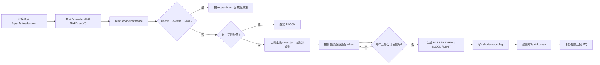
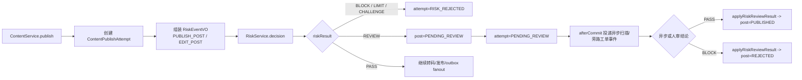
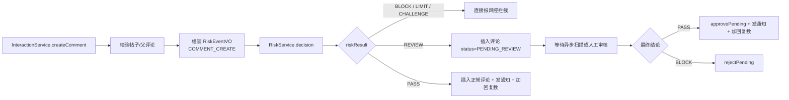
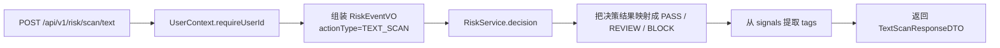
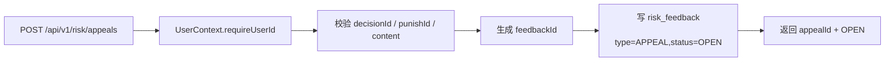
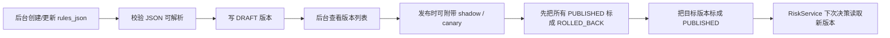
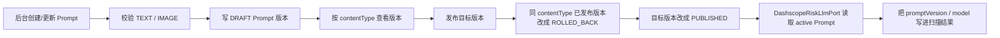
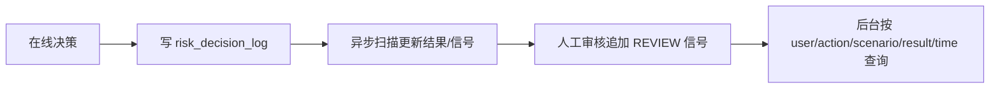
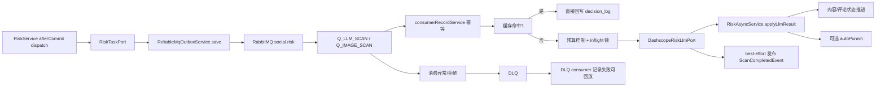

# 风控与信任治理中心领域分析

> 说明：本文只按源码事实整理。`风控与信任服务-实现方案.md`、`.codex` 草稿只拿来补背景；凡是和源码冲突的地方，一律以源码为准。

## 1. 领域定位

这个域不是“写几个审核接口”那么简单。它在当前代码里承担的是一整套治理中枢：

- 统一接住风险事件：把发帖、改帖、评论、文本扫描、图片扫描都收口成 `RiskEventVO`
- 给出风险结论：`PASS / REVIEW / BLOCK / LIMIT`
- 把结论记账：落 `risk_decision_log`
- 把需要人工处理的单子落地：写 `risk_case`
- 把处罚变成事实：写 `risk_punishment`
- 把申诉保存下来：写 `risk_feedback`
- 让规则和 Prompt 可以单独发布/回滚：`risk_rule_version`、`risk_prompt_version`
- 让异步扫描不拖慢在线接口：RabbitMQ + Outbox + DLQ

这个域自己不拥有帖子、评论这些业务主数据。帖子和评论的最终状态，仍然由内容域、互动域自己维护。风控域负责的是“判”“记”“罚”“审”“诉”，然后把结论推回去。

### 1.1 这个域真正拥有的核心数据

| 核心对象 | 代码里的实体/表 | 它解决什么问题 |
| --- | --- | --- |
| 风险事件 | `RiskEventVO` | 把不同业务动作统一成同一种输入 |
| 风险决策日志 | `RiskDecisionLogEntity` / `risk_decision_log` | 回答“为什么放/拦/审” |
| 人审工单 | `RiskCaseEntity` / `risk_case` | 承接 `REVIEW` 和 `PASS` 抽检 |
| 处罚事实 | `RiskPunishmentEntity` / `risk_punishment` | 回答“这个用户现在还能不能发” |
| 反馈/申诉 | `RiskFeedbackEntity` / `risk_feedback` | 承接用户申诉与人工结论 |
| 规则版本 | `RiskRuleVersionEntity` / `risk_rule_version` | 支持热发布、灰度、回滚 |
| Prompt 版本 | `RiskPromptVersionEntity` / `risk_prompt_version` | 支持 LLM 提示词追溯、回滚 |

### 1.2 领域边界

上游入口主要有：

- 用户侧风险接口：`RiskController`
- 后台治理接口：`RiskAdminController`
- 内容域发帖/改帖：`ContentService.publish(...)`
- 互动域评论创建：`InteractionService.createComment(...)`

下游回写主要有：

- 内容状态回写：`ContentService.applyRiskReviewResult(...)`
- 评论状态回写：`InteractionService.applyCommentRiskReviewResult(...)`
- 用户主页聚合展示：`UserProfilePageQueryService.query(...)` 会读取 `riskService.userStatus(...)`

### 1.3 一句话讲透这套设计

把用户动作统一成 `RiskEventVO`，先做低延迟决策并记账，再把慢、贵、不稳定的扫描放到异步里，最后把结论回写到内容/评论/处罚/申诉闭环。

## 2. 业务链路总表

| # | 链路 | 入口/核心类 | 结果落点 | 当前代码现状 |
| --- | --- | --- | --- | --- |
| 1 | 统一实时决策总入口 | `RiskController.decision`、`RiskService.decision` | `risk_decision_log`、可选 `risk_case`、MQ 任务 | 主链闭环 |
| 2 | 发帖/改帖接入风控 | `ContentService.publish` | 帖子状态、发布尝试状态、异步复判 | 主链闭环 |
| 3 | 评论接入风控 | `InteractionService.createComment` | 评论状态、通知/计数副作用 | 主链闭环 |
| 4 | 文本扫描 | `RiskController.textScan`、`RiskService.textScan` | 同步返回结果 + 决策日志 | 闭环，但不走异步 LLM |
| 5 | 图片扫描 | `RiskController.imageScan`、`RiskImageScanConsumer` | 返回 `taskId` + 更新决策日志 | 闭环偏工具化 |
| 6 | 用户能力状态 | `RiskController.userStatus`、`RiskService.userStatus` | `status` + `capabilities` | 闭环，但能力项较少 |
| 7 | 申诉提交 | `RiskController.appeal`、`RiskAppealService.submitAppeal` | `risk_feedback` | 闭环 |
| 8 | 规则版本管理 | `RiskAdminController`、`RiskAdminService` | `risk_rule_version` | 闭环 |
| 9 | Prompt 版本管理 | `RiskAdminController`、`DashscopeRiskLlmPort` | `risk_prompt_version` | 闭环 |
| 10 | 人审工单流转 | `RiskAdminController.list/assign/decision` | `risk_case`、`risk_decision_log`、业务回写 | 主链闭环 |
| 11 | 处罚治理 | `RiskAdminController.apply/revoke/list` | `risk_punishment` | 闭环 |
| 12 | 审计决策日志查询 | `RiskAdminController.listDecisions` | `risk_decision_log` | 闭环 |
| 13 | 申诉裁决 | `RiskAdminController.decideAppeal`、`RiskAppealService.decideAppeal` | `risk_feedback`、可选撤销处罚 | 闭环但回滚范围有限 |
| 14 | 异步扫描与 DLQ 兜底 | `RiskTaskPort`、MQ consumers、DLQ consumers | Outbox、消费者记录、DLQ 记录 | 主链闭环，但旁路消费不完整 |

## 3. 链路 1：统一实时决策总入口

**入口/核心类**

- HTTP 入口：`RiskController.decision`
- 核心服务：`RiskService.decision`
- 核心仓储：`RiskDecisionLogRepository`、`RiskCaseRepository`、`RiskPunishmentRepository`、`RiskRuleVersionRepository`
- 异步投递：`IRiskTaskPort` / `RiskTaskPort`

**要解决的问题**

不同业务动作不能各写一套风控。否则代码会变成一堆 if/else 补丁，而且重试、审计、回滚都做不稳。这个链路要做的是：把所有低频写动作先统一判一次，再决定要不要进人审、要不要进异步扫描。



**详细文本描述**

1. `RiskController` 先通过 `UserContext.requireUserId()` 拿到当前登录用户，然后把请求组装成 `RiskEventVO`。这里的核心字段是 `eventId`、`actionType`、`scenario`、`contentText`、`mediaUrls`、`targetId`、`extJson`。
2. `RiskService.normalize(...)` 做最基本的入参收口：`userId`、`eventId`、`actionType`、`scenario` 必填；图片列表最多保留 20 个；`occurTime` 为空就补当前时间。
3. 进入真正决策前，会先查 `risk_decision_log` 的唯一键 `(user_id, event_id)`。如果同一个 `eventId` 已经判过：
   - `requestHash` 一样：直接回放老结果
   - `requestHash` 不一样：拒绝执行，防止“拿同一个事件号偷换请求体”
4. 新请求先走处罚预检：
   - `LOGIN/REGISTER` 命中 `LOGIN_BAN`：直接 `BLOCK`
   - `PUBLISH_POST/EDIT_POST` 命中 `POST_BAN`：直接 `BLOCK`
   - `COMMENT_CREATE` 命中 `COMMENT_BAN`：直接 `BLOCK`
   - `DM_SEND` 命中 `DM_BAN`：直接 `BLOCK`
5. 如果没有活跃处罚，再加载生效规则：
   - 优先读 `risk_rule_version` 当前 `PUBLISHED` 版本
   - 如果没有，就退回内置 `DEFAULT_RULES_JSON`
6. 当前源码内置了 3 条默认规则：
   - `TEXT_LINK_BLOCK`：任意场景文本里出现链接，直接 `BLOCK`
   - `COMMENT_RATE_LIMIT_60S`：评论 60 秒超过阈值，返回 `LIMIT`
   - `POST_WITH_IMAGE_QUARANTINE`：发帖带图直接先 `REVIEW`
7. 规则命中后，不是立刻全生效。还要再过一层灰度判断：
   - 全局 `shadow=true`：只记信号，不真正拦
   - `canaryPercent` 灰度没命中：只记信号，不真正拦
   - 单条规则 `shadow=true`：只记信号，不真正拦
8. 只要有最终决策，就写一条 `risk_decision_log`。这是整套系统的审计主账本。
9. 如果结果需要人审，或者命中了 `PASS` 抽检，系统会同步写 `risk_case`。
10. 事务提交后，再把异步扫描、人审旁路事件这些慢动作投到 MQ。这样在线接口不会因为外部依赖抖动而拖死。

**实现方式为什么这么设计**

- 统一成 `RiskEventVO`，是为了消灭“每个业务写自己的一套风控 if/else”
- `eventId + requestHash`，是为了把重试变成安全动作，而不是重复处罚
- 在线链路不调 LLM，是为了把延迟、成本、不稳定都隔离出去
- 规则版本单独存表，是为了不发版也能改策略

**上游**

- `RiskController.decision` 直接接 HTTP 请求，并通过 `UserContext.requireUserId()` 固定当前登录用户
- 当前仓库里明确接入这条统一入口的业务方，主要是 `ContentService.publish(...)` 和 `InteractionService.createComment(...)`
- `DM_SEND / LOGIN / REGISTER` 在动作类型和处罚映射里已经预留，但当前仓库没有看到真实业务调用方

**下游**

- 同步主账本落到 `risk_decision_log`，需要人工处理时同步落 `risk_case`
- 事务提交后通过 `IRiskTaskPort / RiskTaskPort` 投递异步扫描和旁路事件，后续再由 MQ 消费者处理
- 处罚预检会读 `risk_punishment`，规则装载会读 `risk_rule_version`，异步/人工结果再按业务类型回写内容域和互动域

**相关技术栈、职责与原理**

- `Spring MVC`：负责把 HTTP 请求统一收口到 `RiskController`，再组装成 `RiskEventVO`。适合这里，因为不同业务动作只有先走同一个 Web 入口，鉴权、参数校验和入参整形才不会各写一套。
- `MyBatis + MySQL`：负责读 `risk_punishment`、`risk_rule_version`，写 `risk_decision_log`、`risk_case`。适合这里，因为风控最重要的是审计账本、唯一键幂等和事务一致性，关系库更稳。
- `规则版本`：负责把 `PUBLISHED / ROLLED_BACK`、`shadow`、`canaryPercent` 这些策略开关从代码里剥出来。适合这里，因为规则变化比应用发版快，版本化后才能安全灰度和回滚。
- `RabbitMQ + Outbox/事务后投递`：负责把异步扫描、人审旁路从同步决策里拆出去。适合这里，因为 LLM 和旁路处理都慢，提交后再发消息能避免“数据库写成功了但消息丢了”。

**STAR 面试讲法**

- S：内容发布、评论、扫描接口都需要风控，但外部 LLM 慢、贵、还可能失败，不能让在线接口等它
- T：做一个统一决策入口，既要低延迟，又要可审计、可灰度、可回放
- A：我把所有动作统一成 `RiskEventVO`，用 `eventId + requestHash` 做幂等，把处罚预检、规则引擎、审计日志、工单创建和异步投递收口到 `RiskService`
- R：同一个业务事件重试会拿到同一个 `decisionId`，所有决策都有审计日志，LLM 失败也不会拖慢在线主链

**亮点/兜底/一致性/性能点**

- 亮点：`when` 匹配器和 `then` 工厂拆开了，规则扩展不需要继续往 `RiskService` 里堆分支
- 一致性：`risk_decision_log` 的唯一键是 `(user_id, event_id)`，能挡住重复请求
- 兜底：没有发布规则版本时，系统不会空跑，而是退回内置默认规则
- 性能：在线链路只做“快判断”，慢动作全部挪到事务提交后的 MQ
- 当前代码现状：
  - 真正接入这个入口的业务方，仓库里只看到“发帖/改帖”和“评论创建”
  - `DM_SEND`、`LOGIN`、`REGISTER` 在契约和处罚映射里已经考虑，但当前仓库没有找到业务调用方
  - `RiskDecisionVO` 注释里提到 `CHALLENGE/SHADOWBAN`，但当前 `thenFactories` 只真正实现了 `allow/block/limit/quarantine`

## 4. 链路 2：发帖/改帖接入风控

**入口/核心类**

- 业务入口：`ContentService.publish(...)`
- 风控入口：`RiskService.decision(...)`
- 异步/人审回写：`RiskAsyncService.applyLlmResult(...)`、`RiskAdminService.applyCaseDecision(...)`
- 业务落点：`ContentService.applyRiskReviewResult(...)`

**要解决的问题**

发帖最怕两件事：一是坏内容直接放出去，二是风控太慢把发帖接口拖死。当前代码的做法是，先让内容域保存“发布尝试”，再由风控给出同步初判；需要复查的内容先隔离，不直接扩散。



**详细文本描述**

1. `ContentService.publish(...)` 先创建 `ContentPublishAttemptEntity`。这一步先记“尝试”，不是马上对外可见。
2. 之后再组装 `RiskEventVO`：
   - 新发帖：`actionType=PUBLISH_POST`
   - 改帖：`actionType=EDIT_POST`
   - `scenario=post.publish`
   - `extJson` 里会带上 `postId` 和 `attemptId`
3. 如果风控同步结果是 `BLOCK / LIMIT / CHALLENGE`：
   - 发布尝试状态直接推进为 `RISK_REJECTED`
   - 返回“风控拦截”
4. 如果同步结果是 `REVIEW`：
   - 帖子主表先写成 `STATUS_PENDING_REVIEW`
   - 保存内容历史版本
   - 发布尝试状态改成 `PENDING_REVIEW`
   - 事务提交后再去投异步扫描任务
5. 如果同步结果是 `PASS`：
   - 继续走原来的转码/发布链路
   - 只有真正发布成功后，才会通过 outbox 发出 `postPublished` 之类事件
6. 后续异步扫描或者人工审核给出最终结论后，会回调 `ContentService.applyRiskReviewResult(...)`
   - `PASS`：把帖子从 `PENDING_REVIEW` 推到 `PUBLISHED`
   - `BLOCK`：把帖子从 `PENDING_REVIEW` 推到 `REJECTED`
7. 这里还有一个关键的版本保护：
   - 回写时会检查 `expectedVersion`
   - 如果帖子状态或版本已经变了，就跳过，避免旧扫描结果把新版本帖子误回滚

**实现方式为什么这么设计**

- 让内容域继续拥有帖子状态，是为了边界清楚。风控域不直接改帖子表结构语义，只给结果
- 先记 `attemptId`，是为了让异步链路有稳定回写点
- `PENDING_REVIEW` 先隔离，再决定是否放行，是最稳的“先别扩散”策略
- 发布成功后的 fanout 走 outbox，是为了避免“帖子写成功了，但 MQ 事件丢了”

**上游**

- `ContentService.publish(...)` 是这条链路的真实业务入口，先落 `ContentPublishAttemptEntity`
- 内容域会把新发帖和改帖统一转成 `RiskEventVO`，其中 `actionType` 分别是 `PUBLISH_POST`、`EDIT_POST`
- `extJson` 明确带上 `postId`、`attemptId`，给后面的异步和人工回写提供定位点

**下游**

- 同步决策先影响发布尝试状态，以及帖子主表的 `PENDING_REVIEW / PUBLISHED / REJECTED`
- `REVIEW` 会在事务提交后触发异步扫描；人工裁决或异步复判最终都走 `ContentService.applyRiskReviewResult(...)`
- 只有最终 `PASS` 后，内容域才继续走转码、发布和 outbox fanout，不会先扩散再回滚

**相关技术栈、职责与原理**

- `MyBatis + MySQL`：负责写 `ContentPublishAttempt`、帖子状态和内容历史版本。适合这里，因为发帖本质是状态流转，数据库里有明确的中间态，异步回写也能找到稳定对象。
- `统一决策服务 + 规则版本`：负责同步快判，先用处罚和规则把高风险帖子拦在入口。适合这里，因为发帖要先快返回，再把慢判断拆出去。
- `RabbitMQ + Outbox/异步扫描`：负责 `REVIEW` 后的慢复判，以及最终通过后的 fanout。适合这里，因为这样能同时避免“用户请求被模型拖死”和“帖子已写库但事件没发出去”。
- `版本号保护(expectedVersion)`：负责阻止旧的异步结果回滚新的帖子版本。适合这里，因为改帖天然会有多版本并发，必须用版本保护挡住误回写。

**STAR 面试讲法**

- S：带图发帖最容易踩雷，但 LLM 又慢，不能让用户一直转圈
- T：要做到“同步快返回、异步再复判、最终可追溯”
- A：我把发帖先落 `ContentPublishAttempt`，同步只做快判；命中 `REVIEW` 就让帖子进 `PENDING_REVIEW`，异步或人工最后再把它推到 `PUBLISHED` 或 `REJECTED`
- R：系统不会把高风险内容直接发出去，同时也不会让用户请求被外部模型卡住

**亮点/兜底/一致性/性能点**

- 一致性：`attemptId` 写进 `extJson`，后面异步和人审都能精确回写同一条发布尝试
- 亮点：内容历史版本和风控回写结合，能兼顾“改帖审核”和“回滚安全”
- 兜底：即使 afterCommit 没有事务上下文，代码也会走 best effort 的兜底投递
- 性能：真正的 fanout 只在最终通过后才触发，减少“先发再删”的无效扩散
- 当前代码现状：
  - “带图发帖默认隔离”不是文档设想，而是源码默认规则 `POST_WITH_IMAGE_QUARANTINE`
  - 最终 `PASS/BLOCK` 不是同步 LLM 算出来的，而是靠异步扫描或人工复核来补全

## 5. 链路 3：评论接入风控

**入口/核心类**

- 业务入口：`InteractionService.createComment(...)`
- 风控入口：`RiskService.decision(...)`
- 异步/人审回写：`RiskAsyncService.applyLlmResult(...)`、`RiskAdminService.applyCaseDecision(...)`
- 业务落点：`InteractionService.applyCommentRiskReviewResult(...)`

**要解决的问题**

评论链路最麻烦的不是“拦不拦”，而是“副作用什么时候发”。如果先发通知、先加回复数，后面再说这条评论违规，系统就会到处打补丁。当前源码是先判，再决定要不要把评论真正扩散出去。



**详细文本描述**

1. 评论创建前，系统会先做帖子、父评论合法性校验。
2. 通过校验后，组装 `RiskEventVO`：
   - `eventId=commentId`
   - `actionType=COMMENT_CREATE`
   - `scenario=comment.create`
   - `extJson` 里会保存 `commentId`、`postId`、`parentId`
3. 风控同步结果如果是 `BLOCK / LIMIT / CHALLENGE`：
   - 直接抛异常“风控拦截”
   - 评论不会入库
4. 如果同步结果是 `REVIEW`：
   - 评论会入库，但状态是 `COMMENT_STATUS_PENDING_REVIEW`
   - 这时不会发创建事件、不会发通知、不会加楼中楼回复数
5. 如果同步结果是 `PASS`：
   - 评论按正常状态插入
   - 同步发布 `COMMENT_CREATED`、通知事件、回复数变更等副作用
6. 后面异步/人工复判时走 `applyCommentRiskReviewResult(...)`
   - `PASS`：把待审评论批准，并补发通知、回复数变更
   - `BLOCK`：把待审评论拒绝

**实现方式为什么这么设计**

- 评论副作用很多，先隔离再放行，比“先发出去再回滚所有通知和计数”简单得多
- 评论 ID 先生成、先入库，是为了让后续异步和人工审核有稳定对象可回写
- 风控域不直接控制评论通知和计数，而是把最终结论交回互动域执行

**上游**

- `InteractionService.createComment(...)` 先做帖子、父评论合法性校验，再决定是否进入风控
- 互动域会把评论动作组装成 `RiskEventVO`，核心标识是 `commentId`，并把 `postId`、`parentId` 塞进 `extJson`
- 当前仓库里明确接入统一风控入口的互动动作，就是“评论创建”

**下游**

- 同步 `BLOCK / LIMIT / CHALLENGE` 会直接终止评论创建，评论不会入库
- `REVIEW` 时评论先以 `COMMENT_STATUS_PENDING_REVIEW` 入库，异步/人工结论再走 `applyCommentRiskReviewResult(...)`
- 只有最终 `PASS`，互动域才会发通知、发 `COMMENT_CREATED` 事件、增加回复数等副作用

**相关技术栈、职责与原理**

- `MyBatis + MySQL`：负责落评论记录和待审状态。适合这里，因为评论副作用多，先把“评论对象”稳稳落库，后续异步和人工才能围着同一个对象回写。
- `统一决策服务 + 处罚预检`：负责在评论真正扩散前做同步快判。适合这里，因为 `COMMENT_BAN` 这类硬拦截就该放在最前面，别让后面副作用先跑出去。
- `RabbitMQ + 异步扫描`：负责把慢的文本/图片复判移到后台。适合这里，因为评论链路要先保证通知和计数不会误发，再补慢判断。
- `待审状态幂等回写`：负责只处理“当前仍是待审”的评论。适合这里，因为异步消息和人工操作都可能重试，状态机要能自然挡住重复回写。

**STAR 面试讲法**

- S：评论比发帖更敏感，因为一条评论会触发通知、回复数、Feed 展示
- T：要做到评论风险可控，同时不能让副作用乱飞
- A：我把评论接入统一风控入口，`REVIEW` 时只写待审评论，不发任何副作用；最后 `PASS` 才统一补发
- R：避免了“通知发出去了再撤回”的脏数据问题，链路更稳也更好解释

**亮点/兜底/一致性/性能点**

- 亮点：评论副作用和最终审核结论强绑定，避免事后补偿风暴
- 一致性：`applyCommentRiskReviewResult` 只处理“当前仍是待审状态”的评论，重复回写会被跳过
- 性能：同步链路只做快判，真正慢的文本/图片复判放到异步
- 当前代码现状：
  - 这里真正接入的是“评论创建”，不是所有互动动作
  - 当前仓库没有看到点赞、关注等高频动作走统一决策入口

## 6. 链路 4：文本扫描

**入口/核心类**

- HTTP 入口：`RiskController.textScan`
- 核心服务：`RiskService.textScan`

**要解决的问题**

给调用方一个轻量的“这段文本干不干净”能力，同时别再单独维护一套扫描逻辑。当前代码直接复用统一决策入口，这样每次文本扫描也会留下审计记录。



**详细文本描述**

1. `RiskController.textScan(...)` 会从登录上下文拿 `userId`。请求体里虽然也有 `userId` 字段，但控制器没有用它。
2. `RiskService.textScan(...)` 会构造一个新的 `RiskEventVO`：
   - `eventId=scan_text_{id}`
   - `actionType=TEXT_SCAN`
   - `scenario` 默认是 `text.scan`
3. 这个事件继续走统一 `decision(...)`，所以也会写 `risk_decision_log`。
4. 返回给调用方时：
   - `BLOCK` 原样返回 `BLOCK`
   - `REVIEW` 原样返回 `REVIEW`
   - 其他结果统一映射成 `PASS`
5. `tags` 来自命中的 `RiskSignalVO.tags`，如果一个标签都没有，就返回 `clean`

**实现方式为什么这么设计**

- 复用统一决策入口，能避免再维护一套“扫描专用规则机”
- 文本扫描也落审计，是为了后面能解释“为什么这段文本当时判成这样”
- 对外只暴露 `PASS / REVIEW / BLOCK`，是为了让调用方接口更简单

**上游**

- `RiskController.textScan` 是直接用户入口，请求里真正生效的用户身份来自 `UserContext.requireUserId()`
- 控制器把文本请求收口成 `TEXT_SCAN` 的 `RiskEventVO`，默认 `scenario=text.scan`
- 这条链路没有接业务主域对象，它更像“规则扫描工具接口”

**下游**

- 内部直接复用 `RiskService.decision(...)`，因此会写 `risk_decision_log`
- 对外只同步返回 `PASS / REVIEW / BLOCK` 和 `tags`，不会创建业务对象，也不会回写内容域、互动域
- 当前实现明确不投异步 LLM 扫描，所以这条链路在这里就结束

**相关技术栈、职责与原理**

- `Spring MVC`：负责暴露一个轻量文本扫描接口。适合这里，因为调用方需要一个简单同步 API，不需要知道内部完整风控链。
- `统一决策服务 + 规则版本`：负责让扫描结果和正式风控决策共用同一套规则口径。适合这里，因为一旦扫描规则和主决策分家，后面解释口径就会乱。
- `MyBatis + MySQL`：负责把扫描也记进 `risk_decision_log`。适合这里，因为文本扫描虽然是工具接口，但风控系统仍然需要留审计证据。
- `同步规则判断`：负责把结果控制在低延迟内返回。适合这里，因为文本扫描场景要的是快反馈，不是完整大模型审核流水线。

**STAR 面试讲法**

- S：历史上很多系统会把“文本扫描接口”和“业务决策接口”做成两套，最后口径越跑越偏
- T：我要让扫描结果和正式风控决策用同一套规则与审计账本
- A：我让 `textScan` 内部直接走 `RiskService.decision(...)`，只在最后做一层结果和标签格式化
- R：调用方拿到的是简洁结果，平台拿到的是统一审计和统一规则口径

**亮点/兜底/一致性/性能点**

- 亮点：扫描接口不是旁路逻辑，而是复用主链
- 一致性：扫描结果和正式决策共用同一套规则数据
- 兜底：即使没命中任何标签，也返回 `clean`，调用方不用自己判空
- 当前代码现状：
  - 这条链路只走同步规则判断，不会投异步 LLM 扫描
  - 所以它更像“规则扫描 + 审计”，不是“完整大模型文本审核”

## 7. 链路 5：图片扫描

**入口/核心类**

- HTTP 入口：`RiskController.imageScan`
- 同步服务：`RiskService.imageScan`
- 异步消费者：`RiskImageScanConsumer`
- 模型适配：`DashscopeRiskLlmPort`
- 结果回写：`RiskAsyncService.applyLlmResult`

**要解决的问题**

图片扫描天然比纯文本更慢、更贵，所以不能让接口同步等待模型。当前代码选择“先返回 `taskId`，结果异步写回决策日志”。

```mermaid
flowchart LR
    A[POST /api/v1/risk/scan/image] --> B[校验 imageUrl]
    B --> C[RiskService.imageScan 生成 taskId]
    C --> D[先写一条 REVIEW 决策日志]
    D --> E[afterCommit 投递 ImageScanRequestedEvent]
    E --> F[RiskImageScanConsumer]
    F --> G[缓存/预算/锁/读图 URL 处理]
    G --> H[DashscopeRiskLlmPort.scanImage]
    H --> I[RiskAsyncService.applyLlmResult]
    I --> J[best-effort 发布 ScanCompletedEvent]
```



**详细文本描述**

1. `RiskService.imageScan(...)` 先校验 `imageUrl` 是否为空。
2. 然后生成一个 `taskId`，并把这次请求转成 `RiskEventVO`：
   - `eventId=taskId`
   - `actionType=IMAGE_SCAN`
   - `scenario=image.scan`
3. 这里同步不会真正做模型扫描，而是先造一条“占位决策”：
   - `result=REVIEW`
   - `reasonCode=IMAGE_ASYNC`
   - `actions` 里放一个 `REVIEW_CREATE`
4. 这条占位决策会照样写进 `risk_decision_log`，保证这次扫描有账可查。
5. 事务提交后，系统投递 `ImageScanRequestedEvent` 到图片扫描队列。
6. `RiskImageScanConsumer` 消费后，会做几层保护：
   - 用 `consumerRecordService` 做消费幂等
   - 先查结果缓存
   - 再做分钟级预算控制
   - 再做 inflight 锁，防止同一张图并发重复扫描
   - 如果图片不是直接 URL，而是存储 token，会先通过 `mediaStoragePort.generateReadUrl(...)` 转成可读 URL
7. 最终调 `DashscopeRiskLlmPort.scanImage(...)` 得到 `RiskLlmResultVO`，再由 `RiskAsyncService` 更新这条 `decision_log`

**实现方式为什么这么设计**

- 图片扫描慢，所以只能异步
- 即使是纯工具接口，也先落决策日志，这样以后能查历史
- 模型侧读的是“可读 URL”，而不是业务内部 token，边界更清楚

**上游**

- `RiskController.imageScan` 先校验 `imageUrl`，再进入 `RiskService.imageScan(...)`
- 同步入口会先生成 `taskId`，并把请求统一成 `actionType=IMAGE_SCAN`、`scenario=image.scan` 的 `RiskEventVO`
- 如果传进来的不是直接可读 URL，后续消费者会通过 `mediaStoragePort.generateReadUrl(...)` 转成模型可访问地址

**下游**

- 同步先写一条 `result=REVIEW`、`reasonCode=IMAGE_ASYNC` 的占位 `risk_decision_log`
- 事务提交后投递 `ImageScanRequestedEvent`，由 `RiskImageScanConsumer` 消费，再调用 `DashscopeRiskLlmPort.scanImage(...)`
- 扫描结果最终由 `RiskAsyncService.applyLlmResult(...)` 回写原日志，并 best effort 发布 `ScanCompletedEvent`；这条链路不会回写内容域、互动域

**相关技术栈、职责与原理**

- `Spring MVC`：负责提供同步返回 `taskId` 的图片扫描入口。适合这里，因为用户侧只需要先拿到受理结果，不该同步等待模型。
- `RabbitMQ + Outbox/异步扫描`：负责把真正的图片审核丢到后台消费者执行。适合这里，因为图片审核慢、贵、还会失败，必须和在线接口解耦。
- `可靠消费记录`：负责用 `consumerRecordService` 做消费幂等。适合这里，因为同一张图的消息可能重投，幂等记录能避免重复烧模型成本。
- `LLM 端口 + Prompt 版本`：`DashscopeRiskLlmPort` 负责封装具体模型调用，并读取当前激活 Prompt。适合这里，因为这样可以换 Prompt、换模型，但上层链路不用跟着改。
- `DLQ`：负责接住消费失败、预算超额后的失败消息。适合这里，因为图片扫描不是强实时接口，失败后更需要留痕和回放，而不是静默丢弃。

**STAR 面试讲法**

- S：图片审核比文本更慢，如果同步等模型，用户体验会很差
- T：我要保留图片审核能力，但不影响在线接口响应
- A：我把图片扫描拆成“同步只记账并返回 taskId，异步消费者再做真正模型扫描”，同时加了缓存、预算器和并发锁
- R：接口足够快，模型成本也被控制住，失败时还能进入 DLQ 留痕

**亮点/兜底/一致性/性能点**

- 亮点：专门有一条图片扫描队列，不和文本业务复判混在一起
- 性能：用 `SHA-256(url)` 做缓存键，重复图片不会重复烧模型钱
- 兜底：预算超额、URL 为空、模型返回空结果时，都会降级成 `REVIEW + QUARANTINE`
- 当前代码现状：
  - 这条链路返回了 `taskId`，但当前仓库里没有找到“按 taskId 查扫描结果”的用户接口
  - 同步占位决策里的 `actions=REVIEW_CREATE` 只是描述动作，实际不会创建 `risk_case`，因为 `IMAGE_SCAN` 不在 `needReviewCase(...)` 范围内
  - 这条链路只更新 `risk_decision_log`，不会回写内容域/互动域，因为它本来就不是业务对象扫描

## 8. 链路 6：用户能力状态

**入口/核心类**

- 用户接口：`RiskController.userStatus`
- 核心服务：`RiskService.userStatus`
- 读侧聚合：`UserProfilePageQueryService.query`

**要解决的问题**

前台和后台都要知道“这个用户现在还能不能发帖、评论、登录”。当前代码没有去维护一堆分散状态，而是直接从处罚事实表现算。

```mermaid
flowchart LR
    A[GET /api/v1/risk/user/status] --> B[UserContext.requireUserId]
    B --> C[RiskService.userStatus]
    C --> D[listActiveByUser(now)]
    D --> E[按处罚类型删减 capabilities]
    E --> F[产出 NORMAL / FROZEN]
    F --> G[返回 status + capabilities]
```

**详细文本描述**

1. `RiskController.userStatus(...)` 同样只认登录态，不认请求里的 `userId`。
2. `RiskService.userStatus(...)` 会查 `risk_punishment` 当前仍然活跃的处罚。
3. 初始能力默认是 `POST` 和 `COMMENT`。
4. 如果命中：
   - `POST_BAN`：删掉 `POST`
   - `COMMENT_BAN`：删掉 `COMMENT`
   - `LOGIN_BAN`：直接把 `status` 标成 `FROZEN`
5. 如果能力列表被删空了，也会把状态标成 `FROZEN`
6. 这套能力不仅给风险接口用，`UserProfilePageQueryService` 也会把目标用户的风险能力聚合到个人主页返回结果里

**实现方式为什么这么设计**

- 用处罚事实反推能力，比在多个表里维护冗余状态更稳
- 风控读侧和拦截侧共用同一张事实表，解释成本低
- 个人主页聚合直接复用风险服务，避免再造一套“用户风险摘要”逻辑

**上游**

- `RiskController.userStatus` 是用户直接查询入口，实际用户身份同样来自登录态
- `UserProfilePageQueryService.query(...)` 也会复用这条能力查询，把风险状态聚合进个人主页
- 这条链路不依赖业务方主动传状态，而是统一从风控事实表反推

**下游**

- 直接返回 `status + capabilities` 给前台或后台调用方
- 结果会影响前台的能力展示，也给后续用户解释“为什么不能发帖/评论”提供统一口径
- 再往深一层看，这条链路和实时拦截共享同一批处罚事实，所以处罚撤销后这里也会同步体现

**相关技术栈、职责与原理**

- `Spring MVC`：负责提供简单的状态查询接口。适合这里，因为前台和聚合服务都只需要一个稳定读接口，不需要知道处罚表细节。
- `MyBatis + MySQL`：负责从 `risk_punishment` 查询当前活跃处罚。适合这里，因为能力状态本质是处罚事实的投影，直接查事实表最稳。
- `处罚闭环`：负责把“施加处罚 -> 用户受限 -> 查询可解释 -> 后续可撤销”串成一条线。适合这里，因为如果查询和拦截不是同一数据源，用户看到的状态就会和真实限制打架。
- `读侧聚合复用`：负责让 `UserProfilePageQueryService` 直接拿风险能力。适合这里，因为风险摘要不该在别的域再复制一份，复用同一服务口径更一致。

**STAR 面试讲法**

- S：用户会问“我为什么不能评论”，产品也要在主页上展示风险状态
- T：我要提供一个简单、稳定、可解释的用户能力查询
- A：我把能力状态直接从 `risk_punishment` 的活跃处罚算出来，不做额外状态镜像
- R：前后台都能拿到同一套解释口径，且处罚生效后会立即影响后续决策

**亮点/兜底/一致性/性能点**

- 一致性：同一张处罚表同时服务“实时拦截”和“前台展示”
- 亮点：用户主页聚合服务已经把风险能力接进来了，不是孤立接口
- 当前代码现状：
  - `capabilities` 目前只返回 `POST`、`COMMENT`，不会返回 `DM`
  - `LOGIN_BAN` 只能反映到 `status=FROZEN`，不是细粒度 capability
  - 代码里有 `risk:status:{userId}` 缓存失效逻辑，但当前读路径没有真正使用这个缓存

## 9. 链路 7：申诉提交

**入口/核心类**

- HTTP 入口：`RiskController.appeal`
- 核心服务：`RiskAppealService.submitAppeal`
- 仓储：`RiskFeedbackRepository`

**要解决的问题**

风控系统如果只会处罚，不会接申诉，误杀就没有地方纠偏。当前实现先把申诉变成一条明确的事实记录，后面再由后台裁决。



**详细文本描述**

1. 用户提交申诉时，必须至少带一个关联对象：
   - `decisionId`
   - 或 `punishId`
2. 申诉理由 `content` 必填。
3. `RiskAppealService.submitAppeal(...)` 会生成 `feedbackId`，写一条：
   - `type=APPEAL`
   - `status=OPEN`
4. 返回给前端的是：
   - `appealId`
   - `status=OPEN`

**实现方式为什么这么设计**

- 申诉先入库，等于先把“用户不同意这次判定”记成事实
- 申诉和处罚、决策日志分表，避免把“原始判定”和“后续纠偏”混成一锅
- 这个链路不直接改处罚，是为了让人工裁决保留最后决定权

**上游**

- `RiskController.appeal` 是用户提交申诉的唯一入口
- 用户必须至少带一个关联对象，`decisionId` 或 `punishId` 二选一，再带上申诉理由 `content`
- 这条链路接的是用户对已有风控结果的不认可，不重新触发一遍风控判断

**下游**

- `RiskAppealService.submitAppeal(...)` 会写一条 `type=APPEAL`、`status=OPEN` 的 `risk_feedback`
- 返回前端的是 `appealId + OPEN`，后续再由后台链路继续裁决
- 当前实现不会自动建工单、不会自动通知审核人，也不会立即改处罚

**相关技术栈、职责与原理**

- `Spring MVC`：负责把用户申诉表单收口成标准接口。适合这里，因为申诉入口需要稳定、简单，避免把后台裁决细节暴露给前台。
- `MyBatis + MySQL`：负责把申诉作为事实写入 `risk_feedback`。适合这里，因为申诉天然需要留痕、可追溯，关系库最适合保存这种状态流转记录。
- `处罚与申诉闭环`：负责把“用户不服 -> 申诉入库 -> 后台裁决 -> 可选撤销处罚”拆成两段。适合这里，因为申诉提交不该直接翻案，必须给人工留最后裁决权。
- `事实分表`：负责把原始风控结论、处罚事实、申诉事实分开存。适合这里，因为这样后面统计误杀率、申诉通过率时不会把数据搅混。

**STAR 面试讲法**

- S：风控一定会有误杀，没有申诉入口，系统就没有纠偏能力
- T：我要先把申诉标准化落库，再交给后台处理
- A：我把申诉设计成 `risk_feedback` 表的一种 `type=APPEAL` 记录，只做事实入库，不做直接翻案
- R：链路简单、稳定，也给后面复盘误杀率留了数据基础

**亮点/兜底/一致性/性能点**

- 亮点：申诉和原始决策分开存，数据关系清楚
- 一致性：既支持按 `decisionId` 申诉，也支持按 `punishId` 申诉
- 当前代码现状：
  - 这里只是写库，不会自动通知审核人，不会自动入队
  - 当前代码没有做“同一用户对同一处罚重复申诉”的幂等去重

## 10. 链路 8：规则版本管理

**入口/核心类**

- 后台入口：`RiskAdminController` 的规则版本接口
- 核心服务：`RiskAdminService.upsertRuleVersion / listRuleVersions / publishRuleVersion / rollbackRuleVersion`
- 仓储：`RiskRuleVersionRepository`
- 使用方：`RiskService.loadActiveRules`

**要解决的问题**

风控规则变更比业务发版快得多。如果每改一条规则都要改 Java 代码、重发版，治理团队根本跑不动。当前代码把规则版本化，允许单独发布、灰度、回滚。



**详细文本描述**

1. 创建/更新规则版本：
   - 不传 `version`：创建新版本，版本号=`maxVersion + 1`
   - 传了 `version`：只能更新当前还是 `DRAFT` 的版本
2. 列表接口支持 `includeRulesJson=false`，避免大字段把列表接口拖慢。
3. 发布时，`RiskAdminService.publishRuleVersion(...)` 可以把 3 个灰度参数打进 `rules_json`：
   - `shadow`
   - `canaryPercent`
   - `canarySalt`
4. 真正发布时，仓储层会先把所有当前 `PUBLISHED` 版本统一改成 `ROLLED_BACK`，再把目标版本改成 `PUBLISHED`。
5. `RiskService.loadActiveRules()` 每次决策都读当前生效版本，所以规则发布后不需要等应用重启。

**实现方式为什么这么设计**

- 把规则存成 JSON，是为了让策略团队调规则，不必每次找研发改代码
- `DRAFT -> PUBLISHED -> ROLLED_BACK` 的状态机很简单，适合治理后台
- 把灰度参数一起写进 `rules_json`，能避免“规则内容”和“灰度开关”分散两处导致配置漂移

**上游**

- `RiskAdminController` 提供规则版本的创建、更新、列表、发布、回滚入口
- 治理运营或后台管理员通过这些接口维护 `rules_json`
- 编辑阶段只允许操作 `DRAFT`，避免直接碰线上生效规则

**下游**

- 规则版本最终落到 `risk_rule_version`
- 发布后，`RiskService.loadActiveRules()` 在下一次实时决策时就会读取新的 `PUBLISHED` 版本
- 如果线上版本有问题，后台可以把它回滚成旧版本，在线决策随即跟着切回去

**相关技术栈、职责与原理**

- `Spring MVC`：负责暴露治理后台的规则管理接口。适合这里，因为规则运营需要一套明确的后台入口，而不是手改配置文件。
- `MyBatis + MySQL`：负责保存 `risk_rule_version` 和 `DRAFT / PUBLISHED / ROLLED_BACK` 状态机。适合这里，因为规则版本需要事务切换和历史保留，关系库天然适合做版本主账本。
- `规则版本`：负责把 `rules_json`、`shadow`、`canaryPercent`、`canarySalt` 放进同一个版本对象。适合这里，因为规则内容和灰度参数本来就应该一起发布、一起回滚。
- `实时装载`：负责让 `RiskService` 每次决策都读取当前激活版本。适合这里，因为策略切换要快，不应该依赖应用重启或重新发版。

**STAR 面试讲法**

- S：风控规则调优频繁，如果依赖业务发版，响应太慢，误杀/漏放也不好止血
- T：我要让规则独立发布，并支持影子和灰度
- A：我把规则做成版本表，编辑只允许 DRAFT，发布时再把 shadow/canary 补进规则集并切换 active version
- R：策略切换不需要代码发版，问题规则也能快速回滚

**亮点/兜底/一致性/性能点**

- 亮点：支持 `shadow + canaryPercent + canarySalt` 三件套，是比较成熟的策略开闸做法
- 一致性：编辑时只允许 DRAFT，避免线上已发布版本被偷偷改内容
- 兜底：即使没有已发布版本，风险服务也会退回默认规则，不会完全裸奔
- 当前代码现状：
  - `rollback` 默认会找最近的 `ROLLED_BACK` 版本，不会帮你“从 DRAFT 里挑一个”
  - 版本列表和回滚逻辑完全基于 MySQL，没有二级缓存

## 11. 链路 9：Prompt 版本管理

**入口/核心类**

- 后台入口：`RiskAdminController` 的 Prompt 版本接口
- 核心服务：`RiskAdminService.upsertPromptVersion / listPromptVersions / publishPromptVersion / rollbackPromptVersion`
- 仓储：`RiskPromptVersionRepository`
- 使用方：`DashscopeRiskLlmPort`

**要解决的问题**

Prompt 变更和规则变更不是一回事。规则更像硬校规，Prompt 更像“老师给模型的批改标准”。两者改动节奏不一样，所以要分开管理。



**详细文本描述**

1. Prompt 版本比规则版本多一个关键维度：`contentType`
   - `TEXT`
   - `IMAGE`
2. 创建逻辑和规则版本类似：
   - 不传 `version` 就新建
   - 传 `version` 只能更新 `DRAFT`
3. 但 Prompt 版本有两个额外约束：
   - `contentType` 只能是 `TEXT/IMAGE`
   - 更新已有版本时，不允许改 `contentType`
4. 发布时只会回滚同 `contentType` 下已发布的版本，不会互相影响。
5. `DashscopeRiskLlmPort` 调模型前会读当前激活 Prompt：
   - 没有激活版本也能工作，只是没有自定义 Prompt
   - 如果 Prompt 版本里带了 `model`，优先用这个模型名
6. 模型返回结果后，会把 `promptVersion` 和 `model` 一起填回 `RiskLlmResultVO`，方便追溯

**实现方式为什么这么设计**

- Prompt 变化快、实验多，必须单独做版本管理
- 文本和图片模型的提示词差异很大，所以 `TEXT/IMAGE` 必须分开
- 把 `promptVersion` 写进结果，是为了后面能回答“这次误杀是不是某个 Prompt 版本造成的”

**上游**

- `RiskAdminController` 提供 Prompt 的创建、更新、列表、发布、回滚入口
- 后台维护时必须区分 `TEXT / IMAGE` 两种 `contentType`
- 编辑阶段同样只允许修改 `DRAFT` 版本，不直接改线上 Prompt

**下游**

- Prompt 版本最终落到 `risk_prompt_version`
- `DashscopeRiskLlmPort` 在真正调用模型前会读取当前激活 Prompt
- 模型结果会把 `promptVersion` 和 `model` 一起回写到 `RiskLlmResultVO`，供异步回写和审计链继续使用

**相关技术栈、职责与原理**

- `Spring MVC`：负责提供后台 Prompt 管理接口。适合这里，因为 Prompt 调整频繁，需要独立治理入口，而不是混在代码发版里。
- `MyBatis + MySQL`：负责持久化 `risk_prompt_version` 的版本和状态。适合这里，因为 Prompt 也需要像规则一样可追溯、可回滚。
- `Prompt 版本`：负责把文本 Prompt 和图片 Prompt 分开治理。适合这里，因为两类内容的提示词结构天然不同，混在一起会让实验和定位都失真。
- `LLM 端口`：`DashscopeRiskLlmPort` 负责在调用前读取激活 Prompt，并把实际使用的 `model/promptVersion` 带回结果。适合这里，因为这样模型适配和 Prompt 治理解耦，上层链路只关心审核结果。

**STAR 面试讲法**

- S：LLM 风控不是只换模型，Prompt 微调也会显著影响结果
- T：我要把 Prompt 变更纳入可审计、可回滚的治理链路
- A：我做了独立 Prompt 版本表，按 `TEXT/IMAGE` 分开发布；模型调用前读取 active Prompt，结果里回写 `promptVersion/model`
- R：模型效果变化可以和 Prompt 版本直接对账，排查问题不再靠猜

**亮点/兜底/一致性/性能点**

- 亮点：Prompt 和规则版本完全解耦，职责清楚
- 一致性：同一 `contentType` 只允许一个激活版本
- 兜底：没有激活 Prompt 时，仍然能用默认系统提示词工作
- 当前代码现状：
  - `publishPromptVersion` 的请求 DTO 里只有一个预留字段，当前没有额外发布参数
  - 默认回滚目标是“最近一个同类型 `ROLLED_BACK` 版本”

## 12. 链路 10：人审工单流转（列表 / 分配 / 裁决）

**入口/核心类**

- 工单创建：`RiskService.tryCreateCase`
- 后台入口：`RiskAdminController.listCases / assignCase / decideCase`
- 核心服务：`RiskAdminService`
- 仓储：`RiskCaseRepository`
- 决策回写：`RiskDecisionLogRepository`、`ContentService`、`InteractionService`

**要解决的问题**

光有机器判定不够。`REVIEW` 场景和 `PASS` 抽检场景都需要人来兜底，而且人审流程最怕抢单冲突、重复结案、结果回写不一致。

```mermaid
flowchart LR
    A[RiskService.persist] --> B{REVIEW 或 PASS 抽检?}
    B -- 是 --> C[insertIgnore risk_case OPEN]
    C --> D[后台按状态/队列/时间查询工单]
    D --> E[assignCase(expectedStatus=OPEN)]
    E --> F[工单变 ASSIGNED]
    F --> G[decideCase PASS / BLOCK]
    G --> H[finish case -> DONE]
    H --> I[更新 risk_decision_log]
    I --> J[回写内容/评论状态]
    J --> K[可选追加处罚]
```

**详细文本描述**

1. 工单创建不是看 `actions` 文本，而是看 `RiskService.tryCreateCase(...)` 的判断：
   - `REVIEW` 且动作类型是 `PUBLISH_POST / EDIT_POST / COMMENT_CREATE / DM_SEND`，会建工单
   - `PASS` 但命中抽检，也会建 `queue=sample` 工单
2. 工单写库时用了 `insertIgnore + uk_decision`，保证同一个 `decisionId` 最多只有一张工单。
3. 列表查询支持：
   - `status`
   - `queue`
   - `beginTime / endTime`
   - 分页
4. 分配工单时，`assignCase(...)` 默认要求工单当前还是 `OPEN`，SQL 会做状态匹配保护。
5. 裁决工单时，`decideCase(...)` 只接受两种最终结果：
   - `PASS`
   - `BLOCK`
6. 裁决成功后会做 3 件事：
   - 把 `risk_case` 状态推进到 `DONE`
   - 在 `risk_decision_log.signals_json` 里追加一条 `source=REVIEW` 的人工信号
   - 如果是帖子/评论，就把最终结论回写到对应业务域
7. 如果管理员在工单裁决时还带了 `punishType + punishDurationSeconds`，系统会顺手写处罚

**实现方式为什么这么设计**

- 工单状态机只保留 `OPEN / ASSIGNED / DONE` 三态，简单但够用
- `expectedStatus` 是乐观锁，避免多人同时认领、同时提交
- 人工裁决不重新造一条新决策，而是回写原 `decision_log`，这样审计链不断裂

**上游**

- 工单来源有两类：一类是 `RiskService.tryCreateCase(...)` 对 `REVIEW` 场景建单，另一类是 `PASS` 抽检建 `sample` 工单
- 后台管理员通过 `RiskAdminController.listCases / assignCase / decideCase` 操作工单
- 当前仓库里虽然也投了 `ReviewCaseCreatedEvent`，但主链工单并不依赖 MQ consumer 才能落账

**下游**

- 工单主账本落到 `risk_case`，并通过 `decisionId` 绑定原决策
- 裁决完成后会更新 `risk_decision_log`，对帖子/评论还会回写业务状态
- 如果管理员同时给了处罚参数，还会继续写 `risk_punishment`，把人工结论推进到处罚链路

**相关技术栈、职责与原理**

- `Spring MVC`：负责提供工单列表、分配、裁决这些后台接口。适合这里，因为人工治理天然是后台工作流，不该让调用方绕过控制器直接改库。
- `MyBatis + MySQL`：负责保存 `risk_case` 三态流转，并用 `insertIgnore + uk_decision`、`expectedStatus` 保证不重复建单、不重复抢单。适合这里，因为人工流程最怕并发冲突，数据库条件更新最直接。
- `审计日志回写`：负责把人工信号追加回原 `risk_decision_log`。适合这里，因为人工和机器需要是一条连续时间线，而不是两套账。
- `处罚闭环`：负责在人工裁决时可选追加处罚。适合这里，因为很多高风险场景不是只关单就结束，还要把用户能力立刻收紧。

**STAR 面试讲法**

- S：机器审核无法覆盖全部边界，高风险内容和抽检内容都要进人工流程
- T：我要做一个不会重复抢单、不会重复结案、还能把人工结论追溯回原决策的人审链路
- A：我把工单状态收敛成 `OPEN/ASSIGNED/DONE`，分配和结案都带 `expectedStatus`，最后把人工结果追加进同一条决策日志，并回写内容/评论域
- R：人工和机器不是两套账，而是一条连续审计链，后面复盘时很清楚

**亮点/兜底/一致性/性能点**

- 亮点：`PASS` 抽检不会改变用户结果，只会多一张 `sample` 工单，这是治理系统成熟度很高的信号
- 一致性：工单和决策日志通过 `decisionId` 强绑定
- 兜底：即使旁路 MQ 没消费，工单主账仍然已经在 MySQL 落下，不影响后台列表和人工处理
- 当前代码现状：
  - 工单主链是“同步写 MySQL”，不是“只靠 MQ 队列建单”
  - `risk.review.case.queue` 已声明、也会投递 `ReviewCaseCreatedEvent`，但当前仓库里没有找到对应 consumer
  - 人审最终结果只支持 `PASS/BLOCK`，不支持 `REVIEW/CHALLENGE`
  - `DM_SEND` 可以建工单，但当前仓库里没有看到私信域的业务回写实现

## 13. 链路 11：处罚治理（施加 / 撤销 / 查询）

**入口/核心类**

- 后台入口：`RiskAdminController.applyPunishment / revokePunishment / listPunishments`
- 核心服务：`RiskAdminService`
- 仓储：`RiskPunishmentRepository`
- 使用方：`RiskService.userStatus`、`RiskService.decideByPunishment`

**要解决的问题**

处罚不是一句“禁言了”就结束。它必须是可查询、可撤销、可追溯的事实，否则后面既没法解释，也没法纠错。


**详细文本描述**

1. 施加处罚时，管理员必须给：
   - `userId`
   - `type`
   - `durationSeconds` 或 `endTime`
2. 如果带了 `decisionId`，系统会走 `insertIgnore`，利用 `(decision_id, type)` 唯一键保证幂等。
3. 处罚一旦写入为 `ACTIVE`，后续实时决策就会在最前面被它拦住。
4. 撤销处罚时，只会把当前还是 `ACTIVE` 的记录改成 `REVOKED`。
5. 查询处罚支持按：
   - `userId`
   - `type`
   - `beginTime / endTime`
   - 分页

**实现方式为什么这么设计**

- 用事实表管理处罚，比把处罚状态写在用户表上更清晰，也更利于审计
- `(decision_id, type)` 唯一键能防止异步重试、人工重复点击造成重复处罚
- 处罚和能力状态共用一套数据源，前台解释和后台拦截不会打架

**上游**

- `RiskAdminController.applyPunishment / revokePunishment / listPunishments` 是后台直接入口
- 人工工单裁决时，如果管理员带了 `punishType + punishDurationSeconds`，也会顺手进入这条处罚链路
- 处罚施加前通常已经有一条原始风控决策，`decisionId` 会作为可选幂等来源带进来

**下游**

- 处罚事实统一落到 `risk_punishment`，状态在 `ACTIVE / REVOKED` 之间流转
- `RiskService.decideByPunishment(...)` 会在后续实时决策最前面读取这张表做硬拦截
- `RiskService.userStatus(...)` 也会读同一张表，把处罚投影成 `status + capabilities`；后续申诉接受时还能撤销这里的处罚

**相关技术栈、职责与原理**

- `Spring MVC`：负责提供施加、撤销、查询处罚的后台接口。适合这里，因为处罚是高风险操作，必须走清晰的管理入口。
- `MyBatis + MySQL`：负责持久化 `risk_punishment` 事实，并用 `(decision_id, type)` 唯一键做幂等。适合这里，因为处罚最怕重复生效和无法追溯，关系库能把这两件事压住。
- `处罚闭环`：负责把“人工/自动处罚 -> 实时拦截 -> 用户状态展示 -> 后续可撤销”串成一条链。适合这里，因为同一处罚必须同时服务拦截、展示和纠偏，不能多头记账。
- `状态而非删除`：负责把撤销做成 `REVOKED`，而不是直接删记录。适合这里，因为风控系统需要保留完整处罚历史，才能解释过去为什么被拦。

**STAR 面试讲法**

- S：风控处罚最怕重复生效、无法撤销、查不到来源
- T：我要把处罚做成可查询、可幂等、可追溯的事实体系
- A：我把处罚抽成 `risk_punishment`，施加时支持 `decisionId` 幂等，撤销时只改状态，不删除记录
- R：后续风控决策、用户能力查询、后台审计都能共用这张事实表

**亮点/兜底/一致性/性能点**

- 一致性：后续所有在线拦截都以 `listActiveByUser(now)` 为准
- 亮点：人工处罚和自动处罚都汇聚到同一张事实表
- 兜底：即使重复请求，也能用 `insertIgnore` 把重复处罚压成一次
- 当前代码现状：
  - `revokePunishment(...)` 只更新处罚状态，不会同时回写决策日志、帖子状态或评论状态
  - `revokePunishment(...)` 本身没有做用户状态缓存失效，但当前读路径也没有真正用这层缓存

## 14. 链路 12：审计决策日志查询

**入口/核心类**

- 后台入口：`RiskAdminController.listDecisions`
- 核心仓储：`RiskDecisionLogRepository`
- 写入方：`RiskService.persist`、`RiskAsyncService.applyLlmResult`、`RiskAdminService.applyCaseDecision`

**要解决的问题**

风控最怕一句话：“系统就是这么判的，我也不知道为什么。”当前代码把所有在线、异步、人工结论都归到同一张决策日志里，让审计口径统一。



**详细文本描述**

1. 初次决策写日志时，会存：
   - `decisionId`
   - `eventId`
   - `userId`
   - `actionType`
   - `scenario`
   - `result`
   - `reasonCode`
   - `requestHash`
   - `signalsJson`
   - `actionsJson`
   - `extJson`
2. 异步扫描不会再新建一条日志，而是更新原 `decisionId` 对应那条记录：
   - 修改 `result`
   - 修改 `reasonCode`
   - 合并 `signalsJson`
3. 人工审核也一样，是往原日志上追加 `source=REVIEW` 的信号。
4. 后台查询支持的过滤条件有：
   - `userId`
   - `actionType`
   - `scenario`
   - `result`
   - `beginTime / endTime`
   - 分页

**实现方式为什么这么设计**

- 一次业务事件只保留一个 `decisionId` 主账本，比“同步一条、异步一条、人工一条”更好复盘
- `requestHash` 不是装饰字段，而是幂等一致性校验的关键证据
- 把 `signalsJson/actionsJson/extJson` 放在日志里，是为了把可解释性一起存下来

**上游**

- 写这张日志的入口有三类：同步决策 `RiskService.persist(...)`、异步复判 `RiskAsyncService.applyLlmResult(...)`、人工裁决 `RiskAdminService.applyCaseDecision(...)`
- 查询入口是 `RiskAdminController.listDecisions`
- 所有上游都围着同一个 `decisionId` 工作，不再各记各的“小本子”

**下游**

- 后台会按 `userId / actionType / scenario / result / time` 查询 `risk_decision_log`
- 这张表承担审计、问题排查、误杀复盘的统一数据来源
- 后续申诉、工单、处罚链路都可以拿 `decisionId` 继续追溯同一个业务事件

**相关技术栈、职责与原理**

- `Spring MVC`：负责暴露后台审计查询接口。适合这里，因为治理人员需要按条件检索，而不是直接翻数据库。
- `MyBatis + MySQL`：负责保存和查询 `risk_decision_log`。适合这里，因为一条业务事件需要稳定主键、索引过滤和 JSON 扩展字段，关系库能兼顾结构化查询和审计留痕。
- `单一决策主账本`：负责把同步、异步、人工都收敛到同一条记录。适合这里，因为风控最怕多条结果互相打架，一个 `decisionId` 才能把故事讲清楚。
- `requestHash + signalsJson`：负责证明“请求是不是同一个”和“系统为什么这么判”。适合这里，因为只有把幂等证据和解释信号一起存下来，后面复盘才不是靠猜。

**STAR 面试讲法**

- S：没有审计主账本，误杀和漏放都只能靠猜
- T：我要让每个业务事件从同步决策到异步复判再到人工裁决都串到同一条记录上
- A：我让 `risk_decision_log` 成为单一事实源，同步写入基础决策，异步和人工只更新同一条记录
- R：排查一条风控事件时，不需要跨三四张表拼历史，直接看一个 `decisionId` 就能讲清楚

**亮点/兜底/一致性/性能点**

- 亮点：`requestHash` 解决了“同一个 eventId 但请求体被改了”的灰色问题
- 一致性：异步和人工都只更新原日志，不会出现多条决策互相打架
- 当前代码现状：
  - `traceId` 字段已经留了，但当前写入代码基本都写空串
  - 当前查询落点完全在 MySQL，仓库里没有看到同步到 ES / ClickHouse 的实现

## 15. 链路 13：申诉裁决

**入口/核心类**

- 后台入口：`RiskAdminController.decideAppeal`
- 核心服务：`RiskAppealService.decideAppeal`
- 仓储：`RiskFeedbackRepository`、`RiskPunishmentRepository`

**要解决的问题**

用户申诉之后，后台必须给出明确结果，而且结果要留下记录。当前代码把这件事做成“先更新申诉单，再按需要撤销处罚”。

```mermaid
flowchart LR
    A[POST /api/v1/risk/admin/appeals/{appealId}/decision] --> B[校验 ACCEPT / REJECT]
    B --> C[查询 risk_feedback]
    C --> D[更新状态 DONE + result]
    D --> E{result=ACCEPT 且有 punishId?}
    E -- 是 --> F[revoke risk_punishment]
    E -- 否 --> G[结束]
```

**详细文本描述**

1. 申诉裁决只支持两种结果：
   - `ACCEPT`
   - `REJECT`
2. 后台处理时会先查到对应 `risk_feedback`。
3. 然后把这条反馈改成：
   - `status=DONE`
   - `result=ACCEPT/REJECT`
   - `operatorId=当前处理人`
4. 如果结论是 `ACCEPT`，并且这条申诉关联了 `punishId`，系统会调用 `punishmentRepository.revoke(...)` 撤销处罚。

**实现方式为什么这么设计**

- 先把申诉结果记在 `risk_feedback`，是为了保留完整申诉链路
- 撤销处罚做成“附加动作”，而不是直接覆盖申诉记录，数据关系更清楚
- 申诉裁决独立于人工工单裁决，是为了区分“原始风险判断”和“事后申诉纠偏”

**上游**

- `RiskAdminController.decideAppeal` 是后台处理申诉的入口
- 上游对象是已经存在的 `risk_feedback` 申诉记录，也就是链路 7 里先落下的 `OPEN` 状态申诉
- 管理员只能给出 `ACCEPT / REJECT` 两种明确结果，不会在这里重新跑风控规则

**下游**

- `RiskAppealService.decideAppeal(...)` 会把对应 `risk_feedback` 更新成 `DONE + result`
- 如果结果是 `ACCEPT` 且存在 `punishId`，会继续调用 `punishmentRepository.revoke(...)` 撤销处罚
- 当前实现不会回滚 `risk_decision_log`、`risk_case`、帖子状态或评论状态，所以影响面主要停留在处罚层

**相关技术栈、职责与原理**

- `Spring MVC`：负责提供后台申诉裁决入口。适合这里，因为申诉处理需要明确的管理动作和操作者身份，不适合让前台直接碰内部状态。
- `MyBatis + MySQL`：负责更新 `risk_feedback`，并在需要时撤销 `risk_punishment`。适合这里，因为申诉结论和处罚撤销都要求有明确状态、明确操作人、明确历史。
- `处罚与申诉闭环`：负责把“用户申诉 -> 后台接受/拒绝 -> 可选撤销处罚”串起来。适合这里，因为申诉不是一句备注，它必须能真的影响处罚事实，但又不能把原始判定账本抹掉。
- `附加纠偏而非整链回滚`：负责把申诉接受限定在处罚纠偏层。适合这里，因为当前代码没有完整业务回滚能力，明确边界比假装全回滚更稳。

**STAR 面试讲法**

- S：用户申诉不是客服备注，它本身也是治理链路里的关键事实
- T：我要让后台能给申诉落明确结论，并在需要时撤销处罚
- A：我把申诉处理做成 `risk_feedback` 状态流转，接受申诉时再去联动撤销处罚
- R：申诉结论和处罚纠偏都能审计，后续统计“申诉通过率”也有依据

**亮点/兜底/一致性/性能点**

- 亮点：申诉结果和处罚撤销分两步，事实边界清晰
- 一致性：不管接受还是拒绝，`risk_feedback` 都会明确进入 `DONE`
- 当前代码现状：
  - `ACCEPT` 只会撤销 `risk_punishment`
  - 不会同步回滚 `risk_decision_log`
  - 不会回滚 `risk_case`
  - 也不会把帖子/评论状态从 `REJECTED` 自动改回去
  - 所以这条链路更像“处罚纠偏”，不是“整条内容治理链路回滚”

## 16. 链路 14：异步扫描与 DLQ 兜底

**入口/核心类**

- 发送端口：`IRiskTaskPort` / `RiskTaskPort`
- 可靠发送：`ReliableMqOutboxService`
- MQ 拓扑：`RiskMqConfig`
- 消费端：
  - `RiskLlmScanConsumer`
  - `RiskImageScanConsumer`
  - `RiskLlmScanDlqConsumer`
  - `RiskImageScanDlqConsumer`
- 结果回写：`RiskAsyncService`
- 模型适配：`DashscopeRiskLlmPort`

**要解决的问题**

LLM 是慢依赖、贵依赖、还会失败的依赖。异步链路真正要解决的，不只是“把消息发出去”，而是“消息别丢、重复别重复副作用、失败别默默吞掉、成本别失控”。



**详细文本描述**

1. 发送端不是直接 `RabbitTemplate.send(...)`，而是先走 `ReliableMqOutboxService.save(...)`。
2. Outbox 表 `reliable_mq_outbox` 以 `event_id` 做唯一键，保证发送端自己先幂等。
3. `RiskMqConfig` 里声明了 3 类主队列：
   - `risk.llm.scan.queue`
   - `risk.image.scan.queue`
   - `risk.review.case.queue`
4. 也声明了对应 DLQ：
   - `risk.llm.scan.dlq`
   - `risk.image.scan.dlq`
   - `risk.review.case.dlq`
5. 业务写动作的异步复判，走的是 `RiskLlmScanConsumer`：
   - 支持 `TEXT` 和 `IMAGE` 两种 `contentType`
   - 文本超过 8000 字会先截断
   - 图片会先转成可读 URL 列表
6. 图片扫描工具接口，走的是 `RiskImageScanConsumer`，它和业务写动作的复判是分开的。
7. 两个消费者都做了同样的保护：
   - 先用 `ReliableMqConsumerRecordService` 做消费幂等
   - 再查 Redisson 缓存
   - 再做分钟级预算限制
   - 再拿 inflight 锁，避免同一内容并发重复调用 LLM
8. 模型调用失败、预算超额、内容为空等场景，不会让消息悄悄丢掉，而是统一降级成：
   - `result=REVIEW`
   - `suggestedAction=QUARANTINE`
9. 扫描结果回写时：
   - 更新原 `risk_decision_log`
   - 对帖子/评论，如果动作类型支持，就推进业务状态
   - 如果开启了 `risk.autoPunish.enabled`，而且 `BLOCK + 高置信度`，还会自动写处罚
10. 扫描完成后会 best effort 发布 `ScanCompletedEvent`，方便旁路审计、报表、告警用。
11. 如果消费失败进入 DLQ，`RiskLlmScanDlqConsumer` / `RiskImageScanDlqConsumer` 会把失败消息记录给 `ReliableMqReplayService`，用于后续回放。

**实现方式为什么这么设计**

- Outbox 解决“事务成功但 MQ 发送丢失”
- Consumer record 解决“消息重复消费导致重复副作用”
- 缓存 + inflight 锁解决“同内容高并发重复烧模型钱”
- 预算器解决“外部模型一抖，成本先爆炸”
- DLQ 解决“失败消息不能直接吞”

**上游**

- 统一实时决策链在事务提交后，通过 `IRiskTaskPort / RiskTaskPort` 发起异步扫描
- 图片工具扫描链也会走这里的队列体系，只是它用的是独立的 `risk.image.scan.queue`
- MQ 拓扑由 `RiskMqConfig` 声明，真正的异步事件先由 `ReliableMqOutboxService.save(...)` 落库再发出

**下游**

- 主队列消息会进入 `RiskLlmScanConsumer` 或 `RiskImageScanConsumer`，再调用 `DashscopeRiskLlmPort`
- 结果最终回写 `risk_decision_log`，并按业务动作推进内容域、互动域状态，必要时自动写 `risk_punishment`
- 失败消息会进入对应 `DLQ`，再由 `RiskLlmScanDlqConsumer / RiskImageScanDlqConsumer` 记录给 `ReliableMqReplayService` 供后续回放

**相关技术栈、职责与原理**

- `RabbitMQ`：负责承接 `risk.llm.scan.queue`、`risk.image.scan.queue`、`risk.review.case.queue` 这些异步任务。适合这里，因为在线决策必须和慢依赖解耦，队列最适合削峰和隔离故障。
- `Outbox/异步扫描`：`ReliableMqOutboxService` 负责先把消息写进 `reliable_mq_outbox`，再由异步链路投递。适合这里，因为这样能把“业务事务提交成功”和“消息可靠发出”绑在一起。
- `可靠消费记录`：`ReliableMqConsumerRecordService` 负责给消费者做幂等。适合这里，因为同一消息可能重复投递，消费记录能挡住重复回写、重复处罚和重复烧模型费。
- `DLQ`：负责接住消费异常和拒绝消息，并保留回放入口。适合这里，因为风控异步链路失败后不能静默丢消息，否则审计链和治理闭环都会断。
- `LLM 端口 + Prompt 版本`：`DashscopeRiskLlmPort` 负责封装模型调用，并读取当前激活 Prompt。适合这里，因为模型厂商、Prompt 文本都可能变化，但消费者链路不该跟着重写。
- `MyBatis + MySQL`：负责保存 outbox、消费记录、决策日志、处罚事实。适合这里，因为异步可靠性最终还是要落到可查询、可回放、可审计的持久化主账本上。

**STAR 面试讲法**

- S：大模型是最不稳定的一环，但内容治理又必须依赖它补足理解能力
- T：我要做一条不拖在线、还能控成本、失败可定位、重复可幂等的异步扫描链
- A：我用了 Outbox 做发送可靠性，用消费记录做消费幂等，再叠加缓存、预算器、inflight 锁和 DLQ
- R：在线接口保持稳定，重复扫描成本可控，失败消息有地方追、能回放，不会黑盒

**亮点/兜底/一致性/性能点**

- 亮点：发送端和消费端都做了幂等，不是只靠队列“碰运气”
- 性能：文本扫描有 8000 字截断，图片/文本都有缓存，预算是按分钟分桶
- 兜底：所有模型异常默认回到 `REVIEW + QUARANTINE`，不会因为模型挂了就直接放行
- 一致性：异步结果不会再新造一条决策，而是更新原 `decisionId`
- 当前代码现状：
  - `risk.scan.completed` 事件已经发布，但当前仓库里没有看到对应 consumer
  - `risk.review.case.queue` 虽然已声明并投递了 `ReviewCaseCreatedEvent`，但当前仓库里没有对应 consumer，也没有 review-case 的 DLQ consumer
  - 这是当前实现里最值得追问的真实风险点：`RiskService.buildLlmScanEvent(...)` 给 TEXT 和 IMAGE 复判复用了原业务 `eventId`；而 `ReliableMqOutboxService`、`ReliableMqConsumerRecordService` 都把 `eventId` 当幂等键。结果就是同一个发帖事件如果同时投 TEXT 和 IMAGE 两条 `LlmScanRequestedEvent`，第二条很可能在 outbox 或 consumer 侧被当重复消息压掉，双模态复判会不完整

## 17. 面试官最感兴趣的亮点汇总

1. **统一数据结构做收口，而不是按业务场景堆补丁**  
   这套代码最像大厂风格的地方，就是把一切都先抽成 `RiskEventVO -> RiskDecisionVO`，然后再向下分发。这样规则、日志、工单、处罚、申诉都能共用一套骨架。

2. **在线链路和异步链路彻底拆开**  
   `RiskService.decision(...)` 只做低延迟判断；真正慢的 LLM 调用放到 MQ 消费里。面试时可以直接讲“Never let external AI block userspace”。

3. **幂等做到了两层，不是嘴上说说**  
   在线侧有 `(user_id, event_id) + requestHash`；异步侧有 outbox 唯一键和 consumer record 唯一键。这是可复盘、可重试系统的基础。

4. **规则版本和 Prompt 版本分开治理**  
   这点很重要。很多系统会把两者混在一起，最后出了问题说不清是“规则错了”还是“Prompt 漂了”。当前代码把这两件事拆开，是好品味。

5. **内容域和互动域继续拥有自己的状态机**  
   风控域不直接变成“超级上帝服务”。帖子还是内容域自己决定 `PENDING_REVIEW / PUBLISHED / REJECTED`，评论还是互动域自己决定 `PENDING_REVIEW / NORMAL / REJECTED`。边界很清楚。

6. **人工审核不是第二套系统，而是对同一条决策做追加裁决**  
   人工信号会追加到原 `decision_log`，这让同步判定、异步复判、人工裁决能串成一条时间线。

7. **源码里真的有治理后台，不只是设计图**  
   规则版本、Prompt 版本、工单、处罚、审计、申诉处理接口都已经落到了 `RiskAdminController / RiskAdminService`。

8. **最加分的地方不是“没有风险”，而是你看见了真实边界**  
   比如 review-case 队列还没有 consumer，`ScanCompletedEvent` 目前没人消费，TEXT/IMAGE 双投递共享 `eventId` 会冲掉一条消息。这类“能说出系统哪里没做完”的能力，比空谈架构更像真正做过系统的人。

## 18. 当前边界与可追问风险

1. **统一决策入口的业务接入面，目前只看到发帖/改帖和评论创建**  
   `DM_SEND / LOGIN / REGISTER` 在风控服务里已经有动作类型和处罚映射，但当前仓库里没有看到真实业务调用方。

2. **图片扫描接口更像工具能力，不是完整业务闭环**  
   它会返回 `taskId`、写日志、做异步扫描，但仓库里没有看到“按 taskId 查结果”的用户查询接口，也不会创建真实 `risk_case`。

3. **申诉通过，只会撤销处罚，不会自动恢复帖子/评论状态**  
   这意味着当前申诉链路解决的是“处罚纠偏”，不是“整条内容治理回滚”。

4. **用户能力状态接口目前只暴露 `POST/COMMENT` 两项能力**  
   `DM_BAN`、更细的能力位没有体现在返回值里。

5. **后台接口源码里只看到“必须登录”，没看到更细的 RBAC 校验**  
   `RiskAdminController` 里统一调用的是 `UserContext.requireUserId()`。如果有后台权限校验，当前仓库里看起来更像是依赖网关或外层系统，而不是控制器内显式校验。

6. **`traceId` 和用户状态缓存都还没真正用起来**  
   字段和失效逻辑都留了，但当前主读写链路没有把它们跑起来。

7. **最大、最值得面试时主动讲出的真实风险：双模态复判共享 `eventId`**  
   这不是猜测，是源码直接能看出来的事实。讲出来反而加分，因为它说明你不仅会讲“做了什么”，还看得见“下一步该补什么”。

## 19. 关键源码依据

- 用户侧入口：`project/nexus/nexus-trigger/src/main/java/cn/nexus/trigger/http/social/RiskController.java`
- 后台入口：`project/nexus/nexus-trigger/src/main/java/cn/nexus/trigger/http/social/RiskAdminController.java`
- 统一决策：`project/nexus/nexus-domain/src/main/java/cn/nexus/domain/social/service/RiskService.java`
- 后台治理：`project/nexus/nexus-domain/src/main/java/cn/nexus/domain/social/service/RiskAdminService.java`
- 申诉服务：`project/nexus/nexus-domain/src/main/java/cn/nexus/domain/social/service/RiskAppealService.java`
- 异步回写：`project/nexus/nexus-domain/src/main/java/cn/nexus/domain/social/service/risk/RiskAsyncService.java`
- LLM 消费：`project/nexus/nexus-trigger/src/main/java/cn/nexus/trigger/mq/consumer/RiskLlmScanConsumer.java`
- 图片扫描消费：`project/nexus/nexus-trigger/src/main/java/cn/nexus/trigger/mq/consumer/RiskImageScanConsumer.java`
- DLQ 兜底：`project/nexus/nexus-trigger/src/main/java/cn/nexus/trigger/mq/consumer/RiskLlmScanDlqConsumer.java`、`RiskImageScanDlqConsumer.java`
- MQ 拓扑：`project/nexus/nexus-trigger/src/main/java/cn/nexus/trigger/mq/config/RiskMqConfig.java`
- 模型适配与 Prompt 生效：`project/nexus/nexus-infrastructure/src/main/java/cn/nexus/infrastructure/adapter/social/port/DashscopeRiskLlmPort.java`
- 异步投递：`project/nexus/nexus-infrastructure/src/main/java/cn/nexus/infrastructure/adapter/social/port/RiskTaskPort.java`
- 发送可靠性：`project/nexus/nexus-infrastructure/src/main/java/cn/nexus/infrastructure/mq/reliable/ReliableMqOutboxService.java`
- 消费幂等：`project/nexus/nexus-infrastructure/src/main/java/cn/nexus/infrastructure/mq/reliable/ReliableMqConsumerRecordService.java`
- 数据表：`project/nexus/docs/social_schema.sql`
- MQ 可靠表：`project/nexus/docs/migrations/20260311_01_add_reliable_mq_tables.sql`
