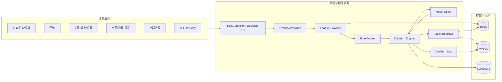

# 风控与信任服务（Risk Control & Trust Service）上线方案（Production）

日期：2026-01-27  
执行者：Codex（Linus-mode）

> 这份文档是对 `社交接口.md` 中“### 5. 风控与信任服务”章节的**实现级补充**：不改变现有用户可见行为，只把“怎么做”讲清楚。

---

## 1. 背景与目标

### 1.1 背景

`社交接口.md` 的“风控与信任服务”目前是概览级描述，而仓库里的 `RiskService` 仍是占位实现（PASS/NORMAL）。这会导致“知道要风控”，但不知道“怎么落地”。

### 1.2 上线定义（你说的“完整可上线”，我把它说清楚）

我这里把“可上线”定义成：不是写个接口就算完，而是**能稳定跑在生产**、出问题能定位、策略能回滚、有人能处理、数据能闭环。

上线必须同时满足：

- 在线决策稳定：有明确延迟与可用性目标（例如 P95 < 50ms，服务可用性 ≥ 99.9%）。
- 处置可执行：拦截/挑战/处罚会真实生效，并且能撤销、能查历史。
- 全链路可追溯：每次决策都有 `decision_log`，能回答“为什么拦了/为什么放了”。
- 策略可灰度可回滚：规则/阈值有版本、有发布流程，出问题能一键回退。
- 异步链路可控：队列积压能告警，失败有 DLQ/重试/补偿，不能悄悄吞。
- 运营可用：必须有后台能力（规则管理、人审工单、处罚管理、查询与报表）。

### 1.3 目标（上线版必须交付的能力）

- 用统一数据结构把所有风控场景（发帖/评论/关注/登录等）拉到同一条链路上，减少 if/else。
- 补齐“决策 → 处置 → 审计 → 人审 → 反馈/申诉”的闭环（上线就要完整闭环）。
- 不破坏现有用户可见接口行为（新增能力只增不改；旧接口可内部重定向到新链路）。
- 设计支持规模化：可水平扩容、可灰度发布、可观测、可回滚。

### 1.4 非目标（上线不等于“自研一切”）

- 不要求你自研 NLP/CV 模型训练平台；识别类能力优先接第三方/独立模型服务（标准化复用优先）。
- 不把所有“风控运营后台”页面细节画成 UI 原型；本文只定义后台需要的核心能力与接口。
- 当前只做“文本 + 图片”；视频以后再做（本文不包含视频审核/转码/抽帧等设计与验收项）。

### 1.5 你的约束（已确认：B,B,B）

- 规模：≥1000 万 DAU，峰值 ≥50k QPS。
- 人审：轻量人审（工作时段 + 抽样），不做 7x24 全量人审兜底。
- 内容识别：必须走自建“LLM 内容风控”，用 Spring AI Alibaba 调用 API（例如 DashScope/Qwen），由 LLM 输出风险信号。

### 1.6 本次上线范围（你已选择：A/A/A，直接写死避免扯皮）

- 接入范围（A）：`/api/v1/risk/decision` **只接入低频写动作**：`PUBLISH_POST/EDIT_POST/COMMENT_CREATE/DM_SEND/LOGIN/REGISTER`。
  `FOLLOW/LIKE` 等高频互动本次不接入统一决策（仍可单独做频控/刷量检测，但不属于本次上线范围）。
- 幂等键（A）：`eventId` **由业务方生成并传入**（风控以 `eventId` 做去重）。同一 `eventId` 的重试必须返回同一 `decisionId`（并且不能重复处罚/重复建工单）。
- 隔离落点（A）：`QUARANTINE` **落在内容域**（帖子/评论以内容状态表达隔离：作者可见、对外不可见、禁止 fanout/扩散）。

---

## 2. Linus 五层分析（我为什么要这么改）

### 2.1 数据结构分析（先把“核心数据”定死）

风控系统最核心的数据不是“接口”，而是：

- **RiskEvent**：一次用户行为/内容（发帖、评论、关注、登录……）
- **RiskDecision**：对该事件的最终结论（放行/拦截/人审/挑战/降权…）
- **RiskAction**：结论要落地执行的动作（封禁、限制、降权、发起审核…）
- **Punishment / Case / Feedback**：处罚、工单（人审）、反馈（标注/申诉）

只要把这些结构统一，所有场景都能走一条路，特殊情况会显著减少。

### 2.2 特殊情况识别（坏设计的味道：到处 if/else）

在社交产品里，风控的“场景”很多：发帖/评论/点赞/关注/私信/注册/登录……  
如果你为每个场景都写一套逻辑，你会得到一堆 if/else 和不可维护的补丁。

好品味的做法：**把所有场景都归一成 RiskEvent，然后用同一套决策引擎跑。**

### 2.3 复杂度审查（本质一句话）

本质只有一句话：

> “把所有可疑行为/内容变成同一种事件，给它一个统一的判断结果，并把结果可靠地执行与记录。”

如果实现需要引入十几个新概念，那就是过度设计。

### 2.4 破坏性分析（Never break userspace）

现有代码里风控对外接口是：

- `POST /api/v1/risk/scan/text`
- `POST /api/v1/risk/scan/image`
- `GET  /api/v1/risk/user/status`

这份方案**不要求改变**这 3 个接口的用户可见行为（只在内部“做得更真”），并且新增能力全部以**新增接口/新增事件**方式扩展。

### 2.5 实用性验证（上线要完整，但也要可维护）

你要的是“上线版”，我同意。但上线版的关键不是“功能堆满”，而是这几件事必须同时成立：

1) 在线决策稳定（低延迟、可扩容、失败可降级）  
2) 处置真实生效（拦截/挑战/处罚/降权，且可撤销）  
3) 审计可追溯（能定位误杀/漏放，能做复盘）  
4) 人审与申诉闭环（否则误杀会把产品口碑打爆）  
5) 策略可灰度回滚（不上灰度，你就等着生产自杀）

---

## 3. 结论

✅ 值得做：  
- 当前风控章节只有“概览”，而代码实现还是占位（PASS/NORMAL），不具备落地指导意义。  
- 用统一数据结构 + 统一决策入口可以显著减少特殊情况，后续迭代成本更低。  
- 这类设计是社交产品必需能力，越晚补越难。

【方案】按顺序：简化数据结构 → 消除特殊情况 → 最清晰实现 → 零意外破坏 → 实用主义优先

---

## 4. 先给 12 岁也能懂的解释（你不用懂代码也能判断对不对）

- **风控**像“门卫 + 老师”：有人想捣乱（发垃圾、刷屏、引流），要么拦住，要么先让他做题验证（挑战），要么交给老师（人审）。
- **规则**像“写在墙上的校规”：出现敏感词、同一分钟发 50 条、同一个设备注册 100 个号，直接处理。
- **模型**像“老师的经验”：不一定能 100% 断定，但会给一个“可疑分数”。
- **决策**是“最终判定”：放行 / 拦截 / 人审 / 验证 / 降权。
- **处罚**是“处罚单”：限制发言 24h、降权 7 天、禁止登录等。
- **闭环**是“记账+复盘”：每次处理都要记录，后面才能知道错没错，才有机会做得更准。

---

## 5. 现状与缺口（基于仓库里的真实代码/文档）

### 5.1 现有接口与占位实现

代码现状（`RiskService`）：

- 文本扫描：永远返回 `PASS` + `clean`
- 图片扫描：只返回 `taskId`
- 用户状态：永远返回 `NORMAL` + `POST/COMMENT`

这意味着：**目前风控没有“决策/处置/审计/反馈”能力。**

### 5.2 文档与代码契约（以代码为准，文档已对齐）

历史上 `社交接口.md` 的风控接口表与代码存在不一致（路径前缀与字段命名）。目前已对齐为：

- 路径前缀：`/api/v1/risk/...`
- 字段命名：camelCase（例如 `imageUrl/taskId/userId`）
- userId 来源：默认来自 `UserContext`（请求里传 `userId` 会被忽略）

结论：**永远以代码契约为准**，文档只做同步说明。

---

## 6. 总体架构（把所有场景变成一条链路）

### 6.1 架构图（Mermaid）



### 6.2 “好品味”的关键点

- **所有入口都先归一成 RiskEvent**（避免每个业务写一套 if/else）。
- 在线链路只做**低延迟**事情；重计算（图片/复杂模型）走异步。
- 任何结论都要**可追溯**（decision log），否则你永远不知道风控为什么“误杀/漏放”。

### 6.3 服务拆分（上线版推荐形态）

为了可扩容、可运维、可隔离故障，建议拆成 3 个可独立部署的组件（都保持无状态，方便水平扩容）：

1) `risk-api`（在线决策服务）
- 提供：`/risk/decision`、`/risk/scan/*`、`/risk/user/status`
- 特点：极低延迟；读 Redis 热数据；写 MySQL 审计日志；必要时投递 MQ

2) `risk-worker`（异步处置与扫描服务）
- 消费 MQ：图片扫描任务、人审路由、处罚落库/刷新缓存、日志同步等
- 特点：吞吐优先；所有消费必须幂等（重复消费不重复处罚/不重复建工单）

3) `risk-admin`（运营与人审后台）
- 提供：规则管理（版本/灰度/回滚）、工单处理、处罚管理、审计查询、报表
- 特点：面向内部人员；和用户侧 API 隔离部署，避免后台把线上拖死

### 6.4 部署与高可用（上线必须回答“挂了怎么办”）

上线必须把“依赖失败时的策略”写死，否则一定在生产争论到崩溃。

建议按动作分级做降级（示例）：

| 动作 | 风控服务不可用时 | 理由 |
| --- | --- | --- |
| 发布/评论/私信（写） | 返回 `REVIEW` 或短暂 `LIMIT` | 宁可放慢写，也不要直接 500 |
| 关注/点赞（轻写） | `PASS + 仅记录` | 避免社交关系被卡死 |
| 登录/注册 | `CHALLENGE` | 账号风险放过一次就很难收回 |

基础 HA 建议（与规模无关）：

- `risk-api`/`risk-worker`：至少 2 副本；无状态；滚动发布
- Redis：主从/集群；热 key 规划与容量上限
- MySQL：主从；审计表分区/归档策略
- RabbitMQ：镜像队列或集群；DLQ 开启；积压告警

---

## 7. 核心数据结构（统一语言，才能统一实现）

> 下面不是“数据库表”，是系统里最重要的**概念结构**。你可以把它理解为“风控系统的身份证”。

### 7.1 RiskEvent（一次行为/内容输入）

| 字段 | 含义 | 示例 |
| --- | --- | --- |
| `eventId` | 本次事件唯一 ID（链路追踪 + 幂等键；业务侧生成） | `evt_123` |
| `userId` | 当前用户 | `10001` |
| `actionType` | 动作类型 | `PUBLISH_POST` / `COMMENT_CREATE` / `LOGIN` |
| `scenario` | 场景（更细粒度） | `post.publish` / `comment.create` |
| `contentText` | 文本内容（可空） | `"hello"` |
| `mediaUrls` | 图片 URL（可空） | `[...]` |
| `targetId` | 目标对象（可空） | `postId/commentId/userId` |
| `ip`/`deviceId` | 风控画像信息 | `1.2.3.4` / `dev_xxx` |
| `occurTime` | 发生时间 | `timestamp` |
| `ext` | 扩展字段（JSON） | 业务补充信息 |

### 7.2 RiskSignal（规则/模型产生的“信号”）

| 字段 | 含义 | 示例 |
| --- | --- | --- |
| `source` | 信号来源 | `RULE` / `MODEL` / `BLACKLIST` |
| `name` | 信号名 | `rate_limit_hit` |
| `score` | 分数（0-1 或 0-100） | `0.93` |
| `tags` | 标签 | `spam/link` |
| `detail` | 细节（JSON） | 命中哪些词/阈值 |

### 7.3 RiskDecision（最终结论）

| 字段 | 含义 | 示例 |
| --- | --- | --- |
| `decisionId` | 决策 ID | `dec_888` |
| `result` | 结果 | `PASS` / `REVIEW` / `BLOCK` / `CHALLENGE` / `SHADOWBAN` / `LIMIT` |
| `actions` | 要执行的动作列表 | `[{type:..., params...}]` |
| `reasonCode` | 可稳定统计的原因码 | `SPAM_RATE_LIMIT` |
| `signals` | 关键信号摘要 | `[...]` |
| `ttlSeconds` | 结果有效期（可选） | `300` |

### 7.4 RiskAction（要执行的动作）

| 动作类型 | 用途 | 备注 |
| --- | --- | --- |
| `ALLOW` | 放行 | 默认 |
| `BLOCK` | 直接拦截 | 给出原因码 |
| `REVIEW_CREATE` | 创建人审工单 | 投递 MQ |
| `CHALLENGE` | 触发挑战（滑块/验证码等） | 可复用挑战服务 |
| `PUNISH` | 写处罚（禁言/禁登/降权） | 落 MySQL + 刷 Redis |
| `DEGRADE_VISIBILITY` | 降权/影子禁言/隔离发布 | `QUARANTINE` 落内容域（用 `PENDING_REVIEW` 表示）；`SHADOWBAN` 由分发域读取标记执行 |
| `RATE_LIMIT` | 频控 | 可用 Redis 窗口计数 |

---

## 8. 在线决策流程（核心链路，必须低延迟）

### 8.1 决策流程图（Mermaid）

```mermaid
flowchart TD
  A[收到 RiskEvent] --> B{用户是否在处罚中?}
  B -- 是 --> X[直接返回 BLOCK/LIMIT]
  B -- 否 --> C[取实时特征: 计数/名单/历史]
  C --> D[规则引擎评估]
  D --> E{需要模型吗?}
  E -- 否 --> F[聚合信号 -> RiskDecision]
  E -- 是 --> M[调用模型评分(文本/行为)]
  M --> F
  F --> G[记录 decision_log]
  F --> H{是否需要异步任务?}
  H -- 是 --> Q[投递 MQ: imageScan/review/punish]
  H -- 否 --> R[返回给业务方]
  Q --> R
```

### 8.2 在线链路的硬约束（否则你会被业务拖死）

- **P95 延迟目标**：建议写进验收：`< 50ms`（不含外部大模型调用）。
- **禁止在线做重计算**：图片审核必须异步；在线最多做“黑库命中”或轻量指纹。
- **LLM 调用原则（按 50k QPS 现实约束）**：在线接口不等待外部 LLM 返回；LLM 只用于异步扫描/抽样复核，或用于“隔离态发布（quarantine）”的后置放行。
- **所有结果必须落日志**：否则无法定位误杀，也无法做迭代。

### 8.3 接入矩阵（B：50k QPS + LLM 风控的现实做法）

一句话：**只在“内容写入”这种低频但高风险动作上使用 LLM，且不阻塞在线接口；高频动作用规则/特征直接判。**

| actionType | 是否走统一决策 `/risk/decision` | 是否等待 LLM | 推荐策略（结果如何落地） |
| --- | --- | --- | --- |
| `PUBLISH_POST` / `EDIT_POST` | 是 | 否 | 返回 `PASS/BLOCK/REVIEW`；当需要隔离时用 `RiskAction=DEGRADE_VISIBILITY(visibility=QUARANTINE)`，异步 LLM 通过后再放行 |
| `COMMENT_CREATE` | 是 | 否 | 规则先判；不确定则 `REVIEW + QUARANTINE`（仅作者可见）+ 异步 LLM |
| `DM_SEND`（私信） | 是 | 否 | 规则 + 轻量模型；命中高风险直接 BLOCK；其余抽样 LLM 复核（避免成本爆炸） |
| `LOGIN/REGISTER` | 是 | 否 | 不靠 LLM；用设备/IP/行为特征决定 `PASS/CHALLENGE/LIMIT` |
| `FOLLOW/LIKE` 等高频互动 | 否（v0 不接入） | 否 | 不走 `/risk/decision`；如需治理仅做频控/刷量检测（独立链路） |

### 8.4 QUARANTINE（隔离）落地定义（你已选择：内容域）

- 文档里的 `QUARANTINE` 是业务语义；在内容域统一用 `PENDING_REVIEW` 表达（不要再造一个新枚举）。
- 对帖子/评论：内容会写入数据库，但对外不可见（Feed/搜索/他人主页都过滤）；作者自己可见并显示“待审核”；禁止 fanout/扩散。
- 状态推进：异步 LLM / 人审 `PASS` => `PENDING_REVIEW -> PUBLISHED` 并触发 fanout；`BLOCK` => `REJECTED`（并按规则处罚）；`REVIEW` => 保持 `PENDING_REVIEW` + 创建工单。
- DM：v0 不做 `QUARANTINE`（体验太怪）；高风险直接 `BLOCK`，不确定走 `CHALLENGE/LIMIT` 或抽样复核。

---

## 9. 异步链路（把“慢”丢到后台）

### 9.1 图片异步扫描

- 在线只返回 `taskId` 或 `REVIEW`，把任务投递到 MQ。
- Worker 做真实扫描，得到结果后：
  - 更新 `decision_log`（补充扫描结果）
  - 必要时写处罚 `risk_punishment`
  - 触发下游（例如内容下架、作者降权）

### 9.2 人审工单（Review Case）

风控结论是 `REVIEW` 时：

1) 创建 `risk_case`（或直接投递 review 队列）  
2) 人审系统/后台完成审核  
3) 回写结果（PASS/BLOCK）与标注（Feedback）  
4) 反馈进入标注库/训练集（用于模型评估与迭代）

### 9.3 人审容量策略（B：工作时段 + 抽样）

人审能力是“稀缺资源”，你选了 B，就必须把策略写死：

- **只审两类**：  
  1) 高风险但不够证据自动封禁（需要人确认）  
  2) 申诉（appeal）  
- **抽样审低风险**：对 PASS 的内容按比例抽样进“抽检队列”，用于评估规则/模型质量（不是为了拦截）。  
- **队列满的处理**：review 队列达到阈值时，不再继续入队，直接降级为：  
  - `REVIEW -> 仅记录`（不入队）  
  - 或 `REVIEW -> QUARANTINE`（内容对外不可见，等待人工工作时段处理）  
  两者必须可配置，且默认不要把队列打爆。

---

## 10. API 契约（以代码为准，新增能力只增不改）

> 现有对外 `Response<T>` 包装沿用项目约定，这里只描述业务字段。

### 10.1 现有接口（保持不破坏）

1) `POST /api/v1/risk/scan/text`  
用途：同步文本扫描（本质是 `RiskDecision` 的一个场景）。  
请求（建议）：`content`, `scenario`（userId 来自登录态）。  
响应：`result` + `tags`（未来可扩展 reasonCode）。

2) `POST /api/v1/risk/scan/image`  
用途：异步图片扫描。  
请求：`imageUrl`（userId 来自登录态）。  
响应：`taskId`。

3) `GET /api/v1/risk/user/status`  
用途：查询用户当前状态与能力（是否能发帖/评论等）。  
响应：`status` + `capabilities`。

### 10.2 新增统一接口（上线必备，推荐业务接入点）

#### `POST /api/v1/risk/decision`

请求字段（核心）：

| 字段 | 必填 | 说明 |
| --- | --- | --- |
| `eventId` | 是 | 业务侧生成的事件 ID（幂等键；同一 `eventId` 重试必须返回同一 `decisionId`） |
| `actionType` | 是 | `PUBLISH_POST` / `EDIT_POST` / `COMMENT_CREATE` / `DM_SEND` / `LOGIN` / `REGISTER` |
| `scenario` | 是 | `post.publish` / `comment.create` ... |
| `contentText` | 否 | 文本内容 |
| `mediaUrls` | 否 | 媒体列表 |
| `targetId` | 否 | 目标对象 |
| `ext` | 否 | 扩展信息（JSON） |

响应字段（核心）：

| 字段 | 说明 |
| --- | --- |
| `decisionId` | 决策 ID（用于追溯） |
| `result` | PASS/REVIEW/BLOCK/CHALLENGE/SHADOWBAN/LIMIT |
| `actions` | 需要业务执行的动作（例如前端弹挑战/业务拒绝） |
| `reasonCode` | 可统计原因码 |
| `signals` | 命中信号摘要（可选对外裁剪） |

#### 10.2.1 幂等与 eventId（上线必须写死）

- `eventId` 是这次动作的“收据号”：业务方先生成，再调用风控；同一 `eventId` 的重试必须返回同一 `decisionId/result`（不能重复处罚/重复建工单）。
- 建议幂等键：`(userId, eventId)`；如果同一键的请求体不一致，直接当作上游 bug（拒绝或打高优先级告警，别“容错”掩盖问题）。
- v0 推荐映射（示例）：

| actionType | eventId（业务生成） | targetId（可选） |
| --- | --- | --- |
| `PUBLISH_POST` | `postId` | - |
| `EDIT_POST` | `editAttemptId`（不要用 postId，否则第二次编辑会被当成重试） | `postId` |
| `COMMENT_CREATE` | `commentId` | `postId` |
| `DM_SEND` | `messageId` | `peerUserId/threadId`（按业务） |
| `LOGIN` | `loginAttemptId` | - |
| `REGISTER` | `registerAttemptId` | - |

> 注意：**这是“统一入口”**。你以后新增“私信/直播/发帖”等场景，只需要新增 actionType/scenario，不需要再造新接口。

### 10.3 运营与人审后台接口（risk-admin，上线必备）

线上风控不是“写个拦截接口”就结束了，运营/人审没有后台=系统不可用。

下面给一组最小但完整的后台接口契约（示例路径，可按项目风格调整；建议与用户侧 API 分服务部署）：

1) 规则/策略管理

| 接口 | Method | Path | 作用 |
| --- | --- | --- | --- |
| 创建/更新规则版本 | POST | `/api/v1/risk/admin/rules/versions` | 保存 `rules_json`，生成新 version |
| 查询规则版本列表 | GET | `/api/v1/risk/admin/rules/versions` | 列表 + 当前生效版本 |
| 发布规则版本 | POST | `/api/v1/risk/admin/rules/versions/{version}/publish` | 生效/灰度（shadow/canary 参数） |
| 回滚规则版本 | POST | `/api/v1/risk/admin/rules/rollback` | 一键回到上一个稳定版本 |

2) 人审工单

| 接口 | Method | Path | 作用 |
| --- | --- | --- | --- |
| 查询工单 | GET | `/api/v1/risk/admin/cases` | 按 `status/queue/time` 过滤 |
| 领取/分配工单 | POST | `/api/v1/risk/admin/cases/{caseId}/assign` | 指派审核人 |
| 提交审核结论 | POST | `/api/v1/risk/admin/cases/{caseId}/decision` | PASS/BLOCK + 处罚建议 |

3) 处罚管理

| 接口 | Method | Path | 作用 |
| --- | --- | --- | --- |
| 施加处罚 | POST | `/api/v1/risk/admin/punishments/apply` | 写 `risk_punishment` 并刷新 Redis |
| 撤销处罚 | POST | `/api/v1/risk/admin/punishments/revoke` | 撤销并留痕 |
| 查询用户处罚 | GET | `/api/v1/risk/admin/punishments` | 按 userId/time/type 查询 |

4) 审计查询与申诉

| 接口 | Method | Path | 作用 |
| --- | --- | --- | --- |
| 查询决策日志 | GET | `/api/v1/risk/admin/decisions` | 按 userId/scene/result 查询 |
| 用户发起申诉 | POST | `/api/v1/risk/appeals` | 用户侧入口（写入 `risk_feedback`） |
| 后台处理申诉 | POST | `/api/v1/risk/admin/appeals/{appealId}/decision` | 通过则撤销处罚并回写反馈 |

---

## 11. 事件契约（RabbitMQ：让异步链路可维护）

推荐事件（示例命名，最终需对齐现有 MQ 命名规范）：

| 事件 | 触发时机 | 主要字段 |
| --- | --- | --- |
| `RiskDecisionMade` | 每次决策都发（可采样） | `decisionId,eventId,userId,actionType,result,reasonCode` |
| `ImageScanRequested` | 需要异步图片扫描 | `taskId,decisionId,userId,imageUrl` |
| `LlmScanRequested` | 需要异步 LLM 内容扫描 | `taskId,decisionId,userId,scenario,textHash` |
| `ReviewCaseCreated` | result=REVIEW | `caseId,decisionId,queue,summary` |
| `PunishmentApplied` | 写处罚成功 | `punishId,userId,type,start,end` |

原则：

- **事件只做“事实广播”**（发生了什么），不要把下游业务逻辑塞进去。
- 对于高频事件（每次决策都发），建议 **采样** 或拆成“全量落库 + 采样上报”。

### 11.1 事件总线分工（按 50k QPS 推荐，不要一把梭）

在大规模场景里，“消息系统”不要承担所有职责：

- **RabbitMQ**：更适合做“工作队列”（异步扫描任务、人审工单、处罚执行），需要明确的 ACK/重试/DLQ 语义。
- **Kafka**：更适合做“事件日志”（高吞吐、可回放），用于风控日志汇总、特征流式计算、离线训练与评估。

落地建议：`RiskDecisionMade` 可同时落 MySQL 审计 + 采样上 Kafka；`LlmScanRequested/ImageScanRequested/ReviewCaseCreated` 走 RabbitMQ。

---

## 12. 存储设计（上线必备 + 可选扩展）

### 12.1 Redis（热数据）

用途：低延迟查询（处罚状态、滑动窗口计数、黑白名单）。

建议 key（示例）：

- `risk:status:{userId}` -> 当前状态 + 可用能力（短 TTL + 处罚变更时主动刷新）
- `risk:cnt:{userId}:{actionType}:{window}` -> 计数（例如 60s/10m 窗口）
- `risk:blacklist:ip` / `risk:blacklist:device` -> Set
- `risk:llm:cache:{textHash}` -> LLM 扫描结果缓存（JSON，TTL 可按场景设置）
- `risk:llm:budget:{yyyyMMddHHmm}` -> 分钟级预算计数器（超额触发降级）
- `risk:llm:inflight:{textHash}` -> 去重锁（避免同文本并发重复调用 LLM）

### 12.2 MySQL（事实数据 + 审计 + 运营）

上线版不接受“只做 Redis + 不落库”的玩法，否则你连误杀都解释不清楚。

上线必备表（建议至少 4 张）：

1) `risk_punishment`（处罚事实表，已有草案）
- 作用：判断用户当前是否被禁言/禁登/降权，以及处罚到期自动失效。

2) `risk_decision_log`（审计日志）
- 字段建议：`decision_id, event_id, user_id, action_type, scenario, result, reason_code, signals_json, create_time, trace_id`
- 作用：回答“为什么拦截/为什么放行”，并支撑报表与复盘。

3) `risk_case`（人审工单）
- 字段建议：`case_id, decision_id, status, queue, assignee, result, create_time, update_time, evidence_json`
- 作用：REVIEW 结论的承接；没有它，人审就只能靠“群聊拍脑袋”。

4) `risk_rule_version`（规则/策略版本）
- 字段建议：`version, status, rules_json, create_time, publish_by, publish_time`
- 作用：灰度与回滚的基础设施（没有版本就谈不上上线）。

可选增强（上线后极其常用）：

- `risk_feedback`：用户申诉/反馈与人工标注（训练与评估的真值来源）。
- `risk_list`：黑白名单（IP/设备/用户/内容），带来源与过期时间。

### 12.3 海量审计查询（ClickHouse/Elasticsearch，可选但强烈建议）

- 如果你要“运营/风控同学随便查”，MySQL 很快就会被审计查询拖死。
- 推荐做法：`risk_decision_log` 异步同步到 ClickHouse（聚合分析）+ Elasticsearch（关键词检索）。

---

## 13. 规则体系（上线版：规则是第一生产力）

上线风控的真相：**规则永远在前，模型永远在后**。模型是加分项，规则是生存项。

### 13.1 规则分类（社交产品上线必须覆盖）

1) 内容类（Content Safety）
- 文本：敏感词、引流链接、辱骂仇恨、诈骗话术（命中即 BLOCK/REVIEW）
- 图片：黑库命中（直接 BLOCK）、疑似（REVIEW + 异步扫描）

2) 行为类（Abuse / Spam）
- 频控：同一分钟评论/关注/私信次数异常（LIMIT/CHALLENGE）
- 重复：同内容重复发布、同链接重复发（LIMIT/REVIEW）

3) 账号/设备类（Account / Device）
- 新号冷启动：新注册短时间内高频操作（CHALLENGE/LIMIT）
- 设备指纹异常：同设备批量注册/批量操作（BLOCK/LIMIT）

4) 社交图谱类（Graph）
- 关注刷量：短时间大量 follow/unfollow（LIMIT/REVIEW）
- 群体异常：同一批账号互相关注/互相点赞（REVIEW，交给异步分析）

5) 举报/申诉类（Trust Workflow）
- 举报命中阈值：进入 REVIEW 队列，形成 case
- 申诉通过：撤销处罚并记录反馈（否则你永远学不会）

### 13.2 规则定义模型（可配置、可版本化、可回滚）

规则不是写死在代码里的 if/else；它必须是“数据”，才能发布与回滚。

建议用一个最简单但可扩展的结构：

- `ruleId`：规则编号（稳定）
- `scenario`：适用场景（例如 `post.publish` / `comment.create`）
- `priority`：优先级（越小越先执行）
- `when`：条件（字段 + 运算符 + 阈值）
- `then`：动作（BLOCK/REVIEW/LIMIT/CHALLENGE/PUNISH）
- `reasonCode`：原因码（用于统计与对外提示）
- `shadow`：是否只记录不生效（灰度开关）
- `enabled`：是否启用

示例（伪结构，便于理解）：

```text
rule: SPAM_COMMENT_RATE_LIMIT
scenario: comment.create
priority: 10
when: cnt_60s(userId, comment.create) > 20
then: LIMIT (ttl=600s)
reasonCode: SPAM_RATE_LIMIT
```

### 13.3 规则执行顺序（消灭特殊情况）

统一执行顺序（所有场景都一样）：

1) 处罚/黑名单硬拦截（最快，直接返回）
2) 频控/重复检测（Redis 计数器）
3) 内容规则（敏感词/链接/格式）
4) 需要时才调用模型/异步扫描（慢的放后面）
5) 聚合为 `RiskDecision`，再生成 `RiskAction` 执行

### 13.4 规则管理后台（上线必需）

后台必须具备：

- 规则 CRUD、版本发布、灰度（shadow/canary）、一键回滚
- 命中统计：每条规则命中次数、拦截率、人审率
- 审计：谁在什么时候发布了什么规则版本（否则线上事故无法追责与复盘）

### 13.5 特征平台（Feature Store，上线建议具备）

如果你要“可解释 + 可迭代”，特征必须有统一口径。否则今天上线一个规则，明天换个模型，全都对不上。

推荐直接复用成熟方案（例如 Feast）：

- **Entity**：`userId`、`deviceId`、`ip`、`contentId`
- **Online Store**：Redis（低延迟在线特征）
- **Offline Store**：ClickHouse/Hive（训练与回放）
- **Feature 定义**：用代码/配置声明（避免口口相传）

典型特征例子（给你理解用）：

- `user.comment_cnt_60s`：用户 60 秒评论次数（在线）
- `device.register_cnt_1d`：设备 1 天注册次数（离线/准实时）
- `user.appeal_accept_rate_7d`：用户 7 天申诉通过率（离线）

### 13.6 模型服务（Model Serving，上线可接入/可替换）

上线版允许两种来源（都算“可上线”，区别只是成本与速度）：

1) **第三方内容安全**（文本/图片）：最快，稳定，但可定制度有限  
2) **自有模型服务**：更可控，但需要模型训练/部署/监控体系

无论哪种来源，风控服务只认一个稳定接口：输入 `RiskEvent`/特征，输出 `RiskSignal(score,tags)`，再由 `Decision Engine` 聚合成最终结论。

### 13.7 LLM 内容风控（B：Spring AI Alibaba 调用 API）

你选了 B=“必须用 LLM 做内容风控”，那上线版必须把 **LLM 当成一个会失败、会超时、会涨价** 的外部依赖来设计。

#### 13.7.1 为什么不能把 LLM 放进在线阻塞链路（50k QPS 的现实）

- 外部 LLM 调用的延迟与抖动不可控；你一旦在线等待它，业务就会被拖死。
- 成本不可控；不做预算与采样，费用会把产品烧穿。

结论：LLM 做“内容识别信号”，但 **不阻塞在线接口**。在线只做：预检/规则/频控/处罚状态。LLM 在异步链路补齐“理解能力”。

#### 13.7.2 推荐落地方式：risk-worker 异步 LLM 扫描

1) 业务写入（发帖/评论/私信；文本/图片）先调用 `/api/v1/risk/decision` 获取初判：  
- `PASS`：放行，但仍可异步抽检  
- `BLOCK`：直接拒绝  
- `REVIEW`：返回“隔离动作” `DEGRADE_VISIBILITY(visibility=QUARANTINE)`，内容对外不可见，等待异步 LLM 结果再放行/处置  

2) risk-api 投递 MQ：`LlmScanRequested`（或复用 `RiskDecisionMade` + flags）  
3) risk-worker 消费任务，调用 LLM（文本：文本模型；图片：多模态模型或 OCR+文本模型），产出 `RiskSignal(source=LLM, score, tags, reasonCode, evidence)`  
4) risk-worker 回写：更新 `risk_decision_log`，必要时创建 `risk_case` 或写处罚 `risk_punishment`，并刷新 Redis 状态  

#### 13.7.3 Spring AI Alibaba 集成（以 DashScope 为例）

来自 Spring AI Alibaba 官方 README 的依赖示例（版本号以实际选型为准）：  
https://raw.githubusercontent.com/alibaba/spring-ai-alibaba/main/README.md

```xml
<dependency>
  <groupId>com.alibaba.cloud.ai</groupId>
  <artifactId>spring-ai-alibaba-starter-dashscope</artifactId>
  <version>1.1.0.0</version>
</dependency>
```

环境变量（示例）：`AI_DASHSCOPE_API_KEY=your-api-key`。

#### 13.7.4 LLM 输出契约（必须结构化，否则不可运维）

LLM 必须返回 JSON（禁止自然语言），示例字段：

```json
{
  "contentType": "TEXT|IMAGE",
  "result": "PASS|REVIEW|BLOCK",
  "riskTags": ["spam", "ad", "hate", "fraud", "porn", "violence", "qr_code"],
  "confidence": 0.0,
  "reasonCode": "TEXT_SPAM_LLM",
  "evidence": "命中原因的简短摘录（可选）",
  "suggestedAction": "ALLOW|QUARANTINE|BLOCK"
}
```

说明：

- `contentType` 用于路由与日志统计（TEXT/IMAGE）；对旧接口不强制（旧接口只取它关心的字段）。
- `result` 用于映射现有 `TextScanResponseDTO.result`（PASS/BLOCK/REVIEW）。
- `riskTags` 用于映射现有 `TextScanResponseDTO.tags`。
- `reasonCode` 必须稳定（用于统计与回滚定位）。
- `confidence` 用于阈值策略（例如 >0.95 才允许自动处罚）。

#### 13.7.5 图片风控（只做图片；两条标准路线，别自研）

先说结论：图片永远是“慢且贵”的输入，所以**只走异步**。在线链路最多做：pHash/黑库命中（毫秒级）。

落地你只有两条路线（都可上线）。你已经选择了 **1) 多模态 LLM**，2) 仅作为备用兜底：

1) **多模态 LLM（已选）**  
- risk-worker 取 `mediaUrls`（图片 URL），把图片喂给支持图片输入的多模态模型（例如同一供应商的 VLM 能力）。  
- 输出仍然用第 13.7.4 的 JSON 契约（`contentType=IMAGE`，`reasonCode=IMAGE_*`）。  

2) **OCR + 文本 LLM（备用兜底）**  
- risk-worker 先调用 OCR（第三方即可）把图片里的文字提取出来（`ocrText`）。  
- 把 `ocrText + 场景(scenario) + 用户上下文(ext)` 交给文本 LLM 做分类与打标。  
- 同样输出第 13.7.4 的 JSON（`contentType=IMAGE`，`evidence` 可写 OCR 摘要）。  

两条路线都必须做的“上线级细节”：

- **去重缓存**：用 `pHash`（或内容 hash）做 key，TTL 内同一张图不重复扫（成本会差一个数量级）。  
- **处置落地**：如果初判给了 `QUARANTINE`，异步 LLM `PASS` 才放行对外可见；`BLOCK/REVIEW` 则按规则处罚/建工单。  
- **接口语义不变**：`/api/v1/risk/scan/image` 仍然只返回 `taskId`；图片最终结论落在 `risk_decision_log`/处罚表，并通过异步任务驱动业务处置。  

#### 13.7.6 提示词与版本化（上线必需）

- prompt 必须有版本号（`promptVersion`），并写入 `risk_decision_log`，否则你无法比较“改 prompt 前后效果”。
- prompt 内容要做到：  
  1) 明确分类标准（spam/ad/hate/fraud 等）  
  2) 强制 JSON 输出  
  3) 不要输出用户隐私与无关内容

#### 13.7.7 成本与稳定性控制（否则 B 会把你烧穿）

- **预算器（Budget Guard）**：按分钟/按场景限制 LLM 调用量；超过预算直接降级为“只规则 + 隔离/抽样”。  
- **缓存（Dedup Cache）**：同一段文本（hash）/同一张图片（pHash）在 TTL 内不重复扫。  
- **熔断与降级**：LLM 超时/失败时，发帖/评论走 `REVIEW+QUARANTINE` 或 “只记录不拦截”（可配置）；高频动作永不等待 LLM。  

---

## 14. 灰度、回滚与“影子生效”（上线必走，不是可选项）

你不能要求我“上线就全量开闸”。风控全量开闸=生产事故制造机。

上线建议顺序（每一步都有回滚开关）：

1) **Shadow**：全量记录 `decision_log`，但不拦截（先把数据链路跑稳）。  
2) **Canary**：按场景 + 小流量开启硬规则（处罚状态/极端频控/黑库命中）。  
3) **Ramp-up**：逐步扩大覆盖范围与阈值强度，观测误杀率与申诉量。  
4) **Review 接入**：REVIEW 才进入工单队列；队列满则自动降级为“只记录不入队”。  
5) **自动处罚**：只对“高置信度”规则/模型输出执行处罚，其余仍走 REVIEW。  
6) **模型灰度**：模型输出必须可开关、可版本回滚（模型升级不许直接覆盖线上）。  

---

## 15. 可观测性（没有指标就等于没有风控）

上线必须指标（没有这些就别上线）：

- 决策量：`decision_total{actionType,result}`
- 拦截率：`block_rate`、人审率：`review_rate`
- 延迟：`decision_latency_p95`
- 队列积压：`mq_lag{queue}`
- 处罚量：`punishment_total{type}`
- 申诉与误杀信号：`appeal_total`、`appeal_accept_rate`（申诉通过率越高，说明误杀越严重）
- 规则/模型版本效果：`hit_total{ruleId}`、`hit_total{modelVersion}`（用于定位是哪条规则/哪个版本把人打死）

---

## 16. 上线验收（Production：不通过就不允许开闸）

### 16.1 功能闭环（必须同时成立）

- 统一入口：`POST /api/v1/risk/decision` 能覆盖核心动作（发帖/评论/关注/登录/私信），并返回可执行的 `RiskDecision/RiskAction`。
- 处置生效：`PUNISH/LIMIT/SHADOWBAN` 能真实影响业务（例如发帖被拦、评论被限、分发被降权）。
- 审计可查：每次决策都有 `risk_decision_log`，能按 `userId/decisionId/eventId` 查询。
- 人审可跑：REVIEW 会创建 `risk_case` 并进入队列；处理结果能回写并触发处置/撤销。
- 申诉可用：用户能发起申诉；申诉通过会撤销处罚并留下 `risk_feedback`。

### 16.2 稳定性与性能（必须量化）

- 延迟：在线决策 P95/P99 达标（把目标写死在这里，不达标不准上线）。
- 降级：外部依赖失败（模型/第三方审核/队列积压）时，不允许把业务主链路拖死；要么降级为 REVIEW，要么只记录不拦截（可配置）。
- 幂等：重复请求不会重复处罚/重复建工单（靠 `eventId/decisionId` 做去重）。
- 数据保底：Redis 丢数据时，不会产生“永远封禁/永远放行”的不可逆错误；以 MySQL 事实表为准可重建。

### 16.3 治理与运维（必须具备）

- 规则发布：规则/阈值有版本，有灰度，有一键回滚，有发布审计。
- 指标告警：至少覆盖第 15 章指标；队列积压、误杀信号（申诉通过率）、延迟超标必须告警。
- 值班与预案：有最小 runbook（如何关开关、如何回滚版本、如何暂停处罚、如何清队列）。

### 16.4 上线前检查清单（按顺序执行）

1) 数据库：建表/索引完成；关键表写入与查询压测通过。  
2) Redis：热 key TTL 策略明确；容量评估（窗口计数/名单）有上限与淘汰。  
3) MQ：exchange/queue/DLQ 声明完成；消费者并发与重试策略明确；积压告警已开。  
4) 开关：Shadow/Canary/Rollback 开关都能远程控制（配置中心或数据库版本表）。  
5) 演练：至少演练一次“误杀暴增如何止血”（关处罚/关拦截/只记录）。  

---

## 17. 参考资料（公开可访问）

> 我只借鉴“模式”，不抄具体实现细节。

1) AWS Fraud Detector：模型评分 + 决策逻辑 + outcome（PASS / review 等）  
https://docs.aws.amazon.com/frauddetector/latest/ug/what-is-frauddetector.html

2) Feast Feature Store：离线/在线特征存储，用于低延迟实时预测与一致训练  
https://docs.feast.dev/

3) Cloudflare Bot solutions：识别并缓解自动化流量，提供挑战/拦截等手段  
https://developers.cloudflare.com/bots/

---

## 18. 实施步骤（把方案做成可上线系统）

> 你已选择：图片风控 = **多模态 LLM**（Spring AI Alibaba 调用 DashScope/Qwen-VL 等支持图片输入的模型）。视频不在当前范围。

### 18.1 交付顺序（先跑通闭环，再做灰度放量）

1) **先定契约**：统一决策接口 + 事件契约 + reasonCode 口径先定死（否则后面全是扯皮）。  
2) **先落数据**：`decision_log/case/punishment/rule_version/prompt_version` 建表与索引（先能追溯，才敢上线）。  
3) **先稳在线**：`/api/v1/risk/decision` 只做预检/规则/审计落库；**绝不等待 LLM**。  
4) **再补异步**：risk-worker 图片扫描流水线（取图 -> 去重 -> 预算/熔断 -> LLM -> 回写 -> 处置）。  
5) **再接业务**：内容发布“带图默认隔离（PENDING_REVIEW）”，LLM PASS 后放行并 fanout；BLOCK 下架/处罚；REVIEW 建工单。  
6) **再做运营**：工单/处罚/审计查询最小后台 + PASS 抽检策略（工作时段 + 抽样）。  
7) **最后开闸**：Shadow -> Canary -> Ramp-up（每一步都有回滚开关与止血预案）。  

### 18.2 任务拆解（每项 1-2 天，可分配给开发）

> 下面每一步都能独立验收；依赖关系按“先后顺序”写死，避免并行踩踏。

1) **定义统一风控决策契约（/api/v1/risk/decision）**  
产出：`RiskDecisionRequestDTO/RiskDecisionResponseDTO/RiskActionDTO` + `IRiskApi.decision(...)`。  
依赖：无。  
验收：`mvn -DskipTests package` 通过；DTO 字段 camelCase；`社交接口.md` 风控接口表字段一致。

2) **落地风控核心表结构（decision_log/case/punishment/rule_version/prompt_version）**  
产出：`project/nexus/docs/social_schema.sql` 追加 DDL + 索引。  
依赖：无。  
验收：本地 MySQL 执行 DDL 无错误；按 `userId/time/decisionId` 可高效查询。

3) **实现风控存储层（MyBatis Mapper + Repository）**  
产出：risk_* 表的 entity/mapper/repository（最小 CRUD：decision_log/case/punishment/rule/prompt）。  
依赖：步骤 2。  
验收：`mvn -DskipTests package` 通过；可插入 decision_log / 创建 case / 写处罚并查询。

4) **实现在线决策入口 /api/v1/risk/decision（不阻塞 LLM）**  
产出：`RiskController` 增加 `/decision`；domain 侧决策服务（处罚预检 + 规则评估 + 聚合 + 写 decision_log + 投递异步扫描任务）。  
依赖：步骤 1、3。  
验收：`/risk/decision` 在不启用 LLM 的情况下可返回 `PASS/REVIEW/BLOCK`；decision_log 有记录；在线延迟不因 LLM 抖动变差。

5) **新增 RabbitMQ 拓扑与事件契约（LlmScanRequested/ScanCompleted）**  
产出：`social.risk` exchange + `risk.llm.scan.queue` 独立队列 + DLQ；事件类（JSON）。  
依赖：步骤 1。  
验收：启动后队列自动声明；投递一条 `LlmScanRequested` 能被消费端收到（日志可见）；坏消息进 DLQ 不吞。

6) **实现 risk-worker 图片多模态 LLM 扫描流水线**  
产出：consumer（取图/超时/最大尺寸）+ Redis 去重缓存（hash/pHash）+ 预算器/熔断降级 + Spring AI Alibaba 调用多模态模型 + JSON 解析与落库。  
依赖：步骤 3、5。  
验收：发一条带 `imageUrl` 的扫描任务后能写回 decision_log；LLM 失败走降级/重试/DLQ，不会卡死消费线程。

7) **内容发布接入风控：带图发布默认隔离（PENDING_REVIEW）+ 投递扫描任务**  
产出：`ContentService.publish` 不再调用占位 `contentRiskPort.scanMedia`；改为统一决策并对“带图”执行隔离发布。  
依赖：步骤 4、5。  
验收：发布带图内容返回 `PENDING_REVIEW`（或等价状态）；内容对外不出现在 timeline；作者可查到发布 attempt 审计。

8) **扫描结果回写业务处置：PASS 放行并 fanout；BLOCK 下架/处罚；REVIEW 建工单**  
产出：risk-worker 将 LLM 结果转成真实业务动作（幂等、不重复处罚、不重复推进状态）。  
依赖：步骤 6、7。  
验收：同一 postId：`PENDING_REVIEW -> PASS` 后出现在 timeline；BLOCK 后不出现在 timeline 且处罚/日志可查；重复消费不重复推进。

9) **人审/运营最小后台接口（cases/punishments/decisions）+ 抽检策略**  
产出：工单列表/分配/结论回写；处罚施加/撤销；决策日志查询；PASS 抽检进入人审（工作时段+抽样）。  
依赖：步骤 3、4。  
验收：能创建/查询/分配/结案 case；处罚能影响在线预检；抽检比例开关生效；队列满自动降级为“只记录”。

10) **上线开关与验证：Shadow/Canary 配置项 + 指标埋点 + 压测/验收用例**  
产出：配置项（LLM 开关/预算/并发/超时/隔离开关/自动处罚开关）+ 指标（决策量/延迟/队列积压/LLM 成功率）+ 演练用例。  
依赖：步骤 4、6、9。  
验收：关键开关可切换且生效；指标可观测；按第 16 章验收项跑通并能手动止血。
